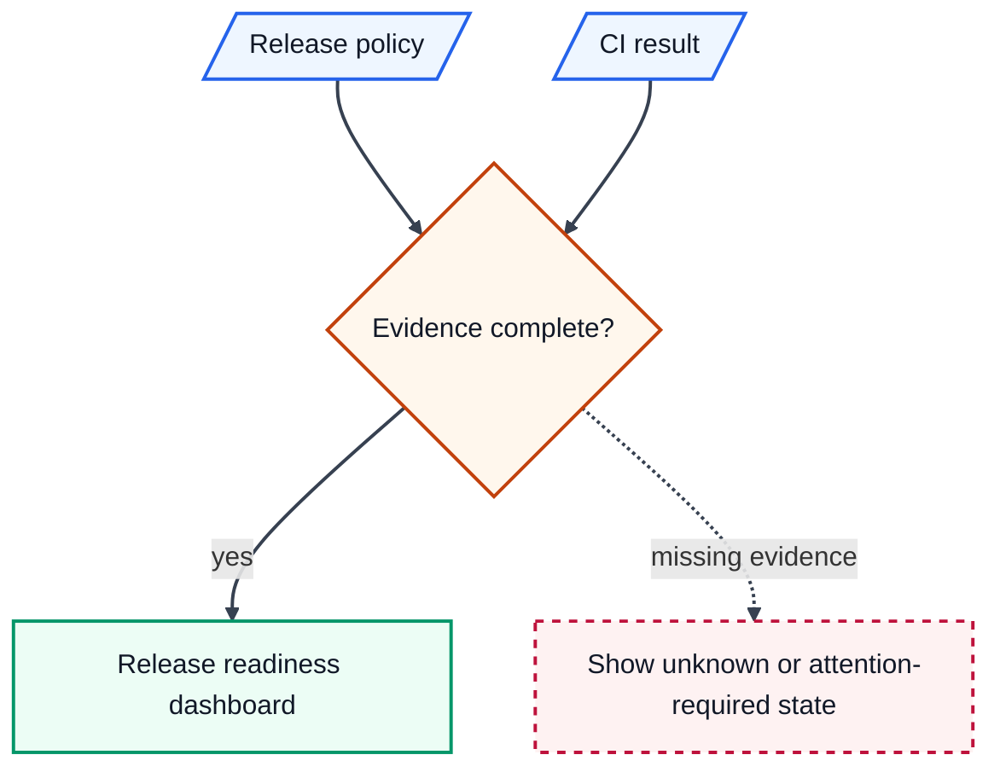

# Portable Example: Release Readiness Flow

## Scenario

A team wants a small Mermaid diagram that explains how release evidence moves
from source documents to a reader-facing dashboard.

## Skill Role

Use `mermaid-diagrams` to define the claim boundary, choose the diagram type,
write Mermaid source, and record validation expectations.

## Example Inputs

- `<PROJECT_ROOT>`: target repository root.
- `<PROJECT_AUTHORITY>`: release policy and CI configuration.
- `<DIAGRAM_SOURCE_PATH>`: documentation page or `.mmd` file.
- `<VALIDATION_COMMAND>`: target project Mermaid or documentation validator.

## Visual Grammar

- Source artifacts use document-shaped nodes and the `source` class.
- The validation gate uses a diamond and the `decision` class.
- The dashboard output uses the `target` class.
- Solid arrows show required evidence flow.
- The dashed arrow shows a warning path that does not equal approval.

## Example Mermaid Source

## Validation

- Confirm source documents support each node and edge.
- Confirm the first semantic Mermaid line is `flowchart TD`.
- Render with the target project's Mermaid command when available.
- Run `<VALIDATION_COMMAND>` if the target project defines one.
- Inspect the rendered output for readable labels and sufficient contrast.

## Adaptation Notes

Replace the example palette, source paths, and validation command with the
target project's documented style and tooling. Do not treat this example's
colors or release scenario as a required project convention.
