# Plantuml Diagrams - sys-for-ai-dev Runtime Adaptation

Canonical skill ID: `plantuml-diagrams`  
Canonical runtime path: `.agents/skills/plantuml-diagrams`  
Compatibility shim path: `.codex/skills/plantuml-diagrams/SKILL.md`  
Source import: `skills/plantuml-diagrams` from `/Volumes/P-SSD/AngryOwl/ai-skills-for-sys`

## sys-for-ai-dev Authority Rules

- Root PRDs, implementation plans, source registries, validators, and git-tracked files outrank generated outputs.
- `sys-for-ai/` is the product scaffold being developed; it is not the full development workspace.
- `.agents/skills/<skill-id>/` is the active runtime skill surface for this repository.
- `.codex/skills/<skill-id>/SKILL.md` is compatibility-only and must point back to this canonical path.
- Existing `sys-for-ai/skills/core/` files are scaffold and product-reference adapters, not the active runtime authority.
- Do not import local receipts, caches, generated `usage-metrics.txt`, or private operational state as skill source.
- Treat generated PRDs, plans, diagrams, warnings, and handoffs as derivative work until accepted by the relevant project authority.

The imported source guidance below remains valid where it does not conflict with these sys-for-ai-dev rules.

---

---
name: plantuml-diagrams
description: Generate, review, repair, render, and validate source-grounded PlantUML diagrams with portable syntax, include-policy, style, and verification guidance.
---

# plantuml-diagrams

## Purpose

Create and maintain PlantUML diagrams as portable, source-grounded
documentation artifacts.

This skill treats PlantUML source as the canonical artifact. Rendered SVG, PNG,
PDF, HTML, or slide outputs are derivatives that must remain traceable to the
source diagram.

## When To Use

- The user asks for PlantUML, UML-as-code, a `.puml` file, diagram repair, or a
  rendered/checkable diagram expressed in PlantUML.
- Documentation needs sequence, class, activity, state, use case, component,
  deployment, object, timing, mindmap, WBS, Gantt, or C4-style architecture
  diagrams.
- A project needs diagram source that can be syntax-checked, rendered,
  reviewed, versioned, and regenerated.
- Existing PlantUML diagrams need correction, simplification, restyling, or
  validation without changing their meaning.

Do not use this skill to invent system behavior. A diagram may explain source
material, but it must not create authority that the underlying project sources
do not support.

## Inputs

- Diagram request, purpose, audience, and publication surface.
- Source material to represent, such as code, architecture notes, requirements,
  workflows, data-model references, or operations documentation.
- Target source path, such as `<PROJECT_ROOT>/<DIAGRAM_SOURCE_PATH>`.
- Optional rendered output path, such as `<OUTPUT_DIRECTORY>`.
- Optional project authority source, such as `<PROJECT_AUTHORITY>`.
- Optional style contract, such as `<DIAGRAM_STYLE_GUIDE>`.
- Optional include policy, such as `<INCLUDE_POLICY>`.
- Optional validation command, such as `<VALIDATION_COMMAND>`.

## Outputs

- One complete PlantUML document unless the user explicitly requests multiple
  diagrams.
- A fenced `plantuml` block, raw PlantUML text, or `.puml` file according to the
  target workflow.
- Diagram-family rationale when the request is ambiguous.
- Include and style notes when the diagram relies on local assets, C4 macros, or
  a target-project style guide.
- Optional rendered derivative output, such as SVG, PNG, HTML, PDF, or slide
  media.
- Validation summary with commands run, checks skipped, and remaining risk.

## Output Contract

For normal user-facing diagram output, emit a fenced block:

```plantuml
@startuml
...
@enduml
```

For evaluators, scripts, or files that request raw PlantUML, output only the
PlantUML source.

Every PlantUML document must:

- contain exactly one `@start...` directive and one matching `@end...` directive
  unless multiple diagrams were explicitly requested;
- preserve required actors, systems, classes, states, entities, relationships,
  labels, constraints, and requested diagram family from the source material;
- declare participants, aliases, classes, nodes, components, or entities before
  relying on them when that improves readability or validity;
- avoid TODOs, placeholders, fake entities, and prose-only answers when a diagram
  is requested;
- make any include dependency visible and auditable.

## Procedure

1. Inspect the source material before drawing the diagram.
2. Define the diagram purpose, audience, target surface, and claim boundary.
3. Choose the simplest PlantUML family that represents the content.
4. Draft the diagram as self-contained PlantUML unless the target notation
   requires an include.
5. Add every required participant, entity, class, node, component, actor, or
   state before drawing important relationships.
6. Use concise labels on important edges, especially outcomes, errors, retries,
   ownership, direction, and guard conditions.
7. Apply the target project's style guide if one exists. If no guide exists,
   keep styling minimal and readable instead of copying another project's
   palette.
8. For large activity or sequence diagrams, outline nested blocks first and
   close every `if`, `switch`, `repeat`, `while`, `fork`, `split`, `alt`,
   `loop`, `opt`, `par`, and `group` block in order.
9. Validate syntax, include safety, diagram-family fit, source coverage,
   rendering, accessibility, and target-surface requirements when tools are
   available.
10. Report the source path, diagram family, include decision, style decision,
    validation results, and unchecked assumptions.

## Diagram Family Selection

Use the user's intent and the source material, not only keywords.

- `sequence`: time-ordered interactions, requests, responses, retries, errors,
  callbacks, and service traces.
- `class`: static structure, classes, interfaces, enums, attributes, methods,
  inheritance, composition, and aggregation.
- `activity`: workflows, approvals, business processes, branching, loops,
  concurrent work, and swimlanes.
- `state`: lifecycle states, events, guards, transitions, and terminal states.
- `usecase`: actors and goals against a system boundary.
- `component`: logical or deployable components and their dependencies.
- `deployment`: runtime nodes, environments, infrastructure placement, and
  deployed artifacts.
- `object`: concrete runtime instances and links.
- `timing`: value or state changes over time.
- `mindmap` or `wbs`: hierarchy, decomposition, and planning trees.
- `gantt`: schedules, milestones, and dependencies.
- `C4`: architecture context, container, component, or deployment views when the
  project has accepted C4 notation and include support.

If one diagram becomes too dense to inspect, split it into an overview plus
smaller diagrams, a table, or companion prose.

## Include Policy

Default to self-contained diagrams.

Allowed include patterns:

- no includes;
- local or vendored includes already present in the target repository;
- C4 includes when the user explicitly asks for C4 notation or the target
  project has configured trusted C4 support;
- project-approved standard-library includes documented in `<INCLUDE_POLICY>`.

Blocked include patterns unless the target project explicitly permits them:

- arbitrary `!includeurl`;
- HTTP or HTTPS includes that are not mirrored through trusted local include
  logic;
- decorative icon libraries that add licensing, network, or reproducibility
  risk without a documented need;
- inline reimplementations of third-party macros copied from memory.

When a notation needs an include, document the include path, source, version or
pinning strategy when known, license concern if relevant, and renderer
assumption.

## Styling Guidance

Use `<DIAGRAM_STYLE_GUIDE>` when the target project defines one. If no style
guide exists:

- prefer default PlantUML styling plus small readability improvements;
- keep contrast high enough for the target publication surface;
- avoid relying on color as the only meaning carrier;
- use shape, arrow type, line style, labels, notes, packages, boundaries, and
  stereotypes to carry meaning;
- do not copy another project's palette, font, renderer version, or accessibility
  thresholds into this reusable template.

When restyling an existing diagram, preserve topology, labels, aliases, and
claim boundary unless the source material requires a correction.

## Rendering Guidance

For governed or published documentation, prefer build-time rendering from
PlantUML source when the target surface does not require live rendering.

If rendering locally:

- use a pinned PlantUML version when reproducibility matters;
- use a documented Java runtime and Graphviz `dot` availability when the chosen
  diagram family requires them;
- resolve includes only through approved local or vendored include roots;
- write rendered derivatives to `<OUTPUT_DIRECTORY>` or the target project's
  documented derivative path;
- keep source-to-output traceability through a manifest, source hash, build
  metadata, or review record when the project supports it.

If rendering is unavailable, still validate text structure and report that
visual validation was skipped.

## Validation

Use the strongest validation available in the target project:

- Confirm the PlantUML document is non-empty.
- Confirm `@start...` and `@end...` directives match.
- Confirm only the expected number of diagrams is present.
- Confirm required entities and relationships from the source material are
  represented.
- Confirm forbidden patterns such as TODOs, unresolved placeholders, and
  unapproved remote includes are absent.
- Confirm the selected diagram family matches the request and source material.
- Confirm nested blocks are balanced for activity and sequence diagrams.
- Run PlantUML, a project renderer, or `<VALIDATION_COMMAND>` when available.
- Visually inspect rendered output at relevant sizes for overlap, truncation,
  unreadable labels, warning banners, and unintended layout drift.
- Confirm rendered derivatives are regenerated after source changes.

If a renderer, CLI, browser check, visual inspection, or project validator is
unavailable, state the skipped check explicitly.

## Failure Modes

- Drawing from assumptions instead of source material.
- Returning prose without PlantUML when a diagram was requested.
- Emitting multiple diagrams for a single-diagram request.
- Choosing the wrong family because ambiguous words such as "flow" can mean
  sequence, activity, state, or architecture structure.
- Omitting return/error/outcome messages in sequence diagrams when the source
  requires them.
- Losing block balance in large workflows or traces.
- Using unapproved remote includes or undocumented local includes.
- Copying project-specific palettes, renderer paths, vendored assets, package
  names, or validation scripts into a reusable template.
- Treating rendered SVG, PNG, HTML, or slide media as canonical source.
- Creating a diagram too dense to inspect.

## Provenance

Derived from a project-specific skill and generalized as a reusable template.
Original project-specific names, paths, assumptions, and private operational
details were removed or replaced with parameters.

## Adaptation Guide

When adapting this skill to a specific project:

- Replace placeholders with project-specific paths, commands, and authorities.
- Add project-specific validation commands.
- Add domain-specific constraints only when they are required.
- Preserve the reusable procedure unless local evidence shows a better
  structure.
- Document any project-specific assumptions introduced during adaptation.
