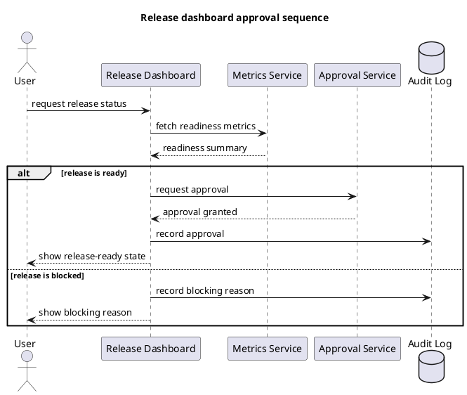

# Portable Example

## Scenario

A project needs a sequence diagram showing how a release dashboard checks
metrics, requests approval, records an audit event, and reports the outcome.

## Source Boundary

The diagram is based on a hypothetical architecture note. In a real adaptation,
replace this paragraph with the target project's source document, code path, or
authority record.

## Example Output

## Validation Notes

- The document has one matching `@startuml` and `@enduml` pair.
- The sequence diagram preserves all named participants from the scenario.
- No remote includes are used.
- Rendering validation is project-specific; run `<VALIDATION_COMMAND>` after
  adapting the template.
