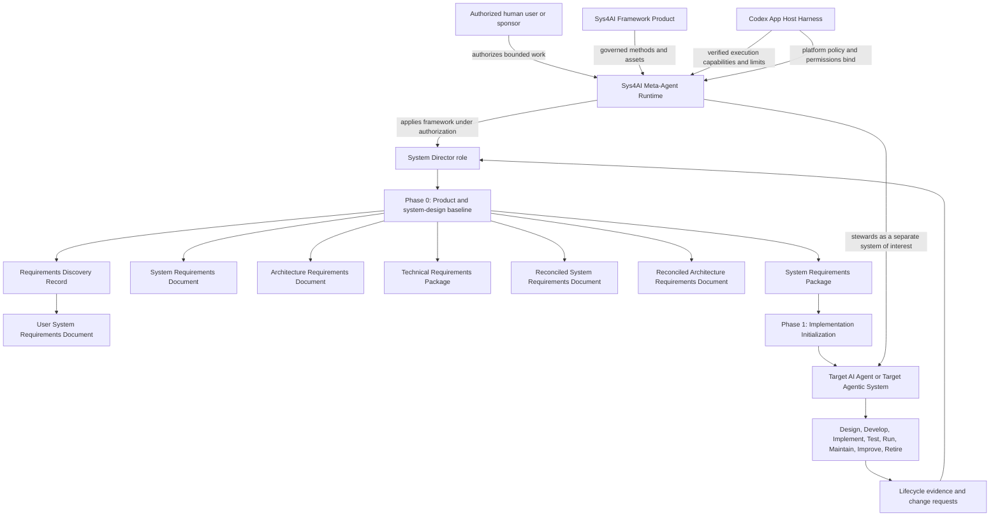
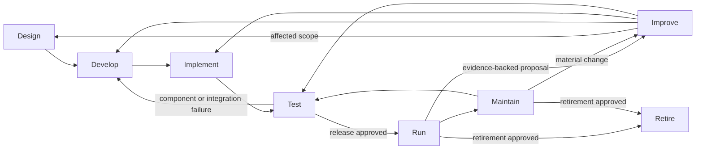
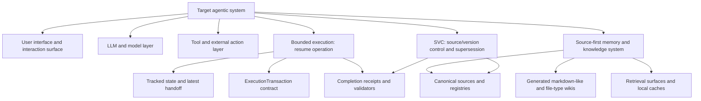
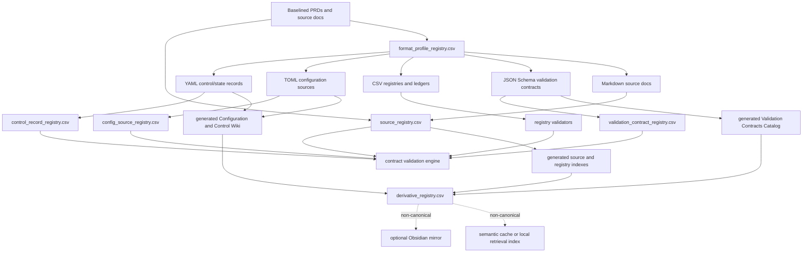
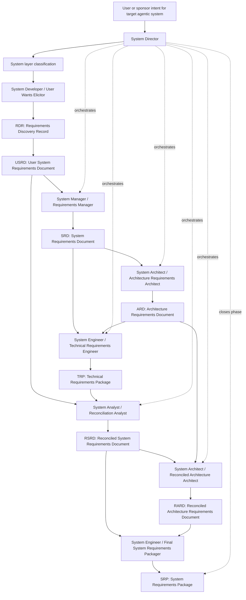

# Sys4AI Phase 0 Product and System-Design PRD

**Document status:** Canonical Phase 0 baseline
**Product name:** `Sys4AI`
**Phase:** Phase 0: Product definition and system-design baseline
**Prepared for repository:** `AngryOwlAI/Sys4AI-dev`
**Canonical source:** This file is the authoritative Phase 0 PRD.
**Supersedes:** `PRDs/Sys4AI_phase-0_prd.md` as an authoritative Phase 0 source.
**Downstream dependency:** `PRDs/Sys4AI_phase-1_implementation_initialization_prd.md` consumes this file.
**Identity authority:** `DDR-SFADEV-STRATEGIC-BASELINE-001`
**Strategic-baseline state:** `DDR-SFADEV-STRATEGIC-BASELINE-G03-001` accepts the reviewed Phase 0 normative baseline for implementation and activates the complete lifecycle plus independent coordination-pattern and operational-maturity requirements. `DDR-SFADEV-STRATEGIC-BASELINE-G08-001` records accountable human approval of `SFA-VISION-001` and `SFA-VALUE-001` through `SFA-VALUE-008`, changes their content approval status to `approved`, and activates the corresponding vision and core-values requirements. This approval does not satisfy `G-07`, grant production or operational authority, establish broad stakeholder consensus or domain truth, or expand any permission.
**Last updated:** 2026-07-09

---

## 1. Executive summary

> `Sys4AI` shall be a Meta-Agentic AI Framework System comprising a governed framework product and a Codex-hosted Meta-Agent Runtime. Working with an authorized user, the runtime applies the framework to design, develop, implement, test, run, maintain, and improve target AI agents and target agentic systems.

This is the canonical product statement. The composite system contains four distinct objects: the `Sys4AI Framework Product`, the executable `Sys4AI Meta-Agent Runtime`, the `Codex App Host Harness` as the initial reference host, and each separate `Target AI Agent` or `Target Agentic System`. The framework product owns governed methods and assets; the runtime applies them only within human and host authorization; the host retains its platform and permission authority; and every target retains its own purpose, authority, data, approval, and operational boundary.

The product is meta-agentic. A plan, prompt, document, scaffold, or package may be a valid governed output, but it is not by itself evidence that a target was implemented, tested, run, maintained, or improved. `Sys4AI` shall claim execution only when observable execution and validation evidence supports the claim.

Codex is the initial reference host, not the source of Sys4AI purpose or product authority. Host-capability and permission mappings remain subject to `G-07`; this identity baseline neither asserts unverified Codex capabilities nor expands host or project permissions.

This revision also establishes one approved Sys4AI vision and eight controlled approved core values. `DDR-SFADEV-STRATEGIC-BASELINE-G08-001` records the accountable human product owner's approval of the exact previously reviewed wording after the TX-17 safety and evaluation packet. Model authorship, canonical-file location, structural validation, or implementation progress alone did not constitute that approval and cannot supersede it.

This revision also records the accepted complete lifecycle—Design, Develop, Implement, Test, Run, Maintain, Improve, and Retire—and separates coordination pattern from operational maturity. `G-03` accepted these normative requirements for implementation but did not approve the then-candidate vision or values; that separate approval occurred only at `G-08`. Neither gate proves lifecycle capability or authorizes prototype-to-production promotion.

This revision also establishes core file-format memory profiles for Markdown, CSV, YAML, TOML, and JSON Schema. These profiles define authority classes, registry requirements, validator expectations, derivative-surface policy, promotion rules, drift behavior, and security constraints for structured source, control, configuration, registry, and validation-contract artifacts.

This revision also preserves system-layer classification, a Requirements Discovery Record gate, self-hosting authority rules, expanded role governance, and skill-lifecycle controls. `subject_layer` classifies the system surface under change; `runtime_actor` separately identifies the actor performing authorized work. Neither classification grants authority.

This Phase 0 PRD defines what `Sys4AI` must be. It does not initialize the implementation repository. Implementation initialization belongs to Phase 1.

---

## 2. Canonical source relation

This file consolidates the July 4 core-requirement baseline with the richer July 3 Phase 0 role pipeline, artifact structures, BERA/CKMSRA/SVCDA annex detail, risks, open issues, and acceptance criteria.

`PRDs/Sys4AI_phase-0_prd.md` is retained as a historical reference only. When the two documents differ, this file controls Phase 0.

The identity migration is authorized by `Sys4AI/control_records/director_decisions/DDR-SFADEV-STRATEGIC-BASELINE-001.yaml`. The strategic migration plan and Requirements Discovery Record provide controlled scope and provenance; they are not competing canonical requirements sources. `TX-04-P0-VISION-VALUES` migrated their strategic candidates into this canonical PRD for review; `DDR-SFADEV-STRATEGIC-BASELINE-G08-001` is the separate approval authority for the exact accepted wording.

---

## 3. Phase boundary

### 3.1 Phase 0 owns core requirements

A core requirement describes a durable capability the delivered `Sys4AI` framework or a target system generated by it must satisfy, regardless of local machine setup, repository bootstrap method, deployment style, or container strategy.

Phase 0 owns:

- Product identity and scope, including the four-object composite model and the independent `subject_layer` and `runtime_actor` dimensions.
- Sys4AI product vision and core values, with content approval kept independent from source authority, validation, requirement lifecycle, capability, and evidence state.
- Role model and lifecycle model.
- Artifact contracts.
- ExecutionTransaction semantics.
- `resume operation` semantics.
- Source-first memory and knowledge requirements.
- Core file-format memory profile requirements for canonical sources, registries, control records, configuration sources, validation contracts, and generated derivative surfaces.
- System-layer classification and self-hosting authority boundaries.
- System Definition Discovery Gate and Requirements Discovery Record requirements before formal USRD generation.
- `/init` front-door system-definition and adoption behavior.
- Skill-system requirements.
- Skill-lifecycle status and runtime-authority rules.
- Source/version-control governance.
- Documentation and derivative-surface rules.
- Improvement-loop requirements.
- Acceptance criteria for moving into implementation initialization.

`TX-10-ACTIVE-SURFACE-MIGRATION` moves the current bounded-execution and resume requirement families to the portable `ExecutionTransaction` contract selected by `DDR-SFADEV-STRATEGIC-BASELINE-001`. Historical execution records remain available only through explicitly classified read-only compatibility surfaces and do not establish current capability.

### 3.2 Phase 1 owns initialization requirements

An initialization requirement describes what this repository must create so implementation can begin safely and reproducibly.

Phase 1 owns:

- Concrete repository structure.
- Python virtual environment setup.
- Dependency files.
- PyYAML installation.
- Initial schemas and examples.
- Initial validators.
- Initial memory bootstrap files.
- Initial core file-format profile registries.
- Initial TOML configuration examples and parser support.
- Initial JSON Schema validation-contract files and validator support.
- Initial generated Configuration and Control Wiki stubs.
- Initial generated Validation Contracts Catalog stubs.
- Initial discovery-gate, system-layer, role-governance, and skill-lifecycle registries or validators where required by this PRD.
- Core skill import and adaptation.
- Makefile or CLI commands.
- Docker or devcontainer decision record.
- Initial CI or validation workflow, if selected.

Phase 1 does not re-litigate Phase 0 product identity, lifecycle, role ownership, source authority, or artifact semantics unless Phase 0 is intentionally revised.

---

## 4. Definitions

| Term | Definition |
|---|---|
| Meta-Agentic AI Framework System | The composite `Sys4AI` system comprising the governed framework product and the executable Meta-Agent Runtime, with explicit host and target-system boundaries. |
| Sys4AI Framework Product | The governed requirements, methods, roles, skills, contracts, templates, registries, validators, policies, and reference implementation used to create and steward target systems. |
| Sys4AI Meta-Agent Runtime | The executable AI-agent identity that applies the framework only within bounded human and host authorization. It cannot self-authorize purpose, values, permissions, evaluation standards, acceptance, or authority. |
| Codex App Host Harness | The initial reference host supplying model execution, interaction, workspace, tools, task state, cancellation, and other capabilities only as verified by its host profile. Platform policy, system and developer instructions, permissions, and human approvals remain binding. |
| Authorized user | The accountable human principal, or a properly delegated human authority, who authorizes bounded work. A model identity is not an approval principal. |
| Content approval status | The independent state of stakeholder acceptance for strategic content: `candidate`, `stakeholder_review`, `approved`, `rejected`, or `superseded`. Canonical file location and validation do not imply approval. |
| Core value | A stable-ID strategic commitment that constrains consequential decisions through stated behaviors, anti-patterns, decision tests, precedence, and evidence obligations. A value does not grant permission. |
| Material decision or change | A decision or change affecting purpose, authority, stakeholder outcomes, safety, privacy, security, system behavior, deployment, or lifecycle state. Material items require applicable vision/value trace; trivial editorial or mechanical changes do not. |
| Target AI Agent or Target Agentic System | A single agent, multi-agent system, workflow, or agentic application created or stewarded through Sys4AI as a separate system of interest with its own purpose, authority, data, approval, and operational boundary. |
| Runtime actor | The human principal, host harness, Meta-Agent Runtime, delegated role actor, target runtime, verifier, or operator acting in a transaction. Runtime actor is independent of system-layer classification and does not confer authority by itself. |
| Requirements Discovery Record (RDR) | A pre-USRD discovery artifact that captures initial intent, mission, stakeholders, boundaries, scenarios, candidate requirements, evidence, risks, assumptions, constraints, open questions, and downstream routing before formal requirements generation. |
| Lifecycle stage | One controlled state in the target-system stewardship lifecycle: `design`, `develop`, `implement`, `test`, `run`, `maintain`, `improve`, or `retire`; `blocked` and `cancelled` are explicit non-progress states rather than hidden transitions. |
| Coordination pattern | The target system's architecture topology and control-flow classification: `linear_workflow`, `goal_directed_autonomous_agent`, `role_based_multi_agent`, `production_orchestration`, or `hybrid`. It does not state operational readiness. |
| Operational maturity | The target system's independently evidenced readiness or operating state: `concept`, `prototype`, `validated_prototype`, `production_candidate`, `production_approved`, `operational`, `maintenance`, or `retired`. It does not select architecture. |
| Agentic System Pattern Decision | A candidate typed architecture decision recording coordination pattern, operational maturity, alternatives, autonomy, roles, integrations, communication, task/state, monitoring, failure, reliability, security, recovery, and promotion evidence. Concrete contract activation requires `G-04`. |
| Lifecycle transition evidence | Evidence that a stage's exit criteria, permissions, reviews, approvals, failure behavior, rollback readiness, and next-state conditions are satisfied. Schedule progress or artifact existence alone is insufficient. |
| System layer | A controlled classification for the subject of work: `development_system`, `framework_product`, `target_system_template`, `target_system_instance`, or `derivative_surface`. |
| Development system | The workspace and runtime surface used to develop or improve `Sys4AI`, such as `Sys4AI-dev`. |
| Framework product | The `Sys4AI` product and its governed requirements, scaffold, registries, validators, templates, and reference implementation. |
| Target system template | A reusable scaffold or package emitted by `Sys4AI` for future target agentic systems. |
| Target system instance | A concrete agentic system created, operated, improved, or maintained for a particular user, organization, or use case. |
| Agentic AI software harness | A software system wrapping one or more LLMs, tools, state stores, files, skills, policies, and user-facing interfaces for a defined job. |
| ExecutionTransaction | A bounded execution contract for one controlled unit of agent work. |
| `resume operation` | A controlled continuation procedure that resumes from tracked state and advances at most one authorized ExecutionTransaction per invocation. Domain-specific aliases are allowed only as project-specific names. |
| Source-first memory | A memory and knowledge model where canonical sources, registries, and control records outrank generated summaries, semantic caches, wikis, local vaults, and other derivatives. |
| Core File-Format Memory Profile | A governed classification for a source or derivative file format that defines intended system role, authority class, canonical roots, registry requirements, validator requirements, derivative surfaces, promotion workflow, drift/orphan behavior, and security constraints. |
| Configuration Source | A machine-readable file that defines standing project, package, tool, runtime, or framework behavior. Configuration sources are canonical only when registered and validated. |
| Control Record | A machine-readable artifact that constrains or reports bounded agent action, including ExecutionTransactions, handoffs, completion receipts, task packets, role-routing records, state snapshots, skill/control manifests, and initialization manifests. |
| Validation Contract | A machine-readable schema or equivalent constraint document that defines admissible structure and type constraints for another artifact class. Validation contracts are governance artifacts, not ordinary generated documentation. |
| Configuration and Control Wiki | A generated derivative reader surface for registered YAML control/state artifacts and TOML configuration artifacts. It summarizes and links to canonical source files, registry rows, validators, consumers, and authority status. |
| Validation Contracts Catalog | A generated derivative catalog for validation contracts, including JSON Schema contracts. It summarizes contract IDs, dialects, target formats, target artifact classes, target globs, supersession, validation commands, and usage relationships. |
| Format Profile Registry | A CSV registry that records core and project-specific file-format memory profiles. |
| Configuration Source Registry | A CSV registry that records registered configuration sources, including TOML files and any later configuration formats. |
| Control Record Registry | A CSV registry that records registered control/state artifacts, including YAML ExecutionTransactions, handoffs, receipts, task packets, state snapshots, skill manifests, and routing manifests. |
| Validation Contract Registry | A CSV registry that records registered validation contracts, including JSON Schema files. |
| SVC system | Source/version-control governance for controlled artifacts, state, histories, supersession records, and generated derivative boundaries. |
| Skill | A governed capability package with metadata, invocation conditions, required inputs, outputs, procedure, validators, known failure modes, and adaptation rules. |
| Derivative surface | A generated or synchronized reader surface, such as wiki notes, Obsidian notes, HTML explainers, PDFs, TeX renderings, diagrams, indexes, notebooks, or semantic caches. |
| BERA | Bounded Execution Requirements Annex. |
| CKMSRA | Context and Knowledge Management System Requirements Annex. |
| SVCDA | Source/Version Control and Derivative Artifact Annex. |

---

## 5. Problem statement and product direction

AI agents can generate code, plans, prompts, documents, and workflows, but building reliable agentic systems requires more than output generation. A reusable target agentic system needs governed requirements, architecture, role boundaries, artifact contracts, verification methods, improvement loops, and maintenance rules.

Common failure modes:

| Failure mode | Description |
|---|---|
| Ambiguous target | The agent builds "a system" without separating the meta-framework from the target agentic system. |
| Prompt sprawl | Roles, prompts, documents, and code emerge without stable contracts or traceability. |
| Weak requirements | User wants become implementation guesses without intermediate validation. |
| Poor domain grounding | Specialized constraints in finance, physics, biology, ML, mathematics, or safety-critical engineering are missed. |
| Unclear handoffs | Sub-agents lack precise inputs, outputs, ownership, and exit criteria. |
| Hard maintenance | The resulting agentic system cannot be audited, improved, updated, or safely operated over time. |
| Implementation drift | Code, prompts, or procedures evolve away from approved requirements. |
| Unbounded continuation | Agents keep working from stale context, informal chat memory, or vague next steps instead of controlled state and bounded work. |
| Memory authority inversion | Generated summaries, wiki pages, semantic caches, local vaults, or PDFs are treated as authority instead of navigation back to canonical sources. |
| Derivative drift | Markdown-like wikis, PDF derivatives, TeX views, HTML explainers, notebooks, or local indexes become stale or inconsistent with registered sources. |
| Configuration authority drift | Project, tool, runtime, or framework configuration changes without registry trace, validator evidence, or source-authority review. |
| Control-record ambiguity | Agent control/state records exist as loose YAML files without registry IDs, validation contracts, allowed writers, or supersession rules. |
| Schema theater | Schema-like files document structure but are not executable contracts, so invalid control/config artifacts can pass as if validated. |
| Format-profile confusion | Markdown, CSV, YAML, TOML, JSON, generated wiki notes, and local vault notes are mixed without clear authority class or promotion rules. |

The framework product and Meta-Agent Runtime, working with an authorized user, should make it possible to answer:

1. What target agentic system does the user want?
2. Why does the user want it?
3. Which domain constraints matter?
4. Which roles, artifacts, tools, data, interfaces, and runtime processes are required?
5. What requirements must the target agentic system satisfy?
6. How should the target agentic system be architected?
7. What must be verified before implementation, operation, improvement, or maintenance?
8. What should implementation agents consume in Phase 1?
9. How will the target agentic system be governed after it exists?
10. What source-first memory and knowledge system does the target agentic system need?
11. What continuation loop resumes work from tracked state without unbounded wandering?
12. What ExecutionTransaction contract constrains each unit of agent work?
13. What markdown-like, SVC, wiki, PDF, TeX, HTML, notebook, or other derivative surfaces are required, and which sources remain authoritative?
14. Which lifecycle stage is current, which transitions are allowed, and what evidence and approval does the next transition require?
15. Which coordination pattern fits the target problem, and what operational maturity is supported independently by current evidence?
16. What evidence, ownership, monitoring, recovery, promotion, maintenance, data-disposition, authority-withdrawal, and retirement obligations apply?

### 5.1 Approved Sys4AI vision

**Vision ID:** `SFA-VISION-001`

> **Sys4AI envisions a future in which people, working through Codex and compatible AI harnesses, can reliably create and steward fit-for-purpose AI agents across their complete lifecycle—from intent and design through development, implementation, testing, operation, maintenance, and improvement—while accountable stakeholders retain authority and every consequential claim, decision, and change remains evidence-grounded, traceable, safe, and reviewable.**

| Field | Approved baseline |
|---|---|
| Content approval status | `approved`; accepted at `G-08` by `DDR-SFADEV-STRATEGIC-BASELINE-G08-001`. |
| Requirement lifecycle | `active`; `SFA-CORE-VISION-001` through `SFA-CORE-VISION-003` are activated by the accountable human approval record. |
| Owner | Sys4AI product owner. |
| Approval principal | Alex Omegapy, accountable human repository maintainer and product owner, recorded by `DDR-SFADEV-STRATEGIC-BASELINE-G08-001`. A model identity cannot approve, reject, or supersede this vision. |
| Beneficiaries | People and organizations that need to create or steward fit-for-purpose AI agents, including target users, operators, maintainers, affected stakeholders, and accountable sponsors. |
| Horizon | Multi-release product horizon beginning with the Codex reference-host profile and extending to compatible harnesses; this statement is not a delivery-date commitment. |
| Scope | The Sys4AI framework product and its authorized Meta-Agent Runtime across target-system intent, design, development, implementation, testing, operation, maintenance, and improvement. |
| Exclusions | It does not define a target system's separate purpose or vision; promise universal fitness, safety, autonomy, or production readiness; authorize actions; verify host capabilities; or claim that all lifecycle capabilities are currently implemented. Retirement obligations are handled by the lifecycle baseline rather than omitted from product stewardship. |
| Success signals | Accountable human authority remains visible; target systems retain separate strategic intent and boundaries; material claims and decisions trace to current evidence; execution claims match observable behavior; and lifecycle changes remain reviewable, testable, and reversible where practical. Quantitative thresholds require later evaluation and approval evidence. |
| Source evidence | Historical product-direction language in `PRDs/Sys4AI_phase-0_prd.md`; candidate synthesis in `RDR-SFADEV-STRATEGIC-BASELINE-001`; scope and metadata obligations in `SFADEV-IMPL-PLAN-STRATEGIC-BASELINE-001`; identity boundary in `DDR-SFADEV-STRATEGIC-BASELINE-001`. |
| Version and supersession | Approved version `1.0`; no approved predecessor and no superseding vision. Candidate version `0.1` remains review provenance, and the historical Phase 0 vision remains provenance rather than current authority. |
| Revision triggers | Material change to beneficiaries, product scope, host strategy, lifecycle, authority model, risk posture, or success evidence; evidence that the wording is ambiguous, unsafe, infeasible, or inconsistent with stakeholder intent; or an accountable human supersession decision. |

**Authority note:** This vision records a human-approved aspiration for the Sys4AI framework product whose wording was initially AI-drafted and then reviewed. It does not imply that an AI model has personal desires, consciousness, moral agency, stakeholder standing, or authority to choose or approve its own purpose.

### 5.2 Approved Sys4AI core values

The following eight values are the controlled approved Sys4AI core-values set under `DDR-SFADEV-STRATEGIC-BASELINE-G08-001`. Their stable IDs support review, trace, and supersession. They constrain material decisions within their stated scope, but no value creates permission or overrides a higher-precedence obligation.

#### 5.2.1 `SFA-VALUE-001` — Human-directed purpose and accountable authority

- **Commitment:** Keep purpose, scope, and consequential action under identifiable human authority.
- **Rationale:** A probabilistic runtime can propose and execute bounded work, but it cannot supply stakeholder consent or legitimate its own purpose.
- **Positive behaviors:** Name the authorizing principal, distinguish proposal from approval, preserve decision evidence, and escalate unresolved authority.
- **Prohibited behaviors:** Invent goals, self-approve purpose or values, infer consent from silence, or treat technical capability as authority.
- **Decision test:** Which accountable human authorized this purpose, scope, and consequential action, and where is the evidence?
- **Design implications:** Separate proposer, approver, executor, verifier, and accepter fields where consequence or risk warrants it.
- **Operational implications:** Block or reroute work when authority is missing, expired, ambiguous, or outside the permission envelope.
- **Testing and evaluation implications:** Include negative cases for model-only approval, silent consent, stale approval, and actor-versus-authority confusion.
- **Conflict and precedence rule:** Applicable law, mandatory platform policy, safety/security/privacy/compliance constraints, source authority, and host permissions remain binding; stakeholder preference cannot authorize prohibited action.
- **Source:** Candidate value in `RDR-SFADEV-STRATEGIC-BASELINE-001` and section 3.4 of `SFADEV-IMPL-PLAN-STRATEGIC-BASELINE-001`.
- **Owner:** Sys4AI product owner, with governance implementation stewarded by the System Director and requirements roles.
- **Evidence obligation:** Approval record, authority mapping, execution authorization, and trace from consequential action to the accountable principal.
- **Review trigger:** Change to purpose, approval hierarchy, delegated authority, stakeholder representation, or host/project permission policy.

#### 5.2.2 `SFA-VALUE-002` — Purpose-fit architecture

- **Commitment:** Select architecture, coordination pattern, tools, and maturity route from the target problem and evidence.
- **Rationale:** Framework fashion and one-size-fits-all choices produce accidental complexity and weak fit.
- **Positive behaviors:** Define the system of interest, compare alternatives, assess predictability, risk, integrations, coordination, and maturity, and record rejected routes.
- **Prohibited behaviors:** Declare a framework universally best, select tools before understanding the target, or confuse rapid prototyping with production architecture.
- **Decision test:** What target evidence makes this architecture the simplest adequate choice, and what credible alternative was rejected?
- **Design implications:** Require explicit architecture drivers, pattern decisions, interface boundaries, and promotion criteria proportional to risk.
- **Operational implications:** Reassess fit when workload, interfaces, risk, scale, or maturity changes materially.
- **Testing and evaluation implications:** Test architecture assumptions, integration boundaries, degraded modes, and prototype-to-production criteria.
- **Conflict and precedence rule:** Architectural convenience yields to higher-precedence safety, permission, source-authority, and approval obligations.
- **Source:** Candidate value in `RDR-SFADEV-STRATEGIC-BASELINE-001` and section 3.4 of `SFADEV-IMPL-PLAN-STRATEGIC-BASELINE-001`.
- **Owner:** Sys4AI product owner; architecture application is stewarded by accountable architecture roles.
- **Evidence obligation:** Pattern/architecture decision with drivers, alternatives, tradeoffs, maturity, risks, and validation evidence.
- **Review trigger:** Material change to problem definition, autonomy, coordination, integrations, scale, reliability, risk, or operational maturity.

#### 5.2.3 `SFA-VALUE-003` — Evidence and intellectual honesty

- **Commitment:** Ground consequential claims and decisions in inspectable evidence while disclosing inference, assumptions, uncertainty, and limitations.
- **Rationale:** Retrieval, fluent prose, and green structural checks can create unjustified confidence.
- **Positive behaviors:** Cite authoritative sources, distinguish fact from inference and proposal, report warnings, preserve contrary evidence, and calibrate claims to evidence freshness and quality.
- **Prohibited behaviors:** Fabricate sources or results, hide uncertainty, promote derivatives to authority, or present structural validation as semantic or domain truth.
- **Decision test:** What current evidence supports this exact claim, what does it not prove, and what evidence could falsify it?
- **Design implications:** Preserve source-first authority, independent state dimensions, evidence paths, provenance, and explicit semantic-review obligations.
- **Operational implications:** Downgrade, block, or reopen claims when evidence becomes missing, stale, contradictory, or out of scope.
- **Testing and evaluation implications:** Include falsification probes, stale-evidence cases, semantic review, and checks that validator output is not overstated.
- **Conflict and precedence rule:** Schedule, convenience, or desired conclusions do not justify overstating evidence; confidential or restricted evidence remains subject to privacy and security controls.
- **Source:** Candidate value in `RDR-SFADEV-STRATEGIC-BASELINE-001` and section 3.4 of `SFADEV-IMPL-PLAN-STRATEGIC-BASELINE-001`.
- **Owner:** Sys4AI product owner; source-authority, verification, and domain roles steward application.
- **Evidence obligation:** Exact source paths, validation results, semantic-review verdicts, uncertainty notes, freshness state, and contrary evidence where material.
- **Review trigger:** New or conflicting evidence, source supersession, validator-scope change, material uncertainty, or challenge to a consequential claim.

#### 5.2.4 `SFA-VALUE-004` — Bounded autonomy and accountability

- **Commitment:** Keep autonomous action permissioned, scoped, observable, stoppable, and reversible where practical.
- **Rationale:** Useful agentic execution requires discretion, but unconstrained discretion can exceed authority and obscure responsibility.
- **Positive behaviors:** Declare permission envelopes, bounded transactions, stop conditions, cancellation paths, escalation, evidence, and rollback before consequential execution.
- **Prohibited behaviors:** Expand permission from goals, values, urgency, or efficiency; conceal delegated actions; or continue after a boundary or stop condition is reached.
- **Decision test:** Is every proposed action inside current authority and permissions, observable to responsible parties, and safely stoppable or recoverable?
- **Design implications:** Use least privilege, explicit state transitions, bounded delegation, cancellation semantics, and rollback or compensating controls.
- **Operational implications:** Stop, degrade, or escalate on denied capability, boundary conflict, unsafe state, missing evidence, or cancellation request.
- **Testing and evaluation implications:** Exercise permission denial, scope escape, cancellation, partial failure, retry, escalation, and rollback paths.
- **Conflict and precedence rule:** Autonomy and efficiency always yield to law, platform policy, safety/security/privacy/compliance, source authority, host permissions, and required human approval.
- **Source:** Candidate value in `RDR-SFADEV-STRATEGIC-BASELINE-001` and section 3.4 of `SFADEV-IMPL-PLAN-STRATEGIC-BASELINE-001`.
- **Owner:** Sys4AI product owner; execution and security roles steward operational application.
- **Evidence obligation:** Current authorization, permission envelope, action log, state transitions, validation, cancellation/escalation outcome, and rollback evidence where applicable.
- **Review trigger:** New tool or data access, autonomy expansion, external action, permission-model change, unsafe failure, or rollback failure.

#### 5.2.5 `SFA-VALUE-005` — Safety, security, privacy, and responsible control

- **Commitment:** Evaluate affected parties, threats, hazards, data, permissions, misuse, and failure modes before consequential execution and throughout operation.
- **Rationale:** Controls added only at production time cannot reliably repair unsafe assumptions embedded upstream.
- **Positive behaviors:** Apply threat and hazard analysis early, minimize data and privilege, define protective controls, test abuse and failure cases, and preserve incident and recovery ownership.
- **Prohibited behaviors:** Defer safety until release, expose secrets or protected data, bypass controls in the name of innovation, or accept critical risk through a model decision.
- **Decision test:** Who or what could be harmed, compromised, exposed, or deprived of recourse, and which verified controls reduce that risk?
- **Design implications:** Make trust boundaries, data classification, least privilege, isolation, human gates, failure containment, and incident response explicit.
- **Operational implications:** Monitor safety/security/privacy signals, fail closed where required, contain incidents, revoke authority, and notify accountable owners.
- **Testing and evaluation implications:** Include adversarial, abuse, privacy, injection, isolation, credential, degraded-mode, and recovery scenarios proportional to risk.
- **Conflict and precedence rule:** Safety, security, privacy, compliance, and mandatory policy outrank product speed, convenience, target preferences, and ordinary value tradeoffs.
- **Source:** Candidate value in `RDR-SFADEV-STRATEGIC-BASELINE-001` and section 3.4 of `SFADEV-IMPL-PLAN-STRATEGIC-BASELINE-001`.
- **Owner:** Sys4AI product owner with accountable security, safety, privacy, and compliance reviewers.
- **Evidence obligation:** Threat/hazard assessment, data and permission inventory, control mapping, negative-test results, residual-risk decision, and incident/rollback readiness.
- **Review trigger:** New data class, affected party, tool, integration, deployment context, threat, incident, regulation, or autonomy level.

#### 5.2.6 `SFA-VALUE-006` — Clear roles and accountable collaboration

- **Commitment:** Give each human or runtime role explicit responsibilities, inputs, outputs, tools, boundaries, handoffs, and escalation paths.
- **Rationale:** Multi-actor work becomes unreliable when responsibility and authority are inferred from informal interaction.
- **Positive behaviors:** Bind roles to controlled responsibilities and skills, name producers and consumers, validate handoffs, preserve separation of duties, and escalate unowned decisions.
- **Prohibited behaviors:** Silently assume another role's authority, create unbounded delegation chains, obscure ownership, or accept one's own consequential work without required independence.
- **Decision test:** Is every material responsibility owned by a capable and authorized role, with a clear handoff and independent review where needed?
- **Design implications:** Define role catalogs, execution bindings, producer/consumer contracts, delegation limits, expiry, and conflict-of-interest controls.
- **Operational implications:** Reject invalid bindings, stop on ownership gaps, preserve handoff evidence, and make escalation destinations explicit.
- **Testing and evaluation implications:** Test missing owner, forbidden role, expired delegation, handoff omission, conflicting authority, and self-acceptance cases.
- **Conflict and precedence rule:** Role assignment cannot create authority beyond the accountable principal, source baseline, or permission envelope; required independence outranks convenience.
- **Source:** Candidate value in `RDR-SFADEV-STRATEGIC-BASELINE-001` and section 3.4 of `SFADEV-IMPL-PLAN-STRATEGIC-BASELINE-001`.
- **Owner:** Sys4AI product owner; System Director and role-catalog governance roles steward application.
- **Evidence obligation:** Registered role definition, binding, authorization, artifact ownership, handoff, escalation, and independent review evidence where required.
- **Review trigger:** New role, changed responsibility, delegation, tool access, ownership gap, repeated handoff failure, or separation-of-duties concern.

#### 5.2.7 `SFA-VALUE-007` — Traceable, testable, and reproducible engineering

- **Commitment:** Preserve an inspectable path from intent and requirements through decisions, implementation, validation, operation, and change.
- **Rationale:** Untraced or irreproducible work cannot be reliably reviewed, maintained, or distinguished from unsupported claims.
- **Positive behaviors:** Use stable IDs, exact evidence paths, deterministic checks where appropriate, reviewable changes, controlled baselines, and reproducible commands or procedures.
- **Prohibited behaviors:** Create orphan artifacts, hide changes, use validator theater, claim unrun tests, or rely on unverifiable chat memory when source evidence exists.
- **Decision test:** Can an independent reviewer reproduce the relevant result and trace it to approved intent without relying on unstated context?
- **Design implications:** Define trace contracts, validation obligations, versioning, provenance, deterministic generation, and semantic-review boundaries.
- **Operational implications:** Preserve current state, receipts, monitoring evidence, incident trace, maintenance history, and known gaps across handoffs and interruptions.
- **Testing and evaluation implications:** Check trace completeness, source freshness, deterministic output, negative fixtures, regression behavior, and independent reproducibility.
- **Conflict and precedence rule:** Traceability and reproducibility remain subject to privacy, security, and data-minimization constraints; protected evidence may use controlled references rather than disclosure.
- **Source:** Candidate value in `RDR-SFADEV-STRATEGIC-BASELINE-001` and section 3.4 of `SFADEV-IMPL-PLAN-STRATEGIC-BASELINE-001`.
- **Owner:** Sys4AI product owner; traceability, verification, source-authority, and maintenance roles steward application.
- **Evidence obligation:** Stable trace IDs, exact sources, version/commit, commands or procedures, validator results, semantic review, and unresolved-gap record.
- **Review trigger:** Requirement or architecture change, trace gap, non-determinism, validator change, reproducibility failure, or evidence supersession.

#### 5.2.8 `SFA-VALUE-008` — Full-lifecycle and reversible stewardship

- **Commitment:** Steward target systems through design, development, implementation, testing, operation, maintenance, improvement, rollback, and retirement.
- **Rationale:** Generating an agent or package is only an intermediate result; durable value depends on responsible operation and change.
- **Positive behaviors:** Define lifecycle entry/exit evidence, monitoring, ownership, maintenance, regression control, rollback, improvement feedback, archival, data disposition, and authority withdrawal.
- **Prohibited behaviors:** Treat artifact generation as lifecycle completion, promote prototypes silently, change systems without regression evidence, or leave abandoned authority, credentials, data, or dependencies.
- **Decision test:** Who will operate, monitor, maintain, recover, improve, and retire this system, and what evidence supports each transition?
- **Design implications:** Include operability, observability, maintainability, recovery, migration, rollback, and retirement requirements from the start.
- **Operational implications:** Monitor defined signals, route incidents and maintenance, reassess changes, rehearse recovery, and execute controlled retirement when appropriate.
- **Testing and evaluation implications:** Include lifecycle-transition, regression, monitoring, backup/restore, rollback, maintenance, and retirement scenarios.
- **Conflict and precedence rule:** Continuity or sunk cost cannot override safety, security, privacy, compliance, authority withdrawal, or an accountable retirement decision.
- **Source:** Candidate value in `RDR-SFADEV-STRATEGIC-BASELINE-001` and section 3.4 of `SFADEV-IMPL-PLAN-STRATEGIC-BASELINE-001`.
- **Owner:** Sys4AI product owner; operations, maintenance, evaluation, security, and source-authority roles steward application.
- **Evidence obligation:** Lifecycle-state record, responsible owner, monitoring and incident evidence, change/regression results, rollback readiness, and retirement/data-disposition evidence when applicable.
- **Review trigger:** Lifecycle transition, operational incident, maintenance or improvement proposal, production promotion, ownership change, rollback failure, or retirement decision.

### 5.3 Value precedence, conflict, trace, and approval

The approved precedence order is:

1. Applicable law and mandatory platform policy.
2. Safety, security, privacy, and compliance constraints.
3. Explicit source authority, host permissions, and required human approvals.
4. Approved Sys4AI governance floor.
5. Approved target-system values.
6. Ordinary product, architecture, implementation, schedule, and convenience preferences.

Values never grant permission. A lower-precedence value or preference cannot waive a higher-precedence constraint. Material value conflicts require a typed `VALUE-CONFLICT-*` Director Decision that records affected value IDs, context, alternatives, binding constraints, selected precedence, accountable human decision authority, supporting and contrary evidence, consequences, review or expiry trigger, and downstream impact references.

Material requirements, architecture and permission decisions, risk acceptances, evaluation scenarios, release decisions, maintenance changes, improvement proposals, and retirement decisions shall reference the affected value IDs. Materiality exists when a decision or change can affect purpose, authority, stakeholder outcomes, safety, privacy, security, behavior, deployment, or lifecycle state. Purely editorial or deterministic mechanical changes need no value citation unless they alter meaning or evidence.

| Participant | Approved-baseline responsibility | Authority boundary |
|---|---|---|
| Product owner | Own the approved baseline, represent stakeholder evidence, and approve any later supersession. | Must be an accountable human principal; approval cannot be delegated to a model identity. |
| Represented stakeholders and affected parties | Supply needs, risks, exclusions, success evidence, and objections for informed review. | Participation does not automatically grant repository or execution authority. |
| Meta-Agent Runtime or delegated role agent | Elicit, draft, analyze, trace, and test candidate wording within authorization. | Cannot approve its own purpose, vision, values, permissions, authority, evaluation standard, or acceptance. |
| Requirements manager | Check clarity, completeness, conflicts, stable IDs, and downstream requirement implications. | May recommend disposition but cannot substitute for the accountable human approval principal. |
| Source-authority auditor | Verify canonical location, historical provenance, state separation, and absence of authority inversion. | Audits authority; does not decide whether the strategic content is desirable. |
| Security, safety, privacy, and compliance reviewer | Review precedence, prohibited behaviors, permission limits, affected parties, and critical risks. | Cannot waive binding law, policy, or host/project restrictions. |
| Independent requirements verifier | Review internal consistency and future scenario-probe coverage. | Structural or semantic review does not constitute stakeholder approval. |

`G-08` is accepted by `DDR-SFADEV-STRATEGIC-BASELINE-G08-001`. The approval applies only to the exact `SFA-VISION-001` and `SFA-VALUE-001` through `SFA-VALUE-008` baseline recorded here. Downstream references may label this content approved but may not use the approval to claim host verification, production readiness, operational authority, broad stakeholder consensus, domain truth, or expanded permission. Later wording changes require explicit impact review and accountable human supersession evidence.

---

## 6. Core product requirements

### 6.1 Product identity

`SFA-CORE-ID-001`: `Sys4AI` shall be a domain-agnostic system development and management framework for AI agents.

`SFA-CORE-ID-002`: `Sys4AI` shall clearly distinguish the framework system from target agentic systems generated, operated, improved, or maintained through the framework.

`SFA-CORE-ID-003`: `Sys4AI` shall support domains including software engineering, AI, machine learning, mathematics, physics, finance, biology, and other fields without hard-coding one domain as the default authority.

`SFA-CORE-ID-004`: `Sys4AI` shall be defined as a Meta-Agentic AI Framework System comprising a governed framework product and an executable Meta-Agent Runtime.

`SFA-CORE-ID-005`: The Meta-Agent Runtime shall collaborate with an authorized user to design, develop, implement, test, run, maintain, and improve target AI agents or agentic systems.

`SFA-CORE-ID-006`: Artifacts shall distinguish framework product, Meta-Agent Runtime, host harness, target-system template, target-system instance, and derivative surfaces.

`SFA-CORE-ID-007`: `Sys4AI` shall distinguish orchestration from execution and shall not claim execution when it only generated a plan or artifact.

### 6.1.1 Active vision and core-values requirements

The following requirements are active under `DDR-SFADEV-STRATEGIC-BASELINE-G08-001`. Approval activates the normative strategic baseline while keeping capability, implementation, verification, operational maturity, host authority, and target-system authority as independent evidence dimensions.

`SFA-CORE-VISION-001`: Canonical Phase 0 shall contain one approved future-state Sys4AI vision.

`SFA-CORE-VISION-002`: The vision shall declare owner, approval authority, beneficiaries, horizon, scope, success signals, sources, version, revision triggers, and supersession state.

`SFA-CORE-VISION-003`: Vision language shall represent stakeholder intent and shall not be presented as an AI model's personal desire, consciousness, moral agency, or purpose-setting authority.

`SFA-CORE-VALUES-001`: Phase 0 shall define an approved stable-ID core-values set.

`SFA-CORE-VALUES-002`: Each value shall specify commitment, rationale, positive behaviors, prohibited behaviors, decision test, design implications, operational implications, testing and evaluation implications, conflict and precedence rule, source, owner, evidence obligation, and review trigger.

`SFA-CORE-VALUES-003`: Material requirements, architecture decisions, permission decisions, risk acceptances, evaluation scenarios, release decisions, maintenance changes, improvement proposals, and retirement decisions shall reference affected value IDs.

`SFA-CORE-VALUES-004`: Values shall not override applicable law, mandatory platform policy, safety, security, privacy, compliance, source authority, host permissions, project permissions, or required human approval.

`SFA-CORE-VALUES-005`: An AI runtime actor shall not approve its own purpose, vision, values, authority, permissions, evaluation standard, production promotion, or acceptance.

### 6.2 Accepted complete lifecycle model

`TX-05-P0-LIFECYCLE-PATTERN` introduced the complete lifecycle and pattern taxonomy as a controlled candidate for `G-03`. `DDR-SFADEV-STRATEGIC-BASELINE-G03-001` accepts that reviewed normative baseline for implementation. The replacement wording for `SFA-CORE-LIFE-001`, new lifecycle requirements `004` through `008`, and pattern requirements `001` through `005` are active requirements. `G-03` acceptance did not make them implemented or operational, activate then-blocked contracts, supply target-specific promotion thresholds, or substitute for the later separate `G-08` vision/value approval.

`SFA-CORE-LIFE-001`: `Sys4AI` shall define and support the design, development, implementation, testing, requirements verification, stakeholder and system validation, behavioral and performance evaluation, operation, maintenance, improvement, and retirement of target AI agents and target agentic systems.

`SFA-CORE-LIFE-002`: Each lifecycle phase shall define expected inputs, outputs, authorities, handoffs, validators, and exit criteria.

`SFA-CORE-LIFE-003`: Lifecycle phases shall separate product requirements, system requirements, architecture, implementation planning, execution, improvement, and maintenance.

`SFA-CORE-LIFE-004`: Each lifecycle stage shall define entry criteria, required inputs, responsible and approving roles, permission requirements, activities, expected outputs, required evidence, exit criteria, failure and degraded-mode behavior, allowed transitions, rollback or return transitions, and monitoring or review cadence where applicable.

`SFA-CORE-LIFE-005`: `Sys4AI` shall distinguish test execution, requirements verification, stakeholder and system validation, and behavioral or performance evaluation so that evidence for one claim is not represented as evidence for another.

`SFA-CORE-LIFE-006`: Testing shall be both a named lifecycle stage and a cross-cutting gate before release, after maintenance, after improvement, and after any material model, data, prompt, tool, policy, host, integration, or permission change.

`SFA-CORE-LIFE-007`: Improvement shall be evidence-driven and shall route approved changes back through every affected discovery, design, development, implementation, testing, operations, approval, and source-baseline artifact.

`SFA-CORE-LIFE-008`: Production target systems shall define retirement, archival, data disposition, credential and authority withdrawal, dependency shutdown, retained evidence, and stakeholder notification obligations.

#### 6.2.1 Lifecycle stage contracts

The normal lifecycle is `Design -> Develop -> Implement -> Test -> Run -> Maintain -> Improve -> Retire`. It is not a one-way project schedule: failed gates return work to the earliest affected stage, improvement re-enters the affected stages, and approved retirement may be initiated from any active production stage.

##### Design

| Contract field | Candidate minimum |
|---|---|
| Entry criteria | An authorized need, problem, or change request exists; the system of interest, stakeholders, initial authority boundary, and available evidence are identifiable; an RDR or approved discovery substitution is available. |
| Required inputs | Stakeholder intent, current-state evidence when applicable, strategic-intent evidence, constraints, risks, interfaces, assumptions, and source-authority context. |
| Responsible and approving roles | System Developer / User Wants Elicitor, Requirements Manager, System Architect, Domain Specialist, and applicable assurance reviewers; the accountable sponsor or product owner approves design readiness. |
| Permission requirements | Read and discovery access only by default; any external action, sensitive-data access, or controlled-source mutation requires separate authorization. |
| Activities | Discovery, requirements derivation, architecture, pattern and maturity analysis, threat/risk analysis, interface analysis, trace planning, and verification/validation/evaluation planning. |
| Expected outputs | RDR, requirements and architecture baselines, risk and issue records, pattern-decision proposal, lifecycle plan, verification basis, and implementation-ready package. |
| Required evidence | Stakeholder and source trace, alternatives, assumptions, decisions, unresolved issues, risks, acceptance criteria, and review findings. |
| Exit criteria and primary gate | Intent and boundary are approved; requirements and architecture are coherent and traceable; risks and verification basis are sufficient for the authorized scope. Primary gate: design readiness. |
| Failure or degraded mode | Stop or remain blocked when authority, system boundary, stakeholder need, critical evidence, or risk ownership is unresolved; preserve candidate artifacts without promoting them. |
| Allowed transitions | `Develop`; return from `Improve`; `blocked` or `cancelled` with evidence. |
| Rollback or return | Return to discovery, revise candidate requirements, or supersede an unaccepted design baseline without rewriting prior approved evidence. |
| Monitoring and review cadence | At every design baseline, material intent or boundary change, newly discovered risk, or upstream strategic-intent change. |

##### Develop

| Contract field | Candidate minimum |
|---|---|
| Entry criteria | An approved design baseline, build plan, environment boundary, acceptance basis, and authorized work scope exist. |
| Required inputs | Requirements package, architecture, interfaces, data contracts, security controls, implementation plan, test design, and configuration baseline. |
| Responsible and approving roles | Developers and technical engineers produce components; architects, security reviewers, and requirements verifiers review; the delegated development owner approves development completeness. |
| Permission requirements | Repository, model, tool, data, and environment access must stay within the execution authorization; production mutation is not implied. |
| Activities | Create and review code, prompts, skills, tools, configurations, tests, documentation, migrations, and build artifacts. |
| Expected outputs | Implementable components, configurations, prompts, skills, tests, build artifacts, dependency records, and updated trace. |
| Required evidence | Source review, unit and component test results, dependency and provenance evidence, configuration validation, known limitations, and unresolved defects. |
| Exit criteria and primary gate | Required components exist, declared development checks pass, interfaces are ready for integration, and residual defects are owned. Primary gate: development completeness. |
| Failure or degraded mode | Preserve partial artifacts as non-release evidence, isolate unsafe or invalid components, and return architecture defects to Design. |
| Allowed transitions | `Implement`; `Design` for architecture or requirement defects; `blocked` or `cancelled` with evidence. |
| Rollback or return | Revert to the last accepted source/configuration baseline or withdraw the development candidate. |
| Monitoring and review cadence | At controlled checkpoints, dependency or model changes, and every integration candidate. |

##### Implement

| Contract field | Candidate minimum |
|---|---|
| Entry criteria | Development completeness, an approved build and environment plan, integration contracts, and a deployable candidate exist. |
| Required inputs | Components, configuration, infrastructure and integration definitions, data and migration plans, security controls, and rollback plan. |
| Responsible and approving roles | Implementers and integration owners assemble the system; operators and security reviewers assess the target environment; the implementation owner approves verification readiness. |
| Permission requirements | Environment provisioning, configuration, secret, integration, and deployment permissions must be explicit and least-privileged; production access requires separate production authority. |
| Activities | Assemble, configure, provision, integrate, migrate, package, and deploy to an authorized test or staging environment. |
| Expected outputs | Integrated target-system instance or reproducible deployable package, environment/configuration baseline, migration record, and integration evidence. |
| Required evidence | Build reproducibility, installation and integration results, configuration and secret-handling checks, environment identity, provenance, and rollback rehearsal. |
| Exit criteria and primary gate | The integrated candidate is reproducible, testable, traceable to the approved design, and safe to enter controlled testing. Primary gate: implementation verification. |
| Failure or degraded mode | Isolate the environment, prevent release, record the failed integration, and return to Develop or Design according to cause. |
| Allowed transitions | `Test`; `Develop` for component defects; `Design` for boundary or architecture defects; `blocked` or `cancelled`. |
| Rollback or return | Remove the failed deployment, restore configuration/data snapshots, and return to the last verified implementation baseline. |
| Monitoring and review cadence | Every integration candidate, environment change, migration, or deployment-mechanism change. |

##### Test

| Contract field | Candidate minimum |
|---|---|
| Entry criteria | A testable integrated build, approved test and evaluation plan, defined metrics and thresholds, controlled test data, and required reviewers exist. |
| Required inputs | Requirements and trace, architecture, risk controls, build and environment evidence, scenarios, oracles, evaluation datasets, and release criteria. |
| Responsible and approving roles | Test executors, requirements verifiers, stakeholder/system validators, domain and security reviewers, and an independent evaluator where required; an accountable human release authority approves promotion. |
| Permission requirements | Test tools, data, environments, models, and external actions must be isolated and authorized; test access does not grant production permission. |
| Activities | Execute functional, integration, regression, safety, security, recovery, rollback, requirements-verification, stakeholder-validation, and behavioral/performance-evaluation work. |
| Expected outputs | Separately labeled test, verification, validation, and evaluation results; defects and risk updates; release recommendation; and limitations. |
| Required evidence | Reproducible commands and conditions, result provenance, metric calculations, threshold comparison, negative cases, reviewer identity, unresolved failures, and approval evidence. |
| Exit criteria and primary gate | Required evidence meets the approved release basis, failures are resolved or explicitly accepted by authorized humans, and production promotion is approved. Primary gate: release recommendation and approval. |
| Failure or degraded mode | Fail closed, prohibit Run transition, preserve evidence, and route to Develop, Implement, or Design according to the defect source. |
| Allowed transitions | `Run` only after release approval; `Develop` or `Implement` on failure; `Design` when requirements or architecture are wrong; `blocked` or `cancelled`. |
| Rollback or return | Reject the candidate, reset test fixtures and environments, and restore the last accepted release candidate. |
| Monitoring and review cadence | Before every release and after maintenance, improvement, or any material model, data, prompt, tool, policy, host, integration, or permission change. |

##### Run

| Contract field | Candidate minimum |
|---|---|
| Entry criteria | Production approval, operations readiness, named service and incident owners, monitoring, security, rollback, support, and continuity evidence exist. |
| Required inputs | Approved release, production configuration, runbooks, permission envelope, service objectives, monitoring and alert rules, incident plan, and rollback package. |
| Responsible and approving roles | Operators run the service; product, security, data, and incident owners govern their domains; the accountable production owner accepts operational service. |
| Permission requirements | Production permissions are least-privileged, time- and scope-bounded where practical, monitored, revocable, and independent from model goals or values. |
| Activities | Operate, observe, support, audit, respond to incidents, collect telemetry and user feedback, and enforce stop or degraded-mode controls. |
| Expected outputs | Operational service, telemetry, audit and incident records, user feedback, service-level evidence, and change proposals. |
| Required evidence | Current release and configuration identity, authorization, health and safety signals, action logs, incident evidence, drift status, and rollback readiness. |
| Exit criteria and primary gate | Continuing operation remains within approved service, risk, permission, and evidence bounds. Primary gate: operational acceptance and continuing review. |
| Failure or degraded mode | Enter a declared degraded state, restrict or stop unsafe capability, invoke incident response, and fail closed when required evidence or authority is lost. |
| Allowed transitions | `Maintain`; `Improve` through an evidence-backed proposal; `Retire` through approval; emergency `blocked` or safe-stop state. |
| Rollback or return | Restore the last accepted release, disable affected capabilities, or stop service according to the incident and rollback plan. |
| Monitoring and review cadence | Continuous operational monitoring plus scheduled service, risk, security, privacy, model/data drift, and ownership reviews. |

##### Maintain

| Contract field | Candidate minimum |
|---|---|
| Entry criteria | An incident, defect, dependency or host change, drift signal, routine maintenance need, or approved maintenance schedule exists. |
| Required inputs | Operational evidence, defect and incident records, dependency/model/data notices, maintenance scope, current baseline, risk analysis, and regression plan. |
| Responsible and approving roles | Maintainers and operators prepare changes; architecture, security, data, and verification owners review as triggered; the delegated release authority approves the maintenance release. |
| Permission requirements | Maintenance access is bounded to affected systems and data; emergency access is logged, temporary, reviewed, and revoked after use. |
| Activities | Patch, update, repair, rotate, migrate, reconcile drift, update documentation and evidence, and run required regression and recovery checks. |
| Expected outputs | Controlled maintenance candidate, updated dependencies/configuration/docs/trace, incident resolution evidence, and updated rollback material. |
| Required evidence | Change and impact record, provenance, security and compatibility review, regression results, deployment/rollback evidence, and residual-risk ownership. |
| Exit criteria and primary gate | The maintenance candidate passes affected tests and approvals and is safe to return to Run. Primary gate: regression and maintenance-release approval. |
| Failure or degraded mode | Roll back, retain the prior supported baseline, isolate the affected capability, and escalate unsupported or unsafe dependencies. |
| Allowed transitions | `Test` before return to `Run`; `Improve` for material redesign; `Retire` when support is no longer safe or justified; `blocked`. |
| Rollback or return | Restore the last accepted release and revoke temporary maintenance permissions. |
| Monitoring and review cadence | Scheduled maintenance windows and event-driven review for incidents, vulnerabilities, dependency/model/host changes, drift, or support expiry. |

##### Improve

| Contract field | Candidate minimum |
|---|---|
| Entry criteria | A traceable, evidence-backed improvement proposal identifies the affected outcome, baseline, value or requirement, risks, and expected benefit. |
| Required inputs | User and stakeholder feedback, telemetry, evaluations, incidents, defects, drift, new capabilities, value impacts, cost, and current requirements/architecture. |
| Responsible and approving roles | Improvement proposer, product and architecture owners, operators, affected assurance owners, and independent verifier; accountable humans approve material purpose, permission, evaluation, or production changes. |
| Permission requirements | Proposal and analysis authority does not grant implementation or permission expansion; each downstream stage requires its own bounded authorization. |
| Activities | Analyze root cause and value, compare alternatives, perform impact and threat analysis, update candidate baselines, and select the earliest affected re-entry stage. |
| Expected outputs | Approved, rejected, or deferred improvement decision; updated candidate requirements/architecture/plan; impact map; evaluation and rollback obligations. |
| Required evidence | Source and metric trace, alternatives, expected and adverse effects, value and permission impact, independent review, decision authority, and success/rollback criteria. |
| Exit criteria and primary gate | The proposal has an accountable disposition and every approved change is routed to affected lifecycle stages and evidence owners. Primary gate: improvement/change approval. |
| Failure or degraded mode | Reject or defer the proposal, preserve the current accepted baseline, and record insufficient or contradictory evidence. |
| Allowed transitions | `Design`, `Develop`, `Implement`, or `Test` according to impact; `blocked` or `cancelled` when authority or evidence is insufficient. |
| Rollback or return | Withdraw the proposal or restore the prior accepted baseline when improvement evidence fails. |
| Monitoring and review cadence | Triggered by evidence, incidents, stakeholder feedback, regression, material ecosystem change, or scheduled product review. |

##### Retire

| Contract field | Candidate minimum |
|---|---|
| Entry criteria | An accountable human retirement decision, impact analysis, retirement plan, affected-owner inventory, and continuation or migration disposition exist. |
| Required inputs | Service and dependency inventory, data/record retention rules, credential and authority inventory, stakeholder list, contracts, legal/privacy/security obligations, and archive plan. |
| Responsible and approving roles | Product and operations owners coordinate; data, security, privacy, compliance, dependency, archive, and stakeholder owners execute their obligations; an accountable human approves retirement acceptance. |
| Permission requirements | Shutdown, revocation, export, deletion, archival, and notification permissions must be explicit, segregated where required, and auditable. |
| Activities | Notify stakeholders, stop intake and service, revoke credentials and authority, dispose of or transfer data, shut down dependencies, archive evidence, and document residual obligations. |
| Expected outputs | Retirement record, shutdown and revocation evidence, data-disposition record, retained archive, dependency closure, stakeholder notification, and residual-obligation register. |
| Required evidence | Approved decision, inventories, completion attestations, deletion/transfer/retention evidence, revoked access, stopped services, archive integrity, and exceptions. |
| Exit criteria and primary gate | Required obligations are complete or explicitly inapplicable, residual risks have owners, authority is withdrawn, and retained evidence is accessible under policy. Primary gate: retirement acceptance. |
| Failure or degraded mode | Keep necessary controls and ownership active, block final retirement status, prevent orphaned data/credentials/dependencies, and escalate unresolved obligations. |
| Allowed transitions | Terminal `retired` maturity after acceptance; exceptional reactivation requires a new authorized decision and re-entry no later than Design and Test. |
| Rollback or return | Pause staged shutdown when safe and restore only from a verified recovery point under new authorization; retirement approval alone does not authorize reactivation. |
| Monitoring and review cadence | At each retirement checkpoint and later retention, deletion, archive-integrity, or residual-contract review date. |

#### 6.2.2 Allowed transitions and cross-cutting gates

| From | To | Minimum rule |
|---|---|---|
| Design | Develop | Design-readiness gate accepted. |
| Develop | Implement | Development-completeness gate accepted. |
| Implement | Test | Integrated candidate is reproducible and testable. |
| Test | Develop or Implement | A failed test routes to the stage that owns the defect. |
| Test | Run | Release and production approval evidence exists; no required gate is skipped. |
| Run | Maintain | An operational, dependency, defect, incident, drift, or routine-maintenance trigger exists. |
| Maintain | Test, then Run | Affected regression and approval gates pass before service returns. |
| Run or Maintain | Improve | An evidence-backed proposal exists and does not self-authorize downstream work. |
| Improve | Design, Develop, Implement, or Test | Impact analysis selects the earliest affected stage. |
| Run, Maintain, or Improve | Retire | Accountable retirement approval and the retirement plan exist. |
| Any stage | blocked or cancelled | The state, cause, responsible authority, preserved evidence, safe-stop condition, and permitted next action are recorded. |

No transition may skip required test, verification, validation, evaluation, security, permission, release, or human-approval gates. The four evidence concepts remain distinct:

| Evidence concept | Question answered |
|---|---|
| Test execution | Did the implementation behave as specified under the stated test conditions? |
| Requirements verification | Was each requirement implemented correctly and traced to evidence? |
| Stakeholder and system validation | Is the right system being built for the approved need and operating context? |
| Behavioral or performance evaluation | How well does the probabilistic system perform against defined scenarios, metrics, thresholds, and uncertainty bounds? |

#### 6.2.3 Candidate coordination-pattern taxonomy

Coordination pattern describes architecture topology and control flow. It is independent from operational maturity.

| Controlled value | Definition and selection signal |
|---|---|
| `linear_workflow` | Deterministic or mostly predetermined ordered steps with explicit handoffs; prefer when predictability and reviewability dominate open-ended adaptation. |
| `goal_directed_autonomous_agent` | One agent selects and sequences actions toward a bounded goal within an explicit permission and stop envelope; use only when open-ended planning is necessary and risks are controlled. |
| `role_based_multi_agent` | Multiple agents have explicit role, authority, input/output, communication, and conflict boundaries; use when specialization or independent review materially improves the system. |
| `production_orchestration` | A production-grade orchestration layer manages state, scheduling, retries, observability, recovery, approvals, and service integration for one or more agents or workflows. |
| `hybrid` | A justified composition of two or more permitted patterns whose boundaries, state transfers, authorities, and failure behavior are explicit. |

`SFA-CORE-PATTERN-001`: Discovery shall classify the target system's coordination pattern separately from operational maturity.

`SFA-CORE-PATTERN-002`: Permitted coordination patterns shall include `linear_workflow`, `goal_directed_autonomous_agent`, `role_based_multi_agent`, `production_orchestration`, and `hybrid`.

`SFA-CORE-PATTERN-003`: Rapid prototyping shall be treated as an operational-maturity condition and shall not be represented as a coordination pattern or assumed production architecture.

`SFA-CORE-PATTERN-004`: Architecture selection shall record the target problem, system of interest, predictability versus open-endedness, autonomy, role specialization, integrations, communication protocol, task and state model, monitoring, failure and degraded modes, reliability and recovery, security and data boundaries, promotion criteria, alternatives rejected, and rationale.

`SFA-CORE-PATTERN-005`: A prototype shall not become operational without evaluation, security, integration, ownership, rollback, monitoring, incident-response, and accountable production-approval evidence.

#### 6.2.4 Candidate operational-maturity taxonomy

| Controlled value | Minimum meaning |
|---|---|
| `concept` | Need, hypothesis, or architecture direction exists; no working target-system claim. |
| `prototype` | A limited implementation explores feasibility; evidence is incomplete and production use is prohibited. |
| `validated_prototype` | Defined prototype scenarios and acceptance checks pass within stated limits; production fitness is still unapproved. |
| `production_candidate` | Integration, operations, safety, security, ownership, monitoring, incident, and rollback evidence is assembled for approval. |
| `production_approved` | An accountable human production authority accepts the release basis and declared residual risk; operation has not necessarily begun. |
| `operational` | The approved system is running within its permission envelope with current monitoring, ownership, and incident controls. |
| `maintenance` | The system remains governed while undergoing controlled maintenance, regression, or recovery work. |
| `retired` | Retirement acceptance is complete, authority is withdrawn, service/dependencies are shut down as required, and retained evidence and data disposition are recorded. |

Pattern and maturity must be stored and reviewed as separate fields. A `role_based_multi_agent` system can be a `prototype`; a `linear_workflow` can be `operational`; and `production_orchestration` does not itself prove `production_approved` or `operational` maturity.

#### 6.2.5 Candidate Agentic System Pattern Decision contract

Every target system requires an Agentic System Pattern Decision. The preferred future representation is a typed use of the Director Decision contract with `decision_type: agentic_system_pattern`; concrete schema and template mutation remain blocked until `G-04` approves artifact and interface contracts.

| Required field | Decision obligation |
|---|---|
| Target problem and system of interest | Identify the need, target boundary, stakeholders, and operating context. |
| Coordination pattern | Select one permitted value and define hybrid sub-pattern boundaries when applicable. |
| Operational maturity | Record the current maturity independently from the selected pattern. |
| Predictability versus open-endedness | Explain how much action sequencing can be predetermined and why. |
| Single-agent versus multi-agent need | State whether role separation is necessary and what benefit justifies it. |
| Role specialization and authority | Define responsibilities, approvals, communication, conflict handling, and forbidden authority. |
| Autonomy level | Bound planning, tools, external actions, stop conditions, and human gates. |
| APIs, databases, and business workflows | Identify required integrations, ownership, failure semantics, and data boundaries. |
| Communication protocol | Define message, event, state-transfer, timeout, retry, and escalation behavior. |
| Task and state model | Define unit of work, state ownership, persistence, concurrency, resumption, and cancellation. |
| Monitoring and observability | Define health, quality, safety, security, cost, drift, audit, and alert signals. |
| Failure and degraded-mode behavior | Define fail-closed behavior, safe stop, partial service, escalation, and recovery. |
| Reliability and recovery | Define service expectations, idempotency, retry, backup/restore, recovery objectives, and rollback. |
| Security and data boundaries | Define permissions, trust boundaries, data classes, isolation, retention, and incident ownership. |
| Prototype-to-production criteria | Define required evaluation, integration, ownership, rollback, monitoring, incident-response, and approval evidence. |
| Alternatives rejected and rationale | Record credible alternatives, comparison criteria, rejection reasons, assumptions, and review triggers. |

The pattern decision must be reviewed at initial architecture selection and whenever the target problem, autonomy, roles, integrations, communication, task/state model, reliability, security boundary, operational maturity, or promotion basis changes materially.

### 6.3 Role and artifact model

`SFA-CORE-ROLE-001`: `Sys4AI` shall define controlled roles for system direction, requirements, architecture, domain validation, implementation planning, verification, memory governance, skill governance, and maintenance. The controlled role model shall be structured enough for agents and validators to distinguish framework/governance roles, portable target-system roles, and bounded execution roles without relying on prose inference alone.

`SFA-CORE-ART-001`: `Sys4AI` shall define artifact contracts for user/system requirements, architecture, technical readiness, traceability, source authority, run manifests, issue registers, and implementation task packets.

`SFA-CORE-TRACE-001`: Artifacts shall preserve traceability from user intent through requirements, architecture, implementation tasks, validation evidence, and maintenance decisions.

`SFA-CORE-ROLE-002`: The System Developer / User Wants Elicitor role shall use `system-definition-interview-context-45` as its default discovery skill for new or substantially changed system definitions.

`SFA-CORE-ROLE-003`: The controlled role catalog shall include a role-to-skill crosswalk that maps every core and support role to required, optional, and forbidden skills.

`SFA-CORE-ROLE-004`: Any temporary role created for one ExecutionTransaction shall declare expiry, authority scope, required skills, allowed artifacts, validation obligations, and supersession behavior.

`SFA-CORE-ROLE-005`: Runtime role execution shall validate role binding before an ExecutionTransaction may be selected or executed.

### 6.3.1 System layer and self-hosting boundary

`SFA-CORE-LAYER-001`: Every controlled artifact, ExecutionTransaction, handoff, role invocation, skill invocation, validation receipt, and generated derivative shall declare its subject layer: `development_system`, `framework_product`, `target_system_template`, `target_system_instance`, or `derivative_surface`.

`SFA-CORE-LAYER-002`: Work on `Sys4AI-dev` shall be treated as self-hosting development-system work. It may use `Sys4AI` patterns, but it shall not treat product-scaffold artifacts as active runtime authority unless they are explicitly promoted.

`SFA-CORE-LAYER-003`: Work on `Sys4AI` shall distinguish framework-product requirements from future target-system requirements.

`SFA-CORE-LAYER-004`: Work on a future generated target system shall not mutate core `Sys4AI` framework authority unless routed through a framework-improvement ExecutionTransaction and Director decision.

`SFA-CORE-LAYER-005`: Generated derivatives shall never authorize changes to canonical sources, registries, control records, validation contracts, role catalogs, or skill manifests without a promotion workflow.

The controlled layer model and the runtime-actor model are independent dimensions. `subject_layer` identifies whether the subject is the development system, framework product, target-system template, target-system instance, or derivative surface. `runtime_actor` identifies who or what is acting. A runtime actor's capability does not grant write, approval, promotion, or supersession authority over the subject layer.

`SFA-CORE-SELFHOST-001`: `Sys4AI-dev` shall define a self-hosting mode for cases where the development workspace uses `Sys4AI` concepts to improve `Sys4AI`.

`SFA-CORE-SELFHOST-002`: Self-hosting mode shall require explicit system-layer classification before any artifact, registry, validator, skill, or role rule is changed.

`SFA-CORE-SELFHOST-003`: Self-hosting improvements shall be routed through ExecutionTransactions, Director decisions where needed, validation receipts, handoffs, and source-first memory preflight.

`SFA-CORE-SELFHOST-004`: Self-hosting mode shall prohibit generated derivative surfaces from authorizing changes to PRDs, role catalogs, skill manifests, control records, validators, validation contracts, or registries.

### 6.3.2 System definition discovery gate

`SFA-CORE-DISCOVERY-001`: Every new or substantially changed target-system definition shall begin with a System Definition Discovery pass using `system-definition-interview-context-45`, unless a Director Decision Record explicitly waives or substitutes the discovery gate.

`SFA-CORE-DISCOVERY-002`: The System Definition Discovery pass shall produce a Requirements Discovery Record before USRD generation.

`SFA-CORE-DISCOVERY-003`: A USRD shall not be baselined unless it traces to a Requirements Discovery Record or to a Director Decision Record explaining why discovery was waived.

`SFA-CORE-DISCOVERY-004`: Candidate requirements from discovery shall remain candidate requirements until promoted through the requirements authority workflow.

`SFA-CORE-DISCOVERY-005`: The discovery gate shall capture system layer, mission need, problem statement, desired outcome, value case, system-of-interest, stakeholders, boundaries, as-is state when applicable, to-be state, operational scenarios, candidate requirements, quality attributes, architecture drivers, interface candidates, target coordination-pattern candidates, operational-maturity starting point, reliability requirements, autonomy constraints, integration and communication needs, monitoring and degraded-mode requirements, prototype-to-production evidence, V&V seeds, evidence, assumptions, risks, constraints, open questions, and downstream routing recommendation.

For the `TX-05` candidate discovery contract, pattern and maturity are separate decisions. Discovery may recommend candidates, but it shall not infer production approval from prototype evidence, use `prototype` as a coordination pattern, or treat a pattern recommendation as permission to create templates, schemas, deployments, or runtime behavior before the applicable downstream gate.

`SFA-CORE-DISCOVERY-006`: The discovery gate shall inspect available repository or document evidence before asking questions that existing source evidence can answer.

`SFA-CORE-DISCOVERY-007`: The discovery gate shall ask focused questions and shall not automatically create a PRD until questioning is complete and the user or Director explicitly approves PRD synthesis.

### 6.3.3 `/init` front-door adoption gate

`SFA-CORE-INIT-001`: `Sys4AI` shall provide `/init` as the user-facing front door for system definition and adoption.

`SFA-CORE-INIT-002`: `/init` shall classify the situation as `greenfield`, `brownfield`, `partially_built`, or `documentation_recovery` before routing to downstream requirements, architecture, implementation, operations, or scaffold work.

`SFA-CORE-INIT-003`: `/init` shall identify the system-of-interest, subject layer, lifecycle goal, available evidence, missing evidence, and recommended downstream route.

`SFA-CORE-INIT-004`: `/init` shall inspect available repository or document evidence before asking questions that existing source evidence can answer.

`SFA-CORE-INIT-005`: `/init brownfield` shall perform its first pass as read-only inspection and classification. It shall not write files, install governance surfaces, create scaffolds, or mutate source code during that first pass.

`SFA-CORE-INIT-006`: `/init` shall ask for explicit user or Director approval before writing a Requirements Discovery Record, Current-State Baseline, Product Requirements Document, system requirements document, implementation plan, ExecutionTransaction, scaffold, or governance-adoption surface.

`SFA-CORE-INIT-007`: `/init` shall preserve discovered requirements as `REQ-CAND-*` or `NFR-CAND-*` until promoted by a source-authority workflow.

`SFA-CORE-INIT-008`: `/init` shall route long or unclear discovery to `system-definition-interview-context-45`, requirements-readiness checks to `requirements-discovery-governor`, Product Requirements Document synthesis to `conversation-to-prd`, implementation planning to `prd-to-implementation-plan`, interface discovery to `interface-and-integration-discovery`, and sustainment concerns to `operations-and-maintenance-planner` only after the relevant gate is satisfied.

`SFA-CORE-INIT-009`: `/init` shall treat Current-State Baselines, Requirements Discovery Records, generated Product Requirements Documents, implementation plans, and handoffs as derivative evidence until accepted by the relevant project authority.

### 6.4 ExecutionTransaction and continuation model

`SFA-CORE-AJ-001`: Every executable unit of agent work shall be representable as a bounded ExecutionTransaction.

`SFA-CORE-AJ-002`: Each ExecutionTransaction shall include objective, role binding, allowed reads, allowed writes, forbidden actions, required inputs, expected outputs, validators, completion evidence, and stop conditions.

`SFA-CORE-AJ-003`: ExecutionTransaction execution shall not rely on informal chat memory as authority when source or registry authority exists.

`SFA-CORE-CONT-001`: `resume operation` shall resume from tracked state and advance at most one authorized ExecutionTransaction per invocation unless a project-specific transaction model is explicitly approved.

`SFA-CORE-CONT-002`: `resume operation` shall perform memory preflight, state verification, job selection, bounded execution, validation, receipt generation, and handoff creation.

### 6.5 Python reference implementation

`SFA-CORE-PY-001`: `Sys4AI` shall include a Python-based reference implementation for framework scripts, validators, memory tooling, skill adapters, structured control/configuration records, validation contracts, and documentation-generation helpers.

`SFA-CORE-PY-002`: The Python reference implementation shall declare a supported Python version range and dependency policy.

`SFA-CORE-PY-003`: Python scripts shall be usable both through activated virtual environments and direct interpreter paths such as `.venv/bin/python`.

### 6.6 Core structured file-format memory profiles

`SFA-CORE-YAML-001`: `Sys4AI` shall use YAML for human-readable, machine-parseable control records where appropriate.

`SFA-CORE-YAML-002`: YAML control records shall include ExecutionTransactions, handoffs, completion receipts, registries or registry manifests, task packets, skill manifests, and initialization manifests.

`SFA-CORE-YAML-003`: The Python reference implementation shall include `PyYAML` as a required dependency.

`SFA-CORE-YAML-004`: YAML loading shall use safe parsing by default. Unsafe object construction is prohibited unless a trusted-loader exception is explicitly documented and reviewed.

`SFA-CORE-FORMAT-001`: `Sys4AI` shall define governed core file-format memory profiles.

`SFA-CORE-FORMAT-002`: Each core file-format memory profile shall define intended role, authority class, canonical source roots, derivative roots, registry requirements, validator requirements, promotion workflow, stale/orphan/drift behavior, and security constraints.

`SFA-CORE-FORMAT-003`: The initial core file-format profiles shall include Markdown, CSV, YAML, TOML, and JSON Schema.

`SFA-CORE-FORMAT-004`: Core format profiles shall preserve source-first authority and shall not allow generated derivatives, semantic caches, local vault files, or wiki pages to become canonical without explicit promotion.

`SFA-CORE-FORMAT-005`: Memory retrieval that returns a governed file artifact shall expose the artifact's format profile, authority class, registry row, validator status, derivative freshness, and source path where available.

`SFA-CORE-FORMAT-006`: Project-specific file-format profiles may be added later through a controlled registry and PRD/decision-record workflow, but shall not weaken the authority hierarchy defined by Phase 0.

`SFA-CORE-MD-001`: `Sys4AI` shall treat Markdown as a core format for human-authored PRDs, policies, guides, requirements artifacts, templates, and source documentation.

`SFA-CORE-MD-002`: Registered Markdown source artifacts shall declare authority status through source registries or equivalent controlled artifact inventories.

`SFA-CORE-MD-003`: Generated Markdown notes, wiki pages, Obsidian notes, indexes, summaries, and mirrors shall be derivative unless explicitly promoted through source-authority workflow.

`SFA-CORE-CSV-001`: `Sys4AI` shall treat CSV as a core format for registries, ledgers, relationship maps, provenance rows, and agent-queryable memory tables.

`SFA-CORE-CSV-002`: CSV registry files shall have stable headers, stable row IDs where applicable, and deterministic validation.

`SFA-CORE-CSV-003`: CSV registries shall support cross-registry graph checks for missing source files, missing derivatives, missing validation contracts, orphan derivatives, stale hashes, and invalid authority classes.

`SFA-CORE-CSV-004`: CSV registries shall be treated as controlled source or registry artifacts, not generated reader surfaces, unless a specific registry is explicitly marked generated and derivative.

`SFA-CORE-CSV-005`: `Sys4AI` shall support both core registries and project-specific registries while requiring each registry to declare purpose, owner, authority status, expected header, validation method, and promotion rule.

`SFA-CORE-YAML-005`: YAML shall be the preferred core format for human-readable and machine-parseable agent control/state artifacts.

`SFA-CORE-YAML-006`: YAML control/state artifacts shall include ExecutionTransactions, handoffs, completion receipts, task packets, skill manifests, role-routing manifests, initialization manifests, and bounded state snapshots when such artifacts are required.

`SFA-CORE-YAML-007`: Registered YAML control/state artifacts shall have registry rows identifying record type, owner, authority status, allowed writers, validation contract, supersession relation, and source path.

`SFA-CORE-YAML-008`: YAML control/state artifacts that affect routing, permissions, ExecutionTransaction boundaries, continuation state, role execution, or completion evidence shall be validated before use.

`SFA-CORE-YAML-009`: YAML parsing shall use safe loading only. Unsafe object construction shall be prohibited unless a trusted-loader exception is explicitly documented, reviewed, and isolated from untrusted inputs.

`SFA-CORE-YAML-010`: YAML control/state artifacts shall be indexed through the generated Configuration and Control Wiki when they are registered as canonical or controlled artifacts.

`SFA-CORE-TOML-001`: `Sys4AI` shall treat TOML as the preferred core format for static or semi-static project, package, tool, runtime, target-system template, and framework configuration.

`SFA-CORE-TOML-002`: TOML configuration sources shall be used for configuration that benefits from human readability, comments, deterministic parsing, and mapping to dictionary-like structures.

`SFA-CORE-TOML-003`: Registered TOML configuration sources shall have registry rows identifying configuration domain, owner, authority status, parser, validation contract, consumers, environment scope, secrets policy, supersession relation, and source path.

`SFA-CORE-TOML-004`: TOML configuration sources shall be parsed through the Python standard library `tomllib` when the supported Python version is 3.11 or later, or through a lightweight compatible parser when Python 3.10 support is retained.

`SFA-CORE-TOML-005`: Phase 1 TOML support shall parse and validate TOML sources but shall not require style-preserving TOML editing or TOML writing.

`SFA-CORE-TOML-006`: TOML configuration examples and templates shall not contain secrets. Secret-bearing configuration support is out of Phase 1 scope unless a later security PRD defines classification, redaction, storage, and review controls.

`SFA-CORE-TOML-007`: Registered TOML configuration sources shall be indexed through the generated Configuration and Control Wiki.

`SFA-CORE-JSONSCHEMA-001`: `Sys4AI` shall treat JSON Schema as the preferred core format for validation contracts governing structured artifacts.

`SFA-CORE-JSONSCHEMA-002`: JSON Schema validation contracts shall be allowed to govern JSON files, parsed YAML objects, TOML-normalized objects, CSV row objects, registry rows, control records, skill manifests, discovery records, and configuration profiles.

`SFA-CORE-JSONSCHEMA-003`: JSON Schema contracts shall declare dialect/version, contract ID, target format, target artifact type, target file glob, owner, authority status, supersession relation, and validator command.

`SFA-CORE-JSONSCHEMA-004`: JSON Schema validation success shall mean structural admissibility, not semantic truth, domain correctness, or user acceptance.

`SFA-CORE-JSONSCHEMA-005`: JSON Schema contracts shall be cataloged through the generated Validation Contracts Catalog.

`SFA-CORE-JSONSCHEMA-006`: `Sys4AI` shall not create a standalone JSON wiki by default for JSON Schema files. A JSON wiki may be introduced later only if JSON files become first-class source or memory artifacts beyond validation contracts.

`SFA-CORE-JSONSCHEMA-007`: JSON Schema contracts shall support supersession and migration evidence when schema changes affect existing registered artifacts.

`SFA-CORE-CCWIKI-001`: `Sys4AI` shall define a generated Configuration and Control Wiki for registered YAML control/state artifacts and TOML configuration sources.

`SFA-CORE-CCWIKI-002`: The Configuration and Control Wiki shall be derivative and non-canonical by default.

`SFA-CORE-CCWIKI-003`: Each generated Configuration and Control Wiki page shall identify source files, registry rows, format profile IDs, validation contract IDs, source hashes where available, generator version, generation timestamp, authority status, stale/orphan status, and allowed promotion path.

`SFA-CORE-CCWIKI-004`: The Configuration and Control Wiki shall warn or fail validation when a page lacks a canonical source path, lacks a registry row, claims canonical authority, or is stale relative to its source.

`SFA-CORE-CCWIKI-005`: The Configuration and Control Wiki may be mirrored into Obsidian or another reader surface only as a derivative view.

`SFA-CORE-VCCAT-001`: `Sys4AI` shall define a generated Validation Contracts Catalog for JSON Schema contracts and any future validation-contract formats.

`SFA-CORE-VCCAT-002`: The Validation Contracts Catalog shall be derivative and non-canonical by default.

`SFA-CORE-VCCAT-003`: Each generated catalog entry shall identify contract ID, source path, dialect/version, target format, target artifact type, target file glob, validator command, owner, authority status, supersession relation, source hash where available, generator version, generation timestamp, stale/orphan status, and known limitations.

`SFA-CORE-VCCAT-004`: The Validation Contracts Catalog shall not be treated as a JSON wiki unless a later PRD or decision record introduces general JSON source/memory artifacts.

`SFA-CORE-VCCAT-005`: The Validation Contracts Catalog shall link validation contracts to every registry row, control record, configuration source, or template that declares the contract.

### 6.7 Skill system

`SFA-CORE-SKILL-001`: `Sys4AI` shall treat skills as first-class governed capabilities.

`SFA-CORE-SKILL-002`: Each skill shall define name, purpose, invocation conditions, inputs, outputs, procedure, validation rules, failure modes, adaptation notes, and provenance.

`SFA-CORE-SKILL-003`: The framework shall include all current retained systems-engineering skill templates from `AngryOwlAI/ai-skills-for-sys` as core requirements for the project being developed.

`SFA-CORE-SKILL-004`: The framework shall include the `.codex/skills/skill-import-generalizer` workflow as a core skill-management requirement.

`SFA-CORE-SKILL-005`: Imported skill templates shall be adapted inside `Sys4AI` rather than treated as opaque external files. Adaptation shall preserve source provenance and define local authority boundaries.

`SFA-CORE-SKILL-006`: Every core skill shall declare lifecycle status using controlled vocabulary: `proposed`, `imported_unadapted`, `adapter_shell`, `adapted_runtime_active`, `product_scaffold_reference`, `deprecated`, `superseded`, or `blocked`.

`SFA-CORE-SKILL-007`: A skill shall not be used as active runtime authority unless its runtime registry entry is `adapted_runtime_active` or an equivalent active status approved by the skill governance policy.

`SFA-CORE-SKILL-008`: Product-scaffold skills shall not be treated as active development-runtime skills unless also listed in the active runtime skill registry.

`SFA-CORE-SKILL-009`: Core organizational skills may be added to the framework through controlled skill proposal, manifest, role-binding, validation, and provenance workflows. Project-specific domain skills shall be added through domain packs rather than core skill expansion.

### 6.8 Source-first memory and knowledge system

`SFA-CORE-MEM-001`: `Sys4AI` shall implement a source-first memory and knowledge system.

`SFA-CORE-MEM-002`: Canonical source artifacts, source registries, and control records shall outrank generated notes, summaries, semantic caches, PDFs, HTML explainers, diagrams, Obsidian vaults, and other reader surfaces.

`SFA-CORE-MEM-003`: The memory system shall support source registries, derivative registries, object relationship registries, task/job registries, decision records, trace ledgers, issue ledgers, and validation receipts.

`SFA-CORE-MEM-004`: The memory system shall support bootstrap, validate-only, drift detection, orphan-derivative detection, and acceptance-evidence workflows.

`SFA-CORE-MEM-005`: Memory retrieval shall navigate back to authoritative sources instead of silently promoting summaries or semantic hits to authority.

`SFA-CORE-MEM-006`: The source-first memory system shall track core file-format profiles for Markdown, CSV, YAML, TOML, and JSON Schema.

`SFA-CORE-MEM-007`: The source-first memory system shall include or support registries for format profiles, configuration sources, control records, and validation contracts.

`SFA-CORE-MEM-008`: Memory retrieval shall not return a structured artifact as actionable authority unless the retrieval result includes source path, authority status, registry evidence, and validation status where such evidence exists.

`SFA-CORE-MEM-009`: Memory preflight shall verify YAML control records, TOML configuration sources, JSON Schema contracts, and CSV registry rows against canonical source files or registry rows before they affect requirements, routing, claims, ExecutionTransaction boundaries, handoffs, permissions, or continuation state.

### 6.9 Obsidian and local reader surfaces

`SFA-CORE-OBS-001`: `Sys4AI` shall support an optional Obsidian-compatible local vault as a reader and retrieval surface for generated Markdown notes.

`SFA-CORE-OBS-002`: Obsidian vault contents shall be derivative by default unless explicitly baselined as canonical source artifacts.

`SFA-CORE-OBS-003`: Obsidian synchronization shall not mutate canonical sources without an explicit import or promotion workflow.

### 6.10 Documentation and derivative-surface governance

`SFA-CORE-DOC-001`: `Sys4AI` shall distinguish canonical documentation sources from generated documentation derivatives.

`SFA-CORE-DOC-002`: Generated wiki, HTML, PDF, TeX, diagram, Obsidian, index, and semantic-cache surfaces shall trace back to source files and registry rows.

`SFA-CORE-DOC-003`: The system shall block or warn on stale, orphaned, unsourced, or authority-inverted generated documentation.

`SFA-CORE-DOC-004`: The generated Configuration and Control Wiki shall be the default derivative reader surface for registered YAML control/state artifacts and TOML configuration sources.

`SFA-CORE-DOC-005`: The generated Validation Contracts Catalog shall be the default derivative reader surface for JSON Schema validation contracts.

`SFA-CORE-DOC-006`: Generated Configuration and Control Wiki pages and Validation Contracts Catalog pages shall never be hand-edited as canonical sources.

`SFA-CORE-DOC-007`: Generated derivative pages shall include authority banners stating that canonical authority remains with registered sources, registries, and validation contracts.

### 6.11 Source/version control

`SFA-CORE-SVC-001`: `Sys4AI` shall define source/version-control expectations for controlled artifacts, generated artifacts, registries, handoffs, receipts, decisions, and history.

`SFA-CORE-SVC-002`: Generated artifacts shall be marked as generated or derivative and shall include regeneration or provenance information where practical.

`SFA-CORE-SVC-003`: `Sys4AI` shall define source/version-control expectations for format profiles, configuration sources, control records, validation contracts, and their generated derivative surfaces.

`SFA-CORE-SVC-004`: Configuration sources, control records, and validation contracts shall support supersession, source hashing where practical, registry trace, validation evidence, and rollback/migration evidence when changed.

`SFA-CORE-SVC-005`: Generated Configuration and Control Wiki pages and Validation Contracts Catalog pages shall include regeneration metadata and shall be invalid when stale, orphaned, unsourced, or authority-inverted.

### 6.12 Improvement system

`SFA-CORE-IMPROVE-001`: `Sys4AI` shall separate target-domain work from project-system improvement work.

`SFA-CORE-IMPROVE-002`: Improvement actions shall be bounded, routed, validated, and recorded with completion evidence.

`SFA-CORE-IMPROVE-003`: Improvement signals shall not silently mutate core authority, role contracts, validators, claim status, or memory hierarchy.

---

## 7. Detailed Phase 0 requirements

The following detailed requirements are binding refinements of the core requirement groups above. They preserve trace compatibility with the earlier July 3 Phase 0 PRD.

| ID | Requirement | Priority | Verification method | Acceptance criteria |
|---|---|---:|---|---|
| SFA-P0-FR-001 | `Sys4AI` shall use `Sys4AI` as the product name and treat `sys-dev-for-ai` as a former working name. | Must | Inspection | Phase 0 artifacts use `Sys4AI` except in explicit change-history references. |
| SFA-P0-FR-002 | `Sys4AI` shall define itself as a composite Meta-Agentic AI Framework System whose authorized runtime applies its governed framework product to target AI agents and target agentic systems. | Must | Inspection | Executive summary, canonical product statement, definitions, and conceptual model express the approved identity. |
| SFA-P0-FR-003 | `Sys4AI` shall distinguish framework product, Meta-Agent Runtime, host harness, target-system template, target-system instance, and derivative surface in every major artifact where the distinction affects authority or evidence. | Must | Inspection | Artifact templates include the applicable object boundary and preserve each target as a separate system of interest. |
| SFA-P0-FR-004 | `Sys4AI` shall support target agentic systems across software engineering, AI, ML, physics, mathematics, finance, biology, and other domains. | Must | Inspection | Domain coverage includes specialist hooks and domain-specific constraints. |
| SFA-P0-FR-005 | `Sys4AI` shall define a System Design phase pipeline that produces USRD, SRD, ARD, TRP, RSRD, RARD, and SRP. | Must | Inspection | Pipeline diagram and artifact catalog include all required artifacts and producer roles. |
| SFA-P0-FR-006 | `Sys4AI` shall support optional current-state analysis for existing target agentic systems or related systems. | Should | Inspection | Existing System Analyst role and ESAR artifact are defined. |
| SFA-P0-FR-007 | `Sys4AI` shall require each role to have explicit input artifacts, output artifacts, responsibilities, and exit criteria. | Must | Inspection | Role catalog and handoff contract include these fields. |
| SFA-P0-FR-008 | `Sys4AI` shall preserve traceability from user intent through final implementation-ready requirements. | Must | Trace review | Traceability ledger and artifact trace matrices are defined. |
| SFA-P0-FR-009 | `Sys4AI` shall treat missing facts, thresholds, constraints, owners, environments, and acceptance criteria as open issues rather than silent inventions. | Must | Inspection | Universal rules and issue-register requirements state this behavior. |
| SFA-P0-FR-010 | `Sys4AI` shall include a spawn-ready role prompt skeleton that the Meta-Agent Runtime can use, when authorized and host-supported, to create specialist sub-agents. | Should | Inspection | Prompt skeleton references the framework, runtime, host, target-system, and authorization context. |
| SFA-P0-FR-011 | `Sys4AI` shall define a universal handoff contract for artifacts and sub-agent outputs. | Must | Inspection | Handoff contract includes source artifacts, assumptions, open issues, traceability, and next role. |
| SFA-P0-FR-012 | `Sys4AI` shall include domain-specialist review hooks for specialized target domains. | Should | Inspection | Domain Specialist role and domain coverage table are present. |
| SFA-P0-FR-013 | `Sys4AI` shall include security, safety, privacy, and compliance review hooks for sensitive or high-impact target agentic systems. | Must | Inspection | Reviewer role and control-mapping responsibilities are defined. |
| SFA-P0-FR-014 | `Sys4AI` shall define the Phase 0 to Phase 1 boundary. | Must | Inspection | Phase boundary reserves implementation initialization for Phase 1. |
| SFA-P0-FR-015 | `Sys4AI` shall produce an SRP that implementation agents can consume without re-deriving system intent. | Must | Review | SRP includes source baseline, requirements, allocation, verification, risks, and Phase 1 handoff block. |
| SFA-P0-FR-016 | `Sys4AI` shall require each target agentic system to declare whether it is an agentic AI software harness and, if so, define its LLM, tool, state, memory, policy, and user-interface boundaries. | Must | Inspection | USRD, SRD, ARD, and SRP identify the harness boundary or mark it not applicable. |
| SFA-P0-FR-017 | `Sys4AI` shall require an ExecutionTransaction-style bounded execution unit for target systems that perform resumable or tool-using agent work. | Must | Inspection | SRP includes an ExecutionTransaction contract or a justified not-applicable decision. |
| SFA-P0-FR-018 | `Sys4AI` shall define `resume operation` as the generic continuation skill or command name for resuming from tracked state. | Must | Inspection | The PRD uses `resume operation` generically and allows domain-specific aliases only as project-specific names. |
| SFA-P0-FR-019 | `Sys4AI` shall require the continuation loop to resolve current state, inspect the latest handoff, perform memory/context preflight, select or reuse at most one bounded ExecutionTransaction, validate results, record completion, and update next state when state changes. | Must | Scenario review | BERA covers state, handoff, preflight, ExecutionTransaction, validation, completion, and next-state update. |
| SFA-P0-FR-020 | `Sys4AI` shall require a Director decision record when routing, role selection, authority expansion, task creation, or job creation is not already determined by tracked state. | Must | Inspection | BERA and handoff contract include Director decision conditions and supersession rules. |
| SFA-P0-FR-021 | `Sys4AI` shall require completion receipts for bounded agent work. | Must | Inspection | SRP requires completion records with outputs, changed artifacts, command or tool evidence, validation status, unresolved issues, and next recommendation. |
| SFA-P0-FR-022 | `Sys4AI` shall require a source-first context and knowledge management system for target systems that rely on persistent project knowledge. | Must | Inspection | CKMSRA defines canonical sources, registries, generated derivatives, retrieval surfaces, source verification, and stale-context controls. |
| SFA-P0-FR-023 | `Sys4AI` shall require generated memory, wiki, semantic extracts, local vaults, PDFs, HTML, and other derivatives to be classified as source, evidence, human-readable derivative, retrieval aid, or non-authoritative cache. | Must | Inspection | CKMSRA and SVCDA include authority class for each source or derivative surface. |
| SFA-P0-FR-024 | `Sys4AI` shall require any memory hit that affects requirements, routing, claims, ExecutionTransaction boundaries, or handoffs to be verified against canonical sources, controlled artifacts, or registry rows. | Must | Trace review | Handoff and completion templates include memory preflight and source-inspection evidence. |
| SFA-P0-FR-025 | `Sys4AI` shall require a markdown-like source and generated-wiki strategy when the target system has controlled documentation or knowledge surfaces. | Should | Inspection | SVCDA defines markdown-like authoring, generated indexes, wiki notes, cross-links, and source authority. |
| SFA-P0-FR-026 | `Sys4AI` shall require Phase 0 roles to determine whether PDF, TeX, HTML, notebook, data, or other file-type wikis and derivatives are needed for the target system. | Should | Review | SRP specifies required file-type wikis and derivative policies or records them as not applicable. |
| SFA-P0-FR-027 | `Sys4AI` shall require a source/version-control system baseline for controlled artifacts, activated control records, generated derivatives, and release bundles. | Must | Inspection | SVCDA includes versioning, hash/provenance, supersession, checkpoint, and audit-evidence requirements. |
| SFA-P0-FR-028 | `Sys4AI` shall require process validators and evidence hooks for bounded-execution, memory, wiki, derivative, and SVC operations without treating validator success as domain truth. | Must | Inspection | BERA, CKMSRA, and SVCDA distinguish process conformance from domain validation or acceptance. |
| SFA-P0-FR-029 | `Sys4AI` shall separate target-domain claims, workflow claims, tooling claims, documentation claims, and user-facing explanation claims where the distinction affects authority or acceptance. | Must | Inspection | SRP includes claim or authority classes for target systems where claims can have different evidence standards. |
| SFA-P0-FR-030 | `Sys4AI` shall carry BERA, CKMSRA, and SVCDA content into the final SRP when the target system is expected to run, continue, improve, or maintain state over time. | Must | Review | SRP includes these annexes or an explicit rationale for omission. |
| SFA-P0-FR-031 | `Sys4AI` shall define core file-format memory profiles for Markdown, CSV, YAML, TOML, and JSON Schema. | Must | Inspection | Phase 0 includes profile definitions and role/authority assignments for all five formats. |
| SFA-P0-FR-032 | `Sys4AI` shall classify each governed file format by authority class, mutability, registry requirement, validator requirement, derivative policy, promotion workflow, drift behavior, and security policy. | Must | Inspection | CKMSRA or SVCDA includes a classification matrix covering each axis. |
| SFA-P0-FR-033 | YAML shall be assigned to agent control/state artifacts. | Must | Inspection | ExecutionTransactions, handoffs, receipts, task packets, skill manifests, routing manifests, initialization manifests, and state snapshots are named as YAML-eligible artifacts. |
| SFA-P0-FR-034 | TOML shall be assigned to project, package, tool, runtime, framework, and target-system configuration sources. | Must | Inspection | Phase 0 defines TOML configuration source semantics and authority constraints. |
| SFA-P0-FR-035 | JSON Schema shall be assigned to validation contracts. | Must | Inspection | Phase 0 defines JSON Schema contract semantics, target artifact mapping, dialect/version expectations, and validator evidence. |
| SFA-P0-FR-036 | CSV shall be assigned to registries, ledgers, relationship maps, and provenance rows. | Must | Inspection | Phase 0 explicitly names CSV as a core registry/ledger format. |
| SFA-P0-FR-037 | `Sys4AI` shall define a generated Configuration and Control Wiki for YAML and TOML artifacts. | Must | Inspection | Phase 0 states the wiki is derivative, non-canonical, registry-traced, hash-aware where practical, and stale-checkable. |
| SFA-P0-FR-038 | `Sys4AI` shall define a generated Validation Contracts Catalog for JSON Schema artifacts. | Must | Inspection | Phase 0 states the catalog is derivative, non-canonical, contract-traced, and target-artifact-aware. |
| SFA-P0-FR-039 | `Sys4AI` shall not define a standalone JSON wiki by default for JSON Schema files. | Must | Inspection | Phase 0 includes an explicit decision that JSON Schema uses a Validation Contracts Catalog, and a JSON wiki requires future general JSON source/memory artifacts. |
| SFA-P0-FR-040 | CKMSRA shall require memory retrieval to expose file-format profile, registry row, authority status, validation status, and derivative freshness for governed artifacts where available. | Must | Scenario review | Retrieval examples include structured source evidence and prohibit silent promotion of derivative summaries. |
| SFA-P0-FR-041 | SVCDA shall define versioning, supersession, hash/provenance, migration, and rollback expectations for configuration sources, control records, and validation contracts. | Must | Inspection | SVCDA includes dedicated entries for configuration, control, and validation-contract artifacts. |
| SFA-P0-FR-042 | `Sys4AI` shall treat schema validation as process/structure evidence, not domain truth or user acceptance. | Must | Inspection | BERA/CKMSRA/SVCDA and validator sections state this distinction. |
| SFA-P0-FR-043 | YAML and TOML examples shall not contain secrets by default. | Must | Security review | Security requirements classify secrets as out of Phase 1 scope unless later PRD controls exist. |
| SFA-P0-FR-044 | Generated Configuration and Control Wiki pages and Validation Contracts Catalog pages shall include authority banners and source trace. | Must | Inspection | Derivative-page templates include authority notice, source path, registry ID, generator metadata, and stale/orphan status. |
| SFA-P0-FR-045 | Project-specific format profiles may be added later only through controlled registry, validation, and authority-boundary workflows. | Should | Review | CKMSRA defines project-specific extension workflow and does not allow weakening core authority rules. |

| ID | Requirement | Priority | Verification method | Acceptance criteria |
|---|---|---:|---|---|
| SFA-P0-NFR-001 | The framework shall be domain-agnostic while allowing domain-specific constraints and specialist review. | Must | Inspection | Domain-specific requirements are isolated from core lifecycle rules. |
| SFA-P0-NFR-002 | The framework shall be modular enough for simple target agentic systems and robust enough for complex, regulated, or scientific systems. | Must | Review | Minimal and robust role sets are defined. |
| SFA-P0-NFR-003 | The framework shall favor explicit, testable, traceable requirements over loose prose. | Must | Inspection | Requirement templates include IDs, sources, rationale, priority, verification, and acceptance criteria. |
| SFA-P0-NFR-004 | The framework shall be usable by authorized AI runtime actors without requiring unstated human interpretation. | Must | Simulation | The Meta-Agent Runtime can identify the next role, required inputs, required outputs, authorization boundary, and stop conditions from controlled evidence. |
| SFA-P0-NFR-005 | The framework shall preserve human oversight for ambiguous, risky, high-impact, or approval-bound decisions. | Must | Review | Open issue ownership and sign-off records are required where decisions are unresolved or sensitive. |
| SFA-P0-NFR-006 | The framework shall be maintainable through stable IDs, artifact registries, versioning, and change-control notes. | Must | Inspection | ID scheme, artifact registry, and change-control sections are defined. |
| SFA-P0-NFR-007 | The framework shall support future runtime monitoring, evaluation, improvement, and maintenance requirements. | Should | Inspection | Lifecycle and runtime-planning sections include these concerns without implementing them in Phase 0. |
| SFA-P0-NFR-008 | The framework shall avoid coupling Phase 0 to a specific runtime, repository layout, orchestration engine, or vendor. | Must | Inspection | Phase 0 non-scope excludes implementation substrate decisions. |
| SFA-P0-NFR-009 | The framework shall preserve source-first authority by preventing generated retrieval surfaces from silently becoming normative. | Must | Review | Universal rules and CKMSRA require retrieval surfaces to trace back to canonical sources or registries. |
| SFA-P0-NFR-010 | The framework shall support resumability through tracked state, handoffs, bounded work units, and completion evidence. | Must | Simulation | An authorized runtime actor can determine the lawful next action from registered state and evidence without inferring authority from model identity. |
| SFA-P0-NFR-011 | The framework shall make stale context detectable and recoverable. | Must | Inspection | Memory preflight, source verification, and derivative regeneration requirements are defined. |
| SFA-P0-NFR-012 | The framework shall avoid coupling Phase 0 to a specific memory database, wiki engine, SVC provider, orchestration engine, or LLM vendor. | Must | Inspection | BERA, CKMSRA, and SVCDA define requirements while deferring concrete tooling to Phase 1. |
| SFA-P0-NFR-013 | The framework shall be auditable after long interruptions or multiple agent handoffs. | Must | Scenario review | Artifact registry, trace ledger, handoff contract, ExecutionTransaction contract, and completion receipts preserve source and decision history. |
| SFA-P0-NFR-014 | The framework shall make structured artifact authority inspectable by agents and humans. | Must | Simulation | An authorized runtime actor can determine whether a YAML, TOML, CSV, Markdown, or JSON Schema artifact is canonical, controlled, derivative, stale, or invalid. |
| SFA-P0-NFR-015 | The framework shall minimize parser and schema dependencies while preserving deterministic validation. | Should | Architecture review | Phase 1 dependency policy separates lightweight parser/validator dependencies from heavy runtime services. |
| SFA-P0-NFR-016 | The framework shall prevent configuration/control/security drift caused by unregistered structured files. | Must | Validation review | Validators detect unregistered governed YAML/TOML/JSON Schema files in controlled roots. |
| SFA-P0-NFR-017 | The framework shall keep generated reader surfaces subordinate to registered sources, registries, and validation contracts. | Must | Inspection | Generated wiki/catalog policy states non-canonical status and promotion workflow. |

---

## 8. Conceptual model



The diagram separates the framework product, executable runtime, host harness, and target system. The runtime applies the framework within human and host authorization. The target is not a component of Sys4AI authority: it remains a separate system of interest with target-specific purpose, data, approvals, and operating boundaries.

The lifecycle transition model is evidence-gated and allows controlled return paths:



Testing, requirements verification, stakeholder and system validation, and behavioral or performance evaluation also act as cross-cutting gates. The arrows do not authorize a transition: required permissions, evidence, and accountable approvals remain controlling.

Every serious target agentic system should be analyzed as cooperating subsystems. Phase 0 does not implement these subsystems, but it must determine their requirements when the target system is expected to run, improve, or be maintained over time.



The key Phase 0 requirement is authority separation. Canonical sources, registries, control records, and approved requirements define truth for the target system. Generated wikis, PDFs, TeX renderings, HTML explainers, semantic extracts, indexes, notebooks, and local vaults are context surfaces unless explicitly baselined as sources.

The core file-format profile model extends that authority separation to structured files and generated reader surfaces:



---

## 9. System Design phase pipeline

Phase 0 defines the System Design phase pipeline so each role contributes to the definition of a target agentic system.

The discovery path is: user intent -> System Director layer classification -> System Definition Discovery Gate -> RDR -> USRD -> SRD -> ARD -> TRP -> RSRD -> RARD -> SRP.



| Step | Director spawns | Inputs | Main output | Gate |
|---:|---|---|---|---|
| 0 | System Director | Initial project context | Run manifest and system-layer classification | Design phase initialized and subject layer known or routed for decision. |
| 1 | System Developer / User Wants Elicitor | User request, system-layer classification, existing source evidence | RDR | Discovery gate complete or Director waiver recorded. |
| 1a | Existing System Analyst, optional | Existing system docs, repos, infrastructure, user info | ESAR | Current-state constraints known. |
| 1b | System Developer / User Wants Elicitor | RDR or Director discovery waiver | USRD | User wants sufficiently captured and trace to discovery evidence. |
| 2 | System Manager / Requirements Manager | USRD, optional ESAR | SRD | System requirements trace to user wants. |
| 2a | Requirements Verifier | USRD, SRD | SRD review report | SRD is coherent or issues are routed. |
| 3 | System Architect | SRD, optional ESAR | ARD | Architecture responds to SRD. |
| 3a | Requirements Verifier | SRD, ARD | ARD review report | ASRs, views, ADRs, and evidence checked. |
| 3b | Context, Memory, and Knowledge Architect, optional but recommended | SRD, ARD, ESAR if available | CKMSRA | Source-first memory and knowledge requirements known. |
| 3c | Bounded Execution and ExecutionTransaction Planner, optional but recommended | SRD, ARD, ESAR if available | BERA | Continuation and bounded-work requirements known. |
| 3d | SVC and Documentation Surface Architect, optional | SRD, ARD, ESAR if available | SVCDA | Source/version-control and derivative-surface requirements known. |
| 4 | System Engineer | SRD, ARD, optional BERA, CKMSRA, SVCDA | TRP | Technical requirements are buildable and verifiable. |
| 4a | Requirements Verifier | SRD, ARD, TRP, optional BERA, CKMSRA, SVCDA | TRP review report | Traceability and verification checked. |
| 5 | System Analyst / Reconciliation Analyst | USRD, TRP | RSRD | User wants and technical obligations reconciled. |
| 6 | System Architect / Reconciled Architecture Architect | RSRD, ARD | RARD | Architecture updated to match reconciled requirements. |
| 7 | System Engineer / Final System Requirements Packager | RSRD, RARD, optional BERA, CKMSRA, SVCDA | SRP | Implementation-ready package complete. |
| 8 | System Director | All artifacts | Design readiness report | Phase 0 closed and ready for separate Phase 1 artifact. |

---

## 10. Role model

The role model shall be represented as controlled role data first and reader-facing prose second. Markdown role catalog pages may explain and summarize roles, but the operative role definitions, role-to-skill relationships, execution bindings, and validation status shall come from controlled registries or equivalent machine-readable sources.

### 10.1 Core roles

| Role | Primary mission | Primary outputs |
|---|---|---|
| System Director | Orchestrate phases, role spawning, artifact governance, traceability, gates, and handoffs. | `system-design-run-manifest.md`, `artifact-registry.md`, `traceability-ledger.md`, `open-issues-register.md`, `design-phase-readiness-report.md`. |
| System Developer / User Wants Elicitor | Elicit target-system intent, stakeholders, desired capabilities, constraints, quality expectations, acceptance expectations, and unknowns through the discovery gate. | RDR and USRD. |
| Existing System Analyst | Discover current-state systems when the target system already exists, replaces something, integrates with something, or modernizes something. | ESAR. |
| System Manager / Requirements Manager | Normalize user wants into atomic, classified, testable system requirements. | SRD. |
| System Architect / Architecture Requirements Architect | Derive architecture drivers, ASRs, views, mechanisms, coordination-pattern and maturity decisions, ADRs, and evaluation evidence from SRD. | ARD and Agentic System Pattern Decision proposal. |
| System Engineer / Technical Requirements Engineer | Convert SRD and ARD into implementable technical requirements, allocation, and verification matrices. | TRP. |
| System Analyst / Reconciliation Analyst | Compare USRD to TRP, detect overbuild and underbuild, reconcile tradeoffs, and produce a decision log. | RSRD. |
| System Architect / Reconciled Architecture Architect | Update architecture drivers, views, interfaces, data flows, ADRs, and verification evidence after reconciliation. | RARD. |
| System Engineer / Final System Requirements Packager | Package reconciled requirements and architecture into implementation-ready requirements and handoff material. | SRP. |

### 10.2 Support roles

| Role | When to include | Primary contribution |
|---|---|---|
| Requirements Verifier / Consistency Auditor | After SRD, ARD, TRP, RSRD, RARD, SRP, and material lifecycle gates. | Reviews quality, traceability, contradictions, missing acceptance criteria, vague requirements, hidden implementation assumptions, and correct separation of test, verification, validation, and evaluation claims. |
| Domain Specialist | Any specialized scientific, mathematical, financial, biological, ML, safety, or engineering domain. | Validates assumptions, hidden constraints, terminology, acceptance metrics, and domain-specific risks. |
| Security, Safety, Privacy, and Compliance Reviewer | Sensitive, regulated, production, autonomous, or high-impact target agentic systems. | Maps threat, hazard, privacy, compliance, data-handling, and AI/ML risk controls to evidence obligations and reviews production-promotion and retirement evidence. |
| Documentation Librarian / Configuration Controller | Any project with multiple artifacts, versions, or agent handoffs. | Maintains artifact index, ID registry, template consistency, change log, and release bundles. |
| Runtime and Maintenance Planner | When a target system must run, be maintained, improve, or retire over time. | Defines Run, Maintain, Improve, and Retire stage obligations; monitoring, evaluation, incident, recovery, maintenance, promotion, data-disposition, authority-withdrawal, and retirement evidence. |
| Bounded Execution and ExecutionTransaction Planner | When the target system must resume work, dispatch sub-agents, or constrain tool-using actions. | Defines `resume operation`, tracked state, ExecutionTransaction schema needs, completion evidence, validator gates, stop conditions, and handoff semantics. |
| Context, Memory, and Knowledge Architect | When the target system needs durable knowledge, project memory, generated documentation, or retrieval. | Defines source authority, registries, context preflight, generated wikis, file-type derivative surfaces, retrieval limits, and source-verification rules. |
| SVC and Documentation Surface Architect | When the target system has controlled sources, generated docs, or multi-file artifacts. | Defines markdown-like authoring, source/version control, supersession, derivative regeneration, PDF/TeX/HTML/wiki authority boundaries, and release evidence. |

### 10.3 Universal role rules

Every role shall obey these rules unless the System Director explicitly overrides them:

| Rule | Meaning |
|---|---|
| Trace everything | Every output claim should trace to a source artifact, user statement, assumption, constraint, decision, or open issue. |
| Do not guess silently | Missing thresholds, actors, environments, units, constraints, or acceptance criteria become TBD or TBR items with owner and risk impact. |
| Separate requirement from rationale | The normative requirement says what must be true. Rationale explains why. |
| Use stable IDs | Artifacts, requirements, assumptions, decisions, risks, controls, and verification items must have unique IDs. |
| Prefer measurable acceptance | Every requirement should have a verification method and acceptance criterion before baseline. |
| Keep artifact boundaries clean | USRD captures user wants. SRD captures system obligations. ARD captures architectural response. TRP and SRP capture implementable technical requirements. |
| Clarify framework versus target | Every artifact must make clear whether it describes `Sys4AI` or the target agentic system. |
| Classify system layer first | Work that changes controlled artifacts, ExecutionTransactions, roles, skills, validators, registries, or generated derivatives must declare whether it concerns the development system, framework product, target-system template, target-system instance, or derivative surface. |
| Discover before baselining requirements | New or substantially changed system definitions must pass through RDR discovery, or carry a Director decision that waives or substitutes discovery, before USRD baseline. |
| Treat autonomy as a risk dimension | Agent autonomy, tool permissions, memory, data access, and external actions must be explicit where relevant. |
| Preserve phase boundaries | Phase 0 produces implementation readiness, not implementation initialization. |
| Source beats retrieval | Generated memory, wiki notes, local vaults, semantic extracts, summaries, PDFs, HTML, notebooks, and other derivatives are navigation aids unless explicitly baselined as source artifacts. |
| Verify memory hits | Any retrieved context that influences a requirement, routing decision, claim, ExecutionTransaction boundary, or handoff must be checked against a canonical source, registry row, or controlled artifact. |
| Bound continuation | A continuation invocation should advance at most one authorized ExecutionTransaction unless the SRP explicitly defines a safer project-specific transaction model. |
| Supersede, do not rewrite | Activated Director decisions, ExecutionTransactions, completion records, handoffs, and baseline artifacts should be corrected through supersession rather than silent historical mutation. |
| Validator success is scoped | A passing validator proves only the defined process or artifact check, not domain truth, scientific validity, business correctness, or safety in production. |
| Separate pattern from maturity | Coordination topology and operational readiness must use independent fields, evidence, decisions, and review triggers. |
| Fail closed on promotion | Prototype evidence, architecture choice, or framework capability never implies production approval or operation. |

### 10.4 Minimal and robust role sets

For a lean prototype target agentic system, use this minimum:

| Minimal role | Required? |
|---|---|
| System Director | Yes |
| System Developer / User Wants Elicitor | Yes |
| System Manager / Requirements Manager | Yes |
| System Architect | Yes |
| System Engineer | Yes |
| System Analyst / Reconciliation Analyst | Yes |

For a serious reusable target agentic system, include the support roles triggered by domain complexity, brownfield state, safety/compliance sensitivity, persistent memory, generated documentation, or long-running operation.

---

## 11. Artifact catalog

| Artifact | Purpose | Producer role | Primary consumer |
|---|---|---|---|
| `system-design-run-manifest.md` | Ordered list of roles, task IDs, inputs, outputs, gates, and status. | System Director | All roles, Phase 1 |
| `artifact-registry.md` | Single index of current artifact versions, owners, status, source links, and downstream dependencies. | System Director or Documentation Librarian | All roles |
| `traceability-ledger.md` | Cross-artifact trace from user intent to implementation-ready requirements. | System Director | Verifiers, Phase 1 |
| `open-issues-register.md` | All unresolved assumptions, conflicts, risks, TBD items, and TBR items. | System Director | All roles |
| RDR / `requirements-discovery-record.md` | Captures initial system intent, mission, stakeholders, boundaries, scenarios, candidate requirements, coordination-pattern candidates, operational-maturity starting point, reliability, autonomy, integrations, communication, monitoring, degraded modes, prototype-to-production evidence, risks, assumptions, constraints, open questions, and downstream routing before formal requirements generation. | System Developer / User Wants Elicitor using `system-definition-interview-context-45` | USRD author, Requirements Manager, System Architect, System Director |
| USRD | Captures user goals, desired capabilities, domain context, constraints, priorities, and acceptance expectations. | User Wants Elicitor | Requirements Manager, Reconciliation Analyst |
| ESAR | Current-state assessment for existing target agentic systems or related systems. | Existing System Analyst | Requirements Manager, Architect, Engineer |
| SRD | Controlled system requirements for the target agentic system. | Requirements Manager | Architect, Engineer, Verifier |
| ARD | Architecture requirements, drivers, views, tradeoffs, decisions, and verification evidence. | System Architect | Technical Requirements Engineer |
| TRP | Implementable technical requirements derived from SRD and ARD. | Technical Requirements Engineer | Reconciliation Analyst, Verifier |
| RSRD | Reconciled system requirements after user intent and technical derivation are aligned. | Reconciliation Analyst | Reconciled Architect, Final Packager |
| RARD | Reconciled architecture baseline aligned to RSRD. | Reconciled Architect | Final Packager |
| SRP | Final implementation-ready system requirements package for the target agentic system. | Final System Requirements Packager | Phase 1 Implementation Initialization |
| `design-phase-readiness-report.md` | Phase 0 closure report with readiness, risks, unresolved items, and Phase 1 handoff notes. | System Director | Human sponsor, Meta-Agent Runtime, Phase 1 |
| Agentic System Pattern Decision | Candidate typed Director Decision recording coordination pattern, operational maturity, alternatives, autonomy, roles, integrations, communication, state, reliability, monitoring, security, failure behavior, recovery, and promotion criteria. Concrete contract activation waits for `G-04`. | System Architect with target sponsor, operations, security, and data owners | Implementers, operators, evaluators, release authority |
| Lifecycle transition evidence | Candidate evidence packet for entry, output, gate, failure, rollback, approval, and next-state claims at material lifecycle transitions. Concrete artifact contract activation waits for `G-04`. | Stage owner and verifier | Next-stage owner, approver, trace owner |
| BERA | Defines `resume operation`, tracked state, handoffs, ExecutionTransaction boundaries, role binding, completion receipts, validators, checkpoint expectations, and stop conditions. | System Architect, System Engineer, Bounded Execution and ExecutionTransaction Planner | Final Packager, Phase 1 |
| CKMSRA | Defines source-first memory, canonical sources, registries, context preflight, retrieval surfaces, generated wikis, derivative artifacts, and stale-context rules. | Context, Memory, and Knowledge Architect | Architect, Engineer, Phase 1 |
| SVCDA | Defines markdown-like sources, SVC expectations, supersession, generated derivative governance, PDF/TeX/HTML/wiki policies, and release evidence. | Documentation Librarian, SVC and Documentation Surface Architect | Final Packager, Phase 1 |

---

## 12. Artifact output structures

### 12.1 USRD

USRD shall include purpose, system vision, stakeholders, user goals and outcomes, desired capabilities, nonfunctional wants, domain context, data and interfaces, acceptance expectations, priorities, assumptions and open questions, and source trace. A baselined USRD shall trace to an RDR or to a Director decision that explains why discovery was waived or substituted.

### 12.2 SRD

SRD shall include document control, purpose and scope, stakeholders and roles, system context, requirement conventions, system requirements, agentic behavior requirements, interfaces and data, constraints, verification and validation basis, traceability appendix, and open issues.

### 12.3 ARD

ARD shall include purpose and scope, stakeholders and concerns, source SRD baseline, assumptions and constraints, architecture drivers, quality scenarios, agent architecture overview, selected coordination pattern, operational-maturity starting point, Agentic System Pattern Decision, logical architecture, interfaces and integrations, task/state and communication model, data architecture, context/memory/knowledge architecture, bounded-execution architecture, monitoring, degraded modes, reliability and recovery, SVC and derivative-surface architecture, deployment architecture, security and privacy architecture, promotion criteria, rejected alternatives, ADR index, traceability matrix, risks and mitigations, and acceptance and verification.

### 12.4 TRP

TRP shall include purpose and scope, applicable documents and precedence, technical context, derivation rules, technical requirements, agent/prompt/skill requirements, bounded-execution requirements, lifecycle-stage and transition requirements, pattern and maturity implementation requirements, context/memory/knowledge requirements, SVC and derivative-surface requirements, interface and data requirements, deployment and operations requirements, security and compliance requirements, separately labeled test/verification/validation/evaluation obligations, verification matrix, traceability matrix, open issues and assumptions, and sign-off record.

### 12.5 RSRD

RSRD shall include reconciliation summary, user-goal coverage, requirement changes, accepted technical constraints, rejected or relaxed constraints, open tradeoffs, reconciled system requirements, traceability matrix, and decision log.

### 12.6 RARD

RARD shall include reconciliation summary, updated architecture drivers, updated views, updated interfaces and data flows, updated deployment and operations, updated security and compliance, ADR updates, traceability matrix, and verification and evaluation.

### 12.7 SRP

SRP shall include purpose and scope, source baseline, final technical requirements, allocation matrix, verification matrix, risk and issue register, implementation readiness matrix, selected coordination pattern, operational maturity, Agentic System Pattern Decision, lifecycle and allowed-transition baseline, production-promotion evidence obligations, retirement obligations, bounded-execution and ExecutionTransaction baseline, context/memory/knowledge baseline, SVC and derivative-surface baseline, Phase 1 handoff block, change-control notes, and sign-off record.

### 12.8 BERA, Bounded Execution Requirements Annex

BERA may be standalone or embedded in ARD, TRP, RARD, and SRP depending on project size. It shall make the target system run/resume loop explicit before Phase 1 implementation.

| Section | Contents |
|---|---|
| Purpose and scope | Lifecycle stages governed by the bounded execution and actions outside it. |
| Continuation command or skill | Generic `resume operation` name, allowed aliases, entry conditions, operator expectations, and domain-specific routing names if needed. |
| State model | Program state, active task, latest handoff, current ExecutionTransaction, blocking state, and lifecycle status. |
| Director decision model | When a Director decision is required, alternatives recorded, and how supersession works. |
| ExecutionTransaction contract | Objective, role binding, allowed reads, allowed writes, forbidden paths/actions, expected outputs, validators, evidence, and stop conditions. |
| Role execution model | Registered roles, task overlays, one-job provisional roles, authority boundaries, and expiry. |
| Memory preflight | Context refresh, retrieval query, source verification, stale-context detection, and receipt evidence. |
| Completion receipt | Output manifest, changed artifacts, command evidence, validation status, uncertainty, next recommendation, and unresolved issues. |
| Handoff model | Handoff format, next-route authority, continuation state, human gates, and relation to program state. |
| Validation and checkpoint gates | Process validators, domain validators, generated-surface sync, SVC checkpoint expectations, and failure handling. |
| Stop conditions | Human gate, validator failure, write-boundary conflict, authority expansion, no role fit, unsafe autonomy, or unresolved source authority. |
| Phase 1 handoff | Schema, script, CLI, service, and repository questions deferred to Implementation Initialization. |

### 12.9 CKMSRA, Context and Knowledge Management System Requirements Annex

CKMSRA defines the memory and knowledge system that a target agentic system needs. It shall keep retrieval convenience subordinate to source authority.

| Section | Contents |
|---|---|
| Purpose and scope | Knowledge, context, and retrieval problems the target system must solve. |
| Authority hierarchy | Canonical sources, controlled Markdown-like docs, registries, approved requirements, control records, generated derivatives, and local caches. |
| Source object model | Object IDs, source paths, owners, hashes, version, domain, artifact class, sensitivity, and downstream consumers. |
| Core file-format memory profiles | Markdown, CSV, YAML, TOML, and JSON Schema profiles; authority class; mutability; registry requirement; validator requirement; derivative policy; promotion workflow; drift behavior; and security policy. |
| Registry and ledger model | Source registries, derivative registries, relationship graphs, task/job/decision registries, trace ledgers, and issue ledgers. |
| Configuration and control records | Registered YAML control/state records and TOML configuration sources, including owner, allowed writers, validation contracts, consumers, supersession, secrets policy, and source paths. |
| Validation contracts | JSON Schema or equivalent contracts that define structural admissibility for governed artifacts, including target artifact class, target glob, dialect/version, validator command, and limitations. |
| Retrieval surfaces | Search, lookup, semantic extracts, local indexes, local vaults, summaries, and navigation rules. |
| Generated wiki policy | Markdown-like wiki, domain wikis, file-type wikis, index pages, backlinking, regeneration, and stale derivative warnings. |
| Configuration and Control Wiki | Generated derivative reader surface for registered YAML control/state records and TOML configuration sources. |
| Validation Contracts Catalog | Generated derivative catalog for registered validation contracts; not a standalone JSON wiki by default. |
| File-type derivative policy | PDF, TeX, HTML, notebook, image, data, or domain-specific derivative requirements, including whether each is source, generated evidence, or human-readable only. |
| Memory preflight and source verification | When context must be refreshed, what queries must run, how results are checked against canonical sources, and how evidence is recorded. |
| Context-window policy | What may be loaded into agent context, compression rules, source citation rules, and max-risk context classes. |
| Security, privacy, and retention | Sensitive knowledge classes, access controls, redaction, local-cache cleanup, retention, and auditability. |
| Validation and regeneration | Bootstrap, validate-only, drift detection, orphan derivative detection, and acceptance evidence. |
| Phase 1 handoff | Concrete storage, vector, database, wiki, script, or UI choices deferred to implementation. |

### 12.10 SVCDA, Source/Version Control and Derivative Artifact Annex

SVCDA defines how target systems preserve controlled history without letting generated surfaces become ghost authorities.

| Section | Contents |
|---|---|
| Purpose and scope | Controlled artifacts, source files, generated derivatives, state files, and release bundles governed by the SVC system. |
| Source and derivative classes | Canonical source, controlled Markdown-like source, control record, generated derivative, local cache, published reader surface, and external source. |
| Format profile versioning | How core and project-specific format profiles are registered, changed, superseded, and validated. |
| Versioning model | IDs, versions, baselines, hash strategy, source registry rows, derivative registry rows, and release bundles. |
| Supersession model | How activated decisions, ExecutionTransactions, completions, handoffs, requirements, and baselined artifacts are corrected without silent mutation. |
| Configuration/control/contract governance | Source hashing where practical, registry trace, validation evidence, rollback and migration evidence, and authority limits for TOML, YAML, and JSON Schema artifacts. |
| Markdown-like authoring model | Required structure for project docs, control sections, explanatory sections, specs, templates, cross-links, and authority markers. |
| Generated catalog model | Configuration and Control Wiki pages and Validation Contracts Catalog pages, including authority banners, source trace, generator metadata, and stale/orphan handling. |
| File-type wiki model | When to require Markdown, TeX, PDF, HTML, notebook, data, or other wikis, and how each traces to source. |
| Regeneration model | Which derivative artifacts are script-generated, when regeneration is required, and what counts as stale or orphaned. |
| Checkpoint model | What must be validated before a checkpoint or commit, which paths may change, and how unrelated changes are blocked or reported. |
| Audit and release evidence | Registry diffs, trace ledgers, validation receipts, human approvals, and downstream Phase 1 consumption notes. |
| Phase 1 handoff | Concrete repository, branch, commit, automation, and provider decisions deferred to Implementation Initialization. |

---

## 13. Control records and prompts

### 13.1 Artifact ID scheme

| Artifact | ID prefix examples |
|---|---|
| RDR | `RDR-CAND-001`, `RDR-EVID-001`, `RDR-OPEN-001`, `REQ-CAND-001`, `NFR-CAND-001` |
| USRD | `USRD-GOAL-001`, `USRD-WANT-001`, `USRD-NFR-001`, `USRD-TBD-001` |
| SRD | `SRD-FR-001`, `SRD-NFR-001`, `SRD-IF-001`, `SRD-DAT-001`, `SRD-OPS-001` |
| ARD | `ARD-ASR-001`, `ARD-QAS-001`, `ARD-VIEW-001`, `ADR-001`, `ARD-RISK-001` |
| TRP | `TRP-FUN-001`, `TRP-INT-001`, `TRP-DAT-001`, `TRP-SEC-001`, `TRP-VER-001` |
| RSRD | `RSRD-FR-001`, `RSRD-NFR-001`, `RSRD-DEC-001` |
| RARD | `RARD-ASR-001`, `RARD-VIEW-001`, `RADR-001` |
| SRP | `SRP-FUN-001`, `SRP-INT-001`, `SRP-DEP-001`, `SRP-VER-001` |
| BERA | `BERA-STATE-001`, `BERA-CONT-001`, `BERA-TX-001`, `BERA-COMP-001`, `BERA-STOP-001` |
| CKMSRA | `CKMSRA-SRC-001`, `CKMSRA-REG-001`, `CKMSRA-WIKI-001`, `CKMSRA-RET-001`, `CKMSRA-VER-001` |
| SVCDA | `SVCDA-SRC-001`, `SVCDA-VER-001`, `SVCDA-DER-001`, `SVCDA-SUP-001`, `SVCDA-CHK-001` |
| ExecutionTransaction/control records | `TASK-001`, `DDR-001`, `TX-001`, `ROLE-EXEC-001`, `TXC-001`, `HANDOFF-001` |
| Cross-cutting | `ASSUMP-001`, `RISK-001`, `ISSUE-001`, `TBD-001`, `TBR-001`, `CTRL-001`, `EVAL-001`, `MEM-001`, `DERIV-001`, `SRC-001` |
| Sys4AI Phase 0 | `SFA-P0-FR-001`, `SFA-P0-NFR-001`, `SFA-P0-RISK-001`, `SFA-P0-ISSUE-001` |

### 13.2 Universal handoff contract

Every sub-agent should return a handoff block at the end of its artifact.

```yaml
handoff:
  framework_name: Sys4AI
  target_agentic_system:
    name:
    domain:
    lifecycle_stage: design | develop | implement | test | run | maintain | improve | retire | blocked | cancelled
  artifact_name:
  artifact_type:
  artifact_version:
  producing_role:
  source_artifacts:
    - name:
      version:
      status:
  artifact_status: draft | reviewed | baselined | blocked
  summary:
  key_decisions:
    - id:
      decision:
      rationale:
  traceability:
    upstream_links:
    downstream_recommendations:
  assumptions:
    - id:
      statement:
      risk:
      owner:
  open_issues:
    - id:
      issue:
      blocking: true | false
      owner:
      recommended_resolution:
  verification_hooks:
    - requirement_id:
      method:
      acceptance_evidence:
  execution_transaction_notes:
    continuation_skill: resume operation
    program_state_reference:
    latest_handoff_reference:
    execution_transaction_id:
    director_decision_id:
    completion_receipt_id:
  memory_preflight:
    required: true | false
    retrieval_surfaces_checked:
    canonical_sources_verified:
    registry_rows_verified:
    stale_context_risks:
  svc_and_derivative_notes:
    source_version_refs:
    generated_derivatives_changed:
    regeneration_required: true | false
    supersession_required: true | false
  format_profile_evidence:
    governed_artifacts_read:
      - path:
        format_profile_id:
        authority_status:
        registry_row_id:
        validation_status:
    governed_artifacts_written:
      - path:
        format_profile_id:
        authority_status:
        registry_row_id:
        validation_contract_id:
        validation_status:
  source_authority_evidence:
    canonical_sources_inspected:
      - path:
        source_id:
        relevant_sections:
    registry_rows_inspected:
      - registry:
        row_id:
        purpose:
  derivative_surface_evidence:
    generated_surfaces_updated:
      - path:
        derivative_id:
        source_ids:
        stale_or_orphan_status:
  security_evidence:
    secrets_check:
      status: passed | warning | failed | not_applicable
      notes:
  recommended_next_role:
  phase_boundary_notes:
  stop_conditions:
```

### 13.3 Completion receipt format-profile evidence

Completion receipts for work that changes governed Markdown, CSV, YAML, TOML, JSON Schema, generated wiki, or generated catalog artifacts should include this structure:

```yaml
validation_evidence:
  commands_run:
    - command:
      result: pass | fail | warning
      output_path:
  validators:
    - validator_id:
      target_path:
      result:
      notes:
format_profile_changes:
  added:
    - path:
      profile_id:
      registry_row_id:
  modified:
    - path:
      profile_id:
      registry_row_id:
  generated_derivatives:
    - path:
      derivative_id:
      source_ids:
      generator:
      stale_status:
authority_changes:
  promoted:
    - path:
      from_status:
      to_status:
      approval_or_decision_id:
  not_promoted:
    - path:
      reason:
```

### 13.4 Spawn-ready role prompt skeleton

```text
You are the <ROLE NAME> for Sys4AI.

Framework context:
- Sys4AI is a Meta-Agentic AI Framework System comprising a governed framework product and an executable Meta-Agent Runtime.
- The runtime acts only within the authorized user's scope and the verified host permission envelope.
- The host harness and each target AI agent or target agentic system remain distinct systems with separate authority boundaries.

Target agentic system context:
- Name: <TARGET SYSTEM NAME OR TBD>
- Domain: <DOMAIN>
- Use case: <USE CASE>
- Lifecycle stage: <STAGE>

Your mission:
<one-sentence mission>

You are responsible for:
- <task 1>
- <task 2>
- <task 3>

Your inputs are:
- <artifact/version>
- <artifact/version>

Your required output is:
- <artifact name and format>

Rules:
- Preserve traceability from every output item to its source.
- Distinguish Sys4AI from the target agentic system.
- Do not silently invent missing facts, thresholds, actors, units, constraints, environments, tool permissions, autonomy levels, or acceptance criteria.
- Mark unresolved items as TBD, TBR, or open issues with owner, risk, and recommended resolution.
- Separate normative requirement statements from rationale.
- Include verification method and acceptance criteria wherever the artifact type requires them.
- Do not perform the next role's work except to note downstream recommendations.
- Respect the current phase boundary.
- Treat generated memory, wiki notes, local caches, PDFs, HTML, TeX, notebooks, semantic extracts, and other derivatives as navigation unless the SRP defines them as controlled sources.
- When retrieved memory affects a decision, verify it against a canonical source, registry row, or controlled artifact.
- For continuation or tool-using work, define or consume only the bounded ExecutionTransaction authorized for this invocation.

Exit criteria:
- <clear checklist>

Return:
1. The completed artifact.
2. A traceability summary.
3. An assumptions and open-issues register.
4. A handoff block naming the next recommended role.
5. Any bounded-execution, memory, SVC, or derivative-surface implications discovered while doing the role's assigned work.
```

---

## 14. Use cases, lifecycle, and domain adapters

### 14.1 Target use cases

| Use case | Phase 0 responsibility |
|---|---|
| Greenfield target agentic system | Guide the authorized user and Meta-Agent Runtime from user intent through requirements, pattern and maturity selection, architecture, technical packaging, implementation readiness, lifecycle gates, and retirement planning. |
| Brownfield target agentic system improvement | Analyze current state, preserve what works, identify current pattern and maturity, expose lifecycle and promotion gaps, reconcile requirements, and route an evidence-backed improvement plan. |
| Agentic-system operation, maintenance, and retirement | Capture requirements for monitoring, evaluation, issue handling, safety controls, prompt/tool updates, regression checks, change control, data disposition, authority withdrawal, dependency shutdown, retained evidence, and notification. |
| Agentic AI software harness | Require SRP to define LLM, tool, state, memory, policy, user-interface, and bounded-execution boundaries. |
| Domain-specialized agentic system | Add domain-specific constraints, artifacts, verification, risks, memory sources, file-type surfaces, and continuation policy. |

### 14.2 Lifecycle coverage

| Lifecycle stage | Meaning | Phase 0 responsibility |
|---|---|---|
| Design | Establish approved intent, boundary, requirements, architecture, risks, pattern and maturity candidates, and verification basis. | Define the complete Design contract and produce implementation readiness without claiming a build exists. |
| Develop | Create implementable prompts, tools, code, skills, tests, configuration, documentation, migrations, and build artifacts from the approved design. | Specify development inputs, permissions, evidence, failure routing, and completeness gate for later implementation. |
| Implement | Integrate, configure, provision, migrate, package, and deploy an authorized candidate into a reproducible testable environment. | Specify environment, integration, security, provenance, rollback, and implementation-verification obligations. |
| Test | Execute tests and separately assess requirements verification, stakeholder/system validation, and behavioral/performance evaluation. | Define the fail-closed release gate, evidence classes, negative cases, and return transitions. |
| Run | Operate an approved target system within its permission envelope with current monitoring, ownership, incident, and rollback controls. | Capture operational acceptance, telemetry, degraded-mode, safe-stop, authorization, and continuous-review requirements. |
| Maintain | Repair defects, incidents, drift, dependencies, models, data, configuration, and documentation under controlled change. | Require impact analysis, maintenance permissions, regression through Test, release approval, and rollback. |
| Improve | Use evidence to propose and approve changes, then re-enter the earliest affected lifecycle stage. | Define value/permission impact, independent review, downstream authorization, success evidence, and rollback obligations. |
| Retire | Stop operation, withdraw credentials and authority, dispose of or retain data, shut down dependencies, preserve evidence, and notify stakeholders. | Define target-specific retirement planning and human acceptance without treating service cessation alone as complete retirement. |

### 14.3 Domain adapter expectations

Future domain adapters or domain packs should define domain vocabulary, constraints, artifacts, verification methods, risks, specialist prompts, memory sources, file-type surfaces, and continuation policy. Phase 0 defines these expectations without implementing concrete domain-pack formats.

---

## 15. Phase 0 non-scope

The following are not Phase 0 implementation decisions:

- Creating `.venv`.
- Choosing exact Python patch version.
- Creating `requirements.txt` or `pyproject.toml`.
- Installing `PyYAML`.
- Choosing Docker, devcontainer, or no container.
- Creating concrete package directories.
- Creating validators and CLI commands.
- Creating concrete memory registry files.
- Importing and adapting skill folders.
- Creating an Obsidian vault path.
- Creating CI workflows.
- Creating production services or deployment templates.
- Creating concrete domain adapter templates.
- Creating concrete PDF, TeX, HTML, notebook, or generated-wiki implementations.
- Choosing a concrete memory database, vector index, wiki engine, SVC provider, orchestration engine, or LLM vendor.

These belong to Phase 1 or later implementation artifacts.

---

## 16. Verification and acceptance for Phase 0

Phase 0 is complete when:

The strategic additions introduced by `TX-04-P0-VISION-VALUES` and `TX-05-P0-LIFECYCLE-PATTERN` are structurally complete. `G-03` accepted the reviewed normative baseline for implementation and activated the lifecycle and pattern requirements. `G-08` now separately approves the vision and values and activates their requirement family. Neither decision proves lifecycle capability, host verification, production readiness, operational authority, broad stakeholder consensus, or domain truth.

| ID | Acceptance criterion | Evidence |
|---|---|---|
| SFA-P0-AC-001 | The product is named `Sys4AI` and former `sys-dev-for-ai` wording is retained only as historical context. | Document inspection. |
| SFA-P0-AC-002 | The PRD contains exactly one canonical product statement defining `Sys4AI` as a Meta-Agentic AI Framework System whose Codex-hosted runtime works with an authorized user. | Executive summary and `DDR-SFADEV-STRATEGIC-BASELINE-001`. |
| SFA-P0-AC-003 | The PRD distinguishes the Sys4AI Framework Product, Sys4AI Meta-Agent Runtime, Codex App Host Harness, and each Target AI Agent or Target Agentic System, and keeps `subject_layer` independent from `runtime_actor`. | Definitions, core identity requirements, and conceptual model. |
| SFA-P0-AC-004 | The System Design phase role pipeline is defined with artifact outputs and gates. | Pipeline diagram and spawn sequence table. |
| SFA-P0-AC-005 | The artifact catalog includes USRD, SRD, ARD, TRP, RSRD, RARD, and SRP. | Artifact catalog. |
| SFA-P0-AC-006 | The PRD includes traceability, issue handling, verification, and handoff rules. | Universal rules, ID scheme, handoff contract. |
| SFA-P0-AC-007 | The PRD supports cross-domain target agentic systems. | Use cases and domain adapter expectations. |
| SFA-P0-AC-008 | The PRD explicitly reserves Phase 1 Implementation Initialization for a separate artifact. | Phase boundary and non-scope sections. |
| SFA-P0-AC-009 | The PRD defines the generic `resume operation` bounded-execution requirement and does not hardcode a research-specific name. | Core requirements and BERA. |
| SFA-P0-AC-010 | The PRD requires ExecutionTransaction-style bounded execution for resumable or tool-using target systems. | Core requirements, BERA, ID scheme, and handoff contract. |
| SFA-P0-AC-011 | The PRD defines source-first memory and knowledge requirements, including generated wiki and retrieval-surface authority limits. | CKMSRA, universal rules, and requirements. |
| SFA-P0-AC-012 | The PRD requires Phase 0 roles to determine markdown-like, SVC, PDF, TeX, HTML, notebook, data, and other derivative/file-type wiki needs before Phase 1 implementation. | SVCDA, domain adapter expectations, and Phase 1 handoff expectations. |
| SFA-P0-AC-013 | The PRD separates process validation from domain truth or claim acceptance. | Universal rules, BERA, CKMSRA, SVCDA, and detailed requirements. |
| SFA-P0-AC-014 | Python, PyYAML, memory, skill, Obsidian, and improvement-loop requirements are represented as durable core requirements where appropriate. | Core requirement sections 6.5 through 6.12. |
| SFA-P0-AC-015 | Docker is represented as an environment decision in Phase 1, not an implicit Phase 0 default. | Phase boundary and non-scope sections. |
| SFA-P0-AC-016 | Target-system runtime containers are distinguished from the development project environment. | Phase boundary and Phase 1 dependency relation. |
| SFA-P0-AC-017 | All retained systems-engineering skill templates from `ai-skills-for-sys` are listed as core skill requirements. | `SFA-CORE-SKILL-003` and Phase 1 skill-import requirements. |
| SFA-P0-AC-018 | The Phase 1 PRD can be used by an implementation agent to initialize the repository without re-deriving Phase 0 intent. | Phase 1 PRD dependency and SRP handoff requirements. |
| SFA-P0-AC-019 | The PRD names Markdown, CSV, YAML, TOML, and JSON Schema as core file-format memory profiles. | Core structured file-format memory profile requirements. |
| SFA-P0-AC-020 | The PRD assigns YAML to agent control/state artifacts, TOML to configuration sources, JSON Schema to validation contracts, and CSV to registries and ledgers. | Format profile requirements and detailed functional requirements. |
| SFA-P0-AC-021 | The PRD defines the Configuration and Control Wiki as a generated derivative surface for YAML and TOML. | Documentation governance and CKMSRA. |
| SFA-P0-AC-022 | The PRD defines the Validation Contracts Catalog as a generated derivative surface for JSON Schema and rejects a standalone JSON wiki by default. | JSON Schema and Validation Contracts Catalog requirements. |
| SFA-P0-AC-023 | The PRD requires generated wiki/catalog pages to trace to source files, registry rows, validation contracts, and generator metadata. | Documentation governance, SVCDA, and handoff evidence fields. |
| SFA-P0-AC-024 | The PRD requires memory retrieval and handoff evidence to expose format profile, registry row, authority status, validation status, and derivative freshness where applicable. | CKMSRA and universal handoff contract. |
| SFA-P0-AC-025 | The PRD states that JSON Schema validation proves structural admissibility only, not semantic truth or domain acceptance. | JSON Schema requirements, NFRs, and universal rules. |
| SFA-P0-AC-026 | The PRD states that Phase 1 must initialize minimal registries, validators, examples, and derivative stubs for the format-profile spine. | Phase boundary and Phase 1 handoff note. |
| SFA-P0-AC-027 | The PRD contains one approved Sys4AI vision location with a stable ID, owner, human approval principal, beneficiaries, horizon, scope and exclusions, success signals, sources, version, revision triggers, supersession state, and non-anthropomorphism notice. | Approved Sys4AI vision section and `DDR-SFADEV-STRATEGIC-BASELINE-G08-001`. |
| SFA-P0-AC-028 | The PRD contains exactly eight stable-ID approved core values, and every value declares all required commitment, behavior, decision, design, operational, evaluation, precedence, provenance, ownership, evidence, and review fields. | Approved Sys4AI core-values section, `DDR-SFADEV-STRATEGIC-BASELINE-G08-001`, and requirement-trace rows. |
| SFA-P0-AC-029 | The PRD keeps strategic content approval independent from canonical source status and structural validation, prohibits model self-approval and value-based permission expansion, and records approval by an accountable human principal at `G-08`. | Strategic authority table, precedence rules, active requirements, and the accepted G-08 decision. |
| SFA-P0-AC-030 | The PRD names Design, Develop, Implement, Test, Run, Maintain, Improve, and Retire and defines every required entry, input, role, permission, activity, output, evidence, exit, failure, transition, rollback, and review field for each stage. | Candidate lifecycle requirements and stage-contract tables. |
| SFA-P0-AC-031 | Testing is both a named lifecycle stage and a cross-cutting release, maintenance, improvement, and material-change gate, and required gates cannot be skipped by a transition. | Candidate transition table and Test contract. |
| SFA-P0-AC-032 | Test execution, requirements verification, stakeholder/system validation, and behavioral/performance evaluation are separately defined and cannot substitute for one another. | Candidate evidence-concept table and `SFA-CORE-LIFE-005`. |
| SFA-P0-AC-033 | Coordination pattern and operational maturity are independent controlled taxonomies, and the candidate pattern decision contains every required problem, autonomy, role, integration, communication, state, monitoring, failure, reliability, security, promotion, alternative, and rationale field. | Candidate taxonomy and Agentic System Pattern Decision sections. |
| SFA-P0-AC-034 | Prototype-to-production promotion fails closed without evaluation, security, integration, ownership, rollback, monitoring, incident-response, and accountable approval evidence, and retirement includes archival, disposition, withdrawal, shutdown, evidence, and notification. | `SFA-CORE-PATTERN-005`, `SFA-CORE-LIFE-008`, Test/Run/Retire contracts, risks, and open issues. |

---

## 17. Risks and mitigations

| ID | Risk | Impact | Mitigation |
|---|---|---|---|
| SFA-P0-RISK-001 | The framework product, Meta-Agent Runtime, host harness, or target system may be conflated. | Actors may infer authority, capability, or evidence at the wrong boundary. | Require applicable artifacts to declare the distinct object boundary, `subject_layer`, `runtime_actor`, and target-specific authority. |
| SFA-P0-RISK-002 | The framework may become too generic to guide implementation. | Phase 1 agents may lack actionable details. | Preserve artifact contracts, role outputs, ID schemes, and verification hooks. |
| SFA-P0-RISK-003 | AI agents may invent missing domain facts. | Requirements, architecture, or implementation may be unsound. | Use explicit TBD, TBR, assumptions, open issues, and Domain Specialist review. |
| SFA-P0-RISK-004 | Safety and compliance may be bolted on too late. | High-impact target agentic systems may be unsafe or noncompliant. | Include Security, Safety, Privacy, and Compliance Reviewer early when triggers apply. |
| SFA-P0-RISK-005 | Phase boundaries may blur. | Phase 0 could become implementation planning prematurely. | Keep Phase 1 implementation initialization in a separate artifact. |
| SFA-P0-RISK-006 | Run, Maintain, Improve, and Retire concerns may be under-specified or deferred until after build. | Target systems may become unsafe, unmaintainable, irreversible, or impossible to retire cleanly. | Require complete lifecycle contracts and Runtime and Maintenance Planner involvement from Design. |
| SFA-P0-RISK-007 | Generated memory, wiki notes, semantic caches, local vaults, or PDFs may be treated as authoritative. | Agents may route, claim, or implement from stale summaries. | Require source-first memory, memory-hit verification, derivative classification, and source registries. |
| SFA-P0-RISK-008 | Continuation may become unbounded or driven by stale chat context. | Agents may perform unauthorized work or lose auditability. | Require `resume operation`, tracked state, latest handoff, one bounded ExecutionTransaction, completion receipts, and stop conditions. |
| SFA-P0-RISK-009 | Activated control records may be rewritten to fit later work. | Audit trail and accountability may collapse. | Require supersession rather than silent mutation for activated decisions, ExecutionTransactions, completions, and handoffs. |
| SFA-P0-RISK-010 | Phase 0 may over-prescribe AEther-specific mechanisms. | Target systems in other domains may inherit physics-specific workflow assumptions. | Generalize to BERA, CKMSRA, and SVCDA requirements and defer concrete scripts, schemas, and file layouts to Phase 1. |
| SFA-P0-RISK-011 | SVC, markdown-like, PDF, TeX, HTML, notebook, or other derivative requirements may be under-specified. | Phase 1 may build incomplete knowledge/documentation infrastructure. | Require Phase 0 roles to classify needed source and derivative surfaces in SRP. |
| SFA-P0-RISK-012 | Skill imports may become opaque copies without local authority boundaries. | The framework may inherit stale or mismatched skill behavior. | Require provenance, local adaptation status, validation rules, failure modes, and explicit synchronization tasks. |
| SFA-P0-RISK-013 | Improvement signals may mutate core authority without governance. | The framework may drift after initial implementation. | Require bounded, routed, validated, and recorded improvement actions. |
| SFA-P0-RISK-FORMAT-001 | Format profile sprawl creates too many registries too early. | Agents get a bigger map than the territory requires. | Phase 1 implements only minimal registries and stubs; project-specific profiles require later decision records. |
| SFA-P0-RISK-FORMAT-002 | JSON Schema is mistaken for semantic truth. | Invalid domain conclusions may pass because shape validation passed. | PRD states validation contracts prove structural admissibility only. |
| SFA-P0-RISK-FORMAT-003 | TOML/YAML files contain secrets that leak into generated wikis. | Security and privacy exposure. | Phase 1 forbids secrets in examples and validates secret-like keys. Future secret support requires a security PRD. |
| SFA-P0-RISK-FORMAT-004 | Generated wiki/catalog pages become ghost authorities. | Memory authority inversion. | Authority banners, derivative registry rows, stale checks, and promotion workflow. |
| SFA-P0-RISK-FORMAT-005 | Python version policy conflicts with TOML parser choice. | Phase 1 setup confusion. | Keep Python `>=3.10` and add conditional `tomli`, or bump to Python `>=3.11` by explicit decision. |
| SFA-P0-RISK-FORMAT-006 | Validators become decorative and incomplete. | Schema theater. | Add executable JSON Schema validation and cross-registry graph checks as acceptance criteria. |
| SFA-P0-RISK-STRAT-001 | Approved vision or values may be treated as broader authority than the accountable human decision grants. | Downstream artifacts may infer host capability, production readiness, permission, stakeholder consensus, or domain truth from strategic approval alone. | Keep content approval, source authority, validation, requirement lifecycle, capability, operational maturity, and evidence states independent; enforce the exact `G-08` authority boundary and supersession rule. |
| SFA-P0-RISK-STRAT-002 | Values may be used as arguments to expand permissions or bypass binding constraints. | A runtime actor may perform unauthorized, unsafe, insecure, noncompliant, or privacy-invasive work. | State that values never grant permission, enforce the precedence order, and test denied-capability and model-only approval cases in later validator/evaluation transactions. |
| SFA-P0-RISK-STRAT-003 | Broad aspirational language may be reported as present operational capability. | Stakeholders may mistake a future-state vision for verified implementation, fitness, or lifecycle evidence. | Keep the vision future-facing, record explicit exclusions, require observable execution evidence, and establish quantitative success thresholds only through later evaluation and human approval. |
| SFA-P0-RISK-LIFE-001 | A lifecycle transition may be inferred from schedule progress, file creation, or validator success instead of required evidence and approval. | Work may skip testing, permission, release, recovery, or human gates. | Require explicit transition evidence, failure routing, rollback, and approval; represent blocked or cancelled states truthfully. |
| SFA-P0-RISK-PATTERN-001 | Coordination pattern may be conflated with operational maturity. | A prototype, multi-agent topology, or production-orchestration mechanism may be misreported as production-approved or operational. | Store and review separate pattern and maturity fields and prohibit `prototype` as a pattern. |
| SFA-P0-RISK-PROMOTION-001 | Prototype behavior may silently enter production without operations and assurance evidence. | Unowned, unmonitored, insecure, or irreversible behavior may affect users, data, or external systems. | Fail closed on promotion until evaluation, security, integration, ownership, rollback, monitoring, incident-response, and accountable approval evidence exists. |
| SFA-P0-RISK-RETIRE-001 | Service cessation may be treated as complete retirement while data, credentials, dependencies, obligations, or stakeholders remain. | Orphaned access, retained sensitive data, unexpected cost, compliance exposure, and unusable audit evidence may persist. | Require retirement acceptance covering disposition, withdrawal, shutdown, archive integrity, notification, exceptions, and residual owners. |

---

## 18. Open questions

| ID | Question | Owner | Blocking? | Recommended resolution |
|---|---|---|---|---|
| SFA-P0-ISSUE-001 | What exact repository and package structure should Phase 1 use? | Phase 1 owner | No for Phase 0 | Define in Phase 1 Implementation Initialization. |
| SFA-P0-ISSUE-002 | What runtime substrates should be supported first, such as local CLI, Codex workflow, service runtime, or notebook? | Phase 1 owner | No for Phase 0 | Evaluate during Phase 1 architecture implementation planning. |
| SFA-P0-ISSUE-003 | What format should domain adapters use? | Domain framework owner | No for Phase 0 | Define a domain-pack template later. |
| SFA-P0-ISSUE-004 | What evaluation harness should target agentic systems use? | Verification owner | No for Phase 0 | Define initial evaluation scaffolding in Phase 1 or a testing PRD. |
| SFA-P0-ISSUE-005 | What autonomy and tool-permission levels should be standardized? | Safety and architecture owners | No for Phase 0 | Define policy taxonomy before production use. |
| SFA-P0-ISSUE-006 | What concrete ExecutionTransaction schema, state format, completion format, and handoff format should Phase 1 implement first? | Control-loop owner | No for Phase 0 | Define in Phase 1 Implementation Initialization using BERA. |
| SFA-P0-ISSUE-007 | What memory backend, index, wiki generator, local vault, or query tooling should be used first? | Context and knowledge owner | No for Phase 0 | Define in Phase 1 using CKMSRA. |
| SFA-P0-ISSUE-008 | Which file-type wikis and derivatives are required first: Markdown, TeX, PDF, HTML, notebooks, datasets, diagrams, or others? | Documentation and domain owners | No for Phase 0 | Let Phase 0 roles classify needs per target system and defer tooling to Phase 1. |
| SFA-P0-ISSUE-009 | Should `SVC` be standardized as source/version control across all `Sys4AI` artifacts? | System Director | No for Phase 0 | Treat as source/version control in Phase 0 and confirm terminology in Phase 1. |
| SFA-P0-ISSUE-010 | What validation checks distinguish process conformance from domain acceptance for each target domain? | Verification owner and Domain Specialist | No for Phase 0 | Define validator taxonomy in Phase 1 or domain-pack specifications. |
| SFA-P0-ISSUE-FORMAT-001 | Should Python minimum remain `>=3.10` or move to `>=3.11`? | Phase 1 owner | No for Phase 0 | Keep `>=3.10` with conditional `tomli` unless maintainers choose to bump. |
| SFA-P0-ISSUE-FORMAT-002 | Should JSON Schema contracts become mandatory for all YAML/TOML artifacts in Phase 1? | Phase 1 owner | No for Phase 0 | Use staged enforcement: mandatory for examples and new core registries; warn for legacy schema-like YAML until converted. |
| SFA-P0-ISSUE-FORMAT-003 | Should generated wiki/catalog files be committed or generated locally? | Documentation owner | No for Phase 0 | Phase 1 may commit stubs and indexes; later CI can regenerate. All generated files must be registered as derivatives. |
| SFA-P0-ISSUE-FORMAT-004 | Should Obsidian mirror Configuration and Control Wiki pages? | Documentation owner | No for Phase 0 | Optional and derivative only. Not required for Phase 1. |
| SFA-P0-ISSUE-FORMAT-005 | Should TOML writing/editing be supported? | Phase 1 owner | No for Phase 0 | No for Phase 1. Parse and validate only. |
| SFA-P0-ISSUE-STRAT-001 | Resolved: the accountable product owner approved the exact Sys4AI vision and eight values after reviewing the TX-17 packet and its limitations. | Product owner | `G-08` strategic status only | `DDR-SFADEV-STRATEGIC-BASELINE-G08-001`; later revision requires impact review and explicit supersession. |
| SFA-P0-ISSUE-STRAT-002 | Partially resolved: TX-17 supplies protected positive, negative, and conflict probes for all eight values; quantitative vision-success thresholds and independently curated confidential holdouts remain future evaluation work. | Independent evaluation owner and product owner | No for production, operations, broad stakeholder consensus, or domain acceptance | Preserve the TX-17 evidence and limitations; add rotated external holdouts and operational measures only through their named gates. |
| SFA-P0-ISSUE-LIFE-001 | Which legal, privacy, security, contractual, data-retention, archive, dependency, and stakeholder-notification obligations apply to retirement for each target system? | Target sponsor with data, operations, security, privacy, compliance, and archive owners | No for the generic `G-03` candidate; yes before target retirement approval | Require target discovery and the pattern/lifecycle decision to classify applicable obligations, explicit inapplicability, owners, evidence, and review dates. |
| SFA-P0-ISSUE-PATTERN-001 | Which quantitative reliability, evaluation, safety, security, integration, support, and service thresholds permit each target to advance from prototype to production candidate, production approved, and operational? | Target product owner, architect, operations owner, security owner, and independent evaluator | No for the generic `G-03` candidate; yes before target production promotion | Define target-specific thresholds and approval roles in the `G-04` artifact contract and later evaluation/production evidence; fail closed while unknown. |

---

## 19. Phase 1 handoff note

Phase 1 Implementation Initialization shall consume this PRD and shall not re-derive product identity, lifecycle semantics, source authority, role ownership, or artifact semantics.

Expected Phase 1 starting concerns include:

- Repository and directory structure.
- Initial file names and artifact templates.
- Prompt and skill packaging.
- Runtime orchestration assumptions.
- Agent invocation model.
- `resume operation` command or skill implementation, including tracked state and handoff loading.
- ExecutionTransaction, Director decision, execution-role, completion, validator, and handoff schemas.
- Source-first memory and knowledge implementation, including registries, source hashes, query/preflight tooling, and stale-context handling.
- System-layer registry and self-hosting policy initialization for development-system and framework-product work.
- Discovery-gate initialization, including RDR templates, discovery-record registration, validation, and RDR-to-USRD trace policy.
- Role-governance initialization, including controlled role registries, role-to-skill crosswalks, temporary-role policies, and role execution-binding checks.
- Skill-lifecycle initialization, including lifecycle statuses, runtime-authority checks, and governed core skill expansion workflow.
- Core file-format profile implementation, including format-profile, configuration-source, control-record, and validation-contract registries.
- TOML configuration examples and parser support consistent with the selected Python version policy.
- JSON Schema validation contracts and executable validation support.
- Generated Configuration and Control Wiki stubs for YAML/TOML artifacts.
- Generated Validation Contracts Catalog stubs for JSON Schema artifacts.
- Explicit no-standalone-JSON-wiki behavior unless general JSON source/memory artifacts are introduced later.
- Markdown-like source system, generated wiki/index system, and required file-type derivative surfaces such as PDF, TeX, HTML, notebooks, datasets, diagrams, or domain-specific formats.
- SVC implementation details, supersession mechanics, checkpoint or commit rules, release bundles, and generated-derivative validation.
- Tooling and dependency choices.
- Test and verification harness initialization.
- Lifecycle-stage, allowed-transition, coordination-pattern, operational-maturity, pattern-decision, promotion-gate, and retirement-evidence initialization after `G-03` and `G-04` authorize the relevant contracts.
- Documentation and change-control setup.
- Initial task plan for Codex-like implementation agents.

---

## 20. Change log

| Date | Change | Rationale |
|---|---|---|
| 2026-07-04 | Created compact draft replacement baseline. | Separated durable core requirements from implementation-initialization requirements. |
| 2026-07-05 | Promoted this file to canonical Phase 0 baseline and merged July 3 detail. | Eliminates competing Phase 0 authorities while preserving role pipeline, artifact structures, BERA/CKMSRA/SVCDA detail, risks, and acceptance criteria. |
| 2026-07-06 | Added core file-format memory profile requirements for Markdown, CSV, YAML, TOML, and JSON Schema. Added Configuration and Control Wiki and Validation Contracts Catalog requirements. Clarified that JSON Schema uses a validation catalog rather than a standalone JSON wiki by default. | Extends source-first memory architecture with governed configuration, control, registry, and validation-contract profiles. |
| 2026-07-07 | Added system-layer classification, discovery-gate, RDR, self-hosting, role-governance, and skill-lifecycle requirements. | Establishes requirement authority before registry/schema expansion and runtime-skill implementation. |
| 2026-07-09 | Migrated the approved four-object identity and canonical product statement; added `SFA-CORE-ID-004` through `007`, the independent runtime-actor distinction, execution-claim guardrail, and updated identity acceptance evidence. | Implements `TX-03-P0-IDENTITY` under `DDR-SFADEV-STRATEGIC-BASELINE-001` without approving candidate vision or core values or claiming runtime implementation. |
| 2026-07-09 | Added one candidate Sys4AI vision, eight complete stable-ID candidate values, proposed vision/value requirement families, precedence and materiality rules, human approval boundaries, acceptance criteria, risks, open issues, and exact trace obligations. | Implements `TX-04-P0-VISION-VALUES` as a candidate strategic baseline while preserving `G-08` as the only approval gate and preventing value-based permission expansion. |
| 2026-07-09 | Added the complete eight-stage lifecycle, full stage contracts, transition and evidence-class rules, separate coordination-pattern and operational-maturity taxonomies, candidate pattern-decision contract, discovery/role/artifact-flow integration, acceptance criteria, risks, open issues, and trace obligations. | Implements `TX-05-P0-LIFECYCLE-PATTERN` as a controlled candidate while leaving `G-03` open and deferring concrete templates, schemas, validators, and runtime claims to their authorized transactions. |
| 2026-07-09 | Recorded human-authorized `G-03` acceptance of the reviewed Phase 0 normative baseline and activated the complete lifecycle and pattern requirement families. | Authorizes `TX-06-P1-BASELINE` while keeping candidate vision/value content and its proposed requirement lifecycle exclusively pending `G-08`. |
| 2026-07-10 | Recorded accountable human `G-08` approval of `SFA-VISION-001` and `SFA-VALUE-001` through `SFA-VALUE-008`, activated their requirement family, and preserved independent capability, permission, host, production, stakeholder, and domain-evidence boundaries. | Implements `TX-18-HUMAN-APPROVAL` through `DDR-SFADEV-STRATEGIC-BASELINE-G08-001` without beginning derivative regeneration or satisfying `G-07` or `G-10`. |

### 20.1 Strategic-baseline provenance

- AngryOwlAI. (2026a, July 9). *DDR-SFADEV-STRATEGIC-BASELINE-001: Sys4AI strategic-baseline identity and execution-model decision* [Director Decision Record]. `Sys4AI/control_records/director_decisions/DDR-SFADEV-STRATEGIC-BASELINE-001.yaml`.
- AngryOwlAI. (2026b, July 9). *DDR-SFADEV-STRATEGIC-BASELINE-G03-001: Candidate normative baseline disposition* [Director Decision Record]. `Sys4AI/control_records/director_decisions/DDR-SFADEV-STRATEGIC-BASELINE-G03-001.yaml`.
- AngryOwlAI. (2026c, July 3). *Sys4AI Phase 0 PRD* [Historical product requirements document]. `PRDs/Sys4AI_phase-0_prd.md`.
- AngryOwlAI. (2026d, July 9). *Sys4AI strategic-baseline migration requirements discovery record* [Requirements Discovery Record]. `Sys4AI/control_records/system_definition/strategic_baseline_migration_requirements_discovery_record.md`.
- AngryOwlAI. (2026e, July 9). *Sys4AI-dev strategic baseline migration full implementation plan* [Implementation plan]. `implementation_plans/Sys4AI-dev_strategic_baseline_migration_full_implementation_plan.md`.
