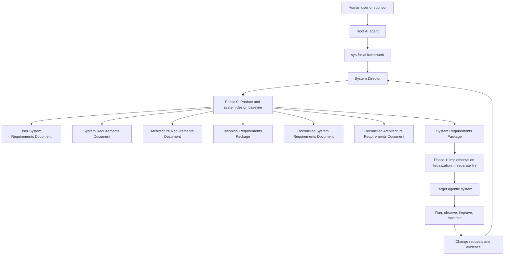
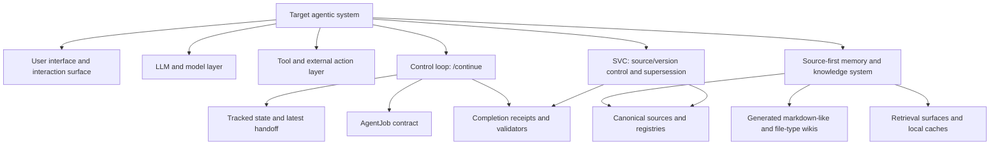
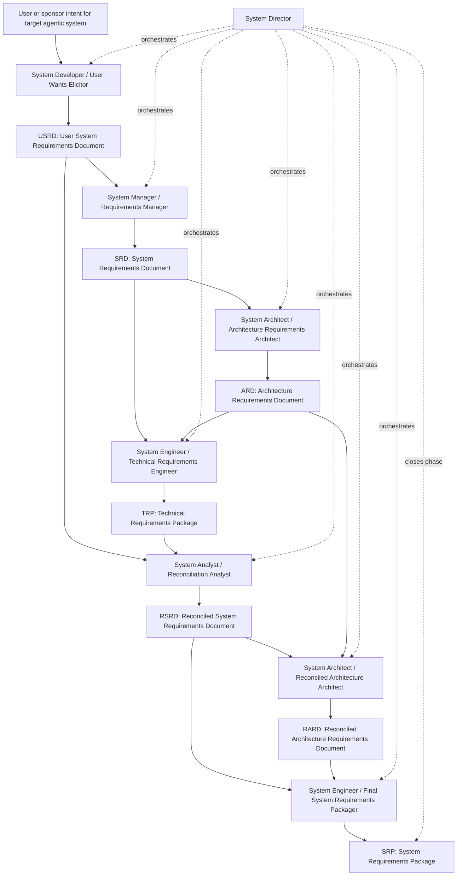

# sys-for-ai Phase 0 Initialization PRD

> **Superseded reference:** This file is retained for historical traceability only. The authoritative Phase 0 PRD is `PRDs/sys-for-ai_phase-0_product_system_design_prd.md`, promoted on 2026-07-05. When this file differs from the canonical PRD, the canonical PRD controls.

**Document status:** Superseded historical reference
**Product name:** `sys-for-ai`  
**Phase:** Phase 0: Product definition and system-design baseline  
**Next planned artifact:** Phase 1: Implementation Initialization, to be generated later in its own file  
**Last updated:** 2026-07-03

---

## 1. Executive summary

`sys-for-ai` is a domain-agnostic system development and management framework for AI agents. It enables a capable AI agent, such as Codex or another AI-harnessed agent, to design, develop, run, improve, and maintain agentic systems for specific use cases across domains such as software engineering, AI, machine learning, physics, mathematics, finance, biology, and other fields. However this project is for now developed within the Codex App AI-harness; therefore, it will leverage the functionality of the Codex App AI-harness.

The central idea is meta-agentic: AI agents use `sys-for-ai` to create and manage other agentic systems. The target output is not merely a document, prompt, repository, or one-off workflow. The target output is a governed agentic system, or a package ready to implement such a system, with defined roles, artifacts, requirements, architecture, verification hooks, operating assumptions, improvement loops, and maintenance obligations.

For Phase 0, an agentic AI software system is treated as a software harness around one or more LLMs, tools, state stores, files, policies, and user-facing interfaces. The harness must include requirements for a bounded control loop, an AgentJob-style execution contract, a source-first memory and knowledge system, source/version-control governance, and derivative documentation surfaces such as generated wikis or reader artifacts.

In Phase 0, `sys-for-ai` establishes the conceptual product definition, role pipeline, artifact contracts, traceability rules, design-phase acceptance criteria, and subsystem requirement baselines. It intentionally stops before implementation initialization. Phase 1 will define how implementation starts, including repository structure, runtime scaffolding, task bootstrapping, tooling choices, and initial executable assets.

---

## 2. Core product statement

### 2.1 Replacement language

Replace the earlier framing:

> `sys-dev-for-ai` is a domain-agnostic system development framework for AI agents. It helps agents develop, improve, run, and maintain systems across software, engineering, financial, biological, mathematical, physical, AI, ML, and other domains.

With the Phase 0 framing:

> `sys-for-ai` is a domain-agnostic system development and management framework for AI agents. It enables an AI agent to design, develop, run, improve, and maintain agentic systems for specific use cases across domains such as software engineering, AI, machine learning, physics, mathematics, finance, biology, and other fields.

### 2.2 Clarifying interpretation

`sys-for-ai` is not just a general methodology for building arbitrary software systems. It is a framework that an AI agent can apply to produce, operate, and evolve target agentic systems. Those target agentic systems may themselves contain multiple roles, agents, skills, tools, repositories, documents, models, evaluators, runtime procedures, and maintenance policies. In software terms, a target agentic system may be a purpose-specific agentic AI application: a harness that wraps one or more LLMs, tools, state/context stores, controlled skills, and a user interface for a defined job.

For clarity throughout this PRD:

- **Framework system:** `sys-for-ai`, the meta-framework being specified here.
- **Root AI agent:** The AI agent using `sys-for-ai` to perform system development and management.
- **Target agentic system:** The agentic system being designed, developed, run, improved, or maintained by the root AI agent using `sys-for-ai`.
- **Agentic AI software harness:** A software system that wraps LLMs, tools, skills, state, context, policies, and user-facing interaction surfaces for a specific purpose.
- **AgentJob:** A bounded execution contract for one controlled unit of agent work, including role binding, allowed inputs and writes, expected outputs, validators, evidence, and stop conditions.
- **Continuation skill:** A controlled operating procedure, named generically as `/continue`, that resumes from tracked state and advances at most one bounded AgentJob per invocation. Domain-specific systems may alias it, for example as `/continue-research`, but `sys-for-ai` should use the general name.
- **Source-first memory and knowledge system:** A context and knowledge-management system in which canonical sources, registries, and control records outrank generated wiki notes, summaries, semantic caches, local vaults, or other retrieval conveniences.
- **SVC system:** The source/version-control system for controlled artifacts, state, histories, supersession records, and generated derivative boundaries. In Phase 0, `SVC` is interpreted as source/version control unless a project-specific SRP defines a narrower meaning.
- **Domain:** The target problem space for the target agentic system, such as software engineering, ML research, finance, mathematics, physics, biology, or another field.

---

## 3. Problem statement

AI agents can generate code, plans, prompts, documents, and workflows, but building reliable agentic systems requires more than output generation. A reusable target agentic system needs governed requirements, architecture, role boundaries, artifact contracts, verification methods, improvement loops, and maintenance rules.

Without a framework like `sys-for-ai`, agentic-system development tends to suffer from the following failure modes:

| Failure mode | Description |
|---|---|
| Ambiguous target | The agent builds “a system” without separating the meta-framework from the target agentic system. |
| Prompt sprawl | Roles, prompts, documents, and code emerge without stable contracts or traceability. |
| Weak requirements | User wants are converted directly into implementation guesses without intermediate validation. |
| Poor domain grounding | Specialized constraints in finance, physics, biology, ML, mathematics, or safety-critical engineering are missed. |
| Unclear handoffs | Sub-agents lack precise inputs, outputs, ownership, and exit criteria. |
| Hard maintenance | The resulting agentic system cannot be audited, improved, updated, or safely operated over time. |
| Implementation drift | Code or prompts evolve away from the original user goals and requirements. |
| Unbounded continuation | Agents keep working from stale context, informal chat memory, or vague next steps instead of a controlled state and bounded job. |
| Memory authority inversion | Generated summaries, wiki pages, semantic caches, local vaults, or PDFs are treated as authority instead of navigation back to canonical sources. |
| Derivative drift | Markdown-like wikis, PDF derivatives, TeX views, HTML explainers, or local indexes become stale or inconsistent with their registered sources. |

`sys-for-ai` addresses these issues by giving the root AI agent a controlled lifecycle for turning a user’s desired use case into a target agentic system that can be implemented, run, improved, and maintained.

---

## 4. Product vision

`sys-for-ai` should become a reusable meta-framework that lets an AI agent behave like a disciplined system director for agentic-system development.

The framework should help the root AI agent answer, for any target use case:

1. What agentic system does the user want?
2. Why does the user want it?
3. Which domain constraints matter?
4. Which roles, artifacts, tools, data, interfaces, and runtime processes are required?
5. What requirements must the target agentic system satisfy?
6. How should the target agentic system be architected?
7. What must be verified before implementation, operation, improvement, or maintenance?
8. What should implementation agents such as Codex consume in Phase 1?
9. How will the target agentic system be governed after it exists?
10. What source-first memory and knowledge system does the target agentic system need?
11. What continuation loop resumes work from tracked state without unbounded wandering?
12. What AgentJob contract constrains each unit of agent work?
13. What markdown-like, SVC, wiki, PDF, TeX, or other derivative surfaces are required, and which sources remain authoritative?

---

## 5. Phase boundary

### 5.1 Phase 0 scope

Phase 0 defines the PRD and system-design baseline for `sys-for-ai`. It covers:

| Area | Phase 0 coverage |
|---|---|
| Product identity | Rename and clarify `sys-for-ai` as a meta-framework for AI agents that build and manage target agentic systems. |
| Concept model | Define root AI agent, target agentic system, domain, sub-agent, artifact, role, and lifecycle. |
| System Design phase | Define the role pipeline, artifact flow, exit gates, and traceability model. |
| Artifact contracts | Define required outputs such as USRD, SRD, ARD, TRP, RSRD, RARD, SRP, run manifest, trace ledger, and issue register. |
| Control-loop requirements | Define Phase 0 obligations for `/continue`, tracked state, handoffs, Director decisions, AgentJobs, completions, validators, and stop conditions. |
| Memory and knowledge requirements | Define source-first context, knowledge, wiki, derivative, registry, and retrieval-surface obligations without selecting implementation tooling. |
| SVC and derivative-surface requirements | Define source/version-control expectations, markdown-like source requirements, generated wiki requirements, and file-type derivative governance. |
| Governance rules | Define universal rules for roles, handoffs, ID schemes, issue handling, and verification hooks. |
| Acceptance criteria | Define what must be true before moving to Phase 1. |

### 5.2 Phase 0 non-scope

Phase 0 does not define the implementation plan in detail. The following belong to Phase 1 or later:

| Out of scope for Phase 0 | Intended future location |
|---|---|
| Repository structure | Phase 1 Implementation Initialization |
| Runtime engine selection | Phase 1 or architecture implementation planning |
| Concrete prompt file layout | Phase 1 |
| CLI, API, package, or service interfaces | Phase 1 or later implementation PRDs |
| CI/CD, deployment, test harness, or observability setup | Phase 1 or later |
| Concrete domain adapter templates | Phase 1 or later domain-pack specifications |
| Production operation procedures | Later Run, Improve, and Maintain phases |
| Concrete memory database, vector index, wiki engine, or retrieval implementation | Phase 1 or later implementation planning |
| Concrete AgentJob schema files, CLI commands, scripts, or validators | Phase 1 Implementation Initialization |
| Concrete SVC provider, branch strategy, commit convention, or repository automation | Phase 1 or later implementation planning |
| Concrete PDF, TeX, HTML, notebook, or other file-type wiki implementation | Phase 1 or domain-pack implementation after Phase 0 requirements determine which surfaces are needed |

---

## 6. Primary users and stakeholders

| Stakeholder | Role in `sys-for-ai` |
|---|---|
| Human user or sponsor | Provides the desired use case, constraints, goals, acceptance expectations, and approval decisions. |
| Root AI agent | Uses `sys-for-ai` to orchestrate the design, development, operation, improvement, and maintenance of a target agentic system. |
| Codex-like implementation agent | Consumes Phase 0 outputs and later Phase 1 instructions to create or modify repositories, tools, prompts, tests, and runtime assets. |
| System Director sub-agent | Orchestrates phases, role spawning, artifact governance, traceability, gates, and handoffs. |
| Specialist sub-agents | Produce controlled artifacts such as requirements, architecture, technical packages, reconciliation reports, and verification reviews. |
| Domain specialist agent | Validates specialized assumptions, constraints, terminology, metrics, risks, and acceptance evidence. |
| Security, safety, privacy, and compliance reviewer | Reviews risks and controls for sensitive, regulated, autonomous, or high-impact target agentic systems. |
| Maintainer agent | Uses artifacts, logs, issues, and evaluations to keep the target agentic system reliable after implementation. |
| Context, memory, and knowledge owner | Defines source authority, registries, retrieval surfaces, context preflight, and stale-context controls. |
| Control-loop and AgentJob owner | Defines the continuation procedure, state model, job contract, completion evidence, validator gates, and handoff semantics. |
| SVC and documentation-surface owner | Defines source/version-control requirements, markdown-like authoring, generated derivative rules, wiki boundaries, and publication or reader-surface controls. |

---

## 7. Target use cases

### 7.1 Greenfield target agentic system

A user asks the root AI agent to create a new target agentic system for a specific use case. Examples include:

- A software engineering agent team for issue triage, code changes, review, testing, and release support.
- A mathematical research assistant system for conjecture exploration, proof planning, formalization, and verification.
- An ML experimentation system for literature review, experiment design, training runs, evaluation, and model-card generation.
- A finance analysis system for data ingestion, risk analysis, reporting, and audit evidence.

`sys-for-ai` guides the root AI agent from user intent through requirements, architecture, technical packaging, and implementation readiness.

### 7.2 Brownfield target agentic system improvement

A user already has an agentic system, prompt framework, repository, workflow, or multi-agent process. The root AI agent uses `sys-for-ai` to analyze the current state, preserve what works, identify risks, reconcile requirements, and produce an improvement plan.

### 7.3 Agentic-system operation and maintenance

A user wants a target agentic system that can be operated over time. `sys-for-ai` must capture requirements for monitoring, evaluation, issue handling, safety controls, prompt or tool updates, regression checks, and change control.

### 7.4 Agentic AI software harness

A user wants a purpose-specific software product that wraps one or more LLMs, tools, knowledge sources, and user-facing interaction flows. Examples include:

- A local or web UI that lets a user run a governed agent team against a repository, document set, research problem, or business workflow.
- A tool-using assistant that records its state, work boundaries, completions, and handoffs so work can resume safely.
- A domain-specific agent application that maintains its own source-first knowledge base, generated wiki, and audit trail.

`sys-for-ai` must require the Phase 0 SRP to define the harness boundary, the user interface responsibilities, the tool and memory boundaries, and the control-loop expectations.

### 7.5 Domain-specialized agentic system

A target agentic system must operate in a domain with specialized constraints. For example:

| Domain | Example target agentic system | Domain-sensitive concerns |
|---|---|---|
| Software engineering | Codebase maintenance agent team | Repositories, tests, CI, architecture, security, release discipline. |
| AI and ML | Research and evaluation agent system | Dataset lineage, model drift, benchmark validity, reproducibility, safety evaluations. |
| Physics | Simulation planning or literature synthesis agents | Physical validity, units, numerical stability, experimental assumptions. |
| Mathematics | Proof exploration or formalization agents | Definitions, theorem dependencies, proof validity, formal-verifier compatibility. |
| Finance | Risk and reporting agent system | Data lineage, auditability, regulatory constraints, capital risk, decision controls. |
| Biology | Literature, experiment, or pipeline agents | Protocol validity, biological variability, safety, privacy, reproducibility. |

---

## 8. Conceptual model



The diagram separates `sys-for-ai` from the target agentic system. `sys-for-ai` is the framework used by the root AI agent. The target agentic system is the system being produced, run, improved, or maintained.

### 8.1 Required target subsystem baselines

Every serious target agentic system should be analyzed as a set of cooperating subsystems. Phase 0 does not implement these subsystems, but it must determine their requirements when the target system is expected to run, improve, or be maintained over time.



The key Phase 0 requirement is authority separation. Canonical sources, registries, control records, and approved requirements define truth for the target system. Generated wikis, PDFs, TeX renderings, HTML explainers, semantic extracts, indexes, and local vaults are useful context surfaces, but they must point back to sources before they are used for claims, routing, or implementation authority.

---

## 9. System Design phase pipeline

Phase 0 preserves the System Design phase pipeline while updating the language so every role is explicitly contributing to the definition of a target agentic system.



---

## 10. Core role catalog

### 10.1 System Director

| Field | Description |
|---|---|
| Role type | Orchestrator, dispatcher, artifact governor. |
| Spawned by | Root AI agent. |
| Primary mission | Coordinate the design and management lifecycle for the target agentic system by spawning the correct sub-agent for each transformation, enforcing artifact contracts, maintaining traceability, and deciding when an artifact is ready to hand off. |
| Primary outputs | `system-design-run-manifest.md`, `artifact-registry.md`, `traceability-ledger.md`, `open-issues-register.md`, control-loop and memory-readiness notes, `design-phase-readiness-report.md`. |

Required responsibilities:

| Task | Description |
|---|---|
| Create run plan | Determine which roles are needed and in what order for the target agentic system. |
| Spawn one sub-agent per role | Give each role only the inputs it needs and a precise output contract. |
| Maintain artifact registry | Track artifact name, version, owner role, source inputs, status, assumptions, open issues, and downstream consumers. |
| Enforce gates | Do not send weak or incomplete artifacts downstream without marking risks and gaps. |
| Route gaps backward | Send missing or conflicting information to the right upstream role. |
| Maintain traceability | Preserve links across USRD, SRD, ARD, TRP, RSRD, RARD, and SRP. |
| Require control-loop baseline | Ensure the SRP states whether the target system needs `/continue`, tracked state, handoffs, AgentJobs, completion receipts, validators, and stop conditions. |
| Require memory baseline | Ensure the SRP states source authority, registry needs, retrieval surfaces, wiki/derivative surfaces, context preflight expectations, and stale-context controls. |
| Require SVC baseline | Ensure the SRP states source/version-control expectations, supersession rules, derivative regeneration rules, and historical-control-record handling. |
| Close Phase 0 | Produce the design readiness report and Phase 1 handoff package. |

Exit criteria:

1. Every Phase 0 artifact has an owner, version, source inputs, and status.
2. Every downstream artifact traces back to upstream artifacts.
3. Every missing or unresolved value is captured in the issue register.
4. The SRP is complete enough for a Phase 1 implementation-initialization artifact.

### 10.2 System Developer / User Wants Elicitor

| Field | Description |
|---|---|
| Role type | Requirements elicitation agent. |
| Spawned after | User provides initial intent for a target agentic system. |
| Primary artifact | USRD, User System Requirements Document. |
| Skill | `/drill-user-for-sys-wants`. |

Required responsibilities:

| Task | Description |
|---|---|
| Drill for target intent | Ask what target agentic system the user wants, what problem it solves, who uses it, and what success looks like. |
| Identify stakeholders | Capture users, operators, maintainers, approvers, external systems, domain experts, and decision owners. |
| Capture desired capabilities | Convert user wants into candidate capabilities, workflows, user stories, job stories, or event stories. |
| Capture constraints | Record budget, schedule, platforms, domains, tools, standards, safety, compliance, data, and deployment limits. |
| Capture quality expectations | Elicit performance, reliability, usability, safety, security, privacy, maintainability, scalability, observability, and testability expectations. |
| Capture acceptance expectations | Ask what evidence would convince the user that the target agentic system works. |
| Capture unknowns | Mark ambiguous or unanswered items as `USRD-TBD-*` or `USRD-TBR-*`. |
| Produce USRD | Package the elicited wants into a controlled artifact. |

### 10.3 Existing System Analyst

| Field | Description |
|---|---|
| Role type | Current-state discovery agent. |
| Spawned when | The target agentic system already exists, replaces something, integrates with something, or modernizes something. |
| Primary artifact | ESAR, Existing Systems Analysis Report. |

Required responsibilities:

| Task | Description |
|---|---|
| Build inventory | Capture existing agents, prompts, tools, repositories, services, data stores, jobs, devices, pipelines, models, ledgers, or workflows. |
| Map ownership | Identify product owner, technical owner, data owner, security owner, and operational owner. |
| Map dependencies | Capture upstream and downstream systems, APIs, event streams, files, human handoffs, vendors, and external services. |
| Map data | Capture data classes, retention, sensitivity, lineage, residency, producers, consumers, and backup expectations. |
| Identify current constraints | Runtime topology, deployment process, compliance, safety, technical debt, bottlenecks, and single points of failure. |
| Produce risk register | Record risks with evidence, impact, mitigation, owner, and unresolved questions. |

### 10.4 System Manager / Requirements Manager

| Field | Description |
|---|---|
| Role type | System requirements author. |
| Spawned after | USRD is available. |
| Primary artifact | SRD, System Requirements Document. |

Required responsibilities:

| Task | Description |
|---|---|
| Normalize USRD items | Turn user wants into atomic candidate requirements for the target agentic system. |
| Classify requirements | Functional, nonfunctional, interface, data, operational, safety, security, compliance, maintainability, transition, and constraint requirements. |
| Write requirement statements | Use clear, singular, testable statements. Prefer “shall” for binding requirements. |
| Preserve rationale | Put the reason in a rationale field, not inside the normative requirement sentence. |
| Define acceptance basis | Add verification method and acceptance criteria. |
| Prioritize | Use MoSCoW, risk, value, WSJF, or a project-specific scheme. |
| Trace to USRD | Every SRD item links back to user goals, wants, constraints, or explicit external obligations. |
| Flag ambiguity | Create `SRD-TBD-*`, `SRD-TBR-*`, or issue entries where the USRD is incomplete. |
| Baseline SRD | Package the SRD for architecture derivation. |

### 10.5 System Architect / Architecture Requirements Architect

| Field | Description |
|---|---|
| Role type | Architecture requirements author. |
| Spawned after | SRD is baselined or provisionally baselined. |
| Primary artifact | ARD, Architecture Requirements Document. |

Required responsibilities:

| Task | Description |
|---|---|
| Ingest SRD | Parse target agentic system requirements into architecture-relevant concerns. |
| Identify ASRs | Mark architecturally significant requirements, especially those affecting agent roles, tool use, memory, context flow, autonomy, deployment, interfaces, scaling, security, data, resilience, or operability. |
| Derive architecture drivers | Convert SRD requirements into drivers and quality-attribute scenarios. |
| Define architecture views | Context, logical, component, interface, data flow, memory/knowledge, control-loop, SVC, deployment, security, operations, and dynamic views as needed. |
| Select architecture mechanisms | Identify patterns, tactics, allocation choices, data ownership, interface strategy, deployment topology, memory architecture, control-loop architecture, SVC boundaries, and operational mechanisms. |
| Record decisions | Create ADRs for significant choices, alternatives, tradeoffs, consequences, and risks. |
| Define evaluation evidence | Specify how architecture satisfaction will be checked. |
| Trace everything | Link SRD item to architecture driver, mechanism, view, ADR, and verification evidence. |

### 10.6 System Engineer / Technical Requirements Engineer

| Field | Description |
|---|---|
| Role type | Technical requirements derivation agent. |
| Spawned after | SRD and ARD are available. |
| Primary artifact | TRP, Technical Requirements Package. |

Required responsibilities:

| Task | Description |
|---|---|
| Baseline sources | Confirm SRD and ARD versions and precedence. |
| Atomize source statements | Break SRD and ARD prose into atomic source items. |
| Classify source items | Functional, performance, reliability, security, interface, data, deployment, compliance, testability, and other categories. |
| Identify gaps and conflicts | Missing thresholds, actors, units, environments, acceptance criteria, interface owners, or contradictions. |
| Allocate to product structure | Map requirements to agents, roles, prompts, skills, tools, AgentJobs, state records, memory stores, registries, wiki/derivative surfaces, components, services, interfaces, data stores, environments, procedures, tests, or model elements. |
| Draft technical requirements | Write implementable “shall” statements at the correct technical level. |
| Add metadata | Source trace, rationale, priority, risk, effort, owner, key decision record flag, assumptions, and verification method. |
| Define verification matrix | Unit, integration, system, acceptance, analysis, inspection, demonstration, simulation, or test evidence. |
| Produce TRP | Package requirements, matrices, assumptions, risks, and sign-off records. |

### 10.7 System Analyst / Reconciliation Analyst

| Field | Description |
|---|---|
| Role type | Alignment, gap, and conflict-resolution agent. |
| Spawned after | USRD and TRP are available. |
| Primary artifact | RSRD, Reconciled System Requirements Document. |

Required responsibilities:

| Task | Description |
|---|---|
| Compare USRD to TRP | Check whether every user goal is satisfied, refined, deferred, rejected, or blocked. |
| Detect overbuild | Identify TRP requirements that exceed user intent or impose unnecessary constraints. |
| Detect underbuild | Identify user wants not represented in the technical package. |
| Detect conflicts | Identify conflicts among user goals, technical feasibility, architecture choices, compliance, risk, cost, and schedule. |
| Reconcile priorities | Align Must, Should, Could, and Later priorities with technical risk, effort, and dependencies. |
| Clarify rationale | Ensure technical constraints have user-visible justification. |
| Produce decision log | Record accepted changes, rejected changes, deferred issues, and rationale. |
| Produce RSRD | Create a reconciled system-level requirement baseline. |

### 10.8 System Architect / Reconciled Architecture Architect

| Field | Description |
|---|---|
| Role type | Architecture reconciliation agent. |
| Spawned after | RSRD is available. |
| Primary artifact | RARD, Reconciled Architecture Requirements Document. |

Required responsibilities:

| Task | Description |
|---|---|
| Compare RSRD to ARD | Identify architecture mismatches caused by reconciliation. |
| Update ASRs | Revise architecturally significant requirements. |
| Update quality scenarios | Revise performance, security, safety, reliability, scalability, testability, or other scenarios. |
| Update architecture views | Modify logical, interface, data, deployment, security, and operational views. |
| Update ADRs | Supersede, revise, reject, or add decisions. |
| Re-evaluate tradeoffs | Ensure architecture remains justified against RSRD. |
| Produce RARD | Create the architecture baseline for final engineering. |

### 10.9 System Engineer / Final System Requirements Packager

| Field | Description |
|---|---|
| Role type | Final technical packaging agent. |
| Spawned after | RSRD and RARD are available. |
| Primary artifact | SRP, System Requirements Package. |

Required responsibilities:

| Task | Description |
|---|---|
| Baseline RSRD and RARD | Confirm source versions and precedence. |
| Derive final technical requirements | Convert reconciled requirements and architecture into final implementable obligations. |
| Allocate requirements | Map to agents, roles, prompts, skills, tools, AgentJobs, memory/knowledge components, registries, wiki/derivative surfaces, SVC controls, components, subsystems, interfaces, data stores, services, environments, tests, or work packages. |
| Build final traceability | Link RSRD and RARD to SRP and verification artifacts. |
| Build verification hooks | Define evidence for each requirement. |
| Create implementation readiness matrix | Identify build-ready, blocked, risky, deferred, or externally dependent items. |
| Produce SRP | Create the final requirements package for Phase 1 implementation planning. |

### 10.10 Recommended support roles

| Role | When to include | Primary contribution |
|---|---|---|
| Requirements Verifier / Consistency Auditor | After SRD, ARD, TRP, RSRD, RARD, and SRP | Reviews quality, traceability, contradictions, missing acceptance criteria, vague requirements, and hidden implementation assumptions. |
| Domain Specialist | Any specialized scientific, mathematical, financial, biological, ML, safety, or engineering domain | Validates assumptions, hidden constraints, terminology, acceptance metrics, and domain-specific risks. |
| Security, Safety, Privacy, and Compliance Reviewer | Sensitive, regulated, production, autonomous, or high-impact target agentic systems | Maps threat, hazard, privacy, compliance, data-handling, and AI/ML risk controls to evidence obligations. |
| Documentation Librarian / Configuration Controller | Any project with multiple artifacts, versions, or agent handoffs | Maintains artifact index, ID registry, template consistency, change log, and release bundles. |
| Runtime and Maintenance Planner | When target agentic system must run over time | Captures operations, monitoring, evaluation, update, incident, and maintenance requirements for later phases. |
| Control Loop and AgentJob Planner | When the target system must resume work, dispatch sub-agents, or constrain tool-using actions | Defines `/continue`, tracked state, AgentJob schema needs, completion evidence, validator gates, stop conditions, and handoff semantics. |
| Context, Memory, and Knowledge Architect | When the target system needs durable knowledge, project memory, generated documentation, or retrieval | Defines source authority, registries, context preflight, generated wikis, file-type derivative surfaces, retrieval limits, and verification-back-to-source rules. |
| SVC and Documentation Surface Architect | When the target system has controlled sources, generated docs, or multi-file artifacts | Defines markdown-like authoring, source/version control, supersession, derivative regeneration, PDF/TeX/HTML/wiki authority boundaries, and release evidence. |

---

## 11. Universal rules for every role

Every role should obey these rules unless the System Director explicitly overrides them.

| Rule | Meaning |
|---|---|
| Trace everything | Every output claim should trace to a source artifact, user statement, assumption, constraint, decision, or open issue. |
| Do not guess silently | Missing thresholds, actors, environments, units, constraints, or acceptance criteria become TBD or TBR items with owner and risk impact. |
| Separate requirement from rationale | The normative requirement says what must be true. Rationale explains why. |
| Use stable IDs | Artifacts, requirements, assumptions, decisions, risks, controls, and verification items must have unique IDs. |
| Prefer measurable acceptance | Every requirement should have a verification method and acceptance criterion before baseline. |
| Keep artifact boundaries clean | USRD captures user wants. SRD captures system obligations. ARD captures architectural response. TRP and SRP capture implementable technical requirements. |
| Clarify framework versus target | Every artifact must make clear whether it describes `sys-for-ai` or the target agentic system. |
| Treat autonomy as a risk dimension | Agent autonomy, tool permissions, memory, data access, and external actions must be explicit where relevant. |
| Preserve phase boundaries | Phase 0 produces implementation readiness, not implementation initialization. |
| Source beats retrieval | Generated memory, wiki notes, local vaults, semantic extracts, summaries, PDFs, HTML, and other derivatives are navigation aids unless explicitly baselined as source artifacts. |
| Verify memory hits | Any retrieved context that influences a requirement, routing decision, claim, AgentJob boundary, or handoff must be checked against a canonical source, registry row, or controlled artifact. |
| Bound continuation | A continuation invocation should advance at most one authorized AgentJob unless the SRP explicitly defines a safer project-specific transaction model. |
| Supersede, do not rewrite | Activated Director decisions, AgentJobs, completion records, handoffs, and baseline artifacts should be corrected through supersession rather than silent historical mutation. |
| Validator success is scoped | A passing validator proves only the defined process or artifact check, not domain truth, scientific validity, business correctness, or safety in production. |

---

## 12. Artifact catalog

| Artifact | Purpose | Producer role | Primary consumer |
|---|---|---|---|
| `system-design-run-manifest.md` | Ordered list of roles, task IDs, inputs, outputs, gates, and status. | System Director | All roles, Phase 1 |
| `artifact-registry.md` | Single index of current artifact versions, owners, status, source links, and downstream dependencies. | System Director or Documentation Librarian | All roles |
| `traceability-ledger.md` | Cross-artifact trace from user intent to implementation-ready requirements. | System Director | Verifiers, Phase 1 |
| `open-issues-register.md` | All unresolved assumptions, conflicts, risks, TBD items, and TBR items. | System Director | All roles |
| USRD | Captures user goals, desired capabilities, domain context, constraints, priorities, and acceptance expectations. | User Wants Elicitor | Requirements Manager, Reconciliation Analyst |
| ESAR | Current-state assessment for existing target agentic systems or related systems. | Existing System Analyst | Requirements Manager, Architect, Engineer |
| SRD | Controlled system requirements for the target agentic system. | Requirements Manager | Architect, Engineer, Verifier |
| ARD | Architecture requirements, drivers, views, tradeoffs, decisions, and verification evidence. | System Architect | Technical Requirements Engineer |
| TRP | Implementable technical requirements derived from SRD and ARD. | Technical Requirements Engineer | Reconciliation Analyst, Verifier |
| RSRD | Reconciled system requirements after user intent and technical derivation are aligned. | Reconciliation Analyst | Reconciled Architect, Final Packager |
| RARD | Reconciled architecture baseline aligned to RSRD. | Reconciled Architect | Final Packager |
| SRP | Final implementation-ready system requirements package for the target agentic system. | Final System Requirements Packager | Phase 1 Implementation Initialization |
| `design-phase-readiness-report.md` | Phase 0 closure report with readiness, risks, unresolved items, and Phase 1 handoff notes. | System Director | Human sponsor, root AI agent, Phase 1 |
| CLRA, Control Loop Requirements Annex | Defines `/continue`, tracked state, handoffs, AgentJob boundaries, role binding, completion receipts, validators, checkpoint or commit expectations, and stop conditions. | System Architect, System Engineer, Control Loop and AgentJob Planner | Final Packager, Phase 1 |
| CKMSRA, Context and Knowledge Management System Requirements Annex | Defines source-first memory, canonical sources, registries, context preflight, retrieval surfaces, generated wikis, derivative artifacts, and stale-context rules. | Context, Memory, and Knowledge Architect | Architect, Engineer, Phase 1 |
| SVCDA, Source/Version Control and Derivative Artifact Annex | Defines markdown-like sources, SVC expectations, supersession, generated derivative governance, PDF/TeX/HTML/wiki policies, and release evidence. | Documentation Librarian, SVC and Documentation Surface Architect | Final Packager, Phase 1 |

---

## 13. Artifact output structures

### 13.1 USRD output structure

| Section | Contents |
|---|---|
| Purpose | Why the user wants the target agentic system. |
| System vision | Plain-language description of the desired target agentic system. |
| Stakeholders | Users, operators, owners, maintainers, affected parties. |
| User goals and outcomes | What the user wants to achieve. |
| Desired capabilities | Functions, workflows, events, behaviors, decisions, and agent responsibilities. |
| Nonfunctional wants | Quality expectations and constraints. |
| Domain context | Domain assumptions, vocabulary, standards, examples, data, tools, and risks. |
| Data and interfaces | Expected data, external systems, APIs, files, instruments, models, repositories, or tools. |
| Acceptance expectations | What “good enough” means to the user. |
| Priorities | Must, Should, Could, Later, or another agreed scheme. |
| Assumptions and open questions | Explicit ambiguity register. |
| Source trace | User statements, session notes, files, examples, screenshots, repositories, and documents. |

### 13.2 SRD output structure

| Section | Contents |
|---|---|
| Document control | Version, status, owner, approvers, change authority. |
| Purpose and scope | Target agentic system, included scope, exclusions, precedence. |
| Stakeholders and roles | Decision rights, reviewers, approvers, users. |
| System context | External systems, operating environment, context diagram. |
| Requirement conventions | ID scheme, syntax, priority method, verification method codes. |
| System requirements | Functional and nonfunctional requirements. |
| Agentic behavior requirements | Role autonomy, escalation, context use, tool use, memory, collaboration, and supervision. |
| Interfaces and data | Interface obligations and data expectations. |
| Constraints | Technical, operational, legal, scientific, physical, mathematical, organizational, and safety constraints. |
| Verification and validation basis | Verification methods, acceptance criteria, evidence expectations. |
| Traceability appendix | USRD to SRD mapping. |
| Open issues | Ambiguities, conflicts, assumptions, TBD items, and TBR items. |

### 13.3 ARD output structure

| Section | Contents |
|---|---|
| Purpose and scope | Architecture decision scope and system boundary. |
| Stakeholders and concerns | Concerns mapped to viewpoints and reviews. |
| Source SRD baseline | SRD version and requirement inventory. |
| Assumptions and constraints | Architecture-shaping assumptions and hard constraints. |
| Architecture drivers | ASRs, quality attributes, interfaces, data, compliance, operations, and autonomy constraints. |
| Quality scenarios | Performance, safety, security, reliability, scalability, maintainability, testability, and observability. |
| Agent architecture overview | Agent roles, responsibilities, autonomy levels, collaboration model, memory model, and tool model. |
| Logical architecture | Major components, responsibilities, boundaries. |
| Interfaces and integrations | Protocols, contracts, schemas, versioning, error semantics. |
| Data architecture | Data ownership, persistence, lineage, retention, privacy-sensitive flows. |
| Context, memory, and knowledge architecture | Source authority, registries, context preflight, retrieval surfaces, generated wikis, derivative artifacts, and source-verification rules. |
| Control-loop architecture | `/continue`, tracked state, handoffs, AgentJob boundaries, Director decisions, completions, validators, stop conditions, and checkpoint expectations. |
| SVC and derivative-surface architecture | Markdown-like sources, source/version-control boundaries, historical record handling, generated PDF/TeX/HTML/wiki surfaces, and regeneration rules. |
| Deployment architecture | Environments, runtime topology, failure domains, scaling, recovery. |
| Security and privacy architecture | Identity, trust boundaries, secrets, logging, controls. |
| ADR index | Decision records and status. |
| Traceability matrix | SRD to architecture mapping. |
| Risks and mitigations | Architecture risks, tradeoffs, unresolved issues. |
| Acceptance and verification | Metrics, reviews, tests, evidence owners. |

### 13.4 TRP output structure

| Section | Contents |
|---|---|
| Purpose and scope | What implementation layers the TRP governs. |
| Applicable documents and precedence | SRD, ARD, standards, regulatory constraints. |
| Technical context | Architecture summary needed for implementation. |
| Derivation rules | How SRD and ARD items were transformed. |
| Technical requirements | Implementable, atomic, testable requirements. |
| Agent, prompt, and skill requirements | Required roles, prompts, tools, skill files, memories, context windows, AgentJobs, continuation skills, and execution boundaries. |
| Control-loop requirements | State files or stores, handoff records, Director decisions, AgentJob fields, completion receipts, validators, stop conditions, and checkpoint evidence. |
| Context, memory, and knowledge requirements | Source authority hierarchy, registries, semantic/query surfaces, generated wikis, derivative artifacts, local caches, and source-verification obligations. |
| SVC and derivative-surface requirements | Markdown-like source rules, source/version-control rules, supersession handling, generated PDF/TeX/HTML/wiki policies, and regeneration or validation hooks. |
| Interface and data requirements | Contracts, schemas, message rules, data obligations. |
| Deployment and operations requirements | Runtime, environments, observability, scaling, recovery. |
| Security and compliance requirements | Controls, evidence, supply chain, auditability. |
| Verification matrix | Requirement to method to artifact to acceptance criteria. |
| Traceability matrix | SRD and ARD to TRP mapping. |
| Open issues and assumptions | TBD items, TBR items, risks, unresolved values. |
| Sign-off record | Reviewers and disposition. |

### 13.5 RSRD output structure

| Section | Contents |
|---|---|
| Reconciliation summary | What changed from SRD and why. |
| User goal coverage | USRD goal to satisfied, partially satisfied, not satisfied, deferred, or blocked. |
| Requirement changes | Added, modified, merged, split, removed, deferred. |
| Accepted technical constraints | Technical requirements accepted into system-level baseline. |
| Rejected or relaxed constraints | Technical requirements removed or softened due to user mismatch. |
| Open tradeoffs | Cost, schedule, risk, feasibility, domain ambiguity. |
| Reconciled system requirements | Final system-level requirements after negotiation. |
| Traceability matrix | USRD to SRD to TRP to RSRD. |
| Decision log | Rationale for every major reconciliation decision. |

### 13.6 RARD output structure

| Section | Contents |
|---|---|
| Reconciliation summary | What changed from ARD. |
| Updated architecture drivers | RSRD-driven drivers and ASRs. |
| Updated views | Revised architecture diagrams and view descriptions. |
| Updated interfaces and data flows | Contract, schema, boundary, and ownership changes. |
| Updated deployment and operations | Runtime, scaling, resilience, observability changes. |
| Updated security and compliance | Revised controls and evidence expectations. |
| ADR updates | Accepted, superseded, rejected, new ADRs. |
| Traceability matrix | RSRD to RARD mapping. |
| Verification and evaluation | Architecture acceptance evidence. |

### 13.7 SRP output structure

| Section | Contents |
|---|---|
| Purpose and scope | What the final package governs. |
| Source baseline | RSRD and RARD versions. |
| Final technical requirements | Buildable, testable requirements. |
| Allocation matrix | Requirement to agent, role, component, interface, data, environment, or work package. |
| Verification matrix | Requirement to verification method to evidence to acceptance criteria. |
| Risk and issue register | Remaining blockers and risks. |
| Implementation readiness matrix | Ready, blocked, risky, deferred, or externally dependent status. |
| Control-loop and AgentJob baseline | Final build-ready requirements or open issues for `/continue`, state, handoffs, AgentJobs, completions, validators, and stop conditions. |
| Context, memory, and knowledge baseline | Final build-ready requirements or open issues for source-first memory, registries, retrieval, generated wikis, and derivative surfaces. |
| SVC and derivative-surface baseline | Final build-ready requirements or open issues for markdown-like sources, source/version control, supersession, derivative regeneration, and file-type wikis. |
| Phase 1 handoff block | What the implementation-initialization artifact must consume. |
| Change-control notes | What must be controlled after baseline. |
| Sign-off record | Final design-phase approvals. |


### 13.8 CLRA output structure, Control Loop Requirements Annex

The CLRA may be a standalone annex or a required section inside ARD, TRP, RARD, and SRP, depending on project size. Its purpose is to make the target system's run/resume loop explicit before Phase 1 implementation.

| Section | Contents |
|---|---|
| Purpose and scope | What lifecycle stages the control loop governs and which actions remain outside it. |
| Continuation command or skill | Generic `/continue` name, allowed aliases, entry conditions, operator expectations, and domain-specific routing names if needed. |
| State model | Program state, active task, latest handoff, current AgentJob, blocking state, and lifecycle status. |
| Director decision model | When a Director decision is required, what alternatives must be recorded, and how supersession works. |
| AgentJob contract | Objective, role binding, allowed reads, allowed writes, forbidden paths/actions, expected outputs, validators, evidence, and stop conditions. |
| Role execution model | Registered roles, task overlays, one-job provisional roles, authority boundaries, and expiry. |
| Memory preflight | Context refresh, retrieval query, source verification, stale-context detection, and receipt evidence. |
| Completion receipt | Output manifest, changed artifacts, command evidence, validation status, uncertainty, next recommendation, and unresolved issues. |
| Handoff model | Handoff format, next-route authority, continuation state, human gates, and relation to program state. |
| Validation and checkpoint gates | Process validators, domain validators, generated-surface sync, SVC checkpoint expectations, and failure handling. |
| Stop conditions | Human gate, validator failure, write-boundary conflict, authority expansion, no role fit, unsafe autonomy, or unresolved source authority. |
| Phase 1 handoff | Schema, script, CLI, service, and repository questions deferred to Implementation Initialization. |

### 13.9 CKMSRA output structure, Context and Knowledge Management System Requirements Annex

The CKMSRA defines the memory and knowledge system that a target agentic system needs. It must keep retrieval convenience subordinate to source authority.

| Section | Contents |
|---|---|
| Purpose and scope | What knowledge, context, and retrieval problems the target system must solve. |
| Authority hierarchy | Canonical sources, controlled Markdown-like docs, registries, approved requirements, control records, generated derivatives, and local caches. |
| Source object model | Object IDs, source paths, owners, hashes, version, domain, artifact class, sensitivity, and downstream consumers. |
| Registry and ledger model | Source registries, derivative registries, relationship graphs, task/job/decision registries, trace ledgers, and issue ledgers. |
| Retrieval surfaces | Search, lookup, semantic extracts, local indexes, local vaults, summaries, and navigation rules. |
| Generated wiki policy | Markdown-like wiki, domain wikis, file-type wikis, index pages, backlinking, regeneration, and stale derivative warnings. |
| File-type derivative policy | PDF, TeX, HTML, notebook, image, data, or domain-specific derivative requirements, including whether each is source, generated evidence, or human-readable only. |
| Memory preflight and source verification | When context must be refreshed, what queries must run, how results are checked against canonical sources, and how evidence is recorded. |
| Context-window policy | What may be loaded into agent context, compression rules, source citation rules, and max-risk context classes. |
| Security, privacy, and retention | Sensitive knowledge classes, access controls, redaction, local-cache cleanup, retention, and auditability. |
| Validation and regeneration | Bootstrap, validate-only, drift detection, orphan derivative detection, and acceptance evidence. |
| Phase 1 handoff | Concrete storage, vector, database, wiki, script, or UI choices deferred to implementation. |

### 13.10 SVCDA output structure, Source/Version Control and Derivative Artifact Annex

The SVCDA defines how target systems preserve controlled history without letting generated surfaces become ghost authorities.

| Section | Contents |
|---|---|
| Purpose and scope | What controlled artifacts, source files, generated derivatives, state files, and release bundles the SVC system governs. |
| Source and derivative classes | Canonical source, controlled Markdown-like source, control record, generated derivative, local cache, published reader surface, and external source. |
| Versioning model | IDs, versions, baselines, hash strategy, source registry rows, derivative registry rows, and release bundles. |
| Supersession model | How activated decisions, AgentJobs, completions, handoffs, requirements, and baselined artifacts are corrected without silent mutation. |
| Markdown-like authoring model | Required structure for project docs, control sections, explanatory sections, specs, templates, cross-links, and authority markers. |
| File-type wiki model | When to require Markdown, TeX, PDF, HTML, notebook, data, or other wikis, and how each traces to source. |
| Regeneration model | Which derivative artifacts are script-generated, when regeneration is required, and what counts as stale or orphaned. |
| Checkpoint model | What must be validated before a checkpoint or commit, which paths may change, and how unrelated changes are blocked or reported. |
| Audit and release evidence | Registry diffs, trace ledgers, validation receipts, human approvals, and downstream Phase 1 consumption notes. |
| Phase 1 handoff | Concrete repository, branch, commit, automation, and provider decisions deferred to Implementation Initialization. |

---

## 14. Functional requirements

| ID | Requirement | Priority | Verification method | Acceptance criteria |
|---|---|---:|---|---|
| SFA-P0-FR-001 | `sys-for-ai` shall use `sys-for-ai` as the product name and treat `sys-dev-for-ai` as a former working name. | Must | Inspection | Phase 0 artifacts use `sys-for-ai` except in explicit change-history or replacement-language references. |
| SFA-P0-FR-002 | `sys-for-ai` shall define itself as a framework used by AI agents to design, develop, run, improve, and maintain target agentic systems. | Must | Inspection | Executive summary, core product statement, and glossary all express the meta-agentic purpose. |
| SFA-P0-FR-003 | `sys-for-ai` shall distinguish the framework system from the target agentic system in every major artifact. | Must | Inspection | Artifact templates include language for framework versus target agentic system boundaries. |
| SFA-P0-FR-004 | `sys-for-ai` shall support target agentic systems across software engineering, AI, ML, physics, mathematics, finance, biology, and other domains. | Must | Inspection | Domain coverage section and requirements include domain-specialist hooks and domain-specific constraints. |
| SFA-P0-FR-005 | `sys-for-ai` shall define a System Design phase pipeline that produces USRD, SRD, ARD, TRP, RSRD, RARD, and SRP. | Must | Inspection | Pipeline diagram and artifact catalog include all required artifacts and producer roles. |
| SFA-P0-FR-006 | `sys-for-ai` shall support optional current-state analysis for existing target agentic systems or related systems. | Should | Inspection | Existing System Analyst role and ESAR artifact are defined. |
| SFA-P0-FR-007 | `sys-for-ai` shall require each role to have explicit input artifacts, output artifacts, responsibilities, and exit criteria. | Must | Inspection | Role catalog and handoff contract include these fields. |
| SFA-P0-FR-008 | `sys-for-ai` shall preserve traceability from user intent through final implementation-ready requirements. | Must | Trace review | Traceability-ledger output and artifact trace matrices are defined. |
| SFA-P0-FR-009 | `sys-for-ai` shall treat missing facts, thresholds, constraints, owners, environments, and acceptance criteria as open issues rather than silent inventions. | Must | Inspection | Universal rules and issue-register requirements state this behavior. |
| SFA-P0-FR-010 | `sys-for-ai` shall include a spawn-ready role prompt skeleton that root AI agents can use to create specialist sub-agents. | Should | Inspection | Prompt skeleton exists and references target agentic system context. |
| SFA-P0-FR-011 | `sys-for-ai` shall define a universal handoff contract for artifacts and sub-agent outputs. | Must | Inspection | Handoff contract schema exists and includes source artifacts, assumptions, open issues, traceability, and next role. |
| SFA-P0-FR-012 | `sys-for-ai` shall include domain-specialist review hooks for specialized target domains. | Should | Inspection | Domain Specialist role and domain coverage table are present. |
| SFA-P0-FR-013 | `sys-for-ai` shall include security, safety, privacy, and compliance review hooks for sensitive or high-impact target agentic systems. | Must | Inspection | Reviewer role and control-mapping responsibilities are defined. |
| SFA-P0-FR-014 | `sys-for-ai` shall define the Phase 0 to Phase 1 boundary. | Must | Inspection | Phase boundary section states that Implementation Initialization will be produced later in its own file. |
| SFA-P0-FR-015 | `sys-for-ai` shall produce an SRP that implementation agents can consume without re-deriving system intent. | Must | Review | SRP output structure includes source baseline, requirements, allocation, verification, risks, and Phase 1 handoff block. |
| SFA-P0-FR-016 | `sys-for-ai` shall require each target agentic system to declare whether it is an agentic AI software harness and, if so, define its LLM, tool, state, memory, policy, and user-interface boundaries. | Must | Inspection | USRD, SRD, ARD, and SRP identify the harness boundary or explicitly mark it not applicable. |
| SFA-P0-FR-017 | `sys-for-ai` shall require an AgentJob-style bounded execution unit for target systems that perform resumable or tool-using agent work. | Must | Inspection | SRP includes an AgentJob contract with objective, role binding, allowed reads, allowed writes, expected outputs, validators, evidence, and stop conditions, or a justified not-applicable decision. |
| SFA-P0-FR-018 | `sys-for-ai` shall define `/continue` as the generic continuation skill or command name for resuming from tracked state. | Must | Inspection | The PRD uses `/continue` for the generic pattern and allows domain-specific aliases only as project-specific names. |
| SFA-P0-FR-019 | `sys-for-ai` shall require the continuation loop to resolve current state, inspect the latest handoff, perform memory/context preflight, select or reuse at most one bounded AgentJob, validate results, record completion, and update next state when state changes. | Must | Scenario review | CLRA covers state, handoff, preflight, AgentJob, validation, completion, and next-state update. |
| SFA-P0-FR-020 | `sys-for-ai` shall require a Director decision record when routing, role selection, authority expansion, task creation, or job creation is not already determined by tracked state. | Must | Inspection | CLRA and handoff contract include Director decision conditions and supersession rules. |
| SFA-P0-FR-021 | `sys-for-ai` shall require completion receipts for bounded agent work. | Must | Inspection | SRP requires completion records with outputs, changed artifacts, command or tool evidence, validation status, unresolved issues, and next recommendation. |
| SFA-P0-FR-022 | `sys-for-ai` shall require a source-first context and knowledge management system for target systems that rely on persistent project knowledge. | Must | Inspection | CKMSRA defines canonical sources, registries, generated derivatives, retrieval surfaces, source verification, and stale-context controls. |
| SFA-P0-FR-023 | `sys-for-ai` shall require generated memory, wiki, semantic extracts, local vaults, PDFs, HTML, and other derivatives to be classified as source, evidence, human-readable derivative, retrieval aid, or non-authoritative cache. | Must | Inspection | CKMSRA and SVCDA include authority class for each source or derivative surface. |
| SFA-P0-FR-024 | `sys-for-ai` shall require any memory hit that affects requirements, routing, claims, AgentJob boundaries, or handoffs to be verified against canonical sources, controlled artifacts, or registry rows. | Must | Trace review | Handoff and completion templates include memory preflight/source-inspection evidence. |
| SFA-P0-FR-025 | `sys-for-ai` shall require a markdown-like source and generated-wiki strategy when the target system has controlled documentation or knowledge surfaces. | Should | Inspection | SVCDA defines markdown-like authoring, generated indexes, wiki notes, cross-links, and source authority. |
| SFA-P0-FR-026 | `sys-for-ai` shall require Phase 0 roles to determine whether PDF, TeX, HTML, notebook, data, or other file-type wikis and derivatives are needed for the target system. | Should | Review | SRP either specifies required file-type wikis and derivative policies or records them as not applicable. |
| SFA-P0-FR-027 | `sys-for-ai` shall require a source/version-control system baseline for controlled artifacts, activated control records, generated derivatives, and release bundles. | Must | Inspection | SVCDA includes versioning, hash/provenance, supersession, checkpoint, and audit-evidence requirements. |
| SFA-P0-FR-028 | `sys-for-ai` shall require process validators and evidence hooks for control-loop, memory, wiki, derivative, and SVC operations without treating validator success as domain truth. | Must | Inspection | CLRA, CKMSRA, and SVCDA distinguish process conformance from domain validation or acceptance. |
| SFA-P0-FR-029 | `sys-for-ai` shall separate target-domain claims, workflow claims, tooling claims, documentation claims, and user-facing explanation claims where the distinction affects authority or acceptance. | Must | Inspection | SRP includes claim or authority classes for target systems where claims can have different evidence standards. |
| SFA-P0-FR-030 | `sys-for-ai` shall carry CLRA, CKMSRA, and SVCDA content into the final SRP when the target system is expected to run, continue, improve, or maintain state over time. | Must | Review | SRP includes these annexes or an explicit rationale for omission. |

---

## 15. Nonfunctional requirements

| ID | Requirement | Priority | Verification method | Acceptance criteria |
|---|---|---:|---|---|
| SFA-P0-NFR-001 | The framework shall be domain-agnostic while allowing domain-specific constraints and specialist review. | Must | Inspection | Domain-specific requirements are isolated from core lifecycle rules. |
| SFA-P0-NFR-002 | The framework shall be modular enough for simple target agentic systems and robust enough for complex, regulated, or scientific systems. | Must | Review | Minimal and robust role sets are defined. |
| SFA-P0-NFR-003 | The framework shall favor explicit, testable, traceable requirements over loose prose. | Must | Inspection | Requirement templates include IDs, sources, rationale, priority, verification, and acceptance criteria. |
| SFA-P0-NFR-004 | The framework shall be usable by AI agents without requiring unstated human interpretation. | Must | Simulation | A root AI agent can identify next role, required inputs, required outputs, and stop conditions from the PRD. |
| SFA-P0-NFR-005 | The framework shall preserve human oversight for ambiguous, risky, high-impact, or approval-bound decisions. | Must | Review | Open issue ownership and sign-off records are required where decisions are unresolved or sensitive. |
| SFA-P0-NFR-006 | The framework shall be maintainable through stable IDs, artifact registries, versioning, and change-control notes. | Must | Inspection | ID scheme, artifact registry, and change-control sections are defined. |
| SFA-P0-NFR-007 | The framework shall support future runtime monitoring, evaluation, improvement, and maintenance requirements. | Should | Inspection | Lifecycle and runtime-planning sections include these concerns without implementing them in Phase 0. |
| SFA-P0-NFR-008 | The framework shall avoid coupling Phase 0 to a specific runtime, repository layout, orchestration engine, or vendor. | Must | Inspection | Phase 0 non-scope excludes implementation substrate decisions. |
| SFA-P0-NFR-009 | The framework shall preserve source-first authority by preventing generated retrieval surfaces from silently becoming normative. | Must | Review | Universal rules and CKMSRA require retrieval surfaces to trace back to canonical sources or registries. |
| SFA-P0-NFR-010 | The framework shall support resumability through tracked state, handoffs, bounded work units, and completion evidence. | Must | Simulation | A root AI agent can determine the lawful next action from state, handoff, and AgentJob records. |
| SFA-P0-NFR-011 | The framework shall make stale context detectable and recoverable. | Must | Inspection | Memory preflight, source verification, and derivative regeneration requirements are defined. |
| SFA-P0-NFR-012 | The framework shall avoid coupling Phase 0 to a specific memory database, wiki engine, SVC provider, orchestration engine, or LLM vendor. | Must | Inspection | CLRA, CKMSRA, and SVCDA define requirements while deferring concrete tooling to Phase 1. |
| SFA-P0-NFR-013 | The framework shall be auditable after long interruptions or multiple agent handoffs. | Must | Scenario review | Artifact registry, trace ledger, handoff contract, AgentJob contract, and completion receipts preserve source and decision history. |

---

## 16. Minimal role set versus robust role set

For a lean prototype target agentic system, use this minimum:

| Minimal role | Required? |
|---|---|
| System Director | Yes |
| System Developer / User Wants Elicitor | Yes |
| System Manager / Requirements Manager | Yes |
| System Architect | Yes |
| System Engineer | Yes |
| System Analyst / Reconciliation Analyst | Yes |

For a serious reusable target agentic system, use this robust set:

| Robust role | When to include |
|---|---|
| Existing System Analyst | Any brownfield, migration, modernization, integration, or legacy dependency case. |
| Requirements Verifier / Consistency Auditor | After SRD, ARD, TRP, RSRD, RARD, and SRP. |
| Domain Specialist | Any specialized scientific, mathematical, financial, biological, ML, safety, or engineering domain. |
| Security, Safety, Privacy, and Compliance Reviewer | Any sensitive, regulated, production, autonomous, or high-impact target agentic system. |
| Documentation Librarian / Configuration Controller | Any project with multiple artifacts, versions, or agent handoffs. |
| Runtime and Maintenance Planner | Any target agentic system expected to run, improve, or be maintained over time. |
| Control Loop and AgentJob Planner | Any target agentic system with resumable state, delegated agent work, tool use, or continuation commands. |
| Context, Memory, and Knowledge Architect | Any target agentic system with persistent project knowledge, multi-source context, generated wiki surfaces, or retrieval. |
| SVC and Documentation Surface Architect | Any target agentic system with controlled documentation, generated derivatives, source/version-control requirements, or file-type wikis. |

---

## 17. Spawn sequence table

| Step | Director spawns | Inputs | Main output | Gate |
|---:|---|---|---|---|
| 0 | System Director | Initial project context | Run manifest | Design phase initialized. |
| 1 | System Developer / User Wants Elicitor | User request | USRD | User wants sufficiently captured. |
| 1a | Existing System Analyst, optional | Existing system docs, repos, infrastructure, user info | ESAR | Current-state constraints known. |
| 2 | System Manager / Requirements Manager | USRD, optional ESAR | SRD | System requirements trace to user wants. |
| 2a | Requirements Verifier | USRD, SRD | SRD review report | SRD is coherent or issues are routed. |
| 3 | System Architect | SRD, optional ESAR | ARD | Architecture responds to SRD. |
| 3a | Requirements Verifier | SRD, ARD | ARD review report | ASRs, views, ADRs, and evidence checked. |
| 3b | Context, Memory, and Knowledge Architect, optional but recommended | SRD, ARD, ESAR if available | CKMSRA | Source-first memory and knowledge requirements known. |
| 3c | Control Loop and AgentJob Planner, optional but recommended | SRD, ARD, ESAR if available | CLRA | Continuation and bounded-work requirements known. |
| 3d | SVC and Documentation Surface Architect, optional | SRD, ARD, ESAR if available | SVCDA | Source/version-control and derivative-surface requirements known. |
| 4 | System Engineer | SRD, ARD, optional CLRA, CKMSRA, SVCDA | TRP | Technical requirements are buildable and verifiable. |
| 4a | Requirements Verifier | SRD, ARD, TRP, optional CLRA, CKMSRA, SVCDA | TRP review report | Traceability and verification checked. |
| 5 | System Analyst / Reconciliation Analyst | USRD, TRP | RSRD | User wants and technical obligations reconciled. |
| 6 | System Architect / Reconciled Architecture Architect | RSRD, ARD | RARD | Architecture updated to match reconciled requirements. |
| 7 | System Engineer / Final System Requirements Packager | RSRD, RARD, optional CLRA, CKMSRA, SVCDA | SRP | Implementation-ready package complete. |
| 8 | System Director | All artifacts | Design readiness report | Phase 0 closed and ready for separate Phase 1 artifact. |

---

## 18. Artifact ID scheme

Use stable IDs so every sub-agent speaks the same controlled artifact language.

| Artifact | ID prefix examples |
|---|---|
| USRD | `USRD-GOAL-001`, `USRD-WANT-001`, `USRD-NFR-001`, `USRD-TBD-001` |
| SRD | `SRD-FR-001`, `SRD-NFR-001`, `SRD-IF-001`, `SRD-DAT-001`, `SRD-OPS-001` |
| ARD | `ARD-ASR-001`, `ARD-QAS-001`, `ARD-VIEW-001`, `ADR-001`, `ARD-RISK-001` |
| TRP | `TRP-FUN-001`, `TRP-INT-001`, `TRP-DAT-001`, `TRP-SEC-001`, `TRP-VER-001` |
| RSRD | `RSRD-FR-001`, `RSRD-NFR-001`, `RSRD-DEC-001` |
| RARD | `RARD-ASR-001`, `RARD-VIEW-001`, `RADR-001` |
| SRP | `SRP-FUN-001`, `SRP-INT-001`, `SRP-DEP-001`, `SRP-VER-001` |
| CLRA | `CLRA-STATE-001`, `CLRA-CONT-001`, `CLRA-AJ-001`, `CLRA-COMP-001`, `CLRA-STOP-001` |
| CKMSRA | `CKMSRA-SRC-001`, `CKMSRA-REG-001`, `CKMSRA-WIKI-001`, `CKMSRA-RET-001`, `CKMSRA-VER-001` |
| SVCDA | `SVCDA-SRC-001`, `SVCDA-VER-001`, `SVCDA-DER-001`, `SVCDA-SUP-001`, `SVCDA-CHK-001` |
| AgentJob/control records | `TASK-001`, `DDR-001`, `AJ-001`, `ROLE-EXEC-001`, `AJC-001`, `HANDOFF-001` |
| Cross-cutting | `ASSUMP-001`, `RISK-001`, `ISSUE-001`, `TBD-001`, `TBR-001`, `CTRL-001`, `EVAL-001`, `MEM-001`, `DERIV-001`, `SRC-001` |
| sys-for-ai Phase 0 | `SFA-P0-FR-001`, `SFA-P0-NFR-001`, `SFA-P0-RISK-001`, `SFA-P0-ISSUE-001` |

---

## 19. Universal handoff contract

Every sub-agent should return a handoff block at the end of its artifact.

```yaml
handoff:
  framework_name: sys-for-ai
  target_agentic_system:
    name:
    domain:
    lifecycle_stage: design | implementation_initialization | build | run | improve | maintain
  artifact_name:
  artifact_type:
  artifact_version:
  producing_role:
  source_artifacts:
    - name:
      version:
      status:
  artifact_status: draft | reviewed | baselined | blocked
  summary:
  key_decisions:
    - id:
      decision:
      rationale:
  traceability:
    upstream_links:
    downstream_recommendations:
  assumptions:
    - id:
      statement:
      risk:
      owner:
  open_issues:
    - id:
      issue:
      blocking: true | false
      owner:
      recommended_resolution:
  verification_hooks:
    - requirement_id:
      method:
      acceptance_evidence:
  control_loop_notes:
    continuation_skill: /continue
    program_state_reference:
    latest_handoff_reference:
    agentjob_id:
    director_decision_id:
    completion_receipt_id:
  memory_preflight:
    required: true | false
    retrieval_surfaces_checked:
    canonical_sources_verified:
    registry_rows_verified:
    stale_context_risks:
  svc_and_derivative_notes:
    source_version_refs:
    generated_derivatives_changed:
    regeneration_required: true | false
    supersession_required: true | false
  recommended_next_role:
  phase_boundary_notes:
  stop_conditions:
```

---

## 20. Spawn-ready role prompt skeleton

Use this pattern when the System Director creates a sub-agent.

```text
You are the <ROLE NAME> for sys-for-ai.

Framework context:
- sys-for-ai is a domain-agnostic system development and management framework for AI agents.
- It enables a root AI agent to design, develop, run, improve, and maintain target agentic systems for specific use cases.

Target agentic system context:
- Name: <TARGET SYSTEM NAME OR TBD>
- Domain: <DOMAIN>
- Use case: <USE CASE>
- Lifecycle stage: <STAGE>

Your mission:
<one-sentence mission>

You are responsible for:
- <task 1>
- <task 2>
- <task 3>

Your inputs are:
- <artifact/version>
- <artifact/version>

Your required output is:
- <artifact name and format>

Rules:
- Preserve traceability from every output item to its source.
- Distinguish sys-for-ai from the target agentic system.
- Do not silently invent missing facts, thresholds, actors, units, constraints, environments, tool permissions, autonomy levels, or acceptance criteria.
- Mark unresolved items as TBD, TBR, or open issues with owner, risk, and recommended resolution.
- Separate normative requirement statements from rationale.
- Include verification method and acceptance criteria wherever the artifact type requires them.
- Do not perform the next role's work except to note downstream recommendations.
- Respect the current phase boundary.
- Treat generated memory, wiki notes, local caches, PDFs, HTML, semantic extracts, and other derivatives as navigation unless the SRP defines them as controlled sources.
- When retrieved memory affects a decision, verify it against a canonical source, registry row, or controlled artifact.
- For continuation or tool-using work, define or consume only the bounded AgentJob authorized for this invocation.

Exit criteria:
- <clear checklist>

Return:
1. The completed artifact.
2. A traceability summary.
3. An assumptions and open-issues register.
4. A handoff block naming the next recommended role.
5. Any control-loop, memory, SVC, or derivative-surface implications discovered while doing the role's assigned work.
```

---

## 21. Run, improve, and maintain lifecycle coverage

Although Phase 0 stops before implementation initialization, `sys-for-ai` must be designed around the full lifecycle of a target agentic system.

| Lifecycle stage | Meaning | Phase 0 responsibility |
|---|---|---|
| Design | Understand user wants, requirements, architecture, and implementation readiness. | Fully defined in this PRD. |
| Develop | Create prompts, tools, code, tests, configuration, and documentation for the target agentic system. | Prepare Phase 1 handoff requirements. |
| Run | Operate the target agentic system for real tasks. | Capture operational requirements, continuation state, AgentJob boundaries, memory preflight, and validation constraints where known. |
| Improve | Evaluate outputs, detect weaknesses, update prompts, tools, architecture, memory, control loops, documentation surfaces, or policies. | Capture improvement-loop requirements, evidence expectations, and project-system repair boundaries. |
| Maintain | Manage versions, regressions, incidents, dependencies, data, security, context, generated derivatives, SVC history, and domain changes. | Capture maintainability, governance, source authority, supersession, and change-control requirements. |

---

## 22. Domain adapter expectations

A future version of `sys-for-ai` should support domain adapters or domain packs. Phase 0 does not implement them, but it defines expectations they should satisfy.

| Adapter capability | Description |
|---|---|
| Domain vocabulary | Key terms, entities, units, and conceptual distinctions. |
| Domain constraints | Laws, standards, mathematical assumptions, physical limits, regulatory rules, model constraints, or safety limits. |
| Domain artifacts | Papers, repositories, datasets, ledgers, specifications, notebooks, formal proofs, experiment protocols, or policies. |
| Domain verification | Tests, formal checks, simulations, audits, reviews, metrics, reproducibility evidence, or demonstrations. |
| Domain risks | Feasibility, compliance, safety, validity, misuse, uncertainty, and cost risks. |
| Domain specialist prompts | Role instructions for agents that validate domain-specific assumptions and outputs. |
| Domain memory sources | Domain-specific canonical sources, registries, source authority rules, and retrieval limitations. |
| Domain file-type surfaces | Domain-specific wiki or derivative needs such as TeX, PDF, notebooks, datasets, diagrams, images, code, ledgers, or lab records. |
| Domain continuation policy | Domain-specific constraints on `/continue`, AgentJob boundaries, claim promotion, human gates, and validator meaning. |

---

## 23. Verification and acceptance for Phase 0

Phase 0 is acceptable when the following criteria are met:

| ID | Acceptance criterion | Evidence |
|---|---|---|
| SFA-P0-AC-001 | The product is named `sys-for-ai` and the former `sys-dev-for-ai` wording is only retained as historical context. | Document inspection. |
| SFA-P0-AC-002 | The PRD clearly states that `sys-for-ai` is a framework for AI agents to create and manage target agentic systems. | Executive summary and core product statement. |
| SFA-P0-AC-003 | The PRD distinguishes `sys-for-ai`, the root AI agent, and the target agentic system. | Glossary and conceptual model. |
| SFA-P0-AC-004 | The System Design phase role pipeline is defined with artifact outputs and gates. | Pipeline diagram and spawn sequence table. |
| SFA-P0-AC-005 | The artifact catalog includes USRD, SRD, ARD, TRP, RSRD, RARD, and SRP. | Artifact catalog. |
| SFA-P0-AC-006 | The PRD includes traceability, issue handling, verification, and handoff rules. | Universal rules, ID scheme, handoff contract. |
| SFA-P0-AC-007 | The PRD supports cross-domain target agentic systems. | Domain coverage and domain adapter expectations. |
| SFA-P0-AC-008 | The PRD explicitly reserves Phase 1 Implementation Initialization for a separate future file. | Phase boundary section and Phase 1 handoff references. |
| SFA-P0-AC-009 | The PRD defines the generic `/continue` control-loop requirement and does not hardcode the research-specific `/continue-research` name. | Functional requirements and CLRA. |
| SFA-P0-AC-010 | The PRD requires AgentJob-style bounded execution for resumable or tool-using target systems. | Functional requirements, CLRA, ID scheme, and handoff contract. |
| SFA-P0-AC-011 | The PRD defines source-first memory and knowledge requirements, including generated wiki and retrieval-surface authority limits. | CKMSRA, universal rules, and functional requirements. |
| SFA-P0-AC-012 | The PRD requires Phase 0 roles to determine markdown-like, SVC, PDF, TeX, HTML, and other derivative/file-type wiki needs before Phase 1 implementation. | SVCDA, domain adapter expectations, and Phase 1 handoff note. |
| SFA-P0-AC-013 | The PRD separates process validation from domain truth or claim acceptance. | Universal rules, CLRA, CKMSRA, and functional requirements. |

---

## 24. Risks and mitigations

| ID | Risk | Impact | Mitigation |
|---|---|---|---|
| SFA-P0-RISK-001 | The framework may be confused with the target agentic system. | Agents may produce artifacts at the wrong level. | Require every artifact to distinguish framework context from target agentic system context. |
| SFA-P0-RISK-002 | The framework may become too generic to guide implementation. | Phase 1 agents may lack actionable details. | Preserve artifact contracts, role outputs, ID schemes, and verification hooks. |
| SFA-P0-RISK-003 | AI agents may invent missing domain facts. | Requirements, architecture, or implementation may be unsound. | Use explicit TBD, TBR, assumptions, open issues, and Domain Specialist review. |
| SFA-P0-RISK-004 | Safety and compliance may be bolted on too late. | High-impact target agentic systems may be unsafe or noncompliant. | Include Security, Safety, Privacy, and Compliance Reviewer early when triggers apply. |
| SFA-P0-RISK-005 | Phase boundaries may blur. | Phase 0 could become implementation planning prematurely. | Keep Phase 1 implementation initialization in a separate file. |
| SFA-P0-RISK-006 | Run, improve, and maintain concerns may be under-specified. | Target agentic systems may be difficult to operate after initial build. | Include lifecycle requirements and Runtime and Maintenance Planner hooks. |
| SFA-P0-RISK-007 | Generated memory, wiki notes, semantic caches, or PDFs may be treated as authoritative. | Agents may route, claim, or implement from stale summaries. | Require source-first memory, memory-hit verification, derivative classification, and source registries. |
| SFA-P0-RISK-008 | Continuation may become unbounded or driven by stale chat context. | Agents may perform unauthorized work or lose auditability. | Require `/continue`, tracked state, latest handoff, one bounded AgentJob, completion receipts, and stop conditions. |
| SFA-P0-RISK-009 | Activated control records may be rewritten to fit later work. | Audit trail and accountability may collapse. | Require supersession rather than silent mutation for activated decisions, AgentJobs, completions, and handoffs. |
| SFA-P0-RISK-010 | Phase 0 may over-prescribe AEther-specific mechanisms. | Target systems in other domains may inherit physics-specific workflow assumptions. | Generalize to CLRA, CKMSRA, SVCDA requirements and defer concrete scripts, schemas, and file layouts to Phase 1. |
| SFA-P0-RISK-011 | SVC, markdown-like, PDF, TeX, HTML, or other derivative requirements may be under-specified. | Phase 1 may build incomplete knowledge/documentation infrastructure. | Require Phase 0 roles to classify needed source and derivative surfaces in SRP. |

---

## 25. Open questions

| ID | Question | Owner | Blocking? | Recommended resolution |
|---|---|---|---|---|
| SFA-P0-ISSUE-001 | What exact repository and package structure should Phase 1 use? | Phase 1 owner | No for Phase 0 | Define in Phase 1 Implementation Initialization. |
| SFA-P0-ISSUE-002 | What runtime substrates should be supported first, such as local CLI, Codex workflow, service runtime, or notebook? | Phase 1 owner | No for Phase 0 | Evaluate during Phase 1 architecture implementation planning. |
| SFA-P0-ISSUE-003 | What format should domain adapters use? | Domain framework owner | No for Phase 0 | Define a domain-pack template later. |
| SFA-P0-ISSUE-004 | What evaluation harness should target agentic systems use? | Verification owner | No for Phase 0 | Define initial evaluation scaffolding in Phase 1 or a testing PRD. |
| SFA-P0-ISSUE-005 | What autonomy and tool-permission levels should be standardized? | Safety and architecture owners | No for Phase 0 | Define policy taxonomy before production use. |
| SFA-P0-ISSUE-006 | What concrete AgentJob schema, state format, completion format, and handoff format should Phase 1 implement first? | Control-loop owner | No for Phase 0 | Define in Phase 1 Implementation Initialization using CLRA. |
| SFA-P0-ISSUE-007 | What memory backend, index, wiki generator, local vault, or query tooling should be used first? | Context and knowledge owner | No for Phase 0 | Define in Phase 1 using CKMSRA. |
| SFA-P0-ISSUE-008 | Which file-type wikis and derivatives are required first: Markdown, TeX, PDF, HTML, notebooks, datasets, diagrams, or others? | Documentation and domain owners | No for Phase 0 | Let Phase 0 roles classify needs per target system and defer tooling to Phase 1. |
| SFA-P0-ISSUE-009 | Should `SVC` be standardized as source/version control across all `sys-for-ai` artifacts? | System Director | No for Phase 0 | Treat as source/version control in Phase 0 and confirm terminology in Phase 1. |
| SFA-P0-ISSUE-010 | What validation checks distinguish process conformance from domain acceptance for each target domain? | Verification owner and Domain Specialist | No for Phase 0 | Define validator taxonomy in Phase 1 or domain-pack specifications. |

---

## 26. Change log from initial framing

| Change | Rationale |
|---|---|
| Renamed product from `sys-dev-for-ai` to `sys-for-ai`. | The new name better reflects design, development, running, improvement, and maintenance, not development only. |
| Reframed the product as a meta-framework for AI agents. | The core idea is AI agents using the framework to build and manage target agentic systems. |
| Added “target agentic system” terminology. | Prevents confusion between the framework and the systems produced by the framework. |
| Expanded lifecycle from development to design, develop, run, improve, and maintain. | Aligns the product with long-lived agentic-system management. |
| Preserved and adapted the System Design phase role pipeline. | Keeps the useful artifact-driven flow while making the target agentic-system purpose explicit. |
| Added Phase 1 boundary language. | Ensures Implementation Initialization is created later in its own file. |
| Added run, improve, and maintain hooks. | Ensures future phases account for operating and evolving target agentic systems. |
| Added AgentJob and `/continue` control-loop requirements. | Generalizes the AEther-Flow continuation pattern from research-specific `/continue-research` into a domain-neutral continuation requirement. |
| Added source-first memory and knowledge requirements. | Ensures generated wikis, local memory, semantic extracts, PDFs, HTML, and other retrieval surfaces do not override canonical sources or registries. |
| Added SVC and derivative-surface requirements. | Captures the need for markdown-like sources, source/version control, supersession, file-type wikis, and generated derivative governance. |
| Added CLRA, CKMSRA, and SVCDA annex patterns. | Gives Phase 0 roles a place to define requirements while leaving concrete schemas, scripts, and repository layouts to Phase 1. |

---

## 27. Phase 1 handoff note

Phase 1: Implementation Initialization should be generated later in its own file. It should consume this Phase 0 PRD and the final SRP pattern defined here. It should not re-litigate the product identity unless Phase 0 is intentionally revised.

Expected Phase 1 starting concerns include:

- Repository and directory structure.
- Initial file names and artifact templates.
- Prompt and skill packaging.
- Runtime orchestration assumptions.
- Agent invocation model.
- `/continue` command or skill implementation, including tracked state and handoff loading.
- AgentJob, Director decision, execution-role, completion, validator, and handoff schemas.
- Source-first memory and knowledge implementation, including registries, source hashes, query/preflight tooling, and stale-context handling.
- Markdown-like source system, generated wiki/index system, and required file-type derivative surfaces such as PDF, TeX, HTML, notebooks, datasets, diagrams, or domain-specific formats.
- SVC implementation details, supersession mechanics, checkpoint or commit rules, release bundles, and generated-derivative validation.
- Tooling and dependency choices.
- Test and verification harness initialization.
- Documentation and change-control setup.
- Initial task plan for Codex-like implementation agents.
