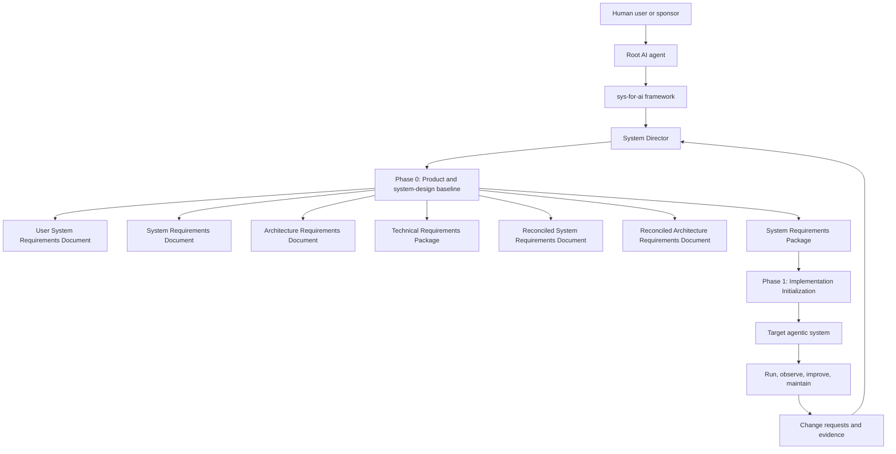
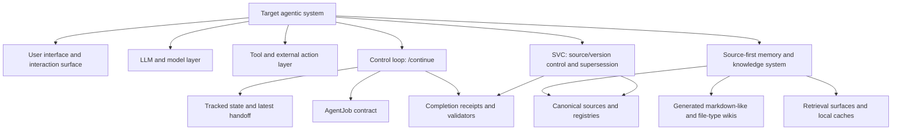
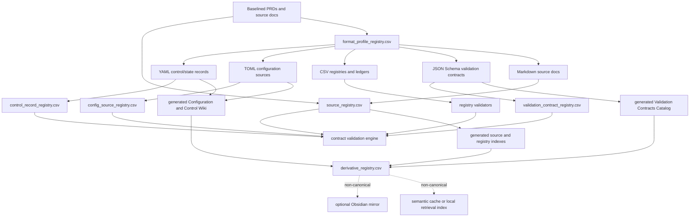
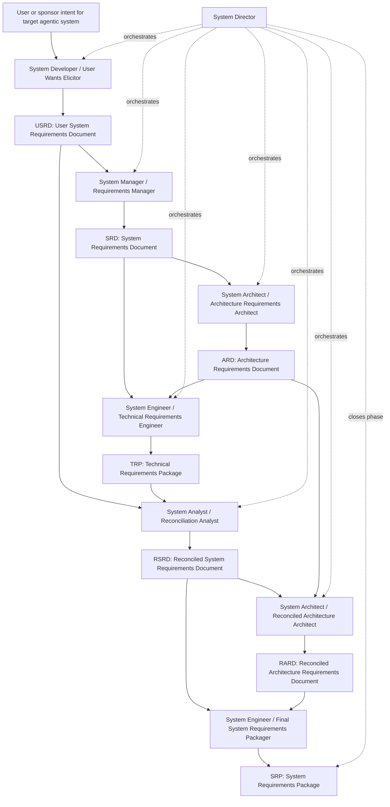

# sys-for-ai Phase 0 Product and System-Design PRD

**Document status:** Canonical Phase 0 baseline
**Product name:** `sys-for-ai`  
**Phase:** Phase 0: Product definition and system-design baseline  
**Prepared for repository:** `AngryOwlAI/sys-for-ai-dev`  
**Canonical source:** This file is the authoritative Phase 0 PRD.
**Supersedes:** `PRDs/sys-for-ai_phase-0_prd.md` as an authoritative Phase 0 source.
**Downstream dependency:** `PRDs/sys-for-ai_phase-1_implementation_initialization_prd.md` consumes this file.
**Last updated:** 2026-07-06

---

## 1. Executive summary

`sys-for-ai` is a domain-agnostic system development and management framework for AI agents. It enables a root AI agent, such as Codex or another AI-harnessed agent, to design, develop, run, improve, and maintain target agentic systems.

The product is meta-agentic. Its output is not merely a prompt, document, workflow, or one-off codebase. Its output is a governed target agentic system, or a package ready to implement such a system, with defined roles, artifacts, requirements, architecture, verification hooks, operating assumptions, source-first memory rules, improvement loops, and maintenance obligations.

For Phase 0, an agentic AI software system is treated as a software harness around one or more LLMs, tools, state stores, files, skills, policies, and user-facing interfaces. The harness must include requirements for a bounded control loop, an AgentJob-style execution contract, a source-first memory and knowledge system, source/version-control governance, and derivative documentation surfaces such as generated wikis or reader artifacts.

This revision also establishes core file-format memory profiles for Markdown, CSV, YAML, TOML, and JSON Schema. These profiles define authority classes, registry requirements, validator expectations, derivative-surface policy, promotion rules, drift behavior, and security constraints for structured source, control, configuration, registry, and validation-contract artifacts.

This Phase 0 PRD defines what `sys-for-ai` must be. It does not initialize the implementation repository. Implementation initialization belongs to Phase 1.

---

## 2. Canonical source relation

This file consolidates the July 4 core-requirement baseline with the richer July 3 Phase 0 role pipeline, artifact structures, CLRA/CKMSRA/SVCDA annex detail, risks, open issues, and acceptance criteria.

`PRDs/sys-for-ai_phase-0_prd.md` is retained as a historical reference only. When the two documents differ, this file controls Phase 0.

---

## 3. Phase boundary

### 3.1 Phase 0 owns core requirements

A core requirement describes a durable capability the delivered `sys-for-ai` framework or a target system generated by it must satisfy, regardless of local machine setup, repository bootstrap method, deployment style, or container strategy.

Phase 0 owns:

- Product identity and scope.
- Role model and lifecycle model.
- Artifact contracts.
- AgentJob semantics.
- `/continue` semantics.
- Source-first memory and knowledge requirements.
- Core file-format memory profile requirements for canonical sources, registries, control records, configuration sources, validation contracts, and generated derivative surfaces.
- Skill-system requirements.
- Source/version-control governance.
- Documentation and derivative-surface rules.
- Improvement-loop requirements.
- Acceptance criteria for moving into implementation initialization.

### 3.2 Phase 1 owns initialization requirements

An initialization requirement describes what this repository must create so implementation can begin safely and reproducibly.

Phase 1 owns:

- Concrete repository structure.
- Python virtual environment setup.
- Dependency files.
- PyYAML installation.
- Initial schemas and examples.
- Initial validators.
- Initial memory bootstrap files.
- Initial core file-format profile registries.
- Initial TOML configuration examples and parser support.
- Initial JSON Schema validation-contract files and validator support.
- Initial generated Configuration and Control Wiki stubs.
- Initial generated Validation Contracts Catalog stubs.
- Core skill import and adaptation.
- Makefile or CLI commands.
- Docker or devcontainer decision record.
- Initial CI or validation workflow, if selected.

Phase 1 does not re-litigate Phase 0 product identity, lifecycle, role ownership, source authority, or artifact semantics unless Phase 0 is intentionally revised.

---

## 4. Definitions

| Term | Definition |
|---|---|
| Framework system | `sys-for-ai`, the meta-framework being specified here. |
| Root AI agent | The AI agent using `sys-for-ai` to design, implement, run, improve, or maintain a target agentic system. |
| Target agentic system | A governed AI-agent system created or managed using `sys-for-ai`. |
| Agentic AI software harness | A software system wrapping one or more LLMs, tools, state stores, files, skills, policies, and user-facing interfaces for a defined job. |
| AgentJob | A bounded execution contract for one controlled unit of agent work. |
| `/continue` | A controlled continuation procedure that resumes from tracked state and advances at most one authorized AgentJob per invocation. Domain-specific aliases are allowed only as project-specific names. |
| Source-first memory | A memory and knowledge model where canonical sources, registries, and control records outrank generated summaries, semantic caches, wikis, local vaults, and other derivatives. |
| Core File-Format Memory Profile | A governed classification for a source or derivative file format that defines intended system role, authority class, canonical roots, registry requirements, validator requirements, derivative surfaces, promotion workflow, drift/orphan behavior, and security constraints. |
| Configuration Source | A machine-readable file that defines standing project, package, tool, runtime, or framework behavior. Configuration sources are canonical only when registered and validated. |
| Control Record | A machine-readable artifact that constrains or reports bounded agent action, including AgentJobs, handoffs, completion receipts, task packets, role-routing records, state snapshots, skill/control manifests, and initialization manifests. |
| Validation Contract | A machine-readable schema or equivalent constraint document that defines admissible structure and type constraints for another artifact class. Validation contracts are governance artifacts, not ordinary generated documentation. |
| Configuration and Control Wiki | A generated derivative reader surface for registered YAML control/state artifacts and TOML configuration artifacts. It summarizes and links to canonical source files, registry rows, validators, consumers, and authority status. |
| Validation Contracts Catalog | A generated derivative catalog for validation contracts, including JSON Schema contracts. It summarizes contract IDs, dialects, target formats, target artifact classes, target globs, supersession, validation commands, and usage relationships. |
| Format Profile Registry | A CSV registry that records core and project-specific file-format memory profiles. |
| Configuration Source Registry | A CSV registry that records registered configuration sources, including TOML files and any later configuration formats. |
| Control Record Registry | A CSV registry that records registered control/state artifacts, including YAML AgentJobs, handoffs, receipts, task packets, state snapshots, skill manifests, and routing manifests. |
| Validation Contract Registry | A CSV registry that records registered validation contracts, including JSON Schema files. |
| SVC system | Source/version-control governance for controlled artifacts, state, histories, supersession records, and generated derivative boundaries. |
| Skill | A governed capability package with metadata, invocation conditions, required inputs, outputs, procedure, validators, known failure modes, and adaptation rules. |
| Derivative surface | A generated or synchronized reader surface, such as wiki notes, Obsidian notes, HTML explainers, PDFs, TeX renderings, diagrams, indexes, notebooks, or semantic caches. |
| CLRA | Control Loop Requirements Annex. |
| CKMSRA | Context and Knowledge Management System Requirements Annex. |
| SVCDA | Source/Version Control and Derivative Artifact Annex. |

---

## 5. Problem and product vision

AI agents can generate code, plans, prompts, documents, and workflows, but building reliable agentic systems requires more than output generation. A reusable target agentic system needs governed requirements, architecture, role boundaries, artifact contracts, verification methods, improvement loops, and maintenance rules.

Common failure modes:

| Failure mode | Description |
|---|---|
| Ambiguous target | The agent builds "a system" without separating the meta-framework from the target agentic system. |
| Prompt sprawl | Roles, prompts, documents, and code emerge without stable contracts or traceability. |
| Weak requirements | User wants become implementation guesses without intermediate validation. |
| Poor domain grounding | Specialized constraints in finance, physics, biology, ML, mathematics, or safety-critical engineering are missed. |
| Unclear handoffs | Sub-agents lack precise inputs, outputs, ownership, and exit criteria. |
| Hard maintenance | The resulting agentic system cannot be audited, improved, updated, or safely operated over time. |
| Implementation drift | Code, prompts, or procedures evolve away from approved requirements. |
| Unbounded continuation | Agents keep working from stale context, informal chat memory, or vague next steps instead of controlled state and bounded work. |
| Memory authority inversion | Generated summaries, wiki pages, semantic caches, local vaults, or PDFs are treated as authority instead of navigation back to canonical sources. |
| Derivative drift | Markdown-like wikis, PDF derivatives, TeX views, HTML explainers, notebooks, or local indexes become stale or inconsistent with registered sources. |
| Configuration authority drift | Project, tool, runtime, or framework configuration changes without registry trace, validator evidence, or source-authority review. |
| Control-record ambiguity | Agent control/state records exist as loose YAML files without registry IDs, validation contracts, allowed writers, or supersession rules. |
| Schema theater | Schema-like files document structure but are not executable contracts, so invalid control/config artifacts can pass as if validated. |
| Format-profile confusion | Markdown, CSV, YAML, TOML, JSON, generated wiki notes, and local vault notes are mixed without clear authority class or promotion rules. |

The framework should let the root AI agent answer:

1. What target agentic system does the user want?
2. Why does the user want it?
3. Which domain constraints matter?
4. Which roles, artifacts, tools, data, interfaces, and runtime processes are required?
5. What requirements must the target agentic system satisfy?
6. How should the target agentic system be architected?
7. What must be verified before implementation, operation, improvement, or maintenance?
8. What should implementation agents consume in Phase 1?
9. How will the target agentic system be governed after it exists?
10. What source-first memory and knowledge system does the target agentic system need?
11. What continuation loop resumes work from tracked state without unbounded wandering?
12. What AgentJob contract constrains each unit of agent work?
13. What markdown-like, SVC, wiki, PDF, TeX, HTML, notebook, or other derivative surfaces are required, and which sources remain authoritative?

---

## 6. Core product requirements

### 6.1 Product identity

`SFA-CORE-ID-001`: `sys-for-ai` shall be a domain-agnostic system development and management framework for AI agents.

`SFA-CORE-ID-002`: `sys-for-ai` shall clearly distinguish the framework system from target agentic systems generated, operated, improved, or maintained through the framework.

`SFA-CORE-ID-003`: `sys-for-ai` shall support domains including software engineering, AI, machine learning, mathematics, physics, finance, biology, and other fields without hard-coding one domain as the default authority.

### 6.2 Lifecycle model

`SFA-CORE-LIFE-001`: `sys-for-ai` shall define a lifecycle for designing, developing, running, improving, and maintaining target agentic systems.

`SFA-CORE-LIFE-002`: Each lifecycle phase shall define expected inputs, outputs, authorities, handoffs, validators, and exit criteria.

`SFA-CORE-LIFE-003`: Lifecycle phases shall separate product requirements, system requirements, architecture, implementation planning, execution, improvement, and maintenance.

### 6.3 Role and artifact model

`SFA-CORE-ROLE-001`: `sys-for-ai` shall define controlled roles for system direction, requirements, architecture, domain validation, implementation planning, verification, memory governance, skill governance, and maintenance.

`SFA-CORE-ART-001`: `sys-for-ai` shall define artifact contracts for user/system requirements, architecture, technical readiness, traceability, source authority, run manifests, issue registers, and implementation task packets.

`SFA-CORE-TRACE-001`: Artifacts shall preserve traceability from user intent through requirements, architecture, implementation tasks, validation evidence, and maintenance decisions.

### 6.4 AgentJob and continuation model

`SFA-CORE-AJ-001`: Every executable unit of agent work shall be representable as a bounded AgentJob.

`SFA-CORE-AJ-002`: Each AgentJob shall include objective, role binding, allowed reads, allowed writes, forbidden actions, required inputs, expected outputs, validators, completion evidence, and stop conditions.

`SFA-CORE-AJ-003`: AgentJob execution shall not rely on informal chat memory as authority when source or registry authority exists.

`SFA-CORE-CONT-001`: `/continue` shall resume from tracked state and advance at most one authorized AgentJob per invocation unless a project-specific transaction model is explicitly approved.

`SFA-CORE-CONT-002`: `/continue` shall perform memory preflight, state verification, job selection, bounded execution, validation, receipt generation, and handoff creation.

### 6.5 Python reference implementation

`SFA-CORE-PY-001`: `sys-for-ai` shall include a Python-based reference implementation for framework scripts, validators, memory tooling, skill adapters, structured control/configuration records, validation contracts, and documentation-generation helpers.

`SFA-CORE-PY-002`: The Python reference implementation shall declare a supported Python version range and dependency policy.

`SFA-CORE-PY-003`: Python scripts shall be usable both through activated virtual environments and direct interpreter paths such as `.venv/bin/python`.

### 6.6 Core structured file-format memory profiles

`SFA-CORE-YAML-001`: `sys-for-ai` shall use YAML for human-readable, machine-parseable control records where appropriate.

`SFA-CORE-YAML-002`: YAML control records shall include AgentJobs, handoffs, completion receipts, registries or registry manifests, task packets, skill manifests, and initialization manifests.

`SFA-CORE-YAML-003`: The Python reference implementation shall include `PyYAML` as a required dependency.

`SFA-CORE-YAML-004`: YAML loading shall use safe parsing by default. Unsafe object construction is prohibited unless a trusted-loader exception is explicitly documented and reviewed.

`SFA-CORE-FORMAT-001`: `sys-for-ai` shall define governed core file-format memory profiles.

`SFA-CORE-FORMAT-002`: Each core file-format memory profile shall define intended role, authority class, canonical source roots, derivative roots, registry requirements, validator requirements, promotion workflow, stale/orphan/drift behavior, and security constraints.

`SFA-CORE-FORMAT-003`: The initial core file-format profiles shall include Markdown, CSV, YAML, TOML, and JSON Schema.

`SFA-CORE-FORMAT-004`: Core format profiles shall preserve source-first authority and shall not allow generated derivatives, semantic caches, local vault files, or wiki pages to become canonical without explicit promotion.

`SFA-CORE-FORMAT-005`: Memory retrieval that returns a governed file artifact shall expose the artifact's format profile, authority class, registry row, validator status, derivative freshness, and source path where available.

`SFA-CORE-FORMAT-006`: Project-specific file-format profiles may be added later through a controlled registry and PRD/decision-record workflow, but shall not weaken the authority hierarchy defined by Phase 0.

`SFA-CORE-MD-001`: `sys-for-ai` shall treat Markdown as a core format for human-authored PRDs, policies, guides, requirements artifacts, templates, and source documentation.

`SFA-CORE-MD-002`: Registered Markdown source artifacts shall declare authority status through source registries or equivalent controlled artifact inventories.

`SFA-CORE-MD-003`: Generated Markdown notes, wiki pages, Obsidian notes, indexes, summaries, and mirrors shall be derivative unless explicitly promoted through source-authority workflow.

`SFA-CORE-CSV-001`: `sys-for-ai` shall treat CSV as a core format for registries, ledgers, relationship maps, provenance rows, and agent-queryable memory tables.

`SFA-CORE-CSV-002`: CSV registry files shall have stable headers, stable row IDs where applicable, and deterministic validation.

`SFA-CORE-CSV-003`: CSV registries shall support cross-registry graph checks for missing source files, missing derivatives, missing validation contracts, orphan derivatives, stale hashes, and invalid authority classes.

`SFA-CORE-CSV-004`: CSV registries shall be treated as controlled source or registry artifacts, not generated reader surfaces, unless a specific registry is explicitly marked generated and derivative.

`SFA-CORE-CSV-005`: `sys-for-ai` shall support both core registries and project-specific registries while requiring each registry to declare purpose, owner, authority status, expected header, validation method, and promotion rule.

`SFA-CORE-YAML-005`: YAML shall be the preferred core format for human-readable and machine-parseable agent control/state artifacts.

`SFA-CORE-YAML-006`: YAML control/state artifacts shall include AgentJobs, handoffs, completion receipts, task packets, skill manifests, role-routing manifests, initialization manifests, and bounded state snapshots when such artifacts are required.

`SFA-CORE-YAML-007`: Registered YAML control/state artifacts shall have registry rows identifying record type, owner, authority status, allowed writers, validation contract, supersession relation, and source path.

`SFA-CORE-YAML-008`: YAML control/state artifacts that affect routing, permissions, AgentJob boundaries, continuation state, role execution, or completion evidence shall be validated before use.

`SFA-CORE-YAML-009`: YAML parsing shall use safe loading only. Unsafe object construction shall be prohibited unless a trusted-loader exception is explicitly documented, reviewed, and isolated from untrusted inputs.

`SFA-CORE-YAML-010`: YAML control/state artifacts shall be indexed through the generated Configuration and Control Wiki when they are registered as canonical or controlled artifacts.

`SFA-CORE-TOML-001`: `sys-for-ai` shall treat TOML as the preferred core format for static or semi-static project, package, tool, runtime, target-system template, and framework configuration.

`SFA-CORE-TOML-002`: TOML configuration sources shall be used for configuration that benefits from human readability, comments, deterministic parsing, and mapping to dictionary-like structures.

`SFA-CORE-TOML-003`: Registered TOML configuration sources shall have registry rows identifying configuration domain, owner, authority status, parser, validation contract, consumers, environment scope, secrets policy, supersession relation, and source path.

`SFA-CORE-TOML-004`: TOML configuration sources shall be parsed through the Python standard library `tomllib` when the supported Python version is 3.11 or later, or through a lightweight compatible parser when Python 3.10 support is retained.

`SFA-CORE-TOML-005`: Phase 1 TOML support shall parse and validate TOML sources but shall not require style-preserving TOML editing or TOML writing.

`SFA-CORE-TOML-006`: TOML configuration examples and templates shall not contain secrets. Secret-bearing configuration support is out of Phase 1 scope unless a later security PRD defines classification, redaction, storage, and review controls.

`SFA-CORE-TOML-007`: Registered TOML configuration sources shall be indexed through the generated Configuration and Control Wiki.

`SFA-CORE-JSONSCHEMA-001`: `sys-for-ai` shall treat JSON Schema as the preferred core format for validation contracts governing structured artifacts.

`SFA-CORE-JSONSCHEMA-002`: JSON Schema validation contracts shall be allowed to govern JSON files, parsed YAML objects, TOML-normalized objects, CSV row objects, registry rows, control records, skill manifests, discovery records, and configuration profiles.

`SFA-CORE-JSONSCHEMA-003`: JSON Schema contracts shall declare dialect/version, contract ID, target format, target artifact type, target file glob, owner, authority status, supersession relation, and validator command.

`SFA-CORE-JSONSCHEMA-004`: JSON Schema validation success shall mean structural admissibility, not semantic truth, domain correctness, or user acceptance.

`SFA-CORE-JSONSCHEMA-005`: JSON Schema contracts shall be cataloged through the generated Validation Contracts Catalog.

`SFA-CORE-JSONSCHEMA-006`: `sys-for-ai` shall not create a standalone JSON wiki by default for JSON Schema files. A JSON wiki may be introduced later only if JSON files become first-class source or memory artifacts beyond validation contracts.

`SFA-CORE-JSONSCHEMA-007`: JSON Schema contracts shall support supersession and migration evidence when schema changes affect existing registered artifacts.

`SFA-CORE-CCWIKI-001`: `sys-for-ai` shall define a generated Configuration and Control Wiki for registered YAML control/state artifacts and TOML configuration sources.

`SFA-CORE-CCWIKI-002`: The Configuration and Control Wiki shall be derivative and non-canonical by default.

`SFA-CORE-CCWIKI-003`: Each generated Configuration and Control Wiki page shall identify source files, registry rows, format profile IDs, validation contract IDs, source hashes where available, generator version, generation timestamp, authority status, stale/orphan status, and allowed promotion path.

`SFA-CORE-CCWIKI-004`: The Configuration and Control Wiki shall warn or fail validation when a page lacks a canonical source path, lacks a registry row, claims canonical authority, or is stale relative to its source.

`SFA-CORE-CCWIKI-005`: The Configuration and Control Wiki may be mirrored into Obsidian or another reader surface only as a derivative view.

`SFA-CORE-VCCAT-001`: `sys-for-ai` shall define a generated Validation Contracts Catalog for JSON Schema contracts and any future validation-contract formats.

`SFA-CORE-VCCAT-002`: The Validation Contracts Catalog shall be derivative and non-canonical by default.

`SFA-CORE-VCCAT-003`: Each generated catalog entry shall identify contract ID, source path, dialect/version, target format, target artifact type, target file glob, validator command, owner, authority status, supersession relation, source hash where available, generator version, generation timestamp, stale/orphan status, and known limitations.

`SFA-CORE-VCCAT-004`: The Validation Contracts Catalog shall not be treated as a JSON wiki unless a later PRD or decision record introduces general JSON source/memory artifacts.

`SFA-CORE-VCCAT-005`: The Validation Contracts Catalog shall link validation contracts to every registry row, control record, configuration source, or template that declares the contract.

### 6.7 Skill system

`SFA-CORE-SKILL-001`: `sys-for-ai` shall treat skills as first-class governed capabilities.

`SFA-CORE-SKILL-002`: Each skill shall define name, purpose, invocation conditions, inputs, outputs, procedure, validation rules, failure modes, adaptation notes, and provenance.

`SFA-CORE-SKILL-003`: The framework shall include all current retained systems-engineering skill templates from `AngryOwlAI/ai-skills-for-sys` as core requirements for the project being developed.

`SFA-CORE-SKILL-004`: The framework shall include the `.codex/skills/skill-import-generalizer` workflow as a core skill-management requirement.

`SFA-CORE-SKILL-005`: Imported skill templates shall be adapted inside `sys-for-ai` rather than treated as opaque external files. Adaptation shall preserve source provenance and define local authority boundaries.

### 6.8 Source-first memory and knowledge system

`SFA-CORE-MEM-001`: `sys-for-ai` shall implement a source-first memory and knowledge system.

`SFA-CORE-MEM-002`: Canonical source artifacts, source registries, and control records shall outrank generated notes, summaries, semantic caches, PDFs, HTML explainers, diagrams, Obsidian vaults, and other reader surfaces.

`SFA-CORE-MEM-003`: The memory system shall support source registries, derivative registries, object relationship registries, task/job registries, decision records, trace ledgers, issue ledgers, and validation receipts.

`SFA-CORE-MEM-004`: The memory system shall support bootstrap, validate-only, drift detection, orphan-derivative detection, and acceptance-evidence workflows.

`SFA-CORE-MEM-005`: Memory retrieval shall navigate back to authoritative sources instead of silently promoting summaries or semantic hits to authority.

`SFA-CORE-MEM-006`: The source-first memory system shall track core file-format profiles for Markdown, CSV, YAML, TOML, and JSON Schema.

`SFA-CORE-MEM-007`: The source-first memory system shall include or support registries for format profiles, configuration sources, control records, and validation contracts.

`SFA-CORE-MEM-008`: Memory retrieval shall not return a structured artifact as actionable authority unless the retrieval result includes source path, authority status, registry evidence, and validation status where such evidence exists.

`SFA-CORE-MEM-009`: Memory preflight shall verify YAML control records, TOML configuration sources, JSON Schema contracts, and CSV registry rows against canonical source files or registry rows before they affect requirements, routing, claims, AgentJob boundaries, handoffs, permissions, or continuation state.

### 6.9 Obsidian and local reader surfaces

`SFA-CORE-OBS-001`: `sys-for-ai` shall support an optional Obsidian-compatible local vault as a reader and retrieval surface for generated Markdown notes.

`SFA-CORE-OBS-002`: Obsidian vault contents shall be derivative by default unless explicitly baselined as canonical source artifacts.

`SFA-CORE-OBS-003`: Obsidian synchronization shall not mutate canonical sources without an explicit import or promotion workflow.

### 6.10 Documentation and derivative-surface governance

`SFA-CORE-DOC-001`: `sys-for-ai` shall distinguish canonical documentation sources from generated documentation derivatives.

`SFA-CORE-DOC-002`: Generated wiki, HTML, PDF, TeX, diagram, Obsidian, index, and semantic-cache surfaces shall trace back to source files and registry rows.

`SFA-CORE-DOC-003`: The system shall block or warn on stale, orphaned, unsourced, or authority-inverted generated documentation.

`SFA-CORE-DOC-004`: The generated Configuration and Control Wiki shall be the default derivative reader surface for registered YAML control/state artifacts and TOML configuration sources.

`SFA-CORE-DOC-005`: The generated Validation Contracts Catalog shall be the default derivative reader surface for JSON Schema validation contracts.

`SFA-CORE-DOC-006`: Generated Configuration and Control Wiki pages and Validation Contracts Catalog pages shall never be hand-edited as canonical sources.

`SFA-CORE-DOC-007`: Generated derivative pages shall include authority banners stating that canonical authority remains with registered sources, registries, and validation contracts.

### 6.11 Source/version control

`SFA-CORE-SVC-001`: `sys-for-ai` shall define source/version-control expectations for controlled artifacts, generated artifacts, registries, handoffs, receipts, decisions, and history.

`SFA-CORE-SVC-002`: Generated artifacts shall be marked as generated or derivative and shall include regeneration or provenance information where practical.

`SFA-CORE-SVC-003`: `sys-for-ai` shall define source/version-control expectations for format profiles, configuration sources, control records, validation contracts, and their generated derivative surfaces.

`SFA-CORE-SVC-004`: Configuration sources, control records, and validation contracts shall support supersession, source hashing where practical, registry trace, validation evidence, and rollback/migration evidence when changed.

`SFA-CORE-SVC-005`: Generated Configuration and Control Wiki pages and Validation Contracts Catalog pages shall include regeneration metadata and shall be invalid when stale, orphaned, unsourced, or authority-inverted.

### 6.12 Improvement system

`SFA-CORE-IMPROVE-001`: `sys-for-ai` shall separate target-domain work from project-system improvement work.

`SFA-CORE-IMPROVE-002`: Improvement actions shall be bounded, routed, validated, and recorded with completion evidence.

`SFA-CORE-IMPROVE-003`: Improvement signals shall not silently mutate core authority, role contracts, validators, claim status, or memory hierarchy.

---

## 7. Detailed Phase 0 requirements

The following detailed requirements are binding refinements of the core requirement groups above. They preserve trace compatibility with the earlier July 3 Phase 0 PRD.

| ID | Requirement | Priority | Verification method | Acceptance criteria |
|---|---|---:|---|---|
| SFA-P0-FR-001 | `sys-for-ai` shall use `sys-for-ai` as the product name and treat `sys-dev-for-ai` as a former working name. | Must | Inspection | Phase 0 artifacts use `sys-for-ai` except in explicit change-history references. |
| SFA-P0-FR-002 | `sys-for-ai` shall define itself as a framework used by AI agents to design, develop, run, improve, and maintain target agentic systems. | Must | Inspection | Executive summary, product statement, and definitions express the meta-agentic purpose. |
| SFA-P0-FR-003 | `sys-for-ai` shall distinguish the framework system from the target agentic system in every major artifact. | Must | Inspection | Artifact templates include framework versus target-system boundaries. |
| SFA-P0-FR-004 | `sys-for-ai` shall support target agentic systems across software engineering, AI, ML, physics, mathematics, finance, biology, and other domains. | Must | Inspection | Domain coverage includes specialist hooks and domain-specific constraints. |
| SFA-P0-FR-005 | `sys-for-ai` shall define a System Design phase pipeline that produces USRD, SRD, ARD, TRP, RSRD, RARD, and SRP. | Must | Inspection | Pipeline diagram and artifact catalog include all required artifacts and producer roles. |
| SFA-P0-FR-006 | `sys-for-ai` shall support optional current-state analysis for existing target agentic systems or related systems. | Should | Inspection | Existing System Analyst role and ESAR artifact are defined. |
| SFA-P0-FR-007 | `sys-for-ai` shall require each role to have explicit input artifacts, output artifacts, responsibilities, and exit criteria. | Must | Inspection | Role catalog and handoff contract include these fields. |
| SFA-P0-FR-008 | `sys-for-ai` shall preserve traceability from user intent through final implementation-ready requirements. | Must | Trace review | Traceability ledger and artifact trace matrices are defined. |
| SFA-P0-FR-009 | `sys-for-ai` shall treat missing facts, thresholds, constraints, owners, environments, and acceptance criteria as open issues rather than silent inventions. | Must | Inspection | Universal rules and issue-register requirements state this behavior. |
| SFA-P0-FR-010 | `sys-for-ai` shall include a spawn-ready role prompt skeleton that root AI agents can use to create specialist sub-agents. | Should | Inspection | Prompt skeleton exists and references target agentic system context. |
| SFA-P0-FR-011 | `sys-for-ai` shall define a universal handoff contract for artifacts and sub-agent outputs. | Must | Inspection | Handoff contract includes source artifacts, assumptions, open issues, traceability, and next role. |
| SFA-P0-FR-012 | `sys-for-ai` shall include domain-specialist review hooks for specialized target domains. | Should | Inspection | Domain Specialist role and domain coverage table are present. |
| SFA-P0-FR-013 | `sys-for-ai` shall include security, safety, privacy, and compliance review hooks for sensitive or high-impact target agentic systems. | Must | Inspection | Reviewer role and control-mapping responsibilities are defined. |
| SFA-P0-FR-014 | `sys-for-ai` shall define the Phase 0 to Phase 1 boundary. | Must | Inspection | Phase boundary reserves implementation initialization for Phase 1. |
| SFA-P0-FR-015 | `sys-for-ai` shall produce an SRP that implementation agents can consume without re-deriving system intent. | Must | Review | SRP includes source baseline, requirements, allocation, verification, risks, and Phase 1 handoff block. |
| SFA-P0-FR-016 | `sys-for-ai` shall require each target agentic system to declare whether it is an agentic AI software harness and, if so, define its LLM, tool, state, memory, policy, and user-interface boundaries. | Must | Inspection | USRD, SRD, ARD, and SRP identify the harness boundary or mark it not applicable. |
| SFA-P0-FR-017 | `sys-for-ai` shall require an AgentJob-style bounded execution unit for target systems that perform resumable or tool-using agent work. | Must | Inspection | SRP includes an AgentJob contract or a justified not-applicable decision. |
| SFA-P0-FR-018 | `sys-for-ai` shall define `/continue` as the generic continuation skill or command name for resuming from tracked state. | Must | Inspection | The PRD uses `/continue` generically and allows domain-specific aliases only as project-specific names. |
| SFA-P0-FR-019 | `sys-for-ai` shall require the continuation loop to resolve current state, inspect the latest handoff, perform memory/context preflight, select or reuse at most one bounded AgentJob, validate results, record completion, and update next state when state changes. | Must | Scenario review | CLRA covers state, handoff, preflight, AgentJob, validation, completion, and next-state update. |
| SFA-P0-FR-020 | `sys-for-ai` shall require a Director decision record when routing, role selection, authority expansion, task creation, or job creation is not already determined by tracked state. | Must | Inspection | CLRA and handoff contract include Director decision conditions and supersession rules. |
| SFA-P0-FR-021 | `sys-for-ai` shall require completion receipts for bounded agent work. | Must | Inspection | SRP requires completion records with outputs, changed artifacts, command or tool evidence, validation status, unresolved issues, and next recommendation. |
| SFA-P0-FR-022 | `sys-for-ai` shall require a source-first context and knowledge management system for target systems that rely on persistent project knowledge. | Must | Inspection | CKMSRA defines canonical sources, registries, generated derivatives, retrieval surfaces, source verification, and stale-context controls. |
| SFA-P0-FR-023 | `sys-for-ai` shall require generated memory, wiki, semantic extracts, local vaults, PDFs, HTML, and other derivatives to be classified as source, evidence, human-readable derivative, retrieval aid, or non-authoritative cache. | Must | Inspection | CKMSRA and SVCDA include authority class for each source or derivative surface. |
| SFA-P0-FR-024 | `sys-for-ai` shall require any memory hit that affects requirements, routing, claims, AgentJob boundaries, or handoffs to be verified against canonical sources, controlled artifacts, or registry rows. | Must | Trace review | Handoff and completion templates include memory preflight and source-inspection evidence. |
| SFA-P0-FR-025 | `sys-for-ai` shall require a markdown-like source and generated-wiki strategy when the target system has controlled documentation or knowledge surfaces. | Should | Inspection | SVCDA defines markdown-like authoring, generated indexes, wiki notes, cross-links, and source authority. |
| SFA-P0-FR-026 | `sys-for-ai` shall require Phase 0 roles to determine whether PDF, TeX, HTML, notebook, data, or other file-type wikis and derivatives are needed for the target system. | Should | Review | SRP specifies required file-type wikis and derivative policies or records them as not applicable. |
| SFA-P0-FR-027 | `sys-for-ai` shall require a source/version-control system baseline for controlled artifacts, activated control records, generated derivatives, and release bundles. | Must | Inspection | SVCDA includes versioning, hash/provenance, supersession, checkpoint, and audit-evidence requirements. |
| SFA-P0-FR-028 | `sys-for-ai` shall require process validators and evidence hooks for control-loop, memory, wiki, derivative, and SVC operations without treating validator success as domain truth. | Must | Inspection | CLRA, CKMSRA, and SVCDA distinguish process conformance from domain validation or acceptance. |
| SFA-P0-FR-029 | `sys-for-ai` shall separate target-domain claims, workflow claims, tooling claims, documentation claims, and user-facing explanation claims where the distinction affects authority or acceptance. | Must | Inspection | SRP includes claim or authority classes for target systems where claims can have different evidence standards. |
| SFA-P0-FR-030 | `sys-for-ai` shall carry CLRA, CKMSRA, and SVCDA content into the final SRP when the target system is expected to run, continue, improve, or maintain state over time. | Must | Review | SRP includes these annexes or an explicit rationale for omission. |
| SFA-P0-FR-031 | `sys-for-ai` shall define core file-format memory profiles for Markdown, CSV, YAML, TOML, and JSON Schema. | Must | Inspection | Phase 0 includes profile definitions and role/authority assignments for all five formats. |
| SFA-P0-FR-032 | `sys-for-ai` shall classify each governed file format by authority class, mutability, registry requirement, validator requirement, derivative policy, promotion workflow, drift behavior, and security policy. | Must | Inspection | CKMSRA or SVCDA includes a classification matrix covering each axis. |
| SFA-P0-FR-033 | YAML shall be assigned to agent control/state artifacts. | Must | Inspection | AgentJobs, handoffs, receipts, task packets, skill manifests, routing manifests, initialization manifests, and state snapshots are named as YAML-eligible artifacts. |
| SFA-P0-FR-034 | TOML shall be assigned to project, package, tool, runtime, framework, and target-system configuration sources. | Must | Inspection | Phase 0 defines TOML configuration source semantics and authority constraints. |
| SFA-P0-FR-035 | JSON Schema shall be assigned to validation contracts. | Must | Inspection | Phase 0 defines JSON Schema contract semantics, target artifact mapping, dialect/version expectations, and validator evidence. |
| SFA-P0-FR-036 | CSV shall be assigned to registries, ledgers, relationship maps, and provenance rows. | Must | Inspection | Phase 0 explicitly names CSV as a core registry/ledger format. |
| SFA-P0-FR-037 | `sys-for-ai` shall define a generated Configuration and Control Wiki for YAML and TOML artifacts. | Must | Inspection | Phase 0 states the wiki is derivative, non-canonical, registry-traced, hash-aware where practical, and stale-checkable. |
| SFA-P0-FR-038 | `sys-for-ai` shall define a generated Validation Contracts Catalog for JSON Schema artifacts. | Must | Inspection | Phase 0 states the catalog is derivative, non-canonical, contract-traced, and target-artifact-aware. |
| SFA-P0-FR-039 | `sys-for-ai` shall not define a standalone JSON wiki by default for JSON Schema files. | Must | Inspection | Phase 0 includes an explicit decision that JSON Schema uses a Validation Contracts Catalog, and a JSON wiki requires future general JSON source/memory artifacts. |
| SFA-P0-FR-040 | CKMSRA shall require memory retrieval to expose file-format profile, registry row, authority status, validation status, and derivative freshness for governed artifacts where available. | Must | Scenario review | Retrieval examples include structured source evidence and prohibit silent promotion of derivative summaries. |
| SFA-P0-FR-041 | SVCDA shall define versioning, supersession, hash/provenance, migration, and rollback expectations for configuration sources, control records, and validation contracts. | Must | Inspection | SVCDA includes dedicated entries for configuration, control, and validation-contract artifacts. |
| SFA-P0-FR-042 | `sys-for-ai` shall treat schema validation as process/structure evidence, not domain truth or user acceptance. | Must | Inspection | CLRA/CKMSRA/SVCDA and validator sections state this distinction. |
| SFA-P0-FR-043 | YAML and TOML examples shall not contain secrets by default. | Must | Security review | Security requirements classify secrets as out of Phase 1 scope unless later PRD controls exist. |
| SFA-P0-FR-044 | Generated Configuration and Control Wiki pages and Validation Contracts Catalog pages shall include authority banners and source trace. | Must | Inspection | Derivative-page templates include authority notice, source path, registry ID, generator metadata, and stale/orphan status. |
| SFA-P0-FR-045 | Project-specific format profiles may be added later only through controlled registry, validation, and authority-boundary workflows. | Should | Review | CKMSRA defines project-specific extension workflow and does not allow weakening core authority rules. |

| ID | Requirement | Priority | Verification method | Acceptance criteria |
|---|---|---:|---|---|
| SFA-P0-NFR-001 | The framework shall be domain-agnostic while allowing domain-specific constraints and specialist review. | Must | Inspection | Domain-specific requirements are isolated from core lifecycle rules. |
| SFA-P0-NFR-002 | The framework shall be modular enough for simple target agentic systems and robust enough for complex, regulated, or scientific systems. | Must | Review | Minimal and robust role sets are defined. |
| SFA-P0-NFR-003 | The framework shall favor explicit, testable, traceable requirements over loose prose. | Must | Inspection | Requirement templates include IDs, sources, rationale, priority, verification, and acceptance criteria. |
| SFA-P0-NFR-004 | The framework shall be usable by AI agents without requiring unstated human interpretation. | Must | Simulation | A root AI agent can identify next role, required inputs, required outputs, and stop conditions from the PRD. |
| SFA-P0-NFR-005 | The framework shall preserve human oversight for ambiguous, risky, high-impact, or approval-bound decisions. | Must | Review | Open issue ownership and sign-off records are required where decisions are unresolved or sensitive. |
| SFA-P0-NFR-006 | The framework shall be maintainable through stable IDs, artifact registries, versioning, and change-control notes. | Must | Inspection | ID scheme, artifact registry, and change-control sections are defined. |
| SFA-P0-NFR-007 | The framework shall support future runtime monitoring, evaluation, improvement, and maintenance requirements. | Should | Inspection | Lifecycle and runtime-planning sections include these concerns without implementing them in Phase 0. |
| SFA-P0-NFR-008 | The framework shall avoid coupling Phase 0 to a specific runtime, repository layout, orchestration engine, or vendor. | Must | Inspection | Phase 0 non-scope excludes implementation substrate decisions. |
| SFA-P0-NFR-009 | The framework shall preserve source-first authority by preventing generated retrieval surfaces from silently becoming normative. | Must | Review | Universal rules and CKMSRA require retrieval surfaces to trace back to canonical sources or registries. |
| SFA-P0-NFR-010 | The framework shall support resumability through tracked state, handoffs, bounded work units, and completion evidence. | Must | Simulation | A root AI agent can determine the lawful next action from state, handoff, and AgentJob records. |
| SFA-P0-NFR-011 | The framework shall make stale context detectable and recoverable. | Must | Inspection | Memory preflight, source verification, and derivative regeneration requirements are defined. |
| SFA-P0-NFR-012 | The framework shall avoid coupling Phase 0 to a specific memory database, wiki engine, SVC provider, orchestration engine, or LLM vendor. | Must | Inspection | CLRA, CKMSRA, and SVCDA define requirements while deferring concrete tooling to Phase 1. |
| SFA-P0-NFR-013 | The framework shall be auditable after long interruptions or multiple agent handoffs. | Must | Scenario review | Artifact registry, trace ledger, handoff contract, AgentJob contract, and completion receipts preserve source and decision history. |
| SFA-P0-NFR-014 | The framework shall make structured artifact authority inspectable by agents and humans. | Must | Simulation | A root agent can determine whether a YAML, TOML, CSV, Markdown, or JSON Schema artifact is canonical, controlled, derivative, stale, or invalid. |
| SFA-P0-NFR-015 | The framework shall minimize parser and schema dependencies while preserving deterministic validation. | Should | Architecture review | Phase 1 dependency policy separates lightweight parser/validator dependencies from heavy runtime services. |
| SFA-P0-NFR-016 | The framework shall prevent configuration/control/security drift caused by unregistered structured files. | Must | Validation review | Validators detect unregistered governed YAML/TOML/JSON Schema files in controlled roots. |
| SFA-P0-NFR-017 | The framework shall keep generated reader surfaces subordinate to registered sources, registries, and validation contracts. | Must | Inspection | Generated wiki/catalog policy states non-canonical status and promotion workflow. |

---

## 8. Conceptual model



The diagram separates `sys-for-ai` from the target agentic system. `sys-for-ai` is the framework used by the root AI agent. The target agentic system is the system being produced, run, improved, or maintained.

Every serious target agentic system should be analyzed as cooperating subsystems. Phase 0 does not implement these subsystems, but it must determine their requirements when the target system is expected to run, improve, or be maintained over time.



The key Phase 0 requirement is authority separation. Canonical sources, registries, control records, and approved requirements define truth for the target system. Generated wikis, PDFs, TeX renderings, HTML explainers, semantic extracts, indexes, notebooks, and local vaults are context surfaces unless explicitly baselined as sources.

The core file-format profile model extends that authority separation to structured files and generated reader surfaces:



---

## 9. System Design phase pipeline

Phase 0 defines the System Design phase pipeline so each role contributes to the definition of a target agentic system.



| Step | Director spawns | Inputs | Main output | Gate |
|---:|---|---|---|---|
| 0 | System Director | Initial project context | Run manifest | Design phase initialized. |
| 1 | System Developer / User Wants Elicitor | User request | USRD | User wants sufficiently captured. |
| 1a | Existing System Analyst, optional | Existing system docs, repos, infrastructure, user info | ESAR | Current-state constraints known. |
| 2 | System Manager / Requirements Manager | USRD, optional ESAR | SRD | System requirements trace to user wants. |
| 2a | Requirements Verifier | USRD, SRD | SRD review report | SRD is coherent or issues are routed. |
| 3 | System Architect | SRD, optional ESAR | ARD | Architecture responds to SRD. |
| 3a | Requirements Verifier | SRD, ARD | ARD review report | ASRs, views, ADRs, and evidence checked. |
| 3b | Context, Memory, and Knowledge Architect, optional but recommended | SRD, ARD, ESAR if available | CKMSRA | Source-first memory and knowledge requirements known. |
| 3c | Control Loop and AgentJob Planner, optional but recommended | SRD, ARD, ESAR if available | CLRA | Continuation and bounded-work requirements known. |
| 3d | SVC and Documentation Surface Architect, optional | SRD, ARD, ESAR if available | SVCDA | Source/version-control and derivative-surface requirements known. |
| 4 | System Engineer | SRD, ARD, optional CLRA, CKMSRA, SVCDA | TRP | Technical requirements are buildable and verifiable. |
| 4a | Requirements Verifier | SRD, ARD, TRP, optional CLRA, CKMSRA, SVCDA | TRP review report | Traceability and verification checked. |
| 5 | System Analyst / Reconciliation Analyst | USRD, TRP | RSRD | User wants and technical obligations reconciled. |
| 6 | System Architect / Reconciled Architecture Architect | RSRD, ARD | RARD | Architecture updated to match reconciled requirements. |
| 7 | System Engineer / Final System Requirements Packager | RSRD, RARD, optional CLRA, CKMSRA, SVCDA | SRP | Implementation-ready package complete. |
| 8 | System Director | All artifacts | Design readiness report | Phase 0 closed and ready for separate Phase 1 artifact. |

---

## 10. Role model

### 10.1 Core roles

| Role | Primary mission | Primary outputs |
|---|---|---|
| System Director | Orchestrate phases, role spawning, artifact governance, traceability, gates, and handoffs. | `system-design-run-manifest.md`, `artifact-registry.md`, `traceability-ledger.md`, `open-issues-register.md`, `design-phase-readiness-report.md`. |
| System Developer / User Wants Elicitor | Elicit target-system intent, stakeholders, desired capabilities, constraints, quality expectations, acceptance expectations, and unknowns. | USRD. |
| Existing System Analyst | Discover current-state systems when the target system already exists, replaces something, integrates with something, or modernizes something. | ESAR. |
| System Manager / Requirements Manager | Normalize user wants into atomic, classified, testable system requirements. | SRD. |
| System Architect / Architecture Requirements Architect | Derive architecture drivers, ASRs, views, mechanisms, ADRs, and evaluation evidence from SRD. | ARD. |
| System Engineer / Technical Requirements Engineer | Convert SRD and ARD into implementable technical requirements, allocation, and verification matrices. | TRP. |
| System Analyst / Reconciliation Analyst | Compare USRD to TRP, detect overbuild and underbuild, reconcile tradeoffs, and produce a decision log. | RSRD. |
| System Architect / Reconciled Architecture Architect | Update architecture drivers, views, interfaces, data flows, ADRs, and verification evidence after reconciliation. | RARD. |
| System Engineer / Final System Requirements Packager | Package reconciled requirements and architecture into implementation-ready requirements and handoff material. | SRP. |

### 10.2 Support roles

| Role | When to include | Primary contribution |
|---|---|---|
| Requirements Verifier / Consistency Auditor | After SRD, ARD, TRP, RSRD, RARD, and SRP. | Reviews quality, traceability, contradictions, missing acceptance criteria, vague requirements, and hidden implementation assumptions. |
| Domain Specialist | Any specialized scientific, mathematical, financial, biological, ML, safety, or engineering domain. | Validates assumptions, hidden constraints, terminology, acceptance metrics, and domain-specific risks. |
| Security, Safety, Privacy, and Compliance Reviewer | Sensitive, regulated, production, autonomous, or high-impact target agentic systems. | Maps threat, hazard, privacy, compliance, data-handling, and AI/ML risk controls to evidence obligations. |
| Documentation Librarian / Configuration Controller | Any project with multiple artifacts, versions, or agent handoffs. | Maintains artifact index, ID registry, template consistency, change log, and release bundles. |
| Runtime and Maintenance Planner | When target agentic system must run over time. | Captures operations, monitoring, evaluation, update, incident, and maintenance requirements for later phases. |
| Control Loop and AgentJob Planner | When the target system must resume work, dispatch sub-agents, or constrain tool-using actions. | Defines `/continue`, tracked state, AgentJob schema needs, completion evidence, validator gates, stop conditions, and handoff semantics. |
| Context, Memory, and Knowledge Architect | When the target system needs durable knowledge, project memory, generated documentation, or retrieval. | Defines source authority, registries, context preflight, generated wikis, file-type derivative surfaces, retrieval limits, and source-verification rules. |
| SVC and Documentation Surface Architect | When the target system has controlled sources, generated docs, or multi-file artifacts. | Defines markdown-like authoring, source/version control, supersession, derivative regeneration, PDF/TeX/HTML/wiki authority boundaries, and release evidence. |

### 10.3 Universal role rules

Every role shall obey these rules unless the System Director explicitly overrides them:

| Rule | Meaning |
|---|---|
| Trace everything | Every output claim should trace to a source artifact, user statement, assumption, constraint, decision, or open issue. |
| Do not guess silently | Missing thresholds, actors, environments, units, constraints, or acceptance criteria become TBD or TBR items with owner and risk impact. |
| Separate requirement from rationale | The normative requirement says what must be true. Rationale explains why. |
| Use stable IDs | Artifacts, requirements, assumptions, decisions, risks, controls, and verification items must have unique IDs. |
| Prefer measurable acceptance | Every requirement should have a verification method and acceptance criterion before baseline. |
| Keep artifact boundaries clean | USRD captures user wants. SRD captures system obligations. ARD captures architectural response. TRP and SRP capture implementable technical requirements. |
| Clarify framework versus target | Every artifact must make clear whether it describes `sys-for-ai` or the target agentic system. |
| Treat autonomy as a risk dimension | Agent autonomy, tool permissions, memory, data access, and external actions must be explicit where relevant. |
| Preserve phase boundaries | Phase 0 produces implementation readiness, not implementation initialization. |
| Source beats retrieval | Generated memory, wiki notes, local vaults, semantic extracts, summaries, PDFs, HTML, notebooks, and other derivatives are navigation aids unless explicitly baselined as source artifacts. |
| Verify memory hits | Any retrieved context that influences a requirement, routing decision, claim, AgentJob boundary, or handoff must be checked against a canonical source, registry row, or controlled artifact. |
| Bound continuation | A continuation invocation should advance at most one authorized AgentJob unless the SRP explicitly defines a safer project-specific transaction model. |
| Supersede, do not rewrite | Activated Director decisions, AgentJobs, completion records, handoffs, and baseline artifacts should be corrected through supersession rather than silent historical mutation. |
| Validator success is scoped | A passing validator proves only the defined process or artifact check, not domain truth, scientific validity, business correctness, or safety in production. |

### 10.4 Minimal and robust role sets

For a lean prototype target agentic system, use this minimum:

| Minimal role | Required? |
|---|---|
| System Director | Yes |
| System Developer / User Wants Elicitor | Yes |
| System Manager / Requirements Manager | Yes |
| System Architect | Yes |
| System Engineer | Yes |
| System Analyst / Reconciliation Analyst | Yes |

For a serious reusable target agentic system, include the support roles triggered by domain complexity, brownfield state, safety/compliance sensitivity, persistent memory, generated documentation, or long-running operation.

---

## 11. Artifact catalog

| Artifact | Purpose | Producer role | Primary consumer |
|---|---|---|---|
| `system-design-run-manifest.md` | Ordered list of roles, task IDs, inputs, outputs, gates, and status. | System Director | All roles, Phase 1 |
| `artifact-registry.md` | Single index of current artifact versions, owners, status, source links, and downstream dependencies. | System Director or Documentation Librarian | All roles |
| `traceability-ledger.md` | Cross-artifact trace from user intent to implementation-ready requirements. | System Director | Verifiers, Phase 1 |
| `open-issues-register.md` | All unresolved assumptions, conflicts, risks, TBD items, and TBR items. | System Director | All roles |
| USRD | Captures user goals, desired capabilities, domain context, constraints, priorities, and acceptance expectations. | User Wants Elicitor | Requirements Manager, Reconciliation Analyst |
| ESAR | Current-state assessment for existing target agentic systems or related systems. | Existing System Analyst | Requirements Manager, Architect, Engineer |
| SRD | Controlled system requirements for the target agentic system. | Requirements Manager | Architect, Engineer, Verifier |
| ARD | Architecture requirements, drivers, views, tradeoffs, decisions, and verification evidence. | System Architect | Technical Requirements Engineer |
| TRP | Implementable technical requirements derived from SRD and ARD. | Technical Requirements Engineer | Reconciliation Analyst, Verifier |
| RSRD | Reconciled system requirements after user intent and technical derivation are aligned. | Reconciliation Analyst | Reconciled Architect, Final Packager |
| RARD | Reconciled architecture baseline aligned to RSRD. | Reconciled Architect | Final Packager |
| SRP | Final implementation-ready system requirements package for the target agentic system. | Final System Requirements Packager | Phase 1 Implementation Initialization |
| `design-phase-readiness-report.md` | Phase 0 closure report with readiness, risks, unresolved items, and Phase 1 handoff notes. | System Director | Human sponsor, root AI agent, Phase 1 |
| CLRA | Defines `/continue`, tracked state, handoffs, AgentJob boundaries, role binding, completion receipts, validators, checkpoint expectations, and stop conditions. | System Architect, System Engineer, Control Loop and AgentJob Planner | Final Packager, Phase 1 |
| CKMSRA | Defines source-first memory, canonical sources, registries, context preflight, retrieval surfaces, generated wikis, derivative artifacts, and stale-context rules. | Context, Memory, and Knowledge Architect | Architect, Engineer, Phase 1 |
| SVCDA | Defines markdown-like sources, SVC expectations, supersession, generated derivative governance, PDF/TeX/HTML/wiki policies, and release evidence. | Documentation Librarian, SVC and Documentation Surface Architect | Final Packager, Phase 1 |

---

## 12. Artifact output structures

### 12.1 USRD

USRD shall include purpose, system vision, stakeholders, user goals and outcomes, desired capabilities, nonfunctional wants, domain context, data and interfaces, acceptance expectations, priorities, assumptions and open questions, and source trace.

### 12.2 SRD

SRD shall include document control, purpose and scope, stakeholders and roles, system context, requirement conventions, system requirements, agentic behavior requirements, interfaces and data, constraints, verification and validation basis, traceability appendix, and open issues.

### 12.3 ARD

ARD shall include purpose and scope, stakeholders and concerns, source SRD baseline, assumptions and constraints, architecture drivers, quality scenarios, agent architecture overview, logical architecture, interfaces and integrations, data architecture, context/memory/knowledge architecture, control-loop architecture, SVC and derivative-surface architecture, deployment architecture, security and privacy architecture, ADR index, traceability matrix, risks and mitigations, and acceptance and verification.

### 12.4 TRP

TRP shall include purpose and scope, applicable documents and precedence, technical context, derivation rules, technical requirements, agent/prompt/skill requirements, control-loop requirements, context/memory/knowledge requirements, SVC and derivative-surface requirements, interface and data requirements, deployment and operations requirements, security and compliance requirements, verification matrix, traceability matrix, open issues and assumptions, and sign-off record.

### 12.5 RSRD

RSRD shall include reconciliation summary, user-goal coverage, requirement changes, accepted technical constraints, rejected or relaxed constraints, open tradeoffs, reconciled system requirements, traceability matrix, and decision log.

### 12.6 RARD

RARD shall include reconciliation summary, updated architecture drivers, updated views, updated interfaces and data flows, updated deployment and operations, updated security and compliance, ADR updates, traceability matrix, and verification and evaluation.

### 12.7 SRP

SRP shall include purpose and scope, source baseline, final technical requirements, allocation matrix, verification matrix, risk and issue register, implementation readiness matrix, control-loop and AgentJob baseline, context/memory/knowledge baseline, SVC and derivative-surface baseline, Phase 1 handoff block, change-control notes, and sign-off record.

### 12.8 CLRA, Control Loop Requirements Annex

CLRA may be standalone or embedded in ARD, TRP, RARD, and SRP depending on project size. It shall make the target system run/resume loop explicit before Phase 1 implementation.

| Section | Contents |
|---|---|
| Purpose and scope | Lifecycle stages governed by the control loop and actions outside it. |
| Continuation command or skill | Generic `/continue` name, allowed aliases, entry conditions, operator expectations, and domain-specific routing names if needed. |
| State model | Program state, active task, latest handoff, current AgentJob, blocking state, and lifecycle status. |
| Director decision model | When a Director decision is required, alternatives recorded, and how supersession works. |
| AgentJob contract | Objective, role binding, allowed reads, allowed writes, forbidden paths/actions, expected outputs, validators, evidence, and stop conditions. |
| Role execution model | Registered roles, task overlays, one-job provisional roles, authority boundaries, and expiry. |
| Memory preflight | Context refresh, retrieval query, source verification, stale-context detection, and receipt evidence. |
| Completion receipt | Output manifest, changed artifacts, command evidence, validation status, uncertainty, next recommendation, and unresolved issues. |
| Handoff model | Handoff format, next-route authority, continuation state, human gates, and relation to program state. |
| Validation and checkpoint gates | Process validators, domain validators, generated-surface sync, SVC checkpoint expectations, and failure handling. |
| Stop conditions | Human gate, validator failure, write-boundary conflict, authority expansion, no role fit, unsafe autonomy, or unresolved source authority. |
| Phase 1 handoff | Schema, script, CLI, service, and repository questions deferred to Implementation Initialization. |

### 12.9 CKMSRA, Context and Knowledge Management System Requirements Annex

CKMSRA defines the memory and knowledge system that a target agentic system needs. It shall keep retrieval convenience subordinate to source authority.

| Section | Contents |
|---|---|
| Purpose and scope | Knowledge, context, and retrieval problems the target system must solve. |
| Authority hierarchy | Canonical sources, controlled Markdown-like docs, registries, approved requirements, control records, generated derivatives, and local caches. |
| Source object model | Object IDs, source paths, owners, hashes, version, domain, artifact class, sensitivity, and downstream consumers. |
| Core file-format memory profiles | Markdown, CSV, YAML, TOML, and JSON Schema profiles; authority class; mutability; registry requirement; validator requirement; derivative policy; promotion workflow; drift behavior; and security policy. |
| Registry and ledger model | Source registries, derivative registries, relationship graphs, task/job/decision registries, trace ledgers, and issue ledgers. |
| Configuration and control records | Registered YAML control/state records and TOML configuration sources, including owner, allowed writers, validation contracts, consumers, supersession, secrets policy, and source paths. |
| Validation contracts | JSON Schema or equivalent contracts that define structural admissibility for governed artifacts, including target artifact class, target glob, dialect/version, validator command, and limitations. |
| Retrieval surfaces | Search, lookup, semantic extracts, local indexes, local vaults, summaries, and navigation rules. |
| Generated wiki policy | Markdown-like wiki, domain wikis, file-type wikis, index pages, backlinking, regeneration, and stale derivative warnings. |
| Configuration and Control Wiki | Generated derivative reader surface for registered YAML control/state records and TOML configuration sources. |
| Validation Contracts Catalog | Generated derivative catalog for registered validation contracts; not a standalone JSON wiki by default. |
| File-type derivative policy | PDF, TeX, HTML, notebook, image, data, or domain-specific derivative requirements, including whether each is source, generated evidence, or human-readable only. |
| Memory preflight and source verification | When context must be refreshed, what queries must run, how results are checked against canonical sources, and how evidence is recorded. |
| Context-window policy | What may be loaded into agent context, compression rules, source citation rules, and max-risk context classes. |
| Security, privacy, and retention | Sensitive knowledge classes, access controls, redaction, local-cache cleanup, retention, and auditability. |
| Validation and regeneration | Bootstrap, validate-only, drift detection, orphan derivative detection, and acceptance evidence. |
| Phase 1 handoff | Concrete storage, vector, database, wiki, script, or UI choices deferred to implementation. |

### 12.10 SVCDA, Source/Version Control and Derivative Artifact Annex

SVCDA defines how target systems preserve controlled history without letting generated surfaces become ghost authorities.

| Section | Contents |
|---|---|
| Purpose and scope | Controlled artifacts, source files, generated derivatives, state files, and release bundles governed by the SVC system. |
| Source and derivative classes | Canonical source, controlled Markdown-like source, control record, generated derivative, local cache, published reader surface, and external source. |
| Format profile versioning | How core and project-specific format profiles are registered, changed, superseded, and validated. |
| Versioning model | IDs, versions, baselines, hash strategy, source registry rows, derivative registry rows, and release bundles. |
| Supersession model | How activated decisions, AgentJobs, completions, handoffs, requirements, and baselined artifacts are corrected without silent mutation. |
| Configuration/control/contract governance | Source hashing where practical, registry trace, validation evidence, rollback and migration evidence, and authority limits for TOML, YAML, and JSON Schema artifacts. |
| Markdown-like authoring model | Required structure for project docs, control sections, explanatory sections, specs, templates, cross-links, and authority markers. |
| Generated catalog model | Configuration and Control Wiki pages and Validation Contracts Catalog pages, including authority banners, source trace, generator metadata, and stale/orphan handling. |
| File-type wiki model | When to require Markdown, TeX, PDF, HTML, notebook, data, or other wikis, and how each traces to source. |
| Regeneration model | Which derivative artifacts are script-generated, when regeneration is required, and what counts as stale or orphaned. |
| Checkpoint model | What must be validated before a checkpoint or commit, which paths may change, and how unrelated changes are blocked or reported. |
| Audit and release evidence | Registry diffs, trace ledgers, validation receipts, human approvals, and downstream Phase 1 consumption notes. |
| Phase 1 handoff | Concrete repository, branch, commit, automation, and provider decisions deferred to Implementation Initialization. |

---

## 13. Control records and prompts

### 13.1 Artifact ID scheme

| Artifact | ID prefix examples |
|---|---|
| USRD | `USRD-GOAL-001`, `USRD-WANT-001`, `USRD-NFR-001`, `USRD-TBD-001` |
| SRD | `SRD-FR-001`, `SRD-NFR-001`, `SRD-IF-001`, `SRD-DAT-001`, `SRD-OPS-001` |
| ARD | `ARD-ASR-001`, `ARD-QAS-001`, `ARD-VIEW-001`, `ADR-001`, `ARD-RISK-001` |
| TRP | `TRP-FUN-001`, `TRP-INT-001`, `TRP-DAT-001`, `TRP-SEC-001`, `TRP-VER-001` |
| RSRD | `RSRD-FR-001`, `RSRD-NFR-001`, `RSRD-DEC-001` |
| RARD | `RARD-ASR-001`, `RARD-VIEW-001`, `RADR-001` |
| SRP | `SRP-FUN-001`, `SRP-INT-001`, `SRP-DEP-001`, `SRP-VER-001` |
| CLRA | `CLRA-STATE-001`, `CLRA-CONT-001`, `CLRA-AJ-001`, `CLRA-COMP-001`, `CLRA-STOP-001` |
| CKMSRA | `CKMSRA-SRC-001`, `CKMSRA-REG-001`, `CKMSRA-WIKI-001`, `CKMSRA-RET-001`, `CKMSRA-VER-001` |
| SVCDA | `SVCDA-SRC-001`, `SVCDA-VER-001`, `SVCDA-DER-001`, `SVCDA-SUP-001`, `SVCDA-CHK-001` |
| AgentJob/control records | `TASK-001`, `DDR-001`, `AJ-001`, `ROLE-EXEC-001`, `AJC-001`, `HANDOFF-001` |
| Cross-cutting | `ASSUMP-001`, `RISK-001`, `ISSUE-001`, `TBD-001`, `TBR-001`, `CTRL-001`, `EVAL-001`, `MEM-001`, `DERIV-001`, `SRC-001` |
| sys-for-ai Phase 0 | `SFA-P0-FR-001`, `SFA-P0-NFR-001`, `SFA-P0-RISK-001`, `SFA-P0-ISSUE-001` |

### 13.2 Universal handoff contract

Every sub-agent should return a handoff block at the end of its artifact.

```yaml
handoff:
  framework_name: sys-for-ai
  target_agentic_system:
    name:
    domain:
    lifecycle_stage: design | implementation_initialization | build | run | improve | maintain
  artifact_name:
  artifact_type:
  artifact_version:
  producing_role:
  source_artifacts:
    - name:
      version:
      status:
  artifact_status: draft | reviewed | baselined | blocked
  summary:
  key_decisions:
    - id:
      decision:
      rationale:
  traceability:
    upstream_links:
    downstream_recommendations:
  assumptions:
    - id:
      statement:
      risk:
      owner:
  open_issues:
    - id:
      issue:
      blocking: true | false
      owner:
      recommended_resolution:
  verification_hooks:
    - requirement_id:
      method:
      acceptance_evidence:
  control_loop_notes:
    continuation_skill: /continue
    program_state_reference:
    latest_handoff_reference:
    agentjob_id:
    director_decision_id:
    completion_receipt_id:
  memory_preflight:
    required: true | false
    retrieval_surfaces_checked:
    canonical_sources_verified:
    registry_rows_verified:
    stale_context_risks:
  svc_and_derivative_notes:
    source_version_refs:
    generated_derivatives_changed:
    regeneration_required: true | false
    supersession_required: true | false
  format_profile_evidence:
    governed_artifacts_read:
      - path:
        format_profile_id:
        authority_status:
        registry_row_id:
        validation_status:
    governed_artifacts_written:
      - path:
        format_profile_id:
        authority_status:
        registry_row_id:
        validation_contract_id:
        validation_status:
  source_authority_evidence:
    canonical_sources_inspected:
      - path:
        source_id:
        relevant_sections:
    registry_rows_inspected:
      - registry:
        row_id:
        purpose:
  derivative_surface_evidence:
    generated_surfaces_updated:
      - path:
        derivative_id:
        source_ids:
        stale_or_orphan_status:
  security_evidence:
    secrets_check:
      status: passed | warning | failed | not_applicable
      notes:
  recommended_next_role:
  phase_boundary_notes:
  stop_conditions:
```

### 13.3 Completion receipt format-profile evidence

Completion receipts for work that changes governed Markdown, CSV, YAML, TOML, JSON Schema, generated wiki, or generated catalog artifacts should include this structure:

```yaml
validation_evidence:
  commands_run:
    - command:
      result: pass | fail | warning
      output_path:
  validators:
    - validator_id:
      target_path:
      result:
      notes:
format_profile_changes:
  added:
    - path:
      profile_id:
      registry_row_id:
  modified:
    - path:
      profile_id:
      registry_row_id:
  generated_derivatives:
    - path:
      derivative_id:
      source_ids:
      generator:
      stale_status:
authority_changes:
  promoted:
    - path:
      from_status:
      to_status:
      approval_or_decision_id:
  not_promoted:
    - path:
      reason:
```

### 13.4 Spawn-ready role prompt skeleton

```text
You are the <ROLE NAME> for sys-for-ai.

Framework context:
- sys-for-ai is a domain-agnostic system development and management framework for AI agents.
- It enables a root AI agent to design, develop, run, improve, and maintain target agentic systems for specific use cases.

Target agentic system context:
- Name: <TARGET SYSTEM NAME OR TBD>
- Domain: <DOMAIN>
- Use case: <USE CASE>
- Lifecycle stage: <STAGE>

Your mission:
<one-sentence mission>

You are responsible for:
- <task 1>
- <task 2>
- <task 3>

Your inputs are:
- <artifact/version>
- <artifact/version>

Your required output is:
- <artifact name and format>

Rules:
- Preserve traceability from every output item to its source.
- Distinguish sys-for-ai from the target agentic system.
- Do not silently invent missing facts, thresholds, actors, units, constraints, environments, tool permissions, autonomy levels, or acceptance criteria.
- Mark unresolved items as TBD, TBR, or open issues with owner, risk, and recommended resolution.
- Separate normative requirement statements from rationale.
- Include verification method and acceptance criteria wherever the artifact type requires them.
- Do not perform the next role's work except to note downstream recommendations.
- Respect the current phase boundary.
- Treat generated memory, wiki notes, local caches, PDFs, HTML, TeX, notebooks, semantic extracts, and other derivatives as navigation unless the SRP defines them as controlled sources.
- When retrieved memory affects a decision, verify it against a canonical source, registry row, or controlled artifact.
- For continuation or tool-using work, define or consume only the bounded AgentJob authorized for this invocation.

Exit criteria:
- <clear checklist>

Return:
1. The completed artifact.
2. A traceability summary.
3. An assumptions and open-issues register.
4. A handoff block naming the next recommended role.
5. Any control-loop, memory, SVC, or derivative-surface implications discovered while doing the role's assigned work.
```

---

## 14. Use cases, lifecycle, and domain adapters

### 14.1 Target use cases

| Use case | Phase 0 responsibility |
|---|---|
| Greenfield target agentic system | Guide root AI agent from user intent through requirements, architecture, technical packaging, and implementation readiness. |
| Brownfield target agentic system improvement | Analyze current state, preserve what works, identify risks, reconcile requirements, and produce an improvement plan. |
| Agentic-system operation and maintenance | Capture requirements for monitoring, evaluation, issue handling, safety controls, prompt/tool updates, regression checks, and change control. |
| Agentic AI software harness | Require SRP to define LLM, tool, state, memory, policy, user-interface, and control-loop boundaries. |
| Domain-specialized agentic system | Add domain-specific constraints, artifacts, verification, risks, memory sources, file-type surfaces, and continuation policy. |

### 14.2 Lifecycle coverage

| Lifecycle stage | Meaning | Phase 0 responsibility |
|---|---|---|
| Design | Understand user wants, requirements, architecture, and implementation readiness. | Fully defined in this PRD. |
| Develop | Create prompts, tools, code, tests, configuration, and documentation for the target agentic system. | Prepare Phase 1 handoff requirements. |
| Run | Operate the target agentic system for real tasks. | Capture operational requirements, continuation state, AgentJob boundaries, memory preflight, and validation constraints where known. |
| Improve | Evaluate outputs, detect weaknesses, update prompts, tools, architecture, memory, control loops, documentation surfaces, or policies. | Capture improvement-loop requirements, evidence expectations, and project-system repair boundaries. |
| Maintain | Manage versions, regressions, incidents, dependencies, data, security, context, generated derivatives, SVC history, and domain changes. | Capture maintainability, governance, source authority, supersession, and change-control requirements. |

### 14.3 Domain adapter expectations

Future domain adapters or domain packs should define domain vocabulary, constraints, artifacts, verification methods, risks, specialist prompts, memory sources, file-type surfaces, and continuation policy. Phase 0 defines these expectations without implementing concrete domain-pack formats.

---

## 15. Phase 0 non-scope

The following are not Phase 0 implementation decisions:

- Creating `.venv`.
- Choosing exact Python patch version.
- Creating `requirements.txt` or `pyproject.toml`.
- Installing `PyYAML`.
- Choosing Docker, devcontainer, or no container.
- Creating concrete package directories.
- Creating validators and CLI commands.
- Creating concrete memory registry files.
- Importing and adapting skill folders.
- Creating an Obsidian vault path.
- Creating CI workflows.
- Creating production services or deployment templates.
- Creating concrete domain adapter templates.
- Creating concrete PDF, TeX, HTML, notebook, or generated-wiki implementations.
- Choosing a concrete memory database, vector index, wiki engine, SVC provider, orchestration engine, or LLM vendor.

These belong to Phase 1 or later implementation artifacts.

---

## 16. Verification and acceptance for Phase 0

Phase 0 is complete when:

| ID | Acceptance criterion | Evidence |
|---|---|---|
| SFA-P0-AC-001 | The product is named `sys-for-ai` and former `sys-dev-for-ai` wording is retained only as historical context. | Document inspection. |
| SFA-P0-AC-002 | The PRD clearly states that `sys-for-ai` is a framework for AI agents to create and manage target agentic systems. | Executive summary and core product statement. |
| SFA-P0-AC-003 | The PRD distinguishes `sys-for-ai`, the root AI agent, and the target agentic system. | Definitions and conceptual model. |
| SFA-P0-AC-004 | The System Design phase role pipeline is defined with artifact outputs and gates. | Pipeline diagram and spawn sequence table. |
| SFA-P0-AC-005 | The artifact catalog includes USRD, SRD, ARD, TRP, RSRD, RARD, and SRP. | Artifact catalog. |
| SFA-P0-AC-006 | The PRD includes traceability, issue handling, verification, and handoff rules. | Universal rules, ID scheme, handoff contract. |
| SFA-P0-AC-007 | The PRD supports cross-domain target agentic systems. | Use cases and domain adapter expectations. |
| SFA-P0-AC-008 | The PRD explicitly reserves Phase 1 Implementation Initialization for a separate artifact. | Phase boundary and non-scope sections. |
| SFA-P0-AC-009 | The PRD defines the generic `/continue` control-loop requirement and does not hardcode a research-specific name. | Core requirements and CLRA. |
| SFA-P0-AC-010 | The PRD requires AgentJob-style bounded execution for resumable or tool-using target systems. | Core requirements, CLRA, ID scheme, and handoff contract. |
| SFA-P0-AC-011 | The PRD defines source-first memory and knowledge requirements, including generated wiki and retrieval-surface authority limits. | CKMSRA, universal rules, and requirements. |
| SFA-P0-AC-012 | The PRD requires Phase 0 roles to determine markdown-like, SVC, PDF, TeX, HTML, notebook, data, and other derivative/file-type wiki needs before Phase 1 implementation. | SVCDA, domain adapter expectations, and Phase 1 handoff expectations. |
| SFA-P0-AC-013 | The PRD separates process validation from domain truth or claim acceptance. | Universal rules, CLRA, CKMSRA, SVCDA, and detailed requirements. |
| SFA-P0-AC-014 | Python, PyYAML, memory, skill, Obsidian, and improvement-loop requirements are represented as durable core requirements where appropriate. | Core requirement sections 6.5 through 6.12. |
| SFA-P0-AC-015 | Docker is represented as an environment decision in Phase 1, not an implicit Phase 0 default. | Phase boundary and non-scope sections. |
| SFA-P0-AC-016 | Target-system runtime containers are distinguished from the development project environment. | Phase boundary and Phase 1 dependency relation. |
| SFA-P0-AC-017 | All retained systems-engineering skill templates from `ai-skills-for-sys` are listed as core skill requirements. | `SFA-CORE-SKILL-003` and Phase 1 skill-import requirements. |
| SFA-P0-AC-018 | The Phase 1 PRD can be used by an implementation agent to initialize the repository without re-deriving Phase 0 intent. | Phase 1 PRD dependency and SRP handoff requirements. |
| SFA-P0-AC-019 | The PRD names Markdown, CSV, YAML, TOML, and JSON Schema as core file-format memory profiles. | Core structured file-format memory profile requirements. |
| SFA-P0-AC-020 | The PRD assigns YAML to agent control/state artifacts, TOML to configuration sources, JSON Schema to validation contracts, and CSV to registries and ledgers. | Format profile requirements and detailed functional requirements. |
| SFA-P0-AC-021 | The PRD defines the Configuration and Control Wiki as a generated derivative surface for YAML and TOML. | Documentation governance and CKMSRA. |
| SFA-P0-AC-022 | The PRD defines the Validation Contracts Catalog as a generated derivative surface for JSON Schema and rejects a standalone JSON wiki by default. | JSON Schema and Validation Contracts Catalog requirements. |
| SFA-P0-AC-023 | The PRD requires generated wiki/catalog pages to trace to source files, registry rows, validation contracts, and generator metadata. | Documentation governance, SVCDA, and handoff evidence fields. |
| SFA-P0-AC-024 | The PRD requires memory retrieval and handoff evidence to expose format profile, registry row, authority status, validation status, and derivative freshness where applicable. | CKMSRA and universal handoff contract. |
| SFA-P0-AC-025 | The PRD states that JSON Schema validation proves structural admissibility only, not semantic truth or domain acceptance. | JSON Schema requirements, NFRs, and universal rules. |
| SFA-P0-AC-026 | The PRD states that Phase 1 must initialize minimal registries, validators, examples, and derivative stubs for the format-profile spine. | Phase boundary and Phase 1 handoff note. |

---

## 17. Risks and mitigations

| ID | Risk | Impact | Mitigation |
|---|---|---|---|
| SFA-P0-RISK-001 | The framework may be confused with the target agentic system. | Agents may produce artifacts at the wrong level. | Require every artifact to distinguish framework context from target agentic system context. |
| SFA-P0-RISK-002 | The framework may become too generic to guide implementation. | Phase 1 agents may lack actionable details. | Preserve artifact contracts, role outputs, ID schemes, and verification hooks. |
| SFA-P0-RISK-003 | AI agents may invent missing domain facts. | Requirements, architecture, or implementation may be unsound. | Use explicit TBD, TBR, assumptions, open issues, and Domain Specialist review. |
| SFA-P0-RISK-004 | Safety and compliance may be bolted on too late. | High-impact target agentic systems may be unsafe or noncompliant. | Include Security, Safety, Privacy, and Compliance Reviewer early when triggers apply. |
| SFA-P0-RISK-005 | Phase boundaries may blur. | Phase 0 could become implementation planning prematurely. | Keep Phase 1 implementation initialization in a separate artifact. |
| SFA-P0-RISK-006 | Run, improve, and maintain concerns may be under-specified. | Target agentic systems may be difficult to operate after initial build. | Include lifecycle requirements and Runtime and Maintenance Planner hooks. |
| SFA-P0-RISK-007 | Generated memory, wiki notes, semantic caches, local vaults, or PDFs may be treated as authoritative. | Agents may route, claim, or implement from stale summaries. | Require source-first memory, memory-hit verification, derivative classification, and source registries. |
| SFA-P0-RISK-008 | Continuation may become unbounded or driven by stale chat context. | Agents may perform unauthorized work or lose auditability. | Require `/continue`, tracked state, latest handoff, one bounded AgentJob, completion receipts, and stop conditions. |
| SFA-P0-RISK-009 | Activated control records may be rewritten to fit later work. | Audit trail and accountability may collapse. | Require supersession rather than silent mutation for activated decisions, AgentJobs, completions, and handoffs. |
| SFA-P0-RISK-010 | Phase 0 may over-prescribe AEther-specific mechanisms. | Target systems in other domains may inherit physics-specific workflow assumptions. | Generalize to CLRA, CKMSRA, and SVCDA requirements and defer concrete scripts, schemas, and file layouts to Phase 1. |
| SFA-P0-RISK-011 | SVC, markdown-like, PDF, TeX, HTML, notebook, or other derivative requirements may be under-specified. | Phase 1 may build incomplete knowledge/documentation infrastructure. | Require Phase 0 roles to classify needed source and derivative surfaces in SRP. |
| SFA-P0-RISK-012 | Skill imports may become opaque copies without local authority boundaries. | The framework may inherit stale or mismatched skill behavior. | Require provenance, local adaptation status, validation rules, failure modes, and explicit synchronization tasks. |
| SFA-P0-RISK-013 | Improvement signals may mutate core authority without governance. | The framework may drift after initial implementation. | Require bounded, routed, validated, and recorded improvement actions. |
| SFA-P0-RISK-FORMAT-001 | Format profile sprawl creates too many registries too early. | Agents get a bigger map than the territory requires. | Phase 1 implements only minimal registries and stubs; project-specific profiles require later decision records. |
| SFA-P0-RISK-FORMAT-002 | JSON Schema is mistaken for semantic truth. | Invalid domain conclusions may pass because shape validation passed. | PRD states validation contracts prove structural admissibility only. |
| SFA-P0-RISK-FORMAT-003 | TOML/YAML files contain secrets that leak into generated wikis. | Security and privacy exposure. | Phase 1 forbids secrets in examples and validates secret-like keys. Future secret support requires a security PRD. |
| SFA-P0-RISK-FORMAT-004 | Generated wiki/catalog pages become ghost authorities. | Memory authority inversion. | Authority banners, derivative registry rows, stale checks, and promotion workflow. |
| SFA-P0-RISK-FORMAT-005 | Python version policy conflicts with TOML parser choice. | Phase 1 setup confusion. | Keep Python `>=3.10` and add conditional `tomli`, or bump to Python `>=3.11` by explicit decision. |
| SFA-P0-RISK-FORMAT-006 | Validators become decorative and incomplete. | Schema theater. | Add executable JSON Schema validation and cross-registry graph checks as acceptance criteria. |

---

## 18. Open questions

| ID | Question | Owner | Blocking? | Recommended resolution |
|---|---|---|---|---|
| SFA-P0-ISSUE-001 | What exact repository and package structure should Phase 1 use? | Phase 1 owner | No for Phase 0 | Define in Phase 1 Implementation Initialization. |
| SFA-P0-ISSUE-002 | What runtime substrates should be supported first, such as local CLI, Codex workflow, service runtime, or notebook? | Phase 1 owner | No for Phase 0 | Evaluate during Phase 1 architecture implementation planning. |
| SFA-P0-ISSUE-003 | What format should domain adapters use? | Domain framework owner | No for Phase 0 | Define a domain-pack template later. |
| SFA-P0-ISSUE-004 | What evaluation harness should target agentic systems use? | Verification owner | No for Phase 0 | Define initial evaluation scaffolding in Phase 1 or a testing PRD. |
| SFA-P0-ISSUE-005 | What autonomy and tool-permission levels should be standardized? | Safety and architecture owners | No for Phase 0 | Define policy taxonomy before production use. |
| SFA-P0-ISSUE-006 | What concrete AgentJob schema, state format, completion format, and handoff format should Phase 1 implement first? | Control-loop owner | No for Phase 0 | Define in Phase 1 Implementation Initialization using CLRA. |
| SFA-P0-ISSUE-007 | What memory backend, index, wiki generator, local vault, or query tooling should be used first? | Context and knowledge owner | No for Phase 0 | Define in Phase 1 using CKMSRA. |
| SFA-P0-ISSUE-008 | Which file-type wikis and derivatives are required first: Markdown, TeX, PDF, HTML, notebooks, datasets, diagrams, or others? | Documentation and domain owners | No for Phase 0 | Let Phase 0 roles classify needs per target system and defer tooling to Phase 1. |
| SFA-P0-ISSUE-009 | Should `SVC` be standardized as source/version control across all `sys-for-ai` artifacts? | System Director | No for Phase 0 | Treat as source/version control in Phase 0 and confirm terminology in Phase 1. |
| SFA-P0-ISSUE-010 | What validation checks distinguish process conformance from domain acceptance for each target domain? | Verification owner and Domain Specialist | No for Phase 0 | Define validator taxonomy in Phase 1 or domain-pack specifications. |
| SFA-P0-ISSUE-FORMAT-001 | Should Python minimum remain `>=3.10` or move to `>=3.11`? | Phase 1 owner | No for Phase 0 | Keep `>=3.10` with conditional `tomli` unless maintainers choose to bump. |
| SFA-P0-ISSUE-FORMAT-002 | Should JSON Schema contracts become mandatory for all YAML/TOML artifacts in Phase 1? | Phase 1 owner | No for Phase 0 | Use staged enforcement: mandatory for examples and new core registries; warn for legacy schema-like YAML until converted. |
| SFA-P0-ISSUE-FORMAT-003 | Should generated wiki/catalog files be committed or generated locally? | Documentation owner | No for Phase 0 | Phase 1 may commit stubs and indexes; later CI can regenerate. All generated files must be registered as derivatives. |
| SFA-P0-ISSUE-FORMAT-004 | Should Obsidian mirror Configuration and Control Wiki pages? | Documentation owner | No for Phase 0 | Optional and derivative only. Not required for Phase 1. |
| SFA-P0-ISSUE-FORMAT-005 | Should TOML writing/editing be supported? | Phase 1 owner | No for Phase 0 | No for Phase 1. Parse and validate only. |

---

## 19. Phase 1 handoff note

Phase 1 Implementation Initialization shall consume this PRD and shall not re-derive product identity, lifecycle semantics, source authority, role ownership, or artifact semantics.

Expected Phase 1 starting concerns include:

- Repository and directory structure.
- Initial file names and artifact templates.
- Prompt and skill packaging.
- Runtime orchestration assumptions.
- Agent invocation model.
- `/continue` command or skill implementation, including tracked state and handoff loading.
- AgentJob, Director decision, execution-role, completion, validator, and handoff schemas.
- Source-first memory and knowledge implementation, including registries, source hashes, query/preflight tooling, and stale-context handling.
- Core file-format profile implementation, including format-profile, configuration-source, control-record, and validation-contract registries.
- TOML configuration examples and parser support consistent with the selected Python version policy.
- JSON Schema validation contracts and executable validation support.
- Generated Configuration and Control Wiki stubs for YAML/TOML artifacts.
- Generated Validation Contracts Catalog stubs for JSON Schema artifacts.
- Explicit no-standalone-JSON-wiki behavior unless general JSON source/memory artifacts are introduced later.
- Markdown-like source system, generated wiki/index system, and required file-type derivative surfaces such as PDF, TeX, HTML, notebooks, datasets, diagrams, or domain-specific formats.
- SVC implementation details, supersession mechanics, checkpoint or commit rules, release bundles, and generated-derivative validation.
- Tooling and dependency choices.
- Test and verification harness initialization.
- Documentation and change-control setup.
- Initial task plan for Codex-like implementation agents.

---

## 20. Change log

| Date | Change | Rationale |
|---|---|---|
| 2026-07-04 | Created compact draft replacement baseline. | Separated durable core requirements from implementation-initialization requirements. |
| 2026-07-05 | Promoted this file to canonical Phase 0 baseline and merged July 3 detail. | Eliminates competing Phase 0 authorities while preserving role pipeline, artifact structures, CLRA/CKMSRA/SVCDA detail, risks, and acceptance criteria. |
| 2026-07-06 | Added core file-format memory profile requirements for Markdown, CSV, YAML, TOML, and JSON Schema. Added Configuration and Control Wiki and Validation Contracts Catalog requirements. Clarified that JSON Schema uses a validation catalog rather than a standalone JSON wiki by default. | Extends source-first memory architecture with governed configuration, control, registry, and validation-contract profiles. |
