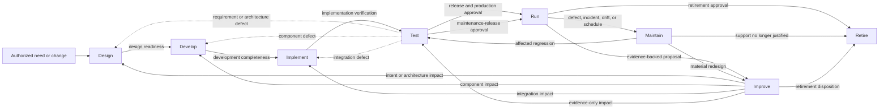
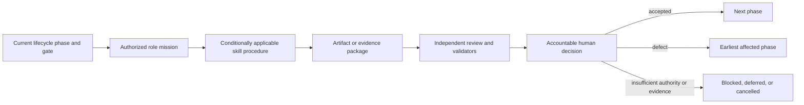

# Sys4AI Target Lifecycle Phases and Their HarborLight Application

- **Status:** Controlled explanatory guide
- **Scope:** The accepted eight-stage Sys4AI target-system lifecycle, its registered role and skill relationships, and its illustrative application to the fictional HarborLight target project
- **Evidence snapshot:** 2026-07-15
- **Authority boundary:** This guide explains current lifecycle, role, skill, and project relationships. It does not create a phase, activate a role or skill, grant permission, approve a transition, or establish HarborLight target authority.

> The accepted lifecycle and stage contracts remain in the
> [Phase 0 Product and System-Design PRD](../PRDs/Sys4AI_phase-0_product_system_design_prd.md).
> Registered role definitions remain in
> [`role_registry.csv`](../Sys4AI/registries/role_registry.csv), conditional
> role-to-skill relationships remain in
> [`role_skill_crosswalk.csv`](../Sys4AI/registries/role_skill_crosswalk.csv),
> and execution limits remain in
> [`role_execution_binding_registry.csv`](../Sys4AI/registries/role_execution_binding_registry.csv).
> Skill status remains in
> [`skill_registry.csv`](../Sys4AI/registries/skill_registry.csv),
> [`skill_lifecycle_status_registry.csv`](../Sys4AI/registries/skill_lifecycle_status_registry.csv),
> and the development-runtime
> [`SKILL_REGISTRY.yaml`](../.agents/skill_registry/SKILL_REGISTRY.yaml).
> See [`roles_guide.md`](roles_guide.md) for role profiles,
> [`skills_guide.md`](skills_guide.md) for skill profiles, and
> [`project_role_skills_overview.md`](project_role_skills_overview.md) for the
> combined audit narrative.

## 1. Purpose and scope

This guide answers six questions about the target-system lifecycle:

1. What does each phase do?
2. Why does the phase exist?
3. How does it receive work from and hand work to other phases?
4. Which registered Sys4AI roles lead, support, review, or return during it?
5. Which core skills contribute procedures during it, and for what purpose?
6. How would the phase work in the fictional HarborLight project?

The guide uses **phase** and **lifecycle stage** for the eight accepted target
stages. It uses **program phase** only for development of Sys4AI itself.

### 1.1 Four concepts that must not be collapsed

| Concept | Meaning | Boundary |
|---|---|---|
| Sys4AI program phase | A phase in development of Sys4AI, such as Phase 0 Product/System Design, Phase 1 Implementation Initialization, or later walking-skeleton work. | It is not a stage in a target system's lifecycle. |
| Informal project grouping | Initiation, implementation, or maintenance and improvement as a reader-friendly grouping of work. | It is a summary, not the normative transition model. |
| Target lifecycle phase | `Design`, `Develop`, `Implement`, `Test`, `Run`, `Maintain`, `Improve`, or `Retire`. | It identifies work and evidence obligations; it does not prove that a gate passed. |
| Operational maturity | An independent evidence state such as `concept`, `prototype`, `validated_prototype`, `production_candidate`, `production_approved`, `operational`, `maintenance`, or `retired`. | A lifecycle phase does not automatically confer the matching maturity. |

The remainder of this guide concerns the **target lifecycle phases** unless a
section explicitly says otherwise.

### 1.2 How to interpret role and skill use

A phase does not create a team automatically. It establishes the kind of work,
evidence, review, and approval required. Roles and skills then contribute under
separate controls:

- A **registered role** owns a mission, artifact class, authority boundary, and
  validation obligations. It may be primary in one phase and return only on a
  trigger in another.
- A **project role** supplies target-specific human accountability, domain
  knowledge, operational ownership, or delegated execution. The 15 HarborLight
  roles in this guide are fictional proposals, not registered authority.
- A **skill** supplies a reusable procedure. A phase reference does not make
  the skill required, installed, executable, or authorized.
- A **role-to-skill crosswalk** states the controlled trigger, binding type,
  system-layer scope, and invocation policy. It takes precedence over a broad
  explanatory phase mapping.
- A **role execution binding** and the active permission envelope determine
  what an actor may read, write, validate, or hand off.
- An **accountable human gate** remains distinct from role work, skill output,
  test success, or validator success.

The current catalogs contain 31 registered roles and 32 registered product
skill packages. The product packages are adapter shells or a scaffold
reference. The 32 adapted skills under `.agents/skills` are active for the
Sys4AI-dev development runtime, not for HarborLight. No HarborLight runtime,
role registry, skill registry, crosswalk, permission set, or named actor exists.

### 1.3 What a complete phase contract contains

Every accepted phase contract addresses the same questions:

| Contract field | Question answered |
|---|---|
| Entry criteria | What must already be true before the phase begins? |
| Required inputs | Which accepted artifacts, evidence, constraints, and decisions are needed? |
| Responsible and approving roles | Who performs the work, reviews it, and approves the gate? |
| Permission requirements | Which reads, writes, tools, data, environments, or external actions are allowed? |
| Activities | What work belongs in the phase? |
| Expected outputs | What candidate artifacts or operating results should exist? |
| Required evidence | What makes the output reviewable and reproducible? |
| Exit criteria and gate | What must be accepted before the next transition? |
| Failure or degraded mode | How does the system stop, restrict, or preserve partial work safely? |
| Allowed transitions | Which next, return, blocked, cancelled, or retirement routes are lawful? |
| Rollback or return | How is the last accepted state restored or the affected earlier phase revisited? |
| Monitoring or review cadence | When must the phase or its evidence be reassessed? |

## 2. How the phases relate

The normal path is:

```text
Design -> Develop -> Implement -> Test -> Run -> Maintain -> Improve -> Retire
```

That line is a lifecycle order, not a one-way schedule. Testing recurs after
material changes, failed gates return work to the phase that owns the defect,
and improvement deliberately re-enters the earliest affected phase.



### 2.1 What each normal transition means

| Transition | Meaning | Minimum gate relationship |
|---|---|---|
| Design -> Develop | Accepted intent, requirements, architecture, risk controls, evidence basis, and implementation-ready scope become build work. | Design-readiness acceptance. |
| Develop -> Implement | Reviewed components and their evidence become an integration candidate. | Development-completeness acceptance. |
| Implement -> Test | A reproducible integrated candidate enters controlled testing. | Implementation verification. |
| Test -> Run | An identified candidate with separately labeled evidence enters production operation. | Release recommendation plus accountable production approval. |
| Run -> Maintain | Operational evidence identifies a bounded repair, update, drift, incident, or scheduled task. | Maintenance trigger, scope, permissions, regression plan, and rollback exist. |
| Maintain -> Test -> Run | A maintenance candidate is re-evaluated before service resumes. | Affected tests and human maintenance-release approval pass. |
| Run or Maintain -> Improve | Evidence supports considering a change to purpose, requirements, architecture, behavior, or operating model. | The proposal is traceable and does not authorize its own implementation. |
| Improve -> affected phase | Impact analysis sends approved work to the earliest phase that owns the change. | Accountable improvement disposition and downstream authorization. |
| Active phase -> Retire | Continued operation or support is no longer authorized or justified. | Retirement decision, plan, owners, and explicit shutdown/disposition permissions. |
| Any phase -> blocked or cancelled | Work cannot proceed safely or lawfully. | Cause, owner, preserved evidence, safe-stop state, and permitted next action are recorded. |

### 2.2 Testing is both a phase and a cross-cutting gate

The Test phase keeps four evidence concepts separate:

| Evidence concept | Question it answers |
|---|---|
| Test execution | Did the implementation behave as specified under the stated conditions? |
| Requirements verification | Was each requirement implemented correctly and traced to evidence? |
| Stakeholder and system validation | Is the right system being built for the approved need and operating context? |
| Behavioral or performance evaluation | How well does the probabilistic system perform against defined scenarios, metrics, thresholds, and uncertainty bounds? |

The same separation applies before first release, after maintenance, after an
approved improvement, and after material model, data, prompt, tool, policy,
host, integration, or permission changes.

### 2.3 Informal three-phase grouping

| Informal grouping | Target lifecycle coverage | Relationship to roles and skills |
|---|---|---|
| Initiation | `/init` routing plus `Design` | Governance, discovery, requirements, architecture, risk, operations, traceability, and evidence-planning roles and skills establish an implementation-ready baseline. |
| Implementation | `Develop -> Implement -> Test`, followed by accountable approval to enter `Run` | Engineering roles create and integrate the candidate; independent evidence roles verify it; planning, baseline, trace, interface, assurance, and evaluation skills preserve the boundary. |
| Maintenance and improvement | `Run -> Maintain -> Test -> Run`; `Improve` re-enters affected phases; `Retire` closes authority and service | Named project operators and owners become central. Core planning, change, source, security, evidence, and retirement procedures support them without inheriting their authority. |

`/init` is a routing skill before Design, not a ninth lifecycle phase. Likewise,
`Implement` is only one stage in the broader implementation grouping.

### 2.4 The phase-role-skill-artifact chain



The chain prevents three common errors: assigning a phase without an owner,
invoking a skill as if it grants permission, and treating an artifact or green
validator as lifecycle acceptance.

## 3. Lifecycle at a glance

| Phase | Purpose | Principal registered roles | Principal skill families | Main output and gate |
|---|---|---|---|---|
| Design | Turn an authorized need into coherent, traceable, implementation-ready intent, requirements, architecture, risk controls, operations obligations, and evidence plans. | System Director; design pipeline roles; Requirements Verifier; triggered domain, assurance, memory, source, execution, operations, and verification roles. | Entry/governance; discovery; requirements; ontology; interface/artifact/diagram; planning/trace; threat/assurance; V&V/evaluation; operations. | Accepted design baseline and SRP; design-readiness gate. |
| Develop | Create reviewed code, prompts, skills, tools, configuration, tests, documentation, migrations, and build artifacts from the accepted design. | Software Engineer; System Engineer posture; architects and technical engineers; security, source, execution, and verification reviewers. | Implementation planning; traceability; baseline and handoff; source audit; writing; diagrams; threat and evidence updates. | Implementable components with owned defects; development-completeness gate. |
| Implement | Assemble and configure components in an authorized, reproducible test or staging environment. | Software Engineer and authorized integration/implementation owners; System Architect; Security Reviewer; Verification Engineer; SVC and Bounded Execution roles. | Interface discovery; artifact contracts; baseline; permissions; trace; V&V; handoff; deployment views. | Integrated candidate and environment baseline; implementation-verification gate. |
| Test | Produce separately labeled test, verification, validation, and evaluation evidence for an identified candidate. | Verification Engineer; Requirements Verifier; Domain Specialist; Security Reviewer; accountable release authority; implementers only for defect repair. | V&V planning; evaluation harness; trace; threat and assurance; source audit; writing; domain review; baseline identity. | Release recommendation or defect route; accountable release gate. |
| Run | Operate an approved release within service, permission, monitoring, support, incident, and rollback bounds. | Named project operators and service/data/security/incident owners; core Runtime/Maintenance Planner supplies prior obligations; other core roles re-enter on triggers. | Operations-plan outputs; source-first retrieval and audit; handoffs; trace; evaluation cadence; threat/assurance review; baseline identity. | Operational service and continuing evidence; operational-acceptance review. |
| Maintain | Apply a bounded repair, update, migration, rotation, or drift correction to the accepted baseline. | Named maintainers and operators; Software Engineer; Bounded Execution Planner; Runtime/Maintenance Planner; SVC, architecture, assurance, and verification roles. | Baseline and rollback; bounded plan; interfaces; handoff; source audit; trace; V&V/evaluation regression; writing and operations updates. | Maintenance candidate and regression evidence; Test before return to Run. |
| Improve | Give an evidence-backed proposal an accountable disposition and route approved work to the earliest affected phase. | System Director; affected requirements/architecture/operations owners; independent verification and assurance roles; accountable sponsor/change authority. | Entry/routing plus only the affected discovery, architecture, planning, baseline, risk, evaluation, operations, and writing skills. | Approved, rejected, or deferred decision with impact map and downstream route. |
| Retire | Withdraw service and authority safely while closing data, credentials, dependencies, records, notifications, and residual obligations. | Named product, operations, data, security, privacy, compliance, dependency, archive, and stakeholder owners; supporting Runtime/Maintenance, SVC, assurance, and verification roles. | Operations/retirement planning; baseline; threat/permission; source audit; artifact contracts; trace; handoff; assurance and closure verification. | Retirement record and closure evidence; accountable retirement acceptance. |

## 4. Phase profiles

The role and skill lists below are relationship maps, not automatic team
composition or invocation lists. A phase uses only the roles and skills whose
triggers, system-layer scope, permissions, and evidence obligations apply.

### 4.1 Design

**Purpose.** Design converts an authorized need or change into an
implementation-ready description of the right system, its boundaries, its
requirements, its architecture, its risks, and the evidence needed to judge it.
It exists to prevent implementation from becoming the place where purpose,
authority, interfaces, risk acceptance, and success criteria are guessed.

**Entry and work.** Design begins with an authorized need, identifiable
stakeholders and system of interest, available evidence, and an RDR or approved
discovery substitute. It performs discovery, brownfield analysis when needed,
requirements derivation, architecture, pattern and maturity analysis, threat
and interface analysis, trace planning, implementation planning, and
verification, validation, evaluation, operations, maintenance, and retirement
planning.

**Registered role relationships.** The System Director establishes the route,
layer, gates, and handoffs. The User Wants Elicitor and conditional Existing
System Analyst produce discovery and current-state evidence. Requirements
Manager, System Architect, Technical Requirements Engineer, Reconciliation
Analyst, Reconciled Architecture Architect, and Final Requirements Packager
form the main producer chain. Requirements Verifier reviews the baselines.
Domain Specialist, Security/Safety/Privacy/Compliance Reviewer, Runtime and
Maintenance Planner, Bounded Execution Planner, Context Memory and Knowledge
Architect, SVC and Documentation Surface Architect, and Verification Engineer
contribute when their risks or evidence surfaces are triggered.

**HarborLight project relationships.** The Sponsor supplies scope and approves
design readiness. Emergency Coordination, Shelter Operations, Accessibility
and Medical Support, Guidance, Data, Integration, Privacy, Security, Service,
Evaluation, and Records owners supply target truth, constraints, human
authority, and future operating obligations. Core roles structure that evidence;
they do not inherit the project owners' accountability.

**Principal skills and why they appear.** `init`,
`system-layer-classifier`, `source-first-memory`, and
`director-decision-governor` establish the route. Interview, decision-grilling,
domain-grilling, `requirements-discovery-governor`, and `conversation-to-prd`
move from uncertain intent to reviewable requirements. Ontology, domain-pack,
interface, artifact-contract, diagram, and source-audit skills establish shared
meaning and boundaries. Implementation-plan, traceability, handoff, baseline,
and writing skills make the design buildable and reviewable. V&V, evaluation,
threat, assurance, and operations skills define evidence and lifecycle
obligations before a build exists. Context-45 procedures and
`codex-usage-metrics` apply only when long governed development sessions need
checkpointing.

**Outputs and gate.** Expected evidence includes the RDR, optional ESAR, USRD,
SRD, ARD, TRP, RSRD, RARD, SRP, risk and issue records, lifecycle and operations
obligations, trace, evaluation basis, review findings, and unresolved items.
Design exits only when intent and boundary are approved and the accepted scope
is coherent, traceable, sufficiently risk-owned, and ready for bounded work.

**Relationship to other phases.** Accepted Design feeds Develop. Architecture
or requirements defects found later return here. Improve returns here when
purpose, stakeholder need, system boundary, architecture, risk, permission, or
acceptance basis changes. Retirement planning begins here even though execution
occurs later.

**HarborLight example.** The team documents the existing call-center and
spreadsheet workflow, defines verified shelter-capacity and accessibility
terms, preserves human case-decision authority, maps provider and messaging
interfaces, identifies sensitive-data and stale-source risks, and defines how
recommendations, escalation, degraded mode, and retirement will be tested.

**Failure boundary.** Missing authority, stakeholders, system boundary,
critical evidence, or risk ownership keeps the work in Design or blocked.
Candidate prose is preserved without being promoted as an accepted baseline.

### 4.2 Develop

**Purpose.** Develop creates the components that realize the accepted design.
It exists to separate component creation and review from environment assembly,
release testing, and production operation.

**Entry and work.** An approved design baseline, implementation plan,
environment boundary, acceptance basis, and authorized work scope must exist.
Develop creates and reviews code, prompts, tools, skills, configurations, tests,
documentation, migrations, dependency records, and build artifacts.

**Registered role relationships.** The Software Engineer is the main current
implementation role, supported by the generic System Engineer runtime posture
where appropriate. System Architect and Technical Requirements Engineer clarify
accepted design obligations. Security Reviewer, Requirements Verifier,
Verification Engineer, Bounded Execution Planner, Context Memory and Knowledge
Architect, and SVC Architect review permissions, trace, source identity,
checkpoint, baseline, and evidence obligations. The Implementation
Initialization Agent is relevant only to authorized framework-side bootstrap
work; it is not a standing HarborLight role.

**HarborLight project relationships.** The Engineering and Maintenance Owner
coordinates bounded implementation. Data, Integration, Guidance, Privacy,
Security, Service, Accessibility, and Evaluation owners constrain data meaning,
interfaces, content, permissions, operability, representative cases, and
evidence. The implementer cannot become sole evaluator or release authority.

**Principal skills and why they appear.** `prd-to-implementation-plan` turns
the accepted package into bounded work. `traceability-matrix-engine` connects
components to obligations. `baseline-change-manager` and
`context-window-and-handoff-manager` preserve version, rollback, checkpoint,
and next-owner evidence. Source-first memory, source audit, artifact contracts,
diagrams, and the writing gate preserve authority and clarity. Threat, V&V,
evaluation, interface, and operations work is updated when implementation
discovers a material constraint. `skill-import-generalizer` belongs only to a
separately governed skill-adaptation route.

**Outputs and gate.** Expected outputs are reviewed components, configurations,
prompts, tests, documentation, migration material, dependency/provenance
evidence, updated trace, known limitations, and owned defects. Development
completeness means the declared components exist, checks pass within their
scope, and interfaces are ready for integration; it does not authorize deploy.

**Relationship to other phases.** Develop consumes Design and feeds Implement.
Component failures found in Implement or Test return here. Architecture or
requirements defects return to Design. Approved Improve work enters here only
when the accepted change is component-level rather than a deeper design change.

**HarborLight example.** Engineers build a shelter-feed adapter, retrieval
logic, stale-data controls, human-escalation UI, audit events, tests, runbook
material, and provider simulators against identified requirements and source
contracts. No component is presented as a production service.

**Failure boundary.** Unsafe or invalid components are isolated; partial work
remains non-release evidence; the candidate returns to the last accepted source
and configuration baseline or to Design when the defect is architectural.

### 4.3 Implement

**Purpose.** Implement assembles developed components into a reproducible,
testable candidate in an authorized environment. It exists to make integration,
configuration, infrastructure, migration, secrets, and rollback visible rather
than treating a source build as a deployed system.

**Entry and work.** Development completeness, an approved build/environment
plan, integration contracts, explicit permissions, and a deployable candidate
must exist. The phase assembles, configures, provisions, integrates, migrates,
packages, and deploys to a test or staging environment.

**Registered role relationships.** Software Engineer and separately authorized
implementation or integration owners assemble the candidate. System Architect
reviews boundaries and interfaces. Security Reviewer examines secrets,
permissions, isolation, and target-environment risk. SVC Architect preserves
baseline and rollback identity. Bounded Execution Planner constrains the work.
Verification Engineer prepares to consume the identified candidate and its
implementation evidence.

**HarborLight project relationships.** Engineering, Integration, and Data
owners assemble provider adapters, data contracts, identity, messaging,
storage, deployment, and migration configuration. Privacy and Security owners
review sensitive-data paths and credentials. The Production Service Owner and
Evaluation Lead assess whether the staging environment is representative and
testable without accepting it for Run.

**Principal skills and why they appear.** Interface discovery and artifact
contracts define integration obligations. Baseline management identifies the
candidate, configuration, migration, and rollback point. Threat and permission
scoping bounds credentials, data, tools, and environments. Traceability, V&V
planning, source audit, handoff management, diagrams, and implementation
planning make the assembly reproducible and reviewable.

**Outputs and gate.** The phase produces an integrated target-system instance
or reproducible package, environment/configuration baseline, migration record,
installation and integration results, provenance, secret-handling evidence,
and rollback rehearsal. Implementation verification accepts entry to controlled
Test, not production.

**Relationship to other phases.** Implement consumes developed components and
feeds Test. Component defects return to Develop; boundary or architecture
defects return to Design. Improve enters here only for an integration or
environment change whose earlier baselines remain valid.

**HarborLight example.** The team deploys a staging candidate with simulated
and authorized test feeds, least-privileged service identities, isolated test
data, versioned configuration, alerting hooks, and a rehearsed rollback. Real
shelter operations and production credentials remain outside the phase's authority.

**Failure boundary.** A failed integration is isolated and blocked from Test
or Run. The environment, configuration, and data snapshots return to the last
verified implementation baseline.

### 4.4 Test

**Purpose.** Test determines what an identified integrated candidate actually
supports. It exists to keep test execution, requirements verification,
stakeholder/system validation, behavioral evaluation, and accountable release
approval distinct.

**Entry and work.** A testable build, approved evidence plan, metrics and
thresholds, controlled test data, isolated environment, release criteria, and
required reviewers must exist. Work includes functional, integration,
regression, security, safety, recovery, rollback, requirements-verification,
stakeholder-validation, and behavioral/performance-evaluation activities.

**Registered role relationships.** Verification Engineer leads independent
evidence work. Requirements Verifier checks implementation-to-requirement
trace. Domain Specialist validates domain assumptions and representative
conditions. Security Reviewer assesses risk controls and residual exposure.
System Director routes defects and unresolved authority. Software Engineer may
repair defects in a separately controlled candidate but cannot modify the
candidate while independently evaluating it or approve release.

**HarborLight project relationships.** The Independent Validation and
Evaluation Lead coordinates evidence with Shelter Operations, Emergency,
Accessibility, Data, Integration, Privacy, Security, Guidance, and Service
owners. The Release and Change Authority makes the promotion decision. Domain
owners do not delegate consequential policy or legal judgment to a test skill.

**Principal skills and why they appear.**
`verification-validation-planner` defines evidence methods;
`evaluation-harness-designer` defines scenarios, rubrics, regressions, failure
probes, and holdouts. Traceability connects each result to the candidate and
requirement. Threat and assurance skills structure risk claims and gaps.
Domain-grilling, source audit, technical-writing review, baseline management,
and handoff procedures keep conditions, claims, sources, and defects explicit.

**Outputs and gate.** Outputs are separately labeled test, verification,
validation, and evaluation results; reproducible conditions and provenance;
defects and risk updates; limitations; reviewer identity; and a release
recommendation. Only an accountable human may accept unresolved failures and
approve production promotion.

**Relationship to other phases.** Test consumes Implement and may feed Run.
Failures return to Develop, Implement, or Design according to cause. Maintain
must return through affected Test work. Improve may route directly here only
when the approved change concerns evidence and leaves earlier baselines valid.

**HarborLight example.** Evidence covers stale or conflicting capacity feeds,
accessibility constraints, unsupported medical needs, provider outages,
credential loss, prompt/tool failure, human escalation, rollback, and outcome
quality. Passing adapter unit tests cannot stand in for stakeholder validation
or behavioral evaluation.

**Failure boundary.** The phase fails closed: no Run transition, no silent
threshold change, no disappearance of negative results, and no release claim
without the required accountable approval.

### 4.5 Run

**Purpose.** Run operates an approved release within current service, risk,
permission, monitoring, ownership, support, incident, and rollback bounds. It
exists to distinguish production operation from development and release evidence.

**Entry and work.** Production approval, named service and incident owners,
runbooks, least-privileged permissions, service objectives, monitoring, support,
continuity, rollback, and current configuration identity must exist. Operators
observe, support, audit, respond to incidents, collect approved telemetry and
feedback, and enforce degraded-mode or safe-stop controls.

**Registered role relationships.** The current core catalog does not provide a
dedicated target Service Operator or Production Owner. The Runtime and
Maintenance Planner defines prior obligations but does not operate the system.
Domain Specialist, Security Reviewer, Verification Engineer, Context Memory and
Knowledge Architect, and SVC Architect return on scheduled or event-driven
review. System Director routes material changes; it does not make consequential
HarborLight case decisions.

**HarborLight project relationships.** The Production Service Owner accepts
operational responsibility; Service Operators run approved procedures. The
Emergency Coordination Lead retains consequential case-decision authority.
Shelter, Guidance, Data, Integration, Privacy, Security/Incident, Evaluation,
Engineering, Release, and Records owners monitor their domains and own
escalation, evidence, and change proposals.

**Principal skills and why they appear.** The approved outputs of
`operations-and-maintenance-planner` define monitoring, incidents, support,
evaluation cadence, recovery, and maintenance triggers. Source-first memory and
source audit prevent cached or generated guidance from becoming authority.
Handoff, traceability, baseline, evaluation, threat, and assurance procedures
support shifts, incident review, current release identity, recurring evidence,
and material risk review. These procedures require target adaptation and
permission before any HarborLight use.

**Outputs and gate.** Run produces operational service, telemetry, audit and
incident records, user feedback, service evidence, drift status, rollback
readiness, and maintenance or improvement proposals. Continuing operation is
reviewed against the approved service, risk, permission, and evidence bounds.

**Relationship to other phases.** Operational triggers enter Maintain.
Evidence-backed material changes enter Improve. Accountable retirement may
begin from Run. Loss of authority or required evidence enters a restricted,
blocked, degraded, rollback, or safe-stop state rather than silently continuing.

**HarborLight example.** Operators use only current verified shelter sources,
surface freshness and confidence limits, route consequential cases to humans,
record incidents, and stop presenting a feed as current when verification is
lost. A language model or skill never becomes the case-decision authority.

**Failure boundary.** Unsafe capability is disabled or restricted; incident
response and rollback begin; temporary access remains logged and revocable;
operation fails closed when essential authority or evidence is absent.

### 4.6 Maintain

**Purpose.** Maintain changes an accepted operating baseline in a bounded,
reviewable way. It exists to prevent routine patches, emergency repairs,
dependency updates, model or data changes, and documentation corrections from
bypassing impact analysis, regression, rollback, or release approval.

**Entry and work.** A defect, incident, vulnerability, drift signal,
dependency/model/data/host change, support expiry, or approved maintenance
schedule supplies the trigger. The phase patches, updates, repairs, rotates,
migrates, reconciles drift, refreshes documentation/evidence, and prepares an
affected regression candidate.

**Registered role relationships.** Software Engineer implements authorized
changes. Bounded Execution Planner defines scope, permissions, validators, stop
conditions, and handoff. Runtime and Maintenance Planner supplies the accepted
maintenance and incident route. SVC Architect manages baselines and rollback.
Existing System Analyst, System Architect, Requirements Manager, Requirements
Verifier, Domain Specialist, Security Reviewer, Context/Memory Architect, and
Verification Engineer return according to impact.

**HarborLight project relationships.** Service Operators and Service Owner
report the trigger and manage degraded operation. Engineering/Maintenance,
Integration, Data, Guidance, Privacy, Security, and Records owners constrain the
change. Evaluation leads regression; Release Authority approves the maintenance
release. The implementer cannot approve its own return to Run.

**Principal skills and why they appear.** Baseline management and
implementation planning define the current release, bounded change, migration,
and rollback. Interface discovery and artifact contracts address changed feeds
or data. Source audit, handoff, traceability, operations planning, threat,
assurance, V&V, evaluation, and the writing gate refresh affected evidence.
Decision- or domain-grilling and diagrams return only when the maintenance issue
exposes a real ambiguity or changed boundary.

**Outputs and gate.** The phase produces a controlled maintenance candidate,
change and impact record, updated dependencies/configuration/docs/trace,
incident-resolution evidence, regression results, deployment/rollback
evidence, and residual-risk ownership. It must pass affected Test work and
human maintenance-release approval before returning to Run.

**Relationship to other phases.** Maintain normally enters from Run and routes
to Test. A component repair may require Develop; an integration change may
require Implement; a material redesign enters Improve and then the earliest
affected phase. Unsupported or unsafe operation may route to Retire.

**HarborLight example.** A shelter provider changes its API schema. Operators
mark capacity data stale and enter degraded mode. Analysts confirm the new
contract, engineers update the adapter, security reviews changed data and
permissions, evaluation runs functional/integration/stale-data/recovery/rollback
regression, and Release Authority decides whether service may resume.

**Failure boundary.** The candidate rolls back, temporary maintenance access is
revoked, the prior supported release remains identified, and unsafe or
unsupported dependencies are isolated or escalated.

### 4.7 Improve

**Purpose.** Improve decides whether evidence justifies a change and, if so,
where that change must re-enter the lifecycle. It exists to prevent feedback,
new capability, or performance opportunity from directly mutating production
or evading requirements, risk, testing, and approval.

**Entry and work.** A traceable proposal identifies the affected outcome,
current baseline, value or requirement, expected benefit, adverse effects,
risks, and permission implications. The phase analyzes root cause and value,
compares alternatives, performs impact and threat analysis, updates candidate
baselines, and selects the earliest affected re-entry phase.

**Registered role relationships.** System Director governs the route. User
Wants Elicitor and Requirements Manager return for changed intent or
requirements. Existing System Analyst returns for changed current state.
Architecture, technical, reconciliation, packaging, operations, source,
security, domain, and verification roles return when their baselines or evidence
are affected. Software Engineer enters only after a downstream Develop or
Implement authorization; proposal analysis alone grants no implementation work.

**HarborLight project relationships.** Users, operators, domain owners,
Evaluation Lead, or Sponsor may propose an improvement. Sponsor and Release/
Change Authority provide accountable disposition within their scopes. Affected
Emergency, Shelter, Accessibility, Guidance, Data, Integration, Privacy,
Security, Service, Engineering, Evaluation, and Records owners supply impact
and evidence.

**Principal skills and why they appear.** Layer classification, source-first
memory, Director decisions, traceability, source audit, baseline management,
threat analysis, assurance, evaluation, and operations planning establish the
proposal's evidence and route. Discovery, PRD, domain-pack, ontology, interface,
artifact, diagram, implementation-plan, V&V, and writing skills return only if
the proposal affects their subject. `role-catalog-governance` or
`skill-import-generalizer` applies only when the proposal explicitly changes a
role binding or requires a new governed skill adaptation.

**Outputs and gate.** Improve produces an approved, rejected, or deferred
decision; impact map; candidate requirements, architecture, or plan updates;
evidence owners; success criteria; and rollback obligations. Accountable
disposition plus explicit downstream routing is the gate.

**Relationship to other phases.** Changed purpose, users, requirements,
permissions, or architecture returns to Design. A bounded component change may
enter Develop; integration-only work may enter Implement; evidence-only work
may enter Test. Rejected or deferred work leaves the accepted baseline intact.

**HarborLight example.** Users propose automatic shelter assignment instead of
recommendations. Because this changes purpose, human authority, risk,
requirements, architecture, permissions, operations, and evaluation, the route
returns to Design. It cannot jump from a promising proposal to implementation
or Run.

**Failure boundary.** Insufficient or contradictory evidence leads to rejection
or deferral with an owner and missing-evidence record. The current accepted
baseline remains unchanged.

### 4.8 Retire

**Purpose.** Retire ends service and withdraws authority without orphaning
data, credentials, dependencies, records, users, or residual obligations. It
exists because stopping a process is not the same as completing retirement.

**Entry and work.** An accountable retirement decision, impact analysis,
retirement plan, affected-owner inventory, and migration or continuation
disposition must exist. Work includes stakeholder notification, intake and
service shutdown, credential and authority revocation, data disposition or
transfer, dependency closure, archive preservation, and residual-obligation
tracking.

**Registered role relationships.** Runtime and Maintenance Planner defines the
retirement obligations; SVC Architect governs source, archive, baseline,
supersession, and rollback evidence. Security Reviewer addresses revocation and
residual risk. Verification Engineer and Requirements Verifier check closure
claims. Domain, Context/Memory, Bounded Execution, and System Director roles
return when domain obligations, retained knowledge, staged execution, or
governance routing requires them. The core catalog does not replace named
target product, operations, data, privacy, dependency, or archive owners.

**HarborLight project relationships.** Sponsor or another authorized retirement
authority approves the route. Production Service, Operator, Records/Archive,
Data, Integration, Privacy, Security, Guidance, Emergency, Shelter, Evaluation,
and Engineering owners execute and attest their separate obligations.

**Principal skills and why they appear.** Operations and maintenance planning
defines retirement work and review dates. Baseline management identifies the
final accepted release and withdrawal state. Threat and permission scope
supports credential, data, and authority revocation. Source audit, artifact
contracts, ontology, traceability, handoff, assurance, V&V, writing, interface,
and Director-decision procedures support inventories, closure evidence,
notifications, archives, exceptions, and accountable acceptance.

**Outputs and gate.** Outputs include the retirement decision and record,
shutdown and revocation evidence, data-disposition record, archive, dependency
closure, stakeholder notifications, exceptions, and residual-obligation
register. Retirement is accepted only when obligations are complete or
explicitly inapplicable, residual risks have owners, and authority is withdrawn.

**Relationship to other phases.** Retirement may begin from Run, Maintain, or
Improve after approval. The normal accepted result is terminal retired maturity.
Exceptional reactivation requires new authorization and re-entry no later than
Design and Test; a prior retirement decision cannot authorize restart.

**HarborLight example.** Operators stop intake, provider credentials are
revoked, sensitive case data is deleted or retained under approved rules,
external integrations and alerts are closed, public guidance is withdrawn,
records and evidence are archived, stakeholders are notified, and an
accountable human reviews remaining obligations.

**Failure boundary.** Final retirement status remains blocked while data,
credentials, dependencies, notices, archives, or ownership are unresolved.
Necessary controls and responsible owners remain active until closure.

## 5. Complete registered-role phase index

This table accounts for all 31 registered roles. **Primary** means the role
normally owns work in the named phase. **Triggered** means it returns only when
its subject is affected. Development/framework-only and noncurrent roles are
listed so historical evidence is not mistaken for target lifecycle authority.

| Registered role | Target lifecycle relationship |
|---|---|
| System Director (`system_director`) | Governance before Design and across all phases, gates, failures, Improve routing, and Retire decisions. |
| System Developer / User Wants Elicitor (`user_wants_elicitor`) | Primary at Design entry; triggered at Improve re-entry when intent, actors, behavior, constraints, or acceptance changes. |
| Existing System Analyst (`existing_system_analyst`) | Conditional in brownfield Design; triggered in Maintain or Improve when current-state evidence or upstream behavior changes. |
| System Manager / Requirements Manager (`requirements_manager`) | Primary in Design; triggered when Maintain or Improve changes requirements or acceptance basis. |
| System Architect (`system_architect`) | Primary in Design; consulted in Develop and Implement; triggered by material integration, maintenance, improvement, or retirement changes. |
| System Engineer / Technical Requirements Engineer (`technical_requirements_engineer`) | Primary at Design exit and the Develop/Implement handoff; triggered when technical allocation or evidence methods change. |
| System Analyst / Reconciliation Analyst (`reconciliation_analyst`) | Primary late in Design; triggered at Improve re-entry when user intent and technical obligations diverge. |
| Reconciled Architecture Architect (`reconciled_architecture_architect`) | Primary late in Design; triggered when Improve changes reconciled architecture. |
| Final System Requirements Packager (`final_system_requirements_packager`) | Primary at Design exit; triggered when Maintain or Improve requires a new implementation-ready package. |
| Requirements Verifier (`requirements_verifier`) | Reviews Design baselines and returns in Test, Maintain, Improve, and Retire when requirement evidence changes. |
| Domain Specialist (`domain_specialist`) | Conditional in Design, Test, Run review, Maintain, Improve, and Retire when domain claims or outcomes are material. |
| Security, Safety, Privacy, and Compliance Reviewer (`security_safety_privacy_compliance_reviewer`) | Cross-cutting from Design through Retire for triggered threat, hazard, privacy, compliance, permission, control, and residual-risk evidence. |
| Documentation Librarian / Configuration Controller (`documentation_librarian`) | Cross-cutting only for Sys4AI-dev/framework source, registry, configuration, derivative, terminology, and skill-provenance changes; not a target-instance operator. |
| Runtime and Maintenance Planner (`runtime_maintenance_planner`) | Begins in Design, contributes to Test readiness, and is central to Run, Maintain, Improve, and Retire planning; does not operate the target. |
| Bounded Execution Planner (`bounded_execution_planner`) | Triggered in Design, Develop, Implement, Test, Maintain, Improve, and Retire when work must be packetized or resumed. |
| Context Memory and Knowledge Architect (`context_memory_knowledge_architect`) | Triggered from Design through Retire whenever retrieval, memory, knowledge, or generated evidence affects decisions. |
| SVC and Documentation Surface Architect (`svc_documentation_surface_architect`) | Cross-cutting from Design through Retire, especially at implementation, release, maintenance, improvement, supersession, rollback, and archive changes. |
| Implementation Initialization Agent (`implementation_initialization_agent`) | Sys4AI program Phase 1 and framework-side Develop/Implement preparation only; registered scope excludes target instances. |
| Verification Engineer (`verification_engineer`) | Plans in Design, leads Test, and returns for Run review, Maintain/Improve regression, material changes, and Retire closure evidence. |
| Software Engineer (`software_engineer`) | Primary in Develop and Implement; repairs Test defects; performs authorized Maintain and approved downstream Improve work. |
| System Engineer compatibility posture (`system_engineer`) | Runtime compatibility posture spanning Design, Develop, and Implement; specialized artifact owners retain canonical ownership. |
| System Analyst compatibility posture (`system_analyst`) | Runtime compatibility posture primarily for Design and Improve analysis; it does not replace specialized analysis roles. |
| Control Loop Planner (`control_loop_agentjob_planner`) | Superseded; no current target phase. Historical records route new work to the Bounded Execution Planner. |
| Control Loop Engineer (`control_loop_engineer`) | Deprecated; no current target phase. Retained for read-only historical interpretation. |
| Validator Engineer (`validator_engineer`) | Temporary legacy Sys4AI-dev/framework validation work only; no HarborLight phase assignment. |
| Derivative Generator Engineer (`derivative_generator_engineer`) | Temporary legacy generated-reader work only; no target phase assignment. |
| Skill Surface Engineer (`skill_surface_engineer`) | Temporary legacy Sys4AI program work only; no target phase assignment. |
| Acceptance Engineer (`acceptance_engineer`) | Temporary legacy acceptance evidence only; does not own a target Test-to-Run gate. |
| Skill Dependency Adaptation Agent (`skill_dependency_adaptation_agent`) | Temporary legacy development/framework skill maintenance only; no target phase assignment. |
| Skill Integration Agent (`skill_integration_agent`) | Temporary legacy development/framework skill integration only; no target phase assignment. |
| System Definition Template Agent (`system_definition_template_agent`) | Temporary legacy Design-entry tooling support only; new target adoption routes through `init` and the Elicitor. |

## 6. Complete core-skill phase index

This table accounts for all 32 registered core skills. A phase entry means the
procedure may be relevant there; the controlled role declaration, crosswalk,
runtime manifest, permission envelope, and skill authority section still decide
whether it may be invoked.

| Core skill | Phase relationship and purpose |
|---|---|
| `init` | Before Design or at a newly authorized adoption/re-entry point; classifies and proposes a route without performing downstream phases. |
| `system-layer-classifier` | Entry and every controlled change, especially Improve or self-hosting work; prevents mutation of the wrong authority layer. |
| `director-decision-governor` | Cross-lifecycle at entry, gates, failures, return paths, authority changes, bounded-job routing, and retirement decisions. |
| `role-catalog-governance` | Conditional before or across any phase when role definitions, skill conditions, authority limits, or execution bindings change. |
| `source-first-memory` | All phases when prior evidence or state influences a claim or route; memory navigates to authority rather than replacing it. |
| `system-definition-interview` | Design and material Improve re-entry when lightweight stakeholder discovery is sufficient. |
| `system-definition-interview-context-45` | Long-session Design discovery and material Improve re-entry with checkpoint and explicit synthesis boundaries. |
| `decision-grilling` | Design, Test disposition, Maintain planning, and Improve when one requirement, architecture, implementation, or release decision is unresolved. |
| `decision-grilling-context-45` | Long Design or Improve decision work requiring checkpoints and resumable handoff. |
| `domain-grilling-with-docs` | Brownfield Design, Test validation, Maintain, and Improve when controlled documents must be challenged against domain practice. |
| `domain-grilling-with-docs-context-45` | Conditional long Design, Test, or Improve domain review. |
| `requirements-discovery-governor` | Design entry and material Improve re-entry; protects the discovery-to-USRD boundary. |
| `conversation-to-prd` | Design synthesis and requirements-impact work after an Improve disposition; does not approve the resulting baseline. |
| `codex-usage-metrics` | Cross-lifecycle Sys4AI-dev session accounting for long governed work; not HarborLight service telemetry or target user monitoring. |
| `project-ontology-and-glossary` | Design through Retire whenever controlled terms or definitions change. |
| `domain-pack-router` | Design and Improve when project specialization must be separated from generic core authority. |
| `interface-and-integration-discovery` | Brownfield Design, Implement planning, and interface-affecting Maintain or Improve work; may support dependency closure planning in Retire. |
| `artifact-contract-governance` | Design through Improve and Retire when data, evidence, handoff, evaluation, or closure artifact contracts matter. |
| `mermaid-diagrams` | Design through Maintain and affected Improve work when a source-controlled visual is the clearest architecture, trace, lifecycle, incident, or handoff artifact. |
| `plantuml-diagrams` | Design through Maintain and affected Improve work when detailed component, sequence, integration, or deployment views are required. |
| `source-authority-auditor` | All phases, with particular importance as sources age, are generated, or are superseded in Run, Maintain, Improve, and Retire. |
| `prd-to-implementation-plan` | Design exit, Develop, Implement, Maintain, and approved Improve work; decomposes accepted intent into bounded packets. |
| `traceability-matrix-engine` | All phases; connects intent and requirements to design, implementation, evidence, operation, change, and retirement closure. |
| `context-window-and-handoff-manager` | Cross-lifecycle for long execution, shift, incident, maintenance, improvement, and retirement handoffs. |
| `baseline-change-manager` | Develop through Retire, especially Implement, release, Maintain, Improve, migration, supersession, rollback, and authority withdrawal. |
| `skill-import-generalizer` | Separate development/framework adaptation before a target can use a skill; not an ordinary target lifecycle operation or promotion mechanism. |
| `technical-writing-quality-gate` | Cross-cutting wherever claim-bearing technical prose, instructions, criteria, decisions, or evidence summaries are authored or changed. |
| `verification-validation-planner` | Design and Test, then affected Maintain/Improve regression and Retire closure checks. |
| `evaluation-harness-designer` | Design and Test, then scheduled or change-triggered Run, Maintain, and Improve evaluation. |
| `threat-model-and-permission-scope` | All phases, with explicit review before Run, after material change or incident, and during Retire revocation and data disposition. |
| `assurance-case-builder` | Design through Retire for material safety, security, privacy, reliability, or compliance claims; evidence structure never accepts its own risk. |
| `operations-and-maintenance-planner` | Design, Test readiness, Run, Maintain, Improve, and Retire; defines human-owned monitoring, incident, support, recovery, change, and closure obligations. |

### 6.1 How skill relationships change across phases

The same skill can serve different consumers without changing its authority:

| Skill relationship | Early-phase use | Later-phase use |
|---|---|---|
| Traceability | Connect stakeholder intent to requirements and architecture. | Connect releases, incidents, maintenance changes, evaluations, and retirement evidence back to the accepted baseline. |
| Threat and permission scope | Identify intended data, tool, autonomy, and human-control boundaries. | Review actual environment permissions, incidents, emergency access, drift, and revocation. |
| V&V and evaluation | Define methods, scenarios, thresholds, independence, and evidence obligations. | Execute or refresh evidence after integration, release candidates, maintenance, improvement, or material change. |
| Operations planning | Define owners, monitoring, incidents, support, maintenance, recovery, and retirement before implementation. | Supply approved procedures and triggers to named operators and owners; it does not operate the service. |
| Source and baseline governance | Identify canonical sources, candidate artifacts, and planned rollback. | Preserve release identity, supersession, migrations, current guidance, archives, and withdrawal evidence. |
| Handoff management | Preserve long Design or implementation work across checkpoints. | Preserve operator shifts, incidents, maintenance packets, change decisions, and staged retirement evidence. |

## 7. HarborLight end-to-end phase example

HarborLight is a fictional county emergency-shelter coordination assistant. It
would help authorized staff locate shelter capacity, match accessibility and
medical-support needs, summarize verified public guidance, and route
consequential cases to human coordinators. It replaces parts of a brownfield
call-center/spreadsheet workflow, integrates with external systems, handles
sensitive data, uses retrieval and tools, and must tolerate emergency conditions.

### 7.1 Project roles by phase

| HarborLight project role | Principal phase relationship |
|---|---|
| Accountable Sponsor / Product Owner | Authorizes exploration; approves Design and material Improve gates; remains accountable through Retire. |
| Release and Change Authority | Owns Test-to-Run, maintenance-release, and material change gates. |
| Emergency Coordination Lead / Human Case-Decision Authority | Supplies Design and Test domain evidence; retains consequential decisions in Run; participates in incidents, Improve, and Retire. |
| Shelter Operations Liaison | Supplies brownfield Design and interface evidence; participates in Test, provider-change monitoring, Maintain, and Retire. |
| Accessibility and Medical Support Specialist | Defines Design constraints and representative evidence; participates in Test, change review, and Retire. |
| Guidance, Support, and Training Owner | Owns content and support obligations from Design through Run/Maintain and withdrawal in Retire. |
| Shelter Data Steward | Owns data meaning, provenance, access, freshness, retention, and disposition from Design through Retire. |
| Integration and Dependency Owner | Owns external boundaries in Design, assembly in Implement, monitoring and maintenance, and dependency closure in Retire. |
| Privacy and Compliance Owner | Reviews Design, Implement, Test, Run, change, and Retire evidence while retaining human policy and legal judgment. |
| Security and Incident Owner | Owns threat inputs, environment review, Run incidents, maintenance risk, improvement review, and Retire revocation. |
| Production Service Owner | Defines operability in Design, reviews Test readiness, owns Run, routes changes, and withdraws service in Retire. |
| Service Operator | Executes approved Run procedures and supports Maintain, incidents, handoffs, degraded mode, and staged Retire. |
| Engineering and Maintenance Owner / Change Implementer | Leads Develop and Implement, repairs Test defects, performs authorized Maintain and approved Improve work, and supports technical Retire tasks. |
| Independent Validation and Evaluation Lead | Plans evidence in Design, leads Test, performs scheduled/triggered Run checks and change regression, and verifies Retire closure. |
| Records, Archive, and Retirement Owner | Defines evidence/retention obligations in Design, maintains custody in Run/Maintain, and leads archive and residual-obligation work in Retire. |

### 7.2 Normal lifecycle walk-through

1. **Before Design:** The Sponsor authorizes exploration. `init` routes the
   System Director, Elicitor, and Existing System Analyst. Layer classification
   and source inspection establish that HarborLight is a fictional brownfield
   target-instance proposal, not a Sys4AI framework feature.
2. **Design:** Core discovery and design roles work with all affected project
   owners to define human authority, shelter workflows, interfaces, data,
   guidance, risks, operations, evaluation, maintenance, and retirement. The
   Sponsor decides design readiness.
3. **Develop:** The Engineering Owner and Software Engineer build bounded
   components against the accepted package. Domain, data, integration,
   security, privacy, guidance, service, and evaluation owners review their
   constraints without taking over implementation.
4. **Implement:** The identified components, staging environment, identities,
   provider simulators, configuration, migration, monitoring hooks, and
   rollback package are assembled under explicit non-production permissions.
5. **Test:** Independent evidence roles evaluate stale sources, accessibility,
   human escalation, tool and provider failure, security, recovery, rollback,
   and outcome behavior. The Release Authority decides whether the identified
   candidate may enter Run.
6. **Run:** The Service Owner and Operators use approved sources, permissions,
   runbooks, monitoring, escalation, and degraded-mode controls. Consequential
   shelter decisions remain with an authorized human.
7. **Maintain:** Incidents, defects, source changes, dependency changes, or
   scheduled work create bounded packets. Each candidate returns through
   affected Test work and maintenance-release approval.
8. **Improve:** Feedback and operational evidence become proposals, not direct
   changes. Approved work returns to the earliest affected phase.
9. **Retire:** Named owners close service, credentials, data, dependencies,
   guidance, records, notifications, and residual obligations before an
   accountable human accepts retirement.

### 7.3 Why the phase relationships matter

Consider two HarborLight changes:

- A provider renames one response field without changing meaning. Evidence may
  support a bounded Maintain route, followed by integration/regression Test and
  maintenance-release approval.
- Users request automatic shelter assignment. That changes purpose, human
  authority, risk, requirements, architecture, permissions, operations, and
  evaluation. Improve must route the proposal back to Design. Treating it as a
  maintenance patch would hide the material change.

The route depends on the earliest affected accepted baseline, not the apparent
size of the code diff.

## 8. Gaps and safe interpretation

- The lifecycle is accepted as a requirements baseline. This guide does not
  claim that every lifecycle capability is implemented or operational.
- HarborLight has no promoted domain pack, target role catalog, adapted skill
  packages, runtime registry, execution bindings, permissions, validators,
  named actors, stakeholder acceptance, or production evidence.
- The registered core catalog has no dedicated target Service Operator,
  Production Service Owner, target Documentation Curator, Improvement Manager,
  or target Change Authority. HarborLight project roles make those
  responsibilities visible without silently broadening core roles.
- The Runtime and Maintenance Planner defines obligations; it is not an
  operator, maintainer, deployment authority, or retirement approver.
- Documentation Librarian and Implementation Initialization Agent are bounded
  to development/framework layers and must not be assigned target-instance
  authority by analogy.
- Superseded, deprecated, and temporary legacy roles remain for historical or
  framework evidence. They are not members of the HarborLight lifecycle team.
- A skill phase mapping is explanatory. A role declaration, controlled
  crosswalk, runtime manifest, execution binding, transaction permission
  envelope, and target adaptation still govern actual use.
- A passing test, validator, evaluation, assurance argument, plan, or phase
  checklist proves only its declared evidence claim. It does not establish
  domain truth, stakeholder acceptance, legal compliance, safety, production
  readiness, operational authority, or permission to access external systems.
- No phase may skip required test, verification, validation, evaluation,
  security, permission, release, or human-approval gates.

The safe HarborLight promotion route is to define accountable target owners and
a domain pack, adapt only the needed skills, register target roles and
conditional bindings, define permissions and validators, preserve separation of
duties, and obtain accountable approval at each material gate.

## 9. Source precedence and maintenance

When this guide differs from the live repository, use this order:

1. Accepted PRDs and accountable decisions.
2. Controlled lifecycle, role, role-skill, execution-binding, skill,
   lifecycle-status, and system-layer registry evidence.
3. Active runtime skill registry and individual manifests for the subject runtime.
4. Validated generated reader pages for navigation.
5. This guide and other explanatory summaries.

Re-audit this guide when lifecycle requirements, phase contracts, allowed
transitions, operational-maturity meanings, role missions or status, project
responsibilities, skill lifecycle state, role-skill conditions, runtime
postures, permissions, or HarborLight assumptions change.

### 9.1 Focused verification

From `Sys4AI-dev/Sys4AI`:

```bash
.venv/bin/python -m sys_for_ai.cli memory status --json
.venv/bin/python -m sys_for_ai.cli validate-prd-semantics
.venv/bin/python -m sys_for_ai.cli validate-lifecycle-and-patterns
.venv/bin/python -m sys_for_ai.cli validate-roles
.venv/bin/python -m sys_for_ai.cli validate-skills skills/core_skill_manifest.yaml
make validate-markdown-source-surface
make generate-governance-docs
make validate-generated-derivatives
```

These commands validate their declared repository contracts. They do not
establish HarborLight domain truth, stakeholder acceptance, production
readiness, operational authority, legal compliance, or external-system access.
