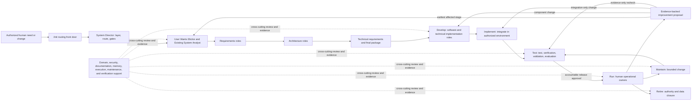
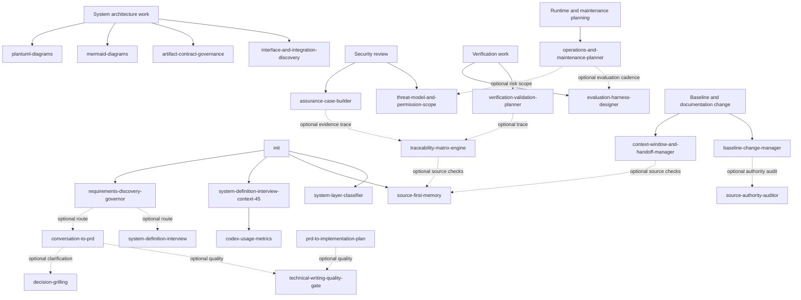
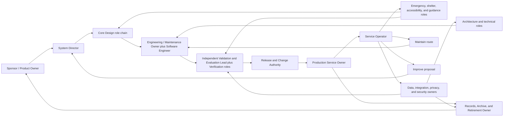

# Sys4AI Role Lifecycles, Project Phases, and Skills

- **Status:** Controlled explanatory guide
- **Scope:** Sys4AI framework roles, the Sys4AI-dev runtime skill surface, and their application to an illustrative target-system project
- **Evidence snapshot:** 2026-07-15
- **Authority boundary:** This guide explains registered authority; it does not replace or expand it.

> The operative role definitions remain in
> [`role_registry.csv`](../Sys4AI/registries/role_registry.csv), the operative
> role-to-skill conditions remain in
> [`role_skill_crosswalk.csv`](../Sys4AI/registries/role_skill_crosswalk.csv), and
> executable role constraints remain in
> [`role_execution_binding_registry.csv`](../Sys4AI/registries/role_execution_binding_registry.csv).
> Skill lifecycle and runtime status remain in
> [`skill_registry.csv`](../Sys4AI/registries/skill_registry.csv),
> [`skill_lifecycle_status_registry.csv`](../Sys4AI/registries/skill_lifecycle_status_registry.csv),
> and the development-runtime
> [`SKILL_REGISTRY.yaml`](../.agents/skill_registry/SKILL_REGISTRY.yaml).
> The accepted target lifecycle remains in the
> [Phase 0 Product and System-Design PRD](../PRDs/Sys4AI_phase-0_product_system_design_prd.md).

## 1. Executive answer

Sys4AI connects phases, roles, skills, artifacts, and authority in a governed
chain:

1. A human-authorized need or change identifies the **system of interest** and
   the **system layer** being changed.
2. The target system's current **lifecycle stage** determines which work and
   evidence are needed.
3. A controlled **role** is selected for a mission and artifact class. A role
   is a responsibility and authority boundary, not necessarily a person or a
   permanently running agent.
4. A governed **role-to-skill binding** identifies which skill is required,
   optional, or recommended under a stated condition and system-layer scope.
5. A skill supplies a reusable procedure. It does not grant authority, create
   a role, approve its own output, or prove that a lifecycle gate passed.
6. Where execution is allowed, the role's **execution binding** and the active
   transaction permission envelope constrain reads, writes, validators,
   forbidden actions, evidence, and expiry.
7. The role produces an artifact or evidence package for a named consumer.
8. Reviewers and accountable humans evaluate the relevant gate. A failed gate
   returns work to the earliest affected stage; it is not hidden as progress.

The current registered inventories are:

- **31 roles:** 29 `controlled`, one `superseded`, and one `deprecated`.
- **32 product skill packages:** 31 `adapter_shell` rows and one
  `product_scaffold_reference` row in the framework-product registry.
- **32 active development-runtime skills:** adapted implementations under
  `.agents/skills` for the Sys4AI-dev development system.
- **45 role-to-skill crosswalk rows:** 32 required, 12 optional, and one
  recommended; 43 are controlled and two belong to a superseded role.
- **20 role execution bindings:** 18 controlled, one superseded, and one
  deprecated.
- **15 illustrative HarborLight project roles:** target-project responsibilities
  used to show accountable human, domain, operational, and lifecycle ownership.
  They are not registered Sys4AI core roles or active target-runtime bindings.

Those counts must not be read as "31 people are always active" or "32 target
skills are automatically installed." Role activation is conditional, and the
development runtime is not the same layer as a generated target system.

## 2. The concepts that must remain separate

| Concept | What it means | What it does not mean |
|---|---|---|
| Program phase | A phase in development of Sys4AI itself, such as Phase 0 Product/System Design or Phase 1 Implementation Initialization. | A target system's current operating stage. |
| Target lifecycle stage | One of `Design`, `Develop`, `Implement`, `Test`, `Run`, `Maintain`, `Improve`, or `Retire`. | A calendar milestone, repository branch, or proof of operational maturity. |
| Operational maturity | Independent evidence state such as `concept`, `prototype`, `validated_prototype`, `production_candidate`, `production_approved`, `operational`, `maintenance`, or `retired`. | A lifecycle stage or coordination pattern. |
| System layer | The authority surface: development system, framework product, target template, target instance, or derivative. | Permission to mutate that surface. |
| Role | A controlled mission, artifact scope, authority limit, skill declaration, and validation obligation. | A specific model identity, employee title, automatic agent instance, or permission grant. |
| Skill | A reusable procedure with activation conditions, dependencies, outputs, limits, and validation. | A role, an approver, an execution transaction, or evidence that the procedure succeeded. |
| Runtime posture | A role posture declared by a skill manifest so the skill can be operated in the active host runtime. | A substitute for the more specific role-to-skill crosswalk. |
| Execution binding | The transaction types, reads, writes, forbidden actions, validators, evidence, and expiry associated with a role. | Standing authority to execute whenever the role name appears. |
| Artifact | A controlled or derivative work product passed between producers and consumers. | Completion merely because the file exists. |
| Gate | A decision based on defined evidence, reviewers, authority, and exit criteria. | A validator pass alone or an implicit model judgment. |

### 2.1 Five system layers

| Layer | Meaning in this guide | Role and skill consequence |
|---|---|---|
| `development_system` | The Sys4AI-dev workspace, its `.agents` runtime, control records, plans, and development tooling. | The active 32-skill runtime exists here. Development-only and legacy roles may appear here. |
| `framework_product` | The governed Sys4AI product, including reference implementation, registries, validators, templates, and product skill packages. | Product skill packages are reference or adapter surfaces; their presence does not make them active target-runtime skills. |
| `target_system_template` | Reusable scaffold material intended for a future generated system. | A template may express intended bindings but has no target-instance authority by itself. |
| `target_system_instance` | A concrete system created for a particular user, organization, or use case. | Only roles whose registered scope includes this layer may be assumed available; skills must be adapted, validated, and registered for the target runtime. |
| `derivative_surface` | Generated documentation, reader pages, mirrors, caches, and similar navigation aids. | It is noncanonical by default and cannot authorize role, skill, requirement, or lifecycle changes. |

### 2.2 Three different meanings of "phase"

The user's three-phase mental model is useful, but it must be translated into
the accepted eight-stage lifecycle and kept separate from Sys4AI's own product
program phases.

| Informal phase | What it includes in the target lifecycle | Related Sys4AI program work | Important boundary |
|---|---|---|---|
| Initiation | The `/init` front door plus the `Design` stage: discovery, requirements, architecture, planning, risk, evidence design, and readiness. | Phase 0 defines the product and system-design baseline. Phase 1 initializes Sys4AI's implementation repository and controls. | `/init` is a routing skill, not a lifecycle stage, scaffold generator, or team creator. |
| Implementation | `Develop -> Implement -> Test`, followed by an explicitly approved transition to `Run`. | Phase 1 initialization and later walking-skeleton work create framework implementation surfaces. | "Implement" is only one lifecycle stage; code existence does not prove Test, release approval, Run, or production maturity. |
| Maintenance and improvement | `Run -> Maintain -> Test -> Run` for bounded maintenance; `Improve` routes to the earliest affected stage; `Retire` closes authority, data, dependencies, and evidence. | Later product work may improve Sys4AI itself under separate transactions. | Improvement is a controlled re-entry loop, not a direct mutation of the running system. Maintenance planning is not maintenance execution or operational authority. |

## 3. The accepted target-system lifecycle

The canonical normal path is:

```text
Design -> Develop -> Implement -> Test -> Run -> Maintain -> Improve -> Retire
```

It is not one-way. `Maintain` normally returns through `Test` before `Run`.
`Improve` returns to `Design`, `Develop`, `Implement`, or `Test` according to
impact. Failed gates return to the stage that owns the defect. An approved
retirement may begin from an active production stage.

| Stage | Purpose | Principal registered roles | Cross-cutting roles | Typical outputs and evidence | Primary gate |
|---|---|---|---|---|---|
| Design | Convert an authorized need into coherent, traceable, implementation-ready intent, requirements, architecture, risk controls, and evidence plans. | System Director; User Wants Elicitor; Existing System Analyst when brownfield; Requirements Manager; System Architect; Technical Requirements Engineer; Reconciliation Analyst; Reconciled Architecture Architect; Final System Requirements Packager. | Requirements Verifier; Domain Specialist; Security/Safety/Privacy/Compliance Reviewer; Context/Memory/Knowledge Architect; Bounded Execution Planner; SVC/Documentation Surface Architect; Runtime and Maintenance Planner. | RDR, ESAR, USRD, SRD, ARD, TRP, RSRD, RARD, SRP, risk records, V&V basis, operations obligations, design-readiness report. | Design readiness approved by an accountable sponsor or product owner. |
| Develop | Create reviewed components, code, prompts, skills, tools, configuration, tests, documentation, and build artifacts from the accepted design. | Software Engineer; System Engineer compatibility posture; relevant architects and technical engineers. | Security reviewer; Requirements Verifier; Verification Engineer; SVC architect; memory architect; bounded planner. | Source changes, component tests, provenance, dependency evidence, configurations, known limitations, updated trace. | Development completeness. |
| Implement | Assemble, configure, provision, integrate, migrate, package, and deploy to an authorized test or staging environment. | Software Engineer and separately authorized implementation/integration owners. | System Architect; System Engineer; Security reviewer; Verification Engineer; SVC architect; bounded planner. | Integrated candidate, reproducible package, environment/configuration baseline, migration and rollback evidence. | Implementation verification and readiness for controlled testing. |
| Test | Keep test execution, requirements verification, stakeholder/system validation, and behavioral/performance evaluation separately labeled. | Verification Engineer; Requirements Verifier; applicable Domain Specialist and Security reviewer. | Software Engineer for defect repair; System Director and accountable human release authority for routing and approval. | Reproducible test results, verification matrix, validation evidence, evaluation results, defect/risk updates, release recommendation. | Release recommendation and accountable approval. |
| Run | Operate within approved service, risk, permission, evidence, monitoring, support, and rollback bounds. | The lifecycle contract names human operators, product owners, security/data/incident owners, and a production owner; these are not all dedicated registered Sys4AI roles. | Runtime and Maintenance Planner defines the plan; Security reviewer, Verification Engineer, Domain Specialist, memory architect, and SVC architect are triggered by evidence and change. | Operational service, telemetry, audit/incident records, feedback, service evidence, rollback readiness, change proposals. | Operational acceptance and continuing review. |
| Maintain | Patch, update, repair, rotate, migrate, reconcile drift, refresh evidence, and run affected regression/recovery checks. | The lifecycle contract names maintainers and operators; Software Engineer performs authorized code/configuration changes; Runtime and Maintenance Planner defines obligations. | Verification Engineer; Requirements Verifier; architects; security/data owners; SVC architect; bounded planner. | Maintenance candidate, change/impact record, updated dependencies/configuration/docs/trace, regression and rollback evidence. | Regression and maintenance-release approval, then Test before Run. |
| Improve | Analyze an evidence-backed proposal, decide its disposition, update candidate baselines, and route work to the earliest affected lifecycle stage. | System Director routes authority; requirements and architecture roles own affected baselines; Software Engineer implements only after downstream authorization. | Runtime and Maintenance Planner; Verification Engineer; Requirements Verifier; Security reviewer; Domain Specialist; SVC architect; accountable human approvers. | Approved, rejected, or deferred decision; impact map; candidate requirements/architecture/plan; evaluation and rollback obligations. | Improvement/change approval plus explicit downstream routing. |
| Retire | Withdraw service and authority safely; dispose of or transfer data; revoke credentials; close dependencies; archive evidence; notify stakeholders. | The lifecycle contract names product, operations, data, security, privacy, compliance, dependency, archive, and stakeholder owners. | Runtime and Maintenance Planner plans obligations; Security reviewer, SVC architect, Verification Engineer, and accountable human retirement authority provide evidence and review. | Retirement decision and record, shutdown/revocation evidence, data disposition, archive, dependency closure, notifications, residual-obligation register. | Retirement acceptance. |

### 3.1 Lifecycle responsibility flow



## 4. How a role is selected and used

A role should be activated only after the following checks:

1. **Subject layer:** Determine whether work concerns Sys4AI-dev, the framework
   product, a target template, a target instance, or a derivative.
2. **Lifecycle stage and gate:** Identify the current stage, required inputs,
   blocked conditions, expected evidence, and approving authority.
3. **Role status:** Prefer controlled current roles. A superseded role is for
   historical interpretation; a deprecated role has no current execution
   authority.
4. **Layer scope:** Confirm the role's `system_layer_scope` includes the subject.
5. **Mission and artifact class:** Confirm the requested work matches the role's
   mission and allowed artifact classes.
6. **Skill declaration:** Read the role's required and optional skill fields.
7. **Crosswalk condition:** If a crosswalk row exists, enforce its binding type,
   `required_when`, layer scope, invocation policy, and status.
8. **Runtime status:** Confirm the skill is active in the runtime that will
   execute it. A product scaffold copy cannot be treated as an active target
   runtime.
9. **Execution binding:** If the role will perform controlled writes, confirm an
   applicable binding, transaction type, allowed paths, forbidden actions,
   validators, evidence, and expiry. Absence of a binding is not permission.
10. **Human authority:** Confirm any decision, permission expansion, risk
    acceptance, production promotion, or material lifecycle transition has the
    required accountable human authorization.
11. **Handoff:** Name the producer, artifact, consumer, open issues, source trace,
    validator result, and next gate.
12. **Stop or return:** Stop when evidence or authority is missing; return work to
    the earliest affected stage instead of inventing a role or silently widening
    scope.

### 4.1 The lifecycle of a role definition and a role assignment

The target system has the eight-stage lifecycle in Section 3. A role has a
different lifecycle. Two related sequences must be kept separate:

- A **role-definition authority lifecycle** describes whether a role definition
  is current authority. The only current registry values are `controlled`,
  `superseded`, and `deprecated`.
- A **role-assignment lifecycle** describes when a current role is selected,
  bound to an actor and scope, activated, handed off, and released for one
  project or transaction.

The assignment steps below are an explanatory operating model. They are not a
new controlled status vocabulary, and this repository has no dedicated
role-assignment registry at this snapshot.

| Step | Trigger and question | Required relationship and evidence | Exit or return behavior |
|---:|---|---|---|
| 1. Need | A lifecycle stage, artifact, gate, risk, or operational obligation needs an owner. Is an existing controlled role sufficient? | System Director, project owner, or affected artifact owner identifies the mission, layer, and required separation of duties. | Use an existing role when possible. A genuine core-role gap goes to role-catalog governance; a project/domain gap goes to a project or domain pack. |
| 2. Definition | The mission must be made explicit. What may the role produce, review, decide, and never do? | Definition includes mission, artifact classes, authority limits, required validation, skill relationships, and accountable owner. | An incomplete or overlapping definition remains candidate material and grants no authority. |
| 3. Authority status | Is the definition controlled core authority, a project-specific role, or historical only? | Core roles resolve through `role_registry.csv`. Project roles resolve through target-project authority. Superseded and deprecated rows remain historical only. | Do not promote a fictional or project role into the core catalog by usage or analogy. |
| 4. Assignment | Who or what will perform the role, for which layer, stage, artifact, and time window? | Name the actor, project, layer, lifecycle trigger, source authority, conflicts, expiry, and accountable human. | No assignment exists when actor, scope, or authority is missing. A role name alone is not an assignment. |
| 5. Activation | Have the stage entry conditions, crosswalk conditions, dependencies, runtime status, and permissions been met? | Apply required/optional skill bindings, execution binding, transaction envelope, and human gate. | Fail closed or select a narrower role when a skill, permission, independence condition, or source is missing. |
| 6. Performance | The role performs its bounded mission. | Skills supply procedures; sources supply facts; the execution envelope supplies permission. The role produces traceable artifacts and evidence for named consumers. | A skill cannot widen the role, approve its output, or substitute for missing domain evidence. |
| 7. Review and handoff | The artifact or evidence reaches its validator, reviewer, consumer, and gate. | Record producer, version, source trace, checks, unresolved issues, acceptance authority, and next owner. | Failed evidence returns to the earliest affected producer or stage; it is not hidden by completing the role assignment. |
| 8. Release | The assignment's output is accepted, blocked, cancelled, or handed off. | Revoke temporary access, close or preserve the transaction, retain evidence, and identify ongoing owners. | The assignment becomes inactive; the controlled role definition remains available for later valid use. |
| 9. Re-entry or retirement | A change, incident, review, improvement, or retirement obligation triggers the responsibility again. | Reactivate the role only after rechecking layer, status, scope, skill/runtime availability, conflicts, and authority. | A replaced definition is superseded; an unsafe or obsolete definition may be deprecated. Historical rows never regain current authority automatically. |

The registered roles follow five recurring assignment patterns:

| Pattern | Roles | Typical activation-to-release lifecycle |
|---|---|---|
| Lifecycle orchestration | System Director; Bounded Execution Planner; SVC and Documentation Surface Architect; Runtime and Maintenance Planner | Activate at project or change entry, remain available across gates, hand off bounded work and evidence, and release only when continuing ownership is transferred or the system is retired. |
| Design producer chain | User Wants Elicitor; Existing System Analyst when brownfield; Requirements Manager; System Architect; Technical Requirements Engineer; Reconciliation Analyst; Reconciled Architecture Architect; Final Packager | Activate when their required upstream artifact exists, produce one owned baseline or reconciliation artifact, hand it to named consumers, then reactivate when review or improvement changes that baseline. |
| Triggered review and support | Requirements Verifier; Domain Specialist; Security/Safety/Privacy/Compliance Reviewer; Verification Engineer; Context/Memory/Knowledge Architect | Activate when a risk, domain, evidence, retrieval, or gate condition applies; issue findings or evidence; release after disposition; reactivate for material changes and regression. |
| Implementation | Implementation Initialization Agent at the framework layer; Software Engineer and the System Engineer compatibility posture where authorized | Activate only after accepted design and a bounded execution scope, create or integrate implementation evidence, hand off to independent verification, and return for defects or maintenance. |
| Compatibility and historical | Generic System Analyst/System Engineer postures; seven temporary legacy roles; superseded Control Loop Planner; deprecated Control Loop Engineer | Compatibility postures activate only where a current manifest or binding requires them. Temporary roles expire with their evidence family. Superseded or deprecated roles are never activated for new work. |

### 4.2 What `/init` actually does

`/init` is the adoption and discovery front door. It classifies greenfield,
brownfield, partially built, or documentation-recovery work; identifies the
system of interest, layer, and lifecycle intent; inspects available evidence;
asks only for unrecoverable information; preserves candidate requirements; and
asks for approval before controlled artifact creation.

Its active runtime manifest declares these required role postures:

- System Analyst
- System Engineer
- Software Engineer
- System Developer / User Wants Elicitor

It declares these optional postures:

- Requirements Manager
- System Director
- Documentation Librarian
- Bounded Execution Planner

The more specific controlled crosswalk binds `init` to:

- User Wants Elicitor for new system definition or adoption start.
- Existing System Analyst for the first read-only brownfield pass.
- System Director for layer, route, and approval-gate classification.

These declarations are complementary. The manifest says which postures can
operate the skill in the development runtime; the crosswalk says which
controlled project roles own specific entry routes. `/init` does not
instantiate every posture, authorize writes, generate a scaffold, or certify
that discovery is complete.

## 5. What "core role" means

The repository uses two related classifications that should not be conflated.

### 5.1 Phase 0 PRD core pipeline roles

The Phase 0 prose identifies nine core roles in the System Design pipeline:

1. System Director
2. System Developer / User Wants Elicitor
3. Existing System Analyst
4. System Manager / Requirements Manager
5. System Architect
6. System Engineer / Technical Requirements Engineer
7. System Analyst / Reconciliation Analyst
8. Reconciled Architecture Architect
9. Final System Requirements Packager

### 5.2 Registry class `system_design_core`

The role registry classifies these nine rows as `system_design_core`:

- User Wants Elicitor
- Requirements Manager
- System Architect
- Technical Requirements Engineer
- Reconciliation Analyst
- Reconciled Architecture Architect
- Final System Requirements Packager
- System Engineer compatibility posture
- System Analyst compatibility posture

The difference is intentional enough to preserve in this guide: the System
Director is classified as `framework_governance`, and the Existing System
Analyst as `system_design_support`; meanwhile generic System Engineer and System
Analyst rows exist as compatibility postures used by current skill manifests.
Therefore, "core" in a discussion may mean a pipeline participant or a registry
class. Always state which meaning is intended.

### 5.3 Support and eventual roles

"Eventual role" is not a controlled registry term. The useful controlled
distinctions are:

- **Always-needed pipeline roles:** selected for the standard Design artifact
  chain.
- **Conditional support roles:** activated by brownfield state, domain
  complexity, risk, long-running work, memory, documentation, or operational
  needs.
- **Cross-lifecycle roles:** governance, verification, security, change, and
  maintenance roles that recur at gates.
- **Implementation roles:** roles that create or initialize code and related
  artifacts under explicit authority.
- **Compatibility roles:** generic or temporary roles retained because active
  manifests or historical evidence still refer to them.
- **Superseded or deprecated roles:** retained only so prior evidence remains
  interpretable; they should not be selected for new execution.

## 6. Complete registered role inventory

### 6.1 Audit matrix for all 31 roles

The lifecycle touchpoints below are an explanatory mapping derived from the
registered mission, layer scope, and canonical lifecycle contracts. They do not
add role authority.

| # | Role | Registry class / status | Layer scope | Principal lifecycle relationship | Declared skills in role row | Crosswalk / execution note |
|---:|---|---|---|---|---|---|
| 1 | System Director (`system_director`) | `framework_governance` / controlled | Development, framework, template, target | All stages; primary routing and gate orchestration | Required: `director-decision-governor`, `system-layer-classifier`; optional: `source-first-memory` | Crosswalk also requires `role-catalog-governance` and `init`, optionally routes `domain-pack-router`; controlled execution binding exists. |
| 2 | User Wants Elicitor (`user_wants_elicitor`) | `system_design_core` / controlled | Framework, template, target | Design and Improve re-entry | Required: `system-definition-interview-context-45`; optional: `conversation-to-prd`, `decision-grilling-context-45` | Crosswalk adds optional base interview and discovery governor plus required `init`; controlled discovery binding exists. |
| 3 | Existing System Analyst (`existing_system_analyst`) | `system_design_support` / controlled | Target only | Brownfield Design; Maintain/Improve current-state reassessment | Required: `domain-grilling-with-docs`; optional: `source-first-memory` | Crosswalk requires domain grilling and `init`; no explicit execution-binding row. |
| 4 | Requirements Manager (`requirements_manager`) | `system_design_core` / controlled | Framework, template, target | Design; affected Maintain/Improve requirements re-entry | Required: `conversation-to-prd`, `technical-writing-quality-gate`; optional: `decision-grilling`, `traceability-matrix-engine` | Crosswalk covers synthesis, writing, traceability, discovery governor; no explicit execution-binding row. |
| 5 | System Architect (`system_architect`) | `system_design_core` / controlled | Framework, template, target | Design; architecture review in Develop/Implement; affected Maintain/Improve/Retire | Required: `decision-grilling`, `mermaid-diagrams`, `plantuml-diagrams`; optional: `artifact-contract-governance`, `interface-and-integration-discovery` | Crosswalk covers all five; no explicit execution-binding row. |
| 6 | Technical Requirements Engineer (`technical_requirements_engineer`) | `system_design_core` / controlled | Framework, template, target | Design handoff to Develop/Implement; affected change re-entry | Required: `prd-to-implementation-plan`, `verification-validation-planner` | Both have required crosswalk rows; no explicit execution-binding row. |
| 7 | Reconciliation Analyst (`reconciliation_analyst`) | `system_design_core` / controlled | Framework, template, target | Design and Improve re-entry | Required: `decision-grilling`; optional: `traceability-matrix-engine` | Skills are declared in the role row; no crosswalk or execution-binding row. |
| 8 | Reconciled Architecture Architect (`reconciled_architecture_architect`) | `system_design_core` / controlled | Framework, template, target | Late Design and affected Improve re-entry | Required: `mermaid-diagrams`, `decision-grilling`; optional: `artifact-contract-governance` | Skills are declared in the role row; no crosswalk or execution-binding row. |
| 9 | Final System Requirements Packager (`final_system_requirements_packager`) | `system_design_core` / controlled | Framework, template, target | Design exit and re-baselined Improve handoff | Required: `prd-to-implementation-plan`, `technical-writing-quality-gate`; optional: `traceability-matrix-engine` | Skills are declared in the role row; no crosswalk or execution-binding row. |
| 10 | Requirements Verifier (`requirements_verifier`) | `verification` / controlled | Framework, template, target | Design gates, Test, maintenance regression, improvement review | Required: `technical-writing-quality-gate`, `traceability-matrix-engine`; optional: `verification-validation-planner` | Crosswalk covers all three; no explicit execution-binding row. |
| 11 | Domain Specialist (`domain_specialist`) | `system_design_support` / controlled | Target only | Conditional Design, Test, Run review, Improve, Retire | Required: `domain-grilling-with-docs`; optional: `technical-writing-quality-gate` | Crosswalk recommends context-45 domain grilling and optionally routes `domain-pack-router`; no explicit execution binding. |
| 12 | Security Safety Privacy and Compliance Reviewer (`security_safety_privacy_compliance_reviewer`) | `verification` / controlled | Framework, template, target | Cross-cutting across all stages | Required: `threat-model-and-permission-scope`, `assurance-case-builder`; optional: `verification-validation-planner` | Required crosswalk rows and a controlled safety/permission/assurance execution binding exist. |
| 13 | Documentation Librarian / Configuration Controller (`documentation_librarian`) | `framework_governance` / controlled | Development and framework only | Cross-cutting for Sys4AI sources and derivatives, not a target-instance curator | Required: `source-authority-auditor`, `skill-import-generalizer`; optional: `technical-writing-quality-gate` | Crosswalk also requires `project-ontology-and-glossary`; controlled configuration/skill-reconciliation binding exists. |
| 14 | Runtime and Maintenance Planner (`runtime_maintenance_planner`) | `maintenance` / controlled | Framework, template, target | Design operability, Test readiness, Run, Maintain, Improve, Retire | Required: `operations-and-maintenance-planner`; optional: `evaluation-harness-designer` | Crosswalk covers both; controlled planning/readiness binding exists but grants no operational authority. |
| 15 | Bounded Execution Planner (`bounded_execution_planner`) | `runtime_control` / controlled | Development, framework, template, target | Cross-lifecycle work packets, checkpoints, handoffs, cancellation, escalation | Required: `context-window-and-handoff-manager`, `baseline-change-manager`; optional: `director-decision-governor` | Crosswalk requires context/handoff and metrics; controlled bounded-execution binding exists. |
| 16 | Context Memory and Knowledge Architect (`context_memory_knowledge_architect`) | `system_design_support` / controlled | Development, framework, template, target | Design through Retire wherever memory/retrieval exists | Required: `source-first-memory`, `source-authority-auditor`; optional: `artifact-contract-governance` | Required crosswalk rows exist; no explicit execution-binding row. |
| 17 | SVC and Documentation Surface Architect (`svc_documentation_surface_architect`) | `system_design_support` / controlled | Framework, template, target | Cross-lifecycle source, derivative, baseline, rollback, supersession | Required: `source-authority-auditor`, `baseline-change-manager`; optional: `technical-writing-quality-gate` | Crosswalk explicitly requires baseline management; controlled baseline/rollback/supersession binding exists. |
| 18 | Implementation Initialization Agent (`implementation_initialization_agent`) | `implementation` / controlled | Development and framework only | Sys4AI program Phase 1; framework-side Develop/Implement preparation | Required: `prd-to-implementation-plan`; optional: `source-first-memory` | No crosswalk row; controlled implementation-initialization binding exists; target-instance scope is absent. |
| 19 | Verification Engineer (`verification_engineer`) | `verification` / controlled | Development, framework, template, target | Design evidence planning; Test primary; Maintain/Improve regression and holdouts | Required: `verification-validation-planner`, `technical-writing-quality-gate`, `evaluation-harness-designer` | Required crosswalk rows for V&V and evaluation; controlled independent-verification binding exists. |
| 20 | Software Engineer (`software_engineer`) | `implementation` / controlled | Development, framework, template, target | Develop and Implement; defect repair in Test; authorized Maintain/Improve changes | Required: `prd-to-implementation-plan`; optional: `source-first-memory` | No crosswalk row; controlled implementation binding exists. |
| 21 | System Engineer (`system_engineer`) | `system_design_core` / controlled | Development, framework, template, target | Compatibility posture spanning Design, Develop, and Implement | Required: `prd-to-implementation-plan`, `technical-writing-quality-gate`; optional: `decision-grilling` | No crosswalk row; controlled PRD-integration/trace binding exists. |
| 22 | System Analyst (`system_analyst`) | `system_design_core` / controlled | Development, framework, template, target | Compatibility posture for analysis, Design, and Improve re-entry | Required: `decision-grilling`, `source-first-memory`; optional: `conversation-to-prd` | No crosswalk or execution-binding row. |
| 23 | Control Loop Planner (exact retained identifier remains in the role registry) | `runtime_control` / superseded | Development, framework, template, target | Historical continuation evidence only; no current phase execution | Required: `context-window-and-handoff-manager`; optional: `director-decision-governor` | Metrics and handoff crosswalk rows are superseded; read-only historical execution binding is superseded by Bounded Execution Planner. |
| 24 | Control Loop Engineer (exact retained identifier remains in the role registry) | `temporary_legacy_role` / deprecated | Development and framework only | Historical self-hosting control evidence only | Required: `source-first-memory`; optional: `codex-usage-metrics` | No crosswalk; deprecated read-only execution binding; no current execution authority. |
| 25 | Validator Engineer (`validator_engineer`) | `temporary_legacy_role` / controlled | Development and framework only | Legacy development validation evidence | Required: `technical-writing-quality-gate`, `verification-validation-planner`; optional: `source-first-memory` | No crosswalk; temporary execution binding expires with legacy control records. |
| 26 | Derivative Generator Engineer (`derivative_generator_engineer`) | `temporary_legacy_role` / controlled | Development and framework only | Legacy generated-reader maintenance | Required: `source-authority-auditor`, `technical-writing-quality-gate` | No crosswalk; temporary binding forbids treating generated derivatives as canonical. |
| 27 | Skill Surface Engineer (`skill_surface_engineer`) | `temporary_legacy_role` / controlled | Development and framework only | Legacy runtime/scaffold skill-surface maintenance | Required: `skill-import-generalizer`, `technical-writing-quality-gate`; optional: `source-first-memory` | No crosswalk; temporary binding expires with the legacy evidence family. |
| 28 | Acceptance Engineer (`acceptance_engineer`) | `temporary_legacy_role` / controlled | Development and framework only | Legacy acceptance evidence | Required: `verification-validation-planner`, `technical-writing-quality-gate`; optional: `source-first-memory` | No crosswalk; temporary binding forbids acceptance without aggregate validation. |
| 29 | Skill Dependency Adaptation Agent (`skill_dependency_adaptation_agent`) | `temporary_legacy_role` / controlled | Development and framework only | Legacy skill-dependency adaptation | Required: `skill-import-generalizer`, `codex-usage-metrics`; optional: `technical-writing-quality-gate` | No crosswalk; temporary binding forbids activation of unreviewed dependencies. |
| 30 | Skill Integration Agent (`skill_integration_agent`) | `temporary_legacy_role` / controlled | Development and framework only | Legacy skill integration | Required: `skill-import-generalizer`, `source-first-memory`; optional: `technical-writing-quality-gate` | No crosswalk; temporary binding forbids dropping provenance. |
| 31 | System Definition Template Agent (`system_definition_template_agent`) | `temporary_legacy_role` / controlled | Development and framework only | Legacy discovery-template maintenance | Required: `system-definition-interview`, `technical-writing-quality-gate`; optional: `conversation-to-prd` | No crosswalk; temporary binding forbids promoting candidate requirements to a PRD. |

### 6.2 Recurring fictional project: HarborLight

The rest of this guide uses **HarborLight**, a fictional county emergency-shelter
coordination assistant. HarborLight must help authorized staff locate shelter
capacity, match accessibility and medical-support needs, summarize verified
public guidance, and route cases to human coordinators. It replaces parts of a
brownfield call-center and spreadsheet workflow, integrates with shelter and
alert systems, handles sensitive personal data, uses retrieval and tool calls,
must remain available during emergencies, and requires human decision authority.

This example is intentionally rich enough to trigger nearly every current
target-capable role. It does not make HarborLight a real approved system, supply
domain truth, define production permissions, or fill gaps in the role registry.
Development-only, superseded, deprecated, and legacy roles are shown in their
proper side lanes rather than being artificially assigned to the target team.

### 6.3 Governance and design-entry roles

#### 6.3.1 System Director

- **Lifecycle relation:** Opens and orchestrates Design, routes every material
  gate, and returns improvement or failed evidence to the correct earlier stage.
  It remains relevant through retirement because lifecycle transitions require
  controlled ownership and handoffs.
- **Work:** Maintains the run manifest, artifact registry, traceability ledger,
  open-issues register, readiness reports, Director decisions, and handoffs.
- **Skill relation:** The role row requires `director-decision-governor` and
  `system-layer-classifier`; the crosswalk additionally requires
  `role-catalog-governance` when role authority changes and `init` at adoption
  entry. `domain-pack-router` is conditional, and `source-first-memory` is
  optional navigation.
- **Handoff relation:** Receives the sponsor's authorized need; routes discovery
  to the User Wants Elicitor and Existing System Analyst; orchestrates the
  requirements and architecture chain; presents readiness evidence to the
  accountable human; and routes accepted work to the next stage.
- **HarborLight:** Classifies HarborLight as a `target_system_instance`, records
  that Sys4AI-dev is only the development/runtime host, declares the Design
  gate, and refuses production claims or permissions during discovery.
- **Authority limit:** A Director role cannot act beyond explicit project
  authority, self-grant permissions, treat a derivative as source, or replace
  the accountable human at material approval gates.

#### 6.3.2 System Developer / User Wants Elicitor

- **Lifecycle relation:** Owns the discovery front of Design and returns when an
  improvement changes stakeholder intent, purpose, scenarios, constraints, or
  acceptance expectations.
- **Work:** Produces the Requirements Discovery Record (RDR) and User System
  Requirements Document (USRD) from evidence and structured stakeholder input.
- **Skill relation:** `system-definition-interview-context-45` is the default
  required discovery skill. `system-definition-interview` is the shorter
  optional route. `decision-grilling-context-45`, `conversation-to-prd`, and
  `requirements-discovery-governor` apply under their stated conditions.
- **Handoff relation:** Receives the classified route and source evidence;
  consumes an ESAR when brownfield analysis is relevant; sends the RDR and USRD
  to the Requirements Manager, Reconciliation Analyst, and System Director.
- **HarborLight:** Elicits who may use the assistant, which decisions must remain
  human, accessibility and language needs, emergency degraded-mode behavior,
  unacceptable failure modes, and measurable acceptance expectations.
- **Authority limit:** Candidate requirements remain candidates. The discovery
  binding forbids automatic PRD creation or promotion without explicit approval.

#### 6.3.3 Existing System Analyst

- **Lifecycle relation:** A conditional Design role for brownfield work and a
  conditional Maintain/Improve role when current-state drift or integration
  behavior must be reassessed.
- **Work:** Produces an Existing System Analysis Report (ESAR) covering current
  components, interfaces, data, constraints, operating practices, risks, and
  evidence gaps.
- **Skill relation:** `domain-grilling-with-docs` is required. `init` is required
  for the first read-only brownfield route. `source-first-memory` is optional in
  the role row.
- **Handoff relation:** Supplies current-state facts to the Elicitor,
  Requirements Manager, System Architect, security reviewer, and integration
  discovery work.
- **HarborLight:** Inspects the call-center procedures, shelter spreadsheets,
  alert feeds, identity systems, data retention practices, and undocumented
  manual workarounds before anyone proposes a mutation.
- **Authority limit:** The role is scoped only to target instances and has no
  explicit execution-binding row. Analysis does not authorize repository,
  infrastructure, or production changes.

### 6.4 Requirements and architecture pipeline roles

#### 6.4.1 System Manager / Requirements Manager

- **Lifecycle relation:** Owns requirements normalization in Design and returns
  whenever maintenance or improvement changes a system obligation.
- **Work:** Converts the USRD and relevant ESAR evidence into an atomic,
  classified, testable System Requirements Document (SRD).
- **Skill relation:** `conversation-to-prd` and
  `technical-writing-quality-gate` are required. `traceability-matrix-engine`,
  `decision-grilling`, and `requirements-discovery-governor` are conditional
  supports.
- **Handoff relation:** Receives user wants and current-state constraints;
  provides the SRD to the System Architect, Technical Requirements Engineer,
  Requirements Verifier, and assurance reviewers.
- **HarborLight:** Converts "help find a suitable shelter" into bounded system
  obligations for data freshness, accessibility, human escalation, response
  time, privacy, outage behavior, and evidence provenance.
- **Authority limit:** The role has no explicit execution-binding row. It cannot
  decide architecture, silently invent thresholds, or promote unapproved user
  wants into canonical requirements.

#### 6.4.2 System Architect

- **Lifecycle relation:** Primary in Design; consulted in Develop and Implement;
  returns for material maintenance, improvement, integration, boundary, or
  retirement changes.
- **Work:** Produces the Architecture Requirements Document (ARD), architecture
  drivers and significant requirements, views, mechanisms, interfaces,
  coordination-pattern and maturity proposals, ADRs, and evaluation basis.
- **Skill relation:** Required bindings cover `decision-grilling`,
  `mermaid-diagrams`, and `plantuml-diagrams`. `artifact-contract-governance`
  and `interface-and-integration-discovery` are optional when those concerns
  exist.
- **Handoff relation:** Consumes the SRD and ESAR; sends architecture and
  interface obligations to the Technical Requirements Engineer, security
  reviewer, memory architect, SVC architect, and Verification Engineer.
- **HarborLight:** Chooses a human-supervised coordination design, isolates
  sensitive case data from public knowledge retrieval, defines tool and trust
  boundaries, and specifies degraded operation when external feeds are stale.
- **Authority limit:** The role has no explicit execution binding. Architecture
  choice does not grant production maturity, integration credentials, or
  permission to implement.

#### 6.4.3 System Engineer / Technical Requirements Engineer

- **Lifecycle relation:** Closes the buildability part of Design and supplies the
  controlled handoff to Develop and Implement; returns for affected changes.
- **Work:** Produces the Technical Requirements Package (TRP), allocation,
  interface detail, implementation constraints, and verification matrices.
- **Skill relation:** `prd-to-implementation-plan` and
  `verification-validation-planner` are required by both the role row and the
  crosswalk.
- **Handoff relation:** Consumes the SRD, ARD, and optional memory, execution,
  and source-control architecture records; sends the TRP to the Reconciliation
  Analyst, Requirements Verifier, Software Engineer, and Verification Engineer.
- **HarborLight:** Allocates freshness checks to adapters, sensitive-data rules
  to storage and tool boundaries, human escalation to workflow controls, and
  each requirement to a specific verification method.
- **Authority limit:** No explicit execution-binding row exists. A buildable
  plan is not authorization to write code or provision an environment.

#### 6.4.4 System Analyst / Reconciliation Analyst

- **Lifecycle relation:** Operates late in Design and whenever an improvement
  creates conflict between stakeholder intent and technical obligations.
- **Work:** Produces the Reconciled System Requirements Document (RSRD) and a
  decision record for overbuild, underbuild, contradiction, and tradeoffs.
- **Skill relation:** The role row requires `decision-grilling` and optionally
  uses `traceability-matrix-engine`. There is currently no role-skill crosswalk
  row for this role.
- **Handoff relation:** Compares USRD to TRP; returns unresolved conflict to the
  appropriate owner; sends accepted reconciliation to the Reconciled
  Architecture Architect and Final System Requirements Packager.
- **HarborLight:** Detects that an initially proposed autonomous shelter
  assignment exceeds the user intent and risk boundary, then restores a
  recommendation-and-human-confirmation requirement.
- **Authority limit:** No crosswalk or execution-binding row exists. The role's
  direct skill declarations do not create write authority.

#### 6.4.5 Reconciled Architecture Architect

- **Lifecycle relation:** Updates architecture after reconciliation in Design
  and when an improvement alters the accepted requirement/architecture fit.
- **Work:** Produces the Reconciled Architecture Requirements Document (RARD),
  updating drivers, views, interfaces, data flows, ADRs, and evidence mappings.
- **Skill relation:** The role row requires `mermaid-diagrams` and
  `decision-grilling`; `artifact-contract-governance` is optional. No crosswalk
  rows currently bind those skills to this role.
- **Handoff relation:** Consumes RSRD and ARD; provides RARD to the Final System
  Requirements Packager, Requirements Verifier, and downstream implementation
  planners.
- **HarborLight:** Replaces the autonomous-assignment component with a decision
  support workflow and updates the trust, audit, and human-confirmation paths.
- **Authority limit:** No explicit execution-binding row exists. Reconciliation
  updates candidate or authorized architecture only within the active scope.

#### 6.4.6 Final System Requirements Packager

- **Lifecycle relation:** Owns the Design exit package and returns when approved
  improvement or maintenance materially changes implementation-ready baselines.
- **Work:** Produces the final System Requirements Package (SRP), connecting
  reconciled requirements, architecture, interfaces, verification basis,
  assumptions, open issues, and handoff material.
- **Skill relation:** The role row requires `prd-to-implementation-plan` and
  `technical-writing-quality-gate`; `traceability-matrix-engine` is optional.
  No crosswalk rows currently bind these skills to this role.
- **Handoff relation:** Consumes RSRD, RARD, and optional BERA, CKMSRA, and SVCDA
  records; hands the SRP and unresolved issues to the System Director and the
  separately authorized implementation route.
- **HarborLight:** Packages the accepted human-supervised behavior, integration
  boundaries, privacy controls, test basis, operational obligations, and known
  gaps into one implementation-ready handoff.
- **Authority limit:** No explicit execution-binding row exists. Packaging does
  not initialize the repository, implement the target, or approve Design.

### 6.5 Verification, domain, and assurance roles

#### 6.5.1 Requirements Verifier / Consistency Auditor

- **Lifecycle relation:** Reviews Design artifacts and material gates; returns
  in Test, maintenance regression, improvement re-entry, and retirement closure
  when requirements evidence is affected.
- **Work:** Produces review reports covering quality, traceability,
  contradictions, missing acceptance criteria, vague language, hidden
  assumptions, and correct separation of test, verification, validation, and
  evaluation claims.
- **Skill relation:** `technical-writing-quality-gate` and
  `traceability-matrix-engine` are required; `verification-validation-planner`
  is optional when evidence planning is needed.
- **Handoff relation:** Reviews SRD, ARD, TRP, RSRD, RARD, and SRP; sends defects
  to their producing roles and sends accepted review evidence to the System
  Director and downstream Verification Engineer.
- **HarborLight:** Finds a requirement that says "current shelter data" without
  a freshness threshold, owner, or stale-data behavior and routes it for repair.
- **Authority limit:** There is no explicit execution-binding row. The verifier
  cannot approve its own authored requirement or replace accountable acceptance.

#### 6.5.2 Domain Specialist

- **Lifecycle relation:** Conditional in Design, Test, operational review,
  Improve, and Retire whenever domain assumptions or outcomes are material.
- **Work:** Validates terminology, assumptions, hidden constraints, acceptance
  measures, failure consequences, and domain-specific risk.
- **Skill relation:** The role row requires `domain-grilling-with-docs` and
  optionally uses the writing gate. The crosswalk recommends the context-45
  domain skill for long reviews and optionally routes `domain-pack-router`.
- **Handoff relation:** Supplies domain findings to requirements, architecture,
  security, evaluation, operations, improvement, and retirement owners.
- **HarborLight:** An emergency-management and accessibility specialist checks
  that capacity, medical-support, transportation, language, and accommodation
  concepts match real operating practice and can be tested.
- **Authority limit:** The role is target-instance-only and has no execution
  binding. Domain expertise does not grant project permissions or risk acceptance.

#### 6.5.3 Security Safety Privacy and Compliance Reviewer

- **Lifecycle relation:** Cross-cutting from initial Design threat analysis to
  Develop/Implement review, Test, Run monitoring, maintenance change, Improve,
  and Retire data/authority closure.
- **Work:** Produces threat models, permission-scope records, assurance cases,
  control mappings, residual-risk reviews, and triggered lifecycle findings.
- **Skill relation:** `threat-model-and-permission-scope` and
  `assurance-case-builder` are required; `verification-validation-planner` is
  optional in the role row.
- **Handoff relation:** Sends implementable controls to architecture and
  engineering; sends evidence obligations to Verification; sends residual risk
  to accountable humans; sends operational/retirement controls to owners.
- **HarborLight:** Defines least-privilege tool use, sensitive-data handling,
  abuse cases, unsafe-autonomy boundaries, incident triggers, retention, and
  credential-revocation evidence.
- **Authority limit:** The execution binding expressly forbids granting
  permissions, self-approving risk acceptance, accepting its own review, or
  claiming production readiness.

#### 6.5.4 Verification Engineer

- **Lifecycle relation:** Plans evidence during Design, leads independent work
  in Test, and returns after maintenance, improvement, or any material model,
  data, prompt, tool, policy, host, integration, or permission change.
- **Work:** Produces V&V plans, validation reports, evaluation-harness plans,
  protected holdout results, regression evidence, failure probes, and limitations.
- **Skill relation:** `verification-validation-planner`,
  `technical-writing-quality-gate`, and `evaluation-harness-designer` are
  required in the role row; the crosswalk explicitly requires the first and
  third.
- **Handoff relation:** Consumes requirements, architecture, risk controls,
  implementation evidence, metrics, scenarios, and thresholds; routes defects
  to the owning stage and a release recommendation to accountable authority.
- **HarborLight:** Independently tests incorrect or stale capacity feeds,
  privacy leakage, unsupported languages, tool failures, human-escalation
  latency, rollback, and recovery without modifying the evaluated candidate.
- **Authority limit:** Cannot be sole proposer and evaluator, change protected
  thresholds without approval, evaluate its own material change alone, or
  accept the release.

### 6.6 Cross-lifecycle support roles

#### 6.6.1 Documentation Librarian / Configuration Controller

- **Lifecycle relation:** Cross-cutting for the Sys4AI development system and
  framework product wherever sources, registries, derivatives, configuration,
  or skill provenance change.
- **Work:** Maintains artifact indexes, identifiers, derivative policy, source
  authority, registries, configuration control, skill-import provenance, and
  generated-document consistency.
- **Skill relation:** `source-authority-auditor` and
  `skill-import-generalizer` are required; the crosswalk additionally requires
  `project-ontology-and-glossary`; the writing gate is optional.
- **Handoff relation:** Supplies current source and configuration identity to
  all framework roles and provides regeneration/consistency evidence to
  verifiers and release owners.
- **HarborLight:** The role may curate Sys4AI framework material used to build
  HarborLight, but its registered layer scope does not include HarborLight's
  target instance.
- **Authority limit:** This is not currently a target-system Documentation
  Curator. Its binding forbids treating generated readers as canonical and does
  not authorize target-project documentation ownership.

#### 6.6.2 Runtime and Maintenance Planner

- **Lifecycle relation:** Begins during Design so operability is not deferred;
  contributes to Test readiness; primarily defines Run, Maintain, Improve, and
  Retire obligations.
- **Work:** Produces an operations-and-maintenance plan and readiness-gap
  register covering monitoring, incidents, updates, evaluation cadence,
  recovery, maintenance, ownership, data disposition, and retirement.
- **Skill relation:** `operations-and-maintenance-planner` is required and
  `evaluation-harness-designer` is optional for operational regression and
  evaluation cadence.
- **Handoff relation:** Sends readiness requirements to architecture and
  implementation; sends monitoring/evaluation obligations to Verification;
  sends plans and gaps to named human operational owners.
- **HarborLight:** Defines 24/7 alerting, stale-feed and degraded-mode behavior,
  incident escalation, backup/restore, update windows, dependency expiry,
  model/data review cadence, and retirement checks.
- **Authority limit:** It plans; it does not operate, patch, deploy, accept its
  own plan, claim production readiness, or grant operational authority.

#### 6.6.3 Bounded Execution Planner

- **Lifecycle relation:** Cross-lifecycle whenever work must be packetized,
  resumed, cancelled, escalated, handed off, or constrained by a permission
  envelope.
- **Work:** Produces BERA and execution-transaction plans defining objective,
  state, reads, writes, forbidden actions, validators, evidence, stop conditions,
  continuation, cancellation, escalation, and handoff.
- **Skill relation:** The role row requires
  `context-window-and-handoff-manager` and `baseline-change-manager`; the
  crosswalk requires context/handoff and `codex-usage-metrics` under their
  conditions. `director-decision-governor` is optional.
- **Handoff relation:** Converts an approved scope into bounded execution work,
  then provides checkpoints, completion evidence, and a resumable handoff to
  the next authorized actor.
- **HarborLight:** Separates discovery, adapter development, staging integration,
  test, maintenance, and improvement into independently reviewable packets so
  no agent silently moves from analysis into production mutation.
- **Authority limit:** A transaction must have explicit human authorization and
  a permission envelope. The role cannot act outside it, self-approve authority,
  or rewrite activated history.

#### 6.6.4 Context Memory and Knowledge Architect

- **Lifecycle relation:** Cross-lifecycle wherever retrieval, persistent memory,
  knowledge bases, source registries, context windows, or generated readers
  influence decisions.
- **Work:** Produces CKMSRA, memory architecture, source-first retrieval rules,
  registry requirements, context preflight, derivative policy, and verification
  obligations.
- **Skill relation:** `source-first-memory` and `source-authority-auditor` are
  required; `artifact-contract-governance` is optional.
- **Handoff relation:** Sends authority and retrieval requirements to
  architecture and engineering, evidence checks to Verification, and source
  maintenance obligations to documentation/SVC roles.
- **HarborLight:** Separates verified shelter-source records from generated
  summaries, requires freshness and provenance on every operational answer, and
  defines behavior when a source cannot be verified.
- **Authority limit:** No explicit execution-binding row exists. Retrieved memory
  is navigation, not authority; generated knowledge cannot silently change source.

#### 6.6.5 SVC and Documentation Surface Architect

- **Lifecycle relation:** Cross-lifecycle for source/version control, generated
  surfaces, baseline changes, rollback, supersession, release evidence, and
  retirement archives.
- **Work:** Produces SVCDA and baseline/rollback records defining controlled
  sources, derivatives, versioning, migrations, supersession, regeneration,
  rollback, and archival boundaries.
- **Skill relation:** `source-authority-auditor` and `baseline-change-manager`
  are required in the role row; the crosswalk explicitly binds baseline
  management; the writing gate is optional.
- **Handoff relation:** Sends source and rollback constraints to engineering,
  derivative rules to documentation tooling, baseline evidence to Verification,
  and supersession/retirement records to governance owners.
- **HarborLight:** Defines which policy, configuration, prompt, schema, runbook,
  and data-contract files are authoritative; which dashboards/readers are
  derivatives; and how a bad release is rolled back without rewriting history.
- **Authority limit:** Cannot rewrite activated history, weaken protected
  baselines, or promote a derivative without source-authority approval.

### 6.7 Implementation and compatibility roles

#### 6.7.1 Implementation Initialization Agent

- **Lifecycle relation:** Belongs primarily to Sys4AI program Phase 1 and the
  framework's implementation bootstrap, not automatically to a target
  instance's lifecycle team.
- **Work:** Initializes implementation scaffolds, code, registries, schemas, and
  validators from an accepted implementation plan.
- **Skill relation:** The role row requires `prd-to-implementation-plan` and
  optionally uses `source-first-memory`; no crosswalk row exists.
- **Handoff relation:** Consumes accepted PRDs and implementation plans and
  supplies initialized framework surfaces plus completion evidence to engineers
  and verifiers.
- **HarborLight:** May help maintain the Sys4AI framework/scaffold used to create
  HarborLight, but cannot be assumed as HarborLight's target-instance initializer
  because its registered layer scope excludes `target_system_instance`.
- **Authority limit:** Its binding forbids mutating a generated derivative as
  canonical and requires explicit initialization authority and aggregate validation.

#### 6.7.2 Software Engineer

- **Lifecycle relation:** Primary in Develop and Implement; repairs defects from
  Test; performs authorized maintenance and approved improvement changes.
- **Work:** Produces code, tests, configuration, adapters, migration logic, and
  related implementation evidence under the accepted design and transaction.
- **Skill relation:** The role row requires `prd-to-implementation-plan` and
  optionally uses `source-first-memory`; no crosswalk row exists.
- **Handoff relation:** Consumes SRP, architecture, technical requirements,
  security controls, and bounded plans; sends build/integration evidence to
  Verification and operational artifacts to runtime owners.
- **HarborLight:** Implements shelter-feed adapters, a supervised case-routing
  workflow, audit logging, provenance display, and failure containment in a
  staging environment before controlled testing.
- **Authority limit:** The binding forbids canonical PRD mutation outside
  authority. Engineering cannot approve its own release or infer production access.

#### 6.7.3 System Engineer compatibility posture

- **Lifecycle relation:** Spans Design, Develop, and Implement as a generic
  engineering posture used by current skill manifests.
- **Work:** Supports requirements, implementation plans, and trace integration;
  the more specific Technical Requirements Engineer owns the canonical TRP step.
- **Skill relation:** The role row requires `prd-to-implementation-plan` and the
  writing gate, with `decision-grilling` optional; no crosswalk row exists.
- **Handoff relation:** Bridges design evidence into implementation and trace
  records when a skill manifest requires a general System Engineer posture.
- **HarborLight:** Helps translate the SRP into bounded engineering packets and
  keeps interface and verification allocation connected to implementation.
- **Authority limit:** A generic posture must not overwrite the responsibility
  of a more specific producer role. Its binding is limited to PRD integration
  and requirements trace under explicit authority.

#### 6.7.4 System Analyst compatibility posture

- **Lifecycle relation:** A general analysis posture used in Design and Improve
  and by multiple active runtime skills.
- **Work:** Produces analysis and requirements support when a skill needs a
  generic posture; the Reconciliation Analyst owns the specific RSRD step.
- **Skill relation:** The role row requires `decision-grilling` and
  `source-first-memory`, with `conversation-to-prd` optional; no crosswalk row
  exists.
- **Handoff relation:** Supplies evidence-grounded analysis to requirements,
  architecture, planning, and routing roles without displacing specialized owners.
- **HarborLight:** Helps compare an improvement proposal with current evidence
  and identifies which specialist must own the resulting change.
- **Authority limit:** No execution binding exists. Runtime posture eligibility
  is not permission to mutate analysis or requirements sources.

### 6.8 Superseded and deprecated roles

#### 6.8.1 Control Loop Planner — superseded

- **Historical relation:** Explains older continuation, bounded-job, and handoff
  evidence. It is not selected for new HarborLight work.
- **Replacement:** Bounded Execution Planner owns the current portable
  execution-transaction model.
- **Skill relation:** Historical metrics and context/handoff crosswalk rows are
  themselves superseded.
- **Binding:** Read-only historical review; creating or mutating current
  execution authority is forbidden.
- **Correct use:** Cite the role when interpreting old records, then route any
  new bounded work to the replacement role.

#### 6.8.2 Control Loop Engineer — deprecated

- **Historical relation:** Preserves read-only interpretation of older
  self-hosting control evidence. It has no current HarborLight phase.
- **Skill relation:** The role row lists `source-first-memory` and optional
  `codex-usage-metrics`; no crosswalk exists.
- **Binding:** Deprecated and read-only; it cannot create or mutate current
  execution authority.
- **Correct use:** Maintain evidence legibility until historical validators and
  records are retired; do not reactivate it by analogy.

### 6.9 Temporary legacy compatibility roles

The following seven controlled roles remain `temporary_legacy_role` rows. Their
correct relationship to HarborLight is **non-activation**: they support
Sys4AI-dev/framework evidence while their explicit expiry conditions remain,
not target-system work.

#### 6.9.1 Validator Engineer

- Maintains legacy validator and test evidence under an expiring development
  binding.
- Uses the writing gate and V&V planner, optionally source-first memory.
- May write validator, test, and registry surfaces only inside explicit authority.
- Must not skip authority checks or substitute its evidence for independent
  Verification Engineer acceptance work.

#### 6.9.2 Derivative Generator Engineer

- Maintains legacy deterministic generated-reader evidence and registry links.
- Uses source-authority auditing and the writing gate.
- May update generated pages, derivative generators, and related registries only
  under its bounded binding.
- Must never treat generated output as canonical; HarborLight needs a target-
  scoped source/derivative design instead.

#### 6.9.3 Skill Surface Engineer

- Maintains legacy runtime, shim, and product-scaffold skill surfaces.
- Uses skill-import generalization and the writing gate, optionally memory.
- Must preserve manifest evidence and the runtime/scaffold boundary.
- Is not a general HarborLight skill developer; target adaptation needs separate
  target authority and lifecycle records.

#### 6.9.4 Acceptance Engineer

- Maintains legacy acceptance reports and completion receipts.
- Uses V&V planning and the writing gate, optionally memory.
- Must not accept work without aggregate validation.
- Does not replace the Verification Engineer or accountable human release authority.

#### 6.9.5 Skill Dependency Adaptation Agent

- Maintains legacy dependency adapters, manifests, and evidence.
- Uses skill-import generalization and metrics, optionally the writing gate.
- Must not activate unreviewed dependencies.
- Does not authorize HarborLight to import or execute a skill package.

#### 6.9.6 Skill Integration Agent

- Maintains legacy skill integration manifests and adapters.
- Uses skill-import generalization and source-first memory, optionally the
  writing gate.
- Must retain provenance and layer classification.
- Does not make a product scaffold or Sys4AI-dev runtime skill active in HarborLight.

#### 6.9.7 System Definition Template Agent

- Maintains legacy system-definition templates and discovery schemas.
- Uses the base interview and writing gate, optionally PRD synthesis.
- Must preserve candidate status and cannot promote discovery material to a PRD.
- Does not replace the current `/init` plus User Wants Elicitor discovery route.

## 7. Complete skill inventory and exact role relationships

### 7.1 Four kinds of skill relationship

Sys4AI records skill relationships at four levels:

1. **Role-row declaration:** `required_skills`, `optional_skills`, and
   `forbidden_skills` summarize the role's expected skill set.
2. **Controlled crosswalk:** A separate row binds a role to a skill with a
   binding type, trigger condition, layer scope, invocation policy, authority
   status, and evidence source. This is the more specific project relationship.
3. **Runtime role posture:** A runtime skill manifest lists roles capable of
   operating that skill in the Sys4AI-dev host. These broader postures often
   include System Analyst, System Engineer, and Software Engineer; they do not
   displace the project role that owns the artifact or decision.
4. **Skill dependency:** A skill may require or optionally route to another
   skill. Dependency makes procedures composable; it does not transfer role
   authority or approval power.

When those surfaces appear inconsistent, fail closed and inspect the controlled
rows and system layer. Do not choose the most permissive interpretation.

Current coverage facts matter:

- Every one of the 32 product-registry skills appears in at least one controlled
  role-skill crosswalk row.
- Fifteen roles have no crosswalk row at all. Their role rows still declare
  skills, but there is no separate condition-specific binding for those roles.
- The crosswalk has no `forbidden` binding row at this snapshot, and the role
  registry's `forbidden_skills` fields are empty. Forbidden actions are still
  expressed in role execution bindings and skill authority sections.
- Eleven roles have no execution-binding row. Skill declaration and runtime
  posture must never be used to infer missing execution authority.

### 7.2 Skill lifecycle and runtime status

| Surface | Current inventory | May execute? | Meaning |
|---|---:|---|---|
| Sys4AI product `skill_registry.csv` | 31 `adapter_shell`, one `product_scaffold_reference` | No, according to the controlled lifecycle vocabulary | Product scaffold/reference packages for future framework or target adaptation. |
| Sys4AI-dev `.agents/skill_registry/SKILL_REGISTRY.yaml` | 32 `adapted_runtime_active` skills | Yes, inside the development runtime and each skill's authority limits | Current host runtime used to work on Sys4AI-dev. |
| `.codex/skills` | Compatibility shims | Not independent authority | Pointers to `.agents` runtime skills. |
| A future HarborLight skill registry | Not present in this repository | No current target authority | HarborLight would need explicit adaptation, provenance, manifest validation, target registration, role bindings, and permission controls. |

The HarborLight uses below are therefore **illustrative target applications** of
the registered procedures. They do not assert that HarborLight has an active
runtime package.

### 7.3 Audit table for all 32 skills

| # | Skill | Purpose | Controlled role-skill crosswalk | Active Sys4AI-dev runtime postures | Required skill dependencies | Lifecycle and HarborLight use |
|---:|---|---|---|---|---|---|
| 1 | `codex-usage-metrics` | Collect Codex context/token metrics without exporting conversation content; support long-session checkpoint decisions. | Bounded Execution Planner: required when transaction context or token accounting is needed. Control Loop Planner: historical required binding, superseded. | System Analyst; System Engineer; Software Engineer; Verification Engineer. | None. | Cross-lifecycle execution support. HarborLight project work could use a target-adapted equivalent to decide when to checkpoint a long discovery or review, never as product telemetry or user-content export. |
| 2 | `system-definition-interview` | Elicit stakeholder intent, boundaries, actors, scenarios, candidate requirements, and verification seeds. | User Wants Elicitor: optional when lightweight discovery is sufficient. | System Analyst; System Engineer; Software Engineer; Requirements Verifier. | None. | Design. A short HarborLight interview captures bounded user needs when context-45 checkpointing is unnecessary. |
| 3 | `system-definition-interview-context-45` | Run the default long-form discovery gate with metric checkpoints and resumable temporary handoff behavior. | User Wants Elicitor: required for a new or substantially changed system definition. | System Analyst; System Engineer; Software Engineer; Requirements Verifier; Bounded Execution Planner. | `codex-usage-metrics`. | Design. Produces HarborLight discovery evidence and candidate requirements across a long interview; it does not baseline the USRD itself. |
| 4 | `conversation-to-prd` | Synthesize conversation and repository evidence into PRD material after discovery. | Requirements Manager: required for requirements synthesis. User Wants Elicitor: optional after discovery and only with approval. | System Analyst; System Engineer; Software Engineer; Requirements Verifier. | None; optional routes to decision grilling, base interview, and writing quality. | Design. Converts accepted HarborLight discovery evidence into structured requirements material without restarting or bypassing discovery. |
| 5 | `decision-grilling` | Resolve one plan, requirement, architecture, or implementation decision at a time. | System Architect: required when architecture decisions are unclear. | System Analyst; System Engineer; Software Engineer. | None. | Design and Improve. Compares HarborLight coordination, data-isolation, or integration options and records unresolved choices rather than guessing. |
| 6 | `decision-grilling-context-45` | Conduct long-running decision clarification with metric checkpoints and resumable handoff. | User Wants Elicitor: optional when discovery contains a focused decision needing structured clarification. | System Analyst; System Engineer; Software Engineer; Bounded Execution Planner. | `codex-usage-metrics`. | Design and Improve. Resolves a long HarborLight human-authority or degraded-mode decision without conflating it with the whole system interview. |
| 7 | `domain-grilling-with-docs` | Interrogate documentation-grounded terminology, ADRs, source hierarchy, and domain rules. | Existing System Analyst: required when brownfield evidence needs domain stress testing. | System Analyst; System Engineer; Software Engineer; Documentation Librarian. | None. | Brownfield Design, Maintain, Improve. Tests HarborLight's current procedures and integrations against their actual controlled documents. |
| 8 | `domain-grilling-with-docs-context-45` | Run a long documentation-aware domain review with checkpointing. | Domain Specialist: recommended when long documentation review needs checkpointing. | System Analyst; System Engineer; Software Engineer; Documentation Librarian; Bounded Execution Planner. | `codex-usage-metrics`. | Conditional Design/Test/Improve. Supports an extended emergency-management and accessibility evidence review. |
| 9 | `mermaid-diagrams` | Create and validate source-controlled Mermaid diagrams whose text is canonical. | System Architect: required when Mermaid diagrams are needed. | System Analyst; System Engineer; Software Engineer; Documentation Librarian. | None. | Design through Maintain. Shows HarborLight actors, trust boundaries, data flows, lifecycle states, and incident routes in reviewable source. |
| 10 | `plantuml-diagrams` | Create and validate source-grounded PlantUML diagrams with include/rendering discipline. | System Architect: required when PlantUML diagrams are needed. | System Analyst; System Engineer; Software Engineer; Documentation Librarian. | None. | Design through Maintain. Provides detailed component, sequence, deployment, or integration views when PlantUML is the selected source format. |
| 11 | `prd-to-implementation-plan` | Convert accepted requirements/specifications into bounded implementation plans and work packets. | Technical Requirements Engineer: required when a technical plan is needed. | System Analyst; System Engineer; Software Engineer; Requirements Verifier. | None. | Design exit, Develop, Implement, Maintain, Improve. Decomposes HarborLight's SRP into authorized packets without treating the plan as implementation. |
| 12 | `skill-import-generalizer` | Adapt skills into reusable or project-fit runtime packages while preserving provenance and authority boundaries. | Documentation Librarian: required when skill import is governed. | System Analyst; System Engineer; Software Engineer; Documentation Librarian. | None. | Framework/development skill governance. It could prepare a target candidate for HarborLight, but only a separate target promotion workflow could activate it. |
| 13 | `technical-writing-quality-gate` | Review and repair source-grounded technical prose with explicit pass, repair, or block outcomes. | Requirements Manager: required before requirements baseline. Requirements Verifier: required before accepting requirements. | System Analyst; System Engineer; Software Engineer; Verification Engineer; Documentation Librarian. | None. | Cross-cutting. Detects vague HarborLight requirements, unsupported claims, ambiguous owners, and missing acceptance criteria; it does not validate domain truth. |
| 14 | `source-first-memory` | Use memory as navigation to registered authority and require source inspection before consequential use. | Context Memory and Knowledge Architect: required when source-first memory is designed. | System Analyst; System Engineer; Software Engineer; Documentation Librarian; Bounded Execution Planner. | None. | All stages. HarborLight retrieval can locate likely shelter records, but every consequential claim or route must be checked against registered current sources. |
| 15 | `role-catalog-governance` | Govern role rows, role-skill crosswalks, and execution bindings. | System Director: required when role catalog governance is needed. | System Director; Documentation Librarian. | None. | Governance before or across stages. It audits whether HarborLight needs an authorized project/domain role change; it must not invent a target role inside a core role. |
| 16 | `system-layer-classifier` | Separate development, framework, template, target, and derivative work. | System Director: required before mutating controlled authority. | System Director. | None. | Entry and every controlled change. Prevents HarborLight target requirements from being confused with changes to Sys4AI-dev or the framework scaffold. |
| 17 | `artifact-contract-governance` | Govern required artifact sections, producers, consumers, and validation obligations. | System Architect: optional when artifact contracts need validation. | System Architect; Documentation Librarian. | None. | Design through Improve. Defines contracts for HarborLight case records, source evidence, handoffs, evaluation results, and release/maintenance artifacts. |
| 18 | `traceability-matrix-engine` | Maintain trace from intent and requirements through implementation, validation, and handoff evidence. | Requirements Verifier: required when traceability is reviewed. Requirements Manager: optional when a trace matrix is needed. | Requirements Manager; Requirements Verifier. | None. | All stages. Connects each HarborLight stakeholder need to requirements, design, code/configuration, tests, operational evidence, and change history. |
| 19 | `director-decision-governor` | Govern Director Decision Records for routing, authority expansion, job creation, and supersession. | System Director: required when routing is not already determined. | System Director. | None. | Cross-lifecycle governance. Records whether HarborLight may enter a stage, create a bounded job, expand a role, or supersede a prior route; cannot replace human authorization. |
| 20 | `source-authority-auditor` | Audit canonical sources, derivatives, stale documents, and authority inversions. | Documentation Librarian and Context Memory/Knowledge Architect: required under their authority-review conditions. | Documentation Librarian; Context Memory and Knowledge Architect. | None. | All stages. Prevents a HarborLight generated dashboard, summary, cache, or obsolete runbook from overriding controlled source records. |
| 21 | `context-window-and-handoff-manager` | Manage context checkpoints, resumable handoffs, and continuation evidence. | Bounded Execution Planner: required for current resumable work. Control Loop Planner: historical required binding, superseded. | Bounded Execution Planner. | None. | Cross-lifecycle execution. Preserves HarborLight packet state, source evidence, open risks, stop conditions, and next owner across sessions. |
| 22 | `verification-validation-planner` | Convert requirements into V&V plans, matrices, methods, and evidence obligations. | Technical Requirements Engineer and Verification Engineer: required. Requirements Verifier: optional for evidence planning. | Technical Requirements Engineer; Requirements Verifier; Verification Engineer. | None. | Design and Test, then Maintain/Improve regression. Separates HarborLight test, requirement verification, stakeholder validation, and behavioral evaluation claims. |
| 23 | `assurance-case-builder` | Structure high-impact claims, evidence, and arguments. | Security/Safety/Privacy/Compliance Reviewer: required when high-impact claims need an evidence argument. | Security/Safety/Privacy/Compliance Reviewer. | None. | Design through Run/Retire. Builds a reviewable HarborLight assurance case while leaving residual-risk acceptance to accountable humans. |
| 24 | `threat-model-and-permission-scope` | Identify autonomy, tool, data, privacy, security, and permission risks and controls. | Security/Safety/Privacy/Compliance Reviewer: required when safety or privacy risk is present. | Security/Safety/Privacy/Compliance Reviewer. | None. | All stages. Defines HarborLight tool boundaries, data classes, abuse cases, least privilege, human gates, incident controls, and revocation obligations. |
| 25 | `evaluation-harness-designer` | Design scenarios, rubrics, regression checks, failure probes, and protected holdouts. | Verification Engineer: required for independent self-change/evaluation work. Runtime and Maintenance Planner: optional for operational evaluation cadence. | Runtime and Maintenance Planner; Verification Engineer. | None. | Design/Test and post-change regression. Tests HarborLight outcome quality, failure containment, stale-source behavior, accessibility, and human escalation without controlling acceptance thresholds. |
| 26 | `baseline-change-manager` | Govern baselines, supersession, migration, rollback, and change evidence. | SVC and Documentation Surface Architect: required when a baseline or supersession changes. | SVC and Documentation Surface Architect. | None. | Develop through Retire, especially Maintain/Improve. Preserves HarborLight's accepted baseline, migration, rollback, and additive history. |
| 27 | `operations-and-maintenance-planner` | Define monitoring, incidents, updates, evaluation cadence, recovery, and maintenance. | Runtime and Maintenance Planner: required for framework or target operations, maintenance, or readiness planning. | Runtime and Maintenance Planner. | None. | Design, Test readiness, Run, Maintain, Improve, Retire. Produces HarborLight operations obligations without claiming readiness or operating the service. |
| 28 | `project-ontology-and-glossary` | Maintain controlled vocabulary, ontology, and term decisions. | Documentation Librarian: required when controlled terminology is needed. | Documentation Librarian. | None. | Primarily development/framework governance. HarborLight still needs target-scoped terminology ownership; this binding does not extend the Librarian to the target layer. |
| 29 | `domain-pack-router` | Detect when project-specific domain packs are needed and route them outside core authority. | Domain Specialist and System Director: optional under domain-routing conditions. | Domain Specialist; System Director. | None. | Design and Improve. Routes emergency-management, accessibility, public-safety, or local-policy specialization into governed HarborLight domain packs rather than polluting core Sys4AI roles. |
| 30 | `interface-and-integration-discovery` | Identify external systems, interfaces, data flows, owners, and integration risks. | System Architect: optional when interfaces or integrations are unclear. | System Architect. | None. | Brownfield Design and affected Maintain/Improve. Maps HarborLight alert, shelter, identity, messaging, human case-management, and audit interfaces. |
| 31 | `requirements-discovery-governor` | Govern RDR creation and the discovery-to-USRD transition. | User Wants Elicitor and Requirements Manager: optional when discovery readiness or promotion must be governed. | User Wants Elicitor; Requirements Manager. | None. | Design entry and Improve re-entry. Preserves open HarborLight gaps and blocks premature requirements baseline. |
| 32 | `init` | Provide the reversible greenfield/brownfield Sys4AI adoption and discovery front door. | User Wants Elicitor, Existing System Analyst, and System Director: required for their respective entry routes. | System Analyst; System Engineer; Software Engineer; User Wants Elicitor; System Director. | `system-layer-classifier`, `source-first-memory`, `system-definition-interview-context-45`, `requirements-discovery-governor`. | Before Design or at a newly authorized re-entry. Classifies HarborLight, inspects evidence, routes roles/skills, and requests approval before controlled artifacts or scaffolding. |

### 7.4 Skill dependency flow

The following graph shows the major compositional paths. A line means "uses or
may route to," not "inherits authority from."



### 7.5 Required, optional, recommended, and forbidden

| Binding type | Interpretation |
|---|---|
| Required | When the row's `required_when` condition and system-layer scope apply, the role must use or satisfy that skill procedure before the stated handoff or gate. |
| Optional | The role may invoke the skill when its condition applies, but must still meet skill activation, authority, and runtime requirements. |
| Recommended | The skill is not mandatory, but the controlled row records a preferred route. The sole current recommended row is the long context-45 domain review for the Domain Specialist. |
| Forbidden | A supported vocabulary value for an explicit prohibition. No current crosswalk row uses it; prohibitions are presently carried by role rows, skill manifests, and execution bindings. |
| Superseded | Historical relationship retained for interpretation. It cannot authorize new work. The two current superseded rows belong to the old Control Loop Planner. |

## 8. How roles connect to one another through artifacts

Roles do not form a free-form conversation group. Their most auditable
relationship is producer -> controlled artifact/evidence -> consumer -> gate.

### 8.1 Design artifact chain

| Order | Producer role | Inputs | Output | Primary consumers | Relationship and gate |
|---:|---|---|---|---|---|
| 0 | System Director | Authorized need, initial context, available authority | Run manifest, system-layer classification, initial issues and route | All selected roles | Establishes the subject, layer, stage, roles, sources, and Design entry conditions. |
| 1 | User Wants Elicitor | Classified route, user/sponsor evidence, available sources | RDR | Requirements Manager, System Architect, System Director | Discovery must be complete, explicitly substituted, or waived by a controlled decision before USRD baseline. |
| 1a | Existing System Analyst, conditional | Existing repositories, documents, infrastructure, operating evidence | ESAR | Elicitor, Requirements Manager, System Architect, assurance roles | Brownfield facts and gaps constrain discovery and design. |
| 1b | User Wants Elicitor | RDR or authorized substitution | USRD | Requirements Manager, Reconciliation Analyst | User wants are structured and trace to discovery evidence. |
| 2 | Requirements Manager | USRD and optional ESAR | SRD | System Architect, Technical Requirements Engineer, Requirements Verifier | System obligations trace to user wants and have acceptance seeds. |
| 2a | Requirements Verifier | USRD and SRD | SRD review report | Requirements Manager, System Director | Ambiguity, contradiction, and trace gaps are repaired or explicitly routed. |
| 3 | System Architect | SRD, ESAR, risks, interfaces | ARD and pattern-decision proposal | Technical Requirements Engineer, Reconciled Architecture Architect, assurance/support roles | Architecture responds to requirements without claiming maturity or permission. |
| 3a | Requirements Verifier | SRD and ARD | ARD review report | System Architect, System Director | Significant requirements, views, decisions, and evidence are checked. |
| 3b | Context Memory and Knowledge Architect, conditional | SRD, ARD, ESAR | CKMSRA | Technical Requirements Engineer, engineers, Verification | Source-first memory and retrieval obligations are explicit. |
| 3c | Bounded Execution Planner, conditional | SRD, ARD, ESAR | BERA / execution-control requirements | Technical Requirements Engineer, System Director, executors | Continuation, state, evidence, permissions, stop, and handoff requirements are explicit. |
| 3d | SVC and Documentation Surface Architect, conditional | SRD, ARD, ESAR | SVCDA / baseline and rollback requirements | Technical Requirements Engineer, engineers, Documentation, Verification | Source, derivative, version, rollback, and supersession boundaries are explicit. |
| 3e | Runtime and Maintenance Planner, conditional but expected for a runnable target | Lifecycle intent, SRD, ARD, risk and readiness evidence | Operations/maintenance plan and readiness gaps | Architecture, Technical Requirements, Verification, named human owners | Run, Maintain, Improve, and Retire obligations are designed before release. |
| 3f | Security/Safety/Privacy/Compliance Reviewer, conditional by risk | Intent, data, autonomy, tools, interfaces, architecture | Threat model, permission scope, assurance obligations | Requirements, Architecture, Engineering, Verification, accountable human | Controls and residual risks are routed without granting permission or accepting risk. |
| 3g | Domain Specialist, conditional | Domain sources, terminology, scenarios, proposed metrics | Domain review | Requirements, Architecture, Verification, assurance roles | Domain assumptions and measures are validated by an appropriate specialist. |
| 4 | Technical Requirements Engineer | SRD, ARD, optional support records | TRP | Reconciliation Analyst, Requirements Verifier, implementation roles | Requirements are allocated, buildable, and paired with V&V methods. |
| 4a | Requirements Verifier | SRD, ARD, TRP, support records | TRP review report | Technical Requirements Engineer, System Director | Traceability and evidence planning are sufficient or returned for repair. |
| 5 | Reconciliation Analyst | USRD and TRP | RSRD and decision log | Reconciled Architecture Architect, Final Packager | Overbuild, underbuild, and conflicts are resolved with explicit authority. |
| 6 | Reconciled Architecture Architect | RSRD and ARD | RARD | Final Packager, Requirements Verifier | Architecture is made consistent with reconciled requirements. |
| 7 | Final System Requirements Packager | RSRD, RARD, support records, open issues | SRP | System Director, authorized implementation route | The implementation-ready package is complete but has not implemented anything. |
| 8 | System Director | All Design artifacts and reviews | Design readiness report and handoff | Accountable sponsor/product owner; bounded implementation owner | Accountable approval, not artifact existence, closes Design. |

### 8.2 Develop-to-retire handoff chain

| Transition | Producing roles | Evidence package | Consuming roles or authorities | Fail/return behavior |
|---|---|---|---|---|
| Design -> Develop | Final Packager and System Director | Accepted SRP, readiness report, open issues, bounded scope, permission envelope | Software/System Engineers, architects, security and verification owners | Remain in Design if authority, trace, architecture, risk ownership, or evidence basis is insufficient. |
| Develop -> Implement | Software/technical engineers with reviews | Components, code/configuration, tests, provenance, dependency evidence, development defects and limitations | Authorized implementation/integration owners; Verification | Return to Design for requirement/architecture defects or remain blocked for unresolved unsafe components. |
| Implement -> Test | Authorized implementers/integration owners | Reproducible integrated candidate, environment identity, configuration, migration and rollback evidence | Verification Engineer, Requirements Verifier, Domain/Security reviewers | Isolate and remove failed deployment; return to Develop or Design according to cause. |
| Test -> Run | Independent evidence roles plus accountable release authority | Separately labeled test, verification, validation, evaluation, failure, risk, and approval evidence | Named human production owner and operators | Fail closed; no Run transition without the approved release basis. |
| Run -> Maintain | Operational owners and Runtime/Maintenance planning | Incident, defect, vulnerability, drift, dependency, schedule, baseline, and regression scope | Authorized maintainers, Software Engineer, reviewers | Restrict/stop capability as required; maintenance access remains bounded and temporary. |
| Maintain -> Test -> Run | Authorized maintainers and engineers | Change/impact record, provenance, compatibility/security review, regression, deployment and rollback evidence | Verification and accountable maintenance-release authority | Roll back or retain the prior supported baseline when evidence fails. |
| Run -> Improve | Operators, users, evaluators, or other evidence owners | Traceable proposal, outcome baseline, expected benefit, risks, value/permission impact | System Director, product/architecture owners, assurance owners, independent verifier, accountable humans | Reject or defer when evidence or authority is insufficient; preserve the accepted baseline. |
| Improve -> affected stage | System Director and affected baseline owners | Approved decision, impact map, candidate source changes, success and rollback criteria | Design, Develop, Implement, or Test owners | Each downstream stage requires its own authorization and evidence; no direct production mutation. |
| Active stage -> Retire | Product/operations owners under accountable decision | Retirement plan, inventories, data/credential/dependency obligations | Security, data, privacy, compliance, archive, stakeholder owners | Block final retirement while orphaned data, authority, service, dependencies, or evidence remain. |

### 8.3 Separation of duties

| Duty | Typical owner | Must remain separate from |
|---|---|---|
| Propose | User, stakeholder, improvement proposer, requirements or architecture owner | Final approval when consequences are material. |
| Route and govern | System Director under explicit project authority | Self-expansion of authority or accountable human acceptance. |
| Execute | Software Engineer, authorized maintainer, or other transaction-bound actor | Scope definition, independent verification, and final acceptance when conflict exists. |
| Verify requirements | Requirements Verifier | Authorship of the same requirement without independent review. |
| Test/evaluate independently | Verification Engineer and triggered reviewers | Modifying the evaluated candidate or protected thresholds without approval. |
| Review risk | Security/Safety/Privacy/Compliance Reviewer | Granting permissions or accepting its own residual risk. |
| Plan operations | Runtime and Maintenance Planner | Operating the service or declaring readiness. |
| Accept | Accountable human sponsor, product owner, release authority, production owner, or retirement authority | Model inference, artifact existence, or validator pass alone. |

## 9. HarborLight end-to-end example

### 9.1 Assumptions and boundaries

For the example only:

- The county sponsor authorizes Design and read-only inspection of the existing
  process.
- No production access, personal-data export, deployment, or external message is
  authorized during initiation.
- HarborLight is a `target_system_instance`; Sys4AI-dev remains the development
  runtime and Sys4AI remains the framework product.
- Current target-capable roles may be selected conceptually, but target skill
  packages and execution bindings would still need explicit target adaptation.
- Human operators, incident owners, data owners, product owners, and release
  authorities are named in project records even where Sys4AI lacks a dedicated
  controlled role row.

### 9.2 Status and boundary of the fictional project roles

HarborLight needs project responsibilities that the core role registry does not
define as dedicated target-instance roles. The following 15 roles are an
**illustrative HarborLight project-role pack**. They make the fictional
project operationally legible, but they are not rows in `role_registry.csv`,
not a promoted domain pack, and not active execution bindings.

No emergency-management domain pack or HarborLight target-runtime skill
registry is present at this snapshot. Therefore, a skill named below has one
of two relationships to the fictional role:

- **Operate:** an authorized person or agent could use a target-adapted version
  of the procedure while performing the project role.
- **Consume or review:** an accountable human uses evidence produced with the
  skill but does not delegate approval, risk acceptance, or domain judgment to it.

Every mapping remains proposed until HarborLight has project authority, named
actors, conflict checks, a target role/skill registry, adapted manifests,
permissions, validators, expiry, and accountable approval.

### 9.3 Complete HarborLight project-role inventory

| # | Project role and definition | Lifecycle and phase relationship | Skill use and purpose | Relations, handoff, and authority boundary |
|---:|---|---|---|---|
| 1 | **Accountable Sponsor / Product Owner.** Human owner of HarborLight's mission, authorized scope, value boundary, material risk disposition, and lifecycle acceptance. | Activates before Design; approves Design readiness and material Improve decisions; remains accountable through Run and Retire; releases only after retirement acceptance or an explicit successor handoff. Informal phases: initiation, implementation gates, maintenance/improvement. | Consumes Director decisions produced with `director-decision-governor`, assurance arguments from `assurance-case-builder`, and evidence plans/results from `verification-validation-planner` and `evaluation-harness-designer`. Uses them to make auditable decisions, never to automate acceptance. | Authorizes the System Director's route; receives requirements, architecture, risk, evaluation, and operational evidence; delegates bounded release and service duties. Cannot let the model self-authorize, self-accept risk, or redefine county policy. |
| 2 | **Release and Change Authority.** Accountable human gate owner for Test-to-Run promotion, maintenance releases, and approved material changes. | Criteria are defined during Design; the role activates for release candidates in Test, again after Maintain, and for material Improve dispositions; it becomes inactive after a recorded gate decision. | Consumes `traceability-matrix-engine`, `verification-validation-planner`, `evaluation-harness-designer`, `assurance-case-builder`, and `baseline-change-manager` outputs to decide whether evidence covers the candidate and rollback baseline. | Receives an independent recommendation from Verification, risk findings from security/privacy owners, and baseline evidence from engineering/SVC roles; hands an approval, rejection, or return route to the Production Service Owner and System Director. Must remain separate from sole implementation and sole evaluation. |
| 3 | **Emergency Coordination Lead / Human Case-Decision Authority.** Domain owner for emergency-coordination practice and the human decision point for consequential shelter cases. | Activates in Design discovery; returns for stakeholder validation in Test; remains active in Run for escalated decisions; re-enters Maintain/Improve after incidents or policy changes; participates in Retire transition planning. | Operates or supports `system-definition-interview-context-45` and `domain-grilling-with-docs` to expose real workflows; uses `project-ontology-and-glossary` for case terminology; reviews procedures derived from `operations-and-maintenance-planner`. | Supplies scenarios and decision limits to the User Wants Elicitor, Requirements Manager, Domain Specialist, and Verification Engineer. Service Operators escalate cases to this role. HarborLight may recommend or summarize; it never inherits this human authority. |
| 4 | **Shelter Operations Liaison.** Bridge between the project and shelter providers, with responsibility for operational constraints, local practices, and provider communications. | Activates during brownfield Design and interface discovery; validates integrations in Test; monitors provider changes in Run; triggers Maintain/Improve; confirms dependency and notification closure in Retire. | Operates `domain-grilling-with-docs` to compare documented and actual practice, `interface-and-integration-discovery` to map provider interfaces, and `requirements-discovery-governor` to keep gaps open until evidence exists. | Provides evidence to the Existing System Analyst, Domain Specialist, System Architect, Data Steward, and Integration Owner; receives change and incident notices from operators. It cannot speak for every provider without recorded representation or grant integration access. |
| 5 | **Accessibility and Medical Support Specialist.** Subject-matter owner for accessibility, language access, transportation, medical-support matching, and related harm scenarios. | Activates in Design; reviews requirements and architecture; validates representative cases in Test; returns on Run evidence, incidents, Maintain changes, Improve proposals, and retirement communications. | Uses `domain-pack-router` to keep specialization outside core Sys4AI, `domain-grilling-with-docs-context-45` for extended evidence review, `evaluation-harness-designer` for representative and adverse cases, and `technical-writing-quality-gate` for precise criteria. | Works with the Domain Specialist, Elicitor, Requirements Manager, Security reviewer, and independent evaluator. Findings constrain requirements and evaluation; expertise does not grant release authority or establish all affected-party acceptance. |
| 6 | **Guidance, Support, and Training Owner.** Source owner for verified public guidance, operator runbooks, support procedures, user-facing explanations, and training material. | Activates in Design to define content sources and support obligations; contributes during Develop/Test; remains active through Run and Maintain; revises material after Improve and archives or withdraws it in Retire. | Uses `source-authority-auditor` to distinguish current guidance from summaries, `technical-writing-quality-gate` for usable and bounded language, `project-ontology-and-glossary` for consistent terms, `baseline-change-manager` for version/rollback, and `operations-and-maintenance-planner` for support duties. | Collaborates with the Documentation/SVC Architect, Data Steward, Emergency Coordination Lead, Service Operator, and Records Owner. It owns content accuracy processes, not emergency case decisions, data access, or release acceptance. |
| 7 | **Shelter Data Steward.** Accountable owner of shelter-capacity and capability data definitions, provenance, freshness, quality, access, retention, and disposition rules. | Activates in Design and remains triggered across Develop, Implement, Test, Run, Maintain, Improve, and Retire; its assignment can end only after custody and residual data obligations transfer or close. | Uses `artifact-contract-governance` for data/evidence contracts, `source-authority-auditor` for provenance, `project-ontology-and-glossary` for field meaning, `threat-model-and-permission-scope` for access and sensitive-data limits, and `baseline-change-manager` for schema/version changes. | Supplies contracts to the Architect, Technical Requirements Engineer, Integration Owner, Privacy Owner, engineers, and Verification; receives source-quality alerts from operators. It does not grant itself legal authority, credentials, or permission to repurpose personal data. |
| 8 | **Integration and Dependency Owner.** Owner of external feeds, identity, messaging, vendor/service dependencies, credentials, schemas, service expectations, and shutdown obligations. | Activates in Design interface discovery; becomes primary in Implement; supports Test; monitors dependencies in Run; owns affected Maintain work and dependency closure in Retire. | Uses `interface-and-integration-discovery` to inventory flows and owners, `artifact-contract-governance` for interface contracts, `baseline-change-manager` for migrations/rollback, `threat-model-and-permission-scope` for credentials and trust boundaries, and `verification-validation-planner` for integration evidence. | Works with the System Architect, Engineering Owner, Data Steward, Security Owner, Service Operator, and Verification Lead. It may coordinate access only under explicit permission and cannot approve its own integration or conceal upstream failure. |
| 9 | **Privacy and Compliance Owner.** Human owner for data minimization, purpose limitation, retention, access, disclosure, affected-person obligations, and applicable policy/compliance review. | Activates in Design; reviews Implement/Test evidence; performs scheduled and event-driven Run review; returns for Maintain/Improve; owns privacy and compliance closure in Retire. | Uses `threat-model-and-permission-scope` to identify data and autonomy exposure, `assurance-case-builder` to structure claims and evidence, `verification-validation-planner` for compliance checks, and `baseline-change-manager` for controlled policy/data changes. | Constrains the Data Steward, Architect, Engineering Owner, Security Owner, and operators; reports residual issues to the Sponsor and Release Authority. The role reviews and advises within accountable human authority; a skill cannot determine legal compliance or accept residual risk. |
| 10 | **Security and Incident Owner.** Owner of security controls, incident readiness and response, access review, safe-stop decisions, credential revocation, and security recovery evidence. | Activates in Design threat work; reviews Implement/Test; remains continuously accountable in Run; leads incident-triggered Maintain; reviews Improve; closes credentials and security obligations in Retire. | Uses `threat-model-and-permission-scope`, `assurance-case-builder`, and `operations-and-maintenance-planner` for preventive and incident controls; uses `evaluation-harness-designer` for failure probes and `baseline-change-manager` for secure rollback and revocation evidence. | Works with the core Security Reviewer, Integration Owner, Data/Privacy Owners, Production Service Owner, operators, Engineering Owner, and Verification Lead. It may invoke emergency controls under pre-authorized policy but cannot self-expand permissions or accept its own residual-risk review. |
| 11 | **Production Service Owner.** Accountable human owner of the approved production service, service objectives, continuity, operational acceptance, staffing, and continuing Run decision. | Defines operability needs during Design; assesses readiness during Test; owns Run; authorizes incident and maintenance routing within policy; participates in Improve and approves orderly service withdrawal before Retire acceptance. | Consumes plans from `operations-and-maintenance-planner`, assurance and evaluation evidence, `traceability-matrix-engine` coverage, and `baseline-change-manager` release/rollback identity. The role may operate target procedures but retains human service accountability. | Receives release approval from the Release Authority; directs Service Operators; coordinates with Security, Data, Privacy, Support, Integration, and Records owners; reports material changes to the Sponsor/System Director. It is distinct from daily operation and from independent verification. |
| 12 | **Service Operator.** Authorized person who runs HarborLight, monitors health and data freshness, follows runbooks, supports users, records incidents, and escalates human decisions. | Does not activate before an approved Run transition and operator readiness. Active in Run; supports Maintain and staged Retire; deactivates when access is revoked, shifted, or the service is retired. | Uses target procedures derived from `operations-and-maintenance-planner`, `source-first-memory` for source-aware lookup, and `context-window-and-handoff-manager` for incident/shift handoffs. It consumes threat and permission rules rather than defining them. | Reports to the Production Service Owner; escalates cases to the Emergency Coordination Lead and incidents to Security; sends data/integration defects to their owners. It cannot change requirements, deploy unapproved fixes, accept risk, or bypass human case authority. |
| 13 | **Engineering and Maintenance Owner / Change Implementer.** Delegated owner of development completeness, implementation work, defect repair, and authorized maintenance changes. | Activates only after Design approval and a bounded Develop/Implement scope; returns from Test defects; becomes event-driven in Maintain and after approved Improve; supports technical shutdown in Retire. | Uses `prd-to-implementation-plan` for bounded work, `baseline-change-manager` for migration/rollback, `interface-and-integration-discovery` for affected dependencies, `context-window-and-handoff-manager` for resumable packets, and `verification-validation-planner` to preserve test obligations. | Owns project work performed through the core Software Engineer/System Engineer postures; consumes SRP and owner constraints; hands a reproducible candidate to independent Verification. It cannot approve its own release, mutate production outside authority, or reinterpret requirements silently. |
| 14 | **Independent Validation and Evaluation Lead.** Evidence owner who keeps test execution, requirement verification, stakeholder/system validation, and behavioral/performance evaluation separately reported. | Plans evidence during Design; becomes primary in Test; performs scheduled or triggered Run checks; re-evaluates Maintain and Improve candidates; verifies retirement obligations when required. Releases after each independent report while retaining re-entry triggers. | Uses `verification-validation-planner`, `evaluation-harness-designer`, `traceability-matrix-engine`, `assurance-case-builder`, and `technical-writing-quality-gate` to design reproducible evidence, negative cases, protected thresholds, and bounded claims. | Works through or alongside the core Verification Engineer and Requirements Verifier; obtains domain validation from project specialists; sends recommendations to the Release Authority, Sponsor, and Production Service Owner. Must remain independent from sole implementation and cannot accept the candidate. |
| 15 | **Records, Archive, and Retirement Owner.** Custodian of controlled lifecycle evidence, retention schedules, archive integrity, data-disposition records, residual obligations, and retirement execution coordination. | Activates in Design to define records and disposition obligations; maintains custody in Run/Maintain; becomes primary in Retire; may remain assigned after shutdown until retention, deletion, transfer, and residual review dates close. | Uses `source-authority-auditor`, `artifact-contract-governance`, and `baseline-change-manager` for authoritative records and immutable history; uses `operations-and-maintenance-planner` for retirement steps and `threat-model-and-permission-scope` for revocation/disposition boundaries. | Works with the Documentation/SVC Architect, Data/Privacy/Security/Integration Owners, Production Service Owner, Service Operators, and accountable retirement authority. It preserves evidence but cannot decide that legal, privacy, dependency, or stakeholder obligations are inapplicable without the responsible owner. |

### 9.4 HarborLight roles by lifecycle stage

| Lifecycle stage | Principal HarborLight project roles | Core Sys4AI partners and relationship |
|---|---|---|
| Design | Sponsor; Emergency Coordination Lead; Shelter Liaison; Accessibility/Medical Specialist; Guidance/Support/Training Owner; Data Steward; Integration Owner; Privacy Owner; Security Owner; Production Service Owner; Evaluation Lead; Records Owner | System Director routes. Elicitor, Existing System Analyst, Requirements Manager, Domain Specialist, Architect, technical/evidence planners, and assurance roles turn project evidence into candidate controlled artifacts. |
| Develop | Engineering/Maintenance Owner; Integration Owner; Data Steward; Guidance/Support/Training Owner; Privacy and Security Owners; Evaluation Lead | Software/System Engineers implement; architects and requirements/security reviewers constrain the work; Verification preserves the evidence basis. |
| Implement | Engineering/Maintenance Owner; Integration Owner; Data Steward; Security and Privacy Owners; Production Service Owner; Evaluation Lead | Software Engineer assembles only within the environment envelope; System Architect, SVC Architect, Security Reviewer, and Verification review configuration, migration, provenance, and rollback. |
| Test | Evaluation Lead; Release Authority; Emergency Coordination Lead; Shelter Liaison; Accessibility/Medical Specialist; Data, Integration, Privacy, Security, Service, and Support owners | Verification Engineer and Requirements Verifier produce separate evidence; Domain Specialist and project specialists validate domain claims; accountable Release Authority decides promotion. |
| Run | Production Service Owner; Service Operator; Emergency Coordination Lead; Shelter Liaison; Data, Integration, Privacy, Security, Guidance/Support, and Records owners | Runtime/Maintenance Planner supplies obligations; core roles re-enter on evidence triggers. Human project roles own production decisions and operation. |
| Maintain | Engineering/Maintenance Owner; Service Operator and Service Owner; Integration/Data/Guidance/Security/Privacy owners; Evaluation Lead; Release Authority | Bounded Execution Planner constrains the packet; Software Engineer changes the candidate; SVC and Verification roles preserve rollback, trace, regression, and release evidence. |
| Improve | Sponsor; Release Authority; Emergency Coordination Lead; affected domain/data/integration/privacy/security/service owners; Evaluation Lead; Engineering Owner only after authorization | System Director routes the proposal to the earliest affected core producer role. Requirements, architecture, implementation, verification, and operations roles re-enter according to impact. |
| Retire | Sponsor as retirement authority; Production Service Owner; Records Owner; Service Operators; Data, Integration, Privacy, Security, Guidance/Support, and Evaluation owners | Runtime/Maintenance Planner and SVC Architect plan closure; Verification checks obligations; the accountable human accepts retirement only after owner evidence is complete. |

### 9.5 Core-to-project relationship map



The graph shows responsibility and evidence flow, not a command hierarchy.
Accountable humans approve material transitions; core roles govern and produce
artifacts; project roles supply domain truth and operate the service; skills
support bounded procedures; none inherits another's authority.

### 9.6 Stage-by-stage role and skill use

| Step | Stage / informal phase | Roles | Skills | Main action and artifact | Gate or next relation |
|---:|---|---|---|---|---|
| 1 | Pre-Design / initiation | System Director, User Wants Elicitor, Existing System Analyst | `init`, `system-layer-classifier`, `source-first-memory` | Classify HarborLight, inspect source evidence, identify brownfield route, state assumptions and missing authority. | Ask the sponsor before creating controlled discovery artifacts. |
| 2 | Design discovery | User Wants Elicitor, Bounded Execution Planner | `system-definition-interview-context-45`, `codex-usage-metrics`, `requirements-discovery-governor`, `context-window-and-handoff-manager` | Create a resumable RDR with intent, actors, boundaries, scenarios, candidate requirements, risks, and open questions. | Discovery readiness or controlled return for missing stakeholder/evidence input. |
| 3 | Design current state | Existing System Analyst, Domain Specialist, System Architect | `domain-grilling-with-docs`, context-45 domain review when needed, `interface-and-integration-discovery` | Produce ESAR and interface inventory for call-center, spreadsheets, shelter feeds, identity, messaging, and audit systems. | Current state is sufficient for requirements and architecture or remains blocked. |
| 4 | Design user/system requirements | User Wants Elicitor, Requirements Manager, Requirements Verifier | `conversation-to-prd`, `technical-writing-quality-gate`, `traceability-matrix-engine` | Produce USRD and SRD with stable IDs, measurable criteria, source trace, and unresolved-item owners. | Requirements review passes or returns specific defects. |
| 5 | Design architecture | System Architect, Context/Memory Architect, SVC Architect, Security reviewer, Domain Specialist | `decision-grilling`, diagram skills, `artifact-contract-governance`, `source-authority-auditor`, `baseline-change-manager`, `threat-model-and-permission-scope`, `domain-pack-router` | Produce ARD, memory/source rules, artifact and interface contracts, source/rollback design, threat model, and domain findings. | Architecture and risk basis are coherent; permission gaps remain explicit. |
| 6 | Design technical/evidence planning | Technical Requirements Engineer, Verification Engineer, Runtime/Maintenance Planner | `prd-to-implementation-plan`, `verification-validation-planner`, `evaluation-harness-designer`, `operations-and-maintenance-planner` | Produce TRP, V&V matrix, evaluation scenarios, operations obligations, readiness gaps, and bounded implementation candidates. | Buildability, evidence, and operability are reviewable; no implementation yet. |
| 7 | Design reconciliation and closure | Reconciliation Analyst, Reconciled Architecture Architect, Final Packager, Requirements Verifier, System Director | `decision-grilling`, `traceability-matrix-engine`, diagram skills, writing gate, `director-decision-governor` | Reconcile intent/technical scope, update architecture, package SRP, review the package, and present design readiness. | Accountable sponsor approves, rejects, or returns Design. |
| 8 | Develop / implementation envelope | Bounded Execution Planner, Software Engineer, System Engineer posture, architects, Security reviewer | `prd-to-implementation-plan`, `context-window-and-handoff-manager`, `source-first-memory`, writing/diagram skills as needed | Open bounded packets; implement adapters, retrieval, supervised workflow, audit, configuration, tests, and provenance controls. | Development completeness with residual defects owned. |
| 9 | Implement / implementation envelope | Software Engineer and separately authorized integration owners; System Architect; Security reviewer; SVC architect | `baseline-change-manager`, `interface-and-integration-discovery`, `threat-model-and-permission-scope` | Assemble and configure a staging candidate; validate environment identity, secrets handling, migrations, integrations, and rollback. | Reproducible candidate enters controlled Test or returns to Develop/Design. |
| 10 | Test / implementation envelope | Verification Engineer, Requirements Verifier, Domain Specialist, Security reviewer; accountable release authority | `verification-validation-planner`, `evaluation-harness-designer`, `assurance-case-builder`, traceability and writing gates | Execute and separately label test, verification, stakeholder validation, and behavioral/performance evaluation; record defects, limitations, and risks. | Accountable release approval is required; otherwise fail closed. |
| 11 | Run bridge | Named human operators/product/security/data/incident owners; Runtime/Maintenance Planner as planner | Target operations procedures derived from `operations-and-maintenance-planner`; source-first checks | Operate within the approved release, permission envelope, monitoring, support, incident, and rollback controls. | Continuing operational review; route incidents to Maintain and evidence-backed proposals to Improve. |
| 12 | Maintain / maintenance envelope | Human maintainer/operator, Software Engineer, Runtime/Maintenance Planner, Verification Engineer, Security reviewer, SVC architect | `operations-and-maintenance-planner`, `baseline-change-manager`, V&V and evaluation skills | Patch a shelter-feed adapter after an upstream schema change; update trace/docs/configuration; test compatibility, regression, recovery, and rollback. | Must pass Test and maintenance-release approval before returning to Run. |
| 13 | Improve / improvement envelope | Improvement proposer, System Director, affected requirements/architecture owners, Runtime planner, independent Verification, assurance owners, accountable human | `director-decision-governor`, decision skills, traceability, threat/evaluation/baseline skills | Evaluate whether multilingual voice intake improves access without unacceptable privacy, accuracy, or operator-load effects; approve, reject, or defer with impact map. | If approved, re-enter Design because stakeholder behavior, interfaces, risks, requirements, and evaluation basis change. |
| 14 | Retire | Human product/operations/data/security/privacy/compliance/archive owners; Runtime planner; SVC architect; Verification; accountable retirement authority | Operations planning, baseline/source audit, threat/permission scope, verification planning | Revoke service credentials, stop integrations, dispose/transfer data, archive controlled evidence, close dependencies, notify stakeholders, and record residual obligations. | Retirement acceptance only after obligations are complete or explicitly inapplicable. |

### 9.7 Example maintenance loop

Assume a shelter provider changes its API schema during emergency season:

1. Monitoring detects parse failures and stale capacity data.
2. Human operators enter a declared degraded mode; HarborLight stops presenting
   unverified capacity as current.
3. The Runtime and Maintenance Planner's existing plan identifies the incident
   owner, maintenance route, service controls, and review cadence. The planner
   does not edit the adapter.
4. The System Director or delegated human authority opens a bounded maintenance
   packet. The Bounded Execution Planner records scope, allowed sources and
   writes, test obligations, rollback, and stop conditions.
5. The Existing System Analyst and System Architect confirm the changed
   external contract and impact. The Security reviewer checks new data and
   permission behavior.
6. The Software Engineer updates the adapter and its tests. The SVC architect's
   baseline rules preserve provenance and rollback.
7. The Verification Engineer independently runs affected functional,
   integration, regression, stale-data, recovery, and rollback cases. The
   Requirements Verifier confirms that the change still satisfies freshness
   and human-escalation obligations.
8. An accountable maintenance-release authority approves or rejects the return
   to Run. A code diff or green unit test alone cannot do so.

### 9.8 Example improvement loop

Assume users request automatic shelter assignment instead of recommendations:

1. The proposal is recorded with the current baseline, expected benefit,
   affected users, evidence, risk, and permission implications.
2. The Domain Specialist and Security reviewer identify emergency-management,
   accessibility, privacy, autonomy, and harm concerns.
3. The Verification Engineer defines how benefit and adverse effects could be
   measured independently.
4. The System Director routes the material purpose and authority change to an
   accountable human. Proposal analysis does not grant implementation authority.
5. If the proposal is rejected, the current baseline remains unchanged and the
   reason is recorded. If deferred, missing evidence and an owner are recorded.
6. If approved for further design, work re-enters discovery and Design because
   user intent, authority, architecture, risk, requirements, operations, and
   evaluation all change.
7. Develop, Implement, and Test occur under new bounded authorization. No path
   jumps directly from improvement proposal to Run.

### 9.9 Where all 31 roles appear in the example

| Role category | HarborLight relationship |
|---|---|
| Current target-capable pipeline roles | Directly produce and consume Design artifacts, then return when maintenance or improvement affects their baselines. |
| Current target-capable support, verification, maintenance, and execution roles | Activated by brownfield state, domain/risk, memory, source control, long-running work, evaluation, operations, and change triggers. |
| Software Engineer | Performs target implementation and change only under explicit transaction and layer authority. |
| Generic System Analyst and System Engineer | Operate as compatibility postures for current runtime skills while specialized producer roles retain artifact ownership. |
| Documentation Librarian | Supports Sys4AI-dev/framework documentation and skill/configuration governance; is deliberately not assigned target-instance curatorship. |
| Implementation Initialization Agent | Supports framework implementation initialization; is deliberately not assumed to initialize HarborLight because target scope is absent. |
| Superseded Control Loop Planner and deprecated Control Loop Engineer | Used only to interpret historical Sys4AI evidence; never selected for new HarborLight work. |
| Seven controlled temporary legacy roles | Remain in the development/framework evidence lane under expiring bindings; not members of the HarborLight target team. |

## 10. Current gaps, ambiguities, and audit cautions

### 10.1 Missing dedicated target-system roles

The lifecycle contract names responsibilities that are not all represented by
dedicated controlled role rows:

- No target-scoped Documentation Curator or Configuration Controller currently
  owns continuous target-instance documentation. The current Documentation
  Librarian is limited to development and framework layers.
- No dedicated Maintenance Operator role is distinct from the Runtime and
  Maintenance Planner. The planner defines obligations but does not execute
  maintenance or operate production.
- No dedicated Improvement Manager or Change Authority role owns the complete
  improvement loop. The lifecycle distributes duties among proposer, product
  and architecture owners, operators, assurance owners, independent verifier,
  and accountable humans.
- No dedicated target Implementation Initialization role is registered. The
  current Initialization Agent excludes `target_system_instance`.
- Run and Retire name human operator, product, incident, data, security,
  privacy, compliance, archive, dependency, and accountable-owner functions,
  but those functions are not all first-class registered Sys4AI roles.

Section 9.3 fills this explanatory gap with 15 fictional HarborLight project
roles. That project-role pack makes responsibilities and handoffs reviewable;
it does not close the controlled role, domain-pack, runtime-skill, or execution-
binding gaps. No available domain pack was found in the current runtime bundles.

The safe response is to name those human project functions explicitly and route
any proposed role additions through controlled role/domain governance. Do not
silently broaden a core role.

### 10.2 Crosswalk coverage is not one row per role

The 15 roles without a crosswalk row are:

- Acceptance Engineer
- Control Loop Engineer
- Derivative Generator Engineer
- Final System Requirements Packager
- Implementation Initialization Agent
- Reconciled Architecture Architect
- Reconciliation Analyst
- Skill Dependency Adaptation Agent
- Skill Integration Agent
- Skill Surface Engineer
- Software Engineer
- System Analyst
- System Definition Template Agent
- System Engineer
- Validator Engineer

Their role rows still declare skills, and current role validation passes. That
pass proves the implemented registry contract, not that every role has a
condition-specific crosswalk row. Any future completeness requirement should be
implemented as a separately authorized registry/validator change.

### 10.3 Execution bindings cover 20 of 31 roles

The 11 roles without an explicit execution-binding row are:

- Context Memory and Knowledge Architect
- Domain Specialist
- Existing System Analyst
- Final System Requirements Packager
- Reconciled Architecture Architect
- Reconciliation Analyst
- Requirements Manager
- Requirements Verifier
- System Analyst
- System Architect
- Technical Requirements Engineer

These roles can define, analyze, or review artifacts according to their role
records, but the registry does not provide a standing execution binding for
controlled writes. A project must not infer one from mission, skill, or layer.

### 10.4 "Core" has two memberships

The Phase 0 prose core pipeline and the `system_design_core` registry class each
contain nine roles but differ by two entries. Section 5 records the difference.
Audits, plans, and prompts should specify "Phase 0 core pipeline" or
"`system_design_core` class" instead of using "core roles" alone.

### 10.5 Generated lifecycle navigation is not authority

At this snapshot, the generated lifecycle reader
[`lifecycle-and-patterns.md`](../Sys4AI/docs/generated/governance/lifecycle-and-patterns.md)
does not render the accepted eight-stage list correctly. The canonical Phase 0
PRD unambiguously defines `Design -> Develop -> Implement -> Test -> Run ->
Maintain -> Improve -> Retire` and governs this guide. The generated reader
should be treated as a noncanonical navigation defect and repaired only in a
separately authorized generator/derivative packet.

### 10.6 Runtime skill availability is layer-specific

All 32 skills are active in the Sys4AI-dev `.agents` runtime, but the product
registry describes scaffold/reference status and does not grant target-runtime
execution. HarborLight needs a target-specific runtime registry, provenance,
validated manifests, role bindings, permission model, and promotion evidence.

### 10.7 No production claim follows from this model

The repository's accepted strategic baseline remains bounded and
non-production. Role completeness, skill availability, lifecycle prose, green
validators, or a fictional end-to-end example do not prove stakeholder
acceptance, domain validity, production readiness, operational authority, or
permission to access external systems.

## 11. Practical selection checklists

### 11.1 Before starting or re-entering Design

- Is the need authorized and the system of interest explicit?
- Is the subject layer classified?
- Is the work greenfield, brownfield, partially built, or documentation recovery?
- Has available source evidence been inspected before questioning?
- Is an RDR required, available, substituted, or explicitly waived?
- Are candidate requirements labeled as candidates?
- Are domain, security, memory, interfaces, source control, long-running work,
  maintenance, improvement, and retirement triggers assessed?
- Is the accountable Design-readiness approver named?

### 11.2 Before selecting a role

- Is the role current, superseded, deprecated, or temporary legacy?
- Does its system-layer scope include the subject?
- Does its mission match the artifact and lifecycle need?
- Is a more specific producer role available than a generic compatibility posture?
- Are conditional support roles triggered?
- Does the role have an applicable crosswalk row?
- Does controlled writing require an execution binding that is absent?
- Are separation-of-duty conflicts recorded?

### 11.3 Before invoking a skill

- Is the skill active in the actual execution runtime, not merely present as a
  product scaffold or compatibility shim?
- Is the role-to-skill binding required, optional, recommended, superseded, or absent?
- Does the `required_when` condition apply?
- Does the crosswalk layer scope match?
- Are required skill dependencies active and authorized?
- Does the skill's authority section permit the intended reads and writes?
- Is an approval gate required before the skill creates controlled artifacts?
- What output, validator, evidence, consumer, and stop condition are expected?

### 11.4 Before Develop, Implement, or Test

- Is Design readiness explicitly approved?
- Is the SRP current, source-traced, and implementation-ready?
- Is the work packet bounded by objective, paths, permissions, forbidden actions,
  validators, completion evidence, and rollback?
- Are environment, model, data, tool, integration, and secret permissions explicit?
- Are test, requirements verification, stakeholder/system validation, and
  behavioral/performance evaluation separately planned and reported?
- Is the verifier independent where consequence requires it?
- Is the accountable release authority distinct from implementation and model inference?

### 11.5 Before Run

- Does an approved release exist?
- Are named human production, service, incident, security, data, support, and
  rollback owners present?
- Are production permissions least-privileged, monitored, revocable, and
  independent from model goals?
- Are monitoring, degraded mode, safe stop, incident, recovery, continuity,
  audit, and support evidence current?
- Are retained limitations and residual risks explicitly accepted by authorized humans?

### 11.6 Before maintenance or improvement

- Is the trigger an incident, defect, dependency change, drift, schedule, user
  feedback, evaluation, new capability, or other traceable evidence?
- Is the current accepted baseline identified?
- Is the change impact mapped to requirements, architecture, data, model,
  prompts, tools, permissions, integrations, operations, tests, and documents?
- Is temporary maintenance access bounded, logged, reviewed, and revoked?
- Will maintenance return through affected Test gates?
- Does improvement re-enter the earliest affected stage rather than mutate Run directly?
- Are success, adverse-effect, rollback, and accountable disposition criteria defined?

### 11.7 Before retirement

- Is there an accountable human retirement decision?
- Are service, dependency, data, credential, authority, stakeholder, contract,
  retention, and archive inventories complete?
- Are shutdown, revocation, deletion, transfer, archive, and notification actions
  separately authorized and auditable?
- Are residual obligations and exceptions owned?
- Is reactivation prohibited without a new authorized decision and re-entry no
  later than Design and Test?

## 12. Maintaining and auditing this guide

### 12.1 Source precedence

Use this order when the guide and live repository differ:

1. Accepted canonical Product Requirements Documents and accountable decisions.
2. Controlled role, role-skill, execution-binding, skill, lifecycle-status, and
   system-layer registry rows.
3. Active runtime skill registry and individual skill manifests for the subject runtime.
4. Validated generated role pages and summaries for navigation.
5. This explanatory guide and other human-readable summaries.

### 12.2 Update triggers

Re-audit this guide when any of the following changes:

- Lifecycle stages, transitions, gates, or responsibility contracts.
- Role count, class, status, layer scope, mission, outputs, skill declarations,
  or execution binding.
- Crosswalk binding type, condition, scope, invocation policy, or status.
- Skill count, lifecycle status, runtime manifest, role posture, dependency, or authority.
- Target documentation, operations, maintenance, improvement, or retirement roles.
- Source/derivative authority policy or generated-role documentation behavior.

### 12.3 Verification commands

From `Sys4AI-dev/Sys4AI`:

```bash
.venv/bin/python -m sys_for_ai.cli memory status --json
.venv/bin/python -m sys_for_ai.cli validate-roles
make validate-markdown-source-surface
make validate-generated-reader-surface
make validate-generated-derivatives
make validate
```

Each command proves only its defined checks. In particular, `make validate`
does not establish target-domain truth, stakeholder acceptance, production
readiness, operational authority, or permission to act.

### 12.4 Authoring evidence for this snapshot

- Memory catalog status: `PASS_WITH_WARNINGS`; 1,386 registered objects and no
  derivative authority inversion were reported. The warnings were the existing
  known pending-hash class, not evidence of role/skill authority expansion.
- Source-first preflight: usable for routing with warnings; canonical role,
  skill, lifecycle, system-layer, and source-registry paths were inspected.
- Focused role validation: role registry, crosswalk, execution bindings, role
  graph, and generated role pages passed after this guide was updated.
- Aggregate validation passed from both `Sys4AI` and the repository root, and
  the complete product unit-test suite passed 359 of 359 tests.
- The canonical sources listed at the top of this guide, not memory or generated
  summaries, supplied the counts and relationships.

## 13. Concise relationship summary

The smallest accurate mental model is:

```text
authorized human intent
  -> system layer and lifecycle stage
  -> controlled core role and authorized project-role assignment
  -> conditional role-to-skill binding
  -> active runtime skill procedure
  -> bounded execution authority, when writes are needed
  -> artifact and evidence handoff
  -> independent review and accountable gate
  -> next stage, return, block, cancel, improve, or retire
```

Roles answer **who owns which responsibility and boundary**. Skills answer
**which reusable procedure helps that role perform a bounded task**. Lifecycle
stages answer **when the responsibility is relevant and which evidence permits
transition**. Artifacts and handoffs answer **how roles connect**. Execution
bindings and human gates answer **what the role may actually do**.

For HarborLight, the core roles supply the governed design, engineering,
verification, and routing framework. The 15 fictional project roles supply the
accountable human, domain, production, data, security, support, and retirement
owners that the core catalog deliberately does not invent. Their proposed skill
uses remain inactive until a target project adapts and governs them.

No one of those elements can safely substitute for the others.
