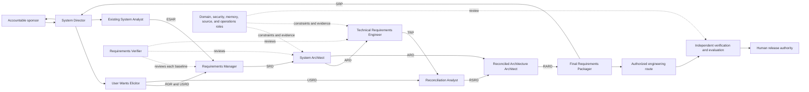
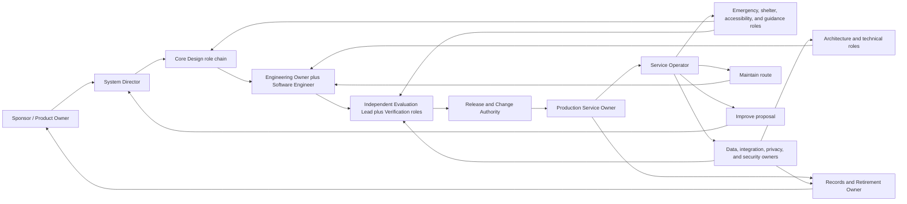

# Sys4AI Core and HarborLight Project Roles

- **Status:** Controlled explanatory guide
- **Scope:** Registered Sys4AI roles and the illustrative HarborLight target-project roles
- **Evidence snapshot:** 2026-07-15
- **Authority boundary:** This guide explains current registered authority and a fictional project-role proposal. It does not create roles, activate skills, grant permissions, or approve a target system.

> The operative Sys4AI role definitions remain in
> [`role_registry.csv`](../Sys4AI/registries/role_registry.csv). Conditional
> role-to-skill relationships remain in
> [`role_skill_crosswalk.csv`](../Sys4AI/registries/role_skill_crosswalk.csv),
> and write/read/validator boundaries remain in
> [`role_execution_binding_registry.csv`](../Sys4AI/registries/role_execution_binding_registry.csv).
> Skill status remains in [`skill_registry.csv`](../Sys4AI/registries/skill_registry.csv),
> [`skill_lifecycle_status_registry.csv`](../Sys4AI/registries/skill_lifecycle_status_registry.csv),
> and the development-runtime
> [`SKILL_REGISTRY.yaml`](../.agents/skill_registry/SKILL_REGISTRY.yaml).
> The accepted lifecycle remains in the
> [Phase 0 Product and System-Design PRD](../PRDs/Sys4AI_phase-0_product_system_design_prd.md).
> The broader context and skill inventory are documented in
> [`project_role_skills_overview.md`](project_role_skills_overview.md).

## 1. Purpose and scope

This guide answers four questions for every role in scope:

1. What responsibility does the role own?
2. How does it relate to other roles and their artifacts or evidence?
3. During which lifecycle stages is it relevant?
4. Which skills does it use, and what does each skill help the role do?

Two role catalogs must remain separate:

- **Registered Sys4AI roles:** 31 machine-readable role rows. Twenty-nine are
  controlled, one is superseded, and one is deprecated. Some are current target-
  capable roles; others are development/framework compatibility roles.
- **HarborLight project roles:** 15 illustrative human or delegated project
  responsibilities for a fictional emergency-shelter coordination assistant.
  They are not registered Sys4AI roles, an installed domain pack, active skill
  bindings, or execution authority.

### 1.1 What “core role” means

The repository uses two overlapping meanings of “core”:

- The **Phase 0 pipeline** names System Director, User Wants Elicitor, Existing
  System Analyst, Requirements Manager, System Architect, Technical
  Requirements Engineer, Reconciliation Analyst, Reconciled Architecture
  Architect, and Final System Requirements Packager.
- The registry class **`system_design_core`** contains the same seven middle
  producer roles plus the generic System Engineer and System Analyst
  compatibility postures. The System Director is classified as governance and
  the Existing System Analyst as support.

This guide therefore uses **registered Sys4AI role** for the complete 31-row
catalog and identifies the Phase 0 pipeline and registry class explicitly when
the distinction matters.

### 1.2 How to interpret skill use

A skill is a procedure, not a role or permission grant. Four surfaces can
describe a role-skill relationship:

- A role row declares required and optional skills.
- A controlled crosswalk adds a trigger, binding type, layer scope, and
  invocation policy.
- A runtime manifest identifies postures capable of operating a skill in the
  Sys4AI-dev host.
- A role execution binding defines allowed transactions, reads, writes,
  forbidden actions, validators, completion evidence, and expiry.

When these surfaces differ, the narrower controlled condition and the active
system layer govern. Fifteen roles have no crosswalk row, and eleven have no
execution-binding row. A declared skill must not be used to infer missing write
authority.

The 32 product skill packages are currently adapter shells or a scaffold
reference and cannot execute as target authority. The 32 adapted skills under
`.agents/skills/` are active only for the Sys4AI-dev development runtime.
HarborLight has no target runtime registry, so every HarborLight skill mapping
below is proposed until adapted and approved for that target.

## 2. How the roles relate

The primary relationship is not a conversational hierarchy. It is an auditable
handoff:

```text
authorized human need
  -> System Director route and system-layer classification
  -> role produces an artifact or evidence package
  -> named consumer reviews or transforms it
  -> independent review where required
  -> accountable human gate
  -> next stage, return, block, improve, or retire
```

### 2.1 Design artifact and evidence flow



The arrows show artifact and evidence flow. They do not transfer approval
authority. The System Director routes and records gates; accountable humans
approve material transitions; independent reviewers do not implement the
candidate they alone evaluate.

### 2.2 Lifecycle stage relationship map

| Lifecycle stage | Principal registered Sys4AI roles | Principal HarborLight project roles | Relationship and gate |
|---|---|---|---|
| Design | System Director; User Wants Elicitor; Existing System Analyst; Requirements Manager; System Architect; Technical Requirements Engineer; Reconciliation Analyst; Reconciled Architecture Architect; Final Packager; triggered support and assurance roles | Sponsor; Emergency Coordination Lead; Shelter Liaison; Accessibility/Medical Specialist; Guidance Owner; Data, Integration, Privacy, Security, Service, Evaluation, and Records owners | Project roles supply authority, domain truth, and ownership. Sys4AI roles turn that evidence into controlled discovery, requirements, architecture, risk, operations, and verification artifacts. The sponsor approves design readiness. |
| Develop | Software Engineer and System Engineer posture; architects, requirements, security, source-control, and verification roles as reviewers | Engineering/Maintenance Owner; Integration, Data, Guidance, Privacy, Security, and Evaluation owners | Engineers build within an approved design and bounded scope. Project owners constrain domain and operational behavior. Development completeness does not authorize deployment. |
| Implement | Software Engineer; System Architect; SVC/Documentation Surface Architect; Security Reviewer; Verification Engineer | Engineering Owner; Integration and Data owners; Security and Privacy owners; Production Service Owner; Evaluation Lead | Authorized implementers assemble a staging or test candidate. Integration, environment, migration, secret, provenance, and rollback evidence must be reviewable before Test. |
| Test | Verification Engineer; Requirements Verifier; Domain Specialist; Security Reviewer | Evaluation Lead; Release Authority; affected domain, data, integration, privacy, security, service, and support owners | Test, requirements verification, stakeholder/system validation, and behavioral evaluation remain separately labeled. A human release authority alone decides promotion. |
| Run | Core roles re-enter only on triggers; Runtime and Maintenance Planner supplies prior obligations | Production Service Owner; Service Operator; Emergency Coordination Lead; Shelter Liaison; Data, Integration, Privacy, Security, Guidance, and Records owners | Named humans own production operation and consequential case decisions. Loss of evidence or authority triggers degraded mode, safe stop, maintenance, or review. |
| Maintain | Bounded Execution Planner; Software Engineer; Runtime/Maintenance Planner; SVC Architect; Verification and assurance roles | Engineering Owner; Service Owner and Operators; Data, Integration, Guidance, Security, Privacy, Evaluation, and Release owners | Maintenance is a bounded change to an accepted baseline. It must return through affected tests and human maintenance-release approval before Run. |
| Improve | System Director and every affected baseline owner; independent verification and assurance roles | Sponsor; Release Authority; affected domain and operational owners; Evaluation Lead; Engineering Owner only after authorization | Evidence-backed proposals route to the earliest affected stage. Analysis does not grant implementation or production permission. |
| Retire | Runtime/Maintenance Planner; SVC Architect; Verification; triggered security, privacy, data, and source roles | Sponsor/retirement authority; Production Service Owner; Records Owner; Operators; Data, Integration, Privacy, Security, Guidance, and Evaluation owners | Human owners execute shutdown, revocation, data disposition, archive, notification, and residual obligations. Accountable retirement acceptance is the gate. |

## 3. Registered Sys4AI role profiles

### 3.1 System Director (`system_director`)

- **Description:** Governance owner that orchestrates stages, gates, handoffs,
  role selection, artifact governance, and traceability across development,
  framework, template, and target layers.
- **Phase relationship:** Enters before Design and remains relevant through
  Retire. It routes failed evidence and Improve proposals to the earliest
  affected stage rather than forcing forward progress.
- **Relationships:** Receives authorized human intent; routes the Elicitor and
  brownfield analyst; coordinates requirements, architecture, assurance,
  engineering, and verification roles; presents readiness evidence to the
  accountable human.
- **Skills and use:** Requires `director-decision-governor` to record routing
  and authority decisions and `system-layer-classifier` to identify the
  affected authority surface. The crosswalk also requires
  `role-catalog-governance` when role data changes and `init` at adoption
  entry. `domain-pack-router` is conditional; `source-first-memory` is optional
  source navigation.
- **Authority:** A controlled execution binding permits Director decisions and
  legacy control review, subject to registry-graph validation. It cannot exceed
  project authority, self-grant permission, or replace accountable acceptance.

### 3.2 System Developer / User Wants Elicitor (`user_wants_elicitor`)

- **Description:** Discovery owner that turns stakeholder intent, boundaries,
  scenarios, constraints, risks, and unknowns into an RDR and USRD.
- **Phase relationship:** Primary at Design entry and material Improve re-entry
  when purpose, actors, behavior, constraints, or acceptance expectations change.
- **Relationships:** Receives the Director's route and Existing System Analysis
  Report when present; hands discovery evidence to the Requirements Manager,
  Reconciliation Analyst, Architect, and Director.
- **Skills and use:** Requires `system-definition-interview-context-45` for
  long-form discovery and `init` at adoption entry. It may use the base
  `system-definition-interview` for a smaller interview,
  `decision-grilling-context-45` for one difficult decision,
  `requirements-discovery-governor` to protect the discovery-to-USRD gate, and
  `conversation-to-prd` only after discovery and explicit approval.
- **Authority:** Its controlled discovery binding permits RDR/discovery records
  but forbids automatic PRD creation or promotion of candidate requirements.

### 3.3 Existing System Analyst (`existing_system_analyst`)

- **Description:** Target-instance brownfield analyst that documents existing
  components, interfaces, data, operating practices, constraints, risks, and
  evidence gaps in an ESAR.
- **Phase relationship:** Conditional in Design and in Maintain or Improve when
  current-state drift, an upstream change, or undocumented behavior must be
  reassessed.
- **Relationships:** Supplies current-state evidence to the Elicitor,
  Requirements Manager, Architect, Domain Specialist, security reviewer, and
  integration owners.
- **Skills and use:** Requires `domain-grilling-with-docs` to challenge
  documentation against the actual system and `init` for the first read-only
  brownfield classification. `source-first-memory` is optional navigation.
- **Authority:** Target-instance scope does not itself grant access or mutation.
  No explicit execution-binding row exists.

### 3.4 System Manager / Requirements Manager (`requirements_manager`)

- **Description:** Requirements-normalization owner that turns approved user
  wants and current-state constraints into atomic, testable system obligations
  in the SRD.
- **Phase relationship:** Primary in Design; returns whenever Maintain or
  Improve changes a system obligation or acceptance basis.
- **Relationships:** Consumes the USRD and optional ESAR; supplies the SRD to
  the Architect, Technical Requirements Engineer, Requirements Verifier, and
  assurance roles.
- **Skills and use:** Requires `conversation-to-prd` for structured synthesis
  and `technical-writing-quality-gate` before baseline. It may use
  `traceability-matrix-engine` to connect needs to obligations,
  `decision-grilling` to resolve ambiguity, and
  `requirements-discovery-governor` to preserve unresolved discovery gaps.
- **Authority:** It cannot silently invent thresholds, decide architecture, or
  promote unapproved user wants. No explicit execution-binding row exists.

### 3.5 System Architect (`system_architect`)

- **Description:** Architecture owner that derives drivers, significant
  requirements, views, mechanisms, interfaces, trust boundaries, ADRs, and the
  evidence basis in the ARD.
- **Phase relationship:** Primary in Design; consulted during Develop and
  Implement; returns for material integration, boundary, maintenance,
  improvement, or retirement changes.
- **Relationships:** Consumes the SRD and ESAR; supplies architecture
  obligations to technical engineering, security, memory, source-control,
  operations, and verification roles.
- **Skills and use:** Uses `decision-grilling` to resolve architecture choices,
  `mermaid-diagrams` and `plantuml-diagrams` for controlled views,
  `artifact-contract-governance` when producer/consumer contracts matter, and
  `interface-and-integration-discovery` when external flows or owners are unclear.
- **Authority:** Architecture decisions do not grant credentials, maturity,
  implementation permission, or production approval. No explicit execution
  binding exists.

### 3.6 System Engineer / Technical Requirements Engineer (`technical_requirements_engineer`)

- **Description:** Technical-allocation owner that converts SRD and ARD
  obligations into a buildable TRP with interfaces, constraints, allocation,
  and verification methods.
- **Phase relationship:** Closes the buildability part of Design and forms the
  controlled handoff to Develop and Implement; returns for affected changes.
- **Relationships:** Consumes SRD, ARD, and triggered support records; supplies
  the TRP to Reconciliation, Requirements Verification, Software Engineering,
  and Verification Engineering.
- **Skills and use:** Requires `prd-to-implementation-plan` to decompose the
  design into bounded technical work and `verification-validation-planner` to
  pair each obligation with an evidence method.
- **Authority:** A buildable plan is not authorization to write code, provision
  an environment, or deploy. No explicit execution-binding row exists.

### 3.7 System Analyst / Reconciliation Analyst (`reconciliation_analyst`)

- **Description:** Reconciliation owner that compares user intent with the TRP,
  detects overbuild, underbuild, contradiction, and hidden tradeoffs, and
  produces the RSRD and decision log.
- **Phase relationship:** Operates late in Design and at Improve re-entry when
  stakeholder intent and technical obligations no longer agree.
- **Relationships:** Consumes USRD and TRP; returns unresolved conflicts to the
  relevant producer and hands accepted reconciliation to the Reconciled
  Architecture Architect and Final Packager.
- **Skills and use:** Requires `decision-grilling` for explicit tradeoffs and
  may use `traceability-matrix-engine` to compare intent and allocation. There
  is no condition-specific crosswalk row.
- **Authority:** Direct skill declarations do not create write or approval
  authority. No execution-binding row exists.

### 3.8 Reconciled Architecture Architect (`reconciled_architecture_architect`)

- **Description:** Post-reconciliation architecture owner that makes the ARD
  consistent with the accepted RSRD and produces the RARD.
- **Phase relationship:** Late Design and affected Improve re-entry.
- **Relationships:** Consumes RSRD and ARD; supplies the RARD to the Final
  Packager, Requirements Verifier, and downstream planning roles.
- **Skills and use:** Requires `mermaid-diagrams` and `decision-grilling` to
  update decisions and views; may use `artifact-contract-governance` when the
  reconciliation changes producer/consumer obligations. No crosswalk row exists.
- **Authority:** It may update architecture only within an authorized scope; it
  does not approve the design or implementation. No execution binding exists.

### 3.9 Final System Requirements Packager (`final_system_requirements_packager`)

- **Description:** Design-exit owner that packages reconciled requirements,
  architecture, interfaces, verification basis, assumptions, open issues, and
  handoff material into the SRP.
- **Phase relationship:** Owns Design exit and returns when a material
  maintenance or improvement decision requires a new implementation-ready baseline.
- **Relationships:** Consumes RSRD, RARD, and triggered execution, memory,
  source-control, risk, and operations records; hands the SRP to the Director
  and a separately authorized implementation route.
- **Skills and use:** Requires `prd-to-implementation-plan` for implementation-
  ready structure and `technical-writing-quality-gate` for clear bounded prose;
  may use `traceability-matrix-engine`. No crosswalk row exists.
- **Authority:** Packaging is not implementation initialization, Design
  approval, or permission to mutate a target. No execution-binding row exists.

### 3.10 Requirements Verifier / Consistency Auditor (`requirements_verifier`)

- **Description:** Independent requirements-quality owner that checks
  consistency, traceability, ambiguity, acceptance criteria, hidden assumptions,
  and correct separation of test, verification, validation, and evaluation claims.
- **Phase relationship:** Reviews Design baselines and material gates; returns
  in Test, Maintain, Improve, and Retire when requirements evidence changes.
- **Relationships:** Reviews USRD, SRD, ARD, TRP, RSRD, RARD, and SRP; returns
  defects to the producer and supplies review evidence to the Director and
  Verification Engineer.
- **Skills and use:** Requires `technical-writing-quality-gate` and
  `traceability-matrix-engine`; may use `verification-validation-planner` when
  the acceptance evidence itself needs planning.
- **Authority:** It must remain independent from sole authorship of the same
  requirement and cannot replace accountable acceptance. No execution binding exists.

### 3.11 Domain Specialist (`domain_specialist`)

- **Description:** Target-instance specialist that validates terminology,
  assumptions, constraints, measures, failure consequences, and domain risk.
- **Phase relationship:** Conditional in Design, Test, Run review, Maintain,
  Improve, and Retire whenever domain claims or outcomes are material.
- **Relationships:** Supplies findings to requirements, architecture, security,
  evaluation, operations, improvement, and retirement owners.
- **Skills and use:** Requires `domain-grilling-with-docs`; the crosswalk
  recommends `domain-grilling-with-docs-context-45` for long reviews and allows
  `domain-pack-router` to keep project specialization outside the core catalog.
  `technical-writing-quality-gate` is optional in the role row.
- **Authority:** Expertise does not grant permissions, release authority, or
  risk acceptance. No explicit execution-binding row exists.

### 3.12 Security, Safety, Privacy, and Compliance Reviewer (`security_safety_privacy_compliance_reviewer`)

- **Description:** Cross-cutting assurance reviewer that identifies threats,
  hazards, privacy/compliance exposure, permission limits, controls, evidence
  obligations, and residual risk.
- **Phase relationship:** Relevant from Design through Develop, Implement,
  Test, Run, Maintain, Improve, and Retire.
- **Relationships:** Sends controls to requirements, architecture, engineering,
  and operations; sends evidence obligations to Verification; sends residual
  risk to accountable humans.
- **Skills and use:** Requires `threat-model-and-permission-scope` to define
  data/tool/autonomy risks and least privilege and `assurance-case-builder` to
  structure claims and evidence. `verification-validation-planner` is optional.
- **Authority:** Its controlled binding permits safety review, permission-scope
  analysis, and assurance cases, but forbids granting permission, self-approving
  risk, accepting its own review, or claiming production readiness.

### 3.13 Documentation Librarian / Configuration Controller (`documentation_librarian`)

- **Description:** Development/framework documentation-governance owner that
  maintains identifiers, artifact indexes, source authority, derivative policy,
  controlled terminology, configuration records, and skill-import provenance.
- **Phase relationship:** Cross-cutting for Sys4AI-dev and the Sys4AI framework
  whenever controlled sources, registries, generated readers, configuration, or
  skill provenance change.
- **Relationships:** Supplies source and configuration identity to framework
  roles and regeneration/consistency evidence to verifiers and release owners.
  Its registered scope does not include a target instance.
- **Skills and use:** Requires `source-authority-auditor` to detect authority
  inversion and `skill-import-generalizer` to preserve skill provenance. The
  crosswalk also requires `project-ontology-and-glossary` when terminology is
  controlled; `technical-writing-quality-gate` is optional.
- **Authority:** Its controlled configuration/skill-reconciliation binding
  forbids treating generated derivatives as canonical. It is not a standing
  HarborLight Documentation Curator.

### 3.14 Runtime and Maintenance Planner (`runtime_maintenance_planner`)

- **Description:** Planning owner for monitoring, incidents, updates,
  evaluation cadence, recovery, maintenance, data disposition, operational
  readiness, and retirement obligations.
- **Phase relationship:** Begins in Design, contributes to Test readiness, and
  is central to Run, Maintain, Improve, and Retire planning.
- **Relationships:** Sends operability requirements to architecture and
  engineering, evidence obligations to Verification, and plans/readiness gaps
  to named human service, incident, data, and retirement owners.
- **Skills and use:** Requires `operations-and-maintenance-planner` to create
  the operations/maintenance plan and readiness-gap register. It may use
  `evaluation-harness-designer` for operational regression probes and cadence
  without controlling acceptance thresholds.
- **Authority:** The controlled binding covers planning and readiness review,
  not operation, patching, deployment, production authority, or self-acceptance.

### 3.15 Bounded Execution Planner (`bounded_execution_planner`)

- **Description:** Runtime-control owner that converts approved scope into
  portable bounded work with explicit objective, state, reads, writes,
  prohibitions, validators, stop conditions, checkpoints, cancellation,
  escalation, evidence, and handoff.
- **Phase relationship:** Cross-lifecycle wherever Design, Develop, Implement,
  Test, Maintain, Improve, or Retire work must be packetized or resumed.
- **Relationships:** Receives an authorized scope from the Director or
  accountable human; constrains executors; supplies checkpoints, completion
  evidence, and a resumable handoff to the next owner.
- **Skills and use:** Requires `context-window-and-handoff-manager` for
  source-backed continuation and `baseline-change-manager` for migration and
  rollback. The crosswalk requires `codex-usage-metrics` when context accounting
  matters. `director-decision-governor` is optional.
- **Authority:** Its controlled binding permits bounded implementation,
  validation, migration, and handoff only inside an explicit permission
  envelope. It cannot self-approve authority or rewrite activated history.

### 3.16 Context Memory and Knowledge Architect (`context_memory_knowledge_architect`)

- **Description:** Source-first memory and retrieval architecture owner for
  registries, knowledge bases, context preflight, provenance, generated readers,
  and source-verification rules.
- **Phase relationship:** Relevant from Design through Retire whenever memory,
  retrieval, or generated knowledge influences decisions.
- **Relationships:** Sends source/retrieval requirements to architecture and
  engineering, verification obligations to evidence roles, and maintenance
  rules to documentation and source-control owners.
- **Skills and use:** Requires `source-first-memory` to route retrieval back to
  registered authority and `source-authority-auditor` to detect stale or
  derivative evidence. `artifact-contract-governance` is optional for memory
  object and evidence contracts.
- **Authority:** Retrieved or generated memory is navigation, not authority. No
  explicit execution-binding row exists.

### 3.17 SVC and Documentation Surface Architect (`svc_documentation_surface_architect`)

- **Description:** Source/version-control architecture owner for canonical
  sources, derivatives, baselines, migrations, supersession, rollback,
  regeneration, and archives.
- **Phase relationship:** Cross-lifecycle from Design through Retire, especially
  at implementation, release, maintenance, improvement, and archival changes.
- **Relationships:** Sends source and rollback rules to engineering, derivative
  rules to documentation tooling, baseline evidence to Verification, and
  supersession/retirement evidence to governance owners.
- **Skills and use:** Requires `source-authority-auditor` and
  `baseline-change-manager`; the crosswalk specifically requires baseline
  management when a baseline or supersession changes.
  `technical-writing-quality-gate` is optional.
- **Authority:** Its controlled binding forbids rewriting activated history,
  weakening protected baselines, or promoting derivatives without authority.

### 3.18 Implementation Initialization Agent (`implementation_initialization_agent`)

- **Description:** Framework implementation-bootstrap owner that initializes
  code, registries, schemas, validators, and related scaffolds from accepted plans.
- **Phase relationship:** Primarily Sys4AI program Phase 1 and framework-side
  Develop/Implement preparation, not a standing target-instance role.
- **Relationships:** Consumes accepted PRDs and implementation plans; supplies
  initialized framework surfaces and completion evidence to engineers and verifiers.
- **Skills and use:** Requires `prd-to-implementation-plan` to preserve the
  accepted implementation boundary and may use `source-first-memory` for source
  navigation. No condition-specific crosswalk row exists.
- **Authority:** Its controlled initialization binding requires explicit
  authority and aggregate validation and forbids treating a generated
  derivative as canonical. Its scope excludes `target_system_instance`.

### 3.19 Verification Engineer (`verification_engineer`)

- **Description:** Independent evidence owner that designs and executes
  verification, validation, evaluation, regression, failure probes, and
  protected holdouts while keeping claims separately labeled.
- **Phase relationship:** Plans evidence in Design, leads independent work in
  Test, and returns after maintenance, improvement, or any material model, data,
  prompt, tool, policy, host, integration, or permission change.
- **Relationships:** Consumes requirements, architecture, risks, implementation
  evidence, scenarios, metrics, and thresholds; returns defects to the owning
  stage and sends a recommendation to accountable release authority.
- **Skills and use:** Requires `verification-validation-planner` for evidence
  matrices, `evaluation-harness-designer` for scenarios/rubrics/holdouts, and
  `technical-writing-quality-gate` for bounded claims.
- **Authority:** Its controlled binding requires evaluator independence and
  forbids being sole proposer and evaluator, changing protected thresholds
  without approval, modifying the evaluated candidate, or accepting release.

### 3.20 Software Engineer (`software_engineer`)

- **Description:** Implementation owner that creates code, tests,
  configuration, adapters, migrations, and related evidence under an accepted
  design and transaction.
- **Phase relationship:** Primary in Develop and Implement; repairs Test
  defects; performs authorized Maintain and approved Improve changes.
- **Relationships:** Consumes the SRP, architecture, technical requirements,
  security controls, and bounded plan; supplies reproducible candidates and
  evidence to Verification and operational owners.
- **Skills and use:** Requires `prd-to-implementation-plan` to turn approved
  requirements into bounded work and may use `source-first-memory` to locate
  registered authority. No condition-specific crosswalk row exists.
- **Authority:** Its controlled implementation binding forbids canonical PRD
  mutation outside authority. It cannot approve its own release or infer
  production access.

### 3.21 System Engineer compatibility posture (`system_engineer`)

- **Description:** Generic engineering posture used by active skill manifests
  for requirements/implementation-plan integration when a more specific
  producer role is not the runtime posture.
- **Phase relationship:** Spans Design, Develop, and Implement; specialized
  Technical Requirements Engineering still owns the canonical TRP step.
- **Relationships:** Bridges design evidence into plans and trace records and
  supports Software Engineering without displacing specialized artifact owners.
- **Skills and use:** Requires `prd-to-implementation-plan` and
  `technical-writing-quality-gate`; may use `decision-grilling` to resolve a
  bounded engineering decision. No crosswalk row exists.
- **Authority:** Its controlled binding is limited to PRD integration and
  requirements trace under explicit authority; a runtime posture is not a
  general permission grant.

### 3.22 System Analyst compatibility posture (`system_analyst`)

- **Description:** Generic analysis posture used by active runtime skills for
  evidence-grounded analysis and requirements support. It does not replace the
  Reconciliation Analyst or Existing System Analyst.
- **Phase relationship:** Primarily Design and Improve re-entry.
- **Relationships:** Supplies analysis to requirements, architecture, planning,
  and routing roles while specialized producers retain artifact ownership.
- **Skills and use:** Requires `decision-grilling` and `source-first-memory` and
  may use `conversation-to-prd`. No condition-specific crosswalk row exists.
- **Authority:** No execution-binding row exists. Being eligible to operate a
  runtime skill does not authorize source mutation.

### 3.23 Control Loop Planner (`control_loop_agentjob_planner`) — superseded

- **Description:** Retained historical role for interpreting old continuation,
  bounded-job, metrics, and handoff evidence.
- **Phase relationship:** No current lifecycle assignment. New work routes to
  the Bounded Execution Planner.
- **Relationships:** Supports read-only interpretation of historical records;
  it must not be placed in a current target team or create new execution authority.
- **Skills and use:** Historical crosswalk rows bind
  `codex-usage-metrics` and `context-window-and-handoff-manager`; both bindings
  are superseded. The role row also lists optional `director-decision-governor`.
- **Authority:** The execution binding is superseded and read-only. Historical
  legibility is its only valid use.

### 3.24 Control Loop Engineer (`control_loop_engineer`) — deprecated

- **Description:** Retained development/framework role for read-only
  interpretation of older self-hosting control-loop evidence.
- **Phase relationship:** No current target lifecycle assignment.
- **Relationships:** Preserves compatibility until the historical evidence and
  validators are retired; it is not a current executor or planner.
- **Skills and use:** The role row lists required `source-first-memory` and
  optional `codex-usage-metrics`; no crosswalk exists.
- **Authority:** Its deprecated binding is read-only and forbids creating or
  mutating current execution authority.

### 3.25 Validator Engineer (`validator_engineer`) — temporary legacy

- **Description:** Development/framework compatibility role for maintaining
  legacy validators, tests, and validation evidence.
- **Phase relationship:** Legacy Sys4AI-dev/framework work only; it is not a
  HarborLight target role.
- **Relationships:** Receives controlled validation scope and supplies validator
  changes, test evidence, and diff checks to acceptance and governance owners.
- **Skills and use:** Requires `technical-writing-quality-gate` and
  `verification-validation-planner`; may use `source-first-memory`. No crosswalk exists.
- **Authority:** Its expiring legacy binding permits validator/test/registry
  writes under explicit authority and forbids skipping authority checks.

### 3.26 Derivative Generator Engineer (`derivative_generator_engineer`) — temporary legacy

- **Description:** Development/framework compatibility role for deterministic
  generated-reader updates and their registry trace.
- **Phase relationship:** Legacy development/framework evidence only; no target
  lifecycle assignment.
- **Relationships:** Consumes canonical source/derivative definitions and
  supplies regenerated readers plus consistency evidence to Documentation and Verification.
- **Skills and use:** Requires `source-authority-auditor` to preserve source
  precedence and `technical-writing-quality-gate` for generated prose contracts.
- **Authority:** Its expiring binding permits generated/registry surfaces only
  inside bounded authority and forbids treating derivatives as canonical.

### 3.27 Skill Surface Engineer (`skill_surface_engineer`) — temporary legacy

- **Description:** Development/framework compatibility role for runtime,
  compatibility-shim, and product-scaffold skill surfaces.
- **Phase relationship:** Legacy Sys4AI Phase 1 evidence; not target execution.
- **Relationships:** Coordinates with Documentation/Configuration Control and
  dependency/integration roles; supplies manifests, adapters, and registry evidence.
- **Skills and use:** Requires `skill-import-generalizer` and
  `technical-writing-quality-gate`; may use `source-first-memory`. No crosswalk exists.
- **Authority:** Its expiring binding requires manifest evidence and forbids
  promoting scaffold skills without review. It is not a general project skill developer.

### 3.28 Acceptance Engineer (`acceptance_engineer`) — temporary legacy

- **Description:** Development/framework compatibility role for historical
  acceptance reports and completion receipts.
- **Phase relationship:** Legacy acceptance evidence only; it does not own a
  target Test-to-Run gate.
- **Relationships:** Consumes aggregate validation evidence and supplies
  acceptance records to governance and handoff owners.
- **Skills and use:** Requires `verification-validation-planner` and
  `technical-writing-quality-gate`; may use `source-first-memory`. No crosswalk exists.
- **Authority:** Its expiring binding forbids acceptance without aggregate
  validation and does not replace independent Verification or accountable humans.

### 3.29 Skill Dependency Adaptation Agent (`skill_dependency_adaptation_agent`) — temporary legacy

- **Description:** Development/framework compatibility role for dependency
  adapters, manifests, and provenance evidence.
- **Phase relationship:** Legacy skill-maintenance work only; no target phase.
- **Relationships:** Supplies reviewed dependency adapters to Skill Integration
  and Skill Surface owners and evidence to Documentation/Verification.
- **Skills and use:** Requires `skill-import-generalizer` to preserve adaptation
  boundaries and `codex-usage-metrics` for legacy session evidence; may use the
  `technical-writing-quality-gate`. No crosswalk exists.
- **Authority:** Its expiring binding forbids activating unreviewed dependencies
  and does not authorize HarborLight skill installation.

### 3.30 Skill Integration Agent (`skill_integration_agent`) — temporary legacy

- **Description:** Development/framework compatibility role for integrating
  adapted skill manifests and runtime/scaffold surfaces.
- **Phase relationship:** Legacy skill-integration work only; no target phase.
- **Relationships:** Consumes reviewed dependency/adaptation evidence and
  supplies integrated manifests and adapters to the Skill Surface Engineer and verifiers.
- **Skills and use:** Requires `skill-import-generalizer` and
  `source-first-memory`; may use `technical-writing-quality-gate`. No crosswalk exists.
- **Authority:** Its expiring binding forbids dropping provenance and cannot
  activate a product-scaffold skill in a target system.

### 3.31 System Definition Template Agent (`system_definition_template_agent`) — temporary legacy

- **Description:** Development/framework compatibility role for discovery
  templates, schemas, and their validation evidence.
- **Phase relationship:** Legacy Design-entry tooling support; it is not the
  current User Wants Elicitor or `/init` route.
- **Relationships:** Supplies validated templates to discovery owners and
  schema/registry evidence to Documentation and Verification.
- **Skills and use:** Requires `system-definition-interview` and
  `technical-writing-quality-gate`; may use `conversation-to-prd`. No crosswalk exists.
- **Authority:** Its expiring binding forbids promoting candidate discovery
  material to a PRD. New adoption routes through `init` and the Elicitor.

## 4. HarborLight fictional project-role profiles

HarborLight is a fictional county emergency-shelter coordination assistant. It
would help authorized staff locate shelter capacity, match accessibility and
medical-support needs, summarize verified public guidance, and route cases to
human coordinators. It replaces parts of a brownfield call-center/spreadsheet
workflow, integrates with shelter and alert systems, handles sensitive data,
uses retrieval and tool calls, must operate during emergencies, and preserves
human decision authority.

The following roles fill human accountability, domain, production, data,
security, support, maintenance, and retirement responsibilities that the core
registry does not provide as dedicated target-instance roles. They are a
proposal for explanation only.

For each skill mapping:

- **Operate** means an authorized actor could perform a target-adapted skill
  procedure as part of the role.
- **Consume/review** means a human decision owner uses the skill's evidence but
  does not delegate approval, policy, domain judgment, legal judgment, or risk
  acceptance to the procedure.

### 4.1 Accountable Sponsor / Product Owner

- **Description:** Human owner of HarborLight's mission, authorized scope,
  public-value boundary, material risk disposition, funding/continuation, and
  lifecycle acceptance.
- **Phase relationship:** Activates before Design; approves Design readiness
  and material Improve decisions; remains accountable through Run and Retire;
  releases only after retirement acceptance or an explicit successor handoff.
- **Relationships:** Authorizes the System Director's route; receives
  requirements, architecture, risk, evaluation, operational, and retirement
  evidence; delegates bounded release and service duties to named authorities.
- **Skill use:** **Consumes/reviews** Director decisions produced with
  `director-decision-governor`, assurance arguments from
  `assurance-case-builder`, and evidence plans/results from
  `verification-validation-planner` and `evaluation-harness-designer`.
- **Authority:** Keeps human accountability. It must not let a model
  self-authorize, self-accept risk, redefine county policy, or treat validator
  success as lifecycle acceptance.

### 4.2 Release and Change Authority

- **Description:** Accountable human gate owner for Test-to-Run promotion,
  maintenance releases, and approved material changes.
- **Phase relationship:** Release criteria are defined in Design; the role
  activates for Test candidates, after Maintain, and for material Improve
  dispositions, then closes each gate with an auditable decision.
- **Relationships:** Receives independent Verification recommendations, risk
  findings from Security/Privacy owners, and baseline/rollback evidence from
  Engineering and SVC roles; hands approval, rejection, or return routing to
  the Production Service Owner and System Director.
- **Skill use:** **Consumes/reviews** `traceability-matrix-engine`,
  `verification-validation-planner`, `evaluation-harness-designer`,
  `assurance-case-builder`, and `baseline-change-manager` outputs to determine
  whether evidence covers the identified candidate and rollback baseline.
- **Authority:** Must remain separate from sole implementation and sole
  evaluation. It cannot approve an unidentified or insufficiently evidenced release.

### 4.3 Emergency Coordination Lead / Human Case-Decision Authority

- **Description:** Domain owner for emergency-coordination practice and the
  human decision point for consequential shelter cases.
- **Phase relationship:** Activates in Design discovery and Test validation;
  remains active in Run for escalated decisions; re-enters Maintain/Improve
  after incidents or policy changes; participates in Retire transition planning.
- **Relationships:** Supplies workflows, scenarios, escalation rules, and
  decision limits to the Elicitor, Requirements Manager, Domain Specialist,
  and Verification Engineer. Service Operators escalate consequential cases to it.
- **Skill use:** **Operates/supports** `system-definition-interview-context-45`
  and `domain-grilling-with-docs` to expose real practice; uses
  `project-ontology-and-glossary` for case terminology; **reviews** procedures
  derived from `operations-and-maintenance-planner`.
- **Authority:** HarborLight may recommend, retrieve, and summarize; it never
  inherits this role's human case authority.

### 4.4 Shelter Operations Liaison

- **Description:** Bridge between the project and shelter providers, responsible
  for provider constraints, local operating practices, representation, and communications.
- **Phase relationship:** Active in brownfield Design and interface discovery;
  validates integrations in Test; monitors provider changes in Run; triggers
  Maintain/Improve; confirms dependency and notification closure in Retire.
- **Relationships:** Supplies evidence to the Existing System Analyst, Domain
  Specialist, Architect, Data Steward, and Integration Owner; receives change
  and incident notices from operators and providers.
- **Skill use:** **Operates** `domain-grilling-with-docs` to compare documented
  and actual practice, `interface-and-integration-discovery` to map provider
  systems and owners, and `requirements-discovery-governor` to keep gaps open
  until evidence exists.
- **Authority:** Cannot speak for every shelter without recorded representation,
  grant integration credentials, or convert informal provider statements into
  approved policy by itself.

### 4.5 Accessibility and Medical Support Specialist

- **Description:** Subject-matter owner for accessibility, language access,
  transportation, medical-support matching, representative cases, and related
  harm scenarios.
- **Phase relationship:** Active in Design and requirements/architecture review;
  validates cases in Test; returns on operational evidence, incidents,
  maintenance changes, improvement proposals, and retirement communications.
- **Relationships:** Works with the Domain Specialist, Elicitor, Requirements
  Manager, Security Reviewer, Guidance Owner, and Independent Evaluation Lead.
  Its findings constrain requirements and evaluation scenarios.
- **Skill use:** **Operates** `domain-pack-router` to route specialization
  outside core authority, `domain-grilling-with-docs-context-45` for extended
  evidence review, `evaluation-harness-designer` for representative/adverse
  cases, and `technical-writing-quality-gate` for precise measurable criteria.
- **Authority:** Expertise does not grant release authority or establish that
  every affected group has accepted the system.

### 4.6 Guidance, Support, and Training Owner

- **Description:** Source owner for verified public guidance, operator runbooks,
  support procedures, user explanations, and training material.
- **Phase relationship:** Defines content-source and support obligations in
  Design; contributes during Develop/Test; remains active in Run and Maintain;
  revises after Improve and archives or withdraws material in Retire.
- **Relationships:** Collaborates with the SVC/Documentation Surface Architect,
  Data Steward, Emergency Coordination Lead, Service Operators, and Records Owner.
- **Skill use:** **Operates** `source-authority-auditor` to separate current
  guidance from summaries, `technical-writing-quality-gate` for usable bounded
  language, `project-ontology-and-glossary` for consistent terms,
  `baseline-change-manager` for versions/rollback, and
  `operations-and-maintenance-planner` for support duties.
- **Authority:** Owns the content-accuracy process, not emergency case decisions,
  data access, policy acceptance, or release approval.

### 4.7 Shelter Data Steward

- **Description:** Accountable owner of shelter-capacity and capability data
  definitions, provenance, freshness, quality, access, retention, and disposition.
- **Phase relationship:** Active from Design through Develop, Implement, Test,
  Run, Maintain, Improve, and Retire; assignment ends only after custody and
  residual data obligations transfer or close.
- **Relationships:** Supplies data contracts to the Architect, Technical
  Requirements Engineer, Integration Owner, Privacy Owner, engineers, and
  Verification; receives quality/freshness alerts from operators.
- **Skill use:** **Operates** `artifact-contract-governance` for data/evidence
  contracts, `source-authority-auditor` for provenance,
  `project-ontology-and-glossary` for field meaning,
  `threat-model-and-permission-scope` for access limits, and
  `baseline-change-manager` for schema/version changes.
- **Authority:** Cannot grant itself legal authority, credentials, source-system
  access, or permission to repurpose sensitive data.

### 4.8 Integration and Dependency Owner

- **Description:** Owner of external feeds, identity, messaging, vendor/service
  dependencies, credentials, schemas, service expectations, migrations, and shutdown.
- **Phase relationship:** Active in Design interface discovery; primary during
  Implement; supports Test; monitors dependencies in Run; owns affected
  Maintain work and dependency closure in Retire.
- **Relationships:** Works with the Architect, Engineering Owner, Data Steward,
  Security Owner, Service Operator, and Verification Lead; routes upstream
  changes to analysis, maintenance, or improvement.
- **Skill use:** **Operates** `interface-and-integration-discovery` for flows and
  owners, `artifact-contract-governance` for interface contracts,
  `baseline-change-manager` for migrations/rollback,
  `threat-model-and-permission-scope` for credentials/trust boundaries, and
  `verification-validation-planner` for integration evidence.
- **Authority:** May coordinate access only under explicit permission. It cannot
  approve its own integration or conceal upstream failure.

### 4.9 Privacy and Compliance Owner

- **Description:** Human owner for data minimization, purpose limitation,
  retention, access, disclosure, affected-person obligations, and applicable
  policy/compliance review.
- **Phase relationship:** Active in Design; reviews Implement/Test evidence;
  performs scheduled and event-driven Run review; returns for Maintain/Improve;
  owns privacy/compliance closure in Retire.
- **Relationships:** Constrains the Data Steward, Architect, Engineering Owner,
  Security Owner, and operators; reports residual issues to the Sponsor and
  Release Authority.
- **Skill use:** **Operates or reviews** `threat-model-and-permission-scope` to
  identify data and autonomy exposure, `assurance-case-builder` to structure
  claims/evidence, `verification-validation-planner` for checks, and
  `baseline-change-manager` for controlled policy/data changes.
- **Authority:** A skill cannot determine legal compliance or accept residual
  privacy risk. Human accountability and qualified review remain necessary.

### 4.10 Security and Incident Owner

- **Description:** Owner of security controls, incident readiness and response,
  access review, safe-stop decisions, credential revocation, and recovery evidence.
- **Phase relationship:** Active in Design threat work and Implement/Test
  review; continuously accountable in Run; leads incident-triggered Maintain;
  reviews Improve; closes credentials and security obligations in Retire.
- **Relationships:** Works with the core Security Reviewer, Integration Owner,
  Data/Privacy owners, Production Service Owner, operators, Engineering Owner,
  and Verification Lead.
- **Skill use:** **Operates** `threat-model-and-permission-scope`,
  `assurance-case-builder`, and `operations-and-maintenance-planner` for
  preventive and incident controls; uses `evaluation-harness-designer` for
  failure probes and `baseline-change-manager` for secure rollback/revocation.
- **Authority:** May invoke emergency controls only under pre-authorized policy.
  It cannot self-expand permissions or accept its own residual-risk review.

### 4.11 Production Service Owner

- **Description:** Accountable human owner of the approved production service,
  service objectives, continuity, staffing, operational acceptance, and the
  continuing Run decision.
- **Phase relationship:** Defines operability needs in Design, assesses
  readiness in Test, owns Run, authorizes incident/maintenance routing within
  policy, participates in Improve, and approves orderly withdrawal before
  retirement acceptance.
- **Relationships:** Receives release approval from the Release Authority;
  directs Service Operators; coordinates with Security, Data, Privacy, Support,
  Integration, and Records owners; reports material changes to the Sponsor and Director.
- **Skill use:** **Consumes/reviews** plans from
  `operations-and-maintenance-planner`, assurance and evaluation evidence,
  `traceability-matrix-engine` coverage, and `baseline-change-manager`
  release/rollback identity.
- **Authority:** Remains distinct from daily operation and independent
  verification. Production accountability cannot be delegated to a skill.

### 4.12 Service Operator

- **Description:** Authorized person who runs HarborLight, monitors health and
  source freshness, follows runbooks, supports users, records incidents, and
  escalates human decisions.
- **Phase relationship:** Activates only after approved Run transition and
  operator readiness; supports Maintain and staged Retire; deactivates when
  access is revoked, transferred, or the service is retired.
- **Relationships:** Reports to the Production Service Owner; escalates cases
  to the Emergency Coordination Lead and incidents to Security; sends data and
  integration defects to their owners.
- **Skill use:** **Operates target procedures derived from**
  `operations-and-maintenance-planner`, uses `source-first-memory` for
  source-aware lookup, and `context-window-and-handoff-manager` for incident
  and shift handoffs. It consumes threat/permission rules rather than defining them.
- **Authority:** Cannot change requirements, deploy unapproved fixes, accept
  risk, override degraded-mode controls, or bypass human case authority.

### 4.13 Engineering and Maintenance Owner / Change Implementer

- **Description:** Delegated owner of development completeness,
  implementation, defect repair, and authorized maintenance changes.
- **Phase relationship:** Activates after Design approval and a bounded
  Develop/Implement scope; returns from Test defects; becomes event-driven in
  Maintain and after approved Improve; supports technical shutdown in Retire.
- **Relationships:** Owns project work performed through core Software Engineer
  and System Engineer postures; consumes the SRP and project-owner constraints;
  hands a reproducible candidate to independent Verification.
- **Skill use:** **Operates** `prd-to-implementation-plan` for bounded work,
  `baseline-change-manager` for migration/rollback,
  `interface-and-integration-discovery` for affected dependencies,
  `context-window-and-handoff-manager` for resumable packets, and
  `verification-validation-planner` to preserve evidence obligations.
- **Authority:** Cannot approve its own release, reinterpret requirements
  silently, or mutate production outside a separately authorized envelope.

### 4.14 Independent Validation and Evaluation Lead

- **Description:** Evidence owner that keeps test execution, requirements
  verification, stakeholder/system validation, and behavioral/performance
  evaluation separately designed, executed, and reported.
- **Phase relationship:** Plans in Design; becomes primary in Test; performs
  scheduled or triggered Run checks; re-evaluates Maintain/Improve candidates;
  verifies retirement obligations when required.
- **Relationships:** Works through or alongside the core Verification Engineer
  and Requirements Verifier; obtains domain validation from project specialists;
  sends recommendations to Release Authority, Sponsor, and Service Owner.
- **Skill use:** **Operates** `verification-validation-planner`,
  `evaluation-harness-designer`, `traceability-matrix-engine`,
  `assurance-case-builder`, and `technical-writing-quality-gate` for
  reproducible plans, negative cases, protected thresholds, and bounded claims.
- **Authority:** Must remain independent from sole implementation and cannot
  modify the evaluated candidate or accept it for release.

### 4.15 Records, Archive, and Retirement Owner

- **Description:** Custodian of controlled lifecycle evidence, retention
  schedules, archive integrity, data-disposition records, residual obligations,
  and retirement coordination.
- **Phase relationship:** Defines records/disposition obligations in Design;
  maintains custody in Run/Maintain; becomes primary in Retire; may remain after
  shutdown until retention, deletion, transfer, and residual reviews close.
- **Relationships:** Works with the SVC/Documentation Surface Architect, Data,
  Privacy, Security, Integration, Guidance, Service, Operator, and accountable
  retirement owners.
- **Skill use:** **Operates** `source-authority-auditor`,
  `artifact-contract-governance`, and `baseline-change-manager` for authoritative
  records and immutable history; uses `operations-and-maintenance-planner` for
  retirement steps and `threat-model-and-permission-scope` for revocation and disposition.
- **Authority:** Preserves evidence but cannot decide that legal, privacy,
  dependency, data, or stakeholder obligations are inapplicable without the
  responsible owner.

## 5. Core-to-project relationship map



This graph is a responsibility and evidence map, not a command hierarchy.
Core roles provide governed procedures, artifact ownership, and review
boundaries. HarborLight project roles provide accountable humans, domain truth,
production ownership, and target-specific responsibility. Neither catalog
inherits the other's authority.

### 5.1 Key collaboration pairs

| Registered Sys4AI role | HarborLight project partner | How they work together | Separation that must remain |
|---|---|---|---|
| System Director | Sponsor / Product Owner | Director structures routes and evidence; Sponsor authorizes scope and material gates. | Routing is not human acceptance. |
| User Wants Elicitor | Emergency Lead, Shelter Liaison, Accessibility Specialist, Sponsor | Elicitor captures needs, scenarios, boundaries, and unknowns from accountable sources. | Discovery cannot silently create approved policy or requirements. |
| Existing System Analyst | Shelter Liaison, Integration Owner, Data Steward, Service Owner | Analyst documents the brownfield workflow and evidence gaps. | Read-only analysis does not grant mutation or credentials. |
| Requirements Manager | Sponsor and affected domain/data/privacy/security owners | Manager converts authorized intent and constraints into testable obligations. | Requirements synthesis cannot invent owner decisions. |
| System Architect | Data, Integration, Privacy, Security, Service, and Engineering owners | Architect defines system/trust/interface boundaries from owner constraints. | Architecture does not grant production access or maturity. |
| Technical Requirements Engineer | Engineering, Integration, Data, Security, and Evaluation owners | Engineer allocates each obligation to a component, owner, interface, and evidence method. | A TRP is not permission to implement. |
| Domain Specialist | Emergency Lead, Shelter Liaison, Accessibility Specialist | Specialist validates domain claims using evidence from project owners. | Domain review does not replace accountable operations or release decisions. |
| Security Reviewer | Privacy Owner and Security/Incident Owner | Core reviewer structures risk/control evidence; human owners retain policy, incident, and residual-risk accountability. | Reviewer and skills cannot grant permissions or accept their own risk. |
| Runtime/Maintenance Planner | Production Service Owner, Service Operator, Security Owner, Engineering Owner | Planner defines operability, incidents, updates, evaluation, recovery, and retirement obligations; humans execute them. | Planning is not operation, patching, deployment, or readiness acceptance. |
| Software Engineer | Engineering/Maintenance Owner | Core posture implements inside the project owner's authorized packet. | Implementer cannot approve its own release. |
| Verification Engineer and Requirements Verifier | Independent Evaluation Lead and Release Authority | Core evidence roles execute and report independent checks; project Evaluation Lead owns target evidence integration; Release Authority decides. | Evidence production and release acceptance remain separate. |
| SVC/Documentation Surface Architect | Guidance Owner and Records/Retirement Owner | Architect defines source, derivative, baseline, rollback, and archive rules; project owners maintain target content and records. | The framework Documentation Librarian does not automatically become target curator. |

## 6. Lifecycle handoffs and return paths

| Transition | Producing roles | Consuming roles or authority | Required relationship |
|---|---|---|---|
| Design -> Develop | Final Packager and System Director, with project owners and reviewers | Engineering Owner, Software/System Engineers, architects, Security, Verification | Accepted SRP, readiness decision, open issues, permission envelope, and bounded scope. Insufficient authority, trace, risk ownership, or evidence remains in Design. |
| Develop -> Implement | Engineering Owner and Software/System Engineers | Integration/Data/Security owners, System Architect, Verification | Reproducible components, tests, provenance, dependency evidence, and owned defects. Architecture defects return to Design. |
| Implement -> Test | Authorized implementers and integration owners | Independent Evaluation Lead, Verification Engineer, Requirements Verifier, domain/security reviewers | Identified candidate, environment/configuration baseline, migration, secret-handling, integration, and rollback evidence. |
| Test -> Run | Independent evidence roles and Release Authority | Production Service Owner and Operators | Separately labeled evidence plus accountable approval. A validator or test pass alone cannot promote. |
| Run -> Maintain | Service Owner, Operators, incident/data/integration/security owners | Engineering Owner, Bounded Execution Planner, Software Engineer, reviewers | Incident or maintenance evidence, current baseline, bounded access, regression scope, rollback, and human maintenance-release gate. |
| Run -> Improve | Users, operators, domain owners, Evaluation Lead, or Sponsor | System Director and affected requirements/architecture/assurance owners | Traceable proposal, baseline, expected benefit, adverse effects, permissions, and accountable disposition. Approved work re-enters affected stages. |
| Active service -> Retire | Sponsor, Service Owner, Records Owner, and affected project owners | Data, Privacy, Security, Integration, Guidance, Operator, Verification, and archive owners | Explicit retirement decision, inventories, revocation, data disposition, dependency closure, notification, archive, residual obligations, and retirement acceptance. |

## 7. Gaps and safe interpretation

- Sys4AI has no dedicated target-scoped Documentation Curator. The registered
  Documentation Librarian covers only development and framework layers.
- The Runtime and Maintenance Planner plans operations and maintenance; it is
  not a target Service Operator or Change Implementer.
- Sys4AI has no single dedicated Improvement Manager or target Change Authority.
  The lifecycle distributes improvement among proposers, baseline owners,
  operators, assurance owners, independent verification, and accountable humans.
- The Implementation Initialization Agent excludes `target_system_instance`.
  HarborLight would need a separately governed target initialization route.
- HarborLight has no promoted domain pack, role registry, runtime skill
  registry, role-skill crosswalk, execution bindings, permissions, validators,
  expiry rules, or named actors in this repository.
- Fifteen registered roles have no condition-specific crosswalk row, and eleven
  have no execution-binding row. Their missions and declared skills must not be
  treated as standing write authority.
- The Control Loop Planner is superseded and the Control Loop Engineer is
  deprecated. Seven other temporary legacy roles remain only for
  development/framework compatibility and should not be assigned to HarborLight.

The safe project route is to keep the 15 HarborLight responsibilities explicit,
then route any desired promotion through target/domain role governance,
conflict-of-interest checks, adapted skill manifests, permission scoping,
validator definition, expiry, and accountable approval. Do not broaden a core
role silently to close a target-project gap.

## 8. Source precedence and maintenance

When this guide and the live repository differ, use this order:

1. Accepted PRDs and accountable decisions.
2. Controlled role, crosswalk, execution-binding, skill, lifecycle-status, and
   system-layer registry rows.
3. Active runtime skill registry and individual manifests for the subject runtime.
4. Validated generated role pages for navigation.
5. This guide and other explanatory summaries.

Re-audit this guide when a role's mission, class, status, layer scope, outputs,
skills, execution binding, lifecycle responsibility, or project-role proposal
changes. Also re-audit when skill lifecycle status or target runtime authority changes.

### 8.1 Focused verification

From `Sys4AI-dev/Sys4AI`:

```bash
.venv/bin/python -m sys_for_ai.cli memory status --json
.venv/bin/python -m sys_for_ai.cli validate-roles
make validate-markdown-source-surface
make validate-generated-reader-surface
make generate-governance-docs
make validate-generated-derivatives
```

These checks validate their declared contracts. They do not establish
HarborLight domain truth, stakeholder acceptance, production readiness,
operational authority, legal compliance, or permission to access external systems.
