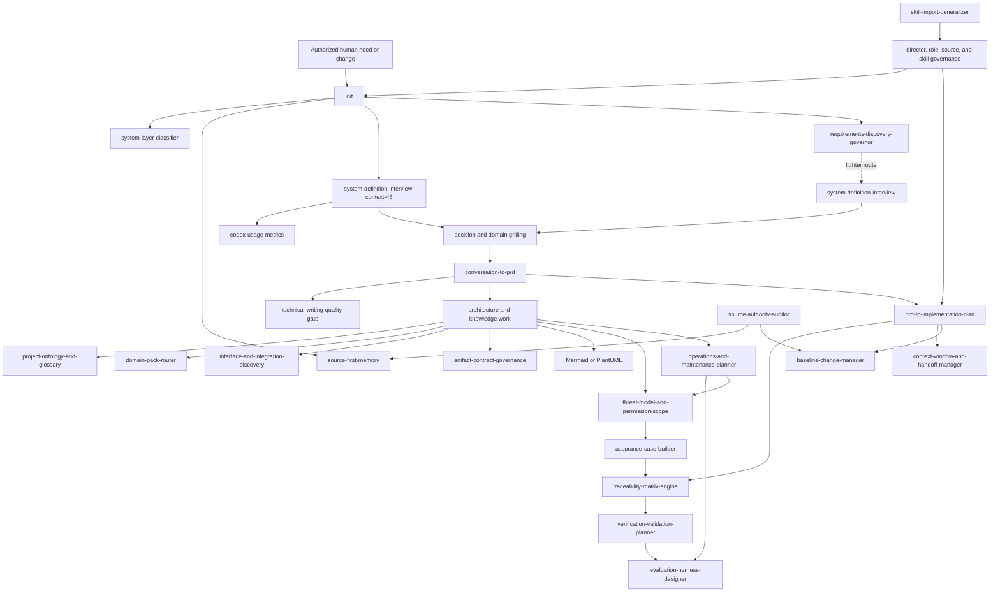

# Sys4AI Core Skills and Their HarborLight Application

- **Status:** Controlled explanatory guide
- **Scope:** All 32 registered Sys4AI product skill packages, their active Sys4AI-dev runtime counterparts, and their illustrative application to the fictional HarborLight target project
- **Evidence snapshot:** 2026-07-15
- **Authority boundary:** This guide explains current skill, role, dependency, and lifecycle relationships. It does not activate a skill, bind a role, grant permission, approve an artifact, or create HarborLight target authority.

> The registered product skill inventory remains in
> [`skill_registry.csv`](../Sys4AI/registries/skill_registry.csv), with lifecycle
> meanings in
> [`skill_lifecycle_status_registry.csv`](../Sys4AI/registries/skill_lifecycle_status_registry.csv)
> and package declarations in
> [`core_skill_manifest.yaml`](../Sys4AI/skills/core_skill_manifest.yaml).
> Registered role declarations remain in
> [`role_registry.csv`](../Sys4AI/registries/role_registry.csv), and conditional
> role-to-skill bindings remain in
> [`role_skill_crosswalk.csv`](../Sys4AI/registries/role_skill_crosswalk.csv).
> The active development-runtime inventory and dependencies remain in
> [`SKILL_REGISTRY.yaml`](../.agents/skill_registry/SKILL_REGISTRY.yaml) and the
> individual `.agents/skills/*/skill.yaml` manifests. The accepted target-system
> lifecycle remains in the
> [Phase 0 Product and System-Design PRD](../PRDs/Sys4AI_phase-0_product_system_design_prd.md).
> See [`roles_guide.md`](roles_guide.md) for the role-focused companion and
> [`project_role_skills_overview.md`](project_role_skills_overview.md) for the
> combined audit narrative.

## 1. Purpose and scope

This guide answers five questions for every core skill:

1. What procedure does the skill provide?
2. Which skills does it depend on, support, or commonly precede?
3. Which registered roles declare or conditionally bind the skill?
4. Which roles may operate its active Sys4AI-dev runtime adaptation?
5. Where does it contribute in the target lifecycle and in the fictional
   HarborLight project?

The guide covers all 32 rows in the product skill registry. It does not imply
that every skill runs in every project or that every runtime posture owns the
artifact being produced.

### 1.1 What “core skill” means

The repository has two distinct 32-skill surfaces:

| Surface | Current state | Meaning |
|---|---|---|
| `Sys4AI/skills/core` and `skill_registry.csv` | 31 `adapter_shell` packages and one `product_scaffold_reference` package | Framework-product references for adaptation into future runtimes. The registered lifecycle vocabulary says these packages may not execute as runtime authority. |
| `.agents/skills` and `.agents/skill_registry/SKILL_REGISTRY.yaml` | 32 `adapted_runtime_active` packages | Active procedures for the Sys4AI-dev **development system**, within each skill's manifest, role, permission, and transaction limits. |
| `.codex/skills` | Compatibility shims | Pointers to the `.agents` runtime surface, not independent behavior or authority. |
| HarborLight target runtime | Not present | No HarborLight skill registry, adapted packages, role bindings, permissions, validators, or promotion records currently exist in this repository. |

Accordingly, **core** means the complete registered Sys4AI skill catalog. It
does not mean that a package is automatically installed, executable, required,
or authorized in a generated target system.

### 1.2 How to interpret “who uses a skill”

Three evidence surfaces answer different questions:

- **Role-row declaration:** A role lists the skill as required, optional, or
  forbidden. This is the role's general skill-set declaration.
- **Controlled crosswalk:** A role-skill row adds the binding type, trigger,
  layer scope, invocation policy, authority status, and evidence source. This
  is the more specific conditional relationship.
- **Runtime posture:** A runtime manifest lists role postures capable of
  operating the adapted procedure in the Sys4AI-dev host. It does not transfer
  artifact ownership, approval authority, or target-system permission.

These surfaces are deliberately reported separately below. Where they differ,
use the narrower controlled condition and the active system layer. No role row
or crosswalk currently forbids a skill, but role execution bindings and skill
authority sections still prohibit specific actions.

### 1.3 Project phases and lifecycle stages

The informal three-phase model maps to the accepted lifecycle as follows:

| Informal phase | Accepted target lifecycle | Skill relationship |
|---|---|---|
| Initiation | `/init` plus `Design` | Classify the system and layer; inspect authority; discover needs; clarify decisions and domain evidence; create requirements, architecture, risk, operations, trace, and verification plans. |
| Implementation | `Develop -> Implement -> Test`, followed by accountable approval to enter `Run` | Plan bounded work; implement against baselines; manage interfaces and handoffs; preserve traceability; verify, validate, evaluate, and assemble release evidence. |
| Maintenance and improvement | `Run -> Maintain -> Test -> Run`; `Improve` re-enters the earliest affected stage; `Retire` closes service and authority | Monitor and operate under approved procedures; control changes and rollback; reassess sources, risks, and evidence; route improvements; revoke access, dispose of data, and archive evidence at retirement. |

`/init` is a routing skill, not a ninth lifecycle stage. A skill may be
cross-cutting, but it should be invoked only when its trigger and authority
conditions are satisfied.

## 2. How the skills relate

Skills compose procedures; they do not inherit one another's authority. The
major flow is:



Solid arrows show a normal procedural sequence or required dependency. Dotted
arrows show a common optional route. The canonical dependency list for a
specific invocation remains in the active runtime manifest.

### 2.1 Relationship patterns

| Pattern | Skills | Relationship |
|---|---|---|
| Entry and authority routing | `init`, `system-layer-classifier`, `source-first-memory`, `director-decision-governor`, `role-catalog-governance` | Establish the subject system, evidence, role route, and approval boundary before controlled work. |
| Discovery and clarification | `system-definition-interview`, `system-definition-interview-context-45`, both decision-grilling variants, both domain-grilling variants, `requirements-discovery-governor`, `conversation-to-prd`, `codex-usage-metrics` | Move from uncertain intent and evidence to reviewable discovery and requirements material without hiding open questions. |
| Architecture and shared meaning | `project-ontology-and-glossary`, `domain-pack-router`, `interface-and-integration-discovery`, `artifact-contract-governance`, `mermaid-diagrams`, `plantuml-diagrams`, `source-authority-auditor` | Define terminology, external boundaries, artifact contracts, views, and source precedence. |
| Planning and controlled change | `prd-to-implementation-plan`, `traceability-matrix-engine`, `context-window-and-handoff-manager`, `baseline-change-manager`, `skill-import-generalizer`, `technical-writing-quality-gate` | Convert accepted intent into bounded work while preserving provenance, clarity, resumability, baseline identity, and change evidence. |
| Assurance, evaluation, and operations | `verification-validation-planner`, `evaluation-harness-designer`, `threat-model-and-permission-scope`, `assurance-case-builder`, `operations-and-maintenance-planner` | Define how correctness, stakeholder fitness, behavior, risk, readiness, incidents, maintenance, and retirement will be evidenced and reviewed. |

### 2.2 Lifecycle relationship map

| Lifecycle point | Principal skills | Roles that primarily operate or govern them | HarborLight result |
|---|---|---|---|
| Before Design | `init`; `system-layer-classifier`; `source-first-memory`; `director-decision-governor`; `role-catalog-governance`; conditional `domain-pack-router` | System Director; User Wants Elicitor; Existing System Analyst; Documentation Librarian; Domain Specialist | HarborLight is classified as a brownfield target-system proposal, evidence is inspected, missing domain authority is routed, and approval is requested before controlled artifacts. |
| Design discovery | Interview, decision-grilling, domain-grilling, metrics/checkpoint, discovery-governance, ontology, source-audit, and PRD skills | User Wants Elicitor; Existing System Analyst; Requirements Manager; Domain Specialist; Context/Memory Architect; Documentation Librarian | Stakeholder needs, shelter workflows, data sources, human decision limits, unresolved gaps, and candidate requirements become reviewable evidence. |
| Design architecture and readiness | Interface, artifact-contract, diagram, traceability, threat, assurance, V&V, evaluation, operations, writing, and implementation-planning skills | System Architect; Technical Requirements Engineer; Requirements Verifier; Security Reviewer; Verification Engineer; Runtime/Maintenance Planner; SVC Architect | Interfaces, risks, evidence obligations, operating duties, build packets, and readiness criteria are connected to accepted requirements. |
| Develop | Implementation planning; traceability; baseline; handoff; writing; diagrams; source audit; conditional skill import; threat and evaluation updates | Software Engineer; System Engineer posture; SVC Architect; Verification Engineer; Documentation Librarian | Bounded HarborLight components and configuration are built against identified sources and baselines with reviewable evidence. |
| Implement | Interface discovery; artifact contracts; baseline management; threat/permission scope; traceability; V&V planning; handoff management | Software Engineer; System Architect; Integration Owner; Security Reviewer; Verification Engineer | The staging candidate, integrations, credentials, configuration, migrations, and rollback path are assembled under explicit authority. |
| Test | V&V planning; evaluation harness; traceability; assurance case; writing gate; source audit; domain review | Verification Engineer; Requirements Verifier; Domain Specialist; Security Reviewer; independent HarborLight Evaluation Lead | Test execution, requirements verification, stakeholder validation, behavioral evaluation, residual risk, and release recommendation remain separately evidenced. |
| Run | Operations planning outputs; source-first memory; source audit; handoff; traceability; threat and assurance review; evaluation cadence; baseline identity | Runtime/Maintenance Planner defines obligations; named HarborLight human service, operator, data, security, privacy, support, and case-decision roles execute or review target procedures | HarborLight operates only within approved sources, permissions, runbooks, monitoring, escalation, and human decision gates. |
| Maintain | Baseline, implementation-plan, operations, interface, handoff, source-audit, traceability, V&V, evaluation, and writing skills | Software Engineer; Bounded Execution Planner; Runtime/Maintenance Planner; SVC Architect; Verification and assurance roles | A bounded change is identified, implemented, regression-tested, and approved before returning to Run. |
| Improve | Entry/routing skills plus the affected discovery, requirements, architecture, planning, risk, evaluation, and change skills | System Director and every affected baseline owner; accountable HarborLight Sponsor and Release Authority | Evidence-backed proposals return to the earliest affected stage rather than directly mutating production. |
| Retire | Operations, baseline, threat/permission, source-audit, artifact-contract, traceability, handoff, assurance, and verification skills | Runtime/Maintenance Planner; SVC Architect; Security Reviewer; Verification; named HarborLight data, privacy, integration, records, service, and retirement authorities | Shutdown, credential revocation, data disposition, dependency closure, archive integrity, notification, and residual obligations are evidenced. |

## 3. Core skill profiles

Each profile distinguishes general role declarations, condition-specific
crosswalk bindings, active development-runtime postures, and proposed
HarborLight use. Role identifiers appear in code formatting where precision is
important.

### 3.1 Entry and governance skills

#### 3.1.1 `init`

- **Function:** Provides the reversible greenfield/brownfield Sys4AI adoption
  and system-definition front door before PRD, implementation-plan,
  transaction, or scaffold creation.
- **Registered users:** The crosswalk requires it for the User Wants Elicitor
  when definition/adoption starts, the Existing System Analyst for brownfield
  first-pass classification, and the System Director for entry routing. No
  role row separately declares it.
- **Development-runtime postures:** System Analyst, System Engineer, Software
  Engineer, User Wants Elicitor, and System Director.
- **Relationships:** Requires `system-layer-classifier`,
  `source-first-memory`, `system-definition-interview-context-45`, and
  `requirements-discovery-governor`; optionally routes to PRD synthesis,
  implementation planning, interface discovery, and operations planning.
- **Lifecycle relationship:** Runs before Design or at a newly authorized
  adoption/re-entry point. It classifies and proposes a route; it does not
  perform every downstream stage.
- **HarborLight application:** The Sponsor authorizes exploration; the System
  Director, Elicitor, and Existing System Analyst classify the brownfield
  shelter workflow and ask approval before creating controlled discovery or
  adoption artifacts.

#### 3.1.2 `system-layer-classifier`

- **Function:** Distinguishes development-system, framework-product,
  target-template, target-instance, and derivative work before mutation.
- **Registered users:** Required by the System Director's role row and
  crosswalk before controlled authority is mutated.
- **Development-runtime postures:** System Director.
- **Relationships:** Is a required `init` dependency and may use
  `source-first-memory` to locate the registered layer definition.
- **Lifecycle relationship:** Entry and every controlled change, especially
  Improve or self-hosting work where the subject system can be confused.
- **HarborLight application:** Prevents HarborLight target requirements,
  project roles, or runtime procedures from being silently written into the
  Sys4AI-dev or framework-product layers.

#### 3.1.3 `director-decision-governor`

- **Function:** Governs Director Decision Records for routing, authority
  expansion, bounded job creation, and supersession.
- **Registered users:** Required by the System Director role row and controlled
  crosswalk when routing is not already determined; optional in Bounded
  Execution Planner and superseded Control Loop Planner role rows.
- **Development-runtime postures:** System Director.
- **Relationships:** Commonly follows layer and source classification; may use
  source-first memory and traceability evidence before recording a route.
- **Lifecycle relationship:** Cross-lifecycle governance at entry, gates,
  change routing, return paths, and retirement decisions.
- **HarborLight application:** Records the governed route while the Sponsor or
  Release Authority retains human approval for scope, risk, release, and
  retirement.

#### 3.1.4 `role-catalog-governance`

- **Function:** Governs role registry rows, role-to-skill crosswalks, and role
  execution bindings.
- **Registered users:** The controlled crosswalk requires the System Director
  when role-catalog governance is needed. No role row currently declares the
  skill.
- **Development-runtime postures:** System Director and Documentation Librarian.
- **Relationships:** Uses layer classification to prevent cross-layer role
  expansion and may use source-first memory and the writing gate during review.
- **Lifecycle relationship:** Before or across stages whenever a role,
  conditional skill use, authority limit, or execution binding must change.
- **HarborLight application:** Audits the 15 proposed project responsibilities
  and routes any promotion into a target/domain catalog. It cannot turn the
  fictional roles into active authority by documenting them here.

#### 3.1.5 `source-first-memory`

- **Function:** Uses memory as navigation to registered authority and requires
  canonical source inspection before consequential claims or routing.
- **Registered users:** Required by the Context Memory and Knowledge Architect,
  generic System Analyst, deprecated Control Loop Engineer, and temporary Skill
  Integration Agent role rows; optional for the System Director, Existing
  System Analyst, Implementation Initialization Agent, Software Engineer, and
  several temporary legacy roles. The controlled crosswalk specifically binds
  the Context Memory and Knowledge Architect.
- **Development-runtime postures:** System Analyst, System Engineer, Software
  Engineer, Documentation Librarian, and Bounded Execution Planner.
- **Relationships:** Required by `init`; commonly supports handoffs,
  traceability, layer classification, and source-authority audits.
- **Lifecycle relationship:** All stages wherever prior evidence, state, or
  source-backed retrieval affects a decision.
- **HarborLight application:** Service Operators may locate likely shelter
  records or runbook guidance, but consequential capacity, accessibility, or
  emergency guidance must be checked against registered current sources.

### 3.2 Discovery and clarification skills

#### 3.2.1 `system-definition-interview`

- **Function:** Elicits stakeholder intent, boundaries, actors, scenarios,
  candidate requirements, architecture drivers, interfaces, and V&V seeds.
- **Registered users:** Optional for the User Wants Elicitor when lightweight
  discovery is sufficient; required by the temporary System Definition
  Template Agent role row.
- **Development-runtime postures:** System Analyst, System Engineer, Software
  Engineer, and Requirements Verifier.
- **Relationships:** May route to decision clarification, PRD synthesis, or
  implementation planning; `requirements-discovery-governor` controls whether
  evidence is ready to advance.
- **Lifecycle relationship:** Design and material Improve re-entry when a short
  interview is sufficient.
- **HarborLight application:** The Elicitor interviews the Sponsor, Emergency
  Coordination Lead, Shelter Liaison, Accessibility/Medical Specialist, and
  operational owners to capture bounded needs and unresolved gaps.

#### 3.2.2 `system-definition-interview-context-45`

- **Function:** Runs long-form system discovery with context metrics,
  threshold-only temporary checkpoints, resumable handoff, and explicit
  approval before PRD synthesis.
- **Registered users:** Required by the User Wants Elicitor role row and
  crosswalk for a new or substantially changed system definition.
- **Development-runtime postures:** System Analyst, System Engineer, Software
  Engineer, Requirements Verifier, and Bounded Execution Planner.
- **Relationships:** Requires `codex-usage-metrics`; may route to focused
  decision clarification, PRD synthesis, or implementation planning after
  discovery is complete.
- **Lifecycle relationship:** Primary long-session Design discovery route and
  a possible Improve re-entry route.
- **HarborLight application:** Preserves a lengthy multi-stakeholder shelter
  discovery across context boundaries without treating `temp_prd.md` or a
  conversation as an approved USRD.

#### 3.2.3 `decision-grilling`

- **Function:** Resolves one plan, requirement, architecture, or
  implementation decision at a time until alternatives, constraints, and the
  decision are explicit.
- **Registered users:** Required by System Architect, Reconciliation Analyst,
  Reconciled Architecture Architect, and generic System Analyst role rows;
  optional for Requirements Manager and System Engineer. The controlled
  crosswalk specifically requires it for unclear architecture decisions.
- **Development-runtime postures:** System Analyst, System Engineer, and
  Software Engineer.
- **Relationships:** Often follows interview evidence and may feed PRD or
  implementation-plan synthesis.
- **Lifecycle relationship:** Design, Test disposition, Maintain planning, and
  Improve when a bounded decision is unresolved.
- **HarborLight application:** Clarifies a single issue such as human case
  authority, degraded-mode behavior, data isolation, or a provider-integration
  tradeoff with the responsible project owners.

#### 3.2.4 `decision-grilling-context-45`

- **Function:** Extends focused decision clarification across a long session
  with metric checkpoints and resumable handoff.
- **Registered users:** Optional for the User Wants Elicitor in the role row and
  crosswalk when discovery contains a focused decision needing structured
  clarification.
- **Development-runtime postures:** System Analyst, System Engineer, Software
  Engineer, and Bounded Execution Planner.
- **Relationships:** Requires `codex-usage-metrics`; may route to PRD or
  implementation-plan synthesis only after the decision work is complete.
- **Lifecycle relationship:** Long Design or Improve decisions.
- **HarborLight application:** Supports an extended decision involving the
  Sponsor, Emergency Coordination Lead, Privacy/Security owners, and Release
  Authority without conflating that decision with the entire project interview.

#### 3.2.5 `domain-grilling-with-docs`

- **Function:** Stress-tests plans and terminology against controlled project
  documentation, source hierarchy, ADRs, and domain rules.
- **Registered users:** Required by Existing System Analyst and Domain
  Specialist role rows; the controlled crosswalk requires it for the Existing
  System Analyst when brownfield evidence needs domain stress testing.
- **Development-runtime postures:** System Analyst, System Engineer, Software
  Engineer, and Documentation Librarian.
- **Relationships:** May use decision clarification and the writing gate; its
  findings can update discovery, ontology, architecture, or change analysis.
- **Lifecycle relationship:** Brownfield Design, Test validation, Maintain,
  and Improve.
- **HarborLight application:** The Emergency Coordination Lead, Shelter Liaison,
  and Guidance Owner compare actual shelter and call-center practice with
  controlled procedures instead of accepting documents at face value.

#### 3.2.6 `domain-grilling-with-docs-context-45`

- **Function:** Runs a long documentation-aware domain review with metrics,
  threshold checkpoints, and resumable handoff.
- **Registered users:** Recommended, not required, by the controlled crosswalk
  for the Domain Specialist when long documentation review needs checkpointing;
  no role row separately declares it.
- **Development-runtime postures:** System Analyst, System Engineer, Software
  Engineer, Documentation Librarian, and Bounded Execution Planner.
- **Relationships:** Requires `codex-usage-metrics`; may use the base domain
  review, writing gate, PRD synthesis, and implementation planning.
- **Lifecycle relationship:** Conditional Design, Test, and Improve work.
- **HarborLight application:** Supports the Accessibility/Medical Specialist
  and Domain Specialist through extended review of emergency-management,
  accessibility, transportation, language-access, and medical-support evidence.

#### 3.2.7 `requirements-discovery-governor`

- **Function:** Governs Requirements Discovery Record creation and the
  discovery-to-USRD transition.
- **Registered users:** Optional controlled bindings for the User Wants
  Elicitor when discovery readiness must be governed and the Requirements
  Manager when discovery evidence approaches a requirements baseline. No role
  row separately declares it.
- **Development-runtime postures:** User Wants Elicitor and Requirements Manager.
- **Relationships:** Required by `init`; may route to either interview variant,
  PRD synthesis, and traceability work.
- **Lifecycle relationship:** Design entry and material Improve re-entry.
- **HarborLight application:** Keeps missing stakeholders, shelter evidence,
  source conflicts, and approval gaps open until the Sponsor and responsible
  project owners have supplied adequate evidence.

#### 3.2.8 `conversation-to-prd`

- **Function:** Synthesizes sufficient conversation and repository evidence
  into structured PRD material after discovery.
- **Registered users:** Required by the Requirements Manager role row and
  controlled crosswalk when producing requirements; optional for the User
  Wants Elicitor after discovery and explicit approval, and optional in generic
  System Analyst and temporary template-agent role rows.
- **Development-runtime postures:** System Analyst, System Engineer, Software
  Engineer, and Requirements Verifier.
- **Relationships:** May use decision clarification, the base interview, and
  the writing gate; its output precedes technical planning and traceability.
- **Lifecycle relationship:** Design synthesis and requirements-impact work
  after an Improve decision.
- **HarborLight application:** Converts accepted stakeholder and brownfield
  evidence into requirements material for project-owner review; it does not
  approve policy, domain truth, or the requirements baseline.

#### 3.2.9 `codex-usage-metrics`

- **Function:** Captures Codex context, token, and rate-limit metrics into a
  local receipt without exporting conversation content.
- **Registered users:** Required by the temporary Skill Dependency Adaptation
  Agent role row and optional for the deprecated Control Loop Engineer. The
  controlled crosswalk requires it for the Bounded Execution Planner when
  transaction context accounting is needed; a second required crosswalk is
  retained only for the superseded Control Loop Planner.
- **Development-runtime postures:** System Analyst, System Engineer, Software
  Engineer, and Verification Engineer.
- **Relationships:** Required by all three context-45 interview/grilling
  variants and optionally supports handoff management.
- **Lifecycle relationship:** Cross-lifecycle development-work support, not a
  target product telemetry capability.
- **HarborLight application:** A target-adapted equivalent could help the
  Engineering Owner or Evaluation Lead checkpoint a long governed work
  session. It must not collect HarborLight user content or masquerade as
  service monitoring.

### 3.3 Architecture, knowledge, and communication skills

#### 3.3.1 `project-ontology-and-glossary`

- **Function:** Maintains controlled vocabulary, ontology, and term decisions.
- **Registered users:** The crosswalk requires the Documentation Librarian when
  controlled terminology is needed; no role row separately declares it.
- **Development-runtime postures:** Documentation Librarian.
- **Relationships:** May use source-authority audit and the writing gate;
  `domain-pack-router` can route specialized vocabulary outside the core.
- **Lifecycle relationship:** Design through Retire whenever definitions or
  controlled terms change.
- **HarborLight application:** The Emergency Coordination Lead, Accessibility
  Specialist, Guidance Owner, and Data Steward define terms such as capacity,
  accessible placement, verified guidance, escalation, and stale source under
  a target-scoped owner. The framework Librarian's binding does not itself
  grant target authority.

#### 3.3.2 `domain-pack-router`

- **Function:** Detects when project-specific specialization belongs in a
  governed domain pack rather than core Sys4AI authority.
- **Registered users:** Optional controlled bindings for the Domain Specialist
  when domain-specific routing is needed and the System Director when the
  core/domain boundary is disputed. No role row separately declares it.
- **Development-runtime postures:** Domain Specialist and System Director.
- **Relationships:** May use the project ontology and source-authority audit to
  describe the specialization and its evidence.
- **Lifecycle relationship:** Design and Improve, with re-review when domain
  policy or evidence materially changes.
- **HarborLight application:** Routes emergency-management, accessibility,
  medical-support, public-guidance, and local-policy procedures into a proposed
  HarborLight domain pack rather than broadening generic core skills.

#### 3.3.3 `interface-and-integration-discovery`

- **Function:** Identifies external systems, interfaces, data flows, owners,
  dependencies, and integration risks.
- **Registered users:** Optional in the System Architect role row and
  controlled crosswalk when external interfaces or integrations are unclear.
- **Development-runtime postures:** System Architect.
- **Relationships:** May feed artifact contracts, threat/permission scope, and
  Mermaid diagrams.
- **Lifecycle relationship:** Brownfield Design, Implement planning, and any
  Maintain/Improve change that affects an interface.
- **HarborLight application:** The Shelter Liaison, Data Steward, Integration
  Owner, Security Owner, and Engineering Owner map shelter feeds, alerts,
  identity, messaging, case management, audit, credentials, and shutdown owners.

#### 3.3.4 `artifact-contract-governance`

- **Function:** Governs artifact sections, producer and consumer roles,
  validation obligations, and compatibility expectations.
- **Registered users:** Optional in the System Architect, Reconciled
  Architecture Architect, and Context Memory/Knowledge Architect role rows;
  the controlled crosswalk binds the System Architect when artifact contracts
  need validation.
- **Development-runtime postures:** System Architect and Documentation Librarian.
- **Relationships:** May use source-first memory and the writing gate; interface,
  traceability, and V&V work consume its contracts.
- **Lifecycle relationship:** Design through Improve and Retire for controlled
  data, evidence, handoff, evaluation, and closure artifacts.
- **HarborLight application:** The Data Steward, Integration Owner, Evaluation
  Lead, and Records Owner define contracts for capacity data, case evidence,
  interface messages, handoffs, test results, release records, and retirement evidence.

#### 3.3.5 `mermaid-diagrams`

- **Function:** Creates and validates source-controlled Mermaid diagrams with
  explicit visual grammar.
- **Registered users:** Required by System Architect and Reconciled
  Architecture Architect role rows; the controlled crosswalk requires it for
  the System Architect when Mermaid diagrams are needed.
- **Development-runtime postures:** System Analyst, System Engineer, Software
  Engineer, and Documentation Librarian.
- **Relationships:** May use the writing gate; often visualizes interface,
  artifact, threat, trace, lifecycle, and handoff findings.
- **Lifecycle relationship:** Design through Maintain and updated Improve work.
- **HarborLight application:** The System Architect creates reviewable actor,
  trust-boundary, shelter-data-flow, escalation, lifecycle, and incident-route
  diagrams for the Integration, Data, Security, Service, and domain owners.

#### 3.3.6 `plantuml-diagrams`

- **Function:** Creates and validates source-grounded PlantUML diagrams with
  portable include and rendering discipline.
- **Registered users:** Required by the System Architect role row and
  controlled crosswalk when PlantUML views are needed.
- **Development-runtime postures:** System Analyst, System Engineer, Software
  Engineer, and Documentation Librarian.
- **Relationships:** May use the writing gate and consumes architecture,
  interface, artifact, and deployment evidence.
- **Lifecycle relationship:** Design through Maintain when detailed component,
  sequence, deployment, or integration views are the selected source format.
- **HarborLight application:** The System Architect and Engineering/Integration
  owners use detailed views to review provider interactions, deployment zones,
  credential boundaries, and degraded-mode sequences.

#### 3.3.7 `source-authority-auditor`

- **Function:** Audits canonical sources, derivatives, stale documents, and
  authority inversions.
- **Registered users:** Required by Documentation Librarian, Context
  Memory/Knowledge Architect, SVC/Documentation Surface Architect, and temporary
  Derivative Generator Engineer role rows. Controlled crosswalks specifically
  bind the Librarian and Context/Memory Architect under source-review conditions.
- **Development-runtime postures:** Documentation Librarian and Context Memory
  and Knowledge Architect.
- **Relationships:** Complements source-first memory and baseline management;
  may also support threat, ontology, and artifact-contract reviews.
- **Lifecycle relationship:** All stages, with high importance in Run,
  Maintain, Improve, and Retire as sources age or are superseded.
- **HarborLight application:** The Guidance Owner, Data Steward, Service
  Operator, and Records Owner keep generated summaries, dashboards, caches,
  obsolete runbooks, and archives subordinate to registered current sources.

### 3.4 Planning, execution, and change skills

#### 3.4.1 `prd-to-implementation-plan`

- **Function:** Converts accepted requirements, specifications, issues, or
  briefs into bounded implementation plans and task packets.
- **Registered users:** Required by Technical Requirements Engineer, Final
  Requirements Packager, Implementation Initialization Agent, Software
  Engineer, and generic System Engineer role rows. The controlled crosswalk
  specifically requires it for the Technical Requirements Engineer when a
  technical plan is needed.
- **Development-runtime postures:** System Analyst, System Engineer, Software
  Engineer, and Requirements Verifier.
- **Relationships:** Follows accepted requirements; may use PRD synthesis and
  the writing gate and feeds traceability, handoff, baseline, and V&V work.
- **Lifecycle relationship:** Design exit, Develop, Implement, Maintain, and
  approved Improve work.
- **HarborLight application:** The Engineering and Maintenance Owner decomposes
  the accepted SRP into authorized packets with dependencies, verification
  obligations, stop conditions, rollback, and handoff evidence.

#### 3.4.2 `traceability-matrix-engine`

- **Function:** Maintains traceability from intent and requirements through
  implementation, validation, handoff, operations, change, and retirement evidence.
- **Registered users:** Required by the Requirements Verifier role row;
  optional for Requirements Manager, Reconciliation Analyst, and Final
  Requirements Packager. Controlled crosswalks bind Requirements Verifier as
  required and Requirements Manager as optional under their trace conditions.
- **Development-runtime postures:** Requirements Manager and Requirements Verifier.
- **Relationships:** May use source-first memory and the writing gate; V&V,
  evaluation, assurance, baseline, and release decisions consume its links.
- **Lifecycle relationship:** All stages.
- **HarborLight application:** The Evaluation Lead and Requirements Verifier
  connect each stakeholder need to requirements, architecture, code/config,
  tests, risk controls, operational evidence, maintenance changes, and
  retirement closure for Release Authority review.

#### 3.4.3 `context-window-and-handoff-manager`

- **Function:** Manages context checkpoints, resumable handoffs, and
  continuation evidence.
- **Registered users:** Required by Bounded Execution Planner and superseded
  Control Loop Planner role rows. The controlled crosswalk requires it for the
  current Bounded Execution Planner; a historical required crosswalk remains
  superseded with the old planner.
- **Development-runtime postures:** Bounded Execution Planner.
- **Relationships:** May use source-first memory and usage metrics; it preserves
  the state of any long-running governed procedure without changing its owner.
- **Lifecycle relationship:** Cross-lifecycle execution, incident, shift,
  maintenance, improvement, and retirement handoffs.
- **HarborLight application:** The Engineering Owner, Service Operator,
  Security Incident Owner, and Records Owner preserve source evidence, current
  state, open risks, stop conditions, and next-owner actions across sessions or shifts.

#### 3.4.4 `baseline-change-manager`

- **Function:** Governs baselines, supersession, migrations, rollback, and
  change evidence.
- **Registered users:** Required by Bounded Execution Planner and
  SVC/Documentation Surface Architect role rows; the controlled crosswalk
  specifically requires it for the SVC Architect when baselines or
  supersession change.
- **Development-runtime postures:** SVC and Documentation Surface Architect.
- **Relationships:** May use source-authority audit and traceability; consumes
  approved change decisions and supplies release, rollback, and retirement evidence.
- **Lifecycle relationship:** Develop through Retire, especially Implement,
  Maintain, and Improve.
- **HarborLight application:** Release, Guidance, Data, Integration, Security,
  Service, Engineering, and Records owners use identified versions, migration
  evidence, additive history, and rollback/revocation baselines.

#### 3.4.5 `skill-import-generalizer`

- **Function:** Converts project-specific skills into reusable or project-fit
  packages while preserving provenance and adaptation boundaries.
- **Registered users:** Required by Documentation Librarian and temporary Skill
  Surface, Skill Dependency Adaptation, and Skill Integration role rows. The
  controlled crosswalk specifically binds the Documentation Librarian when
  skill import is governed.
- **Development-runtime postures:** System Analyst, System Engineer, Software
  Engineer, and Documentation Librarian.
- **Relationships:** May use the writing gate and must remain subordinate to
  role governance, layer classification, lifecycle status, and target promotion.
- **Lifecycle relationship:** Framework/development skill governance before a
  target can use an adapted procedure; not an ordinary HarborLight lifecycle operation.
- **HarborLight application:** It could prepare a candidate target adaptation,
  but no HarborLight project role currently has authority to activate one. A
  separate target registry, provenance review, validator, permission scope,
  and accountable promotion are required.

#### 3.4.6 `technical-writing-quality-gate`

- **Function:** Reviews claim-bearing technical prose for source grounding,
  concrete mechanisms, ambiguous language, measurable criteria, and explicit
  pass/repair/block outcomes.
- **Registered users:** Required by Requirements Manager, Final Requirements
  Packager, Requirements Verifier, Verification Engineer, generic System
  Engineer, and five temporary legacy roles; optional for Domain Specialist,
  Documentation Librarian, SVC Architect, and two temporary skill roles.
  Controlled crosswalks require it for Requirements Manager before baseline
  and Requirements Verifier before requirements acceptance.
- **Development-runtime postures:** System Analyst, System Engineer, Software
  Engineer, Verification Engineer, and Documentation Librarian.
- **Relationships:** Supports discovery synthesis, diagrams, plans, ontology,
  traceability, V&V, evaluation, and assurance; it does not prove domain truth.
- **Lifecycle relationship:** Cross-cutting wherever technical claims or
  controlled instructions are authored or changed.
- **HarborLight application:** The Guidance Owner, Accessibility Specialist,
  Evaluation Lead, Engineering Owner, and Records Owner use it to remove vague
  requirements, unsupported claims, ambiguous owners, and untestable criteria.

### 3.5 Assurance, evaluation, and operations skills

#### 3.5.1 `verification-validation-planner`

- **Function:** Converts requirements into verification and validation plans,
  matrices, methods, and evidence obligations.
- **Registered users:** Required by Technical Requirements Engineer,
  Verification Engineer, temporary Validator Engineer, and temporary Acceptance
  Engineer role rows; optional for Requirements Verifier and Security Reviewer.
  Controlled crosswalks require it for Technical Requirements Engineer and
  Verification Engineer and make it optional for Requirements Verifier.
- **Development-runtime postures:** Technical Requirements Engineer,
  Requirements Verifier, and Verification Engineer.
- **Relationships:** May use traceability and the writing gate and provides the
  evidence plan consumed by evaluation and assurance work.
- **Lifecycle relationship:** Design and Test, then affected regression in
  Maintain/Improve and closure checks in Retire.
- **HarborLight application:** The Independent Validation and Evaluation Lead
  separates test execution, requirements verification, stakeholder/system
  validation, and behavioral evaluation while project owners supply domain,
  integration, privacy, security, and operational evidence.

#### 3.5.2 `evaluation-harness-designer`

- **Function:** Designs scenarios, rubrics, regression checks, failure probes,
  and protected holdouts.
- **Registered users:** Required by the Verification Engineer role row and
  optional for the Runtime/Maintenance Planner. Controlled crosswalks preserve
  those same required and optional relationships under evaluation conditions.
- **Development-runtime postures:** Runtime and Maintenance Planner and
  Verification Engineer.
- **Relationships:** May use V&V planning and the writing gate; operations
  planning may invoke it for cadence and failure probes without setting its
  own acceptance threshold.
- **Lifecycle relationship:** Design/Test, then scheduled or change-triggered
  regression in Run, Maintain, and Improve.
- **HarborLight application:** The Evaluation Lead, Accessibility Specialist,
  Security Owner, and domain owners design representative and adverse cases for
  stale sources, accessibility, human escalation, tool failure, and outcome
  quality; Release Authority remains the gate owner.

#### 3.5.3 `threat-model-and-permission-scope`

- **Function:** Identifies autonomy, tool, data, privacy, security, and
  permission risks and their controls.
- **Registered users:** Required by the Security/Safety/Privacy/Compliance
  Reviewer role row and controlled crosswalk whenever safety or privacy risk is present.
- **Development-runtime postures:** Security/Safety/Privacy/Compliance Reviewer.
- **Relationships:** May use source-authority audit and assurance-case work;
  interface and operations skills supply data flows, actors, tools, and incident contexts.
- **Lifecycle relationship:** All stages, with explicit review before Run,
  after material change or incident, and during retirement revocation/disposition.
- **HarborLight application:** Security, Privacy, Data, and Integration owners
  define tool boundaries, sensitive-data classes, least privilege, abuse cases,
  human gates, degraded behavior, incident controls, and credential revocation.

#### 3.5.4 `assurance-case-builder`

- **Function:** Structures high-impact claims, evidence, and arguments so that
  support, gaps, and residual uncertainty are reviewable.
- **Registered users:** Required by the Security/Safety/Privacy/Compliance
  Reviewer role row and controlled crosswalk when high-impact claims need an
  evidence argument.
- **Development-runtime postures:** Security/Safety/Privacy/Compliance Reviewer.
- **Relationships:** May use threat/permission scope, traceability, and the
  writing gate and consumes actual V&V and evaluation evidence.
- **Lifecycle relationship:** Design through Run, Maintain, Improve, and Retire
  for material safety, security, privacy, reliability, or compliance claims.
- **HarborLight application:** Security and Privacy owners structure the case;
  the Sponsor, Release Authority, Service Owner, and qualified reviewers decide
  whether residual evidence and risk are acceptable. The skill cannot accept risk.

#### 3.5.5 `operations-and-maintenance-planner`

- **Function:** Defines monitoring, incidents, updates, evaluation cadence,
  recovery, maintenance, support, retention, handoff, and retirement obligations.
- **Registered users:** Required by the Runtime and Maintenance Planner role row
  and controlled crosswalk whenever framework or target operations,
  maintenance, or readiness planning is needed.
- **Development-runtime postures:** Runtime and Maintenance Planner.
- **Relationships:** May use evaluation-harness and threat/permission skills;
  its obligations feed architecture, V&V, runbooks, handoffs, baseline changes,
  and retirement evidence.
- **Lifecycle relationship:** Design, Test readiness, Run, Maintain, Improve,
  and Retire.
- **HarborLight application:** Guidance, Security, Production Service,
  Operator, Engineering, Integration, Data, and Records owners turn the plan
  into named human duties. The skill defines obligations; it does not prove
  production readiness or operate HarborLight.

## 4. Complete registered role-usage matrix

This matrix is the exact inventory view. It prevents a summarized profile from
being mistaken for a complete binding list. A crosswalk entry without a matching
role-row declaration remains a valid condition-specific binding; a runtime
posture remains development-host capability rather than target authority.

| Skill | Role-row required | Role-row optional | Crosswalk binding | Active Sys4AI-dev runtime postures |
|---|---|---|---|---|
| `codex-usage-metrics` | `skill_dependency_adaptation_agent` | `control_loop_engineer` | `control_loop_agentjob_planner` (required; superseded); `bounded_execution_planner` (required) | `system_analyst`; `system_engineer`; `software_engineer`; `verification_engineer` |
| `system-definition-interview` | `system_definition_template_agent` | None | `user_wants_elicitor` (optional) | `system_analyst`; `system_engineer`; `software_engineer`; `requirements_verifier` |
| `system-definition-interview-context-45` | `user_wants_elicitor` | None | `user_wants_elicitor` (required) | `system_analyst`; `system_engineer`; `software_engineer`; `requirements_verifier`; `bounded_execution_planner` |
| `conversation-to-prd` | `requirements_manager` | `user_wants_elicitor`; `system_analyst`; `system_definition_template_agent` | `user_wants_elicitor` (optional); `requirements_manager` (required) | `system_analyst`; `system_engineer`; `software_engineer`; `requirements_verifier` |
| `decision-grilling` | `system_architect`; `reconciliation_analyst`; `reconciled_architecture_architect`; `system_analyst` | `requirements_manager`; `system_engineer` | `system_architect` (required) | `system_analyst`; `system_engineer`; `software_engineer` |
| `decision-grilling-context-45` | None | `user_wants_elicitor` | `user_wants_elicitor` (optional) | `system_analyst`; `system_engineer`; `software_engineer`; `bounded_execution_planner` |
| `domain-grilling-with-docs` | `existing_system_analyst`; `domain_specialist` | None | `existing_system_analyst` (required) | `system_analyst`; `system_engineer`; `software_engineer`; `documentation_librarian` |
| `domain-grilling-with-docs-context-45` | None | None | `domain_specialist` (recommended) | `system_analyst`; `system_engineer`; `software_engineer`; `documentation_librarian`; `bounded_execution_planner` |
| `mermaid-diagrams` | `system_architect`; `reconciled_architecture_architect` | None | `system_architect` (required) | `system_analyst`; `system_engineer`; `software_engineer`; `documentation_librarian` |
| `plantuml-diagrams` | `system_architect` | None | `system_architect` (required) | `system_analyst`; `system_engineer`; `software_engineer`; `documentation_librarian` |
| `prd-to-implementation-plan` | `technical_requirements_engineer`; `final_system_requirements_packager`; `implementation_initialization_agent`; `software_engineer`; `system_engineer` | None | `technical_requirements_engineer` (required) | `system_analyst`; `system_engineer`; `software_engineer`; `requirements_verifier` |
| `skill-import-generalizer` | `documentation_librarian`; `skill_surface_engineer`; `skill_dependency_adaptation_agent`; `skill_integration_agent` | None | `documentation_librarian` (required) | `system_analyst`; `system_engineer`; `software_engineer`; `documentation_librarian` |
| `technical-writing-quality-gate` | `requirements_manager`; `final_system_requirements_packager`; `requirements_verifier`; `verification_engineer`; `system_engineer`; `validator_engineer`; `derivative_generator_engineer`; `skill_surface_engineer`; `acceptance_engineer`; `system_definition_template_agent` | `domain_specialist`; `documentation_librarian`; `svc_documentation_surface_architect`; `skill_dependency_adaptation_agent`; `skill_integration_agent` | `requirements_manager` (required); `requirements_verifier` (required) | `system_analyst`; `system_engineer`; `software_engineer`; `verification_engineer`; `documentation_librarian` |
| `source-first-memory` | `context_memory_knowledge_architect`; `system_analyst`; `control_loop_engineer`; `skill_integration_agent` | `system_director`; `existing_system_analyst`; `implementation_initialization_agent`; `software_engineer`; `validator_engineer`; `skill_surface_engineer`; `acceptance_engineer` | `context_memory_knowledge_architect` (required) | `system_analyst`; `system_engineer`; `software_engineer`; `documentation_librarian`; `bounded_execution_planner` |
| `role-catalog-governance` | None | None | `system_director` (required) | `system_director`; `documentation_librarian` |
| `system-layer-classifier` | `system_director` | None | `system_director` (required) | `system_director` |
| `artifact-contract-governance` | None | `system_architect`; `reconciled_architecture_architect`; `context_memory_knowledge_architect` | `system_architect` (optional) | `system_architect`; `documentation_librarian` |
| `traceability-matrix-engine` | `requirements_verifier` | `requirements_manager`; `reconciliation_analyst`; `final_system_requirements_packager` | `requirements_manager` (optional); `requirements_verifier` (required) | `requirements_manager`; `requirements_verifier` |
| `director-decision-governor` | `system_director` | `control_loop_agentjob_planner`; `bounded_execution_planner` | `system_director` (required) | `system_director` |
| `source-authority-auditor` | `documentation_librarian`; `context_memory_knowledge_architect`; `svc_documentation_surface_architect`; `derivative_generator_engineer` | None | `documentation_librarian` (required); `context_memory_knowledge_architect` (required) | `documentation_librarian`; `context_memory_knowledge_architect` |
| `context-window-and-handoff-manager` | `control_loop_agentjob_planner`; `bounded_execution_planner` | None | `control_loop_agentjob_planner` (required; superseded); `bounded_execution_planner` (required) | `bounded_execution_planner` |
| `verification-validation-planner` | `technical_requirements_engineer`; `verification_engineer`; `validator_engineer`; `acceptance_engineer` | `requirements_verifier`; `security_safety_privacy_compliance_reviewer` | `technical_requirements_engineer` (required); `requirements_verifier` (optional); `verification_engineer` (required) | `technical_requirements_engineer`; `requirements_verifier`; `verification_engineer` |
| `assurance-case-builder` | `security_safety_privacy_compliance_reviewer` | None | `security_safety_privacy_compliance_reviewer` (required) | `security_safety_privacy_compliance_reviewer` |
| `threat-model-and-permission-scope` | `security_safety_privacy_compliance_reviewer` | None | `security_safety_privacy_compliance_reviewer` (required) | `security_safety_privacy_compliance_reviewer` |
| `evaluation-harness-designer` | `verification_engineer` | `runtime_maintenance_planner` | `runtime_maintenance_planner` (optional); `verification_engineer` (required) | `runtime_maintenance_planner`; `verification_engineer` |
| `baseline-change-manager` | `bounded_execution_planner`; `svc_documentation_surface_architect` | None | `svc_documentation_surface_architect` (required) | `svc_documentation_surface_architect` |
| `operations-and-maintenance-planner` | `runtime_maintenance_planner` | None | `runtime_maintenance_planner` (required) | `runtime_maintenance_planner` |
| `project-ontology-and-glossary` | None | None | `documentation_librarian` (required) | `documentation_librarian` |
| `domain-pack-router` | None | None | `domain_specialist` (optional); `system_director` (optional) | `domain_specialist`; `system_director` |
| `interface-and-integration-discovery` | None | `system_architect` | `system_architect` (optional) | `system_architect` |
| `requirements-discovery-governor` | None | None | `user_wants_elicitor` (optional); `requirements_manager` (optional) | `user_wants_elicitor`; `requirements_manager` |
| `init` | None | None | `user_wants_elicitor` (required); `existing_system_analyst` (required); `system_director` (required) | `system_analyst`; `system_engineer`; `software_engineer`; `user_wants_elicitor`; `system_director` |

## 5. HarborLight project-role and skill map

HarborLight is a fictional county emergency-shelter coordination assistant. It
would help authorized staff locate shelter capacity, match accessibility and
medical-support needs, summarize verified public guidance, and route
consequential cases to human coordinators. It replaces parts of a brownfield
call-center/spreadsheet workflow, integrates with external systems, handles
sensitive data, uses retrieval and tools, must tolerate emergency conditions,
and preserves human decision authority.

The 15 project roles below are illustrative responsibilities, not registered
Sys4AI roles. **Operate** means a named actor could perform a target-adapted
procedure after target registration and permission. **Review/consume** means a
human owner uses the evidence but retains approval, policy, domain, legal, or
risk judgment.

| HarborLight project role | Main lifecycle relationship | Proposed skill relationship |
|---|---|---|
| Accountable Sponsor / Product Owner | Before Design; Design and Improve gates; continuing accountability through Retire | Reviews Director decisions, assurance cases, V&V plans/results, evaluation evidence, and traceability. Authorizes downstream work but does not operate every skill. |
| Release and Change Authority | Test-to-Run, maintenance release, and material Improve gates | Reviews traceability, V&V, evaluation, assurance, and baseline/rollback evidence. Must remain separate from sole implementation and evaluation. |
| Emergency Coordination Lead / Human Case-Decision Authority | Design and Test domain validation; Run escalation; incident/change re-entry; Retire transition | Supports system interviews and domain grilling, owns target terminology with project specialists, and reviews operations procedures. Human case authority never transfers to a skill. |
| Shelter Operations Liaison | Brownfield Design and interface discovery; Test; provider-change monitoring; Retire closure | Operates domain-document review, interface discovery, and discovery-governance procedures with core role owners. |
| Accessibility and Medical Support Specialist | Design requirements and harm analysis; Test validation; change and retirement review | Uses domain-pack routing, long domain review, evaluation-harness design, and the writing gate for representative cases and measurable criteria. |
| Guidance, Support, and Training Owner | Design content obligations; Develop/Test material; Run/Maintain support; Retire withdrawal | Uses source-authority audit, writing gate, ontology/glossary, baseline management, and operations planning. |
| Shelter Data Steward | Design through Retire | Uses artifact contracts, source audit, ontology/glossary, threat/permission scope, and baseline management for meaning, provenance, access, freshness, versioning, retention, and disposition. |
| Integration and Dependency Owner | Design discovery; Implement; Test support; Run monitoring; Maintain and Retire closure | Uses interface discovery, artifact contracts, baseline management, threat/permission scope, and V&V planning. |
| Privacy and Compliance Owner | Design; Implement/Test review; Run review; change and Retire closure | Operates or reviews threat/permission scope, assurance cases, V&V plans, and baseline-controlled policy/data changes; retains human legal and residual-risk judgment. |
| Security and Incident Owner | Design threat work; Implement/Test review; Run incidents; Maintain/Improve; Retire revocation | Uses threat/permission scope, assurance cases, operations planning, evaluation failure probes, baseline rollback, and handoff evidence. |
| Production Service Owner | Design operability; Test readiness; owns Run; change routing; retirement withdrawal | Reviews operations plans, assurance/evaluation evidence, traceability, baseline identity, and incident/maintenance handoffs. |
| Service Operator | Run; supports Maintain and staged Retire | Operates target procedures derived from operations planning, uses source-first lookup and handoff management, and consumes permission rules without redefining them. |
| Engineering and Maintenance Owner / Change Implementer | Develop/Implement; Test defect repair; Maintain; approved Improve; technical Retire support | Uses implementation planning, baseline management, interface discovery, handoff management, traceability, and V&V obligations. Cannot approve its own release. |
| Independent Validation and Evaluation Lead | Plans in Design; primary in Test; scheduled/triggered Run checks; Maintain/Improve regression; Retire verification | Operates V&V planning, evaluation-harness design, traceability, assurance evidence review, and writing quality checks independently from sole implementation. |
| Records, Archive, and Retirement Owner | Records obligations from Design; custody in Run/Maintain; primary in Retire and residual review | Uses source audit, artifact contracts, baseline management, operations/retirement planning, threat/permission scope, traceability, and handoff evidence. |

### 5.1 Stage-by-stage HarborLight example

1. **Initiation:** The Sponsor authorizes exploration. `init` routes the System
   Director, Elicitor, and Existing System Analyst; layer classification and
   source-first inspection establish that HarborLight is a fictional
   target-instance proposal using brownfield evidence.
2. **Design discovery:** Interview and domain-review skills gather evidence from
   shelter, emergency, accessibility, guidance, data, integration, privacy,
   security, service, and evaluation owners. Discovery governance preserves
   gaps; PRD synthesis happens only after explicit approval.
3. **Design completion:** Architecture skills map interfaces and contracts;
   ontology and diagrams make terms and flows reviewable; threat, assurance,
   trace, V&V, evaluation, operations, and writing skills establish the
   evidence obligations. The Sponsor decides Design readiness.
4. **Develop and Implement:** The Engineering Owner uses the accepted plan,
   baselines, handoffs, interfaces, and trace links to build and integrate a
   staging candidate. Project data, integration, security, privacy, guidance,
   and service owners constrain the implementation.
5. **Test:** The independent Evaluation Lead executes the approved V&V and
   evaluation strategy with domain-owner participation. Assurance and
   traceability show what the evidence does and does not support. The Release
   Authority alone decides whether the identified candidate may enter Run.
6. **Run:** The Production Service Owner and Operators use approved procedures,
   sources, permissions, monitoring, escalation, and handoffs. Consequential
   shelter decisions remain with the Emergency Coordination Lead or another
   authorized human.
7. **Maintain:** A defect, source change, dependency change, or incident creates
   a bounded maintenance route. Baseline, handoff, trace, risk, and regression
   evidence must return through Test and maintenance-release approval.
8. **Improve:** An evidence-backed proposal is routed to the earliest affected
   stage. New stakeholder intent returns to discovery; changed architecture to
   Design; component work to Develop; integration work to Implement; evidence
   gaps to Test.
9. **Retire:** Named service, records, data, integration, privacy, security,
   guidance, operator, and evaluation owners execute shutdown, revocation,
   disposition, archive, notification, and residual-obligation checks. An
   accountable human accepts retirement.

## 6. Gaps and safe interpretation

The current repository evidence leaves these boundaries explicit:

- HarborLight has no promoted target/domain role catalog, skill registry,
  adapted skill packages, crosswalk, execution bindings, permissions,
  validators, expiry rules, or named actors.
- The active 32-skill runtime belongs to Sys4AI-dev. It is not evidence that a
  future generated target has the same skills or may execute them.
- Product adapter shells and the source-first scaffold reference cannot execute
  as runtime authority under the registered lifecycle vocabulary.
- Role-row declarations, crosswalks, and runtime postures overlap but are not
  interchangeable. A broad runtime posture does not own the target artifact or
  approve the result.
- Every registered product skill appears in at least one crosswalk row, but the
  crosswalk can bind a role that does not separately declare the skill in its
  role row. This is why both surfaces are shown.
- A skill procedure cannot create its own role, permission, data access,
  lifecycle gate, risk acceptance, legal determination, or production approval.
- `skill-import-generalizer` can prepare a candidate package but cannot promote
  it. `role-catalog-governance` can validate a proposed binding but cannot
  invent target authority. `director-decision-governor` can record a route but
  cannot replace the accountable human decision.
- `codex-usage-metrics` concerns development-session accounting. It must not be
  described as HarborLight service telemetry or user monitoring.
- The context-45 skills manage long work sessions. Their temporary checkpoint
  files are handoff evidence, not approved PRDs or requirements baselines.
- V&V plans, evaluation designs, assurance arguments, operations plans, and
  validator passes are evidence structures; none alone proves stakeholder
  acceptance, production readiness, safety, compliance, or operational success.

The safe promotion route is: define HarborLight's accountable owners and domain
pack; adapt each needed skill; record provenance and lifecycle state; validate
the package; register target roles and conditional bindings; define permissions,
validators, expiry, and separation of duties; then obtain accountable approval.

## 7. Source precedence and maintenance

When this guide differs from the live repository, use this order:

1. Accepted PRDs and accountable decisions.
2. Controlled skill, lifecycle-status, role, role-skill, execution-binding, and
   system-layer registry rows.
3. The active runtime skill registry and individual manifests for the subject runtime.
4. Validated generated reader pages for navigation.
5. This guide and other explanatory summaries.

Re-audit the guide when any skill's identifier, family, lifecycle status,
manifest, dependency, runtime posture, role declaration, crosswalk condition,
system-layer scope, or authority limit changes. Also re-audit when the accepted
lifecycle or HarborLight project-role proposal changes.

### 7.1 Focused verification

From `Sys4AI-dev/Sys4AI`:

```bash
.venv/bin/python -m sys_for_ai.cli memory status --json
.venv/bin/python -m sys_for_ai.cli validate-skills skills/core_skill_manifest.yaml
.venv/bin/python -m sys_for_ai.cli validate-roles
make validate-markdown-source-surface
make generate-governance-docs
make validate-generated-derivatives
```

These commands validate their declared repository contracts. They do not
establish HarborLight domain truth, stakeholder approval, production readiness,
operational authority, legal compliance, or permission to access external systems.
