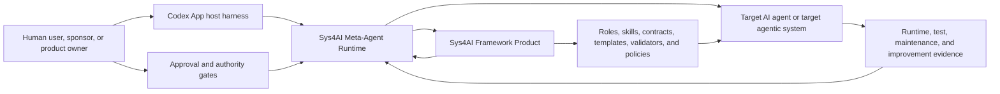
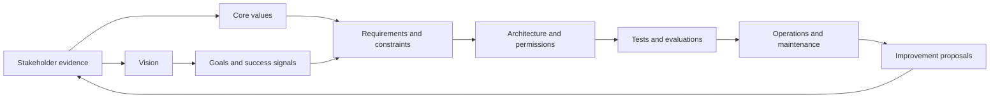
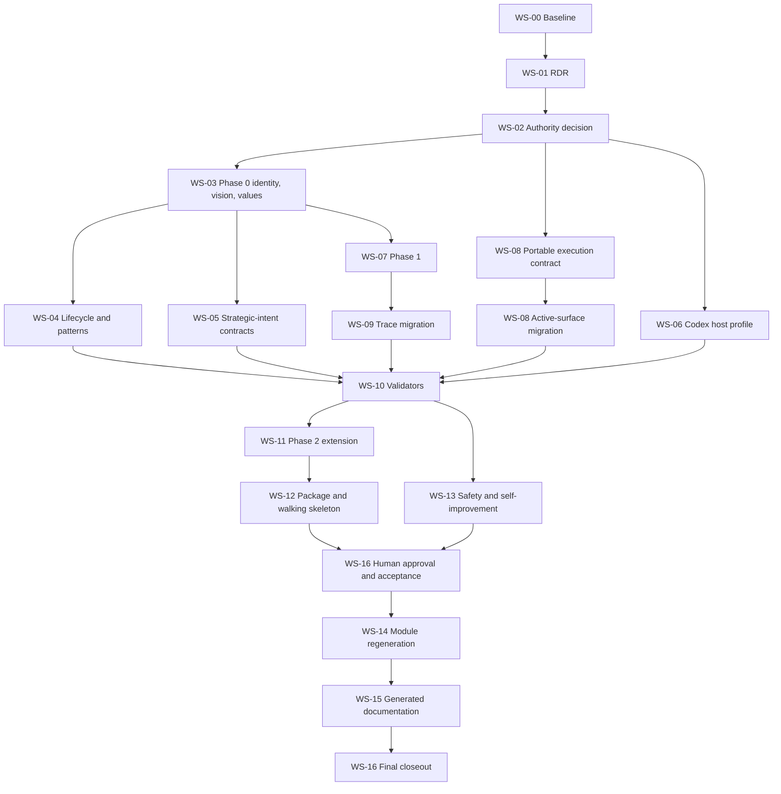

# Sys4AI-dev Strategic Baseline Migration: Full Implementation Plan

| Metadata | Value |
|---|---|
| Plan ID | `SFADEV-IMPL-PLAN-STRATEGIC-BASELINE-001` |
| Document status | Draft for maintainer and product-owner review |
| Source authority status | Planning artifact; not a canonical requirements baseline |
| Prepared date | 2026-07-09 |
| Repository | `AngryOwlAI/Sys4AI-dev` |
| Baseline commit | `15a9b17635db2cc76d3f1003f60ea20e46a4e313` |
| Baseline branch state | `main` equals `origin/main`; clean before this plan was added |
| Primary subject system | `Sys4AI` framework product |
| Planning surface | `Sys4AI-dev` development system |
| Affected layers | `development_system`, `framework_product`, `target_system_template`, future `target_system_instance` packages, and `derivative_surface` |
| Recommended execution-model route | Harness-neutral bounded execution with a Codex reference-host profile, pending explicit authority approval |
| Plan relationship | New post-`15a9b17` successor scope; it does not reopen, overwrite, or silently amend the completed July 7-8 implementation-plan sequences |

---

## 0. Executive Summary

This plan implements every recommendation in the supplied Sys4AI PRD analysis as one controlled semantic-baseline migration.

The migration is required because the repository currently contains two incompatible truths:

1. Commit `15a9b17` intentionally removed the active `/continue` skill, AgentJob authoring skill, control-loop runtime, associated CLI and Make targets, and their runtime tests.
2. The canonical Phase 0 PRD, accepted Phase 2 PRD, requirement traces, program state, role and artifact contracts, self-hosting policies, walking-skeleton implementation, target-package validation, registries, and generated documentation still describe AgentJob and `/continue` behavior as current or implemented.

The migration must not restore those removed surfaces by assumption. It must first obtain a governed decision. This plan recommends replacing the hard-coded runtime model with portable contracts for:

- Bounded execution authorization.
- A permission envelope.
- A resumable execution transaction.
- Current-state resolution.
- Validation and closeout evidence.
- Handoff or continuation evidence.
- Stop, cancellation, and escalation conditions.

Codex App then becomes the first reference-host profile that maps those portable contracts to tasks, sub-agents, workspace tools, terminal execution, approvals, task state, and cancellation. AgentJob can remain historical or become an optional profile only if later authorized.

The same migration also:

- Defines Sys4AI as a composite Meta-Agentic AI Framework System.
- Establishes one stakeholder-approved Sys4AI vision and eight controlled core values.
- Requires separate target-system vision and core-values documents.
- Expands the lifecycle to Design, Develop, Implement, Test, Run, Maintain, Improve, and Retire.
- Separates coordination pattern from operational maturity.
- Introduces strategic-intent, host-profile, PRD-semantic, lifecycle-pattern, capability-migration, trace, and target-package validation.
- Adds stronger self-change, approval, permission, security, evaluation, rollback, data-isolation, and production-operation controls.
- Preserves historical PRDs and accepted Phase 2 evidence.
- Regenerates derivative module PRDs and reader surfaces only after the canonical baseline is approved.

This plan is intentionally detailed enough to serve as the implementation backlog, migration specification, validation design, review checklist, and closeout standard. It does not itself approve candidate requirements, authorize implementation, or promote any derivative artifact.

### 0.1 Required outcome

The migration is complete only when all of the following are true:

1. The product owner has approved the composite Sys4AI identity, execution-model disposition, canonical vision, and core values.
2. Canonical Phase 0 and the Phase 1 canonical draft reflect that approved baseline.
3. Accepted Phase 2 evidence remains unchanged, and a controlled addendum or successor carries the new obligations.
4. Every active capability claim matches observable implementation state.
5. Removed commands and paths appear only in explicitly historical, superseded, removed, or optional-profile contexts.
6. Target-system packages contain approved or explicitly waived strategic-intent artifacts.
7. Host-specific behavior is isolated from portable framework semantics.
8. All new positive, negative, integration, regression, semantic-review, and generated-derivative checks pass.
9. Historical sources and completion evidence remain traceable.
10. Generated derivatives have been regenerated from approved canonical sources and remain noncanonical.

### 0.2 Critical path

The critical path is:

`RDR -> authority decision -> canonical Phase 0 -> Phase 1 initialization -> contracts and implementation -> Phase 2 addendum -> package and walking skeleton -> human approval -> derivative regeneration -> final acceptance`

No downstream workstream may bypass its upstream authority gate.

### 0.3 Workstream summary

| Workstream | Name | Primary result |
|---|---|---|
| `WS-00` | Baseline capture and migration governance | Reproducible pre-change evidence and protected historical boundary |
| `WS-01` | Requirements Discovery Record | Controlled candidate evidence for all migration decisions |
| `WS-02` | Identity and execution-model authority decision | Approved four-object model and capability-disposition route |
| `WS-03` | Canonical product identity, vision, and values | Phase 0 strategic baseline |
| `WS-04` | Lifecycle and architecture-pattern model | Complete lifecycle and two-axis selection taxonomy |
| `WS-05` | Target strategic-intent contracts and workflow | Vision/core-values templates, approval, waiver, and impact behavior |
| `WS-06` | Codex reference-host integration | Verified host capability and interface profile |
| `WS-07` | Phase 1 initialization baseline | Requirements for schemas, registries, validators, examples, and tooling |
| `WS-08` | Portable bounded-execution migration | Program-state, role, artifact, policy, registry, and code reconciliation |
| `WS-09` | Trace and capability-state migration | Truthful requirement, capability, evidence, and semantic-review state |
| `WS-10` | Validator and CLI/Make implementation | Enforceable strategic, semantic, host, lifecycle, migration, and package gates |
| `WS-11` | Controlled Phase 2 addendum or successor | Preserved accepted evidence plus the new walking-skeleton obligations |
| `WS-12` | Walking skeleton and target package | End-to-end strategic-intent and host-evidence demonstration |
| `WS-13` | Meta-agent safety and self-improvement controls | Separation of duties, least privilege, rollback, isolation, and holdouts |
| `WS-14` | Derivative PRD module migration | Regenerated noncanonical modules after canonical approval |
| `WS-15` | Generated documentation and navigation | Deterministic, registered, noncanonical reader surfaces |
| `WS-16` | Evaluation, approval, release, and closeout | Human approval, scenario probes, full verification, and final evidence |

---

## 1. Authority, Baseline, and Evidence Model

### 1.1 Live repository baseline

The implementation must begin from a recorded baseline rather than from this narrative alone.

| Baseline fact | Live evidence at plan creation | Planning consequence |
|---|---|---|
| Git state | `HEAD == origin/main == 15a9b17635db2cc76d3f1003f60ea20e46a4e313` | All work is post-retraction migration work. |
| Worktree | Clean before adding this plan | Future diffs can be attributed to bounded migration packets. |
| Phase 0 | Canonical | Modify through controlled baseline change. |
| Phase 1 | Canonical draft | Modify in place after Phase 0 candidate requirements are accepted for implementation. |
| Phase 2 | Controlled and accepted | Do not silently rewrite; add a controlled addendum or successor. |
| Historical Phase 0 | Historical reference | Preserve. Migrate useful vision and Codex intent with provenance only. |
| Module PRDs | Twelve `derivative_draft` modules | Do not use as requirement authority; regenerate only after canonical approval. |
| Program state | Complete; no active Director Decision; no active AgentJob | Open a new decision scope before implementation. |
| Runtime surfaces | `/continue` and AgentJob runtime explicitly absent | Do not prescribe the old execution protocol. |
| Aggregate validation | Structurally green before migration | Existing green status is a baseline condition, not proof of semantic alignment. |
| Requirement trace | 192 Phase 0 requirements and 81 Phase 1 requirements indexed | Trace migration is a deliberate data migration, not a casual column edit. |
| Memory status | Pass with warnings; many pending source hashes | Freshness claims remain limited until hashes are populated or explicitly deferred. |

### 1.2 Authority order

When sources conflict during implementation, use this order:

1. Explicit product-owner approval and accepted Director Decision for this migration.
2. Canonical or controlled PRDs.
3. Controlled registries, schemas, policies, and validated control records.
4. This implementation plan.
5. Derivative PRD modules.
6. Generated documentation, temporary handoffs, memory results, and chat summaries.

This plan may route work and define acceptance evidence. It cannot manufacture source authority.

### 1.3 System-layer classification

The smallest authorized write surface for the present request is this new file under `implementation_plans/`. Later implementation affects the following layers:

| Layer | Meaning | Expected migration writes | Boundary |
|---|---|---|---|
| `development_system` | Active `Sys4AI-dev` workspace | Runtime skills, outer validation, planning and control evidence where authorized | Must not be collapsed into product scaffold authority. |
| `framework_product` | `Sys4AI/` plus canonical product PRDs | PRDs, schemas, registries, validators, policies, reference implementation | Primary target of the migration. |
| `target_system_template` | Reusable target-package templates and core skills | Strategic-intent templates, manifest contract, examples | Must remain portable and host-neutral. |
| `target_system_instance` | A concrete generated or maintained target system | Future package instances and approval evidence | This plan changes contracts, not a production target instance. |
| `derivative_surface` | Generated reader and navigation material | Generated indexes and reports | Noncanonical; regenerate from sources. |

The Sys4AI Meta-Agent Runtime is initially a `runtime_actor`, not a sixth authority layer. A new `meta_agent_runtime` authority layer may be added only if an authority decision proves that it needs mutation, approval, registry, or validation rules that cannot be represented by the existing layers.

### 1.4 Runtime-actor axis

Add `runtime_actor` as a separate classification axis wherever execution responsibility matters.

Initial controlled values:

- `human_principal`
- `codex_host`
- `sys4ai_meta_agent`
- `delegated_role_agent`
- `target_agent`
- `external_system`

Rules:

1. `subject_layer` answers which authority surface is affected.
2. `runtime_actor` answers who or what performed, proposed, approved, evaluated, or accepted an action.
3. No runtime actor gains authority merely by being capable of performing an action.
4. Approval actors must resolve to an accountable non-model principal for purpose, vision, values, permissions, evaluation standards, production promotion, and authority hierarchy.
5. The initial migration should use schema enums and relationship rows. It must not add a runtime-actor registry unless a documented representation gap is demonstrated.

### 1.5 Known authority and capability conflicts

The baseline packet must enumerate and classify at least these conflicts:

| Conflict ID | Conflict | Required disposition |
|---|---|---|
| `CONFLICT-EXEC-001` | Phase 0 mandates AgentJob and `/continue` while runtime surfaces are removed. | Replace, retain-as-unimplemented, retire, or restore through explicit decision; route 2 is recommended. |
| `CONFLICT-EXEC-002` | Phase 2 requires `/continue` and AgentJobs while the active runtime is absent. | Carry corrected semantics in a controlled Phase 2 addendum or successor. |
| `CONFLICT-TRACE-001` | Trace rows classify removed continuation capabilities as implemented. | Reclassify using capability and evidence state. |
| `CONFLICT-STATE-001` | `program_state.yaml` and its schema retain `active_agentjob_id` and legacy lifecycle semantics. | Migrate to portable execution-transaction state or mark legacy fields historical. |
| `CONFLICT-POLICY-001` | Self-hosting and skill-integration policies prescribe removed runtime surfaces. | Supersede or revise after the authority decision. |
| `CONFLICT-ROLE-001` | Role and execution-binding registries use AgentJob-specific authority fields. | Migrate fields and role contracts atomically. |
| `CONFLICT-ART-001` | Artifact contracts still describe AgentJob as an active controlled artifact. | Add portable execution-transaction contract and classify AgentJob lifecycle honestly. |
| `CONFLICT-WALK-001` | Walking-skeleton code hard-codes AgentJob nodes and source records. | Generalize after Phase 2 authority is updated. |
| `CONFLICT-PACK-001` | Target-package validator requires task packets to mention `agentjob`. | Replace with selected portable execution-contract vocabulary. |
| `CONFLICT-PLAN-001` | Completed older plans mandate `/continue` for execution. | Preserve as historical completion evidence; remove current operational authority through controlled navigation cleanup. |
| `CONFLICT-VISION-001` | Historical Phase 0 has stronger vision language than canonical Phase 0. | Migrate with provenance; do not promote the historical file itself. |
| `CONFLICT-VALIDATION-001` | Current validation can pass without testing capability existence or strategic semantics. | Add named semantic and capability-migration validators. |

### 1.6 External-source provenance boundary

IBM Technology may be cited for:

- Selecting a framework after identifying the target-system type.
- Framework support for architectures, integrations, monitoring, task management, and communication protocols.
- Common coordination patterns.
- Explicit responsibility boundaries in role-based multi-agent systems.
- The distinction between prototype validation and production orchestration.

Do not attribute the following Sys4AI-specific extensions to IBM:

- Canonical vision statements.
- Core values.
- Meta-agent self-development.
- Permission or approval governance.
- The full lifecycle and maintenance model.
- Strategic-intent artifact contracts.
- Self-change and bounded-reflection controls.

Every rationale that cites the video must preserve this distinction and use APA 7 attribution.

---

## 2. Implementation Governance and Decision Gates

### 2.1 Mandatory gates

| Gate | Decision or evidence | Entry condition | Exit condition | Blocks |
|---|---|---|---|---|
| `G-00` | Baseline reproducibility | Clean post-`15a9b17` checkout | Baseline commands, source inventory, and conflict inventory recorded | All changes |
| `G-01` | Requirements discovery | `G-00` complete | Registered RDR covers every recommendation family and unresolved decision | Authority decision |
| `G-02` | Identity and execution-model authority | RDR validated | Human authority approves four-object identity and selects one execution route | Canonical PRD edits |
| `G-03` | Candidate normative baseline | `G-02` approved | Phase 0 candidate requirements, product statement, vision, values, lifecycle, and patterns reviewed | Phase 1 implementation |
| `G-04` | Artifact and interface contracts | Phase 0 candidate baseline accepted for implementation | Producers, consumers, sections, schemas, approval rules, and validators approved | Templates and package changes |
| `G-05` | Capability migration safety | Portable execution contract defined | Stale active references classified; migration validator protects the boundary | State, role, policy, trace migration |
| `G-06` | Phase 2 change authority | Phase 0 and Phase 1 migration stable | Product owner selects addendum or successor and accepts its scope | Walking skeleton/package |
| `G-07` | Host verification | Codex profile drafted | Capabilities and limitations verified against observable host behavior | Host-dependent execution claims |
| `G-08` | Strategic approval | Candidate vision and values complete | Accountable human principal approves, rejects, or requests revision | Canonical approved status |
| `G-09` | Derivative regeneration | Canonical baseline approved | Modules and generated pages regenerated and checked | Final release |
| `G-10` | Final acceptance | All prior gates complete | Full validation, semantic review, approvals, rollback evidence, and release receipt pass | Completion |

### 2.2 Execution-model decision

The RDR and authority decision must evaluate four routes:

| Route | Description | Benefit | Risk | Plan recommendation |
|---|---|---|---|---|
| 1 | Retain AgentJob and `/continue` requirements as temporarily unimplemented | Preserves earlier semantics | Canonical requirements remain coupled to removed implementation and may mislead | Not preferred |
| 2 | Replace with harness-neutral bounded-execution concepts | Portable, truthful, compatible with Codex and other hosts | Requires coordinated migration across many surfaces | **Recommended** |
| 3 | Retire the concepts completely | Simplest capability set | Loses resumability, scope, closeout, and continuation obligations | Not preferred |
| 4 | Restore the removed implementation | Fastest return to old behavior | Reverses an intentional retraction without new justification | Prohibited without separate authorization |

The decision record must state:

- Selected route and authority.
- Evidence considered.
- Portable terms and definitions.
- Whether AgentJob remains historical, deprecated, or an optional profile.
- Whether `/continue` remains historical, deprecated, or an optional host command.
- Compatibility and migration rules.
- Which files and registries are authoritative after migration.
- Rollback and supersession path.
- Review or expiry trigger.

### 2.3 No implicit restoration rule

No packet may:

- Recreate deleted `continue` or `agentjob-task-packet-author` skills.
- Restore `Sys4AI/sys_for_ai/control_loop/`.
- re-add deleted CLI or Make targets.
- change the absence test to expect those paths.
- treat historical AgentJob control records as proof of active runtime capability.

Any restoration requires a separate explicit decision, threat model, implementation plan, tests, and product-owner approval.

### 2.4 Candidate and approval discipline

Use independent state dimensions:

| Dimension | Allowed states | Meaning |
|---|---|---|
| `content_approval_status` | `candidate`, `stakeholder_review`, `approved`, `rejected`, `superseded` | Whether accountable stakeholders accepted the content |
| `source_authority_status` | `candidate`, `controlled_candidate`, `controlled`, `canonical_draft`, `canonical`, `derivative_draft`, `generated_derivative`, `historical` | Authority class of the artifact |
| `validation_status` | `not_run`, `pass`, `warn`, `fail` | Structural validation result |
| `requirement_lifecycle` | `proposed`, `active`, `deprecated`, `superseded`, `retired` | Normative lifecycle state |
| `capability_status` | `absent`, `scaffolded`, `implemented`, `operational`, `suspended`, `removed` | Observable implementation state |
| `evidence_status` | `current`, `historical`, `stale`, `missing` | Freshness and relevance of evidence |

A structurally valid document is not necessarily approved, strategically sound, ethically adequate, implemented, operational, or current.

### 2.5 Bounded migration transaction protocol

Until the execution-model decision is approved, work is planning and discovery only.

After approval, execute one bounded migration transaction at a time. Each transaction must contain:

1. A stable transaction ID.
2. Objective and recommendation IDs.
3. Subject system, subject layer, and runtime actors.
4. Allowed reads and writes.
5. Forbidden actions.
6. Preconditions and decision gates.
7. Expected outputs.
8. Required validators and negative tests.
9. Stop, cancellation, and escalation conditions.
10. Rollback instructions.
11. Completion and handoff evidence.
12. Commit and push evidence before a dependent transaction begins.

The selected execution profile may serialize this as a Codex task, task-packet Markdown, YAML control record, or later optional AgentJob profile. The portable contract is authoritative; the host serialization is not.

### 2.6 Change taxonomy

| Action | Artifact | Rule |
|---|---|---|
| Modify | `PRDs/Sys4AI_phase-0_product_system_design_prd.md` | Primary normative migration through controlled baseline change |
| Modify | `PRDs/Sys4AI_phase-1_implementation_initialization_prd.md` | Add implementation obligations and remove stale active runtime assumptions |
| Modify | `PRDs/README.md` | Add identity and strategic-intent authority map; update promotion vocabulary |
| Modify | `PRDs/PRD_decomposition_strategy.md` | Add capability boundaries and replace `agentjob_continue` after decision |
| Create | One controlled Phase 2 addendum or successor | Never silently rewrite accepted Phase 2 evidence |
| Create | Target vision and core-values templates | Separate target strategic-intent artifacts |
| Create | Host capability profile and contract | Codex is the initial reference host |
| Create or extend | Pattern decision and value-conflict decision contracts | Prefer existing Director Decision machinery when sufficient |
| Preserve | `PRDs/Sys4AI_phase-0_prd.md` | Historical only; no substantive update |
| Preserve | Accepted Phase 2 PRD and draft evidence | At most add an accepted/superseded navigation pointer if authorized |
| Preserve | Completed earlier implementation plans, audits, receipts, and handoffs | Historical evidence; do not rewrite |
| Regenerate later | Twelve module PRD drafts | Only after canonical Phase 0 approval |
| Regenerate later | Generated governance and registry pages | Use generators, never manual source edits |
| Migrate or archive | Stale program-state and AgentJob-dependent active surfaces | Preserve historical trace while removing active claims |

---

## 3. Target Product and System Model

### 3.1 Four-object composite model

`Sys4AI` will be defined as a composite system:



Controlled definitions:

| Object | Definition | Authority boundary |
|---|---|---|
| Sys4AI Framework Product | Requirements, methods, roles, skills, templates, registries, validators, policies, and reference implementation | Product requirements and framework assets |
| Sys4AI Meta-Agent Runtime | Executable AI-agent identity that applies the framework under authorization | Performs bounded work; does not self-authorize purpose or permissions |
| Codex App Host Harness | Initial host supplying model execution, conversation, tools, workspace, terminal, sub-agents, approvals, task state, and cancellation | Platform, system/developer instructions, and permissions remain binding |
| Target AI Agent/System | Single agent, multi-agent system, workflow, or agentic application created and stewarded through Sys4AI | Own target-system authority and data boundary |

### 3.2 Recommended canonical product statement

The following wording remains a candidate until approved:

> `Sys4AI` shall be a Meta-Agentic AI Framework System comprising a governed framework product and a Codex-hosted Meta-Agent Runtime. Working with an authorized user, the runtime applies the framework to design, develop, implement, test, run, maintain, and improve target AI agents and target agentic systems.

This wording replaces the ambiguous model in which an unrelated root agent merely uses Sys4AI, while preserving the necessary framework/runtime distinction.

### 3.3 Recommended canonical vision

The following wording remains a candidate until approved:

> **Sys4AI envisions a future in which people, working through Codex and compatible AI harnesses, can reliably create and steward fit-for-purpose AI agents across their complete lifecycle—from intent and design through development, implementation, testing, operation, maintenance, and improvement—while accountable stakeholders retain authority and every consequential claim, decision, and change remains evidence-grounded, traceable, safe, and reviewable.**

Required authority note:

> This vision records a stakeholder-approved aspiration for the Sys4AI framework product. It does not imply that an AI model has personal desires, consciousness, moral agency, or authority to choose its own purpose.

Required metadata:

- Vision ID.
- Owner.
- Approval principal and evidence.
- Beneficiaries.
- Time horizon.
- Scope and exclusions.
- Success signals.
- Source evidence.
- Version.
- Revision triggers.
- Supersession state.

### 3.4 Recommended Sys4AI core values

The following values remain candidates until approved:

| ID | Core value | Required behavior | Prohibited behavior or decision test |
|---|---|---|---|
| `SFA-VALUE-001` | Human-directed purpose and accountable authority | Identify who authorized purpose, scope, and consequential actions. | Never invent goals, self-approve values, or treat silence as consent. |
| `SFA-VALUE-002` | Purpose-fit architecture | Determine target problem, coordination pattern, risk, and maturity before selecting frameworks or tools. | Do not select a framework because it is fashionable or universally “best.” |
| `SFA-VALUE-003` | Evidence and intellectual honesty | Trace claims and decisions to authoritative sources and disclose assumptions and uncertainty. | Do not convert inference, retrieval, or structural validation into established fact. |
| `SFA-VALUE-004` | Bounded autonomy and accountability | Keep actions permissioned, scoped, observable, stoppable, and reversible where practical. | Values, goals, or efficiency arguments must not expand permissions. |
| `SFA-VALUE-005` | Safety, security, privacy, and responsible control | Assess threats, affected parties, data, permissions, and failure modes before execution. | Do not defer safety until production or use innovation to override controls. |
| `SFA-VALUE-006` | Clear roles and accountable collaboration | Give every agent responsibilities, inputs, outputs, tools, boundaries, handoffs, and escalation paths. | Agents must not silently assume another role’s authority. |
| `SFA-VALUE-007` | Traceable, testable, and reproducible engineering | Preserve intent-to-evidence trace and independent review. | Avoid orphan artifacts, validator theater, hidden changes, and unverifiable claims. |
| `SFA-VALUE-008` | Full-lifecycle and reversible stewardship | Design for monitoring, maintenance, regression control, improvement, rollback, and retirement. | Generating an agent or package does not constitute lifecycle completion. |

### 3.5 Value precedence and conflict decisions

Precedence order:

1. Applicable law and mandatory platform policy.
2. Safety, security, privacy, and compliance constraints.
3. Explicit source authority, host permissions, and required human approvals.
4. Approved Sys4AI governance floor.
5. Approved target-system values.
6. Ordinary product, architecture, implementation, and convenience preferences.

Values never grant permission.

Every material conflict must create or reuse a typed `VALUE-CONFLICT-*` Director Decision containing:

- Values affected.
- Decision context.
- Alternatives.
- Binding constraints.
- Selected precedence.
- Decision authority.
- Supporting and contrary evidence.
- Consequences.
- Review or expiry trigger.
- Downstream impact-analysis references.

### 3.6 Complete lifecycle

The lifecycle is:

`Design -> Develop -> Implement -> Test -> Run -> Maintain -> Improve -> Retire`

Testing, verification, validation, and evaluation are also cross-cutting gates.

Every stage contract must define:

- Entry criteria.
- Required inputs.
- Responsible and approving roles.
- Permission requirements.
- Activities.
- Expected outputs.
- Required evidence.
- Exit criteria.
- Failure and degraded-mode behavior.
- Allowed transitions.
- Rollback or return transition.
- Monitoring and review cadence where applicable.

Distinctions:

| Concept | Question answered |
|---|---|
| Test execution | Did the implementation behave as specified under the test conditions? |
| Requirements verification | Was each requirement implemented correctly? |
| Stakeholder/system validation | Is the right system being built for the approved need and context? |
| Behavioral/performance evaluation | How well does the probabilistic system perform against defined scenarios, metrics, and thresholds? |

Improvement must be evidence-driven and route approved changes back through affected discovery, design, implementation, testing, operations, and approval artifacts. Retirement must cover archival, data disposition, credential and authority withdrawal, dependency shutdown, retained evidence, and stakeholder notification.

### 3.7 Coordination pattern and operational maturity

Do not mix architecture topology and maturity.

**Coordination pattern**

- `linear_workflow`
- `goal_directed_autonomous_agent`
- `role_based_multi_agent`
- `production_orchestration`
- `hybrid`

**Operational maturity**

- `concept`
- `prototype`
- `validated_prototype`
- `production_candidate`
- `production_approved`
- `operational`
- `maintenance`
- `retired`

Every target system requires an `Agentic System Pattern Decision` with:

- Target problem and system of interest.
- Predictability versus open-endedness.
- Single-agent versus multi-agent need.
- Role specialization.
- Autonomy level.
- Required APIs, databases, and business workflows.
- Communication protocol.
- Task and state model.
- Monitoring and observability.
- Failure and degraded-mode behavior.
- Reliability and recovery requirements.
- Security and data boundaries.
- Prototype-to-production criteria.
- Alternatives rejected and rationale.

Rapid prototyping is a maturity mode, not an architecture. No prototype may become operational without evaluation, security, integration, ownership, rollback, monitoring, incident response, and approval evidence.

### 3.8 Strategic-intent evidence graph

The implementation must support this trace:



The graph records evidence and relationships. It does not allow a validator to decide whether a vision is desirable, a value is ethically correct, or stakeholders genuinely consent.

---

## 4. Candidate Normative Requirement Register

All IDs in this section are proposed. They become active only through the approved source-authority workflow.

### 4.1 Meta-agent identity

| ID | Candidate requirement | Primary owner |
|---|---|---|
| `SFA-CORE-ID-004` | Sys4AI shall be defined as a Meta-Agentic AI Framework System comprising a governed framework product and an executable Meta-Agent Runtime. | Canonical Phase 0 |
| `SFA-CORE-ID-005` | The Meta-Agent Runtime shall collaborate with an authorized user to design, develop, implement, test, run, maintain, and improve target AI agents or agentic systems. | Canonical Phase 0 |
| `SFA-CORE-ID-006` | Artifacts shall distinguish framework product, Meta-Agent Runtime, host harness, target-system template, target-system instance, and derivative surfaces. | Canonical Phase 0 and artifact schemas |
| `SFA-CORE-ID-007` | Sys4AI shall distinguish orchestration from execution and shall not claim execution when it only generated a plan or artifact. | Canonical Phase 0 and evidence validators |

### 4.2 Codex host integration

| ID | Candidate requirement | Primary owner |
|---|---|---|
| `SFA-CORE-HARNESS-001` | Codex App shall be the initial reference host for Sys4AI. | Canonical Phase 0 |
| `SFA-CORE-HARNESS-002` | Sys4AI shall define a host-capability profile covering user interaction, workspace access, tools, terminal execution, sub-agents, approvals, context, cancellation, and evidence. | Phase 0, Phase 1, host profile |
| `SFA-CORE-HARNESS-003` | Host mechanics shall be isolated behind an integration profile rather than embedded in portable framework semantics. | Phase 0 and interface policy |
| `SFA-CORE-HARNESS-004` | Before execution, Sys4AI shall verify required host capabilities and permissions. | Host validator and execution contract |
| `SFA-CORE-HARNESS-005` | Missing or denied required capabilities shall produce a degraded, blocked, or rerouted state rather than assumed success. | Host validator and state model |
| `SFA-CORE-HARNESS-006` | Sys4AI values and target goals shall not authorize actions disallowed by host or project permissions. | Permission policy and tests |

### 4.3 Sys4AI vision and values

| ID | Candidate requirement |
|---|---|
| `SFA-CORE-VISION-001` | Canonical Phase 0 shall contain one approved future-state Sys4AI vision. |
| `SFA-CORE-VISION-002` | The vision shall declare owner, approval authority, beneficiaries, horizon, scope, success signals, sources, and revision triggers. |
| `SFA-CORE-VISION-003` | Vision language shall represent stakeholder intent, not an AI model’s personal desire. |
| `SFA-CORE-VALUES-001` | Phase 0 shall define an approved stable-ID core-values set. |
| `SFA-CORE-VALUES-002` | Each value shall specify commitment, rationale, expected behavior, anti-patterns, decision test, conflict rule, and evidence obligation. |
| `SFA-CORE-VALUES-003` | Material requirements, architecture decisions, permissions, evaluations, maintenance actions, and improvements shall reference affected value IDs. |
| `SFA-CORE-VALUES-004` | Values shall not override law, safety, privacy, security, source authority, host permissions, or required human approval. |
| `SFA-CORE-VALUES-005` | An AI agent shall not approve its own purpose, vision, values, authority, permissions, or evaluation standard. |

### 4.4 Target-system strategic intent

| ID | Candidate requirement |
|---|---|
| `SFA-CORE-TARGET-VISION-001` | Every new or substantially changed target system shall receive a separate target vision document. |
| `SFA-CORE-TARGET-VISION-002` | AI-generated vision wording shall remain `VISION-CAND-*` until explicitly approved. |
| `SFA-CORE-TARGET-VALUES-001` | Every new or substantially changed target system shall receive a separate core-values document. |
| `SFA-CORE-TARGET-VALUES-002` | AI-generated value wording shall remain `VALUE-CAND-*` until explicitly approved. |
| `SFA-CORE-TARGET-VALUES-003` | Target values shall distinguish inherited governance constraints from stakeholder-selected commitments. |
| `SFA-CORE-TARGET-VALUES-004` | A USRD or PRD shall not be baselined until both artifacts are approved or an authorized waiver records risk, expiry, and downstream handling. |
| `SFA-CORE-TARGET-VALUES-005` | Approved vision or value changes shall trigger impact analysis across requirements, architecture, permissions, tests, evaluations, operations, and maintenance. |
| `SFA-CORE-ART-002` | The artifact catalog shall include target vision and core-values contracts. |
| `SFA-CORE-TRACE-002` | Vision and value IDs shall trace from stakeholder evidence through requirements, decisions, evaluations, and operational evidence. |

### 4.5 Full lifecycle

Revise `SFA-CORE-LIFE-001` through controlled baseline change:

> Sys4AI shall define and support the design, development, implementation, testing/verification/validation/evaluation, operation, maintenance, and improvement of target AI agents and target agentic systems.

Add:

| ID | Candidate requirement |
|---|---|
| `SFA-CORE-LIFE-004` | Each stage shall define entry criteria, inputs, responsible roles, permissions, outputs, evidence, exit criteria, failure handling, and allowed transitions. |
| `SFA-CORE-LIFE-005` | Sys4AI shall distinguish test execution, requirements verification, stakeholder/system validation, and behavioral or performance evaluation. |
| `SFA-CORE-LIFE-006` | Testing shall be both a named lifecycle capability and a cross-cutting gate before release, after maintenance, and after improvement. |
| `SFA-CORE-LIFE-007` | Improvement shall be evidence-driven and feed approved changes back into discovery, design, implementation, tests, and operations. |
| `SFA-CORE-LIFE-008` | Retirement, archival, data disposition, and authority withdrawal shall be defined for production systems. |

### 4.6 Architecture-pattern selection

| ID | Candidate requirement |
|---|---|
| `SFA-CORE-PATTERN-001` | Discovery shall classify the target system’s coordination pattern. |
| `SFA-CORE-PATTERN-002` | Permitted patterns shall include linear workflow, goal-directed autonomous, role-based multi-agent, production orchestration, and hybrid. |
| `SFA-CORE-PATTERN-003` | Rapid prototyping shall be treated as a maturity mode, not assumed to be production architecture. |
| `SFA-CORE-PATTERN-004` | Architecture selection shall record alternatives, rationale, reliability, autonomy, integrations, communication protocols, monitoring, and promotion criteria. |
| `SFA-CORE-PATTERN-005` | A prototype shall not silently become operational without evaluation, security, integration, ownership, rollback, and approval evidence. |

---

## 5. Recommendation-to-Workstream Trace Matrix

| Recommendation ID | Recommendation | Workstreams | Acceptance evidence |
|---|---|---|---|
| `REC-001` | Adopt the four-object composite model. | `WS-01`, `WS-02`, `WS-03` | Approved decision, Phase 0 definitions, diagrams, and schema tests |
| `REC-002` | Separate `subject_layer` from `runtime_actor`. | `WS-02`, `WS-08`, `WS-09` | Schema fields, relationship rows, validation fixtures |
| `REC-003` | Adopt the recommended canonical product statement. | `WS-03` | Product-owner approval and canonical Phase 0 text |
| `REC-004` | Establish one canonical Sys4AI vision and authority note. | `WS-03`, `WS-16` | Approved vision ID, metadata, evidence, and trace |
| `REC-005` | Establish eight controlled Sys4AI core values. | `WS-03`, `WS-13`, `WS-16` | Approved value catalog, behavior tests, conflict decisions |
| `REC-006` | Resolve AgentJob and `/continue` retraction before PRD extension. | `WS-00`, `WS-01`, `WS-02` | Capability inventory and approved route decision |
| `REC-007` | Replace hard-coded runtime semantics with portable bounded execution. | `WS-02`, `WS-08` | Portable contract, migrated state, roles, artifacts, policies, and tests |
| `REC-008` | Add all candidate normative requirement families. | `WS-03`, `WS-04`, `WS-05`, `WS-06`, `WS-07` | Phase 0/1 requirement review and trace rows |
| `REC-009` | Normalize coordination pattern and operational maturity. | `WS-04`, `WS-12` | Pattern decision, manifest fields, promotion tests |
| `REC-010` | Add separate target vision and core-values contracts. | `WS-05`, `WS-07`, `WS-12` | Templates, artifact rows, schemas, package evidence |
| `REC-011` | Keep approval, authority, and validation state independent. | `WS-05`, `WS-09`, `WS-10` | Schemas and negative state-combination tests |
| `REC-012` | Implement the strategic-intent discovery and approval workflow. | `WS-01`, `WS-05`, `WS-10` | RDR sections, skill updates, approval and waiver tests |
| `REC-013` | Define Codex reference-host interfaces and capability checks. | `WS-06`, `WS-10`, `WS-13` | Verified profile, interface contracts, degraded-state tests |
| `REC-014` | Apply every top-level PRD and authority-file recommendation. | `WS-03`, `WS-04`, `WS-07`, `WS-11` | File-specific review checklist passes |
| `REC-015` | Apply every derivative module recommendation after approval. | `WS-14` | Regenerated module diff and noncanonical-status validation |
| `REC-016` | Add every Phase 1 implementation surface. | `WS-07` through `WS-10` | Templates, schemas, rows, profile, examples, CLI/Make targets |
| `REC-017` | Add strategic-intent validation. | `WS-10` | Positive and negative tests plus aggregate target |
| `REC-018` | Add PRD semantic validation. | `WS-10` | Canonical-section, removed-reference, conflict, and supersession tests |
| `REC-019` | Add capability-migration validation. | `WS-08` through `WS-10` | Active-reference scanner and capability/evidence consistency checks |
| `REC-020` | Generalize trace validation. | `WS-09`, `WS-10` | Migrated schema, 192-row data migration, review-owner checks |
| `REC-021` | Harden target-package validation. | `WS-10`, `WS-12` | Missing/unapproved/stale/duplicate/model-approval failures |
| `REC-022` | Preserve validator limitation disclaimers. | `WS-10`, `WS-15`, `WS-16` | CLI and report outputs state semantic limits |
| `REC-023` | Add meta-agent and self-improvement controls. | `WS-13`, `WS-16` | Separation-of-duties, holdout, rollback, isolation, and recursion tests |
| `REC-024` | Preserve historical Phase 0 and Phase 2 evidence. | `WS-00`, `WS-11` | Hash or diff evidence proves no substantive rewrite |
| `REC-025` | Prefer existing registries and prove need before adding one. | All registry workstreams | Representation assessment and Director Decision for any new registry |
| `REC-026` | Implement strategic-intent evidence graph. | `WS-09`, `WS-15` | No-orphan graph validation and generated noncanonical view |
| `REC-027` | Convert approved values into scenario probes. | `WS-13`, `WS-16` | Positive, negative, and conflict probes per value |
| `REC-028` | Preserve IBM versus Sys4AI attribution boundary. | `WS-03`, `WS-04`, `WS-15` | APA 7 source review and no unsupported attribution |
| `REC-029` | Follow the exact 12-step migration sequence. | `WS-00` through `WS-16` | Gate and dependency audit |

No recommendation may be marked complete merely because it appears in prose. Completion requires the named source, implementation, validation, approval, and handoff evidence.

---

## 6. WS-00: Baseline Capture and Migration Governance

### 6.1 Objective

Create reproducible evidence of the post-retraction repository state, protect historical artifacts, and establish the exact scope against which all later migration diffs are reviewed.

### 6.2 Preconditions

- Checkout is at or descended from `15a9b17`.
- No unrelated worktree changes will be overwritten.
- No implementation transaction is active.
- Product owner understands that current green validation does not prove semantic consistency.

### 6.3 Required inspections

Inspect and record:

1. `git status --short --branch`.
2. `git rev-parse HEAD` and `git rev-parse origin/main`.
3. `git show --stat 15a9b17`.
4. Canonical authority rows in `PRDs/README.md`.
5. `Sys4AI/control_records/program_state.yaml`.
6. `Sys4AI/registries/system_layer_registry.csv`.
7. Phase 0, Phase 1, and Phase 2 requirement declarations.
8. Current `/continue` and AgentJob absence test.
9. Active and historical references to `/continue`, `AgentJob`, `agentjob`, deleted control-loop paths, and deleted CLI/Make targets.
10. Current trace classifications for continuation and AgentJob requirements.
11. Registered source hashes and pending-hash counts.
12. Existing completed plan audits and their relationship to this new scope.

### 6.4 Required baseline commands

Run from repository root:

```bash
git status --short --branch
git rev-parse HEAD
git rev-parse origin/main
make validate-rename
make validate-dev-skills
make validate-product-scaffold
make validate
```

Run targeted checks from `Sys4AI/`:

```bash
make validate-system-layers
make validate-artifact-contracts
make validate-prd-modules
make validate-requirement-trace
make validate-target-package-smoke
make validate-generated-derivatives
```

Capture command, exit status, timestamp, commit, and material warnings. Do not flatten warnings into a pass.

### 6.5 Capability-reference inventory

Generate a controlled inventory that classifies every active-surface match as:

- `active_and_valid`
- `active_but_stale`
- `historical`
- `deprecated`
- `removed`
- `optional_profile`
- `generated_derivative`
- `false_positive`

Minimum scanned roots:

- `PRDs/`
- `implementation_plans/`
- `.agents/`
- `.codex/`
- `Sys4AI/configs/`
- `Sys4AI/control_records/`
- `Sys4AI/docs/`
- `Sys4AI/examples/`
- `Sys4AI/registries/`
- `Sys4AI/schemas/`
- `Sys4AI/skills/`
- `Sys4AI/sys_for_ai/`
- `Sys4AI/templates/`
- `Sys4AI/tests/`

The inventory must distinguish generated files and immutable historical evidence from active normative or executable surfaces.

### 6.6 Historical-protection manifest

Record paths and baseline hashes for:

- `PRDs/Sys4AI_phase-0_prd.md`.
- `PRDs/Sys4AI_phase-2_walking_skeleton_prd.md`.
- `PRDs/drafts/Sys4AI_phase-2_walking_skeleton_prd.draft.md`.
- Completed implementation plans, completion audits, receipts, decisions, and handoffs relevant to the July 7-8 sequences.
- Historical AgentJob records and schemas that will be reclassified rather than deleted.

The manifest may be part of the baseline completion evidence. Do not create a new registry solely for it.

### 6.7 Acceptance criteria

- All baseline commands and targeted checks have recorded results.
- The inventory accounts for every removed-surface reference in active roots.
- Historical paths have pre-change hashes or equivalent immutable Git evidence.
- Existing warnings, including pending hashes, are documented.
- No canonical or historical artifact is changed in this workstream.
- The next action is the controlled RDR, not a PRD edit.

### 6.8 Stop conditions

Stop if:

- `HEAD` does not match the expected reviewed baseline and the delta is not understood.
- The worktree contains overlapping uncommitted changes.
- Any historical artifact is already missing or modified.
- An active authority decision contradicts this plan.
- Baseline validation reveals an unrelated repository failure that would obscure migration results.

### 6.9 Rollback

This workstream is read-only except for its completion evidence. Remove only newly created unapproved baseline evidence if rollback is required; never alter historical sources to make the baseline appear clean.

---

## 7. WS-01: Strategic Baseline Requirements Discovery Record

### 7.1 Objective

Create one controlled Requirements Discovery Record that captures stakeholder evidence, candidate requirements, unresolved choices, authority, risks, and downstream routing for the entire migration.

### 7.2 Proposed artifact

Recommended path:

`Sys4AI/control_records/system_definition/strategic_baseline_migration_requirements_discovery_record.md`

Recommended ID:

`RDR-SFADEV-STRATEGIC-BASELINE-001`

The exact ID and path remain subject to the current discovery-record naming and registration rules.

### 7.3 Required RDR scope

The RDR must cover:

- Composite Sys4AI identity.
- Framework product versus Meta-Agent Runtime.
- Codex reference-host model.
- Subject-layer and runtime-actor separation.
- Canonical Sys4AI vision.
- Canonical Sys4AI values.
- Target-system vision and core-values artifacts.
- AgentJob and `/continue` disposition.
- Portable bounded-execution contract.
- Full lifecycle.
- Coordination-pattern and maturity taxonomy.
- Strategic-intent workflow.
- Approval and waiver model.
- Phase 2 addendum versus successor route.
- Trace and capability-status migration.
- Meta-agent self-change controls.
- Evidence graph and scenario evaluation.
- IBM versus Sys4AI source-attribution boundary.

### 7.4 Required discovery questions

The record must answer or explicitly defer:

1. Who may approve Sys4AI’s product identity?
2. Who may approve Sys4AI’s vision and values?
3. Who may approve a target system’s purpose, vision, and values?
4. Whose future should improve if Sys4AI succeeds?
5. What future state should exist, and over what horizon?
6. What is explicitly outside that future state?
7. Which tradeoffs will Sys4AI and target agents face?
8. What observable behavior demonstrates each value?
9. What behavior violates each value?
10. Which limits are mandatory constraints rather than values?
11. What happens when values conflict?
12. Which decisions must remain human-approved?
13. What evidence and review cadence demonstrate continuing alignment?
14. Which execution-model route is acceptable after `15a9b17`?
15. Which Codex capabilities are required, optional, denied, or unknown?
16. What degraded behavior is acceptable when a host capability is missing?
17. Does the Meta-Agent Runtime need separate authority-layer rules?
18. Should Phase 2 use an addendum or successor PRD?
19. Which existing role owns strategic-intent facilitation, custody, verification, approval, and impact analysis?
20. What is the maximum default reflection depth?
21. What evidence is required before prototype-to-production promotion?
22. What retirement, archival, and data-disposition obligations apply?

### 7.5 Candidate content rules

- Use `REQ-CAND-*` and `NFR-CAND-*` IDs for newly discovered requirements.
- Use `VISION-CAND-*` and `VALUE-CAND-*` for AI-drafted strategic wording.
- Identify evidence source, inference, assumption, and uncertainty separately.
- Record anti-values or explicitly prohibited operating principles.
- Identify missing or underrepresented stakeholders.
- Record open conflicts rather than resolving them silently.
- Do not copy candidate language into canonical PRDs until `G-02` is approved.

### 7.6 Additional required RDR sections

In addition to the current RDR contract, include:

- `Strategic Intent Candidates`.
- `Approval Principals And Reserved Decisions`.
- `Inherited Governance Constraints`.
- `Target-Specific Commitments`.
- `Execution-Model Disposition`.
- `Codex Host Capability Candidates`.
- `Lifecycle And Pattern Candidates`.
- `Value Conflicts And Anti-Values`.
- `Waiver Candidates`.
- `Phase 2 Change Route`.
- `Capability-Retraction Evidence`.

If the existing RDR validator cannot accept extra sections, fix only a validator defect that rejects additive content; do not weaken required-section checks.

### 7.7 Registration and trace

Add or update, in one bounded transaction:

- `Sys4AI/registries/discovery_record_registry.csv`.
- `Sys4AI/registries/source_registry.csv`.
- `Sys4AI/registries/object_relationship_registry.csv`.

Relationships must show:

- The RDR derives from stakeholder evidence and the supplied analysis.
- The RDR traces to the Phase 0 and Phase 1 migration candidates.
- The RDR is upstream of the strategic-baseline authority decision.
- Candidate requirements remain noncanonical.

### 7.8 Validation

Run:

- Current discovery-record validation.
- Registry-header and row-contract validation.
- Registry-graph validation.
- Source-hash check where hashes are populated.
- A manual semantic review by the requirements manager or equivalent accountable role.

### 7.9 Acceptance criteria

- All recommendation families map to at least one RDR candidate, driver, constraint, risk, or explicit non-goal.
- The execution-model conflict is explicit.
- Approval principals are named and are not model identities.
- All required questions are answered or explicitly deferred with owner and due gate.
- Candidate language is clearly noncanonical.
- RDR, source, discovery, and relationship rows validate.
- The RDR routes to `WS-02` only.

### 7.10 Stop conditions

Stop if approval authority is unknown, the user’s strategic intent remains materially ambiguous, the capability-retraction facts are disputed, or the RDR would be treated as an approved requirements baseline.

---

## 8. WS-02: Composite Identity and Execution-Model Authority Decision

### 8.1 Objective

Record an explicit human-authorized decision that selects the composite identity, runtime-actor model, execution-model route, portability boundary, and Phase 2 change approach.

### 8.2 Proposed decision

Recommended ID:

`DDR-SFADEV-STRATEGIC-BASELINE-001`

Recommended path:

`Sys4AI/control_records/director_decisions/DDR-SFADEV-STRATEGIC-BASELINE-001.yaml`

If the existing decision schema cannot represent all clauses cleanly, use two linked decisions:

- `DDR-SFADEV-COMPOSITE-IDENTITY-001`
- `DDR-SFADEV-EXECUTION-MODEL-001`

Prefer one narrow-enough existing contract over inventing a new decision type.

### 8.3 Required decision clauses

The accepted decision must state:

1. Sys4AI consists of a framework product and executable Meta-Agent Runtime.
2. Codex App is the initial reference host, not the source of purpose or values.
3. Target agents and target agentic systems are separate systems of interest.
4. `runtime_actor` is separate from `subject_layer`.
5. No new Meta-Agent authority layer is created at this time unless evidence requires it.
6. The execution-model route is selected explicitly.
7. Route 2, harness-neutral bounded execution, is recommended.
8. AgentJob disposition is historical, deprecated, retired, or optional profile.
9. `/continue` disposition is historical, deprecated, retired, or optional host command.
10. Removed runtime paths will not be restored under this decision.
11. Program-state, role, artifact, policy, registry, trace, validator, walking-skeleton, and package migrations are authorized in principle.
12. Accepted Phase 2 will be preserved and extended by addendum or successor.
13. Old completed plans remain historical evidence and lose current operational authority where their commands conflict with the new baseline.
14. Human principals retain approval for purpose, vision, values, permissions, evaluation standards, production promotion, and authority hierarchy.
15. The maximum default reflection depth and escalation condition are selected.

### 8.4 Harness-neutral vocabulary

Approve stable terms:

| Portable term | Definition |
|---|---|
| `execution_authorization` | Explicit authority for a bounded action set |
| `permission_envelope` | Allowed reads, writes, tools, external actions, data, time, and resource limits |
| `execution_transaction` | Resumable bounded work unit with inputs, outputs, state, validators, stop rules, and evidence |
| `current_state_resolution` | Source-backed determination of the state from which work resumes |
| `closeout_evidence` | Validation, changed artifacts, acceptance, rollback, and completion data |
| `handoff_evidence` | State needed for another actor or host session to resume safely |
| `continuation_evidence` | Evidence establishing the next permitted transition |
| `cancellation_state` | Requested, acknowledged, safe-stop, rolled-back, or incomplete cancellation state |
| `escalation_state` | Condition, responsible authority, and required decision for blocked work |

Do not embed `Codex`, `AgentJob`, or `/continue` in portable field names.

### 8.5 Decision evidence

Required attachments or references:

- `RDR-SFADEV-STRATEGIC-BASELINE-001`.
- Commit `15a9b17` removal evidence.
- Current canonical PRD conflicts.
- Current trace and validation gaps.
- Security and permission analysis.
- Portability analysis.
- Rejected-route rationale.
- Product-owner approval evidence.

### 8.6 Registration

Update:

- `Sys4AI/registries/director_decision_registry.csv`.
- `Sys4AI/registries/source_registry.csv`.
- `Sys4AI/registries/object_relationship_registry.csv`.

The decision must supersede or explicitly constrain the proposed self-hosting boundary decision where its `/continue` and AgentJob rules conflict.

### 8.7 Acceptance criteria

- Decision validates structurally.
- Product owner or delegated accountable human authority is recorded.
- Each route is evaluated and the selected route is unambiguous.
- Portable vocabulary and host-profile boundary are explicit.
- No deleted runtime surface is authorized for restoration.
- Phase 2 migration route is selected or assigned to a named follow-up decision.
- Conflicting proposed/draft policies have a supersession route.
- `WS-03` through `WS-16` have authority boundaries but not automatic completion authority.

### 8.8 Rollback

Before downstream implementation, a rejected or superseded decision can be replaced through the existing decision workflow. After downstream artifacts depend on it, rollback requires impact analysis and a new superseding decision; do not mutate the accepted decision in place.

---

## 9. WS-03: Canonical Product Identity, Vision, and Core Values

### 9.1 Objective

Modify the canonical Phase 0 PRD so it defines the composite Sys4AI system, one declarative vision, eight controlled values, and the corresponding approval and trace obligations.

### 9.2 Primary file

Modify:

`PRDs/Sys4AI_phase-0_product_system_design_prd.md`

Do not substantively modify:

`PRDs/Sys4AI_phase-0_prd.md`

### 9.3 Required Phase 0 revisions

Update these semantic areas:

1. Document metadata and baseline-change history.
2. Executive summary.
3. Product identity and scope.
4. Definitions and ontology.
5. Problem and product vision.
6. Core values and precedence.
7. Stakeholder and authority model.
8. Role responsibilities.
9. System-layer and runtime-actor distinction.
10. Functional and non-functional requirements.
11. Artifact catalog.
12. Conceptual model.
13. Host-integration requirements.
14. Lifecycle requirements.
15. Coordination-pattern and maturity requirements.
16. Strategic-intent workflow.
17. Acceptance criteria.
18. Risks and mitigations.
19. Open issues.
20. References and provenance.

### 9.4 Identity migration

Replace language that makes a separate root AI agent the principal user of the framework with the approved four-object model.

Retain valid distinctions:

- Framework product versus executable runtime.
- Framework product versus target system.
- Development workspace versus product scaffold.
- Source authority versus derivative navigation.

Add a normative prohibition against claiming execution when only plans, prompts, documents, or scaffolds were produced.

### 9.5 Vision migration

Add one named canonical vision section with:

- Approved or candidate wording.
- Stable ID.
- Owner.
- Approval principal.
- Beneficiaries.
- Horizon.
- Scope and exclusions.
- Success signals.
- Source evidence.
- Non-anthropomorphism notice.
- Version and revision triggers.

If human approval has not yet occurred:

- Mark the wording `candidate` or `stakeholder_review`.
- Do not state that `SFA-CORE-VISION-001` is satisfied.
- Route `G-08` as an explicit open gate.

Migrate useful vision and Codex intent from the historical Phase 0 PRD by citing it as historical provenance. Do not change its authority status.

### 9.6 Core-values migration

Add `SFA-VALUE-001` through `SFA-VALUE-008` with, for every value:

- Commitment.
- Rationale.
- Positive behaviors.
- Prohibited behaviors.
- Decision test.
- Design implications.
- Operational implications.
- Testing and evaluation implications.
- Conflict and precedence rule.
- Source.
- Owner.
- Evidence obligation.
- Review trigger.

Add requirements `SFA-CORE-VALUES-001` through `005`.

### 9.7 Value trace

Require value IDs on material:

- Requirements.
- Architecture decisions.
- Permission decisions.
- Risk acceptances.
- Evaluation scenarios.
- Release decisions.
- Maintenance changes.
- Improvement proposals.
- Retirement decisions.

Not every trivial change needs a value citation. Define a materiality rule based on impact to purpose, authority, user outcomes, safety, privacy, security, behavior, deployment, or lifecycle state.

### 9.8 Authority index changes

Modify `PRDs/README.md` to add a product-identity and strategic-intent authority map:

- Canonical Phase 0 owns Sys4AI product identity, vision, and values.
- Target-system vision and values are separate controlled artifacts.
- USRD and PRD reference those artifacts; they do not create competing copies.
- Historical Phase 0 remains historical.
- Derivative modules remain noncanonical.
- Approval content state is not the same as source authority or validation state.

Update promotion wording to use the selected portable execution authorization rather than mandatory AgentJob language.

### 9.9 Trace updates

Add exact trace rows for every new identity, vision, and value requirement.

During implementation:

- `coverage_status` may be covered while `capability_status` remains scaffolded or absent.
- Do not use `implemented` merely because Phase 0 contains text.
- Evidence paths must point to exact sections, decisions, schemas, tests, or approvals.

### 9.10 Review and validation

Required review:

- Product owner.
- Requirements manager.
- Source-authority auditor.
- Security, safety, privacy, and compliance reviewer.
- Independent requirements verifier.

Required checks:

- Requirement ID uniqueness.
- No historical authority inversion.
- Product statement appears once as canonical wording.
- One canonical vision location.
- All eight value IDs exist once.
- Every value has all required fields.
- Precedence and conflict behavior are explicit.
- No model identity is an approver.
- No value expands permission.
- APA 7 source attribution is correct.

### 9.11 Acceptance criteria

- Canonical Phase 0 unambiguously defines the four objects.
- `subject_layer` and `runtime_actor` are distinct.
- Product statement matches the approved decision.
- Vision is either explicitly candidate or explicitly approved.
- All eight values are complete and stable-ID.
- Requirements `SFA-CORE-ID-004` through `007`, `VISION-001` through `003`, and `VALUES-001` through `005` are present.
- Historical Phase 0 remains unchanged.
- Authority index points to, but does not duplicate, canonical wording.
- Review findings are resolved or recorded as blocking open issues.

### 9.12 Rollback

Revert only the bounded Phase 0 migration transaction if approval fails. Do not delete the RDR or decision; supersede or record rejection. Preserve review comments and rejected candidate wording as controlled evidence if policy requires it.

---

## 10. WS-04: Full Lifecycle and Architecture-Pattern Model

### 10.1 Objective

Make Implement and Test first-class lifecycle stages, add retirement obligations, distinguish verification/validation/evaluation, and normalize architecture pattern separately from operational maturity.

### 10.2 Canonical requirement changes

Modify `SFA-CORE-LIFE-001` through controlled baseline change and add `SFA-CORE-LIFE-004` through `008`.

Add `SFA-CORE-PATTERN-001` through `005`.

Update:

- Phase 0 lifecycle requirements.
- Phase 0 lifecycle table.
- Conceptual model.
- Role assignments.
- Artifact flow.
- Acceptance criteria.
- Risk and open-issue sections.

### 10.3 Lifecycle contract

For each stage, define:

| Stage | Minimum entry | Minimum output | Primary gate |
|---|---|---|---|
| Design | Approved intent and boundary | Requirements, architecture, risks, verification basis | Design readiness |
| Develop | Approved design baseline | Implementable components, configs, prompts, skills, tests | Development completeness |
| Implement | Approved build and environment plan | Integrated target-system instance or deployable package | Implementation verification |
| Test | Testable build and evaluation plan | Test, verification, validation, and evaluation evidence | Release recommendation |
| Run | Production approval and operations readiness | Operational service and telemetry | Operational acceptance |
| Maintain | Incident, defect, dependency, drift, or routine maintenance input | Controlled maintenance release and updated evidence | Regression/release gate |
| Improve | Evidence-backed improvement proposal | Approved changes and updated baselines | Re-entry to affected lifecycle stages |
| Retire | Approved retirement decision | Archived evidence, data disposition, revoked authority, shutdown record | Retirement acceptance |

### 10.4 Allowed transitions

Define and validate at least:

- Design -> Develop.
- Develop -> Implement.
- Implement -> Test.
- Test -> Develop or Implement on failure.
- Test -> Run only after release approval.
- Run -> Maintain.
- Run or Maintain -> Improve through evidence-backed proposal.
- Improve -> Design, Develop, Implement, or Test depending on impact.
- Any active production stage -> Retire through approval.
- Any stage -> blocked or cancelled with evidence.

No transition may skip required verification or approval gates.

### 10.5 Pattern decision contract

Prefer a typed use of the existing Director Decision contract:

`decision_type: agentic_system_pattern`

Require every field listed in Section 3.7. If the existing schema cannot enforce typed required fields without becoming overly broad, add one narrow schema and validation contract. Do not add a new decision registry.

### 10.6 Data representation

Add controlled fields to relevant artifacts:

- `coordination_pattern`.
- `operational_maturity`.
- `lifecycle_stage`.
- `allowed_transitions` or a reference to the lifecycle policy.
- `pattern_decision_id`.
- `production_promotion_decision_id` when applicable.

Use schema enums initially. Do not create lifecycle or pattern registries unless maintainers demonstrate a need for owner, version, or extensibility data that enums cannot represent.

### 10.7 Discovery integration

Add to RDR and temp-PRD templates:

- Target coordination-pattern candidates.
- Operational-maturity starting point.
- Reliability requirements.
- Autonomy constraints.
- Integration and communication needs.
- Monitoring and degraded-mode requirements.
- Prototype-to-production evidence.

### 10.8 Validation

Add positive and negative transition tests:

- Valid prototype classification.
- Role-based multi-agent prototype.
- Production-orchestrated single or multi-agent system.
- Hybrid pattern.
- Prototype falsely marked production approved.
- Missing pattern decision.
- Missing rejected alternatives.
- Release without security, rollback, incident owner, or approval.
- Improvement that bypasses tests.
- Retirement without data disposition or authority withdrawal.

### 10.9 Acceptance criteria

- Phase 0 names all lifecycle stages.
- Each stage has the complete contract.
- Testing is both a stage and cross-cutting gate.
- Verification, validation, evaluation, and test execution are distinct.
- Pattern and maturity are independent.
- Pattern decisions contain all required fields.
- Prototype-to-production promotion is fail-closed.
- Retirement obligations are normative.

---

## 11. WS-05: Target Strategic-Intent Contracts and Workflow

### 11.1 Objective

Require Sys4AI to co-create, validate, approve, package, maintain, and supersede separate vision and core-values documents for every new or substantially changed target system.

### 11.2 New template files

Create:

- `Sys4AI/templates/governance/target-vision-statement-template.md`.
- `Sys4AI/templates/governance/target-core-values-template.md`.

Generated target packages must materialize them as:

- `governance/vision-statement.md`.
- `governance/core-values.md`.

### 11.3 Vision template contract

Required sections:

1. Metadata and stable `VISION-*` or `VISION-CAND-*` ID.
2. Target system ID and subject layer.
3. Authority and non-anthropomorphism notice.
4. Mission-versus-vision distinction.
5. One concise future-state statement.
6. Intended users and beneficiaries.
7. Desired condition and impact.
8. Time horizon.
9. Scope, exclusions, and non-goals.
10. Success signals.
11. Source evidence and RDR candidates.
12. Assumptions, tensions, and open questions.
13. Approval principal and evidence.
14. Content approval, source authority, and validation states.
15. Revision triggers, version, source hash, and supersession.

### 11.4 Core-values template contract

Required sections:

1. Metadata and target identity.
2. Governance floor.
3. Stable `VALUE-*` or `VALUE-CAND-*` inventory.
4. Per-value commitment.
5. Per-value rationale.
6. Positive behaviors.
7. Prohibited behaviors.
8. Decision test.
9. Design implications.
10. Operational implications.
11. Testing and evaluation implications.
12. Conflict or precedence rule.
13. Source, owner, and evidence.
14. Inherited Sys4AI constraints.
15. Target-specific commitments.
16. Known tensions and escalation.
17. Downstream trace.
18. Approval and review cadence.
19. Impact analysis.
20. Version, hash, and supersession.

### 11.5 Artifact-contract rows

Add:

- `artifact_target_vision`.
- `artifact_target_core_values`.

Each row must identify:

- Producer roles.
- Consumer roles.
- Layer scope.
- Default authority.
- Exact required sections.
- Validation contract.
- Registry requirement.
- Derivative surfaces.
- Promotion rule.
- Source-hash behavior.

Recommended role mapping:

| Responsibility | Existing role candidate |
|---|---|
| Facilitate elicitation | `user_wants_elicitor` |
| Custody and baseline | `requirements_manager` |
| Source verification | `requirements_verifier` and `source-authority-auditor` skill |
| Approval | Accountable human sponsor or product owner represented by `system_director` decision evidence |
| Impact analysis | `system_engineer` with architecture, security, evaluation, and operations reviewers |
| Ongoing review | `runtime_maintenance_planner` |

Do not add a new role unless the role catalog cannot assign these duties without authority ambiguity.

### 11.6 Strategic-intent workflow

Implement:

1. `/init` classifies situation and system layer.
2. RDR captures stakeholder evidence, mission, desired future, value candidates, anti-values, and authority.
3. Sys4AI drafts `VISION-CAND-*` and `VALUE-CAND-*` content.
4. Sys4AI identifies ambiguity, unsupported inference, conflict, and missing stakeholders.
5. Accountable human revises, approves, rejects, or defers.
6. Approved documents receive stable IDs, versions, hashes, rows, and supersession rules.
7. USRD and PRD reference the artifacts without duplicating their normative text.
8. Architecture, permissions, evaluations, and operations trace to material value IDs.
9. Changes trigger impact analysis and reapproval.

### 11.7 RDR, temp-PRD, and skill updates

Modify:

- `Sys4AI/templates/system_definition/requirements-discovery-record-template.md`.
- `Sys4AI/templates/system_definition/temp-prd-template.md`.
- Matching active `.agents` discovery and `init` skill surfaces.
- Matching product-scaffold skill templates.
- `Sys4AI/docs/skill_integration_policy.md`.

Add strategic-intent questions, candidate labels, approval identity, inherited constraints, conflicts, anti-values, waivers, and review cadence.

Preserve the rule that PRD creation requires explicit user approval.

### 11.8 Approval model

The validator must reject:

- `approved_by: model`.
- `approved_by: ai`.
- A Meta-Agent Runtime ID as sole approval principal.
- Approval without date and evidence.
- Approved content that still uses candidate IDs.
- Candidate content represented as canonical approval.
- Silence or missing response treated as consent.

The system must allow:

- Candidate.
- Stakeholder review.
- Approved.
- Rejected.
- Superseded.

### 11.9 Waiver model

A waiver permitting USRD or PRD baseline without both approved strategic-intent artifacts must record:

- Waiver ID.
- Accountable authority.
- Missing artifact or approval.
- Reason.
- Risk.
- Scope.
- Downstream handling.
- Expiry.
- Revisit trigger.
- Affected requirements and decisions.
- Status.

An expired waiver blocks new baselines and releases.

### 11.10 Supersession and impact analysis

Changing approved vision or values must trigger review of:

- User and system requirements.
- Architecture.
- Roles and permissions.
- Data handling.
- Threat model.
- Tests and evaluations.
- Release state.
- Operations and monitoring.
- Maintenance plans.
- Improvement backlog.
- Retirement obligations.

No approved artifact is overwritten without version and supersession evidence.

### 11.11 Greenfield and brownfield examples

Add two noncanonical examples:

1. Greenfield target with candidate -> review -> approved flow.
2. Brownfield target that extracts implied mission and values, labels inference, identifies missing authority, and blocks approval until stakeholders confirm.

Both examples must include at least one conflict and one rejected candidate.

### 11.12 Registry strategy

Use existing:

- Source registry.
- Object relationship registry.
- Artifact contract registry.
- Requirement trace registry.
- Discovery registry.

Represent approved target documents as registered sources with relationships. Do not add a strategic-intent registry unless an implementation spike demonstrates that status, active-pointer, and supersession queries cannot be enforced with existing registries and schemas.

### 11.13 Acceptance criteria

- Both templates exist and have complete sections.
- Artifact contract rows identify producers, consumers, authority, validation, and promotion.
- Candidate and approved IDs cannot be confused.
- USRD/PRD references do not duplicate authority.
- Approval and waiver paths are enforced.
- Supersession triggers impact analysis.
- Greenfield and brownfield examples pass.
- A structurally valid but unapproved artifact remains unapproved.

---

## 12. WS-06: Codex Reference-Host Integration

### 12.1 Objective

Define a verified, versioned Codex App capability and interface profile without embedding Codex-specific mechanics into portable Sys4AI semantics.

### 12.2 Proposed files

Create:

- `Sys4AI/configs/host_profiles/codex_app_reference.toml`.
- `Sys4AI/schemas/contracts/host_capability_profile.schema.json`.
- `Sys4AI/docs/codex_host_integration_profile.md`.
- `Sys4AI/sys_for_ai/host_profiles.py`.
- `Sys4AI/tests/test_host_profiles.py`.

Modify:

- `Sys4AI/registries/config_source_registry.csv`.
- `Sys4AI/registries/validation_contract_registry.csv`.
- `Sys4AI/registries/source_registry.csv`.
- `Sys4AI/registries/object_relationship_registry.csv`.
- `Sys4AI/sys_for_ai/cli.py`.
- `Sys4AI/Makefile`.

### 12.3 Profile metadata

Required fields:

- `profile_id`.
- `profile_version`.
- `host_name`.
- `host_variant`.
- `portable_execution_contract_version`.
- `verified_at`.
- `verified_by`.
- `source_evidence`.
- `environment_scope`.
- `capability_status` per capability.
- `permission_source`.
- `degraded_behavior`.
- `cancellation_behavior`.
- `evidence_capture`.
- `known_limitations`.
- `review_trigger`.

Allowed capability states:

- `verified_available`.
- `verified_unavailable`.
- `permission_dependent`.
- `environment_dependent`.
- `unknown`.
- `deprecated`.

Unknown is not available.

### 12.4 Interface contracts

| Interface | Required profile fields | Primary controls |
|---|---|---|
| User interaction | Identity/authority capture, clarification, approval, rejection, timeout | Silence is not consent; approval evidence |
| Workspace filesystem | Allowed roots, read/write classes, diff visibility, file ownership | Least privilege and authority classification |
| Terminal and tests | Command class, working directory, evidence, cancellation, destructive-action boundary | Injection resistance, stop conditions, reversible actions |
| Tools, connectors, network | Tool identity, data class, credential boundary, consent, external side effects | Redaction, least privilege, confirmation for irreversible effects |
| Sub-agents | Role binding, task scope, context, allowed tools, result verification | No authority delegation by implication |
| Task and thread state | Current-state source, handoff fields, cancellation, archival | Fresh source-backed state |
| Memory and retrieval | Source path, freshness, authority class, stale behavior | Navigation only until source verification |
| Target runtime | Environment, deployment gate, telemetry, rollback, incident owner, kill/cancel | No prototype drift into production |

### 12.5 Verification method

For each capability:

1. Identify the requirement.
2. Identify the host mechanism.
3. Cite current observable or official evidence.
4. Test a safe positive case.
5. Test denial or absence where possible.
6. Record the permission source.
7. Record degraded behavior.
8. Record what evidence is retained.
9. Set review trigger for host changes.

Do not infer capabilities from marketing language or undocumented assumptions.

### 12.6 Permission precedence

The profile must state:

`platform and system constraints -> host permissions -> project authorization -> bounded transaction permission envelope -> task objective`

Vision, values, goals, role assignments, urgency, or efficiency do not override an earlier constraint.

### 12.7 Degraded and blocked behavior

Examples:

- Read access missing: block source-dependent work.
- Write access missing: produce a proposed patch or plan only.
- Terminal missing: mark tests not run; do not claim pass.
- Sub-agents missing: reroute sequentially if scope and assurance remain acceptable.
- External connector denied: ask for authority or use local evidence; do not simulate success.
- Cancellation unavailable: do not begin high-risk or long-running work without a safer control.
- Host evidence stale: downgrade profile state and require reverification.

### 12.8 Security requirements

- No secrets in profile fixtures.
- Credentials are referenced by mechanism, not stored values.
- External writes are classified separately from local writes.
- Retrieved content is untrusted input.
- Command arguments are not constructed from untrusted text without validation.
- Tool and sub-agent results require verification.
- Logs redact secrets and sensitive target data.

### 12.9 Validation target

Add:

`make validate-host-capability-profiles`

The validator checks schema, required capabilities, evidence, freshness, permission source, degraded state, and absence of secrets. It cannot prove the host implementation is safe or complete.

### 12.10 Acceptance criteria

- Codex profile is registered and schema-valid.
- Every required interface has a state and evidence.
- Unknown and denied capabilities fail closed.
- Host mechanics are isolated from portable requirement names and schemas.
- Missing capabilities produce explicit blocked, degraded, or rerouted state.
- Permission precedence is tested.
- No host profile becomes the source of Sys4AI purpose or values.

---

## 13. WS-07: Phase 1 Implementation-Initialization Baseline

### 13.1 Objective

Modify the Phase 1 canonical draft so it requires every implementation surface needed to realize the approved Phase 0 strategic baseline.

### 13.2 Primary file

Modify:

`PRDs/Sys4AI_phase-1_implementation_initialization_prd.md`

### 13.3 Required new subsection

Add `Vision and Core-Values Initialization` requiring:

- `target-vision-statement-template.md`.
- `target-core-values-template.md`.
- RDR strategic-intent sections.
- Temp-PRD strategic-intent checkpoint sections.
- Artifact-contract rows.
- Source rows.
- Object-relationship rows.
- Requirement-trace rows.
- Target-package manifest fields.
- `validate-strategic-intent`.
- Greenfield and brownfield examples.
- Approval-gate tests.
- Waiver-expiry tests.
- Supersession tests.
- Impact-analysis tests.
- Codex host-capability profile.
- Aggregate-validation integration.

### 13.4 Additional Phase 1 requirement families

Add implementation requirements for:

- Runtime-actor fields.
- Portable bounded-execution contract.
- Program-state migration.
- Role and execution-binding migration.
- Capability-status and evidence-status representation.
- Pattern decision contract.
- Lifecycle-stage and transition validation.
- Host-profile schema and validation.
- PRD semantic validation.
- Capability-migration validation.
- Strategic-intent evidence graph.
- Package strategic-intent content.
- Meta-agent self-change controls.
- Generated derivative indexes.

### 13.5 Stale acceptance migration

Review every Phase 1 item that names:

- AgentJob.
- `/continue`.
- One-active-AgentJob rules.
- Control-loop implementation.
- Deleted CLI or Make targets.
- Removed runtime skill paths.

For each item:

1. Replace it with portable semantics if the underlying obligation remains.
2. Mark it historical, removed, deferred, or optional-profile if not active.
3. Preserve provenance to the prior requirement.
4. Update trace and acceptance evidence.
5. Do not silently delete the requirement rationale.

Replace recommended AgentJob examples with bounded execution-transaction examples only after `WS-02` approval.

### 13.6 Implementation architecture

Phase 1 should require focused modules rather than continuing to grow one validator file without boundary:

- `sys_for_ai/strategic_intent.py`.
- `sys_for_ai/host_profiles.py`.
- `sys_for_ai/lifecycle_patterns.py`.
- `sys_for_ai/capability_migration.py`.
- `sys_for_ai/prd_semantics.py`.

Shared CSV, YAML, TOML, JSON Schema, path-resolution, hashing, and `ValidationResult` utilities should be reused.

### 13.7 CLI and Make requirements

Require:

- `validate-strategic-intent`.
- `validate-prd-semantics`.
- `validate-host-capability-profiles`.
- `validate-lifecycle-and-patterns`.
- `validate-capability-migration`.

Each command must:

- Have a direct CLI entry.
- Have a focused Make target.
- Be included in aggregate `validate`.
- Return nonzero on failure.
- Support machine-readable output where current CLI conventions justify it.
- State structural versus semantic limits.

### 13.8 Manifest requirements

The target-system manifest must support:

- Strategic-intent artifact paths.
- Vision and value IDs.
- Content approval states.
- Approval evidence.
- Source hashes.
- Active versions.
- Coordination pattern.
- Operational maturity.
- Lifecycle stage.
- Pattern decision.
- Host profile or host requirement.
- Portable execution profile.
- Waiver references.
- Impact-analysis state.

### 13.9 Acceptance criteria

- Every accepted Phase 0 candidate requirement has a Phase 1 implementation or explicit deferral trace.
- Stale AgentJob acceptance items are migrated honestly.
- All named files, schemas, rows, modules, commands, examples, and tests are required.
- Aggregate validation includes every new validator.
- Structural validation limitation language remains explicit.
- Phase 1 does not claim operational runtime completion.

---

## 14. WS-08: Portable Bounded-Execution and Active-Surface Migration

### 14.1 Objective

Replace active hard-coded AgentJob and `/continue` semantics with the portable execution contract selected in `WS-02`, while preserving historical records and preventing accidental restoration.

### 14.2 Portable execution artifact

Create a narrow contract for an `ExecutionTransaction` with:

- Transaction ID.
- Contract version.
- Objective.
- Source requirement and decision IDs.
- Subject system and layer.
- Runtime actor.
- Approval principal.
- Permission envelope.
- Allowed reads.
- Allowed writes.
- Allowed tools and external actions.
- Forbidden actions.
- Inputs.
- Expected outputs.
- Validators.
- Stop conditions.
- Cancellation behavior.
- Escalation behavior.
- State.
- Resume evidence.
- Closeout evidence.
- Rollback.
- Supersession.

Proposed files:

- `Sys4AI/schemas/contracts/execution_transaction.schema.json`.
- `Sys4AI/templates/project/execution-transaction-template.yaml` or a host-neutral Markdown template.

Do not delete `agentjob` schemas in the same transaction. Classify them first.

### 14.3 Program-state migration

Revise `Sys4AI/schemas/contracts/program_state.schema.json` and the active `program_state.yaml`.

Recommended portable fields:

- `active_execution_transaction_id`.
- `execution_profile_id`.
- `current_state_evidence`.
- `continuation_state`.
- `cancellation_state`.
- `escalation_state`.
- `latest_closeout_evidence_id`.
- `latest_handoff_evidence_id`.
- `capability_status_summary`.

Migration rules:

- Preserve historical snapshots with `active_agentjob_id`.
- Current state must not claim an active AgentJob capability.
- A compatibility reader may accept the legacy field only for explicitly versioned historical records.
- Current writer emits only the new schema version.
- State transitions remain bounded and source-backed.

### 14.4 Registry migration

Review and migrate:

- `agentjob_registry.csv`.
- `artifact_contract_registry.csv`.
- `completion_receipt_registry.csv`.
- `control_record_registry.csv`.
- `handoff_registry.csv`.
- `memory_preflight_receipt_registry.csv`.
- `role_execution_binding_registry.csv`.
- `role_registry.csv`.
- `role_skill_crosswalk.csv`.
- `validation_contract_registry.csv`.
- `source_registry.csv`.
- `object_relationship_registry.csv`.

Preferred treatment:

1. Preserve historical AgentJob rows.
2. Add lifecycle or profile classification where the existing row cannot express history.
3. Add portable execution-transaction rows and contracts.
4. Mark deleted runtime targets `removed` or `historical`.
5. Ensure no historical row is treated as current capability evidence.

### 14.5 Role contract migration

Replace active field semantics:

- `may_create_agentjobs` -> `may_create_execution_transactions`.
- `allowed_agentjob_types` -> `allowed_transaction_types`.

Migration must update:

- CSV headers.
- All rows.
- JSON Schemas.
- Parsers and validators.
- Generated role documentation.
- Tests.

Preserve the historical vocabulary only in Git history or explicitly historical artifacts.

Review `control_loop_agentjob_planner`:

- Prefer a controlled rename or superseding `bounded_execution_planner` role if the mission remains.
- Do not silently repurpose a stable role ID.
- Record supersession, role-to-skill changes, and generated-doc impact.

### 14.6 Artifact contract migration

Add `artifact_execution_transaction`.

Classify `artifact_agentjob` as:

- Historical, or
- Deprecated optional profile.

Add lifecycle state to artifact contracts only if needed to prevent an active interpretation. If adding a column, migrate the schema, header, all rows, validators, generators, and tests atomically.

### 14.7 Policy migration

Supersede or revise:

- `implementation_plans/self_hosting_boundary_decision_record.md`.
- `Sys4AI/docs/self_hosting_boundary_policy.md`.
- `Sys4AI/docs/self_hosting_mode_policy.md`.
- `Sys4AI/docs/skill_integration_policy.md`.
- Other active policies found by the baseline inventory.

Required policy semantics:

- One bounded execution transaction at a time unless a separate concurrency decision authorizes more.
- Source-backed current-state resolution.
- Explicit permission envelope.
- Closeout and handoff evidence.
- Cancellation and escalation.
- No generated-derivative authority.
- No host-specific command as portable requirement.

Do not edit completed receipts, audits, or historical handoffs.

### 14.8 Memory and handoff migration

Update active APIs and schemas that use `agentjob_id` as a universal current-work identifier.

Preferred approach:

- Use `execution_transaction_id` in current records.
- Preserve `agentjob_id` as an optional legacy-profile field only when the record declares that profile.
- Require source-backed handoff and freshness.
- Keep memory as navigation, not authority.

### 14.9 Old plan navigation

Do not rewrite:

- `implementation_plans/Sys4AI-dev_all_recommendations_implementation_plan.md`.
- `implementation_plans/Sys4AI_PRD_decomposition_full_implementation_plan.md`.
- Their completion audits and receipts.

After the new decision is accepted, create controlled navigation evidence stating:

- The old plan sequence is complete.
- Its `/continue` and AgentJob execution clauses are historical.
- This new plan governs the post-`15a9b17` migration scope.
- Historical completion claims are preserved.

### 14.10 Capability-migration manifest

Create a controlled configuration only if needed to avoid hard-coded scanner exceptions:

`Sys4AI/configs/capability_migration.toml`

Possible fields:

- Removed capability IDs.
- Removed commands and paths.
- Active scan roots.
- Historical roots.
- Allowed legacy references.
- Classification reason.
- Owner.
- Expiry or review trigger.
- Replacement capability.

Register and validate it through existing config and validation-contract registries.

### 14.11 Compatibility window

If a reader compatibility window is necessary:

- It must be read-only.
- It must accept explicitly versioned historical data.
- It must never emit legacy current-state data.
- It must log or report use.
- It must have a removal condition.

### 14.12 Validation

Required negative cases:

- Active PRD refers to deleted command without historical marker.
- Current state sets `active_agentjob_id`.
- Current role schema permits creating AgentJobs as canonical portable behavior.
- Historical record is misclassified as current.
- Deleted skill path is restored.
- Generated page claims AgentJob capability is operational.
- An optional profile is treated as mandatory.
- An execution transaction lacks permission, stop, cancellation, or closeout fields.

### 14.13 Acceptance criteria

- Portable execution contract exists and validates.
- Current program state uses the new contract.
- Roles, bindings, artifacts, policies, memory, and handoffs use portable vocabulary.
- Historical AgentJob evidence remains available and clearly classified.
- No removed command or path is active by implication.
- Absence tests continue to pass.
- Migration scanner fails any unclassified active reference.
- No completed historical plan or receipt is rewritten.

### 14.14 Rollback

Rollback must restore the entire bounded migration packet, including schemas, headers, data rows, validators, and generated pages. Never roll back only a schema or only a CSV header. Historical records remain untouched in either direction.

---

## 15. WS-09: Trace and Capability-State Migration

### 15.1 Objective

Generalize traceability so coverage, implementation state, verification, evidence freshness, and semantic review are independent, then migrate every existing requirement row without overstating current capability.

### 15.2 Current limitation

The current trace registry is primarily a Phase 0-to-Phase 1 coverage table. Its schema couples:

- `covered` to `implemented`.
- `partial` to `scaffolded`, `deferred`, or `out_of_phase`.

That model cannot represent:

- A fully traced requirement whose runtime capability was removed.
- An implemented capability whose evidence is stale.
- A structurally covered requirement that has not been verified.
- A deprecated or superseded requirement.
- A suspended operational capability.
- Strategic-intent trace across vision, values, decisions, tests, and operations.

### 15.3 Generalized row model

Prefer an in-place, versioned expansion of `requirement_trace_registry.csv` rather than a second trace registry.

Recommended fields:

| Field | Purpose |
|---|---|
| `trace_id` | Stable trace-row identity |
| `requirement_id` | Exact normative or candidate requirement |
| `requirement_source_id` | Registered source containing the requirement |
| `requirement_lifecycle` | Proposed, active, deprecated, superseded, or retired |
| `coverage_status` | Missing, partial, covered, or not applicable |
| `capability_status` | Absent, scaffolded, implemented, operational, suspended, or removed |
| `verification_status` | Not planned, planned, not run, pass, fail, waived, or not applicable |
| `evidence_status` | Current, historical, stale, or missing |
| `implementation_artifacts` | Exact implementation paths or IDs |
| `validation_evidence` | Exact validator, test, receipt, or report paths |
| `evidence_paths` | Other exact source evidence |
| `semantic_review_owner` | Accountable role or human principal |
| `semantic_review_date` | Review date |
| `semantic_review_verdict` | Sufficient, needs evidence, incorrect mapping, or not reviewed |
| `supersedes` | Prior trace row or requirement |
| `notes` | Bounded explanation |

Preserve legacy Phase 0 and Phase 1 selectors through a documented migration mapping or retain them as compatibility columns for one version. The current writer should prefer the generalized fields.

### 15.4 State invariants

Enforce:

1. `coverage_status=covered` does not imply `capability_status=implemented`.
2. `capability_status=implemented` requires an existing implementation artifact.
3. `capability_status=operational` requires deployment and current operational evidence.
4. `capability_status=removed` requires historical implementation or removal evidence and no active implementation path.
5. `evidence_status=current` requires resolvable, non-stale evidence.
6. `verification_status=pass` requires exact validation evidence.
7. Waiver requires an authorized, unexpired waiver ID.
8. Deprecated, superseded, and retired requirements cannot be treated as new active obligations.
9. Every nontrivial row has a semantic review owner and date.
10. Generated derivatives cannot be the sole evidence for a canonical or operational claim.

### 15.5 Existing-row migration

Migrate all current rows mechanically first, then review semantically.

Procedure:

1. Snapshot header, row count, requirement IDs, trace IDs, and hashes.
2. Add schema version or migration metadata.
3. Transform every row with deterministic mapping.
4. Preserve existing IDs and evidence paths.
5. Classify AgentJob and `/continue` requirements as removed, absent, deferred, superseded, or optional-profile according to `WS-02`.
6. Flag rows whose evidence paths exist but do not prove current capability.
7. Add semantic review owner and date.
8. Validate no requirement lost coverage.
9. Compare pre/post row counts and ID sets.
10. Review every automated classification involving removed capabilities, vision, values, host integration, lifecycle, or operational claims.

### 15.6 Strategic-intent relationships

Use `object_relationship_registry.csv` for graph edges such as:

- `evidences`.
- `proposes`.
- `approves`.
- `constrains`.
- `derives_from`.
- `implements`.
- `verifies`.
- `validates`.
- `evaluates`.
- `operates`.
- `impacts`.
- `supersedes`.

Required paths:

`stakeholder evidence -> vision/value -> goals/requirements -> architecture/permissions -> tests/evaluations -> operations/maintenance -> improvement proposal -> new stakeholder review`

### 15.7 No-orphan checks

Fail when:

- An active requirement lacks a trace row.
- An approved vision or value ID has no downstream relationship.
- A material architecture or permission decision references no applicable value ID.
- A test claims a requirement or value but the source ID is absent.
- An operational artifact points to a superseded strategic-intent version.
- A module claims ownership of a prefix absent from canonical authority.
- A generated derivative is the only node connecting two canonical objects.

### 15.8 Evidence freshness

For each hash-bearing source:

- Populate the current hash when practical.
- Mark `pending` as a warning, not current proof.
- Detect mismatch.
- Detect missing source.
- Detect active pointer to superseded source.
- Require review after relevant source changes.

Do not block the entire migration solely because unrelated historical rows have pending hashes. Define scoped enforcement and a debt register.

### 15.9 Acceptance criteria

- Generalized schema supports all required lifecycle, capability, verification, evidence, and review states.
- Existing trace IDs and requirement IDs are preserved.
- All rows migrate with no silent loss.
- Removed capabilities are not classified implemented or operational.
- Coverage and verification are independent.
- Strategic-intent graph has no required orphan nodes.
- Review owner and date are present where required.
- Validator output reports counts by each state dimension.

### 15.10 Rollback

Retain a pre-migration snapshot or deterministic reverse mapping. Roll back schema, header, all rows, validator code, tests, and generated summaries together. Never mix old rows with the new schema.

---

## 16. WS-10: Validators, CLI, Make, and Regression Harness

### 16.1 Objective

Implement enforceable structural and consistency checks for strategic intent, PRD semantics, host profiles, lifecycle/patterns, capability migration, generalized trace, and target packages.

### 16.2 Module boundaries

Create focused modules:

- `Sys4AI/sys_for_ai/strategic_intent.py`.
- `Sys4AI/sys_for_ai/prd_semantics.py`.
- `Sys4AI/sys_for_ai/host_profiles.py`.
- `Sys4AI/sys_for_ai/lifecycle_patterns.py`.
- `Sys4AI/sys_for_ai/capability_migration.py`.

Modify orchestration in:

- `Sys4AI/sys_for_ai/validators.py`.
- `Sys4AI/sys_for_ai/cli.py`.
- `Sys4AI/Makefile`.
- Root `Makefile` only if outer orchestration needs a new named target.

Reuse:

- `ValidationResult`.
- Existing CSV readers.
- Path resolution.
- YAML and TOML safe loaders.
- JSON Schema helpers.
- Hash utilities.

Do not add dependencies unless the existing standard library and installed validation stack cannot satisfy a documented requirement.

### 16.3 `validate-strategic-intent`

Check:

- Required headings and metadata.
- ID syntax and uniqueness.
- Candidate versus approved ID state.
- Independent approval, authority, and validation states.
- Accountable non-model approver.
- Approval date and evidence.
- Source evidence.
- Decision tests and anti-patterns for every value.
- Inherited versus target-specific values.
- Conflict and precedence fields.
- Manifest references.
- Hashes.
- Active version.
- Supersession.
- Stale active pointers.
- Waiver validity and expiry.
- Impact-analysis status.

Modes:

- Validate one artifact.
- Validate a target package pair.
- Validate all registered strategic-intent sources.

### 16.4 `validate-prd-semantics`

Check the canonical PRDs for:

- Subject system and layer.
- Composite product identity.
- Framework/runtime/host/target distinctions.
- Canonical vision location and metadata.
- Core-value IDs and complete behavior contracts.
- Stable requirement IDs.
- Full lifecycle stages.
- Pattern and maturity requirements.
- Artifact contracts.
- Verification and acceptance criteria.
- Conflict and supersession metadata.
- No active references to removed commands or paths.
- No duplicate normative vision/value copy in derivative modules.
- No claims that planning equals execution.

The validator should accept historical references only when the file or section is explicitly classified historical, removed, deprecated, or optional-profile.

### 16.5 `validate-host-capability-profiles`

Check:

- JSON Schema validity.
- Required capability inventory.
- Evidence and verification date.
- Permission source.
- Degraded/blocked behavior.
- Cancellation behavior.
- Portability mapping.
- No secrets or secret-like values.
- No unknown capability treated as available.
- Review trigger.

### 16.6 `validate-lifecycle-and-patterns`

Check:

- All lifecycle stages and required fields.
- Allowed transitions.
- Testing gates.
- Improvement feedback route.
- Retirement obligations.
- Coordination pattern enum.
- Operational maturity enum.
- Pattern decision completeness.
- Prototype-to-production evidence.

### 16.7 `validate-capability-migration`

Check:

- Requirement and capability status agree.
- Implementation paths exist for implemented claims.
- Removed commands and paths are not active.
- Legacy references are classified and allowed.
- Historical evidence is not treated as current.
- Optional profiles are not mandatory.
- Current program state uses portable fields.
- Absence of removed runtime surfaces remains enforced.
- Generated docs reflect source classifications.

The scanner must be configuration-driven enough to avoid scattered hard-coded exceptions, but the configuration itself must be controlled and validated.

### 16.8 Generalized trace validation

Extend existing `validate-requirement-trace` or introduce a versioned command that:

- Validates the new schema.
- Checks all state invariants.
- Resolves exact evidence paths.
- Separates coverage from verification.
- Detects duplicate or missing active requirement coverage.
- Verifies review owner and date.
- Produces state counts.
- Supports legacy historical rows during a bounded compatibility window.

Do not maintain two competing active trace validators.

### 16.9 Target-package validator changes

Modify `Sys4AI/sys_for_ai/target_package.py` to:

- Remove the single hard-coded target-system ID.
- Replace a fixed filename tuple with manifest-driven required artifacts plus a minimal contract.
- Require both strategic-intent documents.
- Require approval evidence or valid waiver.
- Validate hashes and active versions.
- Validate pattern, maturity, lifecycle, and host requirements.
- Reject duplicate IDs.
- Reject model self-approval.
- Reject stale pointers.
- Reject canonical authority claims for a derivative smoke example.
- Replace mandatory `agentjob` task-packet wording with portable execution-transaction language.
- Keep non-production boundary checks.

### 16.10 CLI targets

Add:

```text
validate-strategic-intent
validate-prd-semantics
validate-host-capability-profiles
validate-lifecycle-and-patterns
validate-capability-migration
```

Add corresponding Make targets:

```text
make validate-strategic-intent
make validate-prd-semantics
make validate-host-capability-profiles
make validate-lifecycle-and-patterns
make validate-capability-migration
```

Add all to aggregate `make validate` in dependency-safe order:

1. Schema and registry headers.
2. Source and config contracts.
3. Strategic intent.
4. Host profile.
5. Lifecycle/patterns.
6. PRD semantics.
7. Capability migration.
8. Generalized trace.
9. Walking skeleton and target package.
10. Generated derivatives.

### 16.11 Test files

Create or extend:

- `Sys4AI/tests/test_strategic_intent.py`.
- `Sys4AI/tests/test_prd_semantics.py`.
- `Sys4AI/tests/test_host_profiles.py`.
- `Sys4AI/tests/test_lifecycle_patterns.py`.
- `Sys4AI/tests/test_capability_migration.py`.
- `Sys4AI/tests/test_target_package.py`.
- `Sys4AI/tests/test_walking_skeleton.py`.
- `Sys4AI/tests/test_generated_derivatives.py`.
- `Sys4AI/tests/test_skill_surfaces.py`.

### 16.12 Mandatory negative fixtures

Test at least:

1. Missing vision file.
2. Missing core-values file.
3. Duplicate vision ID.
4. Duplicate value ID.
5. Approved content with candidate ID.
6. Candidate content marked approved without evidence.
7. `approved_by: model`.
8. Missing source evidence.
9. Stale hash.
10. Superseded document left as active.
11. Expired waiver.
12. Value without decision test.
13. Target value attempts to override safety.
14. Permission expanded by value or goal.
15. Missing lifecycle stage.
16. Invalid lifecycle transition.
17. Prototype promoted without release evidence.
18. Missing pattern decision.
19. Unknown host capability assumed available.
20. Host profile contains secret-like data.
21. Active removed command reference.
22. Historical reference incorrectly classified active.
23. Implemented capability with missing path.
24. Operational capability with no operational evidence.
25. Coverage incorrectly treated as verification.
26. Target-package task packet requires `agentjob`.
27. Target-system improvement changes framework-product files without cross-layer authority.
28. Reflection depth exceeds policy without threat-model decision.
29. Generated derivative claims canonical authority.
30. Validator output omits semantic limitation notice.

### 16.13 Validator limitation statement

Every relevant CLI and generated report must state:

> Structural validation does not prove strategic quality, ethical correctness, stakeholder consensus, behavioral alignment, production readiness, or domain truth. Those claims require accountable review and additional evidence.

### 16.14 Performance and maintainability

- Scan only declared roots.
- Exclude `.git` and ephemeral environments.
- Classify generated and historical roots explicitly.
- Report all actionable findings in one run where practical.
- Keep deterministic output ordering.
- Avoid time-dependent output in generated checks except controlled metadata.
- Keep schemas versioned.
- Provide actionable path, row, ID, and reason in every failure.

### 16.15 Acceptance criteria

- All named commands exist and are in aggregate validation.
- Positive fixtures pass.
- Every mandatory negative fixture fails for the expected reason.
- Existing retained tests continue to pass.
- Removed runtime absence test continues to pass.
- Validators report limitations.
- No new dependency was added without documented justification.

---

## 17. WS-11: Controlled Phase 2 Addendum or Successor

### 17.1 Objective

Carry strategic intent, host integration, pattern classification, complete testing semantics, and portable execution into Phase 2 without rewriting accepted Phase 2 evidence.

### 17.2 Preferred route

Prefer an addendum unless the authority decision concludes that the semantic change is too large for additive control.

Proposed path:

`PRDs/Sys4AI_phase-2_strategic_baseline_addendum.md`

Alternative successor:

`PRDs/Sys4AI_phase-2_walking_skeleton_v2_prd.md`

The decision must select exactly one.

### 17.3 Preserve

Do not substantively edit:

- `PRDs/Sys4AI_phase-2_walking_skeleton_prd.md`.
- `PRDs/drafts/Sys4AI_phase-2_walking_skeleton_prd.draft.md`.

An authorized navigation pointer may state that later requirements are in the addendum or successor. It must not rewrite the accepted content or its historical claims.

### 17.4 Required Phase 2 additions

The new controlled PRD must require:

- Target vision candidate and approval state.
- Target core-values candidate and approval state.
- Approval evidence or waiver.
- Codex host-capability evidence.
- Coordination pattern.
- Operational maturity.
- Pattern decision.
- Design, Develop, Implement, and Test evidence within the walking-skeleton scope.
- Explicit non-production boundary.
- Portable bounded execution transactions.
- Current-state, handoff, cancellation, escalation, and closeout evidence.
- Strategic-intent trace.
- Package inclusion.
- Semantic limitation statements.

### 17.5 Revised artifact flow

Recommended flow:

1. `/init` classification.
2. RDR.
3. Vision candidate.
4. Core-values candidate.
5. Human approval or waiver.
6. Pattern decision.
7. PRD.
8. Implementation plan.
9. Bounded execution transactions.
10. Implementation and test evidence.
11. Target package.
12. Validation and closeout evidence.

The flow may stop at `validated_prototype`. It must not claim operational or production readiness.

### 17.6 Trace and registration

Add:

- PRD authority-index entry.
- Source row.
- Object relationships to Phase 0, Phase 1, accepted Phase 2, RDR, and decision.
- Requirement trace rows.
- PRD module source relationships if modules consume the new baseline.

### 17.7 Validation

Required:

- PRD semantics.
- Requirement trace.
- Registry graph.
- Strategic intent.
- Lifecycle/patterns.
- Capability migration.
- Historical preservation hash/diff check.

### 17.8 Acceptance criteria

- One addendum or successor is controlled.
- Original accepted Phase 2 and draft remain substantively unchanged.
- New requirements use portable execution vocabulary.
- Strategic-intent and host evidence are first-class.
- Testing is explicit.
- Package obligations are complete.
- Production readiness is explicitly not claimed.

---

## 18. WS-12: Walking Skeleton and Target-Package Migration

### 18.1 Objective

Demonstrate the new strategic baseline end to end in the non-production target-package smoke example and make the validators generic enough for future packages.

### 18.2 Implementation targets

Modify:

- `Sys4AI/sys_for_ai/walking_skeleton.py`.
- `Sys4AI/sys_for_ai/trace_flow.py` if its model requires new artifact types.
- `Sys4AI/sys_for_ai/target_package.py`.
- `Sys4AI/examples/target_systems/repo_steward_agent_package/`.
- `Sys4AI/tests/test_walking_skeleton.py`.
- `Sys4AI/tests/test_target_package.py`.
- CLI and Make targets as required.

### 18.3 Required package contents

At minimum:

- `README.md`.
- `target-system-manifest.yaml`.
- `requirements-discovery-record.md`.
- `governance/vision-statement.md`.
- `governance/core-values.md`.
- `governance/agentic-system-pattern-decision.yaml` or controlled equivalent.
- `governance/approval-evidence.yaml` or references to registered approval.
- `product-requirements.md`.
- `implementation-plan.md`.
- `task-packets/` or `execution-transactions/`.
- `registries/requirement-trace.csv`.
- `registries/artifact-index.csv`.
- `validation/validation-summary.md`.
- `validation/strategic-intent-summary.md`.
- `validation/host-capability-summary.md`.
- `validation/test-and-evaluation-summary.md`.

### 18.4 Manifest fields

Require:

- `target_system_id`.
- `name`.
- `package_status`.
- `subject_layer`.
- `source_authority_status`.
- `vision_id` and path.
- `core_value_ids` and path.
- `content_approval_status`.
- `approval_evidence`.
- `waiver_id` if applicable.
- `coordination_pattern`.
- `operational_maturity`.
- `lifecycle_stage`.
- `pattern_decision`.
- `host_profile` or portable host requirements.
- `execution_profile`.
- `source_trace`.
- `hashes`.
- `validation`.
- `authority_notice`.

### 18.5 Generic package validation

Remove assumptions that:

- Every package has the sample target-system ID.
- Exactly three named task-packet files exist.
- Task packets must use the word `agentjob`.
- One fixed file tuple represents all future packages.

Retain:

- Minimum contract.
- Authority boundary.
- Non-production claims.
- Required trace.
- Required validation evidence.

Use manifest declarations plus bounded minimal requirements.

### 18.6 Walking-skeleton artifact graph

Replace hard-coded AgentJob nodes with portable transaction nodes.

Add:

- Vision.
- Core values.
- Approval or waiver.
- Pattern decision.
- Host profile evidence.
- Test/evaluation evidence.
- Strategic trace.

Historical AgentJob nodes may remain in a historical graph or migration appendix, not in the active expected flow.

### 18.7 Smoke-example strategic content

The example must:

- Remain `derivative_draft` or `scaffold_reference`.
- Use clearly fictional or demonstration approval evidence.
- Never imply a real human approved production deployment.
- Include candidate-to-approved state transitions as instructional evidence.
- Include at least one value conflict.
- Include at least one host capability marked permission-dependent.
- End at `validated_prototype` or earlier.

### 18.8 Validation cases

Positive:

- Complete approved example.
- Complete valid-waiver example.
- Brownfield-extraction example if included.

Negative:

- Missing vision.
- Missing values.
- Model approval.
- Stale hash.
- Superseded active artifact.
- Invalid pattern.
- Operational maturity without promotion evidence.
- Missing host capability.
- Legacy AgentJob vocabulary as mandatory portable contract.
- Canonical authority claim in smoke example.

### 18.9 Acceptance criteria

- Active walking-skeleton graph contains all new artifacts.
- Sample package passes the new validator.
- All negative package fixtures fail.
- Validator accepts other valid target IDs and bounded task counts.
- No production or semantic-correctness claim is made.
- Historical flow remains available as historical evidence.

---

## 19. WS-13: Meta-Agent Safety, Permission, and Self-Improvement Controls

### 19.1 Objective

Apply controls appropriate to a Meta-Agent Runtime that can propose changes to its own framework and to target systems.

### 19.2 Separation of duties

Separate:

| Function | Minimum independence rule |
|---|---|
| Proposal | May be produced by Sys4AI Meta-Agent or authorized human |
| Approval | Must include accountable human authority for consequential changes |
| Execution | Must operate inside a permission envelope |
| Evaluation | Must not be solely the changed component or proposing actor |
| Acceptance | Must be distinct from execution for material self-changes |

No actor may approve its own:

- Purpose.
- Vision.
- Values.
- Authority.
- Permissions.
- Evaluator.
- Evaluation standard.
- Production promotion.
- Exception to the governance floor.

### 19.3 Permission envelope

Require:

- Allowed roots.
- Read/write class.
- Allowed commands.
- Allowed tools and connectors.
- External action class.
- Data classification.
- Credential boundary.
- Time and resource limits.
- Approval checkpoints.
- Cancellation mechanism.
- Rollback.

Least privilege is the default.

### 19.4 Independent self-change evaluation

Any change to Sys4AI identity, policies, permissions, validators, evaluation standards, role authority, host profile, or self-improvement logic requires:

- Independent reviewer.
- Regression suite.
- Holdout scenarios not used to construct the change.
- Before/after evidence.
- Threat-model review.
- Rollback baseline.
- Human acceptance.

### 19.5 Evaluator-gaming controls

- Keep a protected holdout suite.
- Rotate or expand scenarios after material changes.
- Separate test authoring from final acceptance where practical.
- Record score regressions and uncertainty.
- Do not let a generated rationale override failed evidence.
- Prevent the target agent from editing its own acceptance thresholds without approval.

### 19.6 Cross-layer isolation

Target-system improvement work must not modify:

- Canonical Sys4AI PRDs.
- Framework policy.
- Runtime skill authority.
- Role catalogs.
- Validators.
- Host profiles.

unless a cross-layer decision and permission envelope explicitly authorize it.

### 19.7 Hostile-input handling

Treat retrieved target content as potentially hostile:

- Prompt injection.
- Malicious instructions.
- Secret exfiltration attempts.
- Path traversal.
- Unsafe command construction.
- Authority spoofing.
- Poisoned memory or stale summaries.

Require source classification, sanitization, least privilege, and verification before action.

### 19.8 Data and memory isolation

- Separate target-system memory namespaces.
- Prevent one target’s sources from becoming another target’s authority.
- Redact or minimize sensitive elicitation data.
- Define retention and deletion.
- Keep approval evidence protected.
- Record cross-target access.

### 19.9 Reflection-depth control

Default:

`reflection_depth <= 1`

Higher depth requires:

- Separate threat model.
- Reason.
- Maximum depth.
- Termination condition.
- Resource limit.
- Independent evaluation.
- Human approval.

Unbounded recursive self-improvement is prohibited.

### 19.10 Production controls

Require:

- Explicit production promotion.
- Release owner.
- Monitoring.
- Alert thresholds.
- Incident owner.
- Kill or cancel behavior.
- Rollback.
- Data disposition.
- Maintenance cadence.
- Drift and value-alignment review.

### 19.11 Assurance artifacts

Use existing skills and contracts to produce:

- Threat model.
- Permission-scope record.
- Verification and validation plan.
- Evaluation harness plan.
- Assurance case.
- Baseline and rollback record.
- Operations and maintenance plan.

These artifacts trace to value IDs and lifecycle stages.

### 19.12 Acceptance criteria

- Separation of duties is represented in roles and bindings.
- Self-approval paths fail.
- Permission envelope is mandatory for execution.
- Self-changes receive independent holdout evaluation.
- Target and framework data/authority are isolated.
- Reflection depth is enforced.
- Production promotion, monitoring, incident ownership, cancellation, and rollback are tested.

---

## 20. WS-14: Derivative PRD Module Migration

### 20.1 Objective

Regenerate the twelve noncanonical module PRDs from the approved canonical baseline, preserving derivative status and preventing duplicate requirement authority.

### 20.2 Entry gate

Do not begin until:

- Phase 0 strategic baseline is approved.
- Phase 1 migration is accepted.
- Execution-model decision is active.
- Decomposition ownership decision is recorded.
- Module generator or update procedure can preserve provenance.

### 20.3 Decomposition strategy changes

Modify `PRDs/PRD_decomposition_strategy.md`:

- Add `purpose_vision_values`.
- Add `host_harness_integration`.
- Add `orchestration_pattern_selection`.
- Replace or retire `agentjob_continue` according to `WS-02`.
- Add a no-orphan requirement-prefix acceptance check.
- Reaffirm that modules are derivative until promoted.

### 20.4 Module-specific changes

| Module | Required change |
|---|---|
| `Sys4AI_init_and_discovery_prd.md` | Own elicitation, candidate states, approval, waiver, brownfield extraction, missing stakeholders, and conflict discovery. |
| `Sys4AI_agentjob_and_continue_prd.md` | Preserve as historical derivative or supersede with `Sys4AI_bounded_execution_and_resumability_prd.md`. Do not add active AgentJob requirements. |
| `Sys4AI_source_first_memory_prd.md` | Add authority, approval, version, freshness, source hash, and ghost-authority prevention for strategic intent. |
| `Sys4AI_system_layers_and_self_hosting_prd.md` | Define framework, Meta-Agent Runtime, Codex host, and target actors without automatic layer proliferation. |
| `Sys4AI_role_governance_prd.md` | Assign facilitator, custodian, verifier, approver, impact analyst, evaluator, and acceptance duties. |
| `Sys4AI_skill_lifecycle_prd.md` | Add a candidate `vision-and-values-facilitator` capability or extend discovery skills through governed promotion. |
| `Sys4AI_validation_and_traceability_prd.md` | Own strategic trace, approval evidence, stale/superseded detection, capability state, package checks, and semantic disclaimers. |
| `Sys4AI_target_system_generation_prd.md` | Require both strategic-intent documents, manifest references, approval, hashes, pattern, host, and trace evidence. |
| `Sys4AI_operations_improvement_maintenance_prd.md` | Expand to full lifecycle, alignment review, value drift, maintenance impact, regression, rollback, and retirement. |
| `Sys4AI_interface_and_integration_prd.md` | Add actual host, tool, data, external-service, connector, sub-agent, and target-runtime contracts. |
| `Sys4AI_security_safety_assurance_prd.md` | Prevent values from waiving controls, minimize sensitive elicitation data, and prohibit values-based permission expansion. |
| `Sys4AI_domain_pack_prd.md` | Allow domain values only with evidence and approval; prohibit overriding the governance floor. |

### 20.5 AgentJob module disposition

Preferred:

1. Keep the old file as a historical derivative with an explicit pointer.
2. Create `PRDs/modules/Sys4AI_bounded_execution_and_resumability_prd.md`.
3. Add a new module row.
4. Mark the old row superseded or historical.
5. Preserve old source relationships.
6. Add replacement and supersession relationships.

The exact route requires the module-ownership decision.

### 20.6 No duplicate authority

Modules may:

- Summarize.
- Allocate ownership.
- Reference canonical requirements.
- Explain implementation.

Modules may not:

- Create a second canonical vision.
- Create a second canonical values catalog.
- Rewrite requirement text as independent authority.
- Promote themselves through generated status.

### 20.7 Validation

- PRD module registry.
- No duplicate canonical prefix ownership.
- No orphan active prefix.
- Source and relationship graph.
- PRD semantics.
- Capability migration.
- Generated derivative checks.

### 20.8 Acceptance criteria

- Every module reflects the approved baseline.
- All remain `derivative_draft` unless separately promoted.
- Old AgentJob module has a clear disposition.
- No duplicate vision, values, or requirement ownership exists.
- Provenance links to canonical sources.

---

## 21. WS-15: Generated Documentation and Navigation

### 21.1 Objective

Regenerate deterministic, registered, noncanonical reader surfaces that expose the new strategic baseline without becoming authority.

### 21.2 Proposed generated pages

Generate:

- `Sys4AI/docs/generated/governance/strategic-intent-contracts.md`.
- `Sys4AI/docs/generated/governance/strategic-intent-evidence-graph.md`.
- `Sys4AI/docs/generated/governance/host-capability-profile.md`.
- `Sys4AI/docs/generated/governance/lifecycle-and-patterns.md`.
- `Sys4AI/docs/generated/governance/capability-migration-status.md`.
- Updated artifact-contract index.
- Updated validation-contract index.
- Updated registry catalog.
- Updated role pages.
- Updated walking-skeleton flow.
- Updated core-skill index if skill responsibilities change.

### 21.3 Generation rules

Every page must include:

- Generated/noncanonical notice.
- Generator identity and version.
- Source rows.
- Source hashes or pending status.
- Generated timestamp where deterministic policy permits.
- Stale and orphan status.
- No approval or semantic-correctness claim.

Generate from registries, canonical PRDs, schemas, or controlled source models. Do not hand-edit generated pages.

### 21.4 Derivative registration

Update `Sys4AI/registries/derivative_registry.csv` for every new or renamed page.

Each row must identify:

- Derivative ID.
- Path.
- Source IDs.
- Generator.
- Authority status.
- Hash/freshness behavior.
- Owner.
- Supersession.

### 21.5 Drift behavior

The check command must fail when:

- Generated content differs from expected source-driven output.
- A source row is missing.
- A source hash is stale where enforced.
- A derivative claims canonical authority.
- An orphan page remains active.
- A superseded derivative remains the active pointer.

### 21.6 Evidence graph rendering

The graph must expose:

- Stakeholder evidence.
- Vision.
- Values.
- Requirements.
- Architecture.
- Permissions.
- Tests.
- Evaluations.
- Operations.
- Maintenance.
- Improvement proposals.

It must clearly distinguish missing, candidate, approved, current, stale, and superseded nodes.

### 21.7 Acceptance criteria

- All pages are generator-produced.
- Derivative rows validate.
- Generated checks are deterministic and clean.
- No page is canonical.
- Strategic trace is visible without flattening state distinctions.
- Old generated pages are superseded or removed through registry control.

---

## 22. WS-16: Scenario Evaluation, Human Approval, Release, and Closeout

### 22.1 Objective

Obtain accountable approval, evaluate values operationally, run the complete verification stack, and produce final migration evidence.

### 22.2 Value scenario probes

Every approved Sys4AI value requires:

- At least one positive scenario.
- At least one prohibited-behavior scenario.
- At least one conflict scenario.
- Expected decision.
- Required evidence.
- Human-review criterion.
- Failure consequence.

Minimum conflict scenarios:

| Scenario | Values or constraints in tension |
|---|---|
| Faster answer versus source verification | `SFA-VALUE-002`, `003`, `007` |
| Autonomous completion versus approval gate | `SFA-VALUE-001`, `004`, `006` |
| Helpful personalization versus privacy | `SFA-VALUE-003`, `005` |
| Innovative self-change versus reversibility | `SFA-VALUE-004`, `005`, `008` |
| Multi-agent speed versus role accountability | `SFA-VALUE-006`, `007` |
| Production urgency versus test evidence | `SFA-VALUE-002`, `005`, `007`, `008` |

Scenario results inform human review. They do not automatically approve the values.

### 22.3 Human approval packet

Present:

- Proposed product statement.
- Vision.
- Eight values.
- Precedence.
- Conflicts.
- Candidate requirements.
- Execution-model decision.
- Host-profile limitations.
- Lifecycle and pattern model.
- Remaining risks and waivers.
- Scenario evaluation results.
- Independent review.

Record:

- Approver identity.
- Authority basis.
- Decision.
- Date.
- Conditions.
- Rejected or revised wording.
- Review trigger.
- Evidence path.

### 22.4 Semantic review

Independent reviewers must answer:

- Does the product statement match the approved ontology?
- Does the vision express stakeholder intent without anthropomorphism?
- Are values operational and testable?
- Are constraints distinguished from values?
- Is permission precedence correct?
- Does capability state match implementation?
- Are external attributions accurate?
- Does Phase 2 preserve historical evidence?
- Are package examples non-production?
- Are self-change controls adequate for current scope?

### 22.5 Final verification commands

At minimum:

```bash
git diff --check
make validate-rename
make validate-dev-skills
make validate-product-scaffold
make validate
```

From `Sys4AI/`:

```bash
make validate-strategic-intent
make validate-prd-semantics
make validate-host-capability-profiles
make validate-lifecycle-and-patterns
make validate-capability-migration
make validate-requirement-trace
make validate-prd-modules
make validate-registry-graph
make validate-walking-skeleton
make validate-target-package-smoke
make validate-generated-derivatives
make validate
```

Also run the full unit test suite using the repository’s configured environment and command.

### 22.6 Required acceptance evidence

- Baseline receipt.
- RDR.
- Accepted authority decision.
- Phase 0 review and approval.
- Phase 1 review.
- Phase 2 addendum/successor acceptance.
- Artifact-contract validation.
- Host-profile verification.
- Capability-migration report.
- Trace migration report.
- Walking-skeleton report.
- Target-package validation.
- Threat model.
- Evaluation report.
- Human vision/value approval.
- Generated-derivative check.
- Final completion receipt.
- Final handoff.
- Commit and push evidence.

### 22.7 Final definition of done

The plan is complete only when:

- Every `REC-*` row has exact evidence.
- Every candidate requirement is approved, rejected, or explicitly deferred.
- All active capability claims are truthful.
- No unclassified removed-surface reference remains.
- Vision and values are approved by a human principal.
- Target strategic-intent contracts are enforceable.
- Codex profile is evidence-backed.
- Lifecycle and pattern models are implemented.
- Phase 2 history is preserved.
- Package and walking skeleton demonstrate the new flow.
- Self-change controls pass.
- Derivatives are regenerated.
- All checks pass.
- No unresolved P0 or P1 risk remains without an accepted waiver.

### 22.8 Residual uncertainty

The closeout must state any remaining:

- Unverified host behavior.
- Pending source hash.
- Deferred operational capability.
- Unresolved stakeholder concern.
- Waiver.
- Optional-profile decision.
- Future production evidence obligation.

Do not translate residual uncertainty into completion language.

---

## 23. Exact File and Artifact Delta

This section is a proposed delta, not authority to create every file immediately. Decision-dependent paths must be confirmed in the controlling transaction.

### 23.1 Create during controlled implementation

| Proposed path | Artifact | Workstream | Condition |
|---|---|---|---|
| `Sys4AI/control_records/system_definition/strategic_baseline_migration_requirements_discovery_record.md` | Migration RDR | `WS-01` | Required |
| `Sys4AI/control_records/director_decisions/DDR-SFADEV-STRATEGIC-BASELINE-001.yaml` | Identity/execution decision | `WS-02` | Required unless split into two linked decisions |
| `Sys4AI/templates/governance/target-vision-statement-template.md` | Target vision template | `WS-05` | Required |
| `Sys4AI/templates/governance/target-core-values-template.md` | Target values template | `WS-05` | Required |
| `Sys4AI/configs/host_profiles/codex_app_reference.toml` | Codex capability profile | `WS-06` | Required |
| `Sys4AI/schemas/contracts/host_capability_profile.schema.json` | Host profile contract | `WS-06` | Required |
| `Sys4AI/docs/codex_host_integration_profile.md` | Controlled host interface profile | `WS-06` | Required |
| `Sys4AI/sys_for_ai/host_profiles.py` | Host-profile validator | `WS-06`, `WS-10` | Required |
| `Sys4AI/sys_for_ai/strategic_intent.py` | Strategic-intent parser/validator | `WS-10` | Required |
| `Sys4AI/sys_for_ai/lifecycle_patterns.py` | Lifecycle/pattern validator | `WS-10` | Required |
| `Sys4AI/sys_for_ai/capability_migration.py` | Capability-state/reference validator | `WS-08`, `WS-10` | Required |
| `Sys4AI/sys_for_ai/prd_semantics.py` | PRD semantic validator | `WS-10` | Required |
| `Sys4AI/schemas/contracts/execution_transaction.schema.json` | Portable execution contract | `WS-08` | Required for recommended route 2 |
| `Sys4AI/templates/project/execution-transaction-template.yaml` | Portable transaction template | `WS-08` | Required unless Markdown is selected |
| `Sys4AI/configs/capability_migration.toml` | Reference classification config | `WS-08` | Conditional on representation need |
| `PRDs/Sys4AI_phase-2_strategic_baseline_addendum.md` | Phase 2 controlled extension | `WS-11` | Preferred; mutually exclusive with successor |
| `PRDs/Sys4AI_phase-2_walking_skeleton_v2_prd.md` | Phase 2 successor | `WS-11` | Alternative; mutually exclusive with addendum |
| `PRDs/modules/Sys4AI_bounded_execution_and_resumability_prd.md` | Replacement derivative module | `WS-14` | Conditional on module decision |
| `Sys4AI/tests/test_strategic_intent.py` | Strategic-intent tests | `WS-10` | Required |
| `Sys4AI/tests/test_prd_semantics.py` | PRD semantic tests | `WS-10` | Required |
| `Sys4AI/tests/test_host_profiles.py` | Host-profile tests | `WS-06`, `WS-10` | Required |
| `Sys4AI/tests/test_lifecycle_patterns.py` | Lifecycle/pattern tests | `WS-10` | Required |
| `Sys4AI/tests/test_capability_migration.py` | Capability migration tests | `WS-10` | Required |
| `Sys4AI/docs/generated/governance/strategic-intent-contracts.md` | Generated index | `WS-15` | Required if generator route selected |
| `Sys4AI/docs/generated/governance/strategic-intent-evidence-graph.md` | Generated trace graph | `WS-15` | Required |
| `Sys4AI/docs/generated/governance/host-capability-profile.md` | Generated host summary | `WS-15` | Required |
| `Sys4AI/docs/generated/governance/lifecycle-and-patterns.md` | Generated lifecycle summary | `WS-15` | Required |
| `Sys4AI/docs/generated/governance/capability-migration-status.md` | Generated migration summary | `WS-15` | Required |

### 23.2 Modify canonical and controlled prose

| Path | Required change |
|---|---|
| `PRDs/README.md` | Identity/strategic-intent authority map; new Phase 2 entry; portable promotion terminology |
| `PRDs/PRD_decomposition_strategy.md` | Three capability boundaries; no-orphan check; execution-module disposition |
| `PRDs/Sys4AI_phase-0_product_system_design_prd.md` | Complete identity, vision, values, lifecycle, pattern, artifact, host, acceptance, risk, and open-issue migration |
| `PRDs/Sys4AI_phase-1_implementation_initialization_prd.md` | Complete implementation-initialization migration |
| `Sys4AI/docs/self_hosting_boundary_policy.md` | Portable execution, source, host, and layer rules |
| `Sys4AI/docs/self_hosting_mode_policy.md` | Portable transaction and actor rules |
| `Sys4AI/docs/skill_integration_policy.md` | Strategic-intent workflow; remove active deleted-surface claims |
| `Sys4AI/docs/source_authority_policy.md` | Strategic-intent approval, source, hash, and supersession behavior if needed |
| `Sys4AI/docs/memory_retrieval_policy.md` | Prevent strategic ghost authority and require freshness |
| `Sys4AI/docs/system_document_spine.md` | Insert vision and values before USRD/PRD; portable execution artifacts |
| `Sys4AI/docs/format_profile_policy.md` | Update active control-record terminology where applicable |

### 23.3 Modify registries and schemas

| Path | Required change |
|---|---|
| `Sys4AI/registries/artifact_contract_registry.csv` | Vision, values, execution transaction, pattern/value decision contracts and AgentJob lifecycle |
| `Sys4AI/registries/config_source_registry.csv` | Host profile and optional capability-migration config |
| `Sys4AI/registries/control_record_registry.csv` | Portable transaction and state records |
| `Sys4AI/registries/derivative_registry.csv` | New and superseded generated pages |
| `Sys4AI/registries/director_decision_registry.csv` | Strategic-baseline decision |
| `Sys4AI/registries/discovery_record_registry.csv` | Migration RDR |
| `Sys4AI/registries/object_relationship_registry.csv` | Strategic evidence graph and supersession links |
| `Sys4AI/registries/prd_module_registry.csv` | New capability boundaries and execution module disposition |
| `Sys4AI/registries/requirement_trace_registry.csv` | Generalized row model and complete data migration |
| `Sys4AI/registries/role_execution_binding_registry.csv` | Portable transaction permissions and separation of duties |
| `Sys4AI/registries/role_registry.csv` | Strategic-intent duties and execution field migration |
| `Sys4AI/registries/role_skill_crosswalk.csv` | Discovery, validation, threat, evaluation, and impact responsibilities |
| `Sys4AI/registries/source_registry.csv` | Every new controlled source and preserved authority relation |
| `Sys4AI/registries/validation_contract_registry.csv` | New schemas and validator targets |
| `Sys4AI/schemas/contracts/artifact_contract_registry_row.schema.json` | Lifecycle/status fields if required |
| `Sys4AI/schemas/contracts/program_state.schema.json` | Portable current execution state |
| `Sys4AI/schemas/contracts/requirement_trace_registry_row.schema.json` | Generalized trace states |
| `Sys4AI/schemas/contracts/role_execution_binding_registry_row.schema.json` | Portable transaction fields |
| `Sys4AI/schemas/contracts/role_registry_row.schema.json` | Portable creation-authority field |
| `Sys4AI/schemas/discovery_record.schema.yaml` | Strategic-intent discovery obligations |

Review every other registry and schema match from `WS-00`. A listed file is not permission to change unrelated rows.

### 23.4 Modify implementation and orchestration

| Path | Required change |
|---|---|
| `Sys4AI/sys_for_ai/cli.py` | New validator commands and aggregate integration |
| `Sys4AI/sys_for_ai/validators.py` | New orchestration, row contracts, and portable-field validation |
| `Sys4AI/sys_for_ai/discovery.py` | Strategic-intent discovery sections and authority checks |
| `Sys4AI/sys_for_ai/prd_modules.py` | New boundaries, no-orphan checks, and execution-module disposition |
| `Sys4AI/sys_for_ai/target_package.py` | Generic package, strategic intent, approval, hashes, pattern, host, portable task contract |
| `Sys4AI/sys_for_ai/walking_skeleton.py` | New active artifact graph and removal of active AgentJob nodes |
| `Sys4AI/sys_for_ai/trace_flow.py` | New artifact/status types where needed |
| `Sys4AI/sys_for_ai/roles.py` | Portable role-field and responsibility support |
| `Sys4AI/sys_for_ai/role_validators.py` | Portable execution and separation-of-duties checks |
| `Sys4AI/sys_for_ai/derivative_generation.py` | New generated pages |
| `Sys4AI/sys_for_ai/derivatives/templates.py` | New noncanonical templates |
| `Sys4AI/sys_for_ai/memory/preflight.py` | Portable transaction ID and freshness |
| `Sys4AI/sys_for_ai/memory/receipts.py` | Portable evidence fields |
| `Sys4AI/sys_for_ai/memory/authority.py` | Strategic-intent authority protection where required |
| `Sys4AI/Makefile` | New focused and aggregate targets |
| Root `Makefile` | Outer orchestration only if required |

### 23.5 Modify skills only after contract approval

Review matching runtime, compatibility, and product-scaffold surfaces for:

- `init`.
- `system-definition-interview`.
- `system-definition-interview-context-45`.
- `conversation-to-prd`.
- `requirements-discovery-governor`.
- `artifact-contract-governance`.
- `traceability-matrix-engine`.
- `system-layer-classifier`.
- `interface-and-integration-discovery`.
- `threat-model-and-permission-scope`.
- `evaluation-harness-designer`.
- `baseline-change-manager`.
- `operations-and-maintenance-planner`.

Rules:

- Active development behavior belongs in `.agents/skills/`.
- `.codex/skills/` remains compatibility-only.
- `Sys4AI/skills/core/` remains generic product scaffold.
- Do not reintroduce removed skills.
- A proposed `vision-and-values-facilitator` skill must pass the existing skill-lifecycle and promotion workflow before activation.

### 23.6 Modify target example

Under `Sys4AI/examples/target_systems/repo_steward_agent_package/`:

- Add strategic-intent governance files.
- Add pattern and approval evidence.
- Update manifest.
- Replace AgentJob-specific task language.
- Add validation summaries.
- Update trace and artifact indexes.
- Preserve derivative and non-production status.

### 23.7 Preserve without substantive modification

- `PRDs/Sys4AI_phase-0_prd.md`.
- `PRDs/Sys4AI_phase-2_walking_skeleton_prd.md`.
- `PRDs/drafts/Sys4AI_phase-2_walking_skeleton_prd.draft.md`.
- Completed prior implementation plans.
- Completed prior audits.
- Accepted prior decisions.
- Completion receipts.
- Historical handoffs.
- Historical AgentJob records.

### 23.8 Generated files

Never hand-edit:

- `Sys4AI/docs/generated/**`.

Update generators and registries, generate with `--write` or the repository’s equivalent, then run deterministic checks.

---

## 24. Bounded Implementation Transaction Backlog

These transactions are logical units. The selected execution profile assigns final IDs and serialization after `WS-02`.

| Order | Transaction | Scope | Entry gate | Primary writes | Exit evidence |
|---:|---|---|---|---|---|
| 0 | `TX-00-BASELINE` | Capture post-retraction state | None | Baseline evidence only | Reproducible baseline and conflict inventory |
| 1 | `TX-01-RDR` | Create migration RDR | `G-00` | RDR and registry rows | Validated RDR |
| 2 | `TX-02-DECISION` | Approve identity and execution route | `G-01` | Decision and rows | Accepted decision |
| 3 | `TX-03-P0-IDENTITY` | Phase 0 identity/product statement | `G-02` | Phase 0 and trace candidates | Reviewed identity baseline |
| 4 | `TX-04-P0-VISION-VALUES` | Phase 0 vision and values | `TX-03` | Phase 0, authority index, trace | Candidate strategic baseline |
| 5 | `TX-05-P0-LIFECYCLE-PATTERN` | Lifecycle and taxonomy | `TX-03` | Phase 0, discovery contract | Reviewed lifecycle baseline |
| 6 | `TX-06-P1-BASELINE` | Phase 1 requirements | `G-03` | Phase 1 and trace | Accepted initialization baseline |
| 7 | `TX-07-STRATEGIC-CONTRACTS` | Templates, artifact contracts, examples | `G-04` | Templates, schemas, registries | Contract validation |
| 8 | `TX-08-HOST-PROFILE` | Codex profile and interfaces | `G-04` | Config, schema, docs, rows | Verified profile |
| 9 | `TX-09-EXECUTION-CONTRACT` | Portable transaction contract | `G-02` | Schema, template, contract rows | Contract tests |
| 10 | `TX-10-ACTIVE-SURFACE-MIGRATION` | State, roles, policies, memory | `G-05` | Schemas, CSVs, policies, code | No stale active surface |
| 11 | `TX-11-TRACE-SCHEMA` | Generalize trace model | `TX-06`, `TX-09` | Schema and validator preparation | Migration dry-run |
| 12 | `TX-12-TRACE-DATA` | Migrate all trace rows | `TX-11` | Trace CSV and evidence | Count/ID parity and semantic review |
| 13 | `TX-13-VALIDATORS` | Add focused validators and CLI/Make | `TX-07` through `TX-12` | Python, CLI, Make, tests | Positive/negative suite |
| 14 | `TX-14-PHASE2` | Controlled addendum or successor | `G-06` | New PRD and rows | Phase 2 acceptance |
| 15 | `TX-15-TARGET-PACKAGE` | Package schema/example/validator | `TX-13`, `TX-14` | Package, validator, tests | Package pass and negative failures |
| 16 | `TX-16-WALKING-SKELETON` | New active flow graph | `TX-14`, `TX-15` | Flow code, trace, report generator | End-to-end smoke pass |
| 17 | `TX-17-SAFETY-EVALUATION` | Self-change, permissions, holdouts | `TX-09`, `TX-13` | Policies, roles, evals, tests | Threat/evaluation evidence |
| 18 | `TX-18-HUMAN-APPROVAL` | Vision/value approval | `TX-17` | Approval and baseline status | `G-08` accepted |
| 19 | `TX-19-MODULES` | Regenerate derivative modules | `G-08` | Module drafts and module rows | Module validation |
| 20 | `TX-20-GENERATED-DOCS` | Regenerate reader surfaces | `TX-12`, `TX-19` | Generators, rows, generated pages | Drift check clean |
| 21 | `TX-21-FINAL-ACCEPTANCE` | Full regression and closeout | All prior | Receipt, handoff, final report | `G-10` accepted |

### 24.1 Transaction sizing rule

Split a transaction when:

- It crosses unrelated authority classes.
- Its rollback cannot be atomic.
- Reviewers differ materially.
- The diff becomes too large to verify.
- It would combine canonical PRD approval with implementation.
- It would mix generated output with source changes in a way that obscures review.

Do not merge transactions merely to reduce commit count.

### 24.2 Transaction closeout rule

Before a dependent transaction begins:

1. Required validators pass.
2. Semantic review is complete where applicable.
3. Completion evidence exists.
4. Handoff evidence names the exact next gate.
5. Commit exists.
6. Push or equivalent shared-baseline evidence exists.
7. Worktree state is known.

### 24.3 Recommended commit sequence

Use one or more commits per transaction only when the transaction remains atomic and reviewable. Recommended subjects:

- `control: capture strategic baseline migration evidence`
- `control: decide Sys4AI identity and execution model`
- `prd: define composite identity vision and values`
- `prd: expand lifecycle and architecture pattern model`
- `prd: initialize strategic baseline implementation`
- `governance: add target strategic intent contracts`
- `integration: add Codex reference host profile`
- `control: migrate to portable execution transactions`
- `trace: generalize capability and evidence status`
- `validate: add strategic baseline validators`
- `prd: add Phase 2 strategic baseline extension`
- `phase2: migrate target package and walking skeleton`
- `safety: add meta-agent self-change controls`
- `prd: regenerate derivative modules`
- `docs: regenerate strategic governance surfaces`
- `control: close strategic baseline migration`

---

## 25. Dependency and Gate Model



### 25.1 Permitted parallel analysis

After the governing decision, reviewers may analyze in parallel:

- Host profile evidence.
- Strategic-intent contract design.
- Lifecycle transition cases.
- Trace-schema migration.
- Threat and evaluation scenarios.

Writes and merges remain serialized by bounded transaction and authority dependency.

### 25.2 Hard serialization points

These must remain serial:

- RDR before authority decision.
- Authority decision before canonical PRD migration.
- Canonical Phase 0 before derivative module regeneration.
- Execution contract before active-surface migration.
- Trace schema before trace data.
- Validator implementation before Phase 2/package acceptance.
- Human approval before approved status and final derivative regeneration.

---

## 26. Verification and Validation Matrix

| Layer | Question | Method | Required evidence | Owner |
|---|---|---|---|---|
| Source authority | Is the controlling source correct? | Authority-index and registry audit | Source and relationship rows | Source-authority auditor |
| Requirements | Are all candidate and active requirements unique and traced? | PRD and trace validation | ID and coverage reports | Requirements verifier |
| Strategic content | Are required fields, states, and approvals present? | Strategic-intent validator plus human review | Validator and approval record | Requirements manager and human sponsor |
| Architecture | Are four objects, actors, patterns, and maturity coherent? | Semantic review and decision validation | Decision and architecture review | System architect |
| Lifecycle | Are stages, transitions, tests, improvement, and retirement complete? | Lifecycle validator and scenario tests | Transition report | System engineer |
| Host integration | Are Codex capabilities verified and permissioned? | Profile validation and safe probes | Host verification report | Interface/integration owner |
| Execution | Is work bounded, resumable, stoppable, and reversible? | Contract and transaction tests | Execution-transaction evidence | System director |
| Capability truth | Do claims match present implementation? | Capability-migration validator | Status report | Validator engineer |
| Trace | Are coverage, capability, verification, and freshness independent? | Generalized trace validation | State-count and gap report | Traceability owner |
| Package | Are strategic intent, approvals, hashes, pattern, and evidence packaged? | Package validator | Package report | Acceptance engineer |
| Walking skeleton | Does the end-to-end non-production flow work? | Flow validation | Walking-skeleton report | System engineer |
| Security | Are permissions, inputs, isolation, and recursion bounded? | Threat model and negative tests | Threat and test report | Security reviewer |
| Self-change | Is evaluation independent and rollback possible? | Holdout evaluation and rollback rehearsal | Evaluation report | Independent evaluator |
| Operations | Are promotion, monitoring, incidents, maintenance, and retirement defined? | Operations review | Operations plan | Runtime maintenance planner |
| Derivatives | Are generated pages current and noncanonical? | Deterministic generation check | Derivative validation | Documentation librarian |
| Acceptance | Did accountable humans approve the consequential baseline? | Recorded decision | Approval evidence | Product owner |

### 26.1 Success metrics

- 100% of `REC-*` rows have exact evidence or accepted deferral.
- 100% of active candidate requirement IDs have a disposition.
- 100% of active requirements have trace rows.
- 0 active references to removed commands or paths without allowed classification.
- 0 model-only approvals.
- 0 duplicate active vision or value IDs.
- 0 active strategic-intent pointers to superseded versions.
- 0 operational claims without operational evidence.
- 100% of approved values have positive, negative, and conflict probes.
- 100% of package manifests reference both strategic-intent artifacts or a valid waiver.
- 100% of generated pages pass deterministic checks.
- Full repository validation passes.

### 26.2 Evidence quality rubric

| Rating | Meaning |
|---|---|
| `E0` | Claim only; no evidence |
| `E1` | Artifact exists but relevance or freshness is unverified |
| `E2` | Current structural validation supports a bounded claim |
| `E3` | Current integration or behavioral evidence supports the claim |
| `E4` | Independent review and accountable acceptance support a consequential claim |

Canonical approval, operational readiness, and self-change acceptance require `E4`. Structural artifact existence is at most `E2`.

---

## 27. Risk Register

| ID | Risk | Probability | Impact | Detection | Mitigation | Owner |
|---|---|---:|---:|---|---|---|
| `R-001` | Historical vision text becomes authority by convenience. | Medium | High | Source audit | Migrate with provenance; keep historical file unchanged | Requirements manager |
| `R-002` | Removed runtime is restored implicitly. | Medium | Critical | Absence and capability scanner | Explicit decision; no-restoration rule | System director |
| `R-003` | Green validation hides semantic inconsistency. | High | Critical | PRD semantic and capability validators | Add semantic review and negative fixtures | Validator engineer |
| `R-004` | AgentJob history is mistaken for current capability. | High | High | Trace and reference classification | Separate capability and evidence states | Traceability owner |
| `R-005` | Accepted Phase 2 evidence is rewritten. | Medium | Critical | Hash/diff preservation check | Addendum/successor only | Source-authority auditor |
| `R-006` | Meta-Agent Runtime becomes an authority layer without need. | Medium | High | Layer-registry review | Keep runtime actor separate; decision gate | System architect |
| `R-007` | Codex capabilities are assumed rather than verified. | High | High | Host-profile evidence check | Unknown fails closed; periodic review | Integration owner |
| `R-008` | Candidate wording is represented as approved. | Medium | Critical | Strategic-intent validator | Independent state dimensions and human approval | Product owner |
| `R-009` | Model self-approves purpose, values, or permissions. | Medium | Critical | Negative approval tests | Non-model approval rule | Security reviewer |
| `R-010` | Values become permission-expansion arguments. | Medium | Critical | Permission-precedence tests | Governance-floor and host constraints | Security reviewer |
| `R-011` | USRD or PRD duplicates strategic-intent authority. | Medium | High | Duplicate content/ID checks | Reference artifacts; do not copy | Requirements manager |
| `R-012` | New registry proliferation fragments authority. | Medium | Medium | Registry design review | Reuse existing registries; require gap proof | System architect |
| `R-013` | Trace migration loses or misclassifies rows. | Medium | Critical | Pre/post counts and ID diff | Deterministic transform plus semantic audit | Traceability owner |
| `R-014` | Pending hashes are treated as current evidence. | High | High | Evidence-status validation | Scoped hash enforcement and debt register | Documentation librarian |
| `R-015` | Package validator remains hard-coded to one example. | Medium | High | Alternate-package fixture | Manifest-driven generic validation | Software engineer |
| `R-016` | Prototype silently becomes production. | Medium | Critical | Maturity and promotion validation | Fail-closed release gate | Acceptance engineer |
| `R-017` | Target improvement changes Sys4AI itself. | Medium | Critical | Cross-layer diff check | Explicit cross-layer decision | System director |
| `R-018` | Retrieved target content injects instructions. | High | Critical | Threat tests | Treat as untrusted; least privilege | Security reviewer |
| `R-019` | Target data or memory leaks across systems. | Medium | Critical | Isolation tests and access logs | Namespace and permission isolation | Memory architect |
| `R-020` | Evaluator gaming gives false confidence. | Medium | High | Holdout regression | Independent evaluator and protected holdouts | Evaluation owner |
| `R-021` | Reflection recurses without bound. | Low | Critical | Depth validation | Default depth 1; threat-model exception | System director |
| `R-022` | Generated docs are hand-edited or promoted. | Medium | High | Drift and authority checks | Generator-only changes | Documentation librarian |
| `R-023` | IBM is cited for Sys4AI-specific governance claims. | Medium | Medium | Reference review | Explicit provenance boundary | Technical writer |
| `R-024` | Migration diff becomes too large to review. | High | High | Transaction size review | Split by atomic authority boundary | Maintainer |
| `R-025` | Compatibility support becomes permanent. | Medium | Medium | Expiry/review check | Read-only window and removal condition | Software engineer |
| `R-026` | Human approval is nominal rather than informed. | Medium | Critical | Approval packet completeness | Present risks, scenarios, limitations, and rejected alternatives | Product owner |

### 27.1 Risk acceptance rule

P0/Critical risks cannot be accepted by a model, implementation role, or validator. They require accountable human authority, rationale, evidence, scope, expiry, and monitoring.

---

## 28. Rollback and Recovery Strategy

### 28.1 General principle

Rollback returns the repository to the last validated, pushed transaction boundary. It does not erase discovery, decisions, failures, or historical evidence.

### 28.2 PRD rollback

- Revert the bounded PRD commit.
- Preserve RDR and decision evidence.
- Record candidate rejection or supersession.
- Re-run PRD, trace, source, and generated checks.

### 28.3 Schema and registry rollback

- Restore schema, header, all rows, parsers, validators, generators, and tests together.
- Verify row and ID parity.
- Do not leave mixed schema versions.
- Preserve a migration report explaining the rollback.

### 28.4 Program-state rollback

- Restore last valid state schema and active state record together.
- Do not reactivate removed runtime capability.
- If the new portable state cannot be retained, mark execution blocked and require a new decision.

### 28.5 Host-profile rollback

- Downgrade capability state to unknown or unavailable.
- Block dependent execution claims.
- Preserve prior verified profile as historical.
- Reverify before reactivation.

### 28.6 Package and walking-skeleton rollback

- Revert code, example, manifest, trace, and generated flow together.
- Keep the accepted Phase 2 source unchanged.
- Mark the new demonstration incomplete rather than claiming the old demonstration proves new requirements.

### 28.7 Generated derivative rollback

- Revert generator and registry source.
- Regenerate; do not hand-edit the output.
- Confirm derivative checks match the restored source.

### 28.8 Emergency stop

Stop and escalate if:

- Authority cannot be determined.
- A permission boundary is crossed.
- A destructive or external action was not authorized.
- Strategic approval evidence is inconsistent.
- A removed runtime reappears unexpectedly.
- Data isolation fails.
- Rollback cannot restore a coherent schema/data state.
- Test or evaluation evidence suggests a critical safety regression.

---

## 29. Review Checklist

### 29.1 Authority and history

- [ ] New plan is treated as planning, not canonical requirements.
- [ ] RDR exists before decision.
- [ ] Decision exists before canonical PRD edits.
- [ ] Historical Phase 0 is unchanged.
- [ ] Accepted Phase 2 and its draft are unchanged.
- [ ] Completed old plans and receipts are unchanged.
- [ ] Module drafts remain noncanonical until separate promotion.

### 29.2 Identity and strategic baseline

- [ ] Four objects are defined consistently.
- [ ] `subject_layer` and `runtime_actor` are distinct.
- [ ] No unnecessary authority layer exists.
- [ ] Product statement is approved or explicitly candidate.
- [ ] One vision exists with complete metadata.
- [ ] Non-anthropomorphism notice exists.
- [ ] Eight values have complete behavior contracts.
- [ ] Value precedence is explicit.
- [ ] Value conflicts use controlled decisions.

### 29.3 Execution and host

- [ ] Execution route is explicitly selected.
- [ ] Removed surfaces are not restored.
- [ ] Portable execution contract is complete.
- [ ] Program state uses portable fields.
- [ ] Roles and artifacts use portable terminology.
- [ ] Codex profile is verified.
- [ ] Unknown capabilities fail closed.
- [ ] Cancellation and escalation are defined.

### 29.4 Strategic-intent artifacts

- [ ] Vision template has every required section.
- [ ] Values template has every required section.
- [ ] Candidate and approved IDs are distinct.
- [ ] Approval is non-model and evidenced.
- [ ] Waiver is scoped and expiring.
- [ ] Supersession triggers impact analysis.
- [ ] USRD/PRD reference rather than duplicate.

### 29.5 Lifecycle and pattern

- [ ] Implement and Test are first-class.
- [ ] Verification, validation, evaluation, and test execution are distinct.
- [ ] Every stage has entry, exit, evidence, failure, and transitions.
- [ ] Testing gates release, maintenance, and improvement.
- [ ] Retirement includes data and authority disposition.
- [ ] Pattern and maturity are independent.
- [ ] Prototype promotion fails closed.

### 29.6 Trace and validation

- [ ] All 192 existing Phase 0 rows were migrated without loss or an updated baseline count is justified.
- [ ] Coverage is separate from verification.
- [ ] Capability state matches implementation.
- [ ] Evidence freshness is explicit.
- [ ] Semantic reviewer and date exist.
- [ ] All new validators are in aggregate validation.
- [ ] All mandatory negative fixtures fail.
- [ ] Structural limitation text appears.

### 29.7 Package and operation

- [ ] Package contains both strategic-intent artifacts.
- [ ] Manifest references approvals, hashes, pattern, maturity, lifecycle, host, and execution profile.
- [ ] Model approval is rejected.
- [ ] Walking skeleton uses portable transactions.
- [ ] Example remains non-production.
- [ ] Self-change evaluation is independent.
- [ ] Holdout tests exist.
- [ ] Rollback, monitoring, incidents, kill/cancel, and retirement are defined.

### 29.8 Derivatives and closeout

- [ ] Modules regenerated only after approval.
- [ ] Generated pages come from generators.
- [ ] Derivative registry is current.
- [ ] No generated page is canonical.
- [ ] Every recommendation has evidence.
- [ ] All validation passes.
- [ ] Residual uncertainty is disclosed.
- [ ] Completion, handoff, commit, and push evidence exist.

---

## 30. Logical Next Step

The logical next step after this plan is approved is `TX-00-BASELINE` followed by `TX-01-RDR`.

Do not begin by editing Phase 0, creating validators, restoring control-loop code, or regenerating module PRDs. The first write beyond this plan must be the controlled discovery record, and the first authority expansion must be the explicit identity and execution-model decision.

---

## 31. Can It Be Improved?

After the required migration is complete, consider:

1. A machine-readable strategic-intent graph query that can answer which requirements, permissions, evaluations, and operational controls depend on a changed value.
2. Differential impact analysis that produces a proposed review set when vision or values change.
3. A host-profile conformance suite reusable across Codex and later compatible harnesses.
4. Property-based lifecycle transition tests if the existing dependency policy permits them.
5. A review dashboard that keeps approval, authority, validation, capability, evidence, and lifecycle states visibly separate.
6. Periodic value-drift review based on incidents, user feedback, model changes, and evaluation regressions.

These improvements must remain evidence tools. They must not automate stakeholder authority or ethical approval.

---

## 32. References

*Analysis of Sys4AI PRDs, meta-agentic identity, strategic intent, lifecycle, and capability retraction.* (2026, July 9). [Unpublished repository review memorandum supplied to Codex].

AngryOwlAI. (2026a). *Sys4AI Phase 0 product and system-design PRD* [Product requirements document]. `PRDs/Sys4AI_phase-0_product_system_design_prd.md`.

AngryOwlAI. (2026b). *Sys4AI Phase 1 implementation initialization PRD* [Product requirements document]. `PRDs/Sys4AI_phase-1_implementation_initialization_prd.md`.

AngryOwlAI. (2026c). *Sys4AI Phase 2 walking skeleton PRD* [Product requirements document]. `PRDs/Sys4AI_phase-2_walking_skeleton_prd.md`.

AngryOwlAI. (2026d). *Remove continue and AgentJob runtime surfaces* (Commit `15a9b17635db2cc76d3f1003f60ea20e46a4e313`) [Git commit].

IBM Technology. (2026, July 9). *Agentic AI frameworks explained: Workflows, multi-agent, & production* [Video]. YouTube. https://www.youtube.com/watch?v=ZVPlLaehjLk

Sys4AI-dev. (2026a). *Sys4AI PRD authority index* [Repository governance document]. `PRDs/README.md`.

Sys4AI-dev. (2026b). *Sys4AI PRD decomposition strategy* [Repository governance document]. `PRDs/PRD_decomposition_strategy.md`.

Sys4AI-dev. (2026c). *Self-hosting boundary decision record* [Proposed engineering decision record]. `implementation_plans/self_hosting_boundary_decision_record.md`.

Sys4AI-dev. (2026d). *Skill integration policy* [Repository policy]. `Sys4AI/docs/skill_integration_policy.md`.

---

## 33. Plan Approval

| Role | Name or ID | Decision | Date | Conditions |
|---|---|---|---|---|
| Product owner | Pending | Pending | Pending | Approve plan scope and strategic authority route |
| System director | Pending | Pending | Pending | Confirm transaction and decision boundaries |
| Requirements manager | Pending | Pending | Pending | Confirm complete recommendation coverage |
| Source-authority reviewer | Pending | Pending | Pending | Confirm historical and derivative protections |
| Verification reviewer | Pending | Pending | Pending | Confirm validation and evidence obligations |
| Security reviewer | Pending | Pending | Pending | Confirm permission and self-change controls |

This table records approval of the implementation plan. It does not approve the candidate product statement, vision, values, requirements, host profile, or production operation. Those approvals occur at their named gates.
