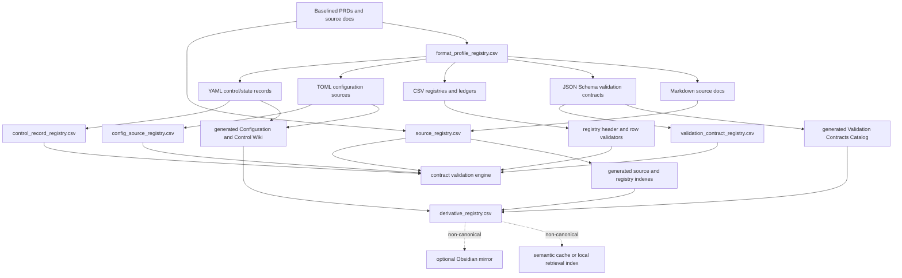

# `Sys4AI` PRD Integration Plan: Core Format Profiles, Configuration-Control Memory, and Validation Contracts

**Document status:** Recommendation implementation plan
**Prepared for:** `AngryOwlAI/Sys4AI-dev`
**Target project:** `Sys4AI`
**Target PRDs:**

- `PRDs/Sys4AI_phase-0_product_system_design_prd.md`
- `PRDs/Sys4AI_phase-1_implementation_initialization_prd.md`

**Prepared on:** 2026-07-06
**Primary design decision:** Add YAML, TOML, JSON Schema, CSV, and Markdown as governed core file-format memory profiles. Use a generated **Configuration and Control Wiki** for YAML and TOML. Use a generated **Validation Contracts Catalog** for JSON Schema. Do not create a standalone JSON wiki unless general JSON source or memory artifacts later become first-class project sources.

---

## 1. Executive summary

The current `Sys4AI` PRDs already define the right architecture skeleton: a meta-agentic framework, bounded AgentJobs, source-first memory, source/version-control governance, generated derivative surfaces, optional Obsidian as a non-canonical reader surface, and Phase 1 initialization around a Python scaffold, PyYAML, validators, registries, skills, and Makefile commands.

The recommended integration is not to bolt on three more file extensions as a side note. The stronger design is to promote them into a formal **core file-format memory profile system**. Each format gets a role, authority level, registry policy, validation method, derivative-surface policy, security rule, and promotion workflow.

The final architecture should read this way:

```text
Canonical and controlled sources:
  Markdown     human-authored PRDs, policies, guides, source docs
  CSV          registries, ledgers, relationship maps, provenance rows
  YAML         agent control records, state records, handoffs, receipts, skill manifests
  TOML         project, package, tool, runtime, and framework configuration
  JSON Schema  validation contracts for structured artifacts

Governance spine:
  source_registry.csv
  derivative_registry.csv
  object_relationship_registry.csv
  skill_registry.csv
  format_profile_registry.csv
  config_source_registry.csv
  control_record_registry.csv
  validation_contract_registry.csv

Validation spine:
  safe YAML parse
  TOML parse through stdlib tomllib on Python 3.11+ or tomli on Python 3.10
  JSON Schema contract validation
  CSV header and row validation
  cross-registry graph validation
  derivative freshness, source hash, and orphan checks

Derivative reader surfaces:
  Configuration and Control Wiki for YAML and TOML
  Validation Contracts Catalog for JSON Schema
  optional Obsidian mirror
  optional generated indexes
```

This plan integrates all prior recommendations into the PRDs and gives exact requirement IDs, section insertion points, repository additions, validators, command names, acceptance criteria, security controls, decision records, and implementation passes.

---

## 2. Source basis and current-state summary

This plan is based on the current public state of `AngryOwlAI/Sys4AI-dev`, the current public state of `AngryOwlAI/The-AEther-Flow`, and official format/runtime documentation for TOML, Python `tomllib`, JSON Schema, and the Python `jsonschema` validator.

### 2.1 `Sys4AI` current PRD baseline

The Phase 0 PRD already establishes `Sys4AI` as a domain-agnostic system development and management framework for AI agents. It states that the framework output is a governed target agentic system or implementation-ready package with roles, artifacts, requirements, architecture, verification hooks, operating assumptions, source-first memory rules, improvement loops, and maintenance obligations.[^sfa-p0]

The Phase 0 PRD already says the harness must include:

- a bounded control loop;
- an AgentJob-style execution contract;
- a source-first memory and knowledge system;
- source/version-control governance;
- derivative documentation surfaces such as generated wikis or reader artifacts.[^sfa-p0]

Phase 0 currently owns durable core requirements, including AgentJob semantics, `/continue`, source-first memory and knowledge requirements, source/version-control governance, documentation and derivative-surface rules, and acceptance criteria for moving into implementation initialization.[^sfa-p0]

Phase 1 currently owns repository initialization: concrete repository structure, Python virtual environment, dependency files, PyYAML installation, initial schemas and examples, validators, memory bootstrap files, skill adaptation, Makefile/CLI commands, environment decision records, and optional initial CI.[^sfa-p0]

The existing Phase 0 definitions already include **Source-first memory**, meaning canonical sources, registries, and control records outrank generated summaries, semantic caches, wikis, local vaults, and other derivatives.[^sfa-p0]

The current Phase 0 core requirements already include a YAML section requiring human-readable, machine-parseable control records, including AgentJobs, handoffs, completion receipts, registry manifests, task packets, skill manifests, and initialization manifests. It also requires safe YAML parsing by default.[^sfa-p0]

The current Phase 0 memory requirements already require source registries, derivative registries, object relationship registries, task/job registries, decision records, trace ledgers, issue ledgers, validation receipts, bootstrap, validate-only, drift detection, orphan-derivative detection, and retrieval that navigates back to authoritative sources.[^sfa-p0]

The current Phase 0 documentation requirements already require generated wiki, HTML, PDF, TeX, diagram, Obsidian, index, and semantic-cache surfaces to trace back to source files and registry rows, and to warn or block on stale, orphaned, unsourced, or authority-inverted documentation.[^sfa-p0]

### 2.2 `Sys4AI` current Phase 1 implementation baseline

The Phase 1 PRD currently initializes a minimal executable spine: Python environment, dependency policy, YAML control records, validators, skill adapters, memory registries, documentation policies, and a Docker decision record.[^sfa-p1]

Its current goals include adding PyYAML, safe YAML parsing, a `.venv` setup path, Makefile and CLI validation commands, initial YAML examples and schema-like specs, source-first memory registries, skill adapters, implementation plans, task packets, and a Docker decision.[^sfa-p1]

Its current non-goals include no production runtime service, no vector database, no full generated wiki engine, no forced Docker baseline, no canonical Obsidian memory, no opaque external skill imports, and no target-domain agent systems yet.[^sfa-p1]

The current implementation scaffold under `Sys4AI/` includes:

```text
control_records/
docs/
registries/
schemas/
skills/
sys_for_ai/
templates/
Makefile
README.md
pyproject.toml
requirements.txt
```

The scaffold README describes Phase 1 as initializing Python environment, YAML control records, validators, skill adapters, memory registries, and documentation policies. It also states the authority rule: canonical sources and registries outrank generated derivatives, while Obsidian/wiki/HTML/PDF/diagram/semantic-cache/index surfaces are reader aids unless explicitly promoted through a source-authority workflow.[^sfa-scaffold]

The current registry folder includes only these starter CSV registries:

```text
derivative_registry.csv
object_relationship_registry.csv
skill_registry.csv
source_registry.csv
```

The current schema folder contains YAML schema-like specs:

```text
agentjob.schema.yaml
discovery_record.schema.yaml
skill.schema.yaml
```

The current `pyproject.toml` requires Python `>=3.10` and depends only on `PyYAML>=6.0,<7.0`. The current `requirements.txt` contains the same PyYAML dependency.[^sfa-pyproject]

The current Makefile includes `doctor`, `validate-agentjob`, `validate-skills`, `validate-metrics`, `validate-discovery-template`, `bootstrap-memory`, and aggregate `validate` targets.[^sfa-makefile]

The current CLI exposes commands for doctor checks, AgentJob validation, skill manifest validation, metrics script validation, discovery-record validation, memory bootstrap, and aggregate validation.[^sfa-cli]

The current validators enforce required AgentJob fields, required skill manifest entries, expected adapter files, and registry headers for the four existing registries. Registry bootstrap creates missing registry files with expected headers.[^sfa-validators]

### 2.3 `The-AEther-Flow` memory system baseline

`The-AEther-Flow` is the strongest reference pattern for this integration. It uses a source-first repository memory system with canonical sources, CSV registries, control records, generated wikis, derivative registries, Obsidian surfaces, file-object relationships, content semantics, and tracked research-control artifacts.

Its root repository contains top-level areas such as `.agents`, `markdown`, `ontology`, `registries`, `research_control`, `scripts`, `tests`, `wiki`, and others.[^aether-root]

Its `registries/` folder contains many machine-checkable CSV registries, including AgentJob registries, role registries, Director decision registries, Markdown source registries, TeX source registries, PDF derivative registries, HTML explainer registries, wiki artifact registries, Obsidian vault registries, object relationship registries, content semantic registries, file object registries, role execution registries, claim boundary registries, and project-improvement signal registries.[^aether-registries]

The `registries/README.md` says the folder contains CSV registries and generated metadata sidecars that make the repository source graph machine-checkable. It classifies registry roles into source registries, control registries, and generated registries.[^aether-registries]

Its `wiki/` folder has file-type wiki surfaces for `html`, `indexes`, `markdown`, `pdf`, and `tex`.[^aether-wiki]

Its `research_control/` folder includes a tracked control spine with folders for approvals, design, handoffs, tasks, templates, and a `program_state.yaml` file. Its README describes an authority model where Director decision records, role contracts, AgentJobs, validators, and human-gated roles constrain research continuation. It also enforces a one-job rule for `/continue-research`.[^aether-research-control]

The pattern to generalize into `Sys4AI` is this:

```text
Sources and registries are authority.
Control records constrain bounded work.
Generated wikis are navigation.
Derivative artifacts are tracked and stale-checkable.
Obsidian is optional and derivative.
Memory use that affects control, claims, routing, or requirements must be verified against canonical files or registry rows.
```

### 2.4 Official format/runtime facts that affect the design

TOML describes itself as a minimal configuration file format for humans, designed to map unambiguously to a hash table and be easy to parse into data structures.[^toml]

Python `tomllib` was added in Python 3.11, parses TOML 1.0.0, returns dictionaries, does not support writing TOML, and warns that malicious TOML inputs can consume considerable CPU and memory, so input size limits are recommended.[^tomllib]

JSON Schema’s current specification version is 2020-12. The specification is split into Core and Validation. JSON Schema meta-schemas are schemas against which other schemas can be validated.[^json-schema]

The Python `jsonschema` package supports validating instances against schemas and should be the initial Phase 1 validator dependency if the project chooses executable validation contracts instead of documentation-only schema files.[^jsonschema-py]

---

## 3. Strategic design decision

### 3.1 The recommended decision

Adopt this PRD-level decision:

> `Sys4AI` SHALL treat Markdown, CSV, YAML, TOML, and JSON Schema as core file-format memory profiles. YAML SHALL be the preferred core format for agent control/state records. TOML SHALL be the preferred core format for project/tool/runtime configuration. JSON Schema SHALL be the preferred core format for validation contracts. YAML and TOML artifacts SHALL be indexed by a generated Configuration and Control Wiki. JSON Schema artifacts SHALL be indexed by a generated Validation Contracts Catalog. A standalone JSON wiki SHALL NOT be created unless general JSON source or memory artifacts become first-class project sources later.

This decision converts the user request from “add file extensions” into a governed memory architecture. File extensions by themselves are costume jewelry. Format profiles are the gears under the clock face.

### 3.2 Why YAML and TOML belong together

YAML and TOML should share a derivative reader surface because their project role is adjacent:

| Format | Core role | Typical artifact | Authority type | Human surface |
|---|---|---|---|---|
| YAML | Agent control and state | AgentJob, handoff, receipt, task packet, skill manifest, state snapshot | Control record | Configuration and Control Wiki |
| TOML | Project/tool/runtime configuration | `pyproject.toml`, framework config, target-project config template | Configuration source | Configuration and Control Wiki |

The generated wiki should be named **Configuration and Control Wiki** because:

- “Configuration Wiki” misses YAML control/state and AgentJob semantics.
- “Control Wiki” misses TOML project/tool/runtime configuration.
- “Configuration and Control Wiki” says exactly what the surface is for.

The wiki should be generated, derivative, and non-canonical. It should index YAML and TOML artifacts, summarize what each artifact controls, show registry IDs, show validation status, show source paths, show source hashes, show generator metadata, and link back to canonical files and registry rows.

### 3.3 Why JSON Schema should not get a JSON wiki by default

JSON Schema should be implemented as a **Validation Contracts Catalog**, not a JSON wiki.

Reasoning:

1. JSON Schema is not primarily narrative memory.
2. JSON Schema is a contract language for validating structured data.
3. A wiki is for human navigation through knowledge artifacts.
4. A catalog is better for contracts because it can show schema IDs, dialects, target artifacts, target globs, validator commands, supersession, compatibility, and validation status.
5. A JSON wiki should appear only if `Sys4AI` later adopts ordinary JSON files as first-class memory/source artifacts, such as tool-call trace files, state snapshots, API fixtures, structured evaluation records, or object stores.

Decision rule:

```text
JSON Schema = Validation Contracts Catalog.
General JSON source artifacts = possible future JSON Wiki.
No general JSON source artifacts = no JSON Wiki.
```

### 3.4 CSV should be explicitly promoted to core status

The existing Phase 1 scaffold already uses CSV registries, and `The-AEther-Flow` demonstrates that CSV registries can serve as the machine-checkable spine of a source-first memory system. Therefore CSV should be explicitly named in Phase 0 as a core registry/ledger format, not left as an implementation accident.

CSV’s core role:

```text
CSV = row-oriented authority for registries, ledgers, relationships, provenance, and validation inventories.
```

CSV should not be treated as a wiki. It should be treated as a registry/ledger format with header validation, row validation, stable IDs, authority status, source paths, hashes where practical, and cross-registry graph checks.

---

## 4. Target architecture

### 4.1 Core file-format memory profile model

Add a new concept: **Core File-Format Memory Profile**.

A profile defines:

| Field | Meaning |
|---|---|
| `format_id` | Stable ID for the governed format profile. |
| `extension` | Primary extension or extension pattern. |
| `format_family` | Markdown, CSV, YAML, TOML, JSON Schema, etc. |
| `primary_role` | What this format is for inside `Sys4AI`. |
| `authority_class` | Source, registry, control record, configuration source, validation contract, derivative, cache. |
| `canonical_roots` | Allowed source roots or file globs. |
| `derivative_surfaces` | Allowed generated surfaces. |
| `registry_required` | Whether registry inventory is mandatory. |
| `validator_required` | Whether executable validation is mandatory. |
| `promotion_rule` | How external or derivative artifacts become canonical. |
| `secrets_allowed` | Whether sensitive values may appear. Default false for Phase 1. |
| `drift_policy` | How stale, missing, orphaned, or hash-mismatched files are handled. |
| `security_policy` | Parsing, size limits, loader restrictions, redaction rules. |

### 4.2 Initial core profiles

| Format | Profile ID | Primary role | Canonical home | Registry | Derivative surface | Validator |
|---|---|---|---|---|---|---|
| Markdown | `fmt_markdown_source` | Human-authored source docs | `PRDs/`, `docs/`, `templates/` | `source_registry.csv` | Markdown/source index, optional wiki mirror | Optional lint in Phase 1 |
| CSV | `fmt_csv_registry` | Registries and ledgers | `registries/` | self and source registry | Registry index | Header and row checks |
| YAML | `fmt_yaml_control` | Agent control/state | `control_records/`, `skills/`, schema-like specs | `control_record_registry.csv`, `source_registry.csv` | Configuration and Control Wiki | Safe parse plus JSON Schema contract where available |
| TOML | `fmt_toml_config` | Project/tool/runtime config | `pyproject.toml`, `configs/`, `templates/config/` | `config_source_registry.csv`, `source_registry.csv` | Configuration and Control Wiki | TOML parse plus JSON Schema contract where available |
| JSON Schema | `fmt_jsonschema_contract` | Validation contracts | `schemas/contracts/` | `validation_contract_registry.csv`, `source_registry.csv` | Validation Contracts Catalog | Meta-schema and target-example validation |

### 4.3 Authority hierarchy after integration

Update authority rules to make the new profiles explicit:

1. Baselined PRDs and registered product/system source documents.
2. Registered validation contracts, when they implement PRD-authorized constraints.
3. Registered configuration sources.
4. Registered control records and decision records.
5. Registered CSV registry rows and ledgers.
6. Registered Markdown source documents and templates.
7. Validated generated derivative catalogs, wikis, indexes, and explainers.
8. Optional Obsidian mirrors, semantic caches, local query indexes, generated summaries, and unvalidated generated notes.

Important nuance:

```text
PRD beats schema.
Schema beats malformed artifact.
Registry beats generated summary.
Canonical source beats wiki.
Validated derivative beats stale derivative.
Nothing generated becomes canonical without promotion.
```

Validation contracts should be high authority, but only inside the authority granted by the PRDs. A schema that contradicts the Phase 0 PRD is stale, not sovereign.

### 4.4 Target memory/format architecture diagram

Add or adapt this Mermaid diagram in the Phase 0 conceptual model or CKMSRA section:



---

## 5. PRD integration strategy

### 5.1 Do not rewrite everything

The current PRDs are structurally compatible with this change. Preserve existing IDs where possible. Add new sections and new IDs rather than renumbering existing requirements.

The integration should be additive and surgical:

1. Add definitions.
2. Expand Phase 0 ownership wording to include format-profile requirements.
3. Replace or augment the Phase 0 YAML section with a structured-format profile section.
4. Add new Phase 0 core requirements for CSV, YAML, TOML, JSON Schema, Configuration and Control Wiki, and Validation Contracts Catalog.
5. Add detailed Phase 0 rows for `SFA-P0-FR-031` onward.
6. Expand CKMSRA and SVCDA annex content.
7. Update handoff and completion evidence templates.
8. Update Phase 1 goals, non-goals, dependencies, repository layout, memory scaffold, validators, acceptance criteria, and recommended AgentJob.
9. Add decision records and implementation-plan references.

### 5.2 Preserve the Phase 0 / Phase 1 boundary

Phase 0 should state durable product requirements and target-system architecture requirements. It should not prescribe exact dependency versions beyond policy-level constraints except where the Python reference implementation already does so.

Phase 1 should specify repository additions, dependency files, validators, commands, example files, generated derivative stubs, and acceptance checks.

Use this boundary:

```text
Phase 0 says what the framework must require.
Phase 1 says what the current repository must create first.
```

### 5.3 Requirement ID policy

Use the following ID families:

| Family | Use |
|---|---|
| `SFA-CORE-FORMAT-*` | Core format profile requirements. |
| `SFA-CORE-CSV-*` | CSV registry/ledger requirements. |
| `SFA-CORE-YAML-*` | YAML control/state requirements. Existing IDs stay intact. |
| `SFA-CORE-TOML-*` | TOML configuration requirements. |
| `SFA-CORE-JSONSCHEMA-*` | JSON Schema validation-contract requirements. |
| `SFA-CORE-CCWIKI-*` | Configuration and Control Wiki requirements. |
| `SFA-CORE-VCCAT-*` | Validation Contracts Catalog requirements. |
| `SFA-P0-FR-031+` | Detailed Phase 0 functional requirements. |
| `SFA-P1-INIT-FORMAT-*` | Phase 1 format-profile initialization. |
| `SFA-P1-INIT-TOML-*` | Phase 1 TOML parser/config initialization. |
| `SFA-P1-INIT-CONTRACT-*` | Phase 1 JSON Schema contract initialization. |
| `SFA-P1-INIT-CCWIKI-*` | Phase 1 Configuration and Control Wiki stub generation. |
| `SFA-P1-INIT-VCCAT-*` | Phase 1 Validation Contracts Catalog stub generation. |
| `SFA-P1-INIT-VAL-*` | Extended validation requirements. |

---

## 6. Phase 0 PRD integration plan

### 6.1 Edit map for Phase 0

Target file:

```text
PRDs/Sys4AI_phase-0_product_system_design_prd.md
```

Recommended edits:

| PRD area | Current role | Required edit |
|---|---|---|
| Header / change log | Records baseline | Add change-log row for core format profiles. |
| Section 3.1 Phase 0 owns | Lists core requirement ownership | Add “core file-format memory profile requirements.” |
| Section 3.2 Phase 1 owns | Lists initialization responsibilities | Add “initial format-profile registries, validation contracts, and generated derivative catalog stubs.” |
| Section 4 Definitions | Defines memory, derivative surfaces, etc. | Add definitions for Core File-Format Memory Profile, Configuration Source, Control Record, Validation Contract, Configuration and Control Wiki, Validation Contracts Catalog. |
| Section 5 Problem/product vision | Names memory authority inversion and derivative drift | Add config/control/schema drift as explicit failure modes. |
| Section 6.5 Python reference implementation | Mentions YAML control records | Expand to structured parsers, validators, and documentation-generation helpers. |
| Section 6.6 YAML and PyYAML | YAML-only | Preserve existing YAML requirements and add subsections for core formats, CSV, TOML, JSON Schema, generated surfaces. |
| Section 6.8 Source-first memory | Source-first memory | Add format profiles and validation contracts to memory requirements. |
| Section 6.10 Documentation governance | Generated derivatives | Add Configuration and Control Wiki plus Validation Contracts Catalog. |
| Section 6.11 SVC | Versioning | Add format-profile, configuration, control, and validation-contract versioning. |
| Section 7 Detailed requirements | Functional/NFR table | Add `SFA-P0-FR-031` through `SFA-P0-FR-045` and new NFRs. |
| Section 8 Conceptual model | Diagrams | Add or update memory architecture diagram. |
| Section 12.9 CKMSRA | Memory annex | Add format profile content and validation-catalog requirements. |
| Section 12.10 SVCDA | SVC/derivative annex | Add format-profile and contract governance. |
| Section 13.2 Universal handoff contract | Handoff block | Add format/registry/validation/source-authority evidence fields. |
| Risks/open issues | Project risks | Add config/contract drift and parser/security risks. |
| Acceptance criteria | Phase close | Add core profile acceptance criteria. |

### 6.2 Phase 0 section 3.1 amendment

Add this bullet under “Phase 0 owns”:

```markdown
- Core file-format memory profile requirements for canonical sources, registries, control records, configuration sources, validation contracts, and generated derivative surfaces.
```

Rationale: this makes file-format governance a durable product requirement, not just Phase 1 implementation furniture.

### 6.3 Phase 0 section 3.2 amendment

Add these bullets under “Phase 1 owns”:

```markdown
- Initial core file-format profile registries.
- Initial TOML configuration examples and parser support.
- Initial JSON Schema validation-contract files and validator support.
- Initial generated Configuration and Control Wiki stubs.
- Initial generated Validation Contracts Catalog stubs.
```

Rationale: Phase 1 should instantiate the new product requirements without pretending to finish a production memory platform.

### 6.4 Phase 0 definitions to add

Add these definitions to Section 4.

```markdown
| Term | Definition |
|---|---|
| Core File-Format Memory Profile | A governed classification for a source or derivative file format that defines the format's intended system role, authority class, canonical roots, registry requirements, validator requirements, derivative surfaces, promotion workflow, drift/orphan behavior, and security constraints. |
| Configuration Source | A machine-readable file that defines standing project, package, tool, runtime, or framework behavior. Configuration sources are canonical only when registered and validated. |
| Control Record | A machine-readable artifact that constrains or reports bounded agent action, including AgentJobs, handoffs, completion receipts, task packets, role-routing records, state snapshots, skill/control manifests, and initialization manifests. |
| Validation Contract | A machine-readable schema or equivalent constraint document that defines admissible structure and type constraints for another artifact class. Validation contracts are governance artifacts, not ordinary generated documentation. |
| Configuration and Control Wiki | A generated derivative reader surface for registered YAML control/state artifacts and TOML configuration artifacts. It summarizes and links to canonical source files, registry rows, validators, consumers, and authority status. |
| Validation Contracts Catalog | A generated derivative catalog for validation contracts, including JSON Schema contracts. It summarizes contract IDs, dialects, target formats, target artifact classes, target globs, supersession, validation commands, and usage relationships. |
| Format Profile Registry | A CSV registry that records core and project-specific file-format memory profiles. |
| Configuration Source Registry | A CSV registry that records registered configuration sources, including TOML files and any later configuration formats. |
| Control Record Registry | A CSV registry that records registered control/state artifacts, including YAML AgentJobs, handoffs, receipts, task packets, state snapshots, skill manifests, and routing manifests. |
| Validation Contract Registry | A CSV registry that records registered validation contracts, including JSON Schema files. |
```

### 6.5 Add problem/failure modes

Add these rows to the “Common failure modes” table:

```markdown
| Failure mode | Description |
|---|---|
| Configuration authority drift | Project, tool, runtime, or framework configuration changes without registry trace, validator evidence, or source-authority review. |
| Control-record ambiguity | Agent control/state records exist as loose YAML files without registry IDs, validation contracts, allowed writers, or supersession rules. |
| Schema theater | Schema-like files document structure but are not executable contracts, so invalid control/config artifacts can pass as if validated. |
| Format-profile confusion | Markdown, CSV, YAML, TOML, JSON, generated wiki notes, and local vault notes are mixed without clear authority class or promotion rules. |
```

### 6.6 Replace Section 6.6 title

Current title:

```markdown
### 6.6 YAML and PyYAML
```

Recommended title:

```markdown
### 6.6 Core structured file-format memory profiles
```

Keep existing YAML requirements intact as `SFA-CORE-YAML-001` through `SFA-CORE-YAML-004`. Then add the following subsections.

### 6.7 Add core format profile requirements

Add:

```markdown
`SFA-CORE-FORMAT-001`: `Sys4AI` shall define governed core file-format memory profiles.

`SFA-CORE-FORMAT-002`: Each core file-format memory profile shall define intended role, authority class, canonical source roots, derivative roots, registry requirements, validator requirements, promotion workflow, stale/orphan/drift behavior, and security constraints.

`SFA-CORE-FORMAT-003`: The initial core file-format profiles shall include Markdown, CSV, YAML, TOML, and JSON Schema.

`SFA-CORE-FORMAT-004`: Core format profiles shall preserve source-first authority and shall not allow generated derivatives, semantic caches, local vault files, or wiki pages to become canonical without explicit promotion.

`SFA-CORE-FORMAT-005`: Memory retrieval that returns a governed file artifact shall expose the artifact's format profile, authority class, registry row, validator status, derivative freshness, and source path where available.

`SFA-CORE-FORMAT-006`: Project-specific file-format profiles may be added later through a controlled registry and PRD/decision-record workflow, but shall not weaken the authority hierarchy defined by Phase 0.
```

### 6.8 Add Markdown profile requirements

Add:

```markdown
`SFA-CORE-MD-001`: `Sys4AI` shall treat Markdown as a core format for human-authored PRDs, policies, guides, requirements artifacts, templates, and source documentation.

`SFA-CORE-MD-002`: Registered Markdown source artifacts shall declare authority status through source registries or equivalent controlled artifact inventories.

`SFA-CORE-MD-003`: Generated Markdown notes, wiki pages, Obsidian notes, indexes, summaries, and mirrors shall be derivative unless explicitly promoted through source-authority workflow.
```

### 6.9 Add CSV profile requirements

Add:

```markdown
`SFA-CORE-CSV-001`: `Sys4AI` shall treat CSV as a core format for registries, ledgers, relationship maps, provenance rows, and agent-queryable memory tables.

`SFA-CORE-CSV-002`: CSV registry files shall have stable headers, stable row IDs where applicable, and deterministic validation.

`SFA-CORE-CSV-003`: CSV registries shall support cross-registry graph checks for missing source files, missing derivatives, missing validation contracts, orphan derivatives, stale hashes, and invalid authority classes.

`SFA-CORE-CSV-004`: CSV registries shall be treated as controlled source or registry artifacts, not generated reader surfaces, unless a specific registry is explicitly marked generated and derivative.

`SFA-CORE-CSV-005`: `Sys4AI` shall support both core registries and project-specific registries while requiring each registry to declare purpose, owner, authority status, expected header, validation method, and promotion rule.
```

### 6.10 Extend YAML requirements

Existing YAML IDs should remain. Add:

```markdown
`SFA-CORE-YAML-005`: YAML shall be the preferred core format for human-readable and machine-parseable agent control/state artifacts.

`SFA-CORE-YAML-006`: YAML control/state artifacts shall include AgentJobs, handoffs, completion receipts, task packets, skill manifests, role-routing manifests, initialization manifests, and bounded state snapshots when such artifacts are required.

`SFA-CORE-YAML-007`: Registered YAML control/state artifacts shall have registry rows identifying record type, owner, authority status, allowed writers, validation contract, supersession relation, and source path.

`SFA-CORE-YAML-008`: YAML control/state artifacts that affect routing, permissions, AgentJob boundaries, continuation state, role execution, or completion evidence shall be validated before use.

`SFA-CORE-YAML-009`: YAML parsing shall use safe loading only. Unsafe object construction shall be prohibited unless a trusted-loader exception is explicitly documented, reviewed, and isolated from untrusted inputs.

`SFA-CORE-YAML-010`: YAML control/state artifacts shall be indexed through the generated Configuration and Control Wiki when they are registered as canonical or controlled artifacts.
```

### 6.11 Add TOML requirements

Add:

```markdown
`SFA-CORE-TOML-001`: `Sys4AI` shall treat TOML as the preferred core format for static or semi-static project, package, tool, runtime, target-system template, and framework configuration.

`SFA-CORE-TOML-002`: TOML configuration sources shall be used for configuration that benefits from human readability, comments, deterministic parsing, and mapping to dictionary-like structures.

`SFA-CORE-TOML-003`: Registered TOML configuration sources shall have registry rows identifying configuration domain, owner, authority status, parser, validation contract, consumers, environment scope, secrets policy, supersession relation, and source path.

`SFA-CORE-TOML-004`: TOML configuration sources shall be parsed through the Python standard library `tomllib` when the supported Python version is 3.11 or later, or through a lightweight compatible parser when Python 3.10 support is retained.

`SFA-CORE-TOML-005`: Phase 1 TOML support shall parse and validate TOML sources but shall not require style-preserving TOML editing or TOML writing.

`SFA-CORE-TOML-006`: TOML configuration examples and templates shall not contain secrets. Secret-bearing configuration support is out of Phase 1 scope unless a later security PRD defines classification, redaction, storage, and review controls.

`SFA-CORE-TOML-007`: Registered TOML configuration sources shall be indexed through the generated Configuration and Control Wiki.
```

### 6.12 Add JSON Schema requirements

Add:

```markdown
`SFA-CORE-JSONSCHEMA-001`: `Sys4AI` shall treat JSON Schema as the preferred core format for validation contracts governing structured artifacts.

`SFA-CORE-JSONSCHEMA-002`: JSON Schema validation contracts shall be allowed to govern JSON files, parsed YAML objects, TOML-normalized objects, CSV row objects, registry rows, control records, skill manifests, discovery records, and configuration profiles.

`SFA-CORE-JSONSCHEMA-003`: JSON Schema contracts shall declare dialect/version, contract ID, target format, target artifact type, target file glob, owner, authority status, supersession relation, and validator command.

`SFA-CORE-JSONSCHEMA-004`: JSON Schema validation success shall mean structural admissibility, not semantic truth, domain correctness, or user acceptance.

`SFA-CORE-JSONSCHEMA-005`: JSON Schema contracts shall be cataloged through the generated Validation Contracts Catalog.

`SFA-CORE-JSONSCHEMA-006`: `Sys4AI` shall not create a standalone JSON wiki by default for JSON Schema files. A JSON wiki may be introduced later only if JSON files become first-class source or memory artifacts beyond validation contracts.

`SFA-CORE-JSONSCHEMA-007`: JSON Schema contracts shall support supersession and migration evidence when schema changes affect existing registered artifacts.
```

### 6.13 Add Configuration and Control Wiki requirements

Add:

```markdown
`SFA-CORE-CCWIKI-001`: `Sys4AI` shall define a generated Configuration and Control Wiki for registered YAML control/state artifacts and TOML configuration sources.

`SFA-CORE-CCWIKI-002`: The Configuration and Control Wiki shall be derivative and non-canonical by default.

`SFA-CORE-CCWIKI-003`: Each generated Configuration and Control Wiki page shall identify source files, registry rows, format profile IDs, validation contract IDs, source hashes where available, generator version, generation timestamp, authority status, stale/orphan status, and allowed promotion path.

`SFA-CORE-CCWIKI-004`: The Configuration and Control Wiki shall warn or fail validation when a page lacks a canonical source path, lacks a registry row, claims canonical authority, or is stale relative to its source.

`SFA-CORE-CCWIKI-005`: The Configuration and Control Wiki may be mirrored into Obsidian or another reader surface only as a derivative view.
```

### 6.14 Add Validation Contracts Catalog requirements

Add:

```markdown
`SFA-CORE-VCCAT-001`: `Sys4AI` shall define a generated Validation Contracts Catalog for JSON Schema contracts and any future validation-contract formats.

`SFA-CORE-VCCAT-002`: The Validation Contracts Catalog shall be derivative and non-canonical by default.

`SFA-CORE-VCCAT-003`: Each generated catalog entry shall identify contract ID, source path, dialect/version, target format, target artifact type, target file glob, validator command, owner, authority status, supersession relation, source hash where available, generator version, generation timestamp, stale/orphan status, and known limitations.

`SFA-CORE-VCCAT-004`: The Validation Contracts Catalog shall not be treated as a JSON wiki unless a later PRD or decision record introduces general JSON source/memory artifacts.

`SFA-CORE-VCCAT-005`: The Validation Contracts Catalog shall link validation contracts to every registry row, control record, configuration source, or template that declares the contract.
```

### 6.15 Update Section 6.8 Source-first memory

Add these requirements after `SFA-CORE-MEM-005`:

```markdown
`SFA-CORE-MEM-006`: The source-first memory system shall track core file-format profiles for Markdown, CSV, YAML, TOML, and JSON Schema.

`SFA-CORE-MEM-007`: The source-first memory system shall include or support registries for format profiles, configuration sources, control records, and validation contracts.

`SFA-CORE-MEM-008`: Memory retrieval shall not return a structured artifact as actionable authority unless the retrieval result includes source path, authority status, registry evidence, and validation status where such evidence exists.

`SFA-CORE-MEM-009`: Memory preflight shall verify YAML control records, TOML configuration sources, JSON Schema contracts, and CSV registry rows against canonical source files or registry rows before they affect requirements, routing, claims, AgentJob boundaries, handoffs, permissions, or continuation state.
```

### 6.16 Update Section 6.10 Documentation and derivative-surface governance

Add:

```markdown
`SFA-CORE-DOC-004`: The generated Configuration and Control Wiki shall be the default derivative reader surface for registered YAML control/state artifacts and TOML configuration sources.

`SFA-CORE-DOC-005`: The generated Validation Contracts Catalog shall be the default derivative reader surface for JSON Schema validation contracts.

`SFA-CORE-DOC-006`: Generated Configuration and Control Wiki pages and Validation Contracts Catalog pages shall never be hand-edited as canonical sources.

`SFA-CORE-DOC-007`: Generated derivative pages shall include authority banners stating that canonical authority remains with registered sources, registries, and validation contracts.
```

### 6.17 Update Section 6.11 Source/version control

Add:

```markdown
`SFA-CORE-SVC-003`: `Sys4AI` shall define source/version-control expectations for format profiles, configuration sources, control records, validation contracts, and their generated derivative surfaces.

`SFA-CORE-SVC-004`: Configuration sources, control records, and validation contracts shall support supersession, source hashing where practical, registry trace, validation evidence, and rollback/migration evidence when changed.

`SFA-CORE-SVC-005`: Generated Configuration and Control Wiki pages and Validation Contracts Catalog pages shall include regeneration metadata and shall be invalid when stale, orphaned, unsourced, or authority-inverted.
```

### 6.18 Add detailed Phase 0 functional requirements

Add these rows after `SFA-P0-FR-030`.

| ID | Requirement | Priority | Verification method | Acceptance criteria |
|---|---|---:|---|---|
| `SFA-P0-FR-031` | `Sys4AI` shall define core file-format memory profiles for Markdown, CSV, YAML, TOML, and JSON Schema. | Must | Inspection | Phase 0 includes profile definitions and role/authority assignments for all five formats. |
| `SFA-P0-FR-032` | `Sys4AI` shall classify each governed file format by authority class, mutability, registry requirement, validator requirement, derivative policy, promotion workflow, drift behavior, and security policy. | Must | Inspection | CKMSRA or SVCDA includes a classification matrix covering each axis. |
| `SFA-P0-FR-033` | YAML shall be assigned to agent control/state artifacts. | Must | Inspection | AgentJobs, handoffs, receipts, task packets, skill manifests, routing manifests, initialization manifests, and state snapshots are named as YAML-eligible artifacts. |
| `SFA-P0-FR-034` | TOML shall be assigned to project, package, tool, runtime, framework, and target-system configuration sources. | Must | Inspection | Phase 0 defines TOML configuration source semantics and authority constraints. |
| `SFA-P0-FR-035` | JSON Schema shall be assigned to validation contracts. | Must | Inspection | Phase 0 defines JSON Schema contract semantics, target artifact mapping, dialect/version expectations, and validator evidence. |
| `SFA-P0-FR-036` | CSV shall be assigned to registries, ledgers, relationship maps, and provenance rows. | Must | Inspection | Phase 0 explicitly names CSV as a core registry/ledger format. |
| `SFA-P0-FR-037` | `Sys4AI` shall define a generated Configuration and Control Wiki for YAML and TOML artifacts. | Must | Inspection | Phase 0 states the wiki is derivative, non-canonical, registry-traced, hash-aware where practical, and stale-checkable. |
| `SFA-P0-FR-038` | `Sys4AI` shall define a generated Validation Contracts Catalog for JSON Schema artifacts. | Must | Inspection | Phase 0 states the catalog is derivative, non-canonical, contract-traced, and target-artifact-aware. |
| `SFA-P0-FR-039` | `Sys4AI` shall not define a standalone JSON wiki by default for JSON Schema files. | Must | Inspection | Phase 0 includes an explicit decision that JSON Schema uses a Validation Contracts Catalog, and a JSON wiki requires future general JSON source/memory artifacts. |
| `SFA-P0-FR-040` | CKMSRA shall require memory retrieval to expose file-format profile, registry row, authority status, validation status, and derivative freshness for governed artifacts where available. | Must | Scenario review | Retrieval examples include structured source evidence and prohibit silent promotion of derivative summaries. |
| `SFA-P0-FR-041` | SVCDA shall define versioning, supersession, hash/provenance, migration, and rollback expectations for configuration sources, control records, and validation contracts. | Must | Inspection | SVCDA includes dedicated entries for configuration, control, and validation-contract artifacts. |
| `SFA-P0-FR-042` | `Sys4AI` shall treat schema validation as process/structure evidence, not domain truth or user acceptance. | Must | Inspection | CLRA/CKMSRA/SVCDA and validator sections state this distinction. |
| `SFA-P0-FR-043` | YAML and TOML examples shall not contain secrets by default. | Must | Security review | Security requirements classify secrets as out of Phase 1 scope unless later PRD controls exist. |
| `SFA-P0-FR-044` | Generated Configuration and Control Wiki pages and Validation Contracts Catalog pages shall include authority banners and source trace. | Must | Inspection | Derivative-page templates include authority notice, source path, registry ID, generator metadata, and stale/orphan status. |
| `SFA-P0-FR-045` | Project-specific format profiles may be added later only through controlled registry, validation, and authority-boundary workflows. | Should | Review | CKMSRA defines project-specific extension workflow and does not allow weakening core authority rules. |

### 6.19 Add non-functional requirements

Add these to the NFR table:

| ID | Requirement | Priority | Verification method | Acceptance criteria |
|---|---|---:|---|---|
| `SFA-P0-NFR-014` | The framework shall make structured artifact authority inspectable by agents and humans. | Must | Simulation | A root agent can determine whether a YAML, TOML, CSV, Markdown, or JSON Schema artifact is canonical, controlled, derivative, stale, or invalid. |
| `SFA-P0-NFR-015` | The framework shall minimize parser and schema dependencies while preserving deterministic validation. | Should | Architecture review | Phase 1 dependency policy separates lightweight parser/validator dependencies from heavy runtime services. |
| `SFA-P0-NFR-016` | The framework shall prevent configuration/control/security drift caused by unregistered structured files. | Must | Validation review | Validators detect unregistered governed YAML/TOML/JSON Schema files in controlled roots. |
| `SFA-P0-NFR-017` | The framework shall keep generated reader surfaces subordinate to registered sources, registries, and validation contracts. | Must | Inspection | Generated wiki/catalog policy states non-canonical status and promotion workflow. |

### 6.20 CKMSRA update

Current CKMSRA says it defines the memory and knowledge system and keeps retrieval convenience subordinate to source authority. Extend it with the following subsection.

```markdown
#### Core file-format memory profiles

CKMSRA SHALL define file-format memory profiles for Markdown, CSV, YAML, TOML, and JSON Schema.

For each profile, CKMSRA SHALL specify:

- primary system role;
- allowed canonical roots;
- allowed derivative roots;
- authority class;
- mutability model;
- primary users and agent consumers;
- registry representation;
- validation mode;
- derivative surface policy;
- secrets and redaction policy;
- promotion workflow;
- stale, orphan, and drift behavior;
- memory retrieval behavior.

CKMSRA SHALL require memory retrieval results for governed files to include authority status, source path, registry row ID, format profile ID, validator status, source hash where available, and derivative freshness where applicable.
```

Add this classification matrix to CKMSRA.

| Format | Authority class | Primary system role | Registry | Validator | Derivative policy |
|---|---|---|---|---|---|
| Markdown | Source or derivative depending on registry status | Human-authored PRDs, policies, guides, templates, and generated notes | Source or derivative registry | Optional lint in Phase 1 | Markdown index or optional wiki mirror |
| CSV | Registry or ledger | Source graph, provenance, relationships, task/job ledgers | Registry headers and source registry | Header, row, and graph checks | Registry index only |
| YAML | Control record | AgentJobs, handoffs, receipts, skill manifests, task packets, state snapshots | Control record registry and source registry | Safe parse and contract validation | Configuration and Control Wiki |
| TOML | Configuration source | Project/tool/runtime/framework/target config | Config source registry and source registry | TOML parse and contract validation | Configuration and Control Wiki |
| JSON Schema | Validation contract | Validates structured artifacts | Validation contract registry and source registry | Meta-schema and target-example checks | Validation Contracts Catalog |

### 6.21 SVCDA update

Current SVCDA defines how target systems preserve controlled history without letting generated surfaces become ghost authorities. Extend it with:

```markdown
#### Structured format versioning and derivative governance

SVCDA SHALL define version-control rules for:

1. Format profile registries.
2. Configuration sources, especially TOML configuration files.
3. Control records, especially YAML AgentJobs, handoffs, receipts, and state snapshots.
4. Validation contracts, especially JSON Schema files.
5. Generated Configuration and Control Wiki pages.
6. Generated Validation Contracts Catalog pages.

SVCDA SHALL require source/version records to capture stable IDs, source paths, authority status, owner, source hash where practical, validation status, supersession, migration evidence, and rollback or recovery guidance.

SVCDA SHALL require generated derivative pages to include source path, source hash where practical, registry ID, generator version, generation timestamp, and stale/orphan status.
```

Add this derivative-governance rule:

```markdown
Generated Configuration and Control Wiki pages and Validation Contracts Catalog pages SHALL be invalid if they claim canonical status, omit source trace, omit registry trace, or remain stale after source changes.
```

### 6.22 Universal handoff contract update

Add fields to the existing handoff block:

```yaml
format_profile_evidence:
  governed_artifacts_read:
    - path:
      format_profile_id:
      authority_status:
      registry_row_id:
      validation_status:
  governed_artifacts_written:
    - path:
      format_profile_id:
      authority_status:
      registry_row_id:
      validation_contract_id:
      validation_status:
source_authority_evidence:
  canonical_sources_inspected:
    - path:
      source_id:
      relevant_sections:
  registry_rows_inspected:
    - registry:
      row_id:
      purpose:
derivative_surface_evidence:
  generated_surfaces_updated:
    - path:
      derivative_id:
      source_ids:
      stale_or_orphan_status:
security_evidence:
  secrets_check:
    status: passed | warning | failed | not_applicable
    notes:
```

Rationale: a handoff that touches YAML, TOML, JSON Schema, or CSV should carry enough evidence for a later agent to resume without spelunking through context fog.

### 6.23 Completion receipt update

Add this structure to completion receipts:

```yaml
validation_evidence:
  commands_run:
    - command:
      result: pass | fail | warning
      output_path:
  validators:
    - validator_id:
      target_path:
      result:
      notes:
format_profile_changes:
  added:
    - path:
      profile_id:
      registry_row_id:
  modified:
    - path:
      profile_id:
      registry_row_id:
  generated_derivatives:
    - path:
      derivative_id:
      source_ids:
      generator:
      stale_status:
authority_changes:
  promoted:
    - path:
      from_status:
      to_status:
      approval_or_decision_id:
  not_promoted:
    - path:
      reason:
```

### 6.24 Phase 0 risks to add

| ID | Risk | Impact | Mitigation |
|---|---|---|---|
| `SFA-P0-RISK-FORMAT-001` | Format profile sprawl creates too many registries too early. | Agents get a bigger map than the territory requires. | Phase 1 implements only minimal registries and stubs; project-specific profiles require later decision records. |
| `SFA-P0-RISK-FORMAT-002` | JSON Schema is mistaken for semantic truth. | Invalid domain conclusions may pass because shape validation passed. | PRD states validation contracts prove structural admissibility only. |
| `SFA-P0-RISK-FORMAT-003` | TOML/YAML files contain secrets that leak into generated wikis. | Security and privacy exposure. | Phase 1 forbids secrets in examples and validates secret-like keys. Future secret support requires security PRD. |
| `SFA-P0-RISK-FORMAT-004` | Generated wiki/catalog pages become ghost authorities. | Memory authority inversion. | Authority banners, derivative registry rows, stale checks, and promotion workflow. |
| `SFA-P0-RISK-FORMAT-005` | Python version policy conflicts with TOML parser choice. | Phase 1 setup confusion. | Keep Python `>=3.10` and add conditional `tomli`, or bump to Python `>=3.11` by explicit decision. |
| `SFA-P0-RISK-FORMAT-006` | Validators become decorative and incomplete. | Schema theater. | Add executable JSON Schema validation and cross-registry graph checks as acceptance criteria. |

### 6.25 Phase 0 open issues to add

| ID | Open issue | Recommended disposition |
|---|---|---|
| `SFA-P0-ISSUE-FORMAT-001` | Should Python minimum remain `>=3.10` or move to `>=3.11`? | Do not block PRD update. Phase 1 decision: keep `>=3.10` with conditional `tomli` unless maintainers choose to bump. |
| `SFA-P0-ISSUE-FORMAT-002` | Should JSON Schema contracts become mandatory for all YAML/TOML artifacts in Phase 1? | Use staged enforcement: mandatory for examples and new core registries; warn for legacy schema-like YAML until converted. |
| `SFA-P0-ISSUE-FORMAT-003` | Should generated wiki/catalog files be committed or generated locally? | Phase 1 may commit stubs and indexes; later CI can regenerate. All generated files must be registered as derivatives. |
| `SFA-P0-ISSUE-FORMAT-004` | Should Obsidian mirror Configuration and Control Wiki pages? | Optional and derivative only. Not required for Phase 1. |
| `SFA-P0-ISSUE-FORMAT-005` | Should TOML writing/editing be supported? | No for Phase 1. Parse and validate only. |

### 6.26 Phase 0 acceptance criteria to add

Add these to the Phase 0 acceptance criteria or readiness checklist:

1. Phase 0 names Markdown, CSV, YAML, TOML, and JSON Schema as core file-format memory profiles.
2. Phase 0 assigns YAML to agent control/state artifacts.
3. Phase 0 assigns TOML to project/tool/runtime/framework/target-system configuration sources.
4. Phase 0 assigns JSON Schema to validation contracts.
5. Phase 0 assigns CSV to registries, ledgers, relationships, and provenance rows.
6. Phase 0 defines the Configuration and Control Wiki as a generated derivative surface for YAML and TOML.
7. Phase 0 defines the Validation Contracts Catalog as a generated derivative surface for JSON Schema.
8. Phase 0 explicitly rejects a standalone JSON wiki by default for JSON Schema.
9. Phase 0 requires generated wiki/catalog pages to trace to source files, registry rows, validation contracts, and generator metadata.
10. Phase 0 requires memory retrieval and handoff evidence to expose format profile, registry row, authority status, validation status, and derivative freshness where applicable.
11. Phase 0 updates CKMSRA and SVCDA to include format-profile governance.
12. Phase 0 states that JSON Schema validation proves structural admissibility only, not semantic truth or domain acceptance.
13. Phase 0 states that Phase 1 implementation must initialize minimal registries, validators, examples, and derivative stubs.

### 6.27 Phase 0 change-log entry

Add:

```markdown
| 2026-07-06 | Added core file-format memory profile requirements for Markdown, CSV, YAML, TOML, and JSON Schema. Added Configuration and Control Wiki and Validation Contracts Catalog requirements. Clarified that JSON Schema uses a validation catalog rather than a standalone JSON wiki by default. | Extends source-first memory architecture with governed configuration, control, registry, and validation-contract profiles. |
```

---

## 7. Phase 1 PRD integration plan

### 7.1 Edit map for Phase 1

Target file:

```text
PRDs/Sys4AI_phase-1_implementation_initialization_prd.md
```

Recommended edits:

| PRD area | Current role | Required edit |
|---|---|---|
| Header | Draft baseline | Update date and note dependency on revised Phase 0. |
| Executive summary | Describes first executable spine | Add core format profiles, TOML parsing, JSON Schema contracts, Configuration and Control Wiki stubs, Validation Contracts Catalog stubs. |
| Goals | 9 current goals | Add goals for format profiles, TOML config, JSON Schema contracts, new registries, validators, generated derivative stubs. |
| Non-goals | Avoid heavy runtime/wiki/vector DB | Add no JSON wiki, no TOML writing, no secret-bearing config, no full wiki engine, no production memory DB. |
| 4.1 Repository layout | Existing folders | Add `configs/`, `schemas/contracts/`, `docs/generated/configuration_control/`, `docs/generated/validation_contracts/`, optional `tests/`. |
| 4.3 Dependencies | PyYAML only | Add conditional `tomli` or Python version decision and `jsonschema`. |
| 4.4 YAML | AgentJob and skill validation | Expand to control/state registry and JSON Schema-backed validation. |
| 4.6 Memory scaffold | Four CSV registries | Add format, config source, control record, validation contract registries. |
| 4.8 Validation | Existing validation commands | Add format-profile, TOML, JSON Schema, registry graph, derivative stub checks. |
| New section | Missing | Add generated derivative stubs for Configuration and Control Wiki and Validation Contracts Catalog. |
| Acceptance criteria | Seven current criteria | Add detailed criteria for new profiles, registries, validators, dependencies, generated stubs, and no JSON wiki. |
| Recommended next AgentJob | Bootstrap only | Replace or add a new AgentJob for PRD and scaffold update. |

### 7.2 Phase 1 executive-summary amendment

Append this paragraph:

```markdown
This revision also initializes the core file-format memory profile spine required by Phase 0: Markdown, CSV, YAML, TOML, and JSON Schema. Phase 1 adds minimal registries, examples, validators, dependency policy, and generated derivative stubs for YAML/TOML configuration-control artifacts and JSON Schema validation contracts. Phase 1 does not build a full wiki engine, does not introduce a vector database, does not make Obsidian canonical, and does not create a standalone JSON wiki by default.
```

### 7.3 Add Phase 1 goals

Add:

```markdown
10. Initialize core file-format memory profiles for Markdown, CSV, YAML, TOML, and JSON Schema.
11. Add initial format-profile, configuration-source, control-record, and validation-contract registries.
12. Add TOML configuration examples and parser support.
13. Add JSON Schema validation-contract examples and executable contract validation.
14. Add generated or stub-generated Configuration and Control Wiki pages for registered YAML and TOML artifacts.
15. Add generated or stub-generated Validation Contracts Catalog pages for JSON Schema contracts.
16. Extend Makefile and CLI validation commands to cover format profiles, TOML configuration, JSON Schema contracts, and derivative trace checks.
```

### 7.4 Add Phase 1 non-goals

Add:

```markdown
- Do not build a production memory database.
- Do not build a full interactive wiki engine.
- Do not create a standalone JSON wiki unless a later PRD introduces general JSON source or memory artifacts.
- Do not treat generated Configuration and Control Wiki pages as canonical.
- Do not treat generated Validation Contracts Catalog pages as canonical.
- Do not support TOML writing or style-preserving TOML editing in Phase 1.
- Do not support secret-bearing YAML or TOML configuration files in Phase 1.
- Do not treat JSON Schema validation as semantic/domain acceptance.
- Do not convert all existing schema-like YAML specs in one step if doing so would destabilize the scaffold. Stage conversion through explicit contract files.
```

### 7.5 Phase 1 dependency plan

The current `pyproject.toml` requires Python `>=3.10`, while Python `tomllib` exists only in Python 3.11+. There are two viable options.

#### Option A, recommended: keep Python `>=3.10`

Use conditional `tomli` for Python versions below 3.11.

`pyproject.toml` target:

```toml
[project]
requires-python = ">=3.10"
dependencies = [
  "PyYAML>=6.0,<7.0",
  "tomli>=2.0,<3.0; python_version < '3.11'",
  "jsonschema>=4.0,<5.0",
]
```

`requirements.txt` target:

```text
PyYAML>=6.0,<7.0
tomli>=2.0,<3.0; python_version < '3.11'
jsonschema>=4.0,<5.0
```

Why this is recommended:

- It preserves Python 3.10 compatibility already declared by the scaffold.
- It adds only small parser/validator dependencies.
- It avoids forcing a project-wide Python policy change just to parse TOML.

#### Option B: bump Python to `>=3.11`

Use standard-library `tomllib` only.

`pyproject.toml` target:

```toml
[project]
requires-python = ">=3.11"
dependencies = [
  "PyYAML>=6.0,<7.0",
  "jsonschema>=4.0,<5.0",
]
```

Use this only if maintainers prefer removing the conditional dependency over preserving Python 3.10 support.

### 7.6 Phase 1 repository layout additions

Current repository layout should be extended to:

```text
Sys4AI/
  configs/
    README.md
    examples/
      sys4ai.example.toml
      target_project.example.toml

  control_records/
    examples/
      phase1_smoke_agentjob.yaml
      handoff.example.yaml
      completion_receipt.example.yaml
      state_snapshot.example.yaml

  schemas/
    README.md
    specs/
      agentjob.schema.yaml
      discovery_record.schema.yaml
      skill.schema.yaml
    contracts/
      agentjob.schema.json
      handoff.schema.json
      completion_receipt.schema.json
      state_snapshot.schema.json
      sys4ai_config.schema.json
      target_project_config.schema.json
      format_profile_registry_row.schema.json
      config_source_registry_row.schema.json
      control_record_registry_row.schema.json
      validation_contract_registry_row.schema.json
      registry_header.schema.json

  registries/
    source_registry.csv
    derivative_registry.csv
    object_relationship_registry.csv
    skill_registry.csv
    format_profile_registry.csv
    config_source_registry.csv
    control_record_registry.csv
    validation_contract_registry.csv

  docs/
    source_authority_policy.md
    obsidian_derivative_policy.md
    format_profile_policy.md
    configuration_control_wiki_policy.md
    validation_contracts_catalog_policy.md
    generated/
      configuration_control/
        index.md
        yaml-control-records.md
        toml-configuration-sources.md
      validation_contracts/
        index.md
        contracts-by-target.md

  sys_for_ai/
    __init__.py
    cli.py
    discovery.py
    memory.py
    validators.py
    yaml_io.py
    toml_io.py
    jsonschema_io.py
    registry_io.py
    derivative_generation.py
    security_checks.py

  tests/
    test_format_profiles.py
    test_toml_io.py
    test_jsonschema_contracts.py
    test_registry_graph.py
    test_derivative_generation.py
```

Notes:

1. Move existing YAML schema-like specs to `schemas/specs/` only if a direct file move is acceptable in the current pass.
2. If avoiding file moves, keep existing files under `schemas/` and add `schemas/contracts/` now. Add a later cleanup AgentJob for moving specs.
3. Treat `docs/generated/**` files as generated derivatives. Commit minimal stubs only if they are clearly marked generated.

### 7.7 Phase 1 registry additions

#### 7.7.1 `format_profile_registry.csv`

Header:

```csv
format_id,extension,format_family,primary_role,canonical_roots,derivative_surfaces,registry_required,validator_required,default_authority_class,promotion_rule,secrets_allowed,notes
```

Initial rows:

```csv
fmt_markdown_source,.md,Markdown,human_authored_source,"PRDs/;docs/;templates/","markdown_index;optional_obsidian_mirror",true,false,source_document,source_promotion_agentjob,false,"Authority depends on registry row"
fmt_csv_registry,.csv,CSV,registry_ledger,"registries/","registry_index",true,true,registry_row,registry_change_agentjob,false,"Row-oriented authority for registries and ledgers"
fmt_yaml_control,.yaml,YAML,agent_control_state,"control_records/;skills/;schemas/specs/","configuration_control_wiki;optional_obsidian_mirror",true,true,control_record,source_import_agentjob,false,"Safe parsing only"
fmt_toml_config,.toml,TOML,project_configuration,"pyproject.toml;configs/;templates/config/","configuration_control_wiki",true,true,configuration_source,config_change_agentjob,false,"No secrets in Phase 1 examples"
fmt_jsonschema_contract,.schema.json,JSON Schema,validation_contract,"schemas/contracts/","validation_contracts_catalog",true,true,validation_contract,contract_change_agentjob,false,"Pin dialect and target artifact type"
```

#### 7.7.2 `config_source_registry.csv`

Header:

```csv
config_id,path,format,config_domain,authority_status,owner,parser,validation_contract_id,consumers,secrets_allowed,environment_scope,supersedes,source_hash,last_validated_at,notes
```

Initial rows:

```csv
cfg_pyproject,pyproject.toml,toml,python_package,controlled,implementation_initialization,tomllib_or_tomli,contract_sys4ai_config,"build_backend;packaging",false,all,,pending,pending,"Packaging/tool config"
cfg_sys4ai_example,configs/examples/sys4ai.example.toml,toml,framework_example,controlled,implementation_initialization,tomllib_or_tomli,contract_sys4ai_config,"docs;validators",false,example,,pending,pending,"Example framework configuration"
cfg_target_project_example,configs/examples/target_project.example.toml,toml,target_project_template,controlled,implementation_initialization,tomllib_or_tomli,contract_target_project_config,"templates;docs",false,example,,pending,pending,"Example target-project configuration"
```

#### 7.7.3 `control_record_registry.csv`

Header:

```csv
control_record_id,path,record_type,authority_status,owner,validation_contract_id,allowed_writers,allowed_readers,related_agentjob_id,supersedes,source_hash,last_validated_at,notes
```

Initial rows:

```csv
ctrl_phase1_smoke_agentjob,control_records/examples/phase1_smoke_agentjob.yaml,agentjob,controlled,implementation_initialization,contract_agentjob,"implementation_initialization_agent","all_agents",AJ-P1-SMOKE-001,,pending,pending,"Existing smoke-test AgentJob"
ctrl_handoff_example,control_records/examples/handoff.example.yaml,handoff,controlled,implementation_initialization,contract_handoff,"implementation_initialization_agent","all_agents",,,pending,pending,"Example handoff"
ctrl_completion_receipt_example,control_records/examples/completion_receipt.example.yaml,completion_receipt,controlled,implementation_initialization,contract_completion_receipt,"implementation_initialization_agent","all_agents",,,pending,pending,"Example completion receipt"
ctrl_state_snapshot_example,control_records/examples/state_snapshot.example.yaml,state_snapshot,controlled,implementation_initialization,contract_state_snapshot,"implementation_initialization_agent","all_agents",,,pending,pending,"Example bounded state snapshot"
```

#### 7.7.4 `validation_contract_registry.csv`

Header:

```csv
contract_id,path,dialect,target_format,target_artifact_type,target_glob,authority_status,owner,validator_command,supersedes,source_hash,last_validated_at,notes
```

Initial rows:

```csv
contract_agentjob,schemas/contracts/agentjob.schema.json,2020-12,yaml,agentjob,control_records/**/*.yaml,controlled,implementation_initialization,"Sys4AI validate-jsonschema-contracts",,pending,pending,"Validates parsed YAML AgentJob objects"
contract_handoff,schemas/contracts/handoff.schema.json,2020-12,yaml,handoff,control_records/**/*.yaml,controlled,implementation_initialization,"Sys4AI validate-jsonschema-contracts",,pending,pending,"Validates parsed YAML handoff objects"
contract_completion_receipt,schemas/contracts/completion_receipt.schema.json,2020-12,yaml,completion_receipt,control_records/**/*.yaml,controlled,implementation_initialization,"Sys4AI validate-jsonschema-contracts",,pending,pending,"Validates parsed YAML completion receipt objects"
contract_state_snapshot,schemas/contracts/state_snapshot.schema.json,2020-12,yaml,state_snapshot,control_records/**/*.yaml,controlled,implementation_initialization,"Sys4AI validate-jsonschema-contracts",,pending,pending,"Validates parsed YAML bounded state snapshots"
contract_sys4ai_config,schemas/contracts/sys4ai_config.schema.json,2020-12,toml,framework_config,"pyproject.toml;configs/examples/sys4ai.example.toml",controlled,implementation_initialization,"Sys4AI validate-toml-config",,pending,pending,"Validates parsed TOML framework/package config subset"
contract_target_project_config,schemas/contracts/target_project_config.schema.json,2020-12,toml,target_project_config,configs/examples/target_project.example.toml,controlled,implementation_initialization,"Sys4AI validate-toml-config",,pending,pending,"Validates parsed target project config template"
contract_format_profile_registry_row,schemas/contracts/format_profile_registry_row.schema.json,2020-12,csv,format_profile_registry_row,registries/format_profile_registry.csv,controlled,implementation_initialization,"Sys4AI validate-format-profiles",,pending,pending,"Validates format profile registry rows"
contract_config_source_registry_row,schemas/contracts/config_source_registry_row.schema.json,2020-12,csv,config_source_registry_row,registries/config_source_registry.csv,controlled,implementation_initialization,"Sys4AI validate-config-sources",,pending,pending,"Validates config source registry rows"
contract_control_record_registry_row,schemas/contracts/control_record_registry_row.schema.json,2020-12,csv,control_record_registry_row,registries/control_record_registry.csv,controlled,implementation_initialization,"Sys4AI validate-control-records",,pending,pending,"Validates control record registry rows"
contract_validation_contract_registry_row,schemas/contracts/validation_contract_registry_row.schema.json,2020-12,csv,validation_contract_registry_row,registries/validation_contract_registry.csv,controlled,implementation_initialization,"Sys4AI validate-validation-contract-registry",,pending,pending,"Validates validation contract registry rows"
```

### 7.8 Update `source_registry.csv`

Add rows for all new canonical/controlled source files. Recommended source types:

| Source type | Meaning |
|---|---|
| `format_profile_registry` | Core format profile registry. |
| `config_source_registry` | Configuration inventory registry. |
| `control_record_registry` | Control/state record inventory registry. |
| `validation_contract_registry` | Validation contract inventory registry. |
| `validation_contract` | JSON Schema file. |
| `config_example` | TOML example/template. |
| `control_record_example` | YAML control record example. |
| `policy` | Markdown policy. |
| `generated_derivative_policy` | Markdown policy for generated surfaces. |

Do not mark generated wiki/catalog pages as canonical source rows. They should live in `derivative_registry.csv`.

### 7.9 Update `derivative_registry.csv`

Add rows for:

```text
docs/generated/configuration_control/index.md
docs/generated/configuration_control/yaml-control-records.md
docs/generated/configuration_control/toml-configuration-sources.md
docs/generated/validation_contracts/index.md
docs/generated/validation_contracts/contracts-by-target.md
```

The derivative rows should include:

- derivative ID;
- path;
- derivative type;
- source IDs;
- generation method;
- last generated;
- status;
- notes.

Suggested derivative types:

```text
configuration_control_wiki_page
validation_contracts_catalog_page
registry_index_page
```

### 7.10 Phase 1 policy documents to add

#### `docs/format_profile_policy.md`

Purpose:

- define core file-format memory profile semantics;
- list authority classes;
- state profile registry rules;
- explain project-specific extension workflow;
- define validation and promotion rules.

Required sections:

1. Authority notice.
2. Scope.
3. Core profiles.
4. Registry requirements.
5. Validation requirements.
6. Derivative surface requirements.
7. Promotion workflow.
8. Security and secrets rules.
9. Drift/orphan/stale rules.
10. Phase 1 limitations.

#### `docs/configuration_control_wiki_policy.md`

Required sections:

1. Generated derivative authority notice.
2. Covered formats: YAML and TOML.
3. Covered artifact types.
4. Required source trace.
5. Required registry trace.
6. Required validation trace.
7. Page templates.
8. Stale/orphan detection.
9. Obsidian mirror policy.
10. Non-canonical warning.

#### `docs/validation_contracts_catalog_policy.md`

Required sections:

1. Generated derivative authority notice.
2. Covered format: JSON Schema in Phase 1.
3. No JSON wiki by default decision.
4. Required contract metadata.
5. Required target artifact metadata.
6. Required validator command.
7. Supersession and migration policy.
8. Structural admissibility versus semantic truth warning.
9. Catalog generation and validation rules.

### 7.11 Phase 1 generated derivative stubs

Each generated page should start with:

```markdown
> **Generated derivative notice**
>
> This page is a generated reader surface. It is not canonical. Canonical authority remains with the linked source files, registry rows, and validation contracts. Do not hand-edit this page as source authority.
```

Each generated page should contain this metadata block:

```yaml
page_metadata:
  derivative_id:
  derivative_type:
  generator:
  generator_version:
  generated_at:
  source_ids:
  source_paths:
  source_hashes:
  registry_rows:
  validation_status:
  stale_status:
```

Phase 1 can use `pending` for source hashes and timestamps if the generator is only stubbed, but the policy should define the final fields.

### 7.12 Phase 1 TOML examples

#### `configs/examples/sys4ai.example.toml`

```toml
[framework]
id = "Sys4AI"
name = "Sys4AI"
authority_policy = "source-first"

[memory]
source_registry = "registries/source_registry.csv"
derivative_registry = "registries/derivative_registry.csv"
format_profile_registry = "registries/format_profile_registry.csv"
config_source_registry = "registries/config_source_registry.csv"
control_record_registry = "registries/control_record_registry.csv"
validation_contract_registry = "registries/validation_contract_registry.csv"
configuration_control_wiki = "docs/generated/configuration_control"
validation_contracts_catalog = "docs/generated/validation_contracts"

[validation]
contracts_root = "schemas/contracts"
strict = true
schema_dialect = "2020-12"

[security]
secrets_allowed = false
redact_generated_derivatives = true
```

#### `configs/examples/target_project.example.toml`

```toml
[target_project]
id = "example-target-agentic-system"
name = "Example Target Agentic System"
domain = "software_engineering"
lifecycle_stage = "design"

[agentic_harness]
uses_llm = true
uses_tools = true
uses_persistent_memory = true
uses_control_loop = true

[memory]
authority_policy = "source-first"
required_profiles = ["fmt_markdown_source", "fmt_csv_registry", "fmt_yaml_control", "fmt_toml_config", "fmt_jsonschema_contract"]

[control]
requires_agentjob = true
requires_completion_receipts = true
requires_handoffs = true

[validation]
strict_registry_checks = true
strict_contract_checks = true
```

### 7.13 Phase 1 YAML examples

#### `control_records/examples/handoff.example.yaml`

```yaml
handoff_id: HANDOFF-P1-FORMAT-EXAMPLE-001
framework_name: Sys4AI
lifecycle_stage: implementation_initialization
producing_role: implementation_initialization_agent
artifact_status: example
summary: Example handoff showing source-first format-profile evidence.
source_artifacts:
  - source_id: SRC-PRD-P0
    path: PRDs/Sys4AI_phase-0_product_system_design_prd.md
  - source_id: SRC-PRD-P1
    path: PRDs/Sys4AI_phase-1_implementation_initialization_prd.md
format_profile_evidence:
  governed_artifacts_read:
    - path: registries/format_profile_registry.csv
      format_profile_id: fmt_csv_registry
      authority_status: controlled
      registry_row_id: fmt_csv_registry
      validation_status: pending
  governed_artifacts_written: []
source_authority_evidence:
  canonical_sources_inspected:
    - path: PRDs/Sys4AI_phase-0_product_system_design_prd.md
      source_id: SRC-PRD-P0
      relevant_sections:
        - source-first memory
        - derivative-surface governance
  registry_rows_inspected: []
derivative_surface_evidence:
  generated_surfaces_updated: []
open_issues: []
next_recommended_role: requirements_verifier
```

#### `control_records/examples/completion_receipt.example.yaml`

```yaml
completion_receipt_id: RECEIPT-P1-FORMAT-EXAMPLE-001
agentjob_id: AJ-P1-FORMAT-PROFILES-001
role: implementation_initialization_agent
result: example
summary: Example completion receipt for format-profile initialization.
changed_artifacts: []
validation_evidence:
  commands_run:
    - command: make validate-format-profiles
      result: pass
      output_path: .local/receipts/format-profiles.txt
  validators:
    - validator_id: validate-format-profiles
      target_path: registries/format_profile_registry.csv
      result: pass
      notes: Example only.
format_profile_changes:
  added: []
  modified: []
  generated_derivatives: []
authority_changes:
  promoted: []
  not_promoted: []
unresolved_issues: []
next_recommendation: Validate registry graph consistency.
```

#### `control_records/examples/state_snapshot.example.yaml`

```yaml
state_snapshot_id: STATE-P1-FORMAT-EXAMPLE-001
snapshot_scope: implementation_initialization
created_by_role: implementation_initialization_agent
current_agentjob_id: AJ-P1-FORMAT-PROFILES-001
phase: Phase 1
known_registries:
  - registries/source_registry.csv
  - registries/derivative_registry.csv
  - registries/object_relationship_registry.csv
  - registries/skill_registry.csv
  - registries/format_profile_registry.csv
  - registries/config_source_registry.csv
  - registries/control_record_registry.csv
  - registries/validation_contract_registry.csv
validation_status:
  format_profiles: pending
  toml_config: pending
  jsonschema_contracts: pending
  registry_graph: pending
next_allowed_actions:
  - validate-format-profiles
  - validate-toml-config
  - validate-jsonschema-contracts
  - generate-config-control-wiki
  - generate-validation-contracts-catalog
blocked_actions:
  - treat_generated_derivatives_as_canonical
  - load_yaml_with_unsafe_loader
  - commit_secret_bearing_config_examples
```

### 7.14 Initial JSON Schema contracts

#### Minimal `agentjob.schema.json`

```json
{
  "$schema": "https://json-schema.org/draft/2020-12/schema",
  "$id": "https://example.invalid/Sys4AI/schemas/contracts/agentjob.schema.json",
  "title": "Sys4AI AgentJob",
  "type": "object",
  "required": [
    "agentjob_id",
    "objective",
    "role",
    "allowed_reads",
    "allowed_writes",
    "forbidden_actions",
    "expected_outputs",
    "validators",
    "stop_conditions"
  ],
  "properties": {
    "agentjob_id": { "type": "string", "minLength": 1 },
    "objective": { "type": "string", "minLength": 1 },
    "role": { "type": "string", "minLength": 1 },
    "allowed_reads": { "type": "array", "items": { "type": "string" } },
    "allowed_writes": { "type": "array", "items": { "type": "string" } },
    "forbidden_actions": { "type": "array", "items": { "type": "string" } },
    "expected_outputs": { "type": "array", "items": { "type": "string" } },
    "validators": { "type": "array", "items": { "type": "string" } },
    "stop_conditions": { "type": "array", "items": { "type": "string" } }
  },
  "additionalProperties": true
}
```

#### Minimal `sys4ai_config.schema.json`

```json
{
  "$schema": "https://json-schema.org/draft/2020-12/schema",
  "$id": "https://example.invalid/Sys4AI/schemas/contracts/sys4ai_config.schema.json",
  "title": "Sys4AI framework configuration",
  "type": "object",
  "required": ["framework", "memory", "validation", "security"],
  "properties": {
    "framework": {
      "type": "object",
      "required": ["id", "name", "authority_policy"],
      "properties": {
        "id": { "type": "string" },
        "name": { "type": "string" },
        "authority_policy": { "const": "source-first" }
      },
      "additionalProperties": true
    },
    "memory": {
      "type": "object",
      "additionalProperties": { "type": "string" }
    },
    "validation": {
      "type": "object",
      "properties": {
        "contracts_root": { "type": "string" },
        "strict": { "type": "boolean" },
        "schema_dialect": { "type": "string" }
      },
      "additionalProperties": true
    },
    "security": {
      "type": "object",
      "properties": {
        "secrets_allowed": { "type": "boolean" },
        "redact_generated_derivatives": { "type": "boolean" }
      },
      "additionalProperties": true
    }
  },
  "additionalProperties": true
}
```

### 7.15 Validator architecture

Implement validation in layers.

#### Stage 1: parse safely

```text
YAML -> yaml.safe_load only
TOML -> tomllib on Python 3.11+ or tomli on Python 3.10
JSON Schema -> json.load
CSV -> csv.DictReader with strict header checks
```

#### Stage 2: normalize

```text
YAML mapping/list -> JSON-compatible Python object
TOML dictionary -> JSON-compatible Python object where possible
CSV row -> dict[str, str] and optional typed object through schema rules
JSON Schema -> schema dictionary
```

Phase 1 should avoid TOML datetime fields in examples unless a deterministic conversion rule is implemented.

#### Stage 3: validate structurally

Use JSON Schema contracts to validate:

- AgentJob YAML after parse;
- handoff YAML after parse;
- completion receipt YAML after parse;
- state snapshot YAML after parse;
- TOML examples after parse;
- CSV registry rows;
- validation contract registry rows.

#### Stage 4: validate graph consistency

Cross-registry graph validation should check:

1. every registered source path exists;
2. every YAML control record in controlled roots has a control registry row or is explicitly ignored;
3. every TOML config source in controlled roots has a config registry row or is explicitly ignored;
4. every JSON Schema file in `schemas/contracts/` has a validation contract registry row;
5. every registry row that declares a validation contract references an existing contract ID;
6. every generated Configuration and Control Wiki page has derivative registry row and source IDs;
7. every generated Validation Contracts Catalog page has derivative registry row and source IDs;
8. no generated derivative is marked canonical;
9. no source registry row points to a missing file;
10. no derivative registry row points to a missing generated page unless the page is explicitly `not_generated_yet`;
11. secret-like keys in YAML/TOML examples fail or warn according to policy;
12. JSON Schema contracts validate against the selected dialect/meta-schema where possible.

### 7.16 New Python modules

#### `toml_io.py`

Responsibilities:

- load TOML bytes from file;
- use `tomllib` when available;
- fallback to `tomli` on Python 3.10;
- enforce file size limit;
- return structured errors;
- normalize datetimes if later needed.

Skeleton:

```python
from __future__ import annotations

from pathlib import Path
from typing import Any

try:
    import tomllib  # Python 3.11+
except ModuleNotFoundError:  # pragma: no cover on 3.11+
    import tomli as tomllib  # type: ignore[no-redef]

MAX_TOML_BYTES = 1_000_000


def load_toml(path: str | Path) -> dict[str, Any]:
    target = Path(path)
    data = target.read_bytes()
    if len(data) > MAX_TOML_BYTES:
        raise ValueError(f"{target}: TOML file exceeds {MAX_TOML_BYTES} byte Phase 1 limit")
    parsed = tomllib.loads(data.decode("utf-8"))
    if not isinstance(parsed, dict):
        raise ValueError(f"{target}: expected TOML document to parse to a dictionary")
    return parsed
```

#### `jsonschema_io.py`

Responsibilities:

- load JSON Schema files;
- validate schema files with `jsonschema` checkers;
- validate instances against schemas;
- collect errors deterministically;
- expose contract IDs.

Skeleton:

```python
from __future__ import annotations

import json
from pathlib import Path
from typing import Any

from jsonschema import Draft202012Validator, exceptions


def load_json(path: str | Path) -> dict[str, Any]:
    target = Path(path)
    with target.open("r", encoding="utf-8") as handle:
        data = json.load(handle)
    if not isinstance(data, dict):
        raise ValueError(f"{target}: expected JSON object at schema root")
    return data


def check_schema(schema: dict[str, Any]) -> list[str]:
    try:
        Draft202012Validator.check_schema(schema)
    except exceptions.SchemaError as exc:
        return [str(exc)]
    return []


def validate_instance(instance: Any, schema: dict[str, Any]) -> list[str]:
    validator = Draft202012Validator(schema)
    return [error.message for error in sorted(validator.iter_errors(instance), key=lambda e: list(e.path))]
```

#### `registry_io.py`

Responsibilities:

- read CSV headers;
- read rows as dictionaries;
- enforce required headers;
- lookup row by ID;
- validate row references;
- avoid repeated hand-coded CSV parsing.

#### `derivative_generation.py`

Responsibilities:

- generate Configuration and Control Wiki stubs;
- generate Validation Contracts Catalog stubs;
- include authority banners;
- include source/registry/generator metadata;
- register/update derivative rows later, if update mode is allowed.

#### `security_checks.py`

Responsibilities:

- detect likely secret keys;
- detect private key blocks;
- enforce no-secrets policy for examples;
- return warnings/errors without printing sensitive values.

Secret-like key patterns:

```text
api_key
auth_token
token
password
passwd
secret
client_secret
private_key
access_key
refresh_token
connection_string
```

### 7.17 New CLI commands

Add commands:

```bash
Sys4AI validate-format-profiles
Sys4AI validate-config-sources
Sys4AI validate-control-records
Sys4AI validate-validation-contract-registry
Sys4AI validate-toml-config
Sys4AI validate-jsonschema-contracts
Sys4AI validate-registry-graph
Sys4AI generate-config-control-wiki
Sys4AI generate-validation-contracts-catalog
Sys4AI validate-generated-derivatives
```

Aggregate `validate` should call:

```text
doctor
validate-agentjob
validate-skills
validate-metrics
validate-discovery-template
bootstrap-memory
validate-format-profiles
validate-config-sources
validate-control-records
validate-validation-contract-registry
validate-toml-config
validate-jsonschema-contracts
validate-registry-graph
generate-config-control-wiki --check
generate-validation-contracts-catalog --check
validate-generated-derivatives
```

The `--check` mode should verify that generated files would be up to date without writing if possible. If Phase 1 keeps generators simple, `--check` can validate required stub presence and metadata.

### 7.18 New Makefile targets

Add:

```make
.PHONY: validate-format-profiles validate-config-sources validate-control-records \
        validate-validation-contract-registry validate-toml-config \
        validate-jsonschema-contracts validate-registry-graph \
        generate-config-control-wiki generate-validation-contracts-catalog \
        validate-generated-derivatives

validate-format-profiles:
	$(PYTHON) -m sys_for_ai.cli validate-format-profiles registries/format_profile_registry.csv

validate-config-sources:
	$(PYTHON) -m sys_for_ai.cli validate-config-sources registries/config_source_registry.csv

validate-control-records:
	$(PYTHON) -m sys_for_ai.cli validate-control-records registries/control_record_registry.csv

validate-validation-contract-registry:
	$(PYTHON) -m sys_for_ai.cli validate-validation-contract-registry registries/validation_contract_registry.csv

validate-toml-config:
	$(PYTHON) -m sys_for_ai.cli validate-toml-config

validate-jsonschema-contracts:
	$(PYTHON) -m sys_for_ai.cli validate-jsonschema-contracts schemas/contracts

validate-registry-graph:
	$(PYTHON) -m sys_for_ai.cli validate-registry-graph registries

generate-config-control-wiki:
	$(PYTHON) -m sys_for_ai.cli generate-config-control-wiki

generate-validation-contracts-catalog:
	$(PYTHON) -m sys_for_ai.cli generate-validation-contracts-catalog

validate-generated-derivatives:
	$(PYTHON) -m sys_for_ai.cli validate-generated-derivatives docs/generated registries/derivative_registry.csv
```

Update aggregate `validate` to include the new targets.

### 7.19 Phase 1 acceptance criteria additions

Add these to Section 5:

1. `format_profile_registry.csv` exists with expected headers and rows for Markdown, CSV, YAML, TOML, and JSON Schema.
2. `config_source_registry.csv` exists with expected headers and at least one TOML example row.
3. `control_record_registry.csv` exists with expected headers and rows for AgentJob, handoff, completion receipt, and state snapshot examples.
4. `validation_contract_registry.csv` exists with expected headers and rows for initial JSON Schema contracts.
5. `pyproject.toml` and `requirements.txt` include PyYAML, JSON Schema validation support, and TOML parsing support consistent with the selected Python version policy.
6. TOML examples parse successfully and validate against their declared JSON Schema contracts.
7. YAML control examples parse with safe YAML loading and validate against their declared JSON Schema contracts where contracts exist.
8. JSON Schema files load and pass schema checks for the selected dialect.
9. CSV registry headers pass validation.
10. Registry graph validation detects missing source paths, missing contract IDs, invalid authority classes, orphan derivatives, and generated derivatives marked as canonical.
11. Generated Configuration and Control Wiki stubs exist, contain non-canonical authority banners, and link to YAML/TOML source and registry evidence.
12. Generated Validation Contracts Catalog stubs exist, contain non-canonical authority banners, and link to JSON Schema source and registry evidence.
13. No standalone JSON wiki is created.
14. Secret-like keys in YAML/TOML examples are absent or cause validation warnings/failures according to Phase 1 policy.
15. `make validate` passes after dependencies are installed.
16. The Phase 1 recommended AgentJob includes the new validators and generated derivative checks.

### 7.20 Phase 1 recommended AgentJob update

Add a new AgentJob after the existing bootstrap job or replace the existing one if this becomes the next implementation pass.

```yaml
agentjob_id: AJ-P1-FORMAT-PROFILES-001
objective: Integrate core file-format memory profile requirements into the Phase 1 scaffold, including TOML configuration support, JSON Schema validation contracts, new registries, and generated derivative stubs.
role: implementation_initialization_agent
allowed_reads:
  - PRDs/Sys4AI_phase-0_product_system_design_prd.md
  - PRDs/Sys4AI_phase-1_implementation_initialization_prd.md
  - Sys4AI/**
  - implementation_plans/**
allowed_writes:
  - PRDs/Sys4AI_phase-0_product_system_design_prd.md
  - PRDs/Sys4AI_phase-1_implementation_initialization_prd.md
  - implementation_plans/**
  - Sys4AI/configs/**
  - Sys4AI/control_records/**
  - Sys4AI/schemas/**
  - Sys4AI/registries/**
  - Sys4AI/docs/**
  - Sys4AI/sys_for_ai/**
  - Sys4AI/tests/**
  - Sys4AI/requirements.txt
  - Sys4AI/pyproject.toml
  - Sys4AI/Makefile
forbidden_actions:
  - Delete repository root license or notice files.
  - Treat generated derivatives as canonical sources.
  - Create a standalone JSON wiki for JSON Schema.
  - Add vector database or production memory service dependencies.
  - Add secret-bearing TOML or YAML examples.
  - Use unsafe YAML loaders.
expected_outputs:
  - Updated Phase 0 PRD with core file-format profile requirements.
  - Updated Phase 1 PRD with implementation initialization requirements.
  - New registries for format profiles, config sources, control records, and validation contracts.
  - TOML example files and parser support.
  - JSON Schema contract files and validator support.
  - Generated Configuration and Control Wiki stubs.
  - Generated Validation Contracts Catalog stubs.
  - Passing validation command receipt.
validators:
  - cd Sys4AI && make doctor
  - cd Sys4AI && make validate
  - cd Sys4AI && make validate-format-profiles
  - cd Sys4AI && make validate-toml-config
  - cd Sys4AI && make validate-jsonschema-contracts
  - cd Sys4AI && make validate-registry-graph
  - cd Sys4AI && make validate-generated-derivatives
stop_conditions:
  - Required dependency installation fails.
  - Existing repository file would be overwritten without review.
  - Generated derivative would be marked canonical.
  - JSON wiki creation becomes necessary because requirements changed.
  - Secret-like value is discovered in a config/control example.
```

---

## 8. Implementation passes

### 8.1 Pass 0: PRD integration only

Goal: make Phase 0 and Phase 1 say the right things before touching the executable scaffold.

Tasks:

1. Update Phase 0 Section 3.1 and 3.2.
2. Add definitions for core format profiles and new derivative surfaces.
3. Add failure modes for configuration drift, control-record ambiguity, schema theater, and format-profile confusion.
4. Rename or augment Phase 0 Section 6.6.
5. Add new core requirements for Markdown, CSV, YAML, TOML, JSON Schema, Configuration and Control Wiki, and Validation Contracts Catalog.
6. Add detailed functional requirements `SFA-P0-FR-031` through `SFA-P0-FR-045`.
7. Add NFRs `SFA-P0-NFR-014` through `SFA-P0-NFR-017`.
8. Update CKMSRA and SVCDA.
9. Update handoff and completion receipt templates.
10. Add risks and open issues.
11. Add acceptance criteria.
12. Add change-log row.
13. Update Phase 1 PRD goals, non-goals, dependencies, layout, memory scaffold, validation, acceptance criteria, and AgentJob.
14. Add an implementation plan file under `implementation_plans/` summarizing this integration.

Validation for Pass 0:

```text
Manual inspection of PRD sections.
Requirement ID uniqueness check.
Trace check from user request to Phase 0 requirements and Phase 1 initialization tasks.
No scaffold behavior required yet.
```

### 8.2 Pass 1: Minimal repository scaffold

Goal: instantiate the format-profile memory spine with static files and basic validators.

Tasks:

1. Add `configs/` and TOML example files.
2. Add `schemas/contracts/` and initial JSON Schema files.
3. Add new CSV registries.
4. Add policy docs.
5. Add generated derivative stub folders and pages.
6. Update `source_registry.csv` and `derivative_registry.csv`.
7. Add `toml_io.py`.
8. Add `jsonschema_io.py`.
9. Add registry helper functions.
10. Add secret-check helper.
11. Extend `validators.py` registry headers.
12. Extend `memory.py` bootstrap headers.
13. Extend CLI commands.
14. Extend Makefile targets.
15. Update `requirements.txt` and `pyproject.toml`.
16. Run validation.

Validation for Pass 1:

```bash
cd Sys4AI
make doctor
make validate
make validate-format-profiles
make validate-toml-config
make validate-jsonschema-contracts
make validate-registry-graph
make validate-generated-derivatives
```

### 8.3 Pass 2: Cross-registry graph validation and derivative generation

Goal: turn stubs into stronger memory integrity checks.

Tasks:

1. Compute source hashes for registered files.
2. Check registry row paths exist.
3. Check validation contract IDs exist.
4. Validate CSV registry rows against JSON Schema contracts.
5. Validate YAML examples against JSON Schema contracts.
6. Validate TOML examples against JSON Schema contracts.
7. Generate Configuration and Control Wiki pages from registries.
8. Generate Validation Contracts Catalog pages from registries.
9. Check derivative pages include authority banners and metadata.
10. Check no generated derivative is marked canonical.
11. Add tests for invalid inputs.

Validation for Pass 2:

```text
Positive fixtures pass.
Negative fixtures fail.
Generated derivatives are reproducible or checkable.
Registry graph check reports missing files and bad contract IDs.
```

### 8.4 Pass 3: PRD-to-runtime alignment review

Goal: make sure the implementation did not overrun the PRDs or underbuild critical requirements.

Tasks:

1. Produce completion receipt.
2. Produce handoff with format-profile evidence.
3. Update implementation plan status.
4. Re-run `make validate`.
5. Verify no JSON wiki exists.
6. Verify no secret-bearing examples exist.
7. Verify generated pages are derivative.
8. Verify PRDs and scaffold agree on dependency policy.
9. Verify Phase 0 and Phase 1 boundaries are respected.

Acceptance gate:

```text
All Phase 1 acceptance criteria pass.
No generated artifact is canonical.
No unsafe YAML loader is used.
No JSON wiki exists.
TOML/JSON Schema support is lightweight and deterministic.
```

---

## 9. File-by-file implementation checklist

### 9.1 PRDs

#### `PRDs/Sys4AI_phase-0_product_system_design_prd.md`

Required changes:

- [ ] Add format-profile ownership to Section 3.1.
- [ ] Add initial format-profile registries and catalog stubs to Section 3.2.
- [ ] Add new definitions.
- [ ] Add new failure modes.
- [ ] Update Python reference implementation language.
- [ ] Rename or augment YAML/PyYAML section.
- [ ] Add core format requirements.
- [ ] Add Markdown, CSV, YAML, TOML, JSON Schema profile requirements.
- [ ] Add Configuration and Control Wiki requirements.
- [ ] Add Validation Contracts Catalog requirements.
- [ ] Update source-first memory requirements.
- [ ] Update documentation derivative governance requirements.
- [ ] Update SVC requirements.
- [ ] Add detailed requirements `SFA-P0-FR-031` through `SFA-P0-FR-045`.
- [ ] Add NFRs `SFA-P0-NFR-014` through `SFA-P0-NFR-017`.
- [ ] Update conceptual diagram.
- [ ] Update CKMSRA.
- [ ] Update SVCDA.
- [ ] Update universal handoff contract.
- [ ] Add completion receipt evidence block.
- [ ] Add risks and open issues.
- [ ] Add acceptance criteria.
- [ ] Add change-log row.

#### `PRDs/Sys4AI_phase-1_implementation_initialization_prd.md`

Required changes:

- [ ] Update executive summary.
- [ ] Add goals 10 through 16.
- [ ] Add non-goals.
- [ ] Add repository layout changes.
- [ ] Add dependency policy for TOML and JSON Schema.
- [ ] Add TOML configuration initialization requirements.
- [ ] Add JSON Schema contract initialization requirements.
- [ ] Add new registry requirements.
- [ ] Add generated derivative stub requirements.
- [ ] Add CLI/Makefile validation requirements.
- [ ] Add extended acceptance criteria.
- [ ] Add updated AgentJob.
- [ ] Add change-log row if Phase 1 file has one or introduce one.

### 9.2 Implementation plans

Add:

```text
implementation_plans/core_format_profiles_prd_integration_plan.md
```

Required content:

- PRD delta summary;
- Phase 0 changes;
- Phase 1 changes;
- file additions;
- validators;
- acceptance criteria;
- next AgentJob.

### 9.3 Directories and files

Add:

```text
Sys4AI/configs/README.md
Sys4AI/configs/examples/sys4ai.example.toml
Sys4AI/configs/examples/target_project.example.toml
Sys4AI/schemas/contracts/*.schema.json
Sys4AI/docs/format_profile_policy.md
Sys4AI/docs/configuration_control_wiki_policy.md
Sys4AI/docs/validation_contracts_catalog_policy.md
Sys4AI/docs/generated/configuration_control/index.md
Sys4AI/docs/generated/configuration_control/yaml-control-records.md
Sys4AI/docs/generated/configuration_control/toml-configuration-sources.md
Sys4AI/docs/generated/validation_contracts/index.md
Sys4AI/docs/generated/validation_contracts/contracts-by-target.md
Sys4AI/sys_for_ai/toml_io.py
Sys4AI/sys_for_ai/jsonschema_io.py
Sys4AI/sys_for_ai/registry_io.py
Sys4AI/sys_for_ai/derivative_generation.py
Sys4AI/sys_for_ai/security_checks.py
```

Modify:

```text
Sys4AI/requirements.txt
Sys4AI/pyproject.toml
Sys4AI/Makefile
Sys4AI/sys_for_ai/cli.py
Sys4AI/sys_for_ai/validators.py
Sys4AI/sys_for_ai/memory.py
Sys4AI/registries/source_registry.csv
Sys4AI/registries/derivative_registry.csv
Sys4AI/registries/object_relationship_registry.csv
```

Add registries:

```text
Sys4AI/registries/format_profile_registry.csv
Sys4AI/registries/config_source_registry.csv
Sys4AI/registries/control_record_registry.csv
Sys4AI/registries/validation_contract_registry.csv
```

Add or update examples:

```text
Sys4AI/control_records/examples/handoff.example.yaml
Sys4AI/control_records/examples/completion_receipt.example.yaml
Sys4AI/control_records/examples/state_snapshot.example.yaml
```

### 9.4 Tests

Add tests when the test harness is introduced:

```text
tests/test_format_profiles.py
tests/test_toml_io.py
tests/test_jsonschema_contracts.py
tests/test_registry_graph.py
tests/test_generated_derivatives.py
tests/fixtures/valid/...
tests/fixtures/invalid/...
```

Minimum negative fixtures:

1. YAML with unsafe tag.
2. AgentJob missing required field.
3. TOML with invalid syntax.
4. TOML with secret-like key.
5. JSON Schema with invalid schema syntax.
6. CSV registry with wrong header.
7. Registry row pointing to missing file.
8. Registry row referencing missing contract ID.
9. Generated derivative page without authority banner.
10. Generated derivative row marked canonical.

---

## 10. PRD-ready patch blocks

This section gives compact text that can be copied into the PRDs with minimal adaptation.

### 10.1 Phase 0 patch block: Core file-format profiles

```markdown
### Core file-format memory profiles

`Sys4AI` SHALL define governed file-format memory profiles for core source, registry, control, configuration, contract, and derivative artifacts. A file-format memory profile defines the format's intended role, authority class, source roots, registry requirements, validation requirements, derivative surfaces, promotion workflow, drift/orphan behavior, and security constraints.

The initial core file-format profiles SHALL include:

1. Markdown, for authored human-readable PRDs, policies, guides, and source specifications.
2. CSV, for registries, ledgers, object relationships, provenance rows, and agent-queryable memory tables.
3. YAML, for agent control/state records, AgentJobs, handoffs, completion receipts, task packets, skill/control manifests, and initialization manifests.
4. TOML, for project, package, tool, runtime, target-system template, and framework configuration.
5. JSON Schema, for validation contracts governing structured artifacts.

YAML and TOML artifacts SHALL be indexed through a generated Configuration and Control Wiki. The Configuration and Control Wiki SHALL be a derivative reader surface and SHALL NOT be canonical.

JSON Schema artifacts SHALL be indexed through a generated Validation Contracts Catalog. JSON Schema SHALL NOT receive a standalone JSON wiki by default because its role is validation-contract authority rather than narrative memory. A JSON wiki MAY be introduced later only if JSON files become first-class source/memory artifacts beyond validation contracts.

All generated wiki/catalog surfaces SHALL trace to registered canonical source files and registry rows, include source hashes where practical and generation metadata, and warn when stale, orphaned, unsourced, or authority-inverted.
```

### 10.2 Phase 0 patch block: JSON Schema decision

```markdown
#### Decision: JSON Schema catalog, not JSON wiki

JSON Schema is a core validation-contract format, not a core wiki format. `Sys4AI` SHALL generate a Validation Contracts Catalog rather than a JSON wiki. A JSON wiki MAY be introduced later only if JSON files become first-class source/memory artifacts beyond validation contracts, such as trace files, tool-call records, evaluation objects, API fixtures, or structured state snapshots.

Schema validation SHALL be treated as structural admissibility evidence. It SHALL NOT be treated as semantic truth, domain validation, user acceptance, or proof that an agent action is safe or wise.
```

### 10.3 Phase 1 patch block: Initial implementation

```markdown
### Initial implementation: core format profiles

Phase 1 SHALL initialize the core file-format memory profiles defined in Phase 0.

The implementation SHALL add:

1. `registries/format_profile_registry.csv`
2. `registries/config_source_registry.csv`
3. `registries/control_record_registry.csv`
4. `registries/validation_contract_registry.csv`
5. `configs/examples/*.toml`
6. `control_records/examples/*.yaml` for handoff, completion receipt, and state snapshot examples
7. `schemas/contracts/*.schema.json`
8. `docs/format_profile_policy.md`
9. `docs/configuration_control_wiki_policy.md`
10. `docs/validation_contracts_catalog_policy.md`
11. generated or stub-generated `docs/generated/configuration_control/index.md`
12. generated or stub-generated `docs/generated/validation_contracts/index.md`

Phase 1 validators SHALL parse YAML safely, parse TOML using stdlib `tomllib` where available or a Python 3.10-compatible parser if needed, parse JSON Schema contracts, validate registered contracts, validate registry headers, and verify registry-to-source consistency.

Phase 1 SHALL NOT implement a full wiki engine. Generated wiki/catalog pages are derivative reader surfaces and SHALL NOT be hand-edited or treated as canonical.
```

### 10.4 Phase 1 patch block: Dependency policy

```markdown
`SFA-P1-INIT-DEP-004`: Add JSON Schema validation support through a lightweight Python dependency.

`SFA-P1-INIT-DEP-005`: Add TOML parser support consistent with the supported Python version range. If Python `>=3.10` remains supported, Phase 1 shall add a conditional `tomli` dependency for Python versions below 3.11. If the project raises its minimum Python version to `>=3.11`, Phase 1 may use standard-library `tomllib` without `tomli`.

`SFA-P1-INIT-DEP-006`: Phase 1 shall not add TOML writing, style-preserving TOML editing, vector databases, production memory services, or heavy runtime dependencies for this feature.
```

### 10.5 Phase 1 patch block: Validation

```markdown
`SFA-P1-INIT-VAL-004`: Add validation commands for format profiles, configuration sources, control records, validation contracts, TOML configuration, JSON Schema contracts, registry graph consistency, generated Configuration and Control Wiki stubs, and generated Validation Contracts Catalog stubs.

`SFA-P1-INIT-VAL-005`: Validation shall fail or warn when governed YAML, TOML, JSON Schema, or CSV artifacts are missing registry rows, reference missing validation contracts, point to missing source files, or appear as generated derivatives with canonical authority.

`SFA-P1-INIT-VAL-006`: Validation shall fail or warn when YAML or TOML examples contain secret-like keys or values according to Phase 1 security policy.

`SFA-P1-INIT-VAL-007`: Validation shall preserve the distinction between structural admissibility and semantic/domain correctness.
```

---

## 11. Security and safety requirements

### 11.1 YAML safety

Requirements:

1. Use `yaml.safe_load` only.
2. Reject or fail on custom object constructors in untrusted files.
3. Keep unsafe-loader exceptions out of Phase 1.
4. Validate parsed YAML objects before using them as control authority.
5. Treat malformed YAML as a control-plane failure, not as a recoverable guess.

### 11.2 TOML safety

Requirements:

1. Enforce TOML file size limit.
2. Treat TOML parse failures as validation failures.
3. Do not write or edit TOML in Phase 1.
4. Do not allow secrets in example TOML files.
5. Redact values before derivative generation if secret-bearing files are ever allowed later.
6. Avoid TOML datetime fields in Phase 1 examples unless normalization is implemented.

### 11.3 JSON Schema safety

Requirements:

1. Pin `$schema` dialect to 2020-12 for new Phase 1 contracts unless a decision record chooses otherwise.
2. Validate schemas themselves where possible.
3. Validate examples against contracts.
4. Do not use remote schema loading in Phase 1 unless explicitly allowed.
5. Treat validation success as structural admissibility only.
6. Track schema supersession and migration needs.

### 11.4 CSV registry safety

Requirements:

1. Strict header validation.
2. Stable row IDs.
3. No silently ignored malformed rows.
4. Cross-registry existence checks.
5. No generated derivative marked canonical.
6. No registry row pointing to missing source without explicit status.

### 11.5 Generated derivative safety

Requirements:

1. Every generated page has an authority banner.
2. Every generated page has source trace.
3. Every generated page has registry trace.
4. Every generated page has generator metadata.
5. Every generated page has stale/orphan status.
6. Generated pages are not hand-edited as source authority.
7. Obsidian mirrors remain derivative.

---

## 12. Risk analysis and mitigations

| Risk | Why it matters | Mitigation |
|---|---|---|
| Overbuilding the memory system in Phase 1 | A heavy system can obscure the simple source-first rule. | Build registries, validators, and stubs first. Defer full wiki engine and memory DB. |
| Underbuilding validation | Schema files without executable checks create schema theater. | Add `jsonschema` and contract validation in Phase 1. |
| Python version conflict | Python 3.10 support conflicts with stdlib `tomllib`. | Use conditional `tomli` or explicitly bump to Python 3.11. Do not leave parser choice implicit. |
| Generated derivatives become authority | This is already a known failure mode in Phase 0. | Authority banners, derivative registry rows, stale checks, and promotion workflow. |
| JSON wiki temptation | Symmetry can lure the project into building an unnecessary wiki. | PRD-level decision: Validation Contracts Catalog, no JSON wiki by default. |
| Secrets leak into generated pages | Config files often attract secrets. | No secrets in Phase 1 examples, secret-key scanning, redaction policy for later. |
| Too many registries | Agents may struggle if every concept becomes a CSV. | Keep four new registries only. Add project-specific registries later through decision records. |
| Schema contract drift | Artifacts and schemas evolve separately. | Contract registry, supersession fields, migration receipts, validation status. |
| Existing YAML schema-like specs conflict with JSON Schema contracts | Existing specs are human-readable design docs, not executable validators. | Keep specs as `schemas/specs/` or legacy schema-like files. Add `schemas/contracts/` for executable contracts. |

---

## 13. Recommended decision records

### 13.1 `implementation_plans/DR-core-format-profiles.md`

```markdown
# Decision: Core format profiles for configuration, control, registry, and validation

## Status
Accepted pending PRD integration.

## Decision
`Sys4AI` will define Markdown, CSV, YAML, TOML, and JSON Schema as initial core file-format memory profiles.

YAML governs agent control/state records.
TOML governs project/tool/runtime/framework configuration.
CSV governs registries, ledgers, relationships, and provenance rows.
Markdown governs human-authored source documents and derivative reader surfaces depending on registry status.
JSON Schema governs validation contracts.

YAML and TOML will be indexed through a generated Configuration and Control Wiki.
JSON Schema will be indexed through a generated Validation Contracts Catalog.
A standalone JSON wiki will not be created unless general JSON source/memory artifacts are introduced later.

## Rationale
The project is source-first. Registries and canonical files carry authority. Generated wikis and catalogs are derivative reader surfaces. JSON Schema is primarily a validation-contract format, not a narrative knowledge format.

## Consequences
The PRDs must define format profiles, registry requirements, validators, generated derivative policies, and security controls. Phase 1 must add minimal registries, parser support, JSON Schema validation, TOML examples, contract examples, generated derivative stubs, and validation commands.
```

### 13.2 `implementation_plans/DR-python-toml-policy.md`

```markdown
# Decision: TOML parser policy for Phase 1

## Status
Proposed.

## Decision
Keep Python `>=3.10` unless maintainers explicitly choose to bump to `>=3.11`. Add conditional `tomli` for Python versions below 3.11. Use standard-library `tomllib` when available.

## Rationale
The current scaffold declares Python `>=3.10`. Python `tomllib` is available only in Python 3.11+. Conditional `tomli` preserves compatibility while keeping dependencies lightweight.

## Consequences
`requirements.txt` and `pyproject.toml` include `tomli>=2.0,<3.0; python_version < '3.11'`. Phase 1 supports TOML parsing only, not TOML writing or style-preserving editing.
```

### 13.3 `implementation_plans/DR-jsonschema-catalog-not-json-wiki.md`

```markdown
# Decision: JSON Schema uses Validation Contracts Catalog, not JSON wiki

## Status
Accepted pending PRD integration.

## Decision
JSON Schema files will be registered as validation contracts and surfaced through a generated Validation Contracts Catalog. A standalone JSON wiki will not be created for JSON Schema in Phase 1.

## Rationale
JSON Schema is a structural validation-contract format. The useful human surface is a catalog of contracts, targets, dialects, validator commands, and supersession, not a wiki of narrative notes.

## Consequences
Phase 1 adds `validation_contract_registry.csv`, `schemas/contracts/*.schema.json`, `docs/generated/validation_contracts/`, and validation commands. A future JSON wiki requires a new decision record and general JSON source/memory artifacts.
```

---

## 14. Traceability matrix

| User recommendation | Phase 0 requirement | Phase 1 requirement | Scaffold artifact | Validator |
|---|---|---|---|---|
| Add YAML as agent control/state | `SFA-CORE-YAML-005` to `010`; `SFA-P0-FR-033` | `SFA-P1-INIT-YAML-*`, `SFA-P1-INIT-FORMAT-*` | `control_records/examples/*.yaml`, `control_record_registry.csv` | `validate-control-records`, `validate-agentjob` |
| Add TOML as project configuration | `SFA-CORE-TOML-001` to `007`; `SFA-P0-FR-034` | `SFA-P1-INIT-TOML-*` | `configs/examples/*.toml`, `config_source_registry.csv`, `toml_io.py` | `validate-toml-config` |
| Add JSON Schema as validation contracts | `SFA-CORE-JSONSCHEMA-001` to `007`; `SFA-P0-FR-035` | `SFA-P1-INIT-CONTRACT-*` | `schemas/contracts/*.schema.json`, `validation_contract_registry.csv`, `jsonschema_io.py` | `validate-jsonschema-contracts` |
| Put YAML and TOML together | `SFA-CORE-CCWIKI-*`; `SFA-P0-FR-037` | `SFA-P1-INIT-CCWIKI-*` | `docs/generated/configuration_control/*.md` | `generate-config-control-wiki --check` |
| Decide whether JSON needs wiki | `SFA-CORE-JSONSCHEMA-006`; `SFA-CORE-VCCAT-*`; `SFA-P0-FR-039` | Non-goal: no JSON wiki | `docs/generated/validation_contracts/*.md` | `validate-generated-derivatives` |
| Promote CSV as core | `SFA-CORE-CSV-*`; `SFA-P0-FR-036` | New registry headers and row checks | `registries/*.csv`, `registry_io.py` | `validate-registry-graph` |
| Keep Obsidian derivative | Existing `SFA-CORE-OBS-*` plus docs updates | Non-goal and policies | `obsidian_derivative_policy.md`, generated docs | derivative validation |
| Avoid authority inversion | `SFA-CORE-MEM-*`, `SFA-CORE-DOC-*`, `SFA-CORE-SVC-*` | acceptance criteria | derivative registry and authority banners | `validate-generated-derivatives` |

---

## 15. Final recommended state

At the end of this integration, the PRDs should make the following statements true:

1. `Sys4AI` has a source-first memory system with explicit file-format profiles.
2. Markdown, CSV, YAML, TOML, and JSON Schema are core governed formats.
3. YAML is the core control/state format.
4. TOML is the core configuration format.
5. JSON Schema is the core validation-contract format.
6. CSV is the core registry/ledger format.
7. Markdown is the core human-authored source documentation format and may also be generated as derivative reader material.
8. YAML and TOML are surfaced through a generated Configuration and Control Wiki.
9. JSON Schema is surfaced through a generated Validation Contracts Catalog.
10. No standalone JSON wiki exists by default.
11. Registries represent source graph authority.
12. Generated wiki/catalog pages are derivative and non-canonical.
13. Obsidian is optional and derivative.
14. Validators enforce safe parsing, schema contracts, registry headers, graph consistency, and derivative trace.
15. Schema validation never equals semantic truth.
16. Secrets are not allowed in Phase 1 YAML/TOML examples.
17. Phase 1 remains lightweight and deterministic.

This turns the memory system into a small, auditable control panel rather than a haunted attic of helpful notes.

---

## 16. References

[^sfa-p0]: `Sys4AI` Phase 0 PRD, `PRDs/Sys4AI_phase-0_product_system_design_prd.md`, current public repository: https://github.com/AngryOwlAI/Sys4AI-dev/blob/main/PRDs/Sys4AI_phase-0_product_system_design_prd.md

[^sfa-p1]: `Sys4AI` Phase 1 PRD, `PRDs/Sys4AI_phase-1_implementation_initialization_prd.md`, current public repository: https://github.com/AngryOwlAI/Sys4AI-dev/blob/main/PRDs/Sys4AI_phase-1_implementation_initialization_prd.md

[^sfa-scaffold]: `Sys4AI` scaffold root and README, current public repository: https://github.com/AngryOwlAI/Sys4AI-dev/tree/main/Sys4AI

[^sfa-pyproject]: `Sys4AI/pyproject.toml` and `Sys4AI/requirements.txt`, current public repository: https://github.com/AngryOwlAI/Sys4AI-dev/tree/main/Sys4AI

[^sfa-makefile]: `Sys4AI/Makefile`, current public repository: https://github.com/AngryOwlAI/Sys4AI-dev/blob/main/Sys4AI/Makefile

[^sfa-cli]: `Sys4AI/sys_for_ai/cli.py`, current public repository: https://github.com/AngryOwlAI/Sys4AI-dev/blob/main/Sys4AI/sys_for_ai/cli.py

[^sfa-validators]: `Sys4AI/sys_for_ai/validators.py` and `Sys4AI/sys_for_ai/memory.py`, current public repository: https://github.com/AngryOwlAI/Sys4AI-dev/tree/main/Sys4AI/sys_for_ai

[^aether-root]: `The-AEther-Flow` root repository, current public repository: https://github.com/AngryOwlAI/The-AEther-Flow

[^aether-registries]: `The-AEther-Flow/registries`, current public repository: https://github.com/AngryOwlAI/The-AEther-Flow/tree/main/registries

[^aether-wiki]: `The-AEther-Flow/wiki`, current public repository: https://github.com/AngryOwlAI/The-AEther-Flow/tree/main/wiki

[^aether-research-control]: `The-AEther-Flow/research_control`, current public repository: https://github.com/AngryOwlAI/The-AEther-Flow/tree/main/research_control

[^toml]: TOML project site and specification overview: https://toml.io/en/

[^tomllib]: Python standard library `tomllib` documentation: https://docs.python.org/3/library/tomllib.html

[^json-schema]: JSON Schema specification page: https://json-schema.org/specification

[^jsonschema-py]: Python `jsonschema` validation documentation: https://python-jsonschema.readthedocs.io/en/stable/validate/
